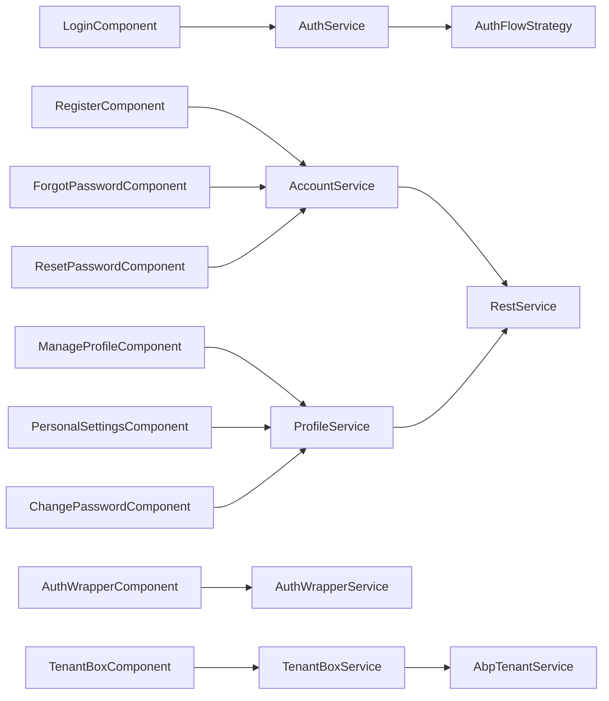
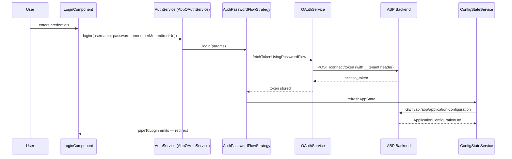

`@abp/ng.account` ships the user-facing screens for the **ABP Framework** Account module — login, register, forgot-password, reset-password, and the manage-profile tabset (personal settings + change password). Its sister package `@abp/ng.account.core` is the headless half: shared services like `AuthWrapperService` and `TenantBoxService`, plus the generated `ProfileService` and `AccountService` HTTP proxies that mirror the C# `Volo.Abp.Account.IProfileAppService` and `IAccountAppService` contracts. Together they cover every account scenario for the password OAuth flow; the Code (OIDC) flow still uses these screens for tenant switching but delegates login itself to the OIDC server. This page walks the routing, components, services, replaceable keys, and the proxy folder.

## Package split

```text packages/account/
├── package.json   # @abp/ng.account
├── config/        # secondary entry "@abp/ng.account/config" — proxy ext provider
└── src/lib/
    ├── account.routes.ts        # createRoutes() + provideAccount()
    ├── account.module.ts        # legacy AccountModule.forLazy()
    ├── account-routing.module.ts
    ├── components/
    │   ├── login/        register/      forgot-password/   reset-password/
    │   ├── manage-profile/             personal-settings/  change-password/
    ├── enums/components.ts      # eAccountComponents replaceable keys
    ├── guards/                  # authenticationFlowGuard, extensions.guard
    ├── resolvers/               # accountExtensionsResolver
    ├── services/                # ManageProfileStateService
    ├── tokens/                  # ACCOUNT_CONFIG_OPTIONS, RE_LOGIN_CONFIRMATION_TOKEN, ...
    ├── models/                  # AccountConfigOptions
    └── utils/                   # accountConfigOptionsFactory, getRedirectUrl
```

```text packages/account-core/
├── package.json   # @abp/ng.account.core
├── src/lib/
│   ├── auth-wrapper.service.ts
│   └── tenant-box.service.ts
└── proxy/                       # secondary entry "@abp/ng.account.core/proxy"
    └── src/lib/proxy/account/
        ├── account.service.ts       # /api/account/register, reset-password, ...
        ├── profile.service.ts       # /api/account/my-profile, change-password
        ├── models.ts                # RegisterDto, ResetPasswordDto, ProfileDto, ...
        └── web/areas/account/controllers/
            ├── account.service.ts   # mirror of the Razor area controller
            └── models/login-result-type.enum.ts
```

Two separate packages exist for a real reason: `@abp/ng.account.core` is consumable by anyone who wants the proxies and the two state services without dragging in the UI components and `@ng-bootstrap` modal dependencies.

## Routing — `createRoutes`

`packages/account/src/lib/account.routes.ts` exports `createRoutes(options)` and `provideAccount(options)`. The recommended setup is to lazy-load via a standalone route in the host app:

```ts
{
  path: 'account',
  loadChildren: () => import('@abp/ng.account').then(m => m.createRoutes()),
}
```

```ts packages/account/src/lib/account.routes.ts
const canActivate = [authenticationFlowGuard];

export const createRoutes = (options: AccountConfigOptions = {}): Routes => [
  {
    path: '',
    component: RouterOutletComponent,
    providers: provideAccount(options),
    children: [
      { path: '', pathMatch: 'full', redirectTo: 'login' },
      {
        path: 'login',
        component: ReplaceableRouteContainerComponent,
        canActivate,
        data: {
          replaceableComponent: {
            key: eAccountComponents.Login,
            defaultComponent: LoginComponent,
          } as ReplaceableComponents.RouteData<LoginComponent>,
        },
        title: 'AbpAccount::Login',
      },
      { path: 'register', /* ... RegisterComponent */ },
      { path: 'forgot-password', /* ... ForgotPasswordComponent */ },
      {
        path: 'reset-password', canActivate: [],
        data: { tenantBoxVisible: false, replaceableComponent: { /* ResetPasswordComponent */ } },
        title: 'AbpAccount::ResetPassword',
      },
      {
        path: 'manage',
        component: ReplaceableRouteContainerComponent,
        canActivate: [authGuard],
        resolve: [accountExtensionsResolver],
        data: { replaceableComponent: { /* ManageProfileComponent */ } },
        title: 'AbpAccount::MyAccount',
      },
    ],
  },
];
```

Every child path uses `ReplaceableRouteContainerComponent` from [core](/angular/core-package). That means the host app can call `replaceableComponents.add({ key: eAccountComponents.Login, component: MyLogin })` to override any of the screens without forking.

| Route | Default component | Replaceable key |
|---|---|---|
| `/account/login` | `LoginComponent` | `Account.LoginComponent` |
| `/account/register` | `RegisterComponent` | `Account.RegisterComponent` |
| `/account/forgot-password` | `ForgotPasswordComponent` | `Account.ForgotPasswordComponent` |
| `/account/reset-password` | `ResetPasswordComponent` | `Account.ResetPasswordComponent` |
| `/account/manage` | `ManageProfileComponent` | `Account.ManageProfileComponent` |

```ts packages/account/src/lib/enums/components.ts
export const enum eAccountComponents {
  Login = 'Account.LoginComponent',
  Register = 'Account.RegisterComponent',
  ForgotPassword = 'Account.ForgotPasswordComponent',
  ResetPassword = 'Account.ResetPasswordComponent',
  ManageProfile = 'Account.ManageProfileComponent',
  TenantBox = 'Account.TenantBoxComponent',
  AuthWrapper = 'Account.AuthWrapperComponent',
  ChangePassword = 'Account.ChangePasswordComponent',
  PersonalSettings = 'Account.PersonalSettingsComponent',
}
```

### `provideAccount`

`provideAccount(options)` registers the runtime configuration tokens used by every component on the route:

```ts packages/account/src/lib/account.routes.ts
export function provideAccount(options: AccountConfigOptions = {}): Provider[] {
  return [
    { provide: ACCOUNT_CONFIG_OPTIONS, useValue: options },
    {
      provide: 'ACCOUNT_OPTIONS',
      useFactory: accountConfigOptionsFactory,
      deps: [ACCOUNT_CONFIG_OPTIONS],
    },
    {
      provide: RE_LOGIN_CONFIRMATION_TOKEN,
      useValue: options.isPersonalSettingsChangedConfirmationActive ?? true,
    },
    {
      provide: ACCOUNT_EDIT_FORM_PROP_CONTRIBUTORS,
      useValue: options.editFormPropContributors,
    },
  ];
}
```

| Token | Source | Purpose |
|---|---|---|
| `ACCOUNT_CONFIG_OPTIONS` | `AccountConfigOptions` | Re-login confirmation, contributor list |
| `RE_LOGIN_CONFIRMATION_TOKEN` | derived | Show "log in again?" confirmation after personal-settings changes |
| `ACCOUNT_EDIT_FORM_PROP_CONTRIBUTORS` | options | Extra props for the personal-settings form |

### `authenticationFlowGuard`

Login/register/forgot-password are gated by `authenticationFlowGuard`, which short-circuits when the OAuth flow is external (Code flow):

```ts packages/account/src/lib/guards/authentication-flow.guard.ts
export const authenticationFlowGuard: CanActivateFn = () => {
  const authService = inject(AuthService);
  if (authService.isInternalAuth) return true;
  authService.navigateToLogin();
  return false;
};
```

`AuthService.isInternalAuth` is `true` for `AuthPasswordFlowStrategy` and `false` for `AuthCodeFlowStrategy` — see [OAuth](/angular/oauth#authflowstrategy-base-class). The Code flow therefore never renders these screens locally; navigation to `/account/login` instead redirects to the OIDC server.

## Login

`LoginComponent` is a thin reactive form that calls `AuthService.login`:

```ts packages/account/src/lib/components/login/login.component.ts
@Component({
  selector: 'abp-login',
  templateUrl: './login.component.html',
  imports: [
    ReactiveFormsModule, RouterLink, LocalizationPipe,
    ButtonComponent, NgxValidateCoreModule, AutofocusDirective,
  ],
})
export class LoginComponent implements OnInit {
  protected fb = inject(UntypedFormBuilder);
  protected toasterService = inject(ToasterService);
  protected authService = inject(AuthService);
  protected configState = inject(ConfigStateService);

  form!: UntypedFormGroup;
  inProgress?: boolean;
  isSelfRegistrationEnabled = true;
  authWrapperKey = eAccountComponents.AuthWrapper;
}
```

Behaviour highlights:

- `authWrapperKey` lets the template pull the replaceable `AuthWrapperComponent` from theme-basic so the tenant box and branding stay consistent across screens.
- The submit handler calls `authService.login({ username, password, rememberMe, redirectUrl })`. Inside the [`AuthPasswordFlowStrategy.login`](/angular/oauth#authpasswordflowstrategy), the call goes to `OAuthService.fetchTokenUsingPasswordFlow` and then through `pipeToLogin`.
- `getRedirectUrl(injector)` (in `utils/auth-utils.ts`) parses `?returnUrl=` from the query string.
- `ConfigStateService.getDeep$('setting.Abp.Account.IsSelfRegistrationEnabled')` controls the visibility of the "Register" link.

## Register

`RegisterComponent` hits the `AccountService.register` endpoint and then auto-signs the user in:

```ts packages/account/src/lib/components/register/register.component.ts
import { AccountService, RegisterDto } from '@abp/ng.account.core/proxy';
// ...
const { maxLength, required, email } = Validators;

@Component({ selector: 'abp-register', /* ... */ })
```

The `RegisterDto` ships with the proxy folder and matches the C# DTO in [Volo.Abp.Account](/modules/account):

```ts packages/account-core/proxy/src/lib/proxy/account/models.ts
export interface RegisterDto {
  appName: string;
  emailAddress: string;
  password: string;
  userName: string;
  extraProperties?: Record<string, object>;
  // ...
}
```

The component imports `getPasswordValidators` from [theme-shared](/angular/theme-shared) so password rules mirror the policy emitted by `ConfigStateService` (min length, uppercase, etc.).

## Forgot / reset password

| Component | Endpoint | DTO |
|---|---|---|
| `ForgotPasswordComponent` | `POST /api/account/send-password-reset-code` | `SendPasswordResetCodeDto` |
| `ResetPasswordComponent` | `POST /api/account/reset-password` | `ResetPasswordDto` |

Both go through `AccountService` in `@abp/ng.account.core/proxy`:

```ts packages/account-core/proxy/src/lib/proxy/account/account.service.ts
@Injectable({ providedIn: 'root' })
export class AccountService {
  private restService = inject(RestService);
  apiName = 'AbpAccount';

  register = (input: RegisterDto) =>
    this.restService.request<any, IdentityUserDto>({
      method: 'POST', url: '/api/account/register', body: input,
    }, { apiName: this.apiName });

  resetPassword = (input: ResetPasswordDto) =>
    this.restService.request<any, void>({
      method: 'POST', url: '/api/account/reset-password', body: input,
    }, { apiName: this.apiName });

  sendPasswordResetCode = (input: SendPasswordResetCodeDto) =>
    this.restService.request<any, void>({
      method: 'POST', url: '/api/account/send-password-reset-code', body: input,
    }, { apiName: this.apiName });
}
```

The `apiName: 'AbpAccount'` key is resolved by [`RestService.getApiFromStore`](/angular/core-package#restservice) into the URL declared under `environment.apis.AbpAccount` (or `apis.default`).

## Manage profile

`ManageProfileComponent` is a tabset that hosts `PersonalSettingsComponent` and `ChangePasswordComponent`. It is the only authenticated screen — guarded by `authGuard` plus `accountExtensionsResolver` to pre-populate the form-prop registry:

```ts packages/account/src/lib/components/manage-profile/manage-profile.component.ts
@Component({
  selector: 'abp-manage-profile',
  templateUrl: './manage-profile.component.html',
  imports: [
    AsyncPipe, ReactiveFormsModule, PersonalSettingsComponent, ChangePasswordComponent,
    LocalizationPipe, ReplaceableTemplateDirective, LoadingDirective,
  ],
})
export class ManageProfileComponent implements OnInit {
  protected profileService = inject(ProfileService);
  protected manageProfileState = inject(ManageProfileStateService);
  selectedTab = 0;
}
```

`ProfileService` lives in the proxy folder and maps to `/api/account/my-profile`:

```ts packages/account-core/proxy/src/lib/proxy/account/profile.service.ts
@Injectable({ providedIn: 'root' })
export class ProfileService {
  private restService = inject(RestService);
  apiName = 'AbpAccount';

  changePassword = (input: ChangePasswordInput) =>
    this.restService.request<any, void>({
      method: 'POST', url: '/api/account/my-profile/change-password', body: input,
    }, { apiName: this.apiName });

  get = () =>
    this.restService.request<any, ProfileDto>({
      method: 'GET', url: '/api/account/my-profile',
    }, { apiName: this.apiName });

  update = (input: UpdateProfileDto) =>
    this.restService.request<any, ProfileDto>({
      method: 'PUT', url: '/api/account/my-profile', body: input,
    }, { apiName: this.apiName });
}
```

### `ManageProfileStateService`

A local state holder shared between the personal-settings and change-password tabs:

- caches the current `ProfileDto`
- broadcasts profile updates so the navbar avatar re-renders
- exposes a `setProfile` / `getProfile$` pair

### Extensible personal settings

`PersonalSettingsComponent` uses the `EXTENSIONS_IDENTIFIER` mechanism from [components](/angular/components#extensionsservice). The matching contributor token is `ACCOUNT_EDIT_FORM_PROP_CONTRIBUTORS`, populated by `provideAccount`. `accountExtensionsResolver` runs before the route activates to populate `ExtensionsService.editFormProps`.

## `@abp/ng.account.core` — headless half

### `AuthWrapperService`

`AuthWrapperService` is the cross-cutting layer powering the tenant box on every account screen. It surfaces three reactive flags:

```ts packages/account-core/src/lib/auth-wrapper.service.ts
@Injectable()
export class AuthWrapperService {
  readonly multiTenancy = inject(MultiTenancyService);
  private configState = inject(ConfigStateService);

  isMultiTenancyEnabled$ = this.configState.getDeep$('multiTenancy.isEnabled');

  get enableLocalLogin$(): Observable<boolean> {
    return this.configState
      .getSetting$('Abp.Account.EnableLocalLogin')
      .pipe(map(value => value?.toLowerCase() !== 'false'));
  }

  tenantBoxKey = 'Account.TenantBoxComponent';
  route: ActivatedRoute;

  get isTenantBoxVisibleForCurrentRoute() {
    return this.getMostInnerChild().data.tenantBoxVisible ?? true;
  }

  get isTenantBoxVisible() {
    return this.isTenantBoxVisibleForCurrentRoute && this.multiTenancy.isTenantBoxVisible;
  }
}
```

Notice the `reset-password` route in `createRoutes` sets `tenantBoxVisible: false` — that flag is what `isTenantBoxVisibleForCurrentRoute` reads.

### `TenantBoxService`

`TenantBoxService` powers the "Switch Tenant" modal and calls `AbpTenantService.findTenantByName` (from [core](/angular/core-package)) to validate the entered tenant name before persisting it via `SessionStateService`:

```ts packages/account-core/src/lib/tenant-box.service.ts
@Injectable()
export class TenantBoxService {
  private toasterService = inject(ToasterService);
  private tenantService = inject(AbpTenantService);
  private sessionState = inject(SessionStateService);
  private configState = inject(ConfigStateService);

  currentTenant$ = this.sessionState.getTenant$();

  onSwitch() {
    const tenant = this.sessionState.getTenant();
    this.name = tenant?.name || '';
    this.isModalVisible = true;
  }

  save() {
    if (!this.name) {
      this.setTenant(null);
      this.isModalVisible = false;
      return;
    }
    this.modalBusy = true;
    this.tenantService /* findTenantByName(this.name) ... */
  }
}
```

### Proxy modules

The `proxy/` ng-package compiles to `@abp/ng.account.core/proxy` and ships:

| Class | Endpoint surface |
|---|---|
| `AccountService` | `/api/account/{register, reset-password, send-password-reset-code}` |
| `ProfileService` | `/api/account/my-profile{, /change-password}` |
| Razor area controller proxy | `LoginResultType` enum + login/cancel endpoints mirroring `Volo.Abp.Account.Web` |

Models in `models.ts` mirror the DTOs from the C# `Volo.Abp.Account.Application.Contracts` project. See [/modules/account](/modules/account) for the server side.

## Component → service map



## End-to-end password login



## Customisation hooks

| Need | Hook |
|---|---|
| Replace the login screen | `replaceableComponents.add({ key: eAccountComponents.Login, component: MyLogin })` |
| Add a custom field to "Personal Settings" | Implement `editFormPropContributors` and pass via `createRoutes({ editFormPropContributors })` |
| Suppress the tenant box on a route | `route.data.tenantBoxVisible = false` |
| Disable self-registration | Server-side `Abp.Account.IsSelfRegistrationEnabled = false` (consumed via `ConfigStateService`) |
| Re-login confirmation after profile change | `provideAccount({ isPersonalSettingsChangedConfirmationActive: true })` |
| Change "My Account" link target | Replace `NAVIGATE_TO_MANAGE_PROFILE` (default set by [OAuth](/angular/oauth#navigatetomanageprofileprovider)) |

## Cross-links

- [OAuth](/angular/oauth) — `AuthService.login` and the password flow strategy that backs `LoginComponent`.
- [Core](/angular/core-package) — `ReplaceableRouteContainerComponent`, `RestService`, `ConfigStateService`, `MultiTenancyService`.
- [Theme Basic](/angular/theme-basic) — `AccountLayoutComponent` hosts these screens.
- [Theme Shared](/angular/theme-shared) — `ButtonComponent`, `ToasterService`, password validators.
- [Identity module](/modules/identity) — Backing user store.
- [Account module](/modules/account) — Server-side `IAccountAppService` / `IProfileAppService`.
- [HTTP](/http/overview) — Pipeline that consumes `apiName: 'AbpAccount'`.
- [ASP.NET Core MVC](/aspnetcore/mvc) — Hosts `/api/account/*` endpoints.
