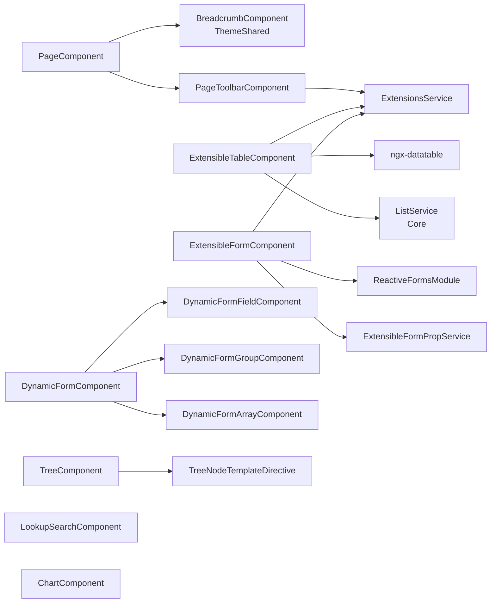

`@abp/ng.components` is a multi-entry-point npm package that ships the reusable, theme-agnostic UI building blocks used by every ABP Framework admin module — page wrapper, dynamic forms, the extensible table/form pair that powers all CRUD pages, hierarchical tree, lookup search input, and a chart.js wrapper. Unlike most other libraries, its root `src/public-api.ts` is empty: consumers import from sub-paths like `@abp/ng.components/page` or `@abp/ng.components/extensible`. This page covers each of the six entry points, the components they expose, and how `@abp/ng.identity` and `@abp/ng.tenant-management` consume them.

## Entry points

```text packages/components/
chart.js/      → "@abp/ng.components/chart.js"
dynamic-form/  → "@abp/ng.components/dynamic-form"
extensible/    → "@abp/ng.components/extensible"
lookup/        → "@abp/ng.components/lookup"
page/          → "@abp/ng.components/page"
tree/          → "@abp/ng.components/tree"
src/public-api.ts   # empty barrel — does nothing on purpose
```

Each folder owns its own `ng-package.json` that ng-packagr turns into a [secondary entry point](https://github.com/ng-packagr/ng-packagr/blob/main/docs/secondary-entrypoints.md). The result is six independent ES modules under one npm package, all standalone-component–based.

```ts packages/components/src/public-api.ts
/*
 * Public API Surface of components
 */
export {};
```

<Tip>Because nothing lives at the root, `import { PageComponent } from '@abp/ng.components'` will fail at build time. Always import via the secondary path.</Tip>

## `@abp/ng.components/page` — `PageComponent`

`packages/components/page/src/page.component.ts` exports the layout shell every admin screen uses. It composes a `BreadcrumbComponent` from [theme-shared](/angular/theme-shared) and a `PageToolbarComponent` from `extensible`, and accepts three content-projection slots through `<abp-page-title>`, `<abp-page-breadcrumb>`, and `<abp-page-toolbar>`:

```ts packages/components/page/src/page.component.ts
@Component({
  selector: 'abp-page',
  templateUrl: './page.component.html',
  encapsulation: ViewEncapsulation.None,
  imports: [BreadcrumbComponent, PageToolbarComponent, PagePartDirective],
})
export class PageComponent {
  readonly title = input<string | undefined>(undefined);
  readonly toolbarInput = input<any>(undefined, { alias: 'toolbar' });
  readonly breadcrumb = input(true);

  protected readonly toolbarVisible = signal(false);
  protected readonly toolbarData = signal<any>(undefined);

  pageParts = {
    title: PageParts.title,
    breadcrumb: PageParts.breadcrumb,
    toolbar: PageParts.toolbar,
  };

  readonly customTitle = contentChild(PageTitleContainerComponent);
  readonly customBreadcrumb = contentChild(PageBreadcrumbContainerComponent);
  readonly customToolbar = contentChild(PageToolbarContainerComponent);
}
```

`PagePartDirective`, defined in `page-part.directive.ts`, marks a slot inside the template so the page can decide whether to render the default toolbar or the custom one. The three projection wrappers (`PageTitleContainerComponent`, `PageBreadcrumbContainerComponent`, `PageToolbarContainerComponent`) live in `page-parts.component.ts`.

Typical usage from a feature component:

```html
<abp-page [title]="'AbpIdentity::Users' | abpLocalization">
  <abp-page-toolbar>
    <button class="btn btn-primary" (click)="add()">+ New</button>
  </abp-page-toolbar>
  <!-- table goes here -->
</abp-page>
```

The breadcrumb is automatically built from `RoutesService` — see the `BreadcrumbComponent` in [theme-shared](/angular/theme-shared#breadcrumb).

## `@abp/ng.components/extensible` — the CRUD engine

`packages/components/extensible/src/lib/` is the largest entry point. It contains the table + form pair plus the action/toolbar/property extension system that lets host apps inject columns, fields, and actions into framework-shipped pages without forking them.

```text extensible/src/lib/
components/
  abstract-actions/       AbstractActionsComponent (DRY for grid/toolbar actions)
  date-time-picker/       ExtensibleDateTimePickerComponent
  extensible-form/        ExtensibleFormComponent, ExtensibleFormPropComponent
  extensible-table/       ExtensibleTableComponent, ExtensibleTableRowDetailComponent
  grid-actions/           GridActionsComponent
  multi-select/           ExtensibleFormMultiselectComponent
  page-toolbar/           PageToolbarComponent
directives/               PropDataDirective
models/                   actions, entity-actions, entity-props, form-props, toolbar-actions
pipes/                    CreateInjectorPipe
services/                 ExtensionsService, ExtensibleFormPropService
tokens/                   EXTENSIONS_IDENTIFIER, EXTENSIONS_ACTION_TYPE
extensible.module.ts
```

### `ExtensionsService`

`ExtensionsService` is the singleton registry. It owns five factories — one per extension surface — keyed by an identifier the consuming page declares via `EXTENSIONS_IDENTIFIER`:

```ts packages/components/extensible/src/lib/services/extensions.service.ts
@Injectable({ providedIn: 'root' })
export class ExtensionsService<R = any> {
  readonly entityActions = new EntityActionsFactory<R>();
  readonly toolbarActions = new ToolbarActionsFactory<R[]>();
  readonly entityProps = new EntityPropsFactory<R>();
  readonly createFormProps = new CreateFormPropsFactory<R>();
  readonly editFormProps = new EditFormPropsFactory<R>();
}
```

A page (for example `UsersComponent`) declares the identifier in its `providers`:

```ts
providers: [
  ListService,
  { provide: EXTENSIONS_IDENTIFIER, useValue: eIdentityComponents.Users },
],
```

…and `AbstractActionsComponent` pulls the matching action list from the service:

```ts packages/components/extensible/src/lib/components/abstract-actions/abstract-actions.component.ts
@Directive()
export abstract class AbstractActionsComponent<
  L extends ActionList<any, InferredAction<L>>,
> extends ActionData<InferredRecord<L>> {
  readonly actionList: L;

  protected constructor() {
    const injector = inject(Injector);
    super();
    const extensions = injector.get(ExtensionsService);
    const name = injector.get(EXTENSIONS_IDENTIFIER);
    const type = injector.get(EXTENSIONS_ACTION_TYPE);
    this.actionList = extensions[type].get(name).actions as unknown as L;
  }
}
```

The contribution surfaces are:

| Surface | Factory | Token consumed by host module |
|---|---|---|
| Row actions menu | `EntityActionsFactory` | `IDENTITY_ENTITY_ACTION_CONTRIBUTORS`, … |
| Toolbar buttons | `ToolbarActionsFactory` | `IDENTITY_TOOLBAR_ACTION_CONTRIBUTORS`, … |
| Table columns | `EntityPropsFactory` | `IDENTITY_ENTITY_PROP_CONTRIBUTORS`, … |
| Create form fields | `CreateFormPropsFactory` | `IDENTITY_CREATE_FORM_PROP_CONTRIBUTORS`, … |
| Edit form fields | `EditFormPropsFactory` | `IDENTITY_EDIT_FORM_PROP_CONTRIBUTORS`, … |

The token names follow the pattern `<MODULE>_<SURFACE>_CONTRIBUTORS` and are read by each module's `extensions.guard.ts` / resolver — for example `packages/identity/src/lib/guards/extensions.guard.ts` and `packages/identity/src/lib/resolvers/extensions.resolver.ts`.

### `ExtensibleTableComponent`

The table is a thin layer over [`@swimlane/ngx-datatable`](https://swimlane.github.io/ngx-datatable/). It reads `EntityPropsFactory.get(identifier).props` from `ExtensionsService`, maps each contributed prop to a column, and rebinds rows from a `ListService` instance:

```ts packages/components/extensible/src/lib/components/extensible-table/extensible-table.component.ts
import {
  ChangeDetectionStrategy, ChangeDetectorRef, Component, computed, inject, Injector,
  LOCALE_ID, OnDestroy, PLATFORM_ID, signal, TemplateRef, TrackByFunction, input, effect,
  output, contentChild, viewChild,
} from '@angular/core';
import { NgxDatatableModule, SelectionType, DatatableComponent } from '@swimlane/ngx-datatable';
import { ABP, ConfigStateService, /* ... */ } from '@abp/ng.core';
```

The `[list]` input binds a `ListService` so the table picks up search/page/sort automatically; the `[recordsCount]` input feeds the paginator footer. The component dispatches row-action selections through `GridActionsComponent`, which extends `AbstractActionsComponent`.

### `ExtensibleFormComponent` + `generateFormFromProps`

The form counterpart turns `CreateFormPropsFactory.get(identifier).props` into a reactive `UntypedFormGroup`:

```ts
const data = new FormPropData(this.injector, this.selected);
this.form = generateFormFromProps(data);
```

`generateFormFromProps` is exported from `components/extensible/src/public-api.ts`. `ExtensibleFormPropComponent` renders each contributed prop in the order it was added by the contributors.

### How identity wires extensible

The `UsersComponent` in `packages/identity/src/lib/components/users/users.component.ts` is the canonical example — it imports everything we just covered:

```ts packages/identity/src/lib/components/users/users.component.ts
import {
  ExtensibleFormComponent,
  ExtensibleTableComponent,
  EXTENSIONS_IDENTIFIER,
  FormPropData,
  generateFormFromProps,
} from '@abp/ng.components/extensible';
import { PageComponent } from '@abp/ng.components/page';

@Component({
  selector: 'abp-users',
  templateUrl: './users.component.html',
  providers: [
    ListService,
    { provide: EXTENSIONS_IDENTIFIER, useValue: eIdentityComponents.Users },
  ],
  imports: [
    PermissionManagementComponent, PageComponent, NgbDropdownModule, NgbNavModule,
    NgxValidateCoreModule, LocalizationPipe, ExtensibleTableComponent, ModalComponent,
    ExtensibleFormComponent, FormCheckboxComponent,
    /* ... */
  ],
})
export class UsersComponent { /* ... */ }
```

## `@abp/ng.components/dynamic-form` — `DynamicFormComponent`

`dynamic-form` is the schema-driven form builder (independent of the extensible CRUD engine). It accepts a `FormFieldConfig[]` array and renders the matching reactive controls.

```ts packages/components/dynamic-form/src/dynamic-form.component.ts
@Component({
  selector: 'abp-dynamic-form',
  templateUrl: './dynamic-form.component.html',
  styleUrls: ['./dynamic-form.component.scss'],
  host: { class: 'abp-dynamic-form' },
  changeDetection: ChangeDetectionStrategy.OnPush,
  exportAs: 'abpDynamicForm',
  imports: [
    CommonModule, DynamicFormFieldComponent, DynamicFormGroupComponent,
    DynamicFormArrayComponent, ReactiveFormsModule, DynamicFieldHostComponent,
  ],
})
export class DynamicFormComponent implements OnInit {
  fields = input<FormFieldConfig[]>([]);
  values = input<Record<string, any>>();
  submitButtonText = input<string>('Submit');
  submitInProgress = input<boolean>(false);
  showCancelButton = input<boolean>(false);
  onSubmit = output<any>();
  formCancel = output<void>();
}
```

`FormFieldConfig` (in `dynamic-form.models.ts`) defines the schema vocabulary:

```ts packages/components/dynamic-form/src/dynamic-form.models.ts
export interface FormFieldConfig<T = any> {
  key: string;
  type: 'text' | 'email' | 'number' | 'select' | 'checkbox' | 'date'
      | 'textarea' | 'datetime-local' | 'time' | 'password' | 'tel'
      | 'url' | 'radio' | 'file' | 'range' | 'color' | 'group' | 'array';
  label: string;
  validators?: ValidatorConfig[];
  conditionalLogic?: ConditionalRule[];
  order?: number;
  gridSize?: number;
  children?: FormFieldConfig[];
  // ...
}
```

Conditional logic is interpreted by `ConditionalRule` entries that link a child field to a parent (`dependsOn` + `condition` + `action`). The form re-evaluates visibility/enabled state when the parent changes.

The three sub-components handle each container type:

| Field type | Component |
|---|---|
| primitives | `DynamicFormFieldComponent` |
| `group` | `DynamicFormGroupComponent` |
| `array` | `DynamicFormArrayComponent` |
| custom `component` | `DynamicFieldHostComponent` (uses `NgComponentOutlet`) |

## `@abp/ng.components/tree` — `TreeComponent`

`TreeModule` exports three pieces:

```ts packages/components/tree/src/lib/tree.module.ts
@NgModule({
  imports: [TreeComponent, TreeNodeTemplateDirective, ExpandedIconTemplateDirective],
  exports: [TreeComponent, TreeNodeTemplateDirective, ExpandedIconTemplateDirective],
  declarations: [],
})
export class TreeModule {}
```

| Symbol | Purpose |
|---|---|
| `TreeComponent` | Recursive tree renderer with selection + expansion |
| `TreeNodeTemplateDirective` | Slot to override how each node is rendered |
| `ExpandedIconTemplateDirective` | Slot for the expand/collapse icon |

The tree backs the **Organization Units** screen in `@abp/ng.identity` and the **Menu Items** screen in `@abp/ng.cms-kit`. A `DISABLE_TREE_STYLE_LOADING` token (`disable-tree-style-loading.token.ts`) lets a host theme suppress automatic CSS injection so it can supply its own.

## `@abp/ng.components/lookup` — `LookupSearchComponent`

`packages/components/lookup/src/lib/lookup-search.component.ts` exposes a typeahead-style input that calls a user-supplied async search function:

```ts packages/components/lookup/src/lib/lookup-search.component.ts
export interface LookupItem {
  key: string;
  displayName: string;
  [key: string]: unknown;
}
export type LookupSearchFn<T = LookupItem> = (filter: string) => Observable<T[]>;

@Component({
  selector: 'abp-lookup-search',
  templateUrl: './lookup-search.component.html',
  styleUrl: './lookup-search.component.scss',
  imports: [FormsModule, LocalizationPipe, NgTemplateOutlet],
  changeDetection: ChangeDetectionStrategy.OnPush,
})
export class LookupSearchComponent<T extends LookupItem = LookupItem> implements OnInit {
  readonly label = input<string>();
  readonly placeholder = input<string>('');
  readonly debounceTime = input<number>(300);
  // ...
}
```

Tenant pickers, role pickers, and the country lookup in CMS Kit are all instances of this component.

## `@abp/ng.components/chart.js` — `ChartComponent`

The chart entry point is the smallest in the package:

```ts packages/components/chart.js/src/chart.module.ts
@NgModule({
  imports: [ChartComponent],
  exports: [ChartComponent],
  declarations: [],
  providers: [],
})
export class ChartModule {}
```

`ChartComponent` wraps [Chart.js](https://www.chartjs.org/) and accepts `[type]`, `[data]`, and `[options]` inputs. `widget-utils.ts` in the same folder builds the standard ABP dashboard widget bindings; the same component is reused by [Audit Logging](/modules/identity) dashboards and the CMS Kit blog stats widget.

## Component dependency map



## Module wiring (legacy path)

`extensible/src/lib/extensible.module.ts` is still exported for non-standalone apps but every component inside is already standalone:

```ts packages/components/extensible/src/lib/extensible.module.ts
@NgModule({
  declarations: [],
  imports: [
    CoreModule, ThemeSharedModule, NgxValidateCoreModule,
    NgbDatepickerModule, NgbDropdownModule, NgbTimepickerModule,
    NgbTypeaheadModule, NgbTooltipModule,
    DisabledDirective,
    ExtensibleDateTimePickerComponent, ExtensibleFormPropComponent,
    GridActionsComponent, PropDataDirective, PageToolbarComponent,
    CreateInjectorPipe, ExtensibleFormComponent, ExtensibleTableComponent,
    ExtensibleTableRowDetailComponent, ExtensibleFormMultiselectComponent,
  ],
  exports: [/* importWithExport */],
})
export class ExtensibleModule {}
```

`PageModule`, `TreeModule`, and `ChartModule` follow the same minimal style. New apps should import the standalone components directly.

## Cross-links

- [Core](/angular/core-package) — supplies `ListService`, `LocalizationPipe`, `ReplaceableTemplateDirective` used here.
- [Theme Shared](/angular/theme-shared) — provides `BreadcrumbComponent`, `ButtonComponent`, `ModalComponent`.
- [Identity](/angular/identity) — full consumer example using extensible table + form.
- [HTTP](/http/overview) — the `RestService` calls behind every `ListService`.
- [ASP.NET Core MVC](/aspnetcore/mvc) — server side that returns paged results to `ListService`.
