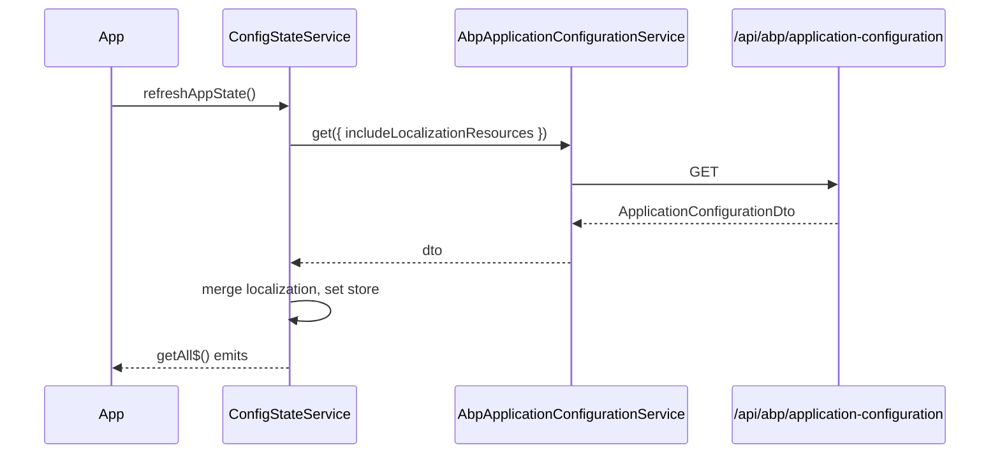
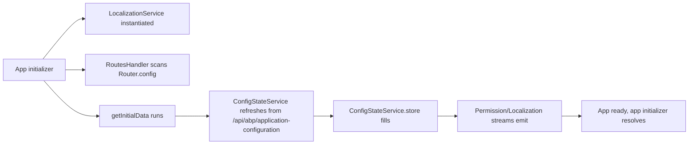

`@abp/ng.core` is the foundation library every other `@abp/ng.*` package depends on. It provides the application-wide DI graph for the **ABP Framework** Angular UI: configuration state, environment, REST plumbing, localization, permissions, routing extensions, HTTP interceptors, guards, abstract auth contracts, and the `provideAbpCore(...features)` factory used at `bootstrapApplication` time. This page walks every directory under `npm/ng-packs/packages/core/src/lib`, identifies the symbols that the public API surfaces in `src/public-api.ts`, and shows how the pieces wire together.

## Package layout

```text packages/core/src/lib/
abstracts/        # AuthService contract, AuthGuard, NgModelComponent, error filters
clients/          # ExternalHttpClient (skips ABP interceptors)
components/       # DynamicLayoutComponent, ReplaceableRouteContainerComponent, RouterOutletComponent
constants/        # CONTENT_STRATEGY, DEFAULT_DYNAMIC_LAYOUTS, eLayoutType
core.module.ts    # BaseCoreModule (legacy forRoot path) + standalone exports
directives/       # abpPermission, abpFor, abpAutofocus, abpFormSubmit, ...
enums/            # eLayoutType, eAuthFlow, etc.
guards/           # PermissionGuard / permissionGuard
handlers/         # RoutesHandler (collects Route.data.routes into RoutesService)
interceptors/     # ApiInterceptor, timezoneInterceptor, transferStateInterceptor
localization.module.ts
models/           # ABP namespace types, environment models, rest models, ...
pipes/            # abpLocalization, async-localization, short-date, safe-html, ...
proxy/            # Generated DTOs/services for application-configurations & multi-tenancy
providers/        # provideAbpCore, withOptions, withTitleStrategy, ...
services/         # ConfigStateService, EnvironmentService, RestService, ...
strategies/       # CONTENT_STRATEGY (append/replace), DOM_STRATEGY, ...
tokens/           # CORE_OPTIONS, TENANT_KEY, LOCALIZATIONS, QUEUE_MANAGER, ...
utils/            # internal-store, route-utils, tree-utils, localization-utils, ...
validators/       # range, url, username, age, credit-card validators
```

The public re-export list is concise — `src/public-api.ts` simply forwards every barrel:

```ts packages/core/src/public-api.ts
export * from './lib/abstracts';
export * from './lib/components';
export * from './lib/constants';
export * from './lib/core.module';
export * from './lib/directives';
export * from './lib/enums';
export * from './lib/guards';
export * from './lib/localization.module';
export * from './lib/models';
export * from './lib/pipes';
export * from './lib/providers';
export * from './lib/proxy/pages/abp/multi-tenancy';
export * from './lib/proxy/volo/abp/asp-net-core/mvc/api-exploring';
export * from './lib/proxy/volo/abp/asp-net-core/mvc/application-configurations';
export * from './lib/proxy/volo/abp/asp-net-core/mvc/application-configurations/object-extending';
export * from './lib/proxy/volo/abp/asp-net-core/mvc/multi-tenancy';
export * from './lib/proxy/volo/abp/http/modeling';
export * from './lib/proxy/volo/abp/localization';
export * from './lib/proxy/volo/abp/models';
export * from './lib/services';
export * from './lib/strategies';
export * from './lib/tokens';
export * from './lib/utils';
export * from './lib/validators';
export * from './lib/interceptors';
export * from './lib/clients';
```

## `provideAbpCore` — the entry factory

Modern apps wire core through `provideAbpCore(...features)`, which lives at `packages/core/src/lib/providers/core-module-config.provider.ts`. The factory returns `EnvironmentProviders` and registers Angular's `HttpClient`, the localization stream initializer, the routes handler, and the default queue:

```ts packages/core/src/lib/providers/core-module-config.provider.ts
export function provideAbpCore(...features: CoreFeature<CoreFeatureKind>[]) {
  const providers = [
    provideHttpClient(
      withInterceptorsFromDi(),
      withXsrfConfiguration({
        cookieName: 'XSRF-TOKEN',
        headerName: 'RequestVerificationToken',
      }),
      withFetch(),
      withInterceptors([transferStateInterceptor, timezoneInterceptor]),
    ),
    provideAppInitializer(async () => {
      inject(LocalizationService);
      inject(LocalStorageListenerService);
      inject(RoutesHandler);
      const options = inject(CORE_OPTIONS);
      if (options?.uiLocalization?.enabled) {
        inject(UILocalizationService);
      }
      await getInitialData();
    }),
    LocaleProvider,
    CookieLanguageProvider,
    { provide: SORT_COMPARE_FUNC, useFactory: compareFuncFactory },
    { provide: QUEUE_MANAGER, useClass: DefaultQueueManager },
    AuthErrorFilterService,
    IncludeLocalizationResourcesProvider,
    { provide: TitleStrategy, useExisting: AbpTitleStrategy },
  ];

  for (const feature of features) {
    providers.push(...feature.ɵproviders);
  }
  return makeEnvironmentProviders(providers);
}
```

The companion `withOptions(options)` feature pushes the runtime ABP config (`environment.ts`) into DI under the `CORE_OPTIONS` token and seeds the multi-tenancy header name (`TENANT_KEY`):

```ts packages/core/src/lib/providers/core-module-config.provider.ts
export function withOptions(options = {} as ABP.Root): CoreFeature<CoreFeatureKind.Options> {
  return makeCoreFeature(CoreFeatureKind.Options, [
    { provide: 'CORE_OPTIONS', useValue: options },
    { provide: CORE_OPTIONS, useFactory: coreOptionsFactory, deps: ['CORE_OPTIONS'] },
    { provide: TENANT_KEY, useValue: options.tenantKey || '__tenant' },
    {
      provide: LOCALIZATIONS, multi: true,
      useValue: localizationContributor(options.localizations),
      deps: [LocalizationService],
    },
    { provide: OTHERS_GROUP, useValue: options.othersGroup || 'AbpUi::OthersGroup' },
    { provide: DYNAMIC_LAYOUTS_TOKEN, useValue: options.dynamicLayouts || DEFAULT_DYNAMIC_LAYOUTS },
  ]);
}
```

There is also `provideAbpCoreChild(options)` for lazy feature modules — it merely contributes additional `LOCALIZATIONS` without re-registering the global HTTP stack.

<Info>The legacy `CoreModule.forRoot()` path remains in `core.module.ts` but `BaseCoreModule` only re-exports shared directives, pipes, and components for template usage — it does not register providers anymore. New code should always prefer `provideAbpCore`.</Info>

### Feature flags

`withOptions`, `withTitleStrategy`, and `withCompareFuncFactory` are members of a tagged-union type `CoreFeature<KindT>` keyed by `CoreFeatureKind`. The shape mirrors Angular's own `provideRouter` API:

| Feature | Token affected | Default |
|---|---|---|
| `withOptions` | `CORE_OPTIONS`, `TENANT_KEY`, `LOCALIZATIONS`, `OTHERS_GROUP`, `DYNAMIC_LAYOUTS_TOKEN` | empty `ABP.Root` |
| `withTitleStrategy(strategy)` | `TitleStrategy` (Angular Router) | `AbpTitleStrategy` |
| `withCompareFuncFactory(fn)` | `SORT_COMPARE_FUNC` | `compareFuncFactory` (locale-aware) |

## Services tour

`packages/core/src/lib/services/` holds ~30 injectables, almost all `providedIn: 'root'`. The non-root one (`SubscriptionService`) is component-scoped on purpose. Highlights:

| Service | File | Responsibility |
|---|---|---|
| `ConfigStateService` | `config-state.service.ts` | Caches `ApplicationConfigurationDto`, exposes reactive slices |
| `EnvironmentService` | `environment.service.ts` | Wraps `environment.ts` constants (`apis`, `oAuthConfig`) |
| `PermissionService` | `permission.service.ts` | Evaluates policy strings against granted policies, supports `&&` / `\|\|` |
| `LocalizationService` | `localization.service.ts` | Reactive `instant`/`get` for resource keys, language switching |
| `RestService` | `rest.service.ts` | Universal HTTP wrapper that resolves API URL by `apiName` |
| `RoutesService` | `routes.service.ts` | Tree of `ABP.Route` entries powering menus and breadcrumbs |
| `SubscriptionService` | `subscription.service.ts` | RxJS `Subscription` bag tied to `OnDestroy` |
| `HttpWaitService` | `http-wait.service.ts` | Tracks in-flight requests for the loader bar |
| `HttpErrorReporterService` | `http-error-reporter.service.ts` | `Subject<HttpErrorResponse>` consumed by `theme-shared` handlers |
| `ListService` | `list.service.ts` | Paged-list state machine used by every CRUD table |
| `MultiTenancyService` | `multi-tenancy.service.ts` | Resolves the current tenant from cookie/URL |
| `SessionStateService` | `session-state.service.ts` | Persists tenant + language across reloads |
| `TimezoneService` / `TimeService` | `timezone.service.ts`, `time.service.ts` | Server-local time conversion (used by `timezoneInterceptor`) |
| `LazyLoadService` | `lazy-load.service.ts` | Loads stylesheets / scripts at runtime |
| `ReplaceableComponentsService` | `replaceable-components.service.ts` | Registry that powers `abpReplaceableTemplate` |

### `ConfigStateService`

`ConfigStateService` is a thin reactive wrapper around `InternalStore<ApplicationConfigurationDto>`. Every other service depends on it for auth / localization / current user state. The DTO is fetched from `/api/abp/application-configuration` via the generated `AbpApplicationConfigurationService` proxy:

```ts packages/core/src/lib/services/config-state.service.ts
@Injectable({ providedIn: 'root' })
export class ConfigStateService {
  private abpConfigService = inject(AbpApplicationConfigurationService);
  private abpApplicationLocalizationService = inject(AbpApplicationLocalizationService);
  private environmentService = inject(EnvironmentService);
  private readonly includeLocalizationResources = inject(INCUDE_LOCALIZATION_RESOURCES_TOKEN, { optional: true });

  private updateSubject = new Subject<void>();
  private readonly store = new InternalStore({} as ApplicationConfigurationDto);

  setState(config: ApplicationConfigurationDto) { this.store.set(config); }
  ...
}
```

Consumers read state either as snapshots (`configState.getAll()`) or as streams (`configState.getAll$()`, `configState.getDeep$('auth.grantedPolicies')`, `configState.getSetting$('Abp.Localization.DefaultLanguage')`). The data flow:



### `EnvironmentService`

`EnvironmentService` is a stateless `InternalStore<Environment>`. The environment shape comes from `environment.ts` in the host application and includes `apis` (a record of API endpoints) plus `oAuthConfig`. The `getApiUrl(key)` lookup falls back to `apis.default`:

```ts packages/core/src/lib/services/environment.service.ts
const mapToApiUrl = (key: string | undefined) => (apis: Apis) =>
  ((key && apis[key]) || apis.default).url || apis.default.url;

@Injectable({ providedIn: 'root' })
export class EnvironmentService {
  private readonly store = new InternalStore({} as Environment);

  getApiUrl(key: string | undefined) {
    return mapToApiUrl(key)(this.store.state?.apis);
  }
  getIssuer() {
    const issuer = this.store.state?.oAuthConfig?.issuer;
    return mapToIssuer(issuer);
  }
}
```

### `PermissionService`

`PermissionService` evaluates policy expressions used by both the `permissionGuard` and the `*abpPermission` structural directive. The grammar is intentionally limited to a single operator per expression (mixing `&&` and `||` is explicitly not supported):

```ts packages/core/src/lib/services/permission.service.ts
protected isPolicyGranted(key: string | undefined, grantedPolicies: Record<string, boolean>) {
  if (!key) return true;
  const orRegexp = /\|\|/g;
  const andRegexp = /&&/g;
  // TODO: Allow combination of ANDs & ORs
  if (orRegexp.test(key)) {
    const keys = key.split('||').filter(Boolean);
    if (keys.length < 2) return false;
    return keys.some(k => this.getPolicy(k.trim(), grantedPolicies));
  } else if (andRegexp.test(key)) {
    const keys = key.split('&&').filter(Boolean);
    if (keys.length < 2) return false;
    return keys.every(k => this.getPolicy(k.trim(), grantedPolicies));
  }
  return this.getPolicy(key, grantedPolicies);
}
```

The companion `filterItemsByPolicy(items)` and `filterItemsByPolicy$(items)` helpers are used by menu rendering — see `theme-basic`'s `NavItemsComponent`.

### `RestService`

`RestService` is the single HTTP boundary used by every generated proxy. It picks the API base URL from `EnvironmentService.getApiUrl(config.apiName)`, then routes the request through either the standard `HttpClient` or the `ExternalHttpClient` based on `Rest.Config.skipAddingHeader`:

```ts packages/core/src/lib/services/rest.service.ts
@Injectable({ providedIn: 'root' })
export class RestService {
  protected options = inject<ABP.Root>(CORE_OPTIONS);
  protected http = inject(HttpClient);
  protected externalHttp = inject(ExternalHttpClient);
  protected environment = inject(EnvironmentService);
  protected httpErrorReporter = inject(HttpErrorReporterService);

  request<T, R>(
    request: HttpRequest<T> | Rest.Request<T>,
    config?: Rest.Config,
    api?: string,
  ): Observable<R> {
    config = config || ({} as Rest.Config);
    api = api || this.getApiFromStore(config.apiName);
    const { method, params, ...options } = request;
    const { observe = Rest.Observe.Body, skipHandleError, responseType = Rest.ResponseType.JSON } = config;
    const url = this.removeDuplicateSlashes(api + request.url);
    const httpClient: HttpClient = this.getHttpClient(config.skipAddingHeader);
    return httpClient
      .request<R>(method, url, { /* ... */ } as any)
      .pipe(catchError(err => (skipHandleError ? throwError(() => err) : this.handleError(err))));
  }
}
```

`config.apiName` matches a key in `environment.ts → apis`. ABP's default proxy classes pass an `apiName` derived from the C# `[RemoteService]` attribute on the backend service.

### `RoutesService`

`RoutesService` extends an internal `AbstractTreeService` to maintain a tree of `ABP.Route` entries — the source of truth for the side nav and breadcrumb. Entries are contributed lazily through `routesService.add([...])`, `addGroup`, or `addChildren`:

```ts packages/core/src/lib/services/routes.service.ts
@Injectable({ providedIn: 'root' })
export class RoutesService extends AbstractTreeService<ABP.Route> {
  id = 'name';
  parentId = 'parentName';
  hide = (route: ABP.Route) => !!route.invisible;
  sort = (a, b) => /* uses SORT_COMPARE_FUNC */;
}
```

The `RoutesHandler` runs on `provideAppInitializer` (registered by `provideAbpCore`) to harvest any `data.routes` declarations from the `Router.config`:

```ts packages/core/src/lib/handlers/routes.handler.ts
@Injectable({ providedIn: 'root' })
export class RoutesHandler {
  private routes = inject(RoutesService);
  private router = inject(Router, { optional: true })!;

  constructor() { this.addRoutes(); }

  addRoutes() {
    (this.router?.config as RouteData[])?.forEach(({ path = '', data }) => {
      const routes = data?.routes;
      if (!routes) return;
      if (Array.isArray(routes)) this.routes.add(routes);
      else this.routes.add(flatRoutes([{ path, ...routes }], { path: '' }));
    });
  }
}
```

### `LocalizationService`

`LocalizationService` is the runtime engine behind the `abpLocalization` pipe and the localization namespace dot syntax. It maintains a `BehaviorSubject<Map<lang, Map<resource, Record<key, value>>>>` and reacts to `SessionStateService.getLanguage$()`:

```ts packages/core/src/lib/services/localization.service.ts
@Injectable({ providedIn: 'root' })
export class LocalizationService {
  private sessionState = inject(SessionStateService);
  private configState = inject(ConfigStateService);

  private uiLocalizations$ = new BehaviorSubject(
    new Map<string, Map<string, Record<string, string>>>(),
  );

  get currentLang(): string {
    return this.latestLang || this.sessionState.getLanguage();
  }
  get languageChange$(): Observable<string> {
    return this._languageChange$.asObservable();
  }
}
```

The companion `interpolate` utility from `utils/string-utils.ts` powers parameterized keys (e.g. `localize('Welcome', user.name)`).

### `SubscriptionService`

`SubscriptionService` is the only non-`providedIn: 'root'` service in the package. It wraps an RxJS `Subscription` so components can add observers in `ngOnInit` and have them cleaned up automatically:

```ts packages/core/src/lib/services/subscription.service.ts
@Injectable()
export class SubscriptionService implements OnDestroy {
  private subscription = new Subscription();

  addOne<T>(source$: Observable<T>, nextOrObserver?, error?): Subscription {
    const subscription = source$.subscribe(nextOrObserver as Next<T>, error);
    this.subscription.add(subscription);
    return subscription;
  }
  ngOnDestroy(): void { this.subscription.unsubscribe(); }
}
```

It is registered in component-level `providers: [SubscriptionService]` so each component owns its own bag — see `BreadcrumbComponent` and `ApplicationLayoutComponent`.

### `ListService`

`ListService<QueryParamsType>` is the paged-list state machine used by every CRUD page in `@abp/ng.identity`, `@abp/ng.tenant-management`, etc. It owns `filter`, `maxResultCount`, `page`, and `sortKey` getters/setters that each trigger a `get()` refetch:

```ts packages/core/src/lib/services/list.service.ts
@Injectable()
export class ListService<QueryParamsType = ABP.PageQueryParams | any> implements OnDestroy {
  private _filter = '';
  set filter(value: string) { this._filter = value; this.get(); }
  private _maxResultCount = 10;
  set maxResultCount(value: number) { this._maxResultCount = value; /* ... */ }
}
```

## Interceptors

`packages/core/src/lib/interceptors/` defines three interceptors, two of them functional:

| Interceptor | File | Type | Purpose |
|---|---|---|---|
| `ApiInterceptor` | `api.interceptor.ts` | Class (DI) | Tracks loader-bar requests, exposed as a swap point |
| `timezoneInterceptor` | `timezone.interceptor.ts` | Functional | Appends timezone info to requests |
| `transferStateInterceptor` | `transfer-state.interceptor.ts` | Functional | Hydrates SSR responses to the browser |

```ts packages/core/src/lib/interceptors/api.interceptor.ts
@Injectable({ providedIn: 'root' })
export class ApiInterceptor implements IApiInterceptor {
  private httpWaitService = inject(HttpWaitService);

  getAdditionalHeaders(existingHeaders?: HttpHeaders) {
    return existingHeaders || new HttpHeaders();
  }

  intercept(request: HttpRequest<any>, next: HttpHandler): Observable<HttpEvent<any>> {
    this.httpWaitService.addRequest(request);
    return next.handle(request).pipe(finalize(() => this.httpWaitService.deleteRequest(request)));
  }
}
```

The class is deliberately bare — `@abp/ng.oauth` overrides it with `OAuthApiInterceptor` (see [OAuth](/angular/oauth#token-and-tenant-headers)) which adds the `Authorization: Bearer …` and `__tenant` headers.

## Guards

`packages/core/src/lib/guards/permission.guard.ts` exports both the deprecated class-based `PermissionGuard` and the modern `permissionGuard` functional `CanActivateFn`. Both resolve the `requiredPolicy` either from `Route.data` or by looking the URL up in `RoutesService`:

```ts packages/core/src/lib/guards/permission.guard.ts
export const permissionGuard: CanActivateFn = (route, state) => {
  const router = inject(Router);
  const routesService = inject(RoutesService);
  const authService = inject(AuthService);
  const permissionService = inject(PermissionService);
  const httpErrorReporter = inject(HttpErrorReporterService);
  const configStateService = inject(ConfigStateService);
  const platformId = inject(PLATFORM_ID);

  let { requiredPolicy } = route.data || {};
  if (!requiredPolicy) {
    const routeFound = findRoute(routesService, getRoutePath(router, state.url));
    requiredPolicy = routeFound?.requiredPolicy;
  }
  if (!requiredPolicy) return of(true);
  if (isPlatformServer(platformId)) return of(true);

  return configStateService.getAll$().pipe(
    filter(config => !!config?.auth?.grantedPolicies),
    take(1),
    switchMap(() => permissionService.getGrantedPolicy$(requiredPolicy)),
    take(1),
    map(access => {
      if (access) return true;
      if (route.data?.['redirectUrl']) return router.parseUrl(route.data['redirectUrl']);
      if (authService.isAuthenticated) httpErrorReporter.reportError({ status: 403 } as HttpErrorResponse);
      return false;
    }),
  );
};
```

`AuthGuard` lives in `abstracts/auth.guard.ts` and is itself just a thin wrapper. The `@abp/ng.oauth` package overrides both `AuthGuard` and the functional `authGuard` token (`abstracts/auth.guard.ts`) at the DI level — see [OAuth](/angular/oauth#guards).

## Directives & pipes

`directives/` declarations exported from `core.module.ts`:

| Directive | Selector | Purpose |
|---|---|---|
| `PermissionDirective` | `[abpPermission]` | Conditionally render based on policy string |
| `ReplaceableTemplateDirective` | `[abpReplaceableTemplate]` | Swap a template via `ReplaceableComponentsService` |
| `InitDirective` | `[abpInit]` | Run a callback when the host element is created |
| `ForDirective` | `[abpFor]` | Variant of `ngFor` with tracked index |
| `AutofocusDirective` | `[abpAutofocus]` | Focus input on render |
| `FormSubmitDirective` | `[abpFormSubmit]` | Submit-state tracking for reactive forms |
| `InputEventDebounceDirective` | `[abpDebounce]` | Debounce input events |
| `StopPropagationDirective` | `[abpStopPropagation]` | `event.stopPropagation()` |

`PermissionDirective` queues its evaluation through the `QUEUE_MANAGER` token to avoid thundering-herd subscriptions when many `*abpPermission` instances mount at once:

```ts packages/core/src/lib/directives/permission.directive.ts
@Directive({ selector: '[abpPermission]' })
export class PermissionDirective implements OnDestroy, OnChanges, AfterViewInit {
  private permissionService = inject(PermissionService);
  queue = inject<QueueManager>(QUEUE_MANAGER);
  readonly condition = input<string | undefined>(undefined, { alias: 'abpPermission' });

  private check() {
    this.subscription = this.permissionService
      .getGrantedPolicy$(this.condition() || '')
      .pipe(distinctUntilChanged())
      .subscribe(isGranted => {
        this.vcRef.clear();
        if (isGranted && this.templateRef) this.vcRef.createEmbeddedView(this.templateRef);
      });
  }
}
```

Pipes (`pipes/`) cover localization (`LocalizationPipe`, `AsyncLocalizationPipe`, `LazyLocalizationPipe`), date/time formatting (`ShortDatePipe`, `ShortTimePipe`, `ShortDateTimePipe`, `UtcToLocalPipe`), DOM safety (`SafeHtmlPipe`), and array helpers (`SortPipe`, `ToInjectorPipe`).

## Tokens

Every cross-package contract is an `InjectionToken<T>`. The barrel is `tokens/index.ts`:

| Token | File | Default value |
|---|---|---|
| `CORE_OPTIONS` | `options.token.ts` | `coreOptionsFactory(env)` |
| `TENANT_KEY` | `tenant-key.token.ts` | `'__tenant'` |
| `LOCALIZATIONS` | `localization.token.ts` | multi-provided contributors |
| `OTHERS_GROUP` | `others-group.token.ts` | `'AbpUi::OthersGroup'` |
| `QUEUE_MANAGER` | `queue.token.ts` | `DefaultQueueManager` |
| `SORT_COMPARE_FUNC` | `compare-func.token.ts` | locale-aware compare |
| `DYNAMIC_LAYOUTS_TOKEN` | `dynamic-layout.token.ts` | `DEFAULT_DYNAMIC_LAYOUTS` |
| `PIPE_TO_LOGIN_FN_KEY` | `pipe-to-login.token.ts` | overridden by `@abp/ng.oauth` |
| `CHECK_AUTHENTICATION_STATE_FN_KEY` | `check-authentication-state.ts` | overridden by `@abp/ng.oauth` |
| `NAVIGATE_TO_MANAGE_PROFILE` | `manage-profile.token.ts` | overridden by `@abp/ng.oauth` |
| `INCUDE_LOCALIZATION_RESOURCES_TOKEN` | `include-localization-resources.token.ts` | `true` |
| `IS_EXTERNAL_REQUEST` | `http-context.token.ts` | `HttpContextToken<boolean>` |
| `APP_STARTED_WITH_SSR` | `ssr-state.token.ts` | `false` |

## Abstracts

`abstracts/` declares the contracts other packages override:

```ts packages/core/src/lib/abstracts/auth.service.ts
@Injectable({ providedIn: 'root' })
export class AuthService implements IAuthService {
  private warningMessage() {
    console.error('You should add @abp/ng-oauth packages or create your own auth packages.');
  }
  init(): Promise<any> { this.warningMessage(); return Promise.resolve(undefined); }
  login(params: LoginParams): Observable<any> { this.warningMessage(); return of(undefined); }
  logout(queryParams?: Params): Observable<any> { this.warningMessage(); return of(undefined); }
  get isAuthenticated(): boolean { this.warningMessage(); return false; }
}
```

The default implementation prints a `console.error` if used directly — this guarantees an obvious failure when an app forgets to register `@abp/ng.oauth`. `AuthErrorFilterService`, `AuthGuard`, and `AbstractNgModelComponent` follow the same pattern.

## Proxy folder

`packages/core/src/lib/proxy/` ships the **generated** TypeScript clients for the framework's built-in remote services. Two are critical for boot:

- `volo/abp/asp-net-core/mvc/application-configurations/abp-application-configuration.service.ts` — backs `ConfigStateService`.
- `volo/abp/asp-net-core/mvc/application-configurations/abp-application-localization.service.ts` — fetches localization resources on demand.

These mirror the C# endpoints defined under `Volo.Abp.AspNetCore.Mvc` — see [ASP.NET Core MVC](/aspnetcore/mvc) for the server side. Other proxies cover [multi-tenancy](/aspnetcore/mvc), [api-exploring](/aspnetcore/mvc), and [localization](/aspnetcore/mvc) framework endpoints.

## Utilities

`utils/` is a grab-bag of pure functions used across packages. Notable entries:

- `internal-store-utils.ts` — `InternalStore<T>` with `sliceState` / `sliceUpdate` projections, used by `ConfigStateService`, `EnvironmentService`.
- `route-utils.ts` — `findRoute`, `getRoutePath`, `flatRoutes` helpers used by `permissionGuard` and `BreadcrumbComponent`.
- `tree-utils.ts` — `createTreeFromList`, `RouteGroup`, `createGroupMap` for `RoutesService`.
- `localization-utils.ts` — `createLocalizer`, `createLocalizerWithFallback`.
- `date-extensions.ts` — patches `Date.prototype` with helpers (imported for side effects in `core.module.ts`).
- `queue.ts` — `DefaultQueueManager` implementation behind `QUEUE_MANAGER`.
- `factory-utils.ts` — `getInitialData()` orchestrator awaited by the app initializer.

## Validators

`validators/` exposes plain `ValidatorFn` factories ready to drop into reactive forms:

| Validator | Symbol |
|---|---|
| Age | `ageValidator` |
| Credit card | `creditCardValidator` |
| Range | `rangeValidator(min, max)` |
| Required | `requiredValidator` |
| String length | `stringLengthValidator(min, max)` |
| Unique character | `uniqueCharacterValidator(n)` |
| URL | `urlValidator` |
| Username | `usernameValidator` |

These align with the `IdentityUserDto` and `RegisterDto` constraints declared by the [Identity](/modules/identity) and [Account](/modules/account) modules server-side.

## Putting it together

A minimal `app.config.ts`:

```ts app.config.ts
export const appConfig: ApplicationConfig = {
  providers: [
    provideRouter(routes),
    provideAbpCore(
      withOptions({
        environment,
        registerLocaleFn: registerLocale(),
        localizations: [],
      }),
    ),
    provideAbpOAuth(),
    provideAbpThemeShared(),
    provideThemeBasicConfig(),
  ],
};
```

After bootstrap, the lifecycle is:



## Cross-links

- [Components](/angular/components) — built on the `ListService`, `LocalizationPipe`, and `ReplaceableTemplateDirective` from this package.
- [OAuth](/angular/oauth) — replaces `AuthService`, `AuthGuard`, and `ApiInterceptor`.
- [Theme Shared](/angular/theme-shared) — consumes `HttpErrorReporterService` and `RoutesService`.
- [HTTP](/http/overview) — server-side counterpart to `RestService`.
- [ASP.NET Core MVC](/aspnetcore/mvc) — implements `/api/abp/application-configuration`.
