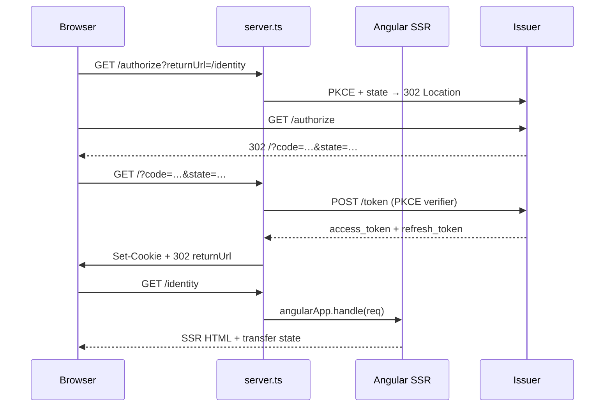
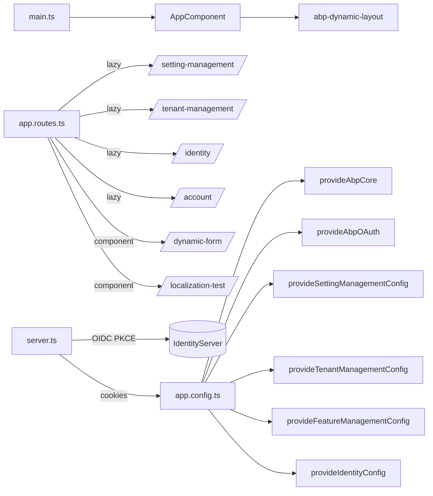

The `apps/dev-app` and `apps/dev-app-e2e` projects are the in-repo harness the ABP Framework team uses to exercise every Angular package as it evolves. Dev App is a fully wired SSR-capable Angular application that imports the `@abp/ng.*` libraries from source via Nx aliases, mounts every administration route documented elsewhere in this guide, and ships a custom OIDC reverse proxy in `src/server.ts` so PKCE flows work without CORS gymnastics. This page walks every file under `npm/ng-packs/apps/dev-app/` and `npm/ng-packs/apps/dev-app-e2e/`, explains how the standalone bootstrap composes the framework providers, and shows where the Cypress harness lives.

## Project anatomy

`dev-app` is a standalone-bootstrap Angular 21 application running through the `@angular/build` executors. The Nx project file pins the build target output, asset bundles, and SSR entry points:

```json apps/dev-app/project.json
{
  "name": "dev-app",
  "projectType": "application",
  "sourceRoot": "apps/dev-app/src",
  "prefix": "app",
  "targets": {
    "build": {
      "executor": "@angular/build:application",
      "options": {
        "outputPath": "dist/apps/dev-app",
        "browser": "apps/dev-app/src/main.ts",
        "polyfills": ["apps/dev-app/src/polyfills.ts", "zone.js"],
        "tsConfig": "apps/dev-app/tsconfig.app.json",
        "inlineStyleLanguage": "scss",
        "allowedCommonJsDependencies": ["chart.js", "js-sha256"],
        "server": "apps/dev-app/src/main.server.ts",
        "ssr": { "entry": "apps/dev-app/src/server.ts" },
        "outputMode": "server"
      }
    }
  }
}
```

Important file pointers:

| Path | Role |
| --- | --- |
| `src/main.ts` | Browser bootstrap (`bootstrapApplication`). |
| `src/main.server.ts` | Server bootstrap consumed by `@angular/build`. |
| `src/server.ts` | Express + OIDC reverse-proxy used when running with `outputMode: server`. |
| `src/app/app.component.ts` | Root component: loader bar + dynamic layout. |
| `src/app/app.config.ts` | Standalone provider composition. |
| `src/app/app.config.server.ts` | SSR-specific provider overlay. |
| `src/app/app.routes.ts` | Browser route table. |
| `src/app/app.routes.server.ts` | SSR route table. |
| `src/app/route.provider.ts` | Sidebar menu registration. |
| `src/app/home/home.component.{ts,html}` | Landing page. |
| `src/app/dynamic-form-page/dynamic-form-page.component.ts` | Harness for `@abp/ng.components/dynamic-form`. |
| `src/app/dynamic-form-page/form-config.service.ts` | Static `FormFieldConfig[]` exercising every field type. |
| `src/app/localization-test/localization-test.component.ts` | Verifies hybrid backend/UI localization. |
| `src/environments/environment.ts` | OAuth + per-API root namespace map. |
| `src/assets/localization/en.json` | UI-only localization fallback dictionary. |
| `src/index.html` | Shell HTML with a CSS spinner placeholder. |

`apps/dev-app-e2e/` contains the Cypress configuration, the only spec file, and its support objects. See *End-to-end testing* below.

## Standalone bootstrap

The browser entrypoint is intentionally tiny — `bootstrapApplication(AppComponent, appConfig)`. Everything else is wired through `app.config.ts`:

```ts apps/dev-app/src/main.ts
import { bootstrapApplication } from '@angular/platform-browser';
import { appConfig } from './app/app.config';
import { AppComponent } from './app/app.component';

bootstrapApplication(AppComponent, appConfig).catch(err => console.error(err));
```

```ts apps/dev-app/src/app/app.component.ts
@Component({
  selector: 'app-root',
  template: `
    <abp-loader-bar></abp-loader-bar>
    <abp-dynamic-layout></abp-dynamic-layout>
  `,
  imports: [LoaderBarComponent, DynamicLayoutComponent],
})
export class AppComponent {}
```

`abp-loader-bar` is the top progress bar from `@abp/ng.theme.shared`; `abp-dynamic-layout` selects between application, account, or empty layouts based on the active route's `eLayoutType`.

## Provider composition

`app.config.ts` calls each `provideXxxConfig` documented in the other Angular pages of this guide — that is what makes the dev-app a *full* exercise of the framework:

```ts apps/dev-app/src/app/app.config.ts
export const appConfig: ApplicationConfig = {
  providers: [
    APP_ROUTE_PROVIDER,
    provideAbpCore(
      withOptions({
        environment,
        registerLocaleFn: registerLocaleForEsBuild(),
        sendNullsAsQueryParam: false,
        skipGetAppConfiguration: false,
        uiLocalization: {
          enabled: true,
          basePath: '/assets/localization',
        },
      }),
    ),
    provideAbpOAuth(),
    provideAbpThemeShared(),
    provideSettingManagementConfig(),
    provideAccountConfig(),
    provideIdentityConfig(),
    provideTenantManagementConfig(),
    provideFeatureManagementConfig(),
    provideZoneChangeDetection({ eventCoalescing: true }),
    provideThemeBasicConfig(),
    provideAnimations(),
    provideRouter(appRoutes),
    provideClientHydration(
      withEventReplay(),
      withHttpTransferCacheOptions({}),
      withIncrementalHydration(),
    ),
  ],
};
```

| Provider | Effect |
| --- | --- |
| `APP_ROUTE_PROVIDER` | Registers the `::Menu:Home` sidebar entry. |
| `provideAbpCore({ environment, … })` | Pulls in `RestService`, `ConfigStateService`, `RoutesService`, etc., reads `environment.apis.*`. |
| `provideAbpOAuth()` | OIDC client (PKCE) configured from `environment.oAuthConfig`. |
| `provideAbpThemeShared()` | Loader bar, modal, toaster, confirmation, theme switcher. |
| `provideSettingManagementConfig()` | Adds *Settings* menu + e-mail tab — see [Setting management](/angular/setting-management). |
| `provideAccountConfig()` | Account routes + profile tab. |
| `provideIdentityConfig()` | Users/roles routes. |
| `provideTenantManagementConfig()` | Tenants menu — see [Tenant management](/angular/tenant-management). |
| `provideFeatureManagementConfig()` | Features tab — see [Feature management](/angular/feature-management). |
| `provideThemeBasicConfig()` | The default "Basic" theme. |
| `provideZoneChangeDetection({ eventCoalescing: true })` | Reduces change-detection cycles. |
| `provideClientHydration(...)` | Enables full SSR hydration + event replay + incremental hydration. |

The `withOptions` block exposes one important integration toggle — `uiLocalization.basePath = '/assets/localization'` — which makes `UILocalizationService` (from `@abp/ng.core`) load the JSON fallback dictionary at `apps/dev-app/src/assets/localization/<lang>.json`. The `LocalizationTestComponent` documented below demonstrates the override behaviour.

## Environment

`environment.ts` maps API names to their root namespaces, which is the binding the `RestService` needs to attach `apiName` to the right base URL. Note how each ABP module registers its own remote service entry:

```ts apps/dev-app/src/environments/environment.ts
const baseUrl = 'http://localhost:4200';

export const environment = {
  production: false,
  hmr: false,
  application: { baseUrl, name: 'MyProjectName', logoUrl: '' },
  oAuthConfig: {
    issuer: 'https://localhost:44305/',
    clientId: 'MyProjectName_App',
    scope: 'offline_access MyProjectName',
    responseType: 'code',
    redirectUri: baseUrl,
    ssrAuthorizationUrl: '/authorize',
  },
  apis: {
    default:                 { url: 'https://localhost:44305', rootNamespace: 'MyCompanyName.MyProjectName' },
    AbpAccount:              { rootNamespace: 'Volo.Abp' },
    AbpFeatureManagement:    { rootNamespace: 'Volo.Abp' },
    AbpPermissionManagement: { rootNamespace: 'Volo.Abp.PermissionManagement' },
    AbpTenantManagement:     { rootNamespace: 'Volo.Abp.TenantManagement' },
    AbpIdentity:             { rootNamespace: 'Volo.Abp' },
    SettingManagement:       { rootNamespace: 'Volo.Abp.SettingManagement' },
  },
} as Environment;
```

The `apiName` strings here are exactly the constants set on each generated service — `PermissionsService.apiName = 'AbpPermissionManagement'` (see [Permission management](/angular/permission-management) and [Service proxying](/cli/service-proxying)).

## Route table

The browser routes lazy-load every administration package through its `createRoutes()` factory, so the bundle stays modular:

```ts apps/dev-app/src/app/app.routes.ts
export const appRoutes: Routes = [
  { path: '',          pathMatch: 'full',  loadComponent: () => import('./home/home.component').then(m => m.HomeComponent) },
  { path: 'dynamic-form',                    loadComponent: () => import('./dynamic-form-page/dynamic-form-page.component').then(m => m.DynamicFormPageComponent) },
  { path: 'localization-test',               loadComponent: () => import('./localization-test/localization-test.component').then(m => m.LocalizationTestComponent) },
  { path: 'account',                         loadChildren: () => import('@abp/ng.account').then(m => m.createRoutes()) },
  { path: 'identity',                        loadChildren: () => import('@abp/ng.identity').then(m => m.createRoutes()) },
  { path: 'tenant-management',               loadChildren: () => import('@abp/ng.tenant-management').then(m => m.createRoutes()) },
  { path: 'setting-management',              loadChildren: () => import('@abp/ng.setting-management').then(m => m.createRoutes()) },
];
```

| Path | Source |
| --- | --- |
| `/` | `home.component.ts` |
| `/dynamic-form` | `dynamic-form-page.component.ts` |
| `/localization-test` | `localization-test.component.ts` |
| `/account/*` | `@abp/ng.account` |
| `/identity/*` | `@abp/ng.identity` |
| `/tenant-management/*` | `@abp/ng.tenant-management` |
| `/setting-management/*` | `@abp/ng.setting-management` |

`route.provider.ts` registers a single menu entry for the home page so the sidebar surfaces the harness next to the contributed Administration nodes:

```ts apps/dev-app/src/app/route.provider.ts
export const APP_ROUTE_PROVIDER = [
  provideAppInitializer(() => {
    configureRoutes();
  }),
];

function configureRoutes() {
  const routesService = inject(RoutesService);
  routesService.add([
    {
      path: '/',
      name: '::Menu:Home',
      iconClass: 'fas fa-home',
      order: 1,
      layout: eLayoutType.application,
    },
  ]);
}
```

CMS Kit, Account Admin, and Identity Pro routes are *not* mounted by default in `app.routes.ts` — dev-app intentionally exercises the open-source surface that ships in this repository. To experiment with the commercial routes, add them in the same shape.

## Home component

`HomeComponent` is the landing screen. It calls `AuthService.navigateToLogin()` (from `@abp/ng.core`) when the user clicks the button, which redirects to the OIDC issuer via the OAuth flow registered by `provideAbpOAuth()`:

```ts apps/dev-app/src/app/home/home.component.ts
@Component({
  selector: 'app-home',
  templateUrl: './home.component.html',
  imports: [
    NgTemplateOutlet, LocalizationPipe, CardComponent, CardBodyComponent,
    ButtonComponent, RouterLink,
  ],
})
export class HomeComponent {
  protected readonly authService = inject(AuthService);
  loading = false;

  get hasLoggedIn(): boolean {
    return this.authService.isAuthenticated;
  }

  login() {
    this.loading = true;
    this.authService.navigateToLogin();
  }
}
```

The template exercises `LocalizationPipe`, `RouterLink`, `<abp-card>`, `<abp-button>` so visual regressions are caught at a glance:

```html apps/dev-app/src/app/home/home.component.html
<div class="container">
  <div class="text-center mb-4">
    <a routerLink="/dynamic-form" class="btn btn-primary">Go to Dynamic Form</a>
    <a routerLink="/localization-test" class="btn btn-secondary ms-2">Test Hybrid Localization</a>
  </div>
  <h1>{{ '::Welcome' | abpLocalization }}</h1>
  <p class="lead px-lg-5 mx-lg-5">{{ '::LongWelcomeMessage' | abpLocalization }}</p>
  @if (!hasLoggedIn) {
    <abp-button [loading]="loading" (click)="login()" iconClass="fa fa-sign-in">
      {{ 'AbpAccount::Login' | abpLocalization }}
    </abp-button>
  }
</div>
```

## Dynamic form harness

`DynamicFormPageComponent` is the dedicated test bed for `@abp/ng.components/dynamic-form`. The form configuration is supplied by `FormConfigService` and covers every supported field type — text, email, password, tel, url, number, date, datetime-local, select, etc.:

```ts apps/dev-app/src/app/dynamic-form-page/dynamic-form-page.component.ts
@Component({
  selector: 'app-dynamic-form-page',
  templateUrl: './dynamic-form-page.component.html',
  imports: [DynamicFormComponent],
})
export class DynamicFormPageComponent implements OnInit {
  readonly dynamicFormComponent = viewChild(DynamicFormComponent);
  protected readonly formConfigService = inject(FormConfigService);

  formFields: FormFieldConfig[] = [];

  ngOnInit() {
    this.formConfigService.getFormConfig().subscribe(config => {
      this.formFields = config;
    });
  }

  submit(formData: any) {
    console.log('✅ Form Submitted Successfully!', formData);
    console.table(formData);
    alert('✅ Form submitted successfully! Check the console for details.');
    this.dynamicFormComponent().resetForm();
  }

  cancel() {
    console.log('❌ Form Cancelled');
    alert('Form cancelled');
    this.dynamicFormComponent().resetForm();
  }
}
```

The `FormConfigService` ships a 20+ field configuration that covers all validator combinations and grid sizes:

```ts apps/dev-app/src/app/dynamic-form-page/form-config.service.ts
@Injectable({ providedIn: 'root' })
export class FormConfigService {
  getFormConfig(): Observable<FormFieldConfig[]> {
    const formConfig: FormFieldConfig[] = [
      { key: 'firstName',    label: 'First Name',     type: 'text', required: true,  gridSize: 6, order: 1, validators: [{ type: 'required', message: 'First name is required' }] },
      { key: 'lastName',     label: 'Last Name',      type: 'text', required: true,  gridSize: 6, order: 2 },
      { key: 'email',        label: 'Email Address',  type: 'email',                 gridSize: 6, order: 3 },
      { key: 'password',     label: 'Password',       type: 'password', minLength: 8, gridSize: 6, order: 4 },
      { key: 'phone',        label: 'Phone Number',   type: 'tel',                   gridSize: 6, order: 5, pattern: '[0-9]{3}-[0-9]{3}-[0-9]{4}' },
      { key: 'website',      label: 'Website',        type: 'url',                   gridSize: 6, order: 6 },
      { key: 'age',          label: 'Age',            type: 'number', min: 18, max: 100, gridSize: 4, order: 7 },
      { key: 'birthdate',    label: 'Birth Date',     type: 'date',                  gridSize: 4, order: 8 },
      { key: 'country',      label: 'Country',        type: 'select',                gridSize: 6, order: 10 },
      // …continues through radio, checkbox, multiselect, textarea, file
    ];
    return of(formConfig);
  }
}
```

`gridSize: 6` puts two fields per row on Bootstrap's 12-column grid; `gridSize: 4` triples up. The `validators` array uses the `@abp/ng.components/dynamic-form` validator-by-name registry.

## Hybrid localization test

`LocalizationTestComponent` is the smallest possible harness for the *backend + UI* hybrid mode enabled by `withOptions({ uiLocalization: { enabled: true, basePath: '/assets/localization' } })`. It uses three keys to demonstrate the lookup order:

```ts apps/dev-app/src/app/localization-test/localization-test.component.ts
@Component({
  selector: 'app-localization-test',
  standalone: true,
  imports: [CommonModule, LocalizationPipe, CardComponent, CardBodyComponent, AsyncPipe],
  template: `
    <h2>Hybrid Localization Test</h2>
    <abp-card><abp-card-body>
      <p><strong>MyProjectName::Welcome:</strong> {{ 'MyProjectName::Welcome' | abpLocalization }}</p>
      <p><strong>AbpAccount::Login:</strong> {{ 'AbpAccount::Login' | abpLocalization }}</p>
    </abp-card-body></abp-card>
    <!-- …more cards: UI-only, UI override, loaded localizations -->
  `,
})
export class LocalizationTestComponent implements OnInit {
  private uiLocalizationService = inject(UILocalizationService);
  private sessionState = inject(SessionStateService);

  loadedLocalizations: any = {};
  currentLanguage$ = this.sessionState.getLanguage$();

  ngOnInit() {
    this.loadedLocalizations = this.uiLocalizationService.getLoadedLocalizations();
  }
}
```

The `assets/localization/en.json` dictionary overrides `AbpAccount::Login` to demonstrate that the UI dictionary wins when both backends supply a value:

```json apps/dev-app/src/assets/localization/en.json
{
  "MyProjectName": {
    "Welcome": "Welcome from UI (en.json)",
    "CustomKey": "This is a UI-only localization",
    "TestMessage": "UI localization is working!"
  },
  "AbpAccount": {
    "Login": "Sign In (UI Override)"
  }
}
```

## SSR configuration

`main.server.ts` exports the `bootstrap` callback that `@angular/build` invokes from the server bundle. It merges browser + server configs via `mergeApplicationConfig`:

```ts apps/dev-app/src/main.server.ts
import { bootstrapApplication, BootstrapContext } from '@angular/platform-browser';
import { AppComponent } from './app/app.component';
import { config } from './app/app.config.server';

const bootstrap = (context: BootstrapContext) => bootstrapApplication(AppComponent, config, context);

export default bootstrap;
```

```ts apps/dev-app/src/app/app.config.server.ts
const serverConfig: ApplicationConfig = {
  providers: [
    provideAppInitializer(() => {
      const platformId = inject(PLATFORM_ID);
      const transferState = inject<TransferState>(TransferState);
      if (isPlatformServer(platformId)) {
        transferState.set(SSR_FLAG, true);
      }
    }),
    provideServerRendering(withRoutes(appServerRoutes)),
  ],
};

export const config = mergeApplicationConfig(appConfig, serverConfig);
```

`SSR_FLAG` from `@abp/ng.core` lets the rest of the framework branch on render mode — useful for skipping `localStorage` reads, dynamic imports of browser-only libraries, etc. The server route table is a catch-all that defers everything to server-side rendering:

```ts apps/dev-app/src/app/app.routes.server.ts
export const appServerRoutes: ServerRoute[] = [
  { path: '**', renderMode: RenderMode.Server },
];
```

## OIDC reverse proxy

`src/server.ts` is the most distinctive file in the dev-app. It is an Express app that doubles as an OIDC reverse-proxy in front of the Angular SSR engine. The proxy handles three problems that show up when SSR is mixed with PKCE:

1. **/authorize** issues a fresh PKCE verifier + state and redirects to the OIDC provider.
2. **/logout** clears the session cookies and follows the `end_session_endpoint`.
3. **`/?code=&state=`** completes the auth-code exchange server-side and sets `access_token`, `refresh_token`, and `expires_at` cookies.

```ts apps/dev-app/src/server.ts
process.env["NODE_TLS_REJECT_UNAUTHORIZED"] = "0";

const config = await oidc.discovery(ISSUER, CLIENT_ID, undefined);
const secureCookie = { httpOnly: true, sameSite: 'lax' as const, secure: environment.production, path: '/' };
const tokenCookie = { ...secureCookie, httpOnly: false };

app.use(ServerCookieParser.middleware());

const sessions = new Map<string, { pkce?: string; state?: string; refresh?: string; at?: string, returnUrl?: string }>();

app.get('/authorize', async (_req, res) => {
  const code_verifier  = oidc.randomPKCECodeVerifier();
  const code_challenge = await oidc.calculatePKCECodeChallenge(code_verifier);
  const state = oidc.randomState();
  // …persist in `sessions`, set sid cookie, redirect to issuer's authorization endpoint
});

app.get('/', async (req, res, next) => {
  const { code, state } = req.query as any;
  if (!code || !state) return next();
  // …complete the token exchange, set access_token cookie, redirect to returnUrl
});
```

The cookie set is bridged into Angular SSR via `ServerCookieParser` from `@abp/ng.core` so `AuthService` on the server can read `access_token` and attach the `Authorization: Bearer` header to outgoing API calls. The final `app.use((req, res, next) => angularApp.handle(req)…)` block hands every other request to `AngularNodeAppEngine`.



## Build target & assets

The `build` target's `styles` array bundles every theme variant the dev-app exercises — Lepton X Lite (both dark and light), abp-bundle, FontAwesome, NGX Datatable, Bootstrap Icons, and the local `styles.scss`. Most bundles are declared with `"inject": false` so the runtime can swap them via the theme switcher exposed by `provideAbpThemeShared()`:

```json apps/dev-app/project.json
"styles": [
  { "input": "node_modules/bootstrap/dist/css/bootstrap.min.css", "inject": true, "bundleName": "bootstrap-ltr.min" },
  { "input": "node_modules/@volo/ngx-lepton-x.lite/assets/css/ng-bundle.css", "inject": false, "bundleName": "ng-bundle" },
  { "input": "node_modules/@abp/ng.theme.lepton-x/assets/css/abp-bundle.css", "inject": false, "bundleName": "abp-bundle" },
  { "input": "node_modules/@fortawesome/fontawesome-free/css/all.min.css", "inject": true, "bundleName": "fontawesome-all.min" },
  { "input": "node_modules/@swimlane/ngx-datatable/themes/material.css", "inject": true, "bundleName": "ngx-datatable-material" },
  { "input": "node_modules/bootstrap-icons/font/bootstrap-icons.css", "inject": true, "bundleName": "bootstrap-icons" },
  "apps/dev-app/src/styles.scss"
]
```

`allowedCommonJsDependencies: ["chart.js", "js-sha256"]` tells the build executor that the two CommonJS deps are intentional — without this, the warning blocks production builds.

## Production environment file replacement

The build's production configuration enforces `1mb` warning / `5mb` error initial budgets and swaps `environment.ts` with `environment.prod.ts`:

```json apps/dev-app/project.json
"production": {
  "tsConfig": "apps/dev-app/tsconfig.app.json",
  "budgets": [
    { "type": "initial", "maximumWarning": "1mb", "maximumError": "5mb" },
    { "type": "anyComponentStyle", "maximumWarning": "6kb", "maximumError": "10kb" }
  ],
  "fileReplacements": [
    {
      "replace": "apps/dev-app/src/environments/environment.ts",
      "with": "apps/dev-app/src/environments/environment.prod.ts"
    }
  ],
  "outputHashing": "all"
}
```

## End-to-end testing

`apps/dev-app-e2e` is the Cypress harness. The `cypress.json` configures the fixture, support, and screenshot directories:

```json apps/dev-app-e2e/cypress.json
{
  "fileServerFolder": ".",
  "fixturesFolder": "./src/fixtures",
  "integrationFolder": "./src/integration",
  "modifyObstructiveCode": false,
  "pluginsFile": "./src/plugins/index",
  "supportFile": "./src/support/index.ts",
  "video": true,
  "videosFolder": "../../dist/cypress/apps/dev-app-e2e/videos",
  "screenshotsFolder": "../../dist/cypress/apps/dev-app-e2e/screenshots",
  "chromeWebSecurity": false
}
```

The Nx project file binds `e2e` to the Cypress executor with `dev-app:serve:development` as the dev-server target, so `nx e2e dev-app-e2e` boots dev-app and runs the spec in one command:

```json apps/dev-app-e2e/project.json
{
  "name": "dev-app-e2e",
  "projectType": "application",
  "targets": {
    "e2e": {
      "executor": "@nx/cypress:cypress",
      "options": {
        "cypressConfig": "apps/dev-app-e2e/cypress.json",
        "tsConfig": "apps/dev-app-e2e/tsconfig.e2e.json",
        "devServerTarget": "dev-app:serve:development"
      },
      "configurations": {
        "production": { "devServerTarget": "dev-app:serve:production" }
      }
    },
    "lint": { "executor": "@nx/eslint:lint" }
  },
  "implicitDependencies": ["dev-app"]
}
```

The `implicitDependencies` tells the Nx graph that any change to dev-app should re-run the e2e target.

### Specs and helpers

There is currently a single smoke spec — `app.spec.ts` — that exercises the home page after invoking a custom Cypress command:

```ts apps/dev-app-e2e/src/integration/app.spec.ts
import { getGreeting } from '../support/app.po';

describe('dev-app', () => {
  beforeEach(() => cy.visit('/'));

  it('should display welcome message', () => {
    cy.login('my-email@something.com', 'myPassword');
    getGreeting().contains('Welcome to dev-app!');
  });
});
```

`app.po.ts` is the page-object module — currently a one-liner exporting the `h1` selector. The pattern leaves room for richer page objects as the spec set grows:

```ts apps/dev-app-e2e/src/support/app.po.ts
export const getGreeting = () => cy.get('h1');
```

`commands.ts` registers the `cy.login(email, password)` custom command. It is intentionally a no-op stub that just logs — the real auth flow is exercised through SSR and is not driven from Cypress:

```ts apps/dev-app-e2e/src/support/commands.ts
declare namespace Cypress {
  interface Chainable<Subject> {
    login(email: string, password: string): void;
  }
}

Cypress.Commands.add('login', (email, password) => {
  console.log('Custom command example: Login', email, password);
});
```

## How dev-app exercises the rest of this guide



Every administration screen exercised through `/setting-management` and `/tenant-management` is documented in the sibling pages — [Setting management](/angular/setting-management), [Tenant management](/angular/tenant-management), [Feature management](/angular/feature-management), and [Permission management](/angular/permission-management). The CMS Kit admin entry is *not* mounted in `app.routes.ts` because it is provided through `@abp/ng.cms-kit/admin` as an opt-in route — adding `{ path: 'cms', loadChildren: () => import('@abp/ng.cms-kit/admin').then(m => m.createRoutes()) }` plugs it in (see [CMS Kit](/angular/cms-kit)).

## Related pages

- [Setting management](/angular/setting-management), [Tenant management](/angular/tenant-management), [Feature management](/angular/feature-management), [Permission management](/angular/permission-management), [CMS Kit](/angular/cms-kit) — every package wired into the dev-app.
- [Schematics & generators](/angular/schematics-and-generators) — the `ssr-add` schematic produced the SSR scaffolding mirrored here.
- [Service proxying](/cli/service-proxying) — drives the `environment.apis.*` map.
- Backend prerequisites: [Multi-tenancy](/multi-tenancy/overview) and the relevant module guides under `/modules`.
