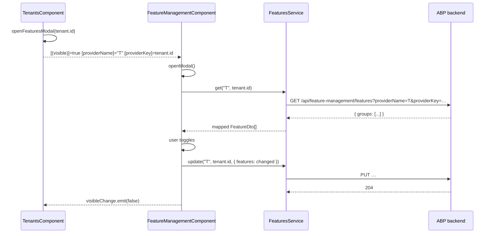

The `@abp/ng.feature-management` package provides the Angular UI that the ABP Framework uses to edit feature flags for a provider (the host, a tenant, or a custom edition). It is consumed transitively by `@abp/ng.tenant-management` to power the *Manage Features* dialog on each tenant row, and it also contributes a tab to the global `/setting-management` page so the host's own features can be edited inline. This page walks the package layout under `npm/ng-packs/packages/feature-management/`, explains how the three feature value types are rendered, and shows how the signal-input modal hooks into the setting-management tab service.

## Package layout

The package ships one ng-package secondary entry point at `src/` with the UI bits and a separate proxy entry at `proxy/` containing the generated `FeaturesService`. Unlike permission/tenant management, there is no `config` entry — the same module exposes both the embeddable component and the tab-registration provider, because consumers always want both.

| Path | Symbol | Purpose |
| --- | --- | --- |
| `src/lib/feature-management.module.ts` | `FeatureManagementModule` | NgModule shim re-exporting standalone exports. |
| `src/lib/components/feature-management/feature-management.component.ts` | `FeatureManagementComponent` | The modal users embed in tenant/edition rows. |
| `src/lib/components/feature-management-tab/feature-management-tab.component.ts` | `FeatureManagementTabComponent` | Tab wrapper used inside `/setting-management`. |
| `src/lib/directives/free-text-input.directive.ts` | `FreeTextInputDirective` | Coerces `<input>` types from the feature's validator name. |
| `src/lib/providers/feature-management-config.provider.ts` | `provideFeatureManagementConfig` | Standalone provider bundle. |
| `src/lib/providers/feature-management-settings.provider.ts` | `configureSettingTabs` | Pushes the *Features* tab into `SettingTabsService`. |
| `src/lib/enums/components.ts` | `eFeatureManagementComponents` | Replaceable-component identifiers. |
| `src/lib/enums/feature-management-tab-names.ts` | `eFeatureManagementTabNames` | Localization key for the tab name. |
| `src/lib/models/feature-management.ts` | `FeatureManagement.*` | Public TS contract. |
| `proxy/src/lib/proxy/feature-management/features.service.ts` | `FeaturesService` | REST client for `/api/feature-management/features`. |
| `proxy/src/lib/proxy/feature-management/models.ts` | `FeatureDto`, `FeatureGroupDto`, `UpdateFeatureDto` | Generated DTOs. |
| `proxy/src/lib/proxy/validation/string-values/models.ts` | `ToggleStringValueType`, `FreeTextStringValueType`, `SelectionStringValueType` | Discriminator constants. |

`src/public-api.ts` re-exports `./lib/components`, `./lib/directives`, `./lib/providers`, `./lib/enums/components`, `./lib/feature-management.module`, and `./lib/models`.

## Standalone bootstrap

`FeatureManagementComponent` is standalone, so the `FeatureManagementModule` is reduced to an exports list. The `.forRoot()` shim still works for legacy NgModule consumers and just wires the same providers as `provideFeatureManagementConfig()`:

```ts src/lib/feature-management.module.ts
export const FEATURE_MANAGEMENT_EXPORTS = [
  FeatureManagementComponent,
  FreeTextInputDirective,
  FeatureManagementTabComponent,
];

/**
 * @deprecated FeatureManagementModule is deprecated .
 */
@NgModule({
  imports: [...FEATURE_MANAGEMENT_EXPORTS],
  exports: [...FEATURE_MANAGEMENT_EXPORTS],
})
export class FeatureManagementModule {
  static forRoot(): ModuleWithProviders<FeatureManagementModule> {
    return {
      ngModule: FeatureManagementModule,
      providers: [provideFeatureManagementConfig()],
    };
  }
}
```

The provider helper is the new standalone entry point:

```ts src/lib/providers/feature-management-config.provider.ts
import { makeEnvironmentProviders } from '@angular/core';
import { FEATURE_MANAGEMENT_SETTINGS_PROVIDERS } from './';

export function provideFeatureManagementConfig() {
  return makeEnvironmentProviders([FEATURE_MANAGEMENT_SETTINGS_PROVIDERS]);
}
```

`apps/dev-app/src/app/app.config.ts` calls `provideFeatureManagementConfig()` once during application bootstrap so the tab is added regardless of whether the user ever visits `/setting-management`.

## Embeddable modal

`FeatureManagementComponent` declares signal inputs for the same `(providerName, providerKey)` pair used by the permission modal, plus an optional `providerTitle` for the header. The provider conventions match the backend `IFeatureManagementProvider` registrations:

```ts src/lib/components/feature-management/feature-management.component.ts
readonly providerKey   = input<string | undefined>(undefined);
readonly providerName  = input<string | undefined>(undefined);
readonly providerTitle = input<string | undefined>(undefined);
readonly visibleInput  = input(false, { alias: 'visible' });
readonly visibleChange = output<boolean>();
```

| Input | Required | Typical value |
| --- | --- | --- |
| `providerName` | Yes | `'T'` (tenant), `'E'` (edition), `'U'` (user), `undefined` for host. |
| `providerKey` | When non-host | Tenant id, edition id, user id. |
| `providerTitle` | No | Tenant display name shown in the modal header. |
| `visible` | Yes (two-way) | Bound by host via `[(visible)]`. |

A constant `DEFAULT_PROVIDER_NAME = 'D'` represents the "default" inherited provider — features whose value is contributed by `D` cannot be edited from the *T*/*E* scope and the toggle is rendered as disabled.

## Visibility flow

A getter/setter pair on `visible` plus a constructor `effect()` keep the input signal, the internal `_visible` signal, and the legacy property-set API in sync:

```ts src/lib/components/feature-management/feature-management.component.ts
set visible(value: boolean) {
  if (this._visible() === value) return;
  this._visible.set(value);
  this.visibleChange.emit(value);
  if (value) this.openModal();
}

constructor() {
  effect(() => {
    const inputValue = this.visibleInput();
    if (this._visible() !== inputValue) {
      this._visible.set(inputValue);
      if (inputValue) this.openModal();
    }
  });
}

openModal() {
  if (!this.providerName()) {
    throw new Error('providerName is required.');
  }
  this.getFeatures();
}
```

The `providerName` check throws synchronously on `openModal()` so misuse is caught in development before any HTTP call goes out.

## Group + feature processing

`getFeatures()` calls `FeaturesService.get(providerName, providerKey)`, then materialises each feature group into the local `features` map keyed by group name. Each feature is augmented with an `initialValue` (used by the diff in `save()`) and a `style` offset for hierarchical indentation:

```ts src/lib/components/feature-management/feature-management.component.ts
getFeatures() {
  this.service.get(this.providerName()!, this.providerKey()).subscribe(res => {
    if (!res.groups?.length) return;
    this.groups = res.groups.map(({ name, displayName }) => ({ name, displayName }));
    this.selectedGroupDisplayName = this.groups[0].displayName;
    this.features = res.groups.reduce(
      (acc, val) => ({
        ...acc,
        [val.name]: mapFeatures(val.features, this.document.body?.dir as LocaleDirection),
      }),
      {},
    );
  });
}

function mapFeatures(features: FeatureDto[], dir: LocaleDirection) {
  const margin = `margin-${dir === 'rtl' ? 'right' : 'left'}.px`;
  return features.map(feature => {
    const value =
      feature.valueType?.name === ValueTypes.ToggleStringValueType
        ? (feature.value || '').toLowerCase() === 'true'
        : feature.value;
    return {
      ...feature,
      value,
      initialValue: value,
      style: { [margin]: feature.depth * 20 },
    };
  });
}
```

`feature.depth * 20` adds 20 pixels per nesting level — the same indent rule the permission modal uses, sharing `LocaleDirection` from `@abp/ng.theme.shared` for RTL support.

## Value types

The backend ships three `IStringValueType` discriminators that the proxy `validation/string-values/models.ts` re-exports as TypeScript constants. The template uses an `@switch (feature.valueType.name)` block to pick the editor:

| `valueType.name` | Editor rendered | Notes |
| --- | --- | --- |
| `ToggleStringValueType` | Boolean checkbox | Cascading via `onCheckboxClick`. |
| `FreeTextStringValueType` | `<input>` with type coerced by `FreeTextInputDirective` | Validator hints set `type` to `number`, `text`, etc. |
| `SelectionStringValueType` | `<select>` populated from `feature.valueType.itemSource.items` | Reflects the C# `LocalizableSelectionStringValueItem` list. |

### Cascading toggles

When a parent toggle changes, descendants are auto-toggled. This mirrors how `IFeatureChecker` resolves feature trees on the server: enabling a parent enables the children path automatically; disabling a parent cuts the children off.

```ts src/lib/components/feature-management/feature-management.component.ts
onCheckboxClick(val: boolean, feature: FeatureDto) {
  if (val) this.checkToggleAncestors(feature);
  else this.uncheckToggleDescendants(feature);
}

private uncheckToggleDescendants(feature: FeatureDto) {
  this.findAllDescendantsOfByType(feature, ValueTypes.ToggleStringValueType)
    .forEach(node => this.setFeatureValue(node, false));
}

private checkToggleAncestors(feature: FeatureDto) {
  this.findAllAncestorsOfByType(feature, ValueTypes.ToggleStringValueType)
    .forEach(node => this.setFeatureValue(node, true));
}
```

`findAllAncestorsOfByType` and `findAllDescendantsOfByType` walk the `parentName`/children link iteratively using a stack-based BFS, so deep feature trees do not blow up Angular's stack.

### Free-text typing

`FreeTextInputDirective` turns the backend's validator name into an HTML input type at runtime. The map below is the entire surface area:

```ts src/lib/directives/free-text-input.directive.ts
export const INPUT_TYPES: Record<string, string> = {
  numeric: 'number',
  default: 'text',
};
```

A feature declared in C# as `numeric` (e.g. `NumericValueValidator`) becomes `<input type="number">`. Anything else falls through to `text`. The directive listens to the bound feature signal via `effect()` and calls `Renderer2.setAttribute(host, 'type', …)` so the input retains the correct keyboard on mobile.

### Parent disabled rule

`isParentDisabled(parentName, groupName, provider)` is the predicate that locks a row when the value comes from `'D'` or a different provider:

```ts src/lib/components/feature-management/feature-management.component.ts
isParentDisabled(parentName: string, groupName: string, provider: string): boolean {
  const children = this.features[groupName]?.filter(f => f.parentName === parentName);
  const providerNameValue = this.providerName();

  if (children?.length) {
    return children.some(child => {
      const childProvider = child.provider?.name;
      return (
        (childProvider !== providerNameValue && childProvider !== this.defaultProviderName) ||
        (provider !== providerNameValue && provider !== this.defaultProviderName)
      );
    });
  } else {
    return provider !== providerNameValue && provider !== this.defaultProviderName;
  }
}
```

In plain English: a row stays disabled if the value was contributed by a provider higher than the current scope (e.g. you cannot un-tick at edition level a flag that was set at host level), unless the contributing provider is the default `'D'`.

## Save + reset

The save pipeline diffs `value` against `initialValue` and only sends the changed entries. After a successful save against the *host* provider (no `providerKey`), it triggers `ConfigStateService.refreshAppState()` so the running session picks up the new flags without a hard reload:

```ts src/lib/components/feature-management/feature-management.component.ts
save() {
  if (this.modalBusy) return;

  const changedFeatures = [] as UpdateFeatureDto[];

  Object.keys(this.features).forEach(key => {
    this.features[key].forEach(feature => {
      if (feature.value !== feature.initialValue)
        changedFeatures.push({ name: feature.name, value: `${feature.value}` });
    });
  });

  if (!changedFeatures.length) { this.visible = false; return; }

  this.modalBusy = true;
  this.service
    .update(this.providerName()!, this.providerKey(), { features: changedFeatures })
    .pipe(finalize(() => (this.modalBusy = false)))
    .subscribe(() => {
      this.visible = false;
      this.toasterService.success('AbpUi::SavedSuccessfully');
      if (!this.providerKey()) this.configState.refreshAppState().subscribe();
    });
}

resetToDefault() {
  this.confirmationService
    .warn('AbpFeatureManagement::AreYouSureToResetToDefault', 'AbpFeatureManagement::AreYouSure')
    .subscribe((status: Confirmation.Status) => {
      if (status === Confirmation.Status.confirm) {
        this.service.delete(this.providerName()!, this.providerKey()).subscribe(() => {
          this.toasterService.success('AbpFeatureManagement::ResetedToDefault');
          this.visible = false;
          if (!this.providerKey()) this.configState.refreshAppState().subscribe();
        });
      }
    });
}
```

`resetToDefault` calls `DELETE /api/feature-management/features?providerName=…&providerKey=…` which clears the override and falls back to the parent provider's value — the warn dialog is the standard `ConfirmationService.warn` from `@abp/ng.theme.shared`.

## REST surface

The proxy is minimal — three methods plus the DTO models. `apiName = 'AbpFeatureManagement'` matches the corresponding registration in `apps/dev-app/src/environments/environment.ts`.

```ts proxy/src/lib/proxy/feature-management/features.service.ts
@Injectable({ providedIn: 'root' })
export class FeaturesService {
  private restService = inject(RestService);
  apiName = 'AbpFeatureManagement';

  delete = (providerName: string, providerKey: string) =>
    this.restService.request<any, void>({
      method: 'DELETE',
      url: '/api/feature-management/features',
      params: { providerName, providerKey },
    }, { apiName: this.apiName });

  get = (providerName: string, providerKey: string) =>
    this.restService.request<any, GetFeatureListResultDto>({
      method: 'GET',
      url: '/api/feature-management/features',
      params: { providerName, providerKey },
    }, { apiName: this.apiName });

  update = (providerName: string, providerKey: string, input: UpdateFeaturesDto) =>
    this.restService.request<any, void>({
      method: 'PUT',
      url: '/api/feature-management/features',
      params: { providerName, providerKey },
      body: input,
    }, { apiName: this.apiName });
}
```

| Method | HTTP | Returns |
| --- | --- | --- |
| `get(providerName, providerKey)` | `GET /api/feature-management/features` | `GetFeatureListResultDto` (groups → features). |
| `update(providerName, providerKey, input)` | `PUT …` | `void`. |
| `delete(providerName, providerKey)` | `DELETE …` | `void` (resets to default). |

## Tab integration

The package contributes a *Features* tab to `/setting-management` via `FEATURE_MANAGEMENT_SETTINGS_PROVIDERS`. The contribution is gated by the `FeatureManagement.ManageHostFeatures` policy so non-admin users do not see it:

```ts src/lib/providers/feature-management-settings.provider.ts
export const FEATURE_MANAGEMENT_SETTINGS_PROVIDERS = [
  provideAppInitializer(() => {
    configureSettingTabs();
  }),
];

export function configureSettingTabs() {
  const settingtabs = inject(SettingTabsService);
  settingtabs.add([
    {
      name: eFeatureManagementTabNames.FeatureManagement,
      order: 100,
      requiredPolicy: 'FeatureManagement.ManageHostFeatures',
      component: FeatureManagementTabComponent,
    },
  ]);
}
```

`FeatureManagementTabComponent` is a tiny wrapper that opens the modal in *host* mode (no provider key) when the user clicks the *Manage* button. It is registered with the tab service so it can live alongside the e-mail tab from `@abp/ng.setting-management/config`:

```ts src/lib/components/feature-management-tab/feature-management-tab.component.ts
@Component({
  selector: 'abp-feature-management-tab',
  templateUrl: './feature-management-tab.component.html',
  imports: [ReplaceableTemplateDirective, LocalizationPipe, FeatureManagementComponent],
})
export class FeatureManagementTabComponent {
  visibleFeatures = false;
  providerKey: string;

  openFeaturesModal() {
    this.visibleFeatures = true;
  }

  onVisibleFeaturesChange = (value: boolean) => {
    this.visibleFeatures = value;
  };
}
```

The `ReplaceableTemplateDirective` lets a host swap the tab's UI without changing the tab registration, using the `eFeatureManagementComponents.FeatureManagement` key.

## Tenant integration

`TenantsComponent` in `@abp/ng.tenant-management` uses `eFeatureManagementComponents.FeatureManagement` as the `componentKey` for its template-driven modal, demonstrating the cross-package wiring. The tenant row's *Manage Features* entity-action calls `openFeaturesModal(providerKey)`, which sets `providerKey = tenantId` and `providerName = 'T'`:

```ts packages/tenant-management/src/lib/components/tenants/tenants.component.ts
featureManagementKey = eFeatureManagementComponents.FeatureManagement;

openFeaturesModal(providerKey: string) {
  this.providerKey = providerKey;
  setTimeout(() => { this.visibleFeatures = true; }, 0);
}
```



## Replaceable keys

```ts src/lib/enums/components.ts
export const enum eFeatureManagementComponents {
  FeatureManagement = 'FeatureManagement.FeatureManagementComponent',
}
```

```ts src/lib/enums/feature-management-tab-names.ts
export const enum eFeatureManagementTabNames {
  FeatureManagement = 'AbpFeatureManagement::Features',
}
```

The single component key is consumed by the tenant table and the settings tab. The tab-name string is the localization key resolved by `LocalizationPipe`.

## Public TS contract

`src/lib/models/feature-management.ts` exports the namespace consumers can use to type their refs and outputs:

```ts src/lib/models/feature-management.ts
export namespace FeatureManagement {
  export interface FeatureManagementComponentInputs {
    visible: boolean;
    readonly providerKey?: string;
    readonly providerName?: string;
    readonly providerTitle?: string;
  }

  export interface FeatureManagementComponentOutputs {
    readonly visibleChange: EventEmitter<boolean> | OutputEmitterRef<boolean>;
  }
}
```

## Related pages

- [Setting management](/angular/setting-management) — host of the *Features* tab.
- [Tenant management](/angular/tenant-management) — opens the modal per tenant.
- [Permission management](/angular/permission-management) — same modal lifecycle and provider conventions.
- [Schematics & generators](/angular/schematics-and-generators) — `proxy-add` regenerates `FeaturesService`.
- Backend: [Feature Management module](/modules/feature-management).
- Proxy plumbing: [Service proxying](/cli/service-proxying).
