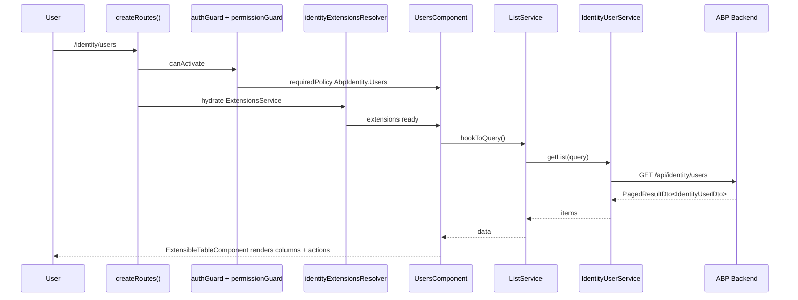

`@abp/ng.identity` is the Angular front end for the **ABP Framework** Identity module — the Users and Roles administration screens you reach under "Administration → Identity Management" in any standard ABP application template. It is a lazy-loaded library built entirely on top of `@abp/ng.components/extensible`: the user/role list table is an `ExtensibleTableComponent`, the create/edit dialogs are `ExtensibleFormComponent` instances, and the row "Permissions" action opens the `PermissionManagementComponent` from `@abp/ng.permission-management`. This page covers the route configuration, the two component screens, the eight default contributors (entity actions, props, toolbar actions, form props for users and roles), the matching extension tokens, and the `IdentityRoleService` / `IdentityUserService` proxies.

## Two npm sub-packages

```text packages/identity/
├── package.json   # @abp/ng.identity (the lazy UI)
├── config/        # secondary entry "@abp/ng.identity/config"
│   └── src/
│       ├── identity-config.module.ts   # IdentityConfigModule.forRoot()
│       ├── providers/
│       │   ├── identity-config.provider.ts
│       │   └── route.provider.ts       # IDENTITY_ROUTE_PROVIDERS — sidebar menu
│       └── enums/
│           ├── policy-names.ts         # eIdentityPolicyNames
│           └── route-names.ts          # eIdentityRouteNames
├── proxy/         # secondary entry "@abp/ng.identity/proxy"
│   └── src/lib/proxy/identity/
│       ├── identity-role.service.ts
│       ├── identity-user.service.ts
│       ├── identity-user-lookup.service.ts
│       └── models.ts
└── src/lib/
    ├── identity.routes.ts        # createRoutes() + provideIdentity()
    ├── identity.module.ts        # legacy IdentityModule.forChild()
    ├── identity-routing.module.ts
    ├── components/
    │   ├── users/  users.component.{ts,html}
    │   └── roles/  roles.component.{ts,html}
    ├── defaults/                # 8 EntityAction/Prop/Toolbar/FormProp seeds
    ├── enums/components.ts      # eIdentityComponents
    ├── guards/                  # IdentityExtensionsGuard
    ├── models/                  # IdentityConfigOptions
    ├── resolvers/               # identityExtensionsResolver
    └── tokens/                  # IDENTITY_*_CONTRIBUTORS + DEFAULT_IDENTITY_*
```

### Why a separate `/config` entry?

The `@abp/ng.identity/config` entry point is loaded **eagerly** in the host's root injector to:

1. Contribute the "Identity Management" sidebar entry via `IDENTITY_ROUTE_PROVIDERS`.
2. Wire any always-on configuration (e.g. permission name constants).

The main UI (`@abp/ng.identity`) stays behind a lazy `loadChildren` so its components and ngx-datatable styles are only fetched when the user clicks through.

```ts packages/identity/config/src/providers/route.provider.ts
export const IDENTITY_ROUTE_PROVIDERS = [
  provideAppInitializer(() => { configureRoutes(); }),
];

export function configureRoutes() {
  const routesService = inject(RoutesService);
  routesService.add([
    {
      path: undefined,
      name: eIdentityRouteNames.IdentityManagement,
      parentName: eThemeSharedRouteNames.Administration,
      requiredPolicy: eIdentityPolicyNames.IdentityManagement,
      iconClass: 'fa fa-id-card-o',
      layout: eLayoutType.application,
      order: 1,
    },
    { path: '/identity/roles', name: eIdentityRouteNames.Roles,  parentName: eIdentityRouteNames.IdentityManagement, requiredPolicy: eIdentityPolicyNames.Roles,  order: 1 },
    { path: '/identity/users', name: eIdentityRouteNames.Users,  parentName: eIdentityRouteNames.IdentityManagement, requiredPolicy: eIdentityPolicyNames.Users,  order: 2 },
  ]);
}
```

The entries are placed under the framework-supplied `Administration` group ([theme-shared](/angular/theme-shared)) and gated by `requiredPolicy`. `RoutesService` from [core](/angular/core-package#routesservice) interpolates the tree and `PermissionService.filterItemsByPolicy$` hides items the user cannot see.

## `createRoutes` — the lazy UI

`identity.routes.ts` exports `createRoutes(options)` and `provideIdentity(options)`. Both routes mount under `RouterOutletComponent`, gated by `authGuard` and `permissionGuard`, and resolved by `identityExtensionsResolver`:

```ts packages/identity/src/lib/identity.routes.ts
export const createRoutes = (options: IdentityConfigOptions = {}): Routes => [
  {
    path: '',
    component: RouterOutletComponent,
    canActivate: [authGuard, permissionGuard],
    resolve: [identityExtensionsResolver],
    providers: provideIdentity(options),
    children: [
      { path: '', redirectTo: 'roles', pathMatch: 'full' },
      {
        path: 'roles',
        component: ReplaceableRouteContainerComponent,
        data: {
          requiredPolicy: 'AbpIdentity.Roles',
          replaceableComponent: {
            key: eIdentityComponents.Roles,
            defaultComponent: RolesComponent,
          } as ReplaceableComponents.RouteData<RolesComponent>,
        },
        title: 'AbpIdentity::Roles',
      },
      {
        path: 'users',
        component: ReplaceableRouteContainerComponent,
        data: {
          requiredPolicy: 'AbpIdentity.Users',
          replaceableComponent: {
            key: eIdentityComponents.Users,
            defaultComponent: UsersComponent,
          } as ReplaceableComponents.RouteData<UsersComponent>,
        },
        title: 'AbpIdentity::Users',
      },
    ],
  },
];
```

| Route | Required policy | Replaceable key |
|---|---|---|
| `/identity/roles` | `AbpIdentity.Roles` | `Identity.RolesComponent` |
| `/identity/users` | `AbpIdentity.Users` | `Identity.UsersComponent` |

The policy strings match the C# constants defined in `Volo.Abp.Identity.IdentityPermissions` — see [Identity module](/modules/identity).

### `provideIdentity`

```ts packages/identity/src/lib/identity.routes.ts
export function provideIdentity(options: IdentityConfigOptions = {}): Provider[] {
  return [
    { provide: IDENTITY_ENTITY_ACTION_CONTRIBUTORS,    useValue: options.entityActionContributors },
    { provide: IDENTITY_TOOLBAR_ACTION_CONTRIBUTORS,   useValue: options.toolbarActionContributors },
    { provide: IDENTITY_ENTITY_PROP_CONTRIBUTORS,      useValue: options.entityPropContributors },
    { provide: IDENTITY_CREATE_FORM_PROP_CONTRIBUTORS, useValue: options.createFormPropContributors },
    { provide: IDENTITY_EDIT_FORM_PROP_CONTRIBUTORS,   useValue: options.editFormPropContributors },
  ];
}
```

The five tokens (in `tokens/extensions.token.ts`) are the public API used by host apps to inject new columns, actions, or form fields. The shapes come from `@abp/ng.components/extensible`:

| Token | Contributor callback type |
|---|---|
| `IDENTITY_ENTITY_ACTION_CONTRIBUTORS` | `EntityActionContributorCallback<…>` |
| `IDENTITY_TOOLBAR_ACTION_CONTRIBUTORS` | `ToolbarActionContributorCallback<…>` |
| `IDENTITY_ENTITY_PROP_CONTRIBUTORS` | `EntityPropContributorCallback<…>` |
| `IDENTITY_CREATE_FORM_PROP_CONTRIBUTORS` | `CreateFormPropContributorCallback<…>` |
| `IDENTITY_EDIT_FORM_PROP_CONTRIBUTORS` | `EditFormPropContributorCallback<…>` |

### `identityExtensionsResolver`

The resolver loads object-extension metadata from the server (via `ObjectExtensionsService` cached in `ConfigStateService`) and merges it with the in-app contributors and the local defaults:

```ts packages/identity/src/lib/resolvers/extensions.resolver.ts
export const identityExtensionsResolver: ResolveFn<any> = () => {
  const extensions = inject(ExtensionsService);
  const config = { optional: true };

  const actionContributors    = inject(IDENTITY_ENTITY_ACTION_CONTRIBUTORS, config) || {};
  const toolbarContributors   = inject(IDENTITY_TOOLBAR_ACTION_CONTRIBUTORS, config) || {};
  const propContributors      = inject(IDENTITY_ENTITY_PROP_CONTRIBUTORS, config) || {};
  const createFormContributors= inject(IDENTITY_CREATE_FORM_PROP_CONTRIBUTORS, config) || {};
  const editFormContributors  = inject(IDENTITY_EDIT_FORM_PROP_CONTRIBUTORS, config) || {};

  const injector = inject(Injector);
  return getObjectExtensionEntitiesFromStore(injector, 'Identity').pipe(
    map(entities => ({
      [eIdentityComponents.Roles]: entities.Role,
      [eIdentityComponents.Users]: entities.User,
    })),
    // mergeWithDefaultActions, mergeWithDefaultProps, ...
  );
};
```

This is the missing piece that makes server-side C# `ObjectExtensionManager.AddOrUpdateProperty<Volo.Abp.Identity.IdentityUser, string>(...)` declarations show up automatically in the Angular UI.

## Components

### `UsersComponent`

```ts packages/identity/src/lib/components/users/users.component.ts
@Component({
  selector: 'abp-users',
  templateUrl: './users.component.html',
  providers: [
    ListService,
    { provide: EXTENSIONS_IDENTIFIER, useValue: eIdentityComponents.Users },
  ],
  imports: [
    ReactiveFormsModule, FormsModule, PermissionManagementComponent, PageComponent,
    NgbDropdownModule, NgbNavModule, NgxValidateCoreModule, LocalizationPipe,
    ExtensibleTableComponent, ModalComponent, ExtensibleFormComponent,
    FormCheckboxComponent, /* ... */
  ],
})
export class UsersComponent implements OnInit {
  protected readonly service = inject(IdentityUserService);
  protected readonly toasterService = inject(ToasterService);
  data: PagedResultDto<IdentityUserDto> = { items: [], totalCount: 0 };
  form!: UntypedFormGroup;
  selected?: IdentityUserDto;
  roles?: IdentityRoleDto[];
  visiblePermissions = false;
  permissionManagementKey = ePermissionManagementComponents.PermissionManagement;
  // ...
}
```

The build-form path is the canonical pattern for an extensible CRUD page:

```ts
buildForm() {
  const data = new FormPropData(this.injector, this.selected);
  this.form = generateFormFromProps(data);

  this.service.getAssignableRoles().subscribe(({ items }) => {
    this.roles = items;
    if (this.roles) {
      this.form.addControl(
        'roleNames',
        this.fb.array(this.roles.map(role => this.fb.group({
          [role.name as string]: [
            this.selected?.id
              ? !!this.selectedUserRoles?.find(userRole => userRole.id === role.id)
              : role.isDefault,
          ],
        }))),
      );
    }
  });
}
```

- `FormPropData(injector, selected)` exposes the current record + injector to contributors so they can resolve dynamic defaults.
- `generateFormFromProps(data)` (from `@abp/ng.components/extensible`) reads `EditFormPropsFactory.get('Identity.UsersComponent').props` and produces a `FormGroup`.
- `this.service.getAssignableRoles()` is part of `IdentityUserService` (see proxies below) and fills the role checkboxes inside the modal.

### `RolesComponent`

```ts packages/identity/src/lib/components/roles/roles.component.ts
@Component({
  selector: 'abp-roles',
  templateUrl: './roles.component.html',
  providers: [
    ListService,
    { provide: EXTENSIONS_IDENTIFIER, useValue: eIdentityComponents.Roles },
  ],
  imports: [
    ReactiveFormsModule, LocalizationPipe, ExtensibleTableComponent,
    ModalComponent, ButtonComponent, PageComponent, ExtensibleFormComponent,
    ModalCloseDirective, PermissionManagementComponent, ReplaceableTemplateDirective,
    NgxValidateCoreModule, InitDirective,
  ],
})
```

`RolesComponent` is the simpler of the two — its DTO has fewer fields and no role-assignment array.

## Default contributors

`src/lib/defaults/` ships eight files seeding the extensible registry:

| File | Type | Surface |
|---|---|---|
| `default-roles-entity-actions.ts` | `EntityAction[]` | Row actions on the roles grid |
| `default-roles-entity-props.ts` | `EntityProp[]` | Columns on the roles grid |
| `default-roles-form-props.ts` | `FormProp[]` | Create/edit role fields |
| `default-roles-toolbar-actions.ts` | `ToolbarAction[]` | "+ New role" button |
| `default-users-entity-actions.ts` | `EntityAction[]` | Row actions on the users grid |
| `default-users-entity-props.ts` | `EntityProp[]` | Columns on the users grid |
| `default-users-form-props.ts` | `FormProp[]` | Create/edit user fields |
| `default-users-toolbar-actions.ts` | `ToolbarAction[]` | "+ New user" button |

A row action declaration uses the `EntityAction.createMany` helper with strongly typed `data.record` access:

```ts packages/identity/src/lib/defaults/default-users-entity-actions.ts
export const DEFAULT_USERS_ENTITY_ACTIONS = EntityAction.createMany<IdentityUserDto>([
  {
    text: 'AbpIdentity::Edit',
    action: data => {
      const component = data.getInjected(UsersComponent);
      component.edit(data.record.id || '');
    },
    permission: 'AbpIdentity.Users.Update',
  },
  {
    text: 'AbpIdentity::Permissions',
    action: data => {
      const component = data.getInjected(UsersComponent);
      component.openPermissionsModal(data.record.id || '', data.record.userName);
    },
    permission: 'AbpIdentity.Users.ManagePermissions',
  },
  {
    text: 'AbpIdentity::Delete',
    action: data => {
      const component = data.getInjected(UsersComponent);
      component.delete(data.record.id || '', data.record.name || data.record.userName || '');
    },
    visible: data => {
      const userName = data?.record.userName;
      const configStateService = data?.getInjected(ConfigStateService);
      const currentUser = configStateService?.getOne('currentUser') as CurrentUserDto;
      return userName !== currentUser.userName;
    },
    permission: 'AbpIdentity.Users.Delete',
  },
]);
```

Notice three patterns reused by every contributor:

- `data.getInjected(Service)` — resolve any service from the host injector at action time.
- `permission` — strings are evaluated by [`PermissionService`](/angular/core-package#permissionservice), hiding the menu item when the user lacks the policy.
- `visible` — additional runtime predicate (here: hide "Delete" on the current user's own row).

A column declaration:

```ts packages/identity/src/lib/defaults/default-users-entity-props.ts
export const DEFAULT_USERS_ENTITY_PROPS = EntityProp.createMany<IdentityUserDto>([
  {
    type: ePropType.String, name: 'userName',
    displayName: 'AbpIdentity::UserName', sortable: true, columnWidth: 250,
    valueResolver: data => {
      const l10n = data.getInjected(LocalizationService);
      const t = l10n.instant.bind(l10n);
      const inactiveIcon = `<i title="${t('AbpIdentity::ThisUserIsNotActiveMessage')}" class="fas fa-ban text-danger me-1" aria-hidden="true"></i>`;
      return of(`${!data.record.isActive ? inactiveIcon : ''}<span class="${!data.record.isActive ? 'text-muted' : ''}">${escapeHtmlChars(data.record.userName)}</span>`);
    },
  },
  { type: ePropType.String, name: 'email',       displayName: 'AbpIdentity::EmailAddress', sortable: true, columnWidth: 250 },
  { type: ePropType.String, name: 'phoneNumber', displayName: 'AbpIdentity::PhoneNumber' },
]);
```

`valueResolver` can return either a primitive or an `Observable<string>` — `escapeHtmlChars` is the safe-HTML helper from [core](/angular/core-package).

A form prop declaration:

```ts packages/identity/src/lib/defaults/default-roles-form-props.ts
export const DEFAULT_ROLES_CREATE_FORM_PROPS = FormProp.createMany<IdentityRoleDto>([
  {
    type: ePropType.String, name: 'name',
    displayName: 'AbpIdentity::RoleName', id: 'role-name',
    disabled: ((data: PropData<IdentityRoleDto>) =>
      data.record && data.record.isStatic) as PropPredicate<IdentityRoleDto>,
    validators: () => [Validators.required],
  },
  { type: ePropType.Boolean, name: 'isDefault', displayName: 'AbpIdentity::DisplayName:IsDefault', id: 'role-is-default', defaultValue: false },
  { type: ePropType.Boolean, name: 'isPublic',  displayName: 'AbpIdentity::DisplayName:IsPublic',  id: 'role-is-public',  defaultValue: false },
]);

export const DEFAULT_ROLES_EDIT_FORM_PROPS = DEFAULT_ROLES_CREATE_FORM_PROPS;
```

## Proxies

The `proxy/` ng-package compiles to `@abp/ng.identity/proxy` and ships three services:

| Class | apiName | Notable methods |
|---|---|---|
| `IdentityRoleService` | `AbpIdentity` | `create`, `delete`, `get`, `getAllList`, `getList`, `update` |
| `IdentityUserService` | `AbpIdentity` | `create`, `delete`, `get`, `findByEmail`, `findByUsername`, `getAssignableRoles`, `getList`, `getRoles`, `update`, `lock`, `unlock` |
| `IdentityUserLookupService` | `AbpIdentity` | Search users by id/username (used by lookup pickers in other modules) |

```ts packages/identity/proxy/src/lib/proxy/identity/identity-user.service.ts
@Injectable({ providedIn: 'root' })
export class IdentityUserService {
  private restService = inject(RestService);
  apiName = 'AbpIdentity';

  create = (input: IdentityUserCreateDto) =>
    this.restService.request<any, IdentityUserDto>({
      method: 'POST', url: '/api/identity/users', body: input,
    }, { apiName: this.apiName });

  getList = (input: GetIdentityUsersInput) =>
    this.restService.request<any, PagedResultDto<IdentityUserDto>>({
      method: 'GET', url: '/api/identity/users',
      params: {
        filter: input.filter, sorting: input.sorting,
        skipCount: input.skipCount, maxResultCount: input.maxResultCount,
      },
    }, { apiName: this.apiName });

  getAssignableRoles = () =>
    this.restService.request<any, ListResultDto<IdentityRoleDto>>({
      method: 'GET', url: '/api/identity/users/assignable-roles',
    }, { apiName: this.apiName });
}
```

Every URL maps to the C# `IIdentityUserAppService` and `IIdentityRoleAppService` interfaces in the [Identity module](/modules/identity). The `apiName: 'AbpIdentity'` is resolved by [`EnvironmentService`](/angular/core-package#environmentservice) into the URL declared under `environment.apis.AbpIdentity` (or `apis.default`).

## Page flow



## Extension example (host app)

```ts
import { ApplicationConfig } from '@angular/core';
import { provideRouter } from '@angular/router';
import { createRoutes } from '@abp/ng.identity';
import { EntityProp, ePropType } from '@abp/ng.components/extensible';
import { IdentityUserDto } from '@abp/ng.identity/proxy';

const customColumn = new EntityProp<IdentityUserDto>({
  type: ePropType.String, name: 'tenantId',
  displayName: '::TenantId', sortable: false,
});

export const appRoutes = [
  {
    path: 'identity',
    loadChildren: () => createRoutes({
      entityPropContributors: {
        'Identity.UsersComponent': [propList => propList.addTail(customColumn)],
      },
    }),
  },
];
```

The contributor function receives the doubly-linked `EntityPropList` and may `addHead`, `addTail`, `insertBefore`, `insertAfter`, or `dropItemByValue`. The same surface works for actions, toolbar buttons, and form props.

## Cross-links

- [Components](/angular/components#abpngcomponentsextensible--the-crud-engine) — `ExtensibleTableComponent`, `ExtensibleFormComponent`, `generateFormFromProps`, `ExtensionsService`.
- [Core](/angular/core-package) — `ListService`, `RestService`, `RoutesService`, `PermissionService`, `permissionGuard`.
- [OAuth](/angular/oauth) — provides the `authGuard` and `Authorization: Bearer …` headers used by every call.
- [Theme Shared](/angular/theme-shared) — `ModalComponent`, `ConfirmationService`, `ToasterService`.
- [Theme Basic](/angular/theme-basic) — `ApplicationLayoutComponent` hosts the screen.
- [Account](/angular/account-and-account-core) — sibling admin UI sharing the same extensible pattern.
- [Identity module](/modules/identity) — C# server-side `IIdentityUserAppService`, `IIdentityRoleAppService`.
- [HTTP](/http/overview) — REST plumbing behind every `IdentityUserService` call.
- [ASP.NET Core MVC](/aspnetcore/mvc) — Hosts `/api/identity/*` endpoints.
