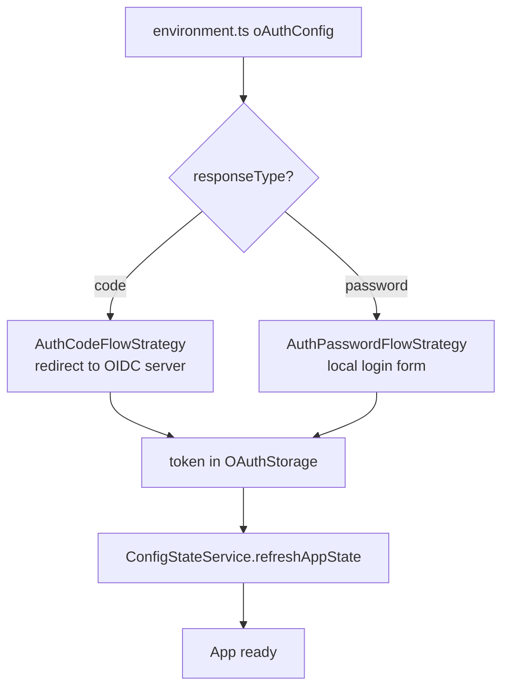
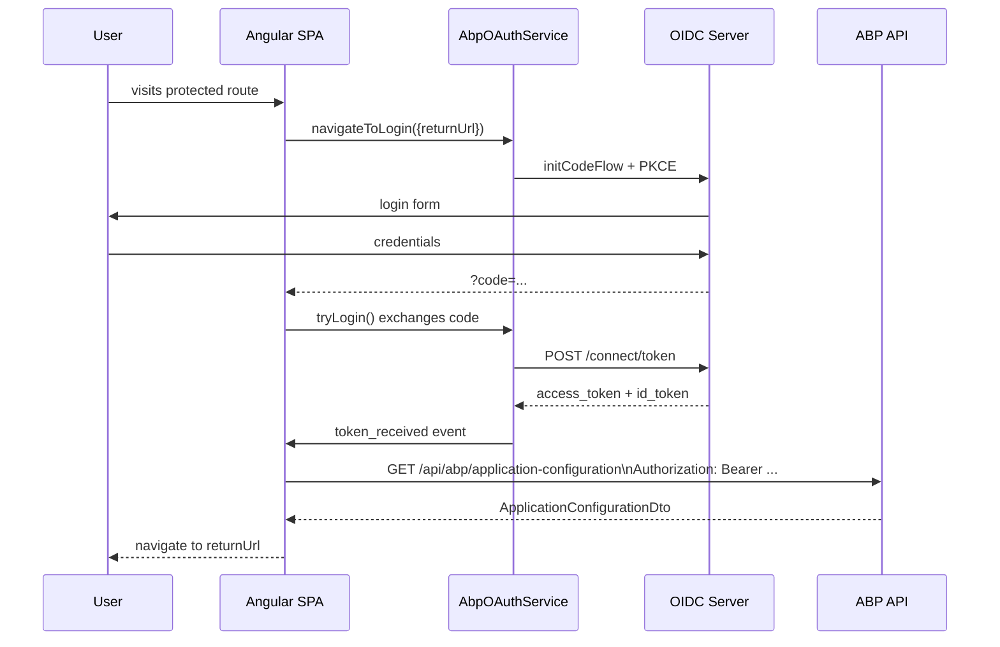

`@abp/ng.oauth` is the bridge between ABP Framework's authentication contracts (`AuthService`, `AuthGuard`, `ApiInterceptor`, `PIPE_TO_LOGIN_FN_KEY`, `NAVIGATE_TO_MANAGE_PROFILE`) and the underlying [`angular-oauth2-oidc`](https://github.com/manfredsteyer/angular-oauth2-oidc) OIDC client. It supports both the Authorization Code + PKCE flow (the default — used when `oAuthConfig.responseType === 'code'`) and the legacy Resource Owner Password flow. Calling `provideAbpOAuth()` swaps the no-op core defaults for real implementations and installs the `OAuthApiInterceptor` that appends `Authorization: Bearer …`, `Accept-Language`, and the `__tenant` headers to every request. This page walks the strategy classes, services, guard, interceptor, and the token-storage adapters that enable both SPA and SSR scenarios.

## Package layout

```text packages/oauth/src/lib/
guards/           oauth.guard.ts                — AbpOAuthGuard + abpOAuthGuard CanActivateFn
handlers/         oauth-configuration.handler.ts — listens to EnvironmentService changes
interceptors/     api.interceptor.ts            — OAuthApiInterceptor
providers/        oauth-module-config.provider.ts (provideAbpOAuth)
                  navigate-to-manage-profile.provider.ts
services/         oauth.service.ts              — AbpOAuthService implements IAuthService
                  oauth-error-filter.service.ts — OAuthErrorFilterService
                  remember-me.service.ts        — RememberMeService
                  browser-token-storage.service.ts (cookie-backed OAuthStorage)
                  memory-token-storage.service.ts
                  server-token-storage.service.ts (SSR)
strategies/       auth-flow-strategy.ts         — abstract base
                  auth-code-flow-strategy.ts    — AuthCodeFlowStrategy
                  auth-password-flow-strategy.ts — AuthPasswordFlowStrategy
tokens/           auth-flow-strategy.ts (AUTH_FLOW_STRATEGY)
                  cookies.ts
utils/            auth-utils.ts (pipeToLogin)
                  check-access-token.ts
                  clear-o-auth-storage.ts
                  oauth-storage.ts, storage.factory.ts
oauth.module.ts
```

```ts packages/oauth/src/public-api.ts
export * from './lib/oauth.module';
export * from './lib/utils';
export * from './lib/tokens';
export * from './lib/services';
export * from './lib/strategies';
export * from './lib/handlers';
export * from './lib/interceptors';
export * from './lib/guards';
export * from './lib/providers';
```

## `provideAbpOAuth`

Calling this factory swaps every authentication-related DI binding registered by [core](/angular/core-package#abstracts):

```ts packages/oauth/src/lib/providers/oauth-module-config.provider.ts
export function provideAbpOAuth() {
  const providers = [
    { provide: AuthService, useClass: AbpOAuthService },
    { provide: AuthGuard, useClass: AbpOAuthGuard },
    { provide: authGuard, useValue: abpOAuthGuard },
    { provide: asyncAuthGuard, useValue: asyncAbpOAuthGuard },
    { provide: ApiInterceptor, useClass: OAuthApiInterceptor },
    { provide: PIPE_TO_LOGIN_FN_KEY, useValue: pipeToLogin },
    { provide: CHECK_AUTHENTICATION_STATE_FN_KEY, useValue: checkAccessToken },
    { provide: HTTP_INTERCEPTORS, useExisting: ApiInterceptor, multi: true },
    NavigateToManageProfileProvider,
    provideAppInitializer(() => { inject(OAuthConfigurationHandler); }),
    OAuthModule.forRoot().providers as Provider[],
    ServerTokenStorageService,
    BrowserTokenStorageService,
    { provide: OAuthStorage, useFactory: oAuthStorageFactory },
    { provide: AuthErrorFilterService, useExisting: OAuthErrorFilterService },
  ];
  return makeEnvironmentProviders(providers);
}
```

| Replacement | Default in `@abp/ng.core` | OAuth-aware impl |
|---|---|---|
| `AuthService` | warning-only stub | `AbpOAuthService` |
| `AuthGuard` (class) | `IAbpGuard` stub | `AbpOAuthGuard` |
| `authGuard` (fn) | stub function | `abpOAuthGuard` |
| `asyncAuthGuard` (fn) | stub | `asyncAbpOAuthGuard` |
| `ApiInterceptor` | tracks loader-bar only | `OAuthApiInterceptor` adds Authorization headers |
| `PIPE_TO_LOGIN_FN_KEY` | identity | `pipeToLogin` — refreshes config, remembers user, redirects |
| `CHECK_AUTHENTICATION_STATE_FN_KEY` | constant `true` | `checkAccessToken` |
| `NAVIGATE_TO_MANAGE_PROFILE` | `noop` | redirects to `${issuer}/Account/Manage` |
| `AuthErrorFilterService` | base filter | `OAuthErrorFilterService` (suppresses noisy OAuth errors) |
| `OAuthStorage` | n/a | `oAuthStorageFactory` (cookies in browser, server cookies in SSR, memory fallback) |

`provideAppInitializer(() => inject(OAuthConfigurationHandler))` ensures the handler is instantiated at boot so it can re-configure `OAuthService` whenever `EnvironmentService` updates.

<Tip>The legacy `AbpOAuthModule.forRoot()` is still exported (`oauth.module.ts`) but its body is just `[provideAbpOAuth()]`. Apps should call the provider directly.</Tip>

## `AbpOAuthService` — strategy delegation

`AbpOAuthService` (`services/oauth.service.ts`) does not implement OIDC plumbing itself. It picks a strategy based on `oAuthConfig.responseType` and delegates every `IAuthService` method to it:

```ts packages/oauth/src/lib/services/oauth.service.ts
@Injectable({ providedIn: 'root' })
export class AbpOAuthService implements IAuthService {
  protected injector = inject(Injector);
  private strategy!: AuthFlowStrategy;
  private readonly oAuthService: OAuthService;

  async init() {
    const environmentService = this.injector.get(EnvironmentService);
    const result$ = environmentService.getEnvironment$().pipe(
      map(env => env?.oAuthConfig),
      filter(Boolean),
      tap(oAuthConfig => {
        this.strategy =
          oAuthConfig.responseType === 'code'
            ? AUTH_FLOW_STRATEGY.Code(this.injector)
            : AUTH_FLOW_STRATEGY.Password(this.injector);
      }),
      switchMap(() => from(this.strategy.init())),
      take(1),
    );
    return await lastValueFrom(result$);
  }

  login(params: LoginParams)            { return this.strategy.login(params); }
  logout(queryParams?: Params)          { return this.strategy.logout(queryParams); }
  navigateToLogin(queryParams?: Params) { this.strategy.navigateToLogin(queryParams); }
  get isAuthenticated(): boolean        { return this.oAuthService.hasValidAccessToken(); }
}
```

The `AUTH_FLOW_STRATEGY` token (`tokens/auth-flow-strategy.ts`) is a plain factory map:

```ts packages/oauth/src/lib/tokens/auth-flow-strategy.ts
export const AUTH_FLOW_STRATEGY = {
  Code(injector: Injector) { return new AuthCodeFlowStrategy(injector); },
  Password(injector: Injector) { return new AuthPasswordFlowStrategy(injector); },
};
```

This pattern keeps both strategies tree-shakeable on builds that target only one (provided you replace the token).

## `AuthFlowStrategy` base class

```ts packages/oauth/src/lib/strategies/auth-flow-strategy.ts
export abstract class AuthFlowStrategy {
  abstract readonly isInternalAuth: boolean;

  protected httpErrorReporter: HttpErrorReporterService;
  protected environment: EnvironmentService;
  protected configState: ConfigStateService;
  protected oAuthService: OAuthService2;
  protected oAuthConfig!: AuthConfig;
  protected sessionState: SessionStateService;
  protected localStorageService: AbpLocalStorageService;
  protected rememberMeService: RememberMeService;
  protected windowService: AbpWindowService;
  protected tenantKey: string;
  protected router: Router;

  abstract checkIfInternalAuth(queryParams?: Params): boolean;
  abstract navigateToLogin(queryParams?: Params): void;
  abstract logout(queryParams?: Params): Observable<any>;
  abstract login(params?: LoginParams | Params): Observable<any>;
}
```

| Member | Purpose |
|---|---|
| `isInternalAuth` | `true` = local UI handles login; `false` = redirect to OIDC server |
| `checkIfInternalAuth` | Decide at runtime whether the SPA should show the login screen |
| `navigateToLogin` | For Code flow, calls `initCodeFlow`; for Password, navigates `/account/login` |
| `logout` | Revokes the token and clears storage |
| `login` | For Password flow, calls `fetchTokenUsingPasswordFlow` |

### `AuthCodeFlowStrategy` (OIDC + PKCE)

```ts packages/oauth/src/lib/strategies/auth-code-flow-strategy.ts
export class AuthCodeFlowStrategy extends AuthFlowStrategy {
  readonly isInternalAuth = false;

  async init() {
    this.checkRememberMeOption();
    this.listenToTokenReceived();
    if (!this.appStartedWithSSR && isPlatformBrowser(this.platformId)) {
      return super
        .init()
        .then(() => this.oAuthService.tryLogin().catch(noop))
        .then(() => this.oAuthService.setupAutomaticSilentRefresh());
    }
  }

  navigateToLogin(queryParams?: Params) {
    if (isPlatformBrowser(this.platformId)) {
      if (this.appStartedWithSSR) {
        this.document.defaultView?.location.replace('/authorize');
      } else {
        let additionalState = queryParams?.returnUrl ? queryParams.returnUrl : '';
        const cultureParams = this.getCultureParams(queryParams);
        this.oAuthService.initCodeFlow(additionalState, cultureParams);
      }
    }
  }
}
```

Highlights:

- Calls `tryLogin()` to consume the `?code=` callback returned by the OIDC server.
- Calls `setupAutomaticSilentRefresh()` to keep the token fresh in the background.
- `getCultureParams` and `setUICulture` propagate the active language back to the OIDC server so the login page honours it.
- `replaceURLParams` strips `iss`, `culture`, and `ui-culture` from the address bar after a successful sign-in.

### `AuthPasswordFlowStrategy`

```ts packages/oauth/src/lib/strategies/auth-password-flow-strategy.ts
export class AuthPasswordFlowStrategy extends AuthFlowStrategy {
  readonly isInternalAuth = true;

  navigateToLogin(queryParams?: Params) {
    const router = this.injector.get(Router);
    return router.navigate(['/account/login'], { queryParams });
  }

  login(params: LoginParams): Observable<any> {
    const tenant = this.sessionState.getTenant();
    return from(
      this.oAuthService.fetchTokenUsingPasswordFlow(
        params.username,
        params.password,
        new HttpHeaders({ ...(tenant && tenant.id && { [this.tenantKey]: tenant.id }) }),
      ),
    ).pipe(pipeToLogin(params, this.injector));
  }

  logout() {
    const router = this.injector.get(Router);
    return from(this.oAuthService.revokeTokenAndLogout(true)).pipe(
      switchMap(() => this.configState.refreshAppState()),
      tap(() => {
        this.rememberMeService.remove();
        router.navigateByUrl('/');
      }),
    );
  }
}
```

This flow is `isInternalAuth = true`, meaning the `@abp/ng.account` `LoginComponent` is shown inside the SPA. The strategy attaches the active tenant header (`__tenant`) and pipes through `pipeToLogin` to refresh the config state.

### Strategy selection



## `pipeToLogin` — what happens after a token arrives

`utils/auth-utils.ts` exports the `pipeToLogin` operator. It refreshes the application configuration (so freshly granted permissions are loaded), persists the rememberMe flag, and redirects to the originally requested URL:

```ts packages/oauth/src/lib/utils/auth-utils.ts
export const pipeToLogin: PipeToLoginFn = function (params, injector) {
  const configState = injector.get(ConfigStateService);
  const router = injector.get(Router);
  const rememberMeService = injector.get(RememberMeService);
  const authService = injector.get(AuthService);
  return pipe(
    switchMap(() => configState.refreshAppState()),
    tap(() => {
      rememberMeService.set(
        params.rememberMe ||
        rememberMeService.get() ||
        rememberMeService.getFromToken(authService.getAccessToken())
      );
      if (params.redirectUrl) router.navigate([params.redirectUrl]);
    }),
  );
};
```

This function is bound to `PIPE_TO_LOGIN_FN_KEY` and called by `@abp/ng.account`'s `LoginComponent` after a successful sign-in.

## Token and tenant headers

`OAuthApiInterceptor` replaces the no-op `ApiInterceptor` from [core](/angular/core-package). It adds the bearer token, language, and tenant headers to every ABP request, while skipping external requests marked with `IS_EXTERNAL_REQUEST`:

```ts packages/oauth/src/lib/interceptors/api.interceptor.ts
@Injectable({ providedIn: 'root' })
export class OAuthApiInterceptor implements IApiInterceptor {
  private oAuthService = inject(OAuthService);
  private sessionState = inject(SessionStateService);
  private httpWaitService = inject(HttpWaitService);
  private tenantKey = inject(TENANT_KEY);

  intercept(request: HttpRequest<any>, next: HttpHandler): Observable<HttpEvent<any>> {
    this.httpWaitService.addRequest(request);
    const isExternalRequest = request.context?.get(IS_EXTERNAL_REQUEST);
    const newRequest = isExternalRequest
      ? request
      : request.clone({ setHeaders: this.getAdditionalHeaders(request.headers) });
    return next.handle(newRequest).pipe(finalize(() => this.httpWaitService.deleteRequest(request)));
  }

  getAdditionalHeaders(existingHeaders?: HttpHeaders) {
    const headers = {} as any;
    const token = this.oAuthService.getAccessToken();
    if (!existingHeaders?.has('Authorization') && token) {
      headers['Authorization'] = `Bearer ${token}`;
    }
    const lang = this.sessionState.getLanguage();
    if (!existingHeaders?.has('Accept-Language') && lang) {
      headers['Accept-Language'] = lang;
    }
    const tenant = this.sessionState.getTenant();
    if (!existingHeaders?.has(this.tenantKey) && tenant?.id) {
      headers[this.tenantKey] = tenant.id;
    }
    headers['X-Requested-With'] = 'XMLHttpRequest';
    return headers;
  }
}
```

| Header | Source |
|---|---|
| `Authorization: Bearer …` | `OAuthService.getAccessToken()` |
| `Accept-Language` | `SessionStateService.getLanguage()` |
| `__tenant` (or `TENANT_KEY` override) | `SessionStateService.getTenant().id` |
| `X-Requested-With: XMLHttpRequest` | constant — marks the call as XHR |

The header names align with the server-side [HTTP](/http/overview) pipeline and the [ASP.NET Core MVC](/aspnetcore/mvc) auth middleware.

## Guards

```ts packages/oauth/src/lib/guards/oauth.guard.ts
export const abpOAuthGuard: CanActivateFn = (route, state) => {
  const oAuthService = inject(OAuthService);
  const authService = inject(AuthService);
  const platformId = inject(PLATFORM_ID);
  const resInit = inject(RESPONSE_INIT);
  const environmentService = inject(EnvironmentService);

  const hasValidAccessToken = oAuthService.hasValidAccessToken();
  if (hasValidAccessToken) return true;

  const params = { returnUrl: state.url };
  if (isPlatformServer(platformId) && resInit) {
    const ssrAuthorizationUrl = environmentService.getEnvironment().oAuthConfig.ssrAuthorizationUrl;
    const url = buildLoginUrl(ssrAuthorizationUrl, params);
    const headers = new Headers(resInit.headers);
    headers.set('Location', url);
    resInit.status = 302;
    resInit.statusText = 'Found';
    resInit.headers = headers;
    return;
  }
  authService.navigateToLogin(params);
  return false;
};
```

Three notable behaviours:

1. **Browser**: a missing/expired token redirects to login via `authService.navigateToLogin()`.
2. **SSR**: the guard sets a 302 `Location` on Angular's `RESPONSE_INIT` so the upstream server emits the redirect — no browser round-trip.
3. The guard reads `oAuthConfig.ssrAuthorizationUrl` from `EnvironmentService` so SSR redirects can go to a dedicated URL.

`buildLoginUrl` appends params as a query string:

```ts
export const buildLoginUrl = (path: string, params?: Params): string => {
  if (!params || Object.keys(params).length === 0) return path;
  const usp = new URLSearchParams();
  for (const [k, v] of Object.entries(params)) {
    if (v == null) continue;
    Array.isArray(v) ? v.forEach(x => usp.append(k, String(x))) : usp.set(k, String(v));
  }
  return `${path}?${usp.toString()}`;
};
```

## Token storage adapters

Three `OAuthStorage` implementations are provided; `oAuthStorageFactory` (utils/storage.factory.ts) picks the right one at runtime:

| Adapter | When |
|---|---|
| `BrowserTokenStorageService` | Browser without SSR — writes secure cookies |
| `ServerTokenStorageService` | SSR — reads/writes from Angular's `Request`/`Response` cookies |
| `MemoryTokenStorageService` | Tests / non-DOM environments |

```ts packages/oauth/src/lib/services/browser-token-storage.service.ts
@Injectable({ providedIn: 'root' })
export class BrowserTokenStorageService implements OAuthStorage {
  getItem(key: string): string { return this.readCookie(key); }
  setItem(key: string, data: string): void { this.writeCookie(key, data); }
  removeItem(key: string): void { this.removeCookie(key); }

  writeCookie(name: string, value: string, days = 7): void {
    if (typeof document === 'undefined') return;
    const expires = new Date(Date.now() + days * 86400000).toUTCString();
    document.cookie = `${name}=${encodeURIComponent(value)}; expires=${expires}; path=/; Secure; SameSite=Lax`;
  }
}
```

Cookies use `Secure` + `SameSite=Lax` and default to 7 days.

## `RememberMeService`

`RememberMeService` persists the rememberMe flag across reloads. In SSR mode it writes to a server cookie; in the browser it writes to local storage. The flag is also inferred from the JWT itself (`getFromToken`):

```ts packages/oauth/src/lib/services/remember-me.service.ts
@Injectable({ providedIn: 'root' })
export class RememberMeService {
  readonly #rememberMe = 'remember_me';
  protected readonly localStorageService = inject(AbpLocalStorageService);
  protected readonly cookieStorageService = inject(AbpCookieStorageService);
  private appStartedWithSsr = inject(APP_STARTED_WITH_SSR, { optional: true });

  set(remember: boolean) { /* cookie if SSR, localStorage otherwise */ }
  get(): boolean { /* same selection */ }
  remove() { /* same selection */ }
  getFromToken(accessToken: string) { /* parse JWT */ }
}
```

`@abp/ng.account`'s `LoginComponent` calls `rememberMeService.set(true)` when the user checks the box. The Code flow strategy inspects this flag in `checkRememberMeOption` and logs out if the access token expired but the user did not opt to be remembered.

## `OAuthConfigurationHandler`

```ts packages/oauth/src/lib/handlers/oauth-configuration.handler.ts
@Injectable({ providedIn: 'root' })
export class OAuthConfigurationHandler {
  private oAuthService = inject(OAuthService);
  private environmentService = inject(EnvironmentService);
  private options = inject<ABP.Root>(CORE_OPTIONS);

  constructor() { this.listenToSetEnvironment(); }

  private listenToSetEnvironment() {
    this.environmentService
      .createOnUpdateStream(state => state)
      .pipe(
        map(environment => environment.oAuthConfig as AuthConfig),
        filter(config => !compare(config, this.options.environment.oAuthConfig)),
      )
      .subscribe(config => this.oAuthService.configure(config));
  }
}
```

Why: ABP apps fetched a fresh `oAuthConfig` (e.g. tenant-aware authority URL) after the initial load. The handler reconfigures `OAuthService` whenever `EnvironmentService` emits a non-equal config.

## `NavigateToManageProfileProvider`

```ts packages/oauth/src/lib/providers/navigate-to-manage-profile.provider.ts
export const NavigateToManageProfileProvider: Provider = {
  provide: NAVIGATE_TO_MANAGE_PROFILE,
  useFactory: () => {
    const environment = inject(EnvironmentService);
    return () => {
      const env = environment.getEnvironment();
      if (!env.oAuthConfig) return;
      const { issuer } = env.oAuthConfig;
      const path = issuer.endsWith('/') ? issuer : `${issuer}/`;
      window.open(`${path}Account/Manage?returnUrl=${window.location.href}`, '_self');
    };
  },
};
```

When the code flow is in use, "My Account" navigates to the OIDC server's `Account/Manage` Razor page — the same page documented under [/modules/account](/modules/account). Password-flow apps (which keep the user inside the SPA) shadow this token with their own navigation.

## End-to-end login sequence (Code flow)



## Cross-links

- [Core](/angular/core-package#abstracts) — `AuthService`, `AuthGuard`, `ApiInterceptor` contracts that this package replaces.
- [Account](/angular/account-and-account-core) — Login screen that calls `authService.login()` for the password flow.
- [Theme Basic](/angular/theme-basic) — User-menu "My Account" entry calls `NAVIGATE_TO_MANAGE_PROFILE`.
- [HTTP](/http/overview) — Server side that validates the bearer token and tenant header.
- [Identity module](/modules/identity) and [Account module](/modules/account) — Backend issuing the access token.
