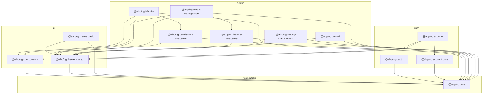
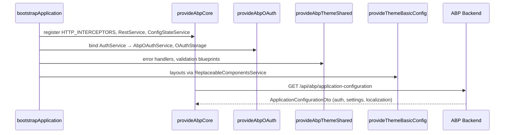

The Angular workspace under `npm/ng-packs/` is the canonical home for the **ABP Framework** browser UI. It is an [Nx](https://nx.dev) monorepo (`nx.json` declares `workspaceLayout.libsDir = "packages"`) where each library compiles independently with [ng-packagr](https://github.com/ng-packagr/ng-packagr) and ships to npm under the `@abp/ng.*` scope. This page maps every published package, shows how they depend on one another, and points at the entry-point files (`package.json`, `public-api.ts`, module classes, `provideAbp*` factories) that anchor the rest of this Angular wiki. Use it as your jumping-off point before diving into [core](/angular/core-package), [components](/angular/components), [theme-shared](/angular/theme-shared), [theme-basic](/angular/theme-basic), [oauth](/angular/oauth), [account](/angular/account-and-account-core), and [identity](/angular/identity).

## The 15 published libraries

`ls npm/ng-packs/packages/` returns fifteen directories. Every one has its own `package.json`, `ng-package.json`, and `project.json` (Nx project descriptor), and is published independently to npm with [Lerna](https://lerna.js.org/) — see `lerna.publish.json`:

```json npm/ng-packs/lerna.publish.json
{
  "version": "1.0.0",
  "packages": ["dist/packages/*"],
  "npmClient": "yarn"
}
```

The build pipeline (`package.json` script `build:all`) runs `nx run-many --target=build --all --exclude=dev-app,schematics --prod` and then compiles `packages/schematics`, producing one tarball per library in `dist/packages/*`.

<Info>The workspace currently aligns on Angular 21 (`@angular/core@21.0.0` in `package.json`) and the matching `@nx/angular` 21 tooling. Every library targets the same Angular major.</Info>

### Package catalog

| npm name | Folder | Role | Wiki page |
|---|---|---|---|
| `@abp/ng.core` | `packages/core` | DI providers, HTTP, auth abstracts, localization, routes service | [Core](/angular/core-package) |
| `@abp/ng.components` | `packages/components` | Multi-entry-point: page, dynamic-form, extensible, tree, lookup, chart.js | [Components](/angular/components) |
| `@abp/ng.theme.shared` | `packages/theme-shared` | Theme-agnostic UI: breadcrumb, modal, toast, confirmation | [Theme Shared](/angular/theme-shared) |
| `@abp/ng.theme.basic` | `packages/theme-basic` | Default Bootstrap 5 theme with application/account layouts | [Theme Basic](/angular/theme-basic) |
| `@abp/ng.oauth` | `packages/oauth` | OAuth2 / OIDC integration over `angular-oauth2-oidc` | [OAuth](/angular/oauth) |
| `@abp/ng.account` | `packages/account` | Login, register, manage-profile screens & routing | [Account](/angular/account-and-account-core) |
| `@abp/ng.account.core` | `packages/account-core` | Headless account services + generated proxies | [Account](/angular/account-and-account-core) |
| `@abp/ng.identity` | `packages/identity` | Users & roles management UI | [Identity](/angular/identity) |
| `@abp/ng.permission-management` | `packages/permission-management` | Permission tree modal — used by Identity | — |
| `@abp/ng.tenant-management` | `packages/tenant-management` | Tenants CRUD UI | — |
| `@abp/ng.feature-management` | `packages/feature-management` | Feature flag editor | — |
| `@abp/ng.setting-management` | `packages/setting-management` | Setting groups & values UI | — |
| `@abp/ng.cms-kit` | `packages/cms-kit` | CMS Kit page/blog/menu admin UI | — |
| `@abp/ng.schematics` | `packages/schematics` | `ng generate` collection (proxy-add, service, ...) | — |
| `@abp/nx.generators` | `packages/generators` | Nx workspace generators (`update-version`, ...) | — |

The four CRUD-style admin modules (`identity`, `tenant-management`, `feature-management`, `setting-management`, `permission-management`) all follow the same internal shape: a `packages/<name>/src/lib/` Angular library plus a `packages/<name>/proxy/` ng-package that re-exports generated HTTP service classes — see `npm/ng-packs/packages/identity/proxy/`.

## Dependency graph



Every node except `@abp/ng.core` and `@abp/ng.theme.lepton-x` (an external paid theme) imports `@abp/ng.core`. `@abp/ng.theme.basic` is the **only** package allowed to inject DOM styles directly via `LazyStyleHandler` — see `packages/theme-basic/src/lib/handlers/`. Admin modules pick up shared building blocks (`PageComponent`, `ExtensibleTableComponent`, `BreadcrumbComponent`) from `@abp/ng.components` and `@abp/ng.theme.shared`.

## Anatomy of a package

Every library folder follows the same skeleton — illustrated here with `packages/core`:

```
packages/core/
├── package.json          # npm metadata (name, version, peer deps)
├── ng-package.json       # ng-packagr entry: lib settings, secondary entry points
├── project.json          # Nx target descriptor (build, test, lint)
├── tsconfig.lib.json     # TS compiler options for library
├── src/
│   ├── public-api.ts     # The barrel that becomes the package "main"
│   ├── test-setup.ts
│   └── lib/
│       ├── core.module.ts
│       ├── providers/    # provideAbpCore(...features) lives here
│       ├── services/     # ConfigStateService, RestService, ...
│       ├── interceptors/, guards/, directives/, pipes/, tokens/, ...
│       └── proxy/        # generated DTOs & HTTP clients
└── testing/              # additional jest entry point for mocks
```

The library's npm name comes from `packages/core/package.json`:

```json packages/core/package.json
{
  "name": "@abp/ng.core",
  "version": "10.2.0-rc.3",
  "homepage": "https://abp.io",
  "dependencies": {
    "@abp/utils": "~10.2.0-rc.3",
    "just-clone": "^6.0.0",
    "just-compare": "^2.0.0",
    "ts-toolbelt": "^9.0.0",
    "tslib": "^2.0.0",
    "luxon": "^3.0.0"
  },
  "license": "LGPL-3.0"
}
```

<Note>The npm versions are decoupled from the .NET package versions you see in `/aspnetcore/mvc`. Angular packages follow their own `10.2.0-rc.3` channel and bump together via `nx generate @abp/nx.generators:update-version`.</Note>

## Secondary entry points

Several packages publish more than one entry point through ng-packagr. The clearest example is `@abp/ng.components`, whose root `src/public-api.ts` exports nothing — each feature is its own sub-package:

```ts packages/components/src/public-api.ts
/*
 * Public API Surface of components
 */
export {};
```

```text packages/components/
chart.js/      ng-package.json → @abp/ng.components/chart.js
dynamic-form/  ng-package.json → @abp/ng.components/dynamic-form
extensible/    ng-package.json → @abp/ng.components/extensible
lookup/        ng-package.json → @abp/ng.components/lookup
page/          ng-package.json → @abp/ng.components/page
tree/          ng-package.json → @abp/ng.components/tree
```

Consumers therefore write `import { PageComponent } from '@abp/ng.components/page';` rather than `from '@abp/ng.components';`. The same pattern is used by `@abp/ng.identity/proxy`, `@abp/ng.account.core/proxy`, and `@abp/ng.permission-management/config`.

## Bootstrapping an ABP Angular app

A typical `app.config.ts` strings the package factories together. The exported `provideAbpCore`, `provideAbpOAuth`, and `provideAbpThemeShared` functions are the modern, standalone-friendly entry points; the legacy `forRoot()` static methods on `CoreModule`, `AbpOAuthModule`, and `ThemeSharedModule` are still exported but marked `@deprecated`.



Each `provide…` returns `EnvironmentProviders` built with `makeEnvironmentProviders([...])`, which means they may only be registered at the application root (`bootstrapApplication`) or via `Route.providers`. We dissect every factory in the dedicated package pages.

## Why so many packages?

Pull on three threads and the split makes sense:

1. **Tree-shaking and replaceable theming.** Apps that use the commercial Lepton-X theme should not ship `@abp/ng.theme.basic`. Splitting them lets `package.json` `dependencies` decide what ships.
2. **Backend module parity.** Each .NET ABP module (`Volo.Abp.Identity`, `Volo.Abp.Account`, etc.) has a matching Angular package. The `proxy/` folder inside each ng-package mirrors the C# `IRemoteService` interface declared in the corresponding [Identity](/modules/identity) or [Account](/modules/account) module, generated through `abp generate-proxy -t ng`.
3. **Replaceability.** Every UI library calls `ReplaceableComponentsService.add(...)` to register a default component. Apps swap that out without forking — see how `@abp/ng.theme.basic` does it in `providers/styles.provider.ts`.

## Build & publish pipeline

The Nx workspace ties every package together through one `package.json` at `npm/ng-packs/`. Key scripts:

```json npm/ng-packs/package.json
"scripts": {
  "ng": "nx",
  "build": "ng build",
  "build:all": "nx run-many --target=build --all --exclude=dev-app,schematics --prod && npm run build:schematics",
  "build:schematics": "cd scripts && yarn && yarn build:schematics && cd ..",
  "test": "ng test --detect-open-handles=true --run-in-band=true --watch-all=true",
  "test:all": "nx run-many --target=test --all",
  "test:vitest": "vitest",
  "lint": "nx workspace-lint && ng lint",
  "lint:all": "nx run-many --target=lint --all",
  "affected:build": "nx affected:build --parallel 1",
  "affected:test": "nx affected:test",
  "format": "nx format:write",
  "lerna": "lerna",
  "update-version": "nx generate @abp/nx.generators:update-version"
}
```

The complete CI run is `yarn ci`, defined as `yarn affected:lint && yarn affected:build && yarn affected:test`. `affected:*` targets compute the dependency graph from `nx.json`'s `projects` and only re-run downstream packages when an upstream library changes — see `nx.json`:

```json npm/ng-packs/nx.json
{
  "workspaceLayout": { "libsDir": "packages", "appsDir": "" },
  "defaultProject": "dev-app",
  "generators": {
    "@nx/angular:application": {
      "e2eTestRunner": "cypress",
      "linter": "eslint",
      "style": "scss",
      "unitTestRunner": "jest"
    },
    "@nx/angular:library": {
      "linter": "eslint",
      "unitTestRunner": "jest",
      "strict": false
    }
  }
}
```

Each library's `project.json` declares its `build`, `lint`, and `test` targets. `build:all` excludes `dev-app` (the demo SPA shipped in `packages/dev-app/`) and `schematics` (which builds with a plain `tsc -p packages/schematics/tsconfig.json`).

## Package versioning

Versions live in each `packages/<name>/package.json` and are bumped uniformly by `nx generate @abp/nx.generators:update-version`. The peer dependency graph is hand-maintained — `@abp/ng.identity` declares `@abp/ng.core`, `@abp/ng.theme.shared`, `@abp/ng.components`, and `@abp/ng.permission-management` as peers. Two packages also ship a `testing/` entry point for jest/vitest harnesses (`@abp/ng.core/testing`, `@abp/ng.theme.shared/testing`).

## Cross-cutting conventions

Across all 15 libraries you'll see the same conventions:

| Convention | Where it lives |
|---|---|
| `provideAbp<X>` / `with<Feature>` factories | `providers/` folder per package |
| `@deprecated` legacy `<Module>.forRoot()` | Module file kept beside provider |
| Replaceable components | `eXyzComponents` enum + `ReplaceableComponentsService.add` |
| Lazy admin UIs | `createRoutes(options)` exported from package root |
| Extension contributors | `XYZ_<SURFACE>_CONTRIBUTORS` tokens + resolver |
| Standalone components | All UI components since v8; modules kept for back-compat |
| Object extensions | `getObjectExtensionEntitiesFromStore(injector, 'Identity')` |
| Localization keys | `'AbpUi::*'`, `'AbpAccount::*'`, `'AbpIdentity::*'` etc. |
| Permissions / policies | Strings like `AbpIdentity.Users.Update` evaluated by `PermissionService` |

These conventions mean experience with one admin module (e.g. Identity) transfers directly to the others (Tenant Management, Setting Management, Feature Management, CMS Kit).

## Where to read next

<CardGroup cols={2}>
  <Card title="Core Package" icon="cube" href="/angular/core-package">
    `@abp/ng.core` — services, interceptors, guards, providers.
  </Card>
  <Card title="Components" icon="grid-2" href="/angular/components">
    Multi-entry-point shared UI: page, extensible, tree, lookup.
  </Card>
  <Card title="Theme Shared" icon="palette" href="/angular/theme-shared">
    Cross-theme primitives: modal, breadcrumb, toast.
  </Card>
  <Card title="Theme Basic" icon="bootstrap" href="/angular/theme-basic">
    Default Bootstrap 5 layouts.
  </Card>
  <Card title="OAuth" icon="key" href="/angular/oauth">
    OIDC code + password flows.
  </Card>
  <Card title="Account & Core" icon="user" href="/angular/account-and-account-core">
    Login, register, manage-profile.
  </Card>
  <Card title="Identity" icon="users" href="/angular/identity">
    Users and roles admin UI.
  </Card>
  <Card title="HTTP Stack" icon="globe" href="/http/overview">
    How the Angular `RestService` matches the .NET HTTP layer.
  </Card>
</CardGroup>

## Cross-references

- The `RestService` in `packages/core/src/lib/services/rest.service.ts` calls into the [HTTP layer](/http/overview) configured server-side via `Volo.Abp.AspNetCore.Mvc`.
- `ApplicationConfigurationDto` consumed by `ConfigStateService` is rendered by the [ASP.NET Core MVC](/aspnetcore/mvc) module's `AbpApplicationConfigurationAppService`.
- `@abp/ng.identity` calls the same REST endpoints as the [Identity module](/modules/identity) MVC pages.
- `@abp/ng.account` mirrors the screens shipped by [Account module](/modules/account).
