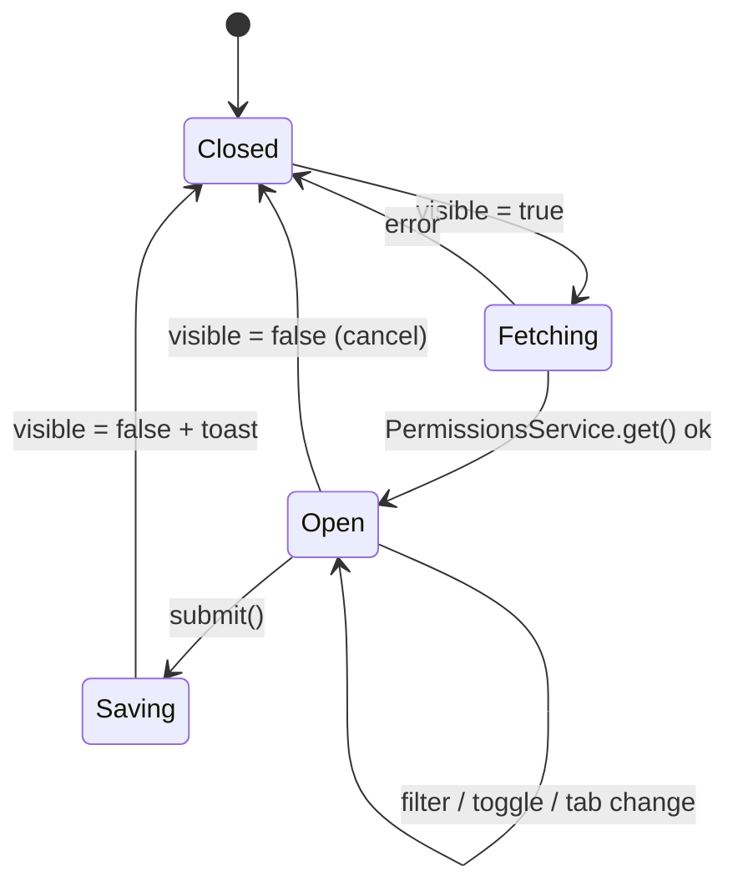
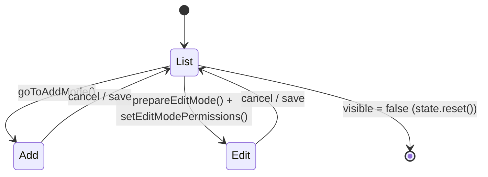

The `@abp/ng.permission-management` package ships the Angular UI used by the ABP Framework to grant and revoke permissions for any provider (role `R`, user `U`, or a custom resource). It is consumed transitively by `@abp/ng.identity` and `@abp/ng.tenant-management`, but is also exposed publicly so that custom administration screens can embed `<abp-permission-management>` and `<abp-resource-permission-management>` directly. This page walks through every file under `npm/ng-packs/packages/permission-management/`, explains the signal-driven state machine in `PermissionManagementComponent`, and documents the resource-permission extension points wired through `RESOURCE_PERMISSION_ENTITY_PROP_CONTRIBUTORS`.

## Package layout

The package is split into two ng-package secondary entry points: the main UI entry at `src/` and a proxy entry at `proxy/` that contains the generated REST client. The split mirrors what `ng generate @abp/ng.schematics:proxy-add` produces for application modules — see [Service proxying](/cli/service-proxying) for the generator workflow.

| Path | Public symbol | Purpose |
| --- | --- | --- |
| `src/lib/permission-management.module.ts` | `PermissionManagementModule` | NgModule re-export of the standalone component. |
| `src/lib/components/permission-management.component.ts` | `PermissionManagementComponent` | Modal grid for `(providerName, providerKey)` permissions. |
| `src/lib/components/resource-permission-management/resource-permission-management.component.ts` | `ResourcePermissionManagementComponent` | Modal for resource-scoped ACLs (list/add/edit modes). |
| `src/lib/services/resource-permission-state.service.ts` | `ResourcePermissionStateService` | Signal store shared by the resource sub-components. |
| `src/lib/services/extensions.service.ts` | `configureResourcePermissionExtensions` | Wires entity-prop contributors into `ExtensionsService`. |
| `src/lib/tokens/extensions.token.ts` | `RESOURCE_PERMISSION_ENTITY_PROP_CONTRIBUTORS` | DI token for table-prop overrides. |
| `src/lib/enums/components.ts` | `ePermissionManagementComponents` | Replaceable-component identifiers. |
| `src/lib/enums/view-modes.ts` | `eResourcePermissionViewModes` | `list \| add \| edit` state for the resource modal. |
| `src/lib/defaults/default-resource-permission-entity-props.ts` | `DEFAULT_RESOURCE_PERMISSION_ENTITY_PROPS` | Default `EntityProp[]` for the resource table. |
| `proxy/src/lib/proxy/permissions.service.ts` | `PermissionsService` | REST client for `/api/permission-management/permissions`. |
| `proxy/src/lib/proxy/models.ts` | `PermissionGroupDto`, `UpdatePermissionDto`, etc. | Generated DTOs. |

The `src/public-api.ts` barrel re-exports `./lib/components`, `./lib/enums/components`, `./lib/models`, and `./lib/permission-management.module`, so consumers import everything as `@abp/ng.permission-management`. The proxy mirror uses `proxy/src/public-api.ts` so the DTO/REST surface is `@abp/ng.permission-management/proxy`.

## Module + standalone bootstrap

`src/lib/permission-management.module.ts` is intentionally minimal — `PermissionManagementComponent` is already standalone, so the NgModule just re-exports it for legacy consumers that still rely on `imports: [PermissionManagementModule]`.

```ts src/lib/permission-management.module.ts
import { NgModule } from '@angular/core';
import { PermissionManagementComponent } from './components';

@NgModule({
  declarations: [],
  imports: [PermissionManagementComponent],
  exports: [PermissionManagementComponent],
})
export class PermissionManagementModule {}
```

Standalone consumption is the recommended path — drop `PermissionManagementComponent` into the host component's `imports` array and bind to `(visibleChange)`. The module shim exists only so that `IdentityModule.forLazy()` style call-sites keep compiling.

## Component contract

`PermissionManagementComponent` uses Angular's new signal-input API (`input()`, `output()`, `viewChildren()`) so the modal can be controlled from either signals or template-driven setters. The `PermissionManagement` namespace in `src/lib/models/permission-management.ts` describes the contract:

```ts src/lib/models/permission-management.ts
export namespace PermissionManagement {
  export interface State {
    permissionRes: GetPermissionListResultDto;
  }

  export interface PermissionManagementComponentInputs {
    visible: boolean;
    readonly providerName: string;
    readonly providerKey: string;
    readonly hideBadges: boolean;
  }

  export interface PermissionManagementComponentOutputs {
    readonly visibleChange: EventEmitter<boolean> | OutputEmitterRef<boolean>;
  }
}
```

The component declares the matching reactive inputs/outputs:

```ts src/lib/components/permission-management.component.ts
readonly providerNameInput = input('', { alias: 'providerName' });
readonly providerKeyInput  = input('', { alias: 'providerKey'  });
readonly hideBadgesInput   = input(false, { alias: 'hideBadges' });
readonly entityDisplayName = input<string | undefined>(undefined);
readonly visibleInput      = input(false, { alias: 'visible'   });
readonly visibleChange     = output<boolean>();
```

Each input has a getter/setter override (`_providerNameOverride`, `_providerKeyOverride`, `_hideBadgesOverride`, `_visible`) so that `ReplaceableTemplateDirective` from `@abp/ng.core` — which assigns properties imperatively — keeps working when a host module swaps the component via the `ePermissionManagementComponents.PermissionManagement` key.

| Input | Default | Effect |
| --- | --- | --- |
| `providerName` | `''` | Identifies the grant scope: `'R'` for role, `'U'` for user, custom string for ad-hoc providers. |
| `providerKey` | `''` | The role name, user id, or resource key. Required before the modal can open. |
| `hideBadges` | `false` | Hides the assigned-count chip drawn next to each tab. |
| `entityDisplayName` | `undefined` | Overrides the header label fetched from `GetPermissionListResultDto.entityDisplayName`. |
| `visible` | `false` | Two-way: setting `true` triggers `openModal()`; closing emits `visibleChange.emit(false)`. |

## Visibility state machine

The setter on `visible` is the entry point for opening/closing the modal. It fetches the permission tree, then calls `afterNextRender(this.initModal, …)` so checkbox indeterminate states are computed only once the template has been hydrated.

```ts src/lib/components/permission-management.component.ts
set visible(value: boolean) {
  if (value === this._visible()) return;

  if (value) {
    this.openModal().subscribe(() => {
      this._visible.set(true);
      this.visibleChange.emit(true);
      afterNextRender(() => { this.initModal(); }, { injector: this.injector });
    });
  } else {
    this.setSelectedGroup(null);
    this._visible.set(false);
    this.visibleChange.emit(false);
    this.filter.set('');
  }
}
```

A mirror `effect()` in the constructor keeps the signal input in sync, so both template binding (`[(visible)]`) and signal-set (`comp.visible = true`) work identically:

```ts src/lib/components/permission-management.component.ts
constructor() {
  effect(() => {
    const inputValue = this.visibleInput();
    untracked(() => {
      if (this._visible() !== inputValue) {
        if (inputValue) {
          this.openModal().subscribe(() => {
            this._visible.set(true);
            afterNextRender(() => { this.initModal(); }, { injector: this.injector });
          });
        } else {
          this.setSelectedGroup(null);
          this._visible.set(false);
          this.filter.set('');
        }
      }
    });
  });
}
```



## Group + permission processing

Once `openModal()` resolves, the response is mapped into a flat list joined with the group name so the search filter can match either the permission's `displayName` or its parent group's `displayName`. The flattening function lives at the bottom of `permission-management.component.ts`:

```ts src/lib/components/permission-management.component.ts
function getPermissions(groups: PermissionGroupDto[]): PermissionWithGroupName[] {
  return groups.reduce(
    (acc, val) => [
      ...acc,
      ...val.permissions.map<PermissionWithGroupName>(p => ({ ...p, groupName: val.name || '' })),
    ],
    [] as PermissionWithGroupName[],
  );
}
```

`permissionGroups` is a `computed()` that runs the search filter and, when results exist, also re-selects the first group. This keeps the left-hand tab strip in sync with the active filter without any imperative subscription bookkeeping. The hierarchy indent in the right-hand list is computed by `findMargin()`, which walks the parent chain and adds 20px per level, flipping `margin-left`/`margin-right` based on `document.body.dir` to respect RTL locales via `LocaleDirection`.

`setParentClicked()` enforces the parent/child rule: ticking a child auto-ticks every ancestor, while unticking a parent cascades the un-tick down through `findAllDescendantsOfByType`. The `findParentPermissions()` helper materialises the ancestor list using a `Map<string, PermissionGrantInfoDto>` lookup so the recursion stays O(depth).

## Submit pipeline

`submit()` diffs the current `permissions` array against the original snapshot (`this.data.groups`) and only ships the changed entries to the backend. If the active provider is `R` (role) or `U` (user) and matches the currently signed-in user, `shouldFetchAppConfig()` triggers `ConfigStateService.refreshAppState()` so the auth-state mirror in the running app picks up the new grants without a hard reload:

```ts src/lib/components/permission-management.component.ts
submit() {
  const unchangedPermissions = getPermissions(this.data.groups);

  const changedPermissions: UpdatePermissionDto[] = this.permissions
    .filter(per =>
      (unchangedPermissions.find(u => u.name === per.name) || {}).isGranted === per.isGranted
        ? false
        : true,
    )
    .map(({ name, isGranted }) => ({ name, isGranted }));

  if (!changedPermissions.length) { this.visible = false; return; }

  this.modalBusy = true;
  this.service
    .update(this.providerName, this.providerKey, { permissions: changedPermissions })
    .pipe(
      switchMap(() =>
        this.shouldFetchAppConfig() ? this.configState.refreshAppState() : of(null),
      ),
      finalize(() => (this.modalBusy = false)),
    )
    .subscribe(() => {
      this.visible = false;
      this.toasterService.success('AbpUi::SavedSuccessfully');
    });
}
```

The provider semantics map straight onto the backend module — see [Permission Management module](/modules/permission-management) for the C# side of the `PermissionsAppService`.

## REST surface

The proxy at `proxy/src/lib/proxy/permissions.service.ts` exposes one service with both the legacy permission API and the newer resource-permission API. Every method is generated by the `proxy-add` schematic from `generate-proxy.json`.

| Method | HTTP route | Returns |
| --- | --- | --- |
| `get(providerName, providerKey)` | `GET /api/permission-management/permissions` | `GetPermissionListResultDto` |
| `getByGroup(groupName, providerName, providerKey)` | `GET /api/permission-management/permissions/by-group` | `GetPermissionListResultDto` |
| `update(providerName, providerKey, input)` | `PUT /api/permission-management/permissions` | `void` |
| `getResource(resourceName, resourceKey)` | `GET …/permissions/resource` | `GetResourcePermissionListResultDto` |
| `getResourceByProvider(...)` | `GET …/permissions/resource/by-provider` | `GetResourcePermissionWithProviderListResultDto` |
| `getResourceDefinitions(resourceName)` | `GET …/permissions/resource-definitions` | `GetResourcePermissionDefinitionListResultDto` |
| `getResourceProviderKeyLookupServices(resourceName)` | `GET …/permissions/resource-provider-key-lookup-services` | `GetResourceProviderListResultDto` |
| `searchResourceProviderKey(resourceName, serviceName, filter, page)` | `GET …/permissions/search-resource-provider-keys` | `SearchProviderKeyListResultDto` |
| `updateResource(resourceName, resourceKey, input)` | `PUT …/permissions/resource` | `void` |
| `deleteResource(resourceName, resourceKey, providerName, providerKey)` | `DELETE …/permissions/resource` | `void` |

`apiName = 'AbpPermissionManagement'` is the key that `@abp/ng.core` `RestService` uses to look up the configured base URL from the `environment.apis` map — see `apps/dev-app/src/environments/environment.ts` for an example registration.

## Resource permission modal

`ResourcePermissionManagementComponent` (`src/lib/components/resource-permission-management/resource-permission-management.component.ts`) is the second public component. It is mounted by host modules that need to manage per-resource ACLs (file system folders, content items, etc.) and exposes a three-mode view machine driven by `ResourcePermissionStateService`.

```ts src/lib/components/resource-permission-management/resource-permission-management.component.ts
@Component({
  selector: 'abp-resource-permission-management',
  templateUrl: './resource-permission-management.component.html',
  exportAs: 'abpResourcePermissionManagement',
  providers: [ResourcePermissionStateService, ListService],
  imports: [
    ModalComponent, LocalizationPipe, ButtonComponent, ModalCloseDirective,
    ResourcePermissionListComponent, ResourcePermissionFormComponent,
  ],
})
export class ResourcePermissionManagementComponent implements OnInit {
  readonly resourceName       = input.required<string>();
  readonly resourceKey        = input.required<string>();
  readonly resourceDisplayName = input<string>();
  readonly visible            = model<boolean>(false);
}
```

The `model()` two-way input replaces the older `Output()` pattern, so consumers write `<abp-resource-permission-management [(visible)]="show" …>`. The component provides `ResourcePermissionStateService` at the component level so its signal store is reset whenever the modal is reinstantiated.

### State service signals

`ResourcePermissionStateService` centralises every piece of mutable state across the three sub-components (`resource-permission-list`, `resource-permission-form`, `provider-key-search`, `permission-checkbox-list`). It is registered with `@Injectable()` (no `providedIn`) because the component-scoped instance is what isolates the state.

| Signal | Type | Used by |
| --- | --- | --- |
| `viewMode` | `eResourcePermissionViewModes` | List → Add → Edit transitions. |
| `modalBusy` | `boolean` | Disables footer buttons during HTTP. |
| `hasResourcePermission` | `boolean` | Hides the "Add" action when no definitions exist. |
| `hasProviderKeyLookupService` | `boolean` | Toggles between dropdown and free-text key entry. |
| `resourceName` / `resourceKey` / `resourceDisplayName` | `string` | Mirrored from inputs via the constructor `effect`. |
| `allResourcePermissions` / `resourcePermissions` | `ResourcePermissionGrantInfoDto[]` | Full vs paginated slice. |
| `permissionDefinitions` | `ResourcePermissionDefinitionDto[]` | Catalog of allowed permissions for *Add*. |
| `permissionsWithProvider` | `ResourcePermissionWithProdiverGrantInfoDto[]` | Per-provider granted-by state for *Edit*. |
| `selectedPermissions` | `string[]` | Names checked in the form. |
| `providers` | `ResourceProviderDto[]` | Available `(providerName, lookupService)` pairs. |
| `selectedProviderName` / `selectedProviderKey` | `string` | Active selection in the *Add* form. |
| `searchFilter` / `searchResults` / `showDropdown` | … | Backs `provider-key-search.component`. |

The derived state is exposed via `computed()` so views only re-render when relevant inputs change:

```ts src/lib/services/resource-permission-state.service.ts
readonly isAddMode  = computed(() => this.viewMode() === eResourcePermissionViewModes.Add);
readonly isEditMode = computed(() => this.viewMode() === eResourcePermissionViewModes.Edit);
readonly isListMode = computed(() => this.viewMode() === eResourcePermissionViewModes.List);

readonly currentPermissionsList = computed(() =>
  this.isAddMode() ? this.permissionDefinitions() : this.permissionsWithProvider()
);

readonly allPermissionsSelected = computed(() => {
  const defs = this.currentPermissionsList();
  return defs.length > 0 && defs.every(p => this.selectedPermissions().includes(p.name || ''));
});
```

### View transitions



`goToAddMode()` clears `selectedPermissions`, `selectedProviderKey`, `searchResults` and `searchFilter` so the form starts blank. `setEditModePermissions(permissions)` (called after `PermissionsService.getResourceByProvider(...)`) seeds `selectedPermissions` from the granted flags before flipping `viewMode` to `Edit`. `reset()` is invoked from the outer component's `effect()` whenever `visible` flips back to `false`.

### Modal lifecycle

The constructor wires two `effect()`s that mirror the standalone-input flow used in `PermissionManagementComponent`:

```ts src/lib/components/resource-permission-management/resource-permission-management.component.ts
constructor() {
  effect(() => {
    const resourceName = this.resourceName();
    const resourceKey = this.resourceKey();
    const resourceDisplayName = this.resourceDisplayName();
    untracked(() => {
      this.state.resourceName.set(resourceName);
      this.state.resourceKey.set(resourceKey);
      this.state.resourceDisplayName.set(resourceDisplayName);
    });
  });

  effect(() => {
    const isVisible = this.visible();
    const wasVisible = this.previousVisible();
    if (isVisible && !wasVisible) this.openModal();
    else if (!isVisible && wasVisible) this.state.reset();
    untracked(() => this.previousVisible.set(isVisible));
  });
}
```

`openModal()` runs three HTTP calls in sequence through `switchMap`: `getResource` → `getResourceProviderKeyLookupServices` → `getResourceDefinitions`. Each call's response is fed into the state service, with `finalize()` clearing `modalBusy`. Pagination is handled by `ListService.hookToQuery()` slicing the cached `allResourcePermissions` array — no extra round-trip per page change.

## Extensibility — entity-prop contributors

The resource-permission list is rendered through `<abp-extensible-table>`, the same component that powers tenants, users, and roles. Customising columns requires:

1. A `EntityPropContributorCallback<ResourcePermissionGrantInfoDto>` that mutates the prop list.
2. Providing it through `RESOURCE_PERMISSION_ENTITY_PROP_CONTRIBUTORS` keyed by `ePermissionManagementComponents.ResourcePermissions`.
3. Calling `configureResourcePermissionExtensions()` from an `APP_INITIALIZER`.

```ts src/lib/services/extensions.service.ts
export function configureResourcePermissionExtensions() {
  const extensions = inject(ExtensionsService);
  const config = { optional: true };
  const propContributors = inject(RESOURCE_PERMISSION_ENTITY_PROP_CONTRIBUTORS, config) || {};
  mergeWithDefaultProps(
    extensions.entityProps,
    DEFAULT_RESOURCE_PERMISSION_ENTITY_PROPS_MAP,
    propContributors,
  );
}
```

The default prop set ships in `defaults/default-resource-permission-entity-props.ts`. The first prop renders an HTML badge that combines the provider initial with the display name:

```ts src/lib/defaults/default-resource-permission-entity-props.ts
export const DEFAULT_RESOURCE_PERMISSION_ENTITY_PROPS =
  EntityProp.createMany<ResourcePermissionGrantInfoDto>([
    {
      type: ePropType.String,
      name: 'providerWithKey',
      displayName: 'AbpPermissionManagement::Provider',
      sortable: false,
      valueResolver: data => {
        const providerName = data.record.providerName || '';
        const providerDisplayName =
          data.record.providerDisplayName || data.record.providerKey || '';
        const abbr = providerName.charAt(0).toUpperCase();
        return of(
          `<span class="d-inline-block bg-light rounded-pill px-2 me-1 ms-1 mb-1" title="${
            data.record.providerNameDisplayName || providerName
          }">${abbr}</span>${providerDisplayName}`
        );
      },
    },
    // …other props
  ]);
```

## Replaceable component keys

The string identifiers exported by `enums/components.ts` plug into `@abp/ng.core`'s `ReplaceableComponents` registry. A host project can swap the modal contents wholesale — useful when a tenant needs a fully bespoke grant UI — without touching the routes.

```ts src/lib/enums/components.ts
export const enum ePermissionManagementComponents {
  PermissionManagement  = 'PermissionManagement.PermissionManagementComponent',
  ResourcePermissions   = 'PermissionManagement.ResourcePermissionsComponent',
}
```

Hosts call `ReplaceableComponentsService.add({ key: ePermissionManagementComponents.PermissionManagement, component: MyCustomModalComponent })` during bootstrap. The override is consumed by `ReplaceableTemplateDirective` inside the consuming host template (see the Identity package's `roles.component.html`).

## Embedding the modal

The typical embedding pattern lives inside `RolesComponent` from `@abp/ng.identity` and `TenantsComponent` from `@abp/ng.tenant-management`. The minimum host setup is three lines of template:

```html
<abp-permission-management
  *abpReplaceableTemplate="{
    inputs: {
      providerName: { value: 'R' },
      providerKey: { value: selectedRole.name },
      visible: { value: showPermissions, twoWay: true }
    },
    outputs: { visibleChange: onVisiblePermissionChange },
    componentKey: permissionManagementKey
  }"
></abp-permission-management>
```

For resource permissions the structural directive is replaced with a plain selector since `ResourcePermissionManagementComponent` uses `model()`:

```html
<abp-resource-permission-management
  [resourceName]="'CmsKit.Blog'"
  [resourceKey]="blog.id"
  [resourceDisplayName]="blog.name"
  [(visible)]="visiblePermissions">
</abp-resource-permission-management>
```

## Related pages

- [Tenant management](/angular/tenant-management) reuses `PermissionManagementComponent` via the tenant table's entity action.
- [Feature management](/angular/feature-management) shares the same modal envelope and provider-key conventions.
- [Schematics & generators](/angular/schematics-and-generators) explains how `proxy-add` produces `PermissionsService`.
- Backend counterpart: [Permission Management module](/modules/permission-management).
- Proxy plumbing: [Service proxying](/cli/service-proxying).
