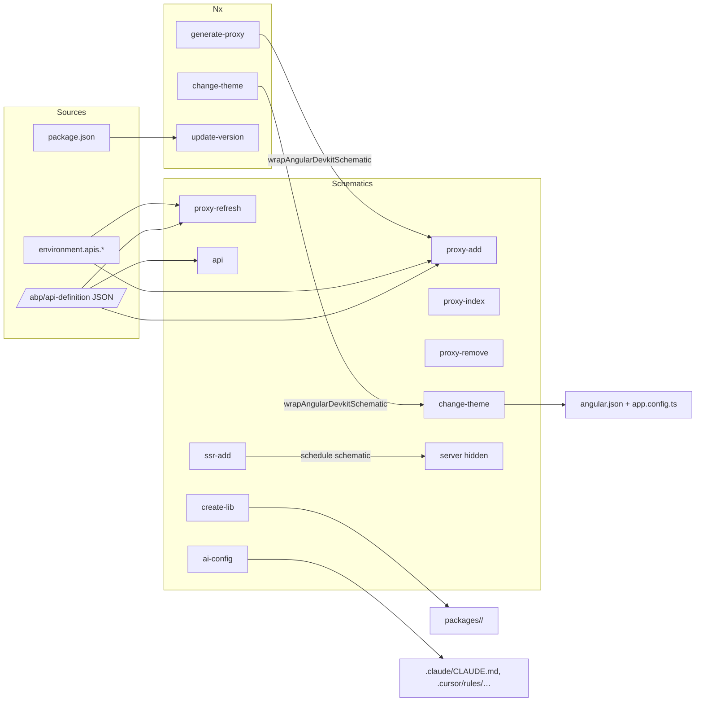

The `@abp/ng.schematics` package wraps every code generator the ABP Framework exposes for Angular workspaces — proxy generation, library scaffolding, theme switching, server-side rendering bootstrap, and AI-tool rules. Its sibling `@abp/nx.generators` re-exports three of those as Nx generators so monorepos can drive the same commands through `nx generate` instead of `ng generate`. This page enumerates every entry in `npm/ng-packs/packages/schematics/src/collection.json` and `npm/ng-packs/packages/generators/generators.json`, documents the schema for each, and shows how the proxy commands feed the `@abp/ng.*` packages described elsewhere in this guide.

## Why two packages

`@abp/ng.schematics` is an Angular DevKit schematic collection — published with `"schematics": "./collection.json"` in `package.json` so the Angular CLI picks it up automatically. `@abp/nx.generators` is an Nx generators package — published with `"generators": "./generators.json"` for `nx g`. Both target the same workspaces; the Nx wrappers internally invoke the Angular schematics through `wrapAngularDevkitSchematic` so behaviour stays consistent regardless of which CLI you use.

```ts packages/generators/src/generators/generate-proxy/generator.ts
export default async function (host: Tree, schema: GenerateProxyGeneratorSchema) {
  const runAngularLibrarySchematic = wrapAngularDevkitSchematic('@abp/ng.schematics', 'proxy-add');
  await runAngularLibrarySchematic(host, { ...schema });
  return () => {
    console.log(`proxy added '${schema.target}`);
  };
}
```

The same wrap-and-call pattern is used by `change-theme` and `update-version`, so an Nx workspace effectively gets the schematics for free.

## Collection at a glance

The full registry lives in `packages/schematics/src/collection.json`:

```json packages/schematics/src/collection.json
{
  "schematics": {
    "proxy-add":      { "description": "ABP Proxy Generator Add Schematics",     "factory": "./commands/proxy-add",     "schema": "./commands/proxy-add/schema.json" },
    "proxy-index":    { "description": "ABP Proxy Generator Index Schematics",   "factory": "./commands/proxy-index",   "schema": "./commands/proxy-index/schema.json" },
    "proxy-refresh":  { "description": "ABP Proxy Generator Refresh Schematics", "factory": "./commands/proxy-refresh", "schema": "./commands/proxy-refresh/schema.json" },
    "proxy-remove":   { "description": "ABP Proxy Generator Remove Schematics",  "factory": "./commands/proxy-remove",  "schema": "./commands/proxy-remove/schema.json" },
    "api":            { "description": "ABP API Generator Schematics",            "factory": "./commands/api",            "schema": "./commands/api/schema.json" },
    "create-lib":     { "description": "ABP Create Library Schematics",          "factory": "./commands/create-lib",     "schema": "./commands/create-lib/schema.json" },
    "change-theme":   { "description": "ABP Change Styles of Theme Schematics",  "factory": "./commands/change-theme",   "schema": "./commands/change-theme/schema.json" },
    "ai-config":      { "description": "Generates AI configuration files for Angular projects", "factory": "./commands/ai-config",      "schema": "./commands/ai-config/schema.json" },
    "server":         { "factory": "./commands/ssr-add/server",                  "description": "Create an Angular server app.",        "schema": "./commands/ssr-add/server/schema.json", "hidden": true },
    "ssr-add":        { "description": "ABP SSR Add Schematics",                 "factory": "./commands/ssr-add",        "schema": "./commands/ssr-add/schema.json" }
  }
}
```

| Schematic | Stable CLI command | Purpose |
| --- | --- | --- |
| `proxy-add` | `ng generate @abp/ng.schematics:proxy-add` | First-time proxy generation for a backend module. |
| `proxy-index` | `ng generate @abp/ng.schematics:proxy-index` | Re-generates `index.ts` files for a proxy directory. |
| `proxy-refresh` | `ng generate @abp/ng.schematics:proxy-refresh` | Regenerates an existing proxy in place. |
| `proxy-remove` | `ng generate @abp/ng.schematics:proxy-remove` | Removes a previously generated proxy. |
| `api` | `ng generate @abp/ng.schematics:api` | Generates only the REST service + models. |
| `create-lib` | `ng generate @abp/ng.schematics:create-lib` | Scaffolds a new `@abp/ng.*` style library. |
| `change-theme` | `ng generate @abp/ng.schematics:change-theme` | Switches the active theme (Basic / Lepton / LeptonX). |
| `ai-config` | `ng generate @abp/ng.schematics:ai-config` | Drops AI-assistant config files into the workspace. |
| `ssr-add` | `ng generate @abp/ng.schematics:ssr-add` | Enables Angular SSR for an application project. |
| `server` | (hidden) | Internal helper invoked by `ssr-add`. |

The `package.json` shows the dependencies that gate the available behaviour — Angular DevKit `~21.0.0`, `jsonc-parser` for the workspace JSON edits, and `got` for fetching backend `/abp/api-definition` JSON:

```json packages/schematics/package.json
{
  "name": "@abp/ng.schematics",
  "version": "10.2.0-rc.3",
  "schematics": "./collection.json",
  "dependencies": {
    "@angular-devkit/core": "~21.0.0",
    "@angular-devkit/schematics": "~21.0.0",
    "@angular/cli": "~21.0.0",
    "got": "^11.5.2",
    "jsonc-parser": "^2.3.0",
    "should-quote": "^1.0.0",
    "typescript": "~5.9.0"
  }
}
```

## Proxy commands

The four proxy commands share the same schema (with `proxy-index` slimmed down). They power [Service proxying](/cli/service-proxying) and produce the `*.service.ts` + `models.ts` files you see across every package documented in this Angular section.

### Schema for proxy-add / proxy-refresh / proxy-remove

```json packages/schematics/src/commands/proxy-add/schema.json
{
  "properties": {
    "module":      { "type": "string", "description": "Backend module name" },
    "apiName":     { "type": "string", "description": "Backend api name, a.k.a. remoteServiceName" },
    "source":      { "type": "string", "description": "Source Angular project for API definition URL & root namespace resolution" },
    "target":      { "type": "string", "description": "Target Angular project to place the generated code" },
    "url":         { "type": "string", "description": "Url for API definition" },
    "serviceType": { "type": "string", "enum": ["application", "integration", "all"] },
    "entryPoint":  { "type": "string", "description": "Target entry point to place the generated code" }
  }
}
```

| Option | Argv index | Notes |
| --- | --- | --- |
| `module` | 0 | Backend module name; defaults to `app`. |
| `apiName` | 1 | The remote-service name registered in `environment.apis`. |
| `source` | 2 | Project whose `environment.ts` is read for `apis[apiName].url` and `rootNamespace`. |
| `target` | 3 | Project that receives the generated `proxy/` folder. |
| `url` | 4 | Override for the `/abp/api-definition` URL. |
| `serviceType` | 5 | `application` (default), `integration`, or `all`. |
| `entryPoint` | 6 | Optional secondary entry point (e.g. `feature/proxy`). |

### proxy-add internals

`proxy-add` walks every controller exposed by `/abp/api-definition`, filters by `serviceType`, and runs `applyTemplates(...)` over the `files-service`, `files-model`, and `files-enum` template trees. The factory is the longest of all the schematics:

```ts packages/schematics/src/commands/proxy-add/index.ts
export default function (schema: GenerateProxySchema) {
  const params = removeDefaultPlaceholders(schema);
  const moduleName = params.module || 'app';

  return chain([
    async (tree: Tree) => {
      const getRootNamespace = createRootNamespaceGetter(params);
      const solution = await getRootNamespace(tree);

      const target = await resolveProject(tree, params.target!);
      const targetPath = buildTargetPath(target.definition, params.entryPoint);
      const readProxyConfig = createProxyConfigReader(targetPath);
      const createProxyConfigWriter = createProxyConfigWriterCreator(targetPath);
      const data = readProxyConfig(tree);
      data.types = sanitizeTypeNames(data.types);

      resolveSelfGenericProps({ solution, types: data.types });

      const types = data.types;
      const modules = data.modules;
      const serviceType = schema.serviceType || defaultEServiceType;
      // …writes services + models + enums via applyWithOverwrite
    },
  ]);
}
```

Templates live alongside the factory — e.g. `files-service/proxy/__namespace@dir__/__name@kebab__.service.ts.template` — and use the `@dir`, `@kebab`, `@if` modifiers from `applyTemplates()` to project namespace dots into folder hierarchies.

### proxy-index

The `proxy-index` schematic only needs `target` and `entryPoint`. It regenerates the barrel `index.ts` after files have been manually moved or removed:

```ts packages/schematics/src/commands/proxy-index/index.ts
export default function (schema: { target?: string; entryPoint?: string }) {
  const params = removeDefaultPlaceholders(schema);
  return async (host: Tree) => {
    const target = await resolveProject(host, params.target!);
    const targetPath = buildTargetPath(target.definition, params.entryPoint);
    const generateIndex = createProxyIndexGenerator(targetPath);
    return generateIndex(host);
  };
}
```

### proxy-refresh and proxy-remove

`proxy-refresh` reuses the same factory as `proxy-add` but reads the previously persisted `generate-proxy.json` snapshot before regenerating — that snapshot records the `(module, apiName, source, target, serviceType, entryPoint)` tuple so refresh works without prompts. `proxy-remove` walks the persisted snapshot, deletes the generated files, and re-runs the index generator. Both share the schema with `proxy-add`.

### api

`api` is a slimmer variant that only emits services, models, and enums (no `index.ts` upkeep, no proxy snapshot). It is useful when scripting CI pipelines that regenerate the surface from a known controller list. The schema is identical to `proxy-add` but the templates live under `files-enum/`, `files-model/`, `files-service/` and the factory skips the `proxy-config.json` writer.

## create-lib

`create-lib` scaffolds a brand-new `@abp/ng.*` package using either the legacy NgModule template or the modern standalone template. Its schema accepts the package name, whether the entry is a secondary entrypoint, and the template family:

```json packages/schematics/src/commands/create-lib/schema.json
{
  "properties": {
    "packageName":          { "type": "string", "description": "The name of the package will create" },
    "isSecondaryEntrypoint":{ "type": "boolean" },
    "templateType":         { "type": "string", "enum": ["module", "standalone"] },
    "override":             { "type": "boolean" }
  }
}
```

| Option | Default | Effect |
| --- | --- | --- |
| `packageName` | (prompt) | New folder under `packages/<name>/` and `@abp/ng.<name>` npm name. |
| `isSecondaryEntrypoint` | `false` | When `true`, the schematic creates a `<name>/<entry>/ng-package.json` sub-entry. |
| `templateType` | (prompt: `module` / `standalone`) | Picks between `files-package/` (NgModule + `.forLazy()`) and `files-package-standalone/` (standalone + `createRoutes()`). |
| `override` | `false` | Overwrites existing files instead of aborting. |

The two template trees live at `commands/create-lib/files-package/__libraryName@kebab__` and `commands/create-lib/files-package-standalone/__libraryName@kebab__`. The standalone tree mirrors what you see in `tenant-management`, `setting-management`, and `cms-kit` — `createRoutes()`, `provideXxxConfig()`, and `eXxxRouteNames` enums.

## change-theme

`change-theme` rewrites `angular.json` styles, swaps the theme module/provider in `app.module.ts` or `app.config.ts`, and prints which theme is now active.

```json packages/schematics/src/commands/change-theme/schema.json
{
  "properties": {
    "name": {
      "type": "number",
      "enum": [1, 2, 3, 4],
      "x-prompt": {
        "message": "Which theme would you like to use?",
        "type": "list",
        "items": [
          { "value": 1, "label": "Basic" },
          { "value": 2, "label": "Lepton" },
          { "value": 3, "label": "LeptonXLite" },
          { "value": 4, "label": "LeptonX" }
        ]
      }
    },
    "targetProject": { "type": "string", "description": "The name of the project will change the style." }
  },
  "required": ["name"]
}
```

The numeric enum is mirrored in code so both sides stay in sync:

```ts packages/schematics/src/commands/change-theme/theme-options.enum.ts
export enum ThemeOptionsEnum {
  Basic = 1,
  Lepton = 2,
  LeptonXLite = 3,
  LeptonX = 4,
}
```

The factory detects standalone vs NgModule bootstrap (via `getAppModulePath` / `getAppConfigPath`) and either calls `addRootImport` + `addRootProvider`, then `cleanEmptyExprFromModule` / `cleanEmptyExprFromProviders` so the resulting file does not contain dangling commas:

```ts packages/schematics/src/commands/change-theme/index.ts
export default function (_options: ChangeThemeOptions): Rule {
  return async () => {
    const targetThemeName = _options.name;
    const selectedProject = _options.targetProject;
    if (!targetThemeName) throw new SchematicsException('The theme name does not selected');
    return chain([
      updateWorkspace(storedWorkspace => {
        updateProjectStyle(selectedProject, storedWorkspace, targetThemeName);
      }),
      updateAppModule(selectedProject, targetThemeName),
    ]);
  };
}
```

## ai-config

`ai-config` drops markdown rule files into well-known locations so AI editors (Claude Code, GitHub Copilot, Cursor, Gemini, JetBrains Junie, Windsurf) load ABP-specific guidance. Its schema accepts a comma-separated list of tool names:

```json packages/schematics/src/commands/ai-config/schema.json
{
  "properties": {
    "tool":         { "type": "string", "description": "Comma-separated list of AI tools (e.g., claude,cursor,gemini)" },
    "targetProject":{ "type": "string", "description": "The target project name to generate AI configuration files for" },
    "overwrite":    { "type": "boolean", "default": false }
  }
}
```

The supported tool list and per-tool destination path are encoded directly in the factory:

```ts packages/schematics/src/commands/ai-config/index.ts
const validTools: AiTool[] = ['claude', 'copilot', 'cursor', 'gemini', 'junie', 'windsurf'];

function getConfigPath(tool: AiTool, basePath: string): string {
  const configFiles: Record<AiTool, string> = {
    claude:   '.claude/CLAUDE.md',
    copilot:  '.github/copilot-instructions.md',
    cursor:   '.cursor/rules/cursor.mdc',
    gemini:   '.gemini/GEMINI.md',
    junie:    '.junie/guidelines.md',
    windsurf: '.windsurf/rules/guidelines.md',
  };
  return join(normalize(basePath), configFiles[tool]);
}
```

| Tool token | Output file |
| --- | --- |
| `claude` | `.claude/CLAUDE.md` |
| `copilot` | `.github/copilot-instructions.md` |
| `cursor` | `.cursor/rules/cursor.mdc` |
| `gemini` | `.gemini/GEMINI.md` |
| `junie` | `.junie/guidelines.md` |
| `windsurf` | `.windsurf/rules/guidelines.md` |

The actual content is templated from `commands/ai-config/files/<tool>/` and copied with `MergeStrategy.Overwrite` when `--overwrite` is passed, otherwise `MergeStrategy.Default` (skip-if-exists).

```ts packages/schematics/src/commands/ai-config/model.ts
export type AiTool = 'claude' | 'copilot' | 'cursor' | 'gemini' | 'junie' | 'windsurf';

export interface AiConfigSchema {
  tool?: string;
  targetProject?: string;
  overwrite?: boolean;
}
```

## ssr-add

`ssr-add` adapts Angular's own SSR schematic — its description says it generates the server bootstrap, switches the build target, and adds the needed dependencies. The schema is intentionally tiny:

```json packages/schematics/src/commands/ssr-add/schema.json
{
  "properties": {
    "project":     { "type": "string", "description": "The name of the project you want to enable SSR for." },
    "skipInstall": { "type": "boolean", "description": "Skip the automatic installation of packages.", "default": false }
  },
  "required": ["project"],
  "additionalProperties": false
}
```

The factory uses Angular DevKit helpers from `utils/angular/` — `readWorkspace`, `updateWorkspace`, `addDependency`, `isStandaloneApp`, `latestVersions`, and `isUsingApplicationBuilder`:

```ts packages/schematics/src/commands/ssr-add/index.ts
import {
  DependencyType, ExistingBehavior, InstallBehavior, addDependency,
  readWorkspace, updateWorkspace,
} from '../../utils/angular';
import { JSONFile } from '../../utils/angular/json-file';
import { latestVersions } from '../../utils/angular/latest-versions';
import { isStandaloneApp } from '../../utils/angular/ng-ast-utils';
import { isUsingApplicationBuilder, targetBuildNotFoundError } from '../../utils/angular/project-targets';
```

The hidden `server` schematic is the lower-level helper that the `ssr-add` factory schedules to drop `main.server.ts`, `app.config.server.ts`, and `server.ts` into the project — `apps/dev-app/` is the canonical output and the [dev-app](/angular/dev-app) page walks through the resulting files.

## Nx generators

`packages/generators/generators.json` registers the three generators that re-publish schematics through Nx:

```json packages/generators/generators.json
{
  "generators": {
    "generate-proxy": { "factory": "./src/generators/generate-proxy/generator", "schema": "./src/generators/generate-proxy/schema.json", "description": "generate-proxy generator" },
    "update-version": { "factory": "./src/generators/update-version/generator", "schema": "./src/generators/update-version/schema.json", "description": "update-version generator" },
    "change-theme":   { "factory": "./src/generators/change-theme/generator",   "schema": "./src/generators/change-theme/schema.json",   "description": "change-theme generator" }
  }
}
```

| Nx generator | Equivalent schematic | New capability |
| --- | --- | --- |
| `@abp/nx.generators:generate-proxy` | `@abp/ng.schematics:proxy-add` | Driven by `nx g` instead of `ng generate`. |
| `@abp/nx.generators:change-theme` | `@abp/ng.schematics:change-theme` | Supports `--localPath` for monorepo dogfooding. |
| `@abp/nx.generators:update-version` | (Nx only) | Bulk-update `@abp/*` and Lepton X package versions across the monorepo. |

The `generate-proxy` Nx generator is a thin wrapper that delegates to `proxy-add`:

```ts packages/generators/src/generators/generate-proxy/generator.ts
export default async function (host: Tree, schema: GenerateProxyGeneratorSchema) {
  const runAngularLibrarySchematic = wrapAngularDevkitSchematic('@abp/ng.schematics', 'proxy-add');
  await runAngularLibrarySchematic(host, { ...schema });
  return () => console.log(`proxy added '${schema.target}`);
}
```

`change-theme` adds a `localPath` knob that points at a checked-out schematics build, which is how the abp monorepo itself dogfoods unreleased schematics changes:

```ts packages/generators/src/generators/change-theme/generator.ts
export async function changeThemeGenerator(host: Tree, schema: ChangeThemeGeneratorSchema) {
  const schematicPath = schema.localPath || '@abp/ng.schematics';
  const runAngularLibrarySchematic = wrapAngularDevkitSchematic(
    schema.localPath ? `${host.root}${schematicPath}` : schematicPath,
    'change-theme',
  );
  await runAngularLibrarySchematic(host, { ...schema });
  return () => {
    const destTheme = Object.values(ThemeOptionsEnum).find(
      (theme, index) => index + 1 === schema.name,
    );
    console.log(`✅️ Switched to Theme ${destTheme}`);
  };
}
```

## update-version

`update-version` is Nx-only and rewrites every `package.json` under the workspace, swapping `@abp/*` and Lepton X package versions while leaving non-ABP packages alone. The schema demands `abpVersion` and optionally accepts `leptonXVersion` + an explicit package allowlist:

```json packages/generators/src/generators/update-version/schema.json
{
  "properties": {
    "abpVersion":     { "type": "string", "x-prompt": "What ABP version would you like to use?" },
    "leptonXVersion": { "type": "string" }
  },
  "required": ["abpVersion"]
}
```

The generator iterates the workspace projects, filters to libraries, and re-writes each `package.json`. The classification logic in `utils.ts` recognises both the `@abp/*` family (everything matching `^@(abp|volo|volosoft)\/`) and a hand-curated list of Lepton X packages:

```ts packages/generators/src/generators/update-version/utils.ts
const leptonPackages = [
  '@abp/ng.theme.lepton-x',
  '@volosoft/ngx-lepton-x',
  '@volo/abp.ng.lepton-x.core',
  '@volo/ngx-lepton-x.core',
  '@volo/ngx-lepton-x.lite',
  '@volosoft/abp.ng.theme.lepton-x',
];
const abpPackageNameRegex = /^@(abp|volo|volosoft)\/.*/;

export function isAbpPack(packageName) {
  return abpPackageNameRegex.test(packageName) && !leptonPackages.includes(packageName);
}

export function getVersionByPackageNameFactory(abpVersionName: string, leptonXVersionName: string) {
  return (packageName: string) => {
    if (isAbpPack(packageName)) return abpVersionName;
    if (functionisLeptonXPack(packageName)) return leptonXVersionName;
    return '';
  };
}
```

The `semverRegex` is used as the replacement target inside the existing version string so peer-dep ranges like `~10.1.0` keep their tilde/caret prefix:

```ts packages/generators/src/generators/update-version/utils.ts
export const semverRegex =
  /\d+\.\d+\.\d+(?:-[a-zA-Z0-9]+(?:\.[a-zA-Z0-9-]+)*)?(?:\+[a-zA-Z0-9]+(?:\.[a-zA-Z0-9-]+)*)?$/;
```

A small `IGNORED_PROJECT_NAMES` allowlist skips the demo/utility libraries that should not be re-stamped:

```ts packages/generators/src/generators/update-version/utils.ts
export const IGNORED_PROJECT_NAMES = ['apex-chart-components', 'bs-components', 'workspace-plugin'];
```

## Architecture overview



## Recipes

### First-time proxy for a custom backend module

```bash
ng generate @abp/ng.schematics:proxy-add MyCompanyName.MyModule MyApi dev-app dev-app
```

This reads `apps/dev-app/src/environments/environment.ts`, calls `/abp/api-definition` at the URL registered for `MyApi`, and writes `apps/dev-app/src/app/proxy/` with services and DTOs. See [Service proxying](/cli/service-proxying) for the deeper walkthrough.

### Switching theme

```bash
ng generate @abp/ng.schematics:change-theme 4 dev-app
```

`4` is `LeptonX` in `ThemeOptionsEnum`. The schematic rewrites `angular.json` styles and removes/adds providers in `apps/dev-app/src/app/app.config.ts`.

### Enabling SSR

```bash
ng generate @abp/ng.schematics:ssr-add --project dev-app
```

This is exactly what `apps/dev-app/` already has — the resulting `main.server.ts`, `app.config.server.ts`, and `server.ts` files are documented in [dev-app](/angular/dev-app).

### Bulk version bump in Nx

```bash
nx g @abp/nx.generators:update-version 10.2.0 --leptonXVersion 4.0.0
```

This rewrites every library's `package.json` plus the workspace root, leaving non-ABP packages untouched.

## Related pages

- [Service proxying](/cli/service-proxying) — full proxy CLI workflow.
- [Permission management](/angular/permission-management) / [Setting management](/angular/setting-management) / [Tenant management](/angular/tenant-management) / [Feature management](/angular/feature-management) / [CMS Kit](/angular/cms-kit) — packages built with these schematics.
- [Dev app](/angular/dev-app) — the in-repo Angular harness exercised by every schematic.
