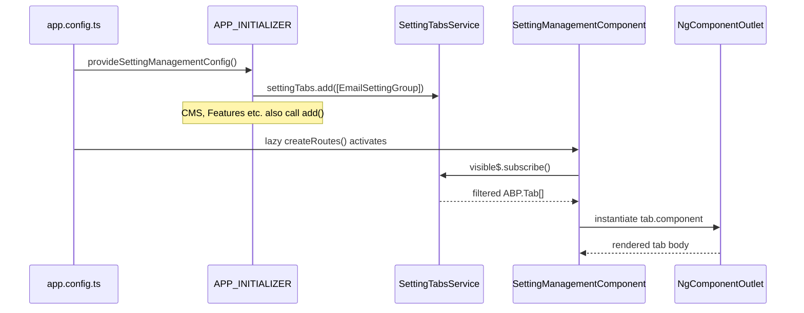

The `@abp/ng.setting-management` package provides the Angular UI shell that the ABP Framework uses to host all application-wide settings under `/setting-management`. It is intentionally minimal — the page itself is a vertical `<abp-page>` with a tab strip whose contents are contributed by other packages (Feature Management adds a "Features" tab, CMS Kit adds a "CMS" tab, Account Management adds a "Profile" tab, etc.). This page maps every file under `npm/ng-packs/packages/setting-management/`, walks through the two secondary entry points (`@abp/ng.setting-management` and `@abp/ng.setting-management/config`), and shows how the e-mail SMTP form ships out of the box.

## Package layout

The directory ships **two ng-packages**: the lazy-loadable UI at `src/` and a config sidecar at `config/src/` that other packages depend on without dragging in the routing entry. There is also a generated REST proxy at `proxy/src/`.

| Path | Symbol | Purpose |
| --- | --- | --- |
| `src/lib/setting-management.routes.ts` | `createRoutes` | Lazy `Routes` factory mounted at `/setting-management`. |
| `src/lib/setting-management.module.ts` | `SettingManagementModule` | Legacy `.forLazy()` shim. |
| `src/lib/components/setting-management.component.ts` | `SettingManagementComponent` | Tab host with `Tabs`/`TabList`/`TabPanel` from `@angular/aria/tabs`. |
| `src/lib/enums/components.ts` | `eSettingManagementComponents` | Replaceable-component key. |
| `src/lib/enums/route-names.ts` | `eSettingManagementRouteNames` | Localization key for the menu entry. |
| `config/src/lib/setting-management-config.module.ts` | `SettingManagementConfigModule` | Legacy `.forRoot()` shim. |
| `config/src/lib/providers/setting-management-config.provider.ts` | `provideSettingManagementConfig` | Standalone provider bundle. |
| `config/src/lib/providers/route.provider.ts` | `configureRoutes`, `SETTING_MANAGEMENT_HAS_SETTING` | Adds menu entry + visibility token. |
| `config/src/lib/providers/setting-tab.provider.ts` | `configureSettingTabs` | Default e-mail tab registration. |
| `config/src/lib/providers/visible.provider.ts` | `SETTING_MANAGEMENT_VISIBLE_PROVIDERS` | Auto-hides empty menu. |
| `config/src/lib/providers/features.token.ts` | `SETTING_MANAGEMENT_FEATURES_PROVIDERS` | Feature-flag visibility. |
| `config/src/lib/services/settings-tabs.service.ts` | `SettingTabsService` | Singleton `AbstractNavTreeService<ABP.Tab>`. |
| `config/src/lib/components/email-setting-group/email-setting-group.component.ts` | `EmailSettingGroupComponent` | SMTP form + test-email modal. |
| `config/src/lib/proxy/email-settings.service.ts` | `EmailSettingsService` | REST client for `/api/setting-management/emailing`. |
| `proxy/src/lib/proxy/time-zone-settings.service.ts` | `TimeZoneSettingsService` | REST client for `/api/setting-management/timezone`. |

`src/public-api.ts` re-exports the lazy entry and `config/src/public-api.ts` re-exports the config providers — so application bootstrap typically imports from both: `provideSettingManagementConfig()` in `app.config.ts` and `createRoutes()` in `app.routes.ts`.

## Lazy route shell

The setting page is contributed as a child route under any path the host picks — `dev-app` mounts it at `/setting-management` (see `apps/dev-app/src/app/app.routes.ts`):

```ts apps/dev-app/src/app/app.routes.ts
{
  path: 'setting-management',
  loadChildren: () => import('@abp/ng.setting-management').then(m => m.createRoutes()),
},
```

`createRoutes()` itself wraps the page in a `RouterOutletComponent` so child routes can be added later, then renders the component through `ReplaceableRouteContainerComponent` so the entire screen can be swapped via the `eSettingManagementComponents.SettingManagement` key:

```ts src/lib/setting-management.routes.ts
export function provideSettingManagement() {
  return [];
}

export const createRoutes = (): Routes => [
  {
    path: '',
    component: RouterOutletComponent,
    canActivate: [authGuard],
    providers: provideSettingManagement(),
    children: [
      {
        path: '',
        component: ReplaceableRouteContainerComponent,
        data: {
          requiredPolicy: 'AbpAccount.SettingManagement',
          replaceableComponent: {
            key: eSettingManagementComponents.SettingManagement,
            defaultComponent: SettingManagementComponent,
          } as ReplaceableComponents.RouteData,
        },
      },
    ],
    title: 'AbpSettingManagement::Settings',
  },
];
```

`authGuard` is exported from `@abp/ng.core` and forces an OAuth redirect for anonymous visitors. `requiredPolicy: 'AbpAccount.SettingManagement'` is the policy name expected by the `PolicyResolver` (it is granted to any user that has *any* settings policy under it). The `title` is resolved through `LocalizationPipe` so the browser tab follows the active culture.

## Host component

`SettingManagementComponent` is a thin presenter that subscribes to `SettingTabsService.visible$` and renders the first visible tab. The view is built with Angular ARIA tabs and a `PermissionDirective` so each tab body is only rendered when the policy passes:

```ts src/lib/components/setting-management.component.ts
@Component({
  selector: 'abp-setting-management',
  templateUrl: './setting-management.component.html',
  imports: [
    NgComponentOutlet, PageComponent, LocalizationPipe, PermissionDirective,
    ForDirective, Tabs, TabList, Tab, TabPanel,
  ],
  styles: [`
    :host [ngTabPanel][inert] {
      display: none;
    }
  `],
})
export class SettingManagementComponent implements OnDestroy, OnInit {
  private settingTabsService = inject(SettingTabsService);
  private subscription = new Subscription();

  settings: ABP.Tab[] = [];
  selected!: ABP.Tab;

  trackByFn: TrackByFunction<ABP.Tab> = (_, item) => item.name;

  ngOnInit() {
    this.subscription.add(
      this.settingTabsService.visible$.subscribe(settings => {
        this.settings = settings;
        if (!this.selected) this.selected = this.settings[0];
      }),
    );
  }
}
```

`ABP.Tab` is the contract every contributed tab has to satisfy — `{ name, order, requiredPolicy?, component, invisible? }`. `NgComponentOutlet` then instantiates the contributed component dynamically inside each `<ngTabPanel>`.

## Tab registry

`SettingTabsService` is a tiny singleton extending `AbstractNavTreeService<ABP.Tab>` from `@abp/ng.core` — the same utility that backs the application sidebar menu. Tabs are sorted by `order`, filtered by `requiredPolicy`, and re-emitted whenever a permission changes:

```ts config/src/lib/services/settings-tabs.service.ts
import { Injectable } from '@angular/core';
import { ABP, AbstractNavTreeService } from '@abp/ng.core';

@Injectable({ providedIn: 'root' })
export class SettingTabsService extends AbstractNavTreeService<ABP.Tab> {}
```

Because the service is `providedIn: 'root'`, every contributing package gets the same instance. Default contributors push themselves during `provideAppInitializer(() => …)`, ensuring tabs exist before the route activates.

## Provider bundle

`provideSettingManagementConfig()` is the one symbol that almost every ABP starter places in `app.config.ts`. It returns a `makeEnvironmentProviders()` block that aggregates four sub-providers:

```ts config/src/lib/providers/setting-management-config.provider.ts
export function provideSettingManagementConfig() {
  return makeEnvironmentProviders([
    SETTING_MANAGEMENT_ROUTE_PROVIDERS,
    SETTING_MANAGEMENT_SETTING_TAB_PROVIDERS,
    SETTING_MANAGEMENT_FEATURES_PROVIDERS,
    SETTING_MANAGEMENT_VISIBLE_PROVIDERS,
  ]);
}
```

| Provider bundle | What it does |
| --- | --- |
| `SETTING_MANAGEMENT_ROUTE_PROVIDERS` | Calls `RoutesService.add(...)` with the *Administration → Settings* menu entry. |
| `SETTING_MANAGEMENT_SETTING_TAB_PROVIDERS` | Registers the default *Email* tab. |
| `SETTING_MANAGEMENT_FEATURES_PROVIDERS` | Hides tabs whose feature flag is `false`. |
| `SETTING_MANAGEMENT_VISIBLE_PROVIDERS` | Hides the entire *Settings* menu entry when no tabs are visible. |

## Menu registration

`SETTING_MANAGEMENT_ROUTE_PROVIDERS` adds a menu node under the framework's "Administration" parent so the entry inherits the layout chosen by `eThemeSharedRouteNames.Administration`:

```ts config/src/lib/providers/route.provider.ts
export function configureRoutes() {
  const routesService = inject(RoutesService);
  routesService.add([
    {
      name: eSettingManagementRouteNames.Settings,
      path: '/setting-management',
      parentName: eThemeSharedRouteNames.Administration,
      layout: eLayoutType.application,
      order: 100,
      iconClass: 'fa fa-cog',
    },
  ]);
}
```

A separate `SETTING_MANAGEMENT_HAS_SETTING` injection token lets other packages reactively query whether *any* tab is visible — handy when a layout wants to dim the cog icon if the user has no settings policies at all:

```ts config/src/lib/providers/route.provider.ts
export const SETTING_MANAGEMENT_HAS_SETTING = new InjectionToken<Observable<boolean>>(
  'SETTING_MANAGEMENT_HAS_SETTING',
  {
    factory: () => {
      const settingTabsService = inject(SettingTabsService);
      return settingTabsService.visible$.pipe(
        debounceTime(0),
        map(nodes => !!nodes.length),
      );
    },
  },
);
```

## Default e-mail tab

The default tab is contributed in `setting-tab.provider.ts`. It points at `EmailSettingGroupComponent` with `requiredPolicy: 'SettingManagement.Emailing'` so it is hidden unless the current user has that grant:

```ts config/src/lib/providers/setting-tab.provider.ts
export const SETTING_MANAGEMENT_SETTING_TAB_PROVIDERS = [
  provideAppInitializer(() => {
    configureSettingTabs();
  }),
];

export function configureSettingTabs() {
  const settingTabs = inject(SettingTabsService);
  settingTabs.add([
    {
      name: eSettingManamagementSettingTabNames.EmailSettingGroup,
      order: 100,
      requiredPolicy: 'SettingManagement.Emailing',
      component: EmailSettingGroupComponent,
    },
  ]);
}
```

The tab name string `'AbpSettingManagement::Menu:Emailing'` is the localization key resolved by `LocalizationPipe` in the host template.

```ts config/src/lib/enums/setting-tab-names.ts
export const enum eSettingManamagementSettingTabNames {
  EmailSettingGroup = 'AbpSettingManagement::Menu:Emailing',
}
```

## Email setting form

`EmailSettingGroupComponent` exposes the SMTP configuration plus a "Send Test Email" modal. It uses `UntypedFormBuilder` with `Validators` and integrates `@ngx-validate/core` for inline error rendering. The form is populated by `EmailSettingsService.get()` and saved through `EmailSettingsService.update(...)`:

```ts config/src/lib/components/email-setting-group/email-setting-group.component.ts
@Component({
  selector: 'abp-email-setting-group',
  templateUrl: 'email-setting-group.component.html',
  animations: [collapse],
  imports: [
    ReactiveFormsModule, LocalizationPipe, ButtonComponent, ModalComponent,
    ModalCloseDirective, NgxValidateCoreModule, PermissionDirective,
  ],
})
export class EmailSettingGroupComponent implements OnInit {
  private emailSettingsService = inject(EmailSettingsService);
  private fb = inject(UntypedFormBuilder);
  private toasterService = inject(ToasterService);

  form!: UntypedFormGroup;
  emailTestForm: UntypedFormGroup;
  saving = false;
  emailingPolicy = SettingManagementPolicyNames.Emailing;

  private buildForm(emailSettings: EmailSettingsDto) {
    this.form = this.fb.group({
      defaultFromDisplayName: [emailSettings.defaultFromDisplayName, [Validators.required]],
      defaultFromAddress: [emailSettings.defaultFromAddress, [Validators.required]],
      smtpHost: [emailSettings.smtpHost],
      smtpPort: [emailSettings.smtpPort, [Validators.required]],
      smtpEnableSsl: [emailSettings.smtpEnableSsl],
      smtpUseDefaultCredentials: [emailSettings.smtpUseDefaultCredentials],
      smtpDomain: [emailSettings.smtpDomain],
      smtpUserName: [emailSettings.smtpUserName],
      smtpPassword: [emailSettings.smtpPassword],
    });
  }
}
```

| Field | Validators | Notes |
| --- | --- | --- |
| `defaultFromDisplayName` | `required` | Friendly sender name. |
| `defaultFromAddress` | `required` | Used as the SMTP `MAIL FROM`. |
| `smtpHost` | – | Empty means "do not send". |
| `smtpPort` | `required` | Numeric `<input type="number">`. |
| `smtpEnableSsl` | – | Boolean checkbox. |
| `smtpUseDefaultCredentials` | – | When `true`, hides domain/username/password. |
| `smtpDomain` / `smtpUserName` / `smtpPassword` | – | Conditional on `useDefaultCredentials`. |

The test-email modal builds a second `FormGroup` with `senderEmailAddress`, `targetEmailAddress`, `subject`, `body` and reuses the same `ToasterService.success(...)` notification on success.

```ts config/src/lib/components/email-setting-group/email-setting-group.component.ts
buildEmailTestForm() {
  const { defaultFromAddress } = this.form.value || {};
  const defaultSubject = this.localizationService.instant(
    'AbpSettingManagement::TestEmailSubject',
    ...[Math.floor(Math.random() * 9999).toString()],
  );
  const defaultBody = this.localizationService.instant('AbpSettingManagement::TestEmailBody');

  this.emailTestForm = this.fb.group({
    senderEmailAddress: [defaultFromAddress || '', [required, email]],
    targetEmailAddress: [this.currentUserEmail(), [required, email]],
    subject: [defaultSubject, [required]],
    body: [defaultBody],
  });
}
```

`currentUserEmail` is a `toSignal()` view of `ConfigStateService.getDeep$(['currentUser', 'email'])`, so the target field is prefilled with the currently-logged-in user's address.

## REST surface

Both proxy entry points expose plain `@Injectable({ providedIn: 'root' })` clients with `apiName = 'AbpSettingManagement'`. The dual-entry split (`config/src/lib/proxy` and `proxy/src/lib/proxy`) exists so that the lazy bundle doesn't pull the proxy in twice — the *config* entry imports `EmailSettingsService` directly, the *proxy* entry re-exports both services for application code that needs them outside the settings page.

| Method | HTTP route | DTO |
| --- | --- | --- |
| `EmailSettingsService.get()` | `GET /api/setting-management/emailing` | `EmailSettingsDto` |
| `EmailSettingsService.update(input)` | `PUT /api/setting-management/emailing` | `EmailSettingsDto` |
| `EmailSettingsService.sendTestEmail(input)` | `POST /api/setting-management/emailing/send-test-email` | `SendTestEmailInput` |
| `TimeZoneSettingsService.get()` | `GET /api/setting-management/timezone` | `string` |
| `TimeZoneSettingsService.getTimezones()` | `GET …/timezone/timezones` | `NameValue<string>[]` |
| `TimeZoneSettingsService.update(timezone)` | `POST …/timezone` | `void` |

```ts config/src/lib/proxy/models.ts
export interface EmailSettingsDto {
  defaultFromAddress?: string;
  defaultFromDisplayName?: string;
  smtpDomain?: string;
  smtpEnableSsl: boolean;
  smtpHost?: string;
  smtpPassword?: string;
  smtpPort: number;
  smtpUseDefaultCredentials: boolean;
  smtpUserName?: string;
}
```

The proxy is regenerated by running `ng generate @abp/ng.schematics:proxy-refresh` — see [Service proxying](/cli/service-proxying) for the workflow.

## Contributing a tab from another package

The pattern is identical to the bundled e-mail tab — call `SettingTabsService.add([...])` from an `APP_INITIALIZER` and register the provider through `provideAppInitializer`. The feature-management package does exactly this:

```ts packages/feature-management/src/lib/providers/feature-management-settings.provider.ts
export const FEATURE_MANAGEMENT_SETTINGS_PROVIDERS = [
  provideAppInitializer(() => {
    configureSettingTabs();
  }),
];

export function configureSettingTabs() {
  const settingtabs = inject(SettingTabsService);
  settingtabs.add([
    {
      name: eFeatureManagementTabNames.FeatureManagement,
      order: 100,
      requiredPolicy: 'FeatureManagement.ManageHostFeatures',
      component: FeatureManagementTabComponent,
    },
  ]);
}
```

Setting `invisible: true` on a tab toggles visibility imperatively — CMS Kit's settings tab uses this trick to hide itself when the `CmsKit.CommentEnable` feature flag is off:

```ts packages/cms-kit/admin/config/src/providers/setting-tab.provider.ts
const tabsArray: ABP.Tab[] = [
  {
    name: eCmsKitAdminRouteNames.Cms,
    order: 100,
    requiredPolicy: eCmsKitAdminPolicyNames.Cms,
    invisible: configState.getFeature('CmsKit.CommentEnable')?.toLowerCase() === 'true',
    component: CmsSettingsComponent,
  },
];
```

## Tab rendering flow



## Replaceable host

The whole tab page can be replaced by registering an override against `eSettingManagementComponents.SettingManagement`. The enum sits in `src/lib/enums/components.ts` and resolves to the same string the route data declares:

```ts src/lib/enums/components.ts
export const enum eSettingManagementComponents {
  SettingManagement = 'SettingManagement.SettingManagementComponent',
}
```

Hosts call `ReplaceableComponentsService.add({ key: 'SettingManagement.SettingManagementComponent', component: MySettingsShellComponent })` during bootstrap; the route container then renders the custom shell while still reading from `SettingTabsService`.

## Related pages

- [Feature management](/angular/feature-management) — the canonical example of a tab contributor.
- [Permission management](/angular/permission-management) — same `SettingTabsService` registration model.
- [Tenant management](/angular/tenant-management) — uses the same `ABP.Tab` contract for sub-pages.
- [Schematics & generators](/angular/schematics-and-generators) — `proxy-refresh` regenerates `EmailSettingsService`.
- Backend: [Setting Management module](/modules/setting-management).
- Proxy plumbing: [Service proxying](/cli/service-proxying).
