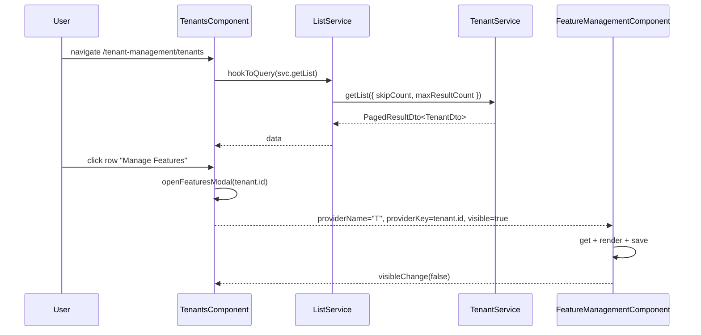

The `@abp/ng.tenant-management` package supplies the Angular UI that the ABP Framework uses to administer tenants in a saas-multi-tenant application. It renders a paged `<abp-extensible-table>`, a create/update modal driven by dynamic form props, an *Edit / Manage Features / Delete* row action menu, and an embedded `<abp-feature-management>` modal. This page walks the source under `npm/ng-packs/packages/tenant-management/`, documents the extension contributor tokens, and shows how the lazy route, config module, and proxy work together with `@abp/ng.feature-management` and `@abp/ng.components/extensible`.

## Package layout

There are three secondary entry points — a lazy UI entry at `src/`, a config entry at `config/src/` (just the menu registration), and a generated REST proxy at `proxy/src/`.

| Path | Symbol | Purpose |
| --- | --- | --- |
| `src/lib/tenant-management.routes.ts` | `createRoutes`, `provideTenantManagement` | Lazy `Routes` factory + standalone DI bundle. |
| `src/lib/tenant-management.module.ts` | `TenantManagementModule` | Legacy `.forLazy()` / `.forChild()` shim. |
| `src/lib/components/tenants/tenants.component.ts` | `TenantsComponent` | CRUD page (list, create/update modal, features). |
| `src/lib/defaults/default-tenants-entity-props.ts` | `DEFAULT_TENANTS_ENTITY_PROPS` | Default table column set. |
| `src/lib/defaults/default-tenants-form-props.ts` | `DEFAULT_TENANTS_CREATE_FORM_PROPS`, `DEFAULT_TENANTS_EDIT_FORM_PROPS` | Default form fields. |
| `src/lib/defaults/default-tenants-toolbar-actions.ts` | `DEFAULT_TENANTS_TOOLBAR_ACTIONS` | "New tenant" toolbar button. |
| `src/lib/defaults/default-tenants-entity-actions.ts` | `DEFAULT_TENANTS_ENTITY_ACTIONS` | Edit / Manage Features / Delete row actions. |
| `src/lib/tokens/extensions.token.ts` | Five `InjectionToken` contributors | Extension hooks for props, form-props, actions. |
| `src/lib/resolvers/extensions.resolver.ts` | `tenantManagementExtensionsResolver` | Wires contributors into `ExtensionsService` at route activation. |
| `src/lib/guards/extensions.guard.ts` | `TenantManagementExtensionsGuard` | Legacy module-mode wiring. |
| `src/lib/models/config-options.ts` | `TenantManagementConfigOptions` | Options object accepted by `createRoutes()`. |
| `src/lib/enums/components.ts` | `eTenantManagementComponents` | Replaceable-component identifier. |
| `config/src/providers/tenant-management-config.provider.ts` | `provideTenantManagementConfig` | Menu-only provider bundle. |
| `config/src/providers/route.provider.ts` | `configureRoutes` | Adds *Administration → Tenant Management → Tenants* menu nodes. |
| `proxy/src/lib/proxy/tenant.service.ts` | `TenantService` | REST client for `/api/multi-tenancy/tenants`. |

## Lazy routes

`createRoutes()` mounts `TenantsComponent` behind `authGuard` + `permissionGuard`, wraps it in `ReplaceableRouteContainerComponent`, and runs `tenantManagementExtensionsResolver` so contributors are merged before the page is shown. The redirect from `''` to `'tenants'` reserves space for future sub-pages (editions, etc.):

```ts src/lib/tenant-management.routes.ts
export const createRoutes = (options: TenantManagementConfigOptions = {}): Routes => [
  {
    path: '',
    component: RouterOutletComponent,
    canActivate: [authGuard, permissionGuard],
    resolve: [tenantManagementExtensionsResolver],
    providers: provideTenantManagement(options),
    children: [
      { path: '', redirectTo: 'tenants', pathMatch: 'full' },
      {
        path: 'tenants',
        component: ReplaceableRouteContainerComponent,
        data: {
          requiredPolicy: 'AbpTenantManagement.Tenants',
          replaceableComponent: {
            key: eTenantManagementComponents.Tenants,
            defaultComponent: TenantsComponent,
          } as ReplaceableComponents.RouteData<TenantsComponent>,
        },
        title: 'AbpTenantManagement::Tenants',
      },
    ],
  },
];
```

`provideTenantManagement(options)` maps each section of `TenantManagementConfigOptions` to its DI token so the resolver can read them:

```ts src/lib/tenant-management.routes.ts
export function provideTenantManagement(options: TenantManagementConfigOptions = {}): Provider[] {
  return [
    { provide: TENANT_MANAGEMENT_ENTITY_ACTION_CONTRIBUTORS,    useValue: options.entityActionContributors },
    { provide: TENANT_MANAGEMENT_TOOLBAR_ACTION_CONTRIBUTORS,   useValue: options.toolbarActionContributors },
    { provide: TENANT_MANAGEMENT_ENTITY_PROP_CONTRIBUTORS,      useValue: options.entityPropContributors },
    { provide: TENANT_MANAGEMENT_CREATE_FORM_PROP_CONTRIBUTORS, useValue: options.createFormPropContributors },
    { provide: TENANT_MANAGEMENT_EDIT_FORM_PROP_CONTRIBUTORS,   useValue: options.editFormPropContributors },
  ];
}
```

The dev-app wires it like the other modules — `provideTenantManagementConfig()` at the application level, `createRoutes()` lazy-loaded at the route level:

```ts apps/dev-app/src/app/app.routes.ts
{
  path: 'tenant-management',
  loadChildren: () => import('@abp/ng.tenant-management').then(m => m.createRoutes()),
},
```

## Menu registration

The *config* sub-package only registers the sidebar entries. The provider is a `makeEnvironmentProviders()` wrapper around a single `APP_INITIALIZER`:

```ts config/src/providers/tenant-management-config.provider.ts
export function provideTenantManagementConfig() {
  return makeEnvironmentProviders([TENANT_MANAGEMENT_ROUTE_PROVIDERS]);
}
```

`configureRoutes()` adds two nodes — the parent group and the leaf — so users with the `AbpTenantManagement` policy see the group expand and only those with `AbpTenantManagement.Tenants` see the leaf:

```ts config/src/providers/route.provider.ts
export function configureRoutes() {
  const routes = inject(RoutesService);
  routes.add([
    {
      path: undefined,
      name: eTenantManagementRouteNames.TenantManagement,
      parentName: eThemeSharedRouteNames.Administration,
      requiredPolicy: eTenantManagementPolicyNames.TenantManagement,
      layout: eLayoutType.application,
      iconClass: 'fa fa-users',
      order: 2,
    },
    {
      path: '/tenant-management/tenants',
      name: eTenantManagementRouteNames.Tenants,
      parentName: eTenantManagementRouteNames.TenantManagement,
      requiredPolicy: eTenantManagementPolicyNames.Tenants,
      order: 1,
    },
  ]);
}
```

## TenantsComponent

The CRUD page hosts the table, a single create-or-update modal, and an embedded `<abp-feature-management>` modal. It is registered with `EXTENSIONS_IDENTIFIER = eTenantManagementComponents.Tenants` so `<abp-extensible-table>` and `<abp-extensible-form>` know which contributor bundle to use:

```ts src/lib/components/tenants/tenants.component.ts
@Component({
  selector: 'abp-tenants',
  templateUrl: './tenants.component.html',
  providers: [
    ListService,
    {
      provide: EXTENSIONS_IDENTIFIER,
      useValue: eTenantManagementComponents.Tenants,
    },
  ],
  imports: [
    FormsModule, ReactiveFormsModule, PageComponent, LocalizationPipe,
    ExtensibleTableComponent, ModalComponent, FeatureManagementComponent,
    ButtonComponent, ReplaceableTemplateDirective, ExtensibleFormComponent,
    ModalCloseDirective, NgxValidateCoreModule,
  ],
})
export class TenantsComponent implements OnInit {
  protected readonly list = inject(ListService<GetTenantsInput>);
  protected readonly confirmationService = inject(ConfirmationService);
  protected readonly service = inject(TenantService);
  protected readonly toasterService = inject(ToasterService);
  private readonly fb = inject(UntypedFormBuilder);
  private readonly injector = inject(Injector);

  data: PagedResultDto<TenantDto> = { items: [], totalCount: 0 };
  selected!: TenantDto;
  tenantForm!: UntypedFormGroup;
  isModalVisible!: boolean;
  visibleFeatures = false;
  providerKey!: string;
  modalBusy = false;
  featureManagementKey = eFeatureManagementComponents.FeatureManagement;
  TENANTS_KEY = makeStateKey<PagedResultDto<TenantDto>>('tenants');
}
```

`ListService` from `@abp/ng.core` handles paging, sorting, and filtering — `hookToQuery()` debounces and re-issues `TenantService.getList()` whenever any query state changes. The `makeStateKey` is used to transfer initial data through `TransferState` for SSR (see `apps/dev-app/src/app/app.config.server.ts`).

## CRUD pipeline

The form lifecycle reuses `generateFormFromProps()` from `@abp/ng.components/extensible`, which constructs an `UntypedFormGroup` from the contributed `FormProp` array. `save()` picks `create` vs `update` from `selected.id`:

```ts src/lib/components/tenants/tenants.component.ts
private createTenantForm() {
  const data = new FormPropData(this.injector, this.selected);
  this.tenantForm = generateFormFromProps(data);
}

addTenant() {
  this.selected = {} as TenantDto;
  this.createTenantForm();
  this.isModalVisible = true;
}

editTenant(id: string) {
  this.service.get(id).subscribe(res => {
    this.selected = res;
    this.createTenantForm();
    this.isModalVisible = true;
  });
}

save() {
  if (!this.tenantForm.valid || this.modalBusy) return;
  this.modalBusy = true;
  const { id } = this.selected;

  (id
    ? this.service.update(id, { ...this.selected, ...this.tenantForm.value })
    : this.service.create(this.tenantForm.value)
  )
    .pipe(finalize(() => (this.modalBusy = false)))
    .subscribe(() => {
      this.isModalVisible = false;
      this.toasterService.success('AbpUi::SavedSuccessfully');
      this.list.get();
    });
}

delete(id: string, name: string) {
  this.confirmationService
    .warn(
      'AbpTenantManagement::TenantDeletionConfirmationMessage',
      'AbpTenantManagement::AreYouSure',
      { messageLocalizationParams: [name] },
    )
    .subscribe((status: Confirmation.Status) => {
      if (status === Confirmation.Status.confirm) {
        this.toasterService.success('AbpUi::DeletedSuccessfully');
        this.service.delete(id).subscribe(() => this.list.get());
      }
    });
}

openFeaturesModal(providerKey: string) {
  this.providerKey = providerKey;
  setTimeout(() => { this.visibleFeatures = true; }, 0);
}
```

The `setTimeout` deferral on `openFeaturesModal` ensures the row-action click finishes before the modal toggles, preventing a backdrop-click race when the action menu closes.

## Default entity props

The table starts with a single column — `name`. Hosts add columns through `entityPropContributors`:

```ts src/lib/defaults/default-tenants-entity-props.ts
export const DEFAULT_TENANTS_ENTITY_PROPS = EntityProp.createMany<TenantDto>([
  {
    type: ePropType.String,
    name: 'name',
    displayName: 'AbpTenantManagement::TenantName',
    sortable: true,
  },
]);
```

## Default form props

The create form ships three fields — name, admin email, admin password. The edit form drops the admin email + password by slicing the array, because edit only changes the tenant's display name:

```ts src/lib/defaults/default-tenants-form-props.ts
export const DEFAULT_TENANTS_CREATE_FORM_PROPS = FormProp.createMany<
  TenantCreateDto | TenantUpdateDto
>([
  {
    type: ePropType.String,
    name: 'name',
    id: 'name',
    displayName: 'AbpTenantManagement::TenantName',
    validators: () => [Validators.required, Validators.maxLength(256)],
  },
  {
    type: ePropType.Email,
    name: 'adminEmailAddress',
    displayName: 'AbpTenantManagement::DisplayName:AdminEmailAddress',
    id: 'admin-email-address',
    validators: () => [Validators.required, Validators.maxLength(256), Validators.email],
  },
  {
    type: ePropType.PasswordInputGroup,
    name: 'adminPassword',
    displayName: 'AbpTenantManagement::DisplayName:AdminPassword',
    id: 'admin-password',
    autocomplete: 'new-password',
    validators: data => [Validators.required, ...getPasswordValidators({ get: data.getInjected })],
  },
]);

export const DEFAULT_TENANTS_EDIT_FORM_PROPS = DEFAULT_TENANTS_CREATE_FORM_PROPS.slice(0, 1);
```

`getPasswordValidators({ get })` pulls the configured password complexity rules from `IdentityCoreService` so the admin password input matches the active identity policy.

## Default actions

| Action | Permission | Callback |
| --- | --- | --- |
| Toolbar: *New tenant* | `AbpTenantManagement.Tenants.Create` | `TenantsComponent.addTenant()` |
| Row: *Edit* | `AbpTenantManagement.Tenants.Update` | `TenantsComponent.editTenant(id)` |
| Row: *Manage Features* | `AbpTenantManagement.Tenants.ManageFeatures` | `TenantsComponent.openFeaturesModal(id)` |
| Row: *Delete* | `AbpTenantManagement.Tenants.Delete` | `TenantsComponent.delete(id, name)` |

```ts src/lib/defaults/default-tenants-entity-actions.ts
export const DEFAULT_TENANTS_ENTITY_ACTIONS = EntityAction.createMany<TenantDto>([
  {
    text: 'AbpTenantManagement::Edit',
    action: data => {
      const component = data.getInjected(TenantsComponent);
      component.editTenant(data.record.id);
    },
    permission: 'AbpTenantManagement.Tenants.Update',
  },
  {
    text: 'AbpTenantManagement::Permission:ManageFeatures',
    action: data => {
      const component = data.getInjected(TenantsComponent);
      component.openFeaturesModal(data.record.id);
    },
    permission: 'AbpTenantManagement.Tenants.ManageFeatures',
  },
  {
    text: 'AbpTenantManagement::Delete',
    action: data => {
      const component = data.getInjected(TenantsComponent);
      component.delete(data.record.id, data.record.name);
    },
    permission: 'AbpTenantManagement.Tenants.Delete',
  },
]);
```

Each `action` callback receives a `data` object with a scoped `Injector` exposing the component instance — that's how the row menu calls the component method without a templated `(click)`.

## Extension contributor tokens

Five `InjectionToken`s let consumers override or extend the defaults. They share the same shape — a partial map keyed by `eTenantManagementComponents.Tenants` returning an array of contributor callbacks:

```ts src/lib/tokens/extensions.token.ts
export const TENANT_MANAGEMENT_ENTITY_ACTION_CONTRIBUTORS =
  new InjectionToken<EntityActionContributors>('TENANT_MANAGEMENT_ENTITY_ACTION_CONTRIBUTORS');

export const TENANT_MANAGEMENT_TOOLBAR_ACTION_CONTRIBUTORS =
  new InjectionToken<ToolbarActionContributors>('TENANT_MANAGEMENT_TOOLBAR_ACTION_CONTRIBUTORS');

export const TENANT_MANAGEMENT_ENTITY_PROP_CONTRIBUTORS =
  new InjectionToken<EntityPropContributors>('TENANT_MANAGEMENT_ENTITY_PROP_CONTRIBUTORS');

export const TENANT_MANAGEMENT_CREATE_FORM_PROP_CONTRIBUTORS =
  new InjectionToken<CreateFormPropContributors>('TENANT_MANAGEMENT_CREATE_FORM_PROP_CONTRIBUTORS');

export const TENANT_MANAGEMENT_EDIT_FORM_PROP_CONTRIBUTORS =
  new InjectionToken<EditFormPropContributors>('TENANT_MANAGEMENT_EDIT_FORM_PROP_CONTRIBUTORS');
```

| Token | Contributor signature | What it lets you do |
| --- | --- | --- |
| `TENANT_MANAGEMENT_ENTITY_ACTION_CONTRIBUTORS` | `EntityActionContributorCallback<TenantDto>[]` | Add or remove row menu entries. |
| `TENANT_MANAGEMENT_TOOLBAR_ACTION_CONTRIBUTORS` | `ToolbarActionContributorCallback<TenantDto[]>[]` | Add bulk-actions next to *New tenant*. |
| `TENANT_MANAGEMENT_ENTITY_PROP_CONTRIBUTORS` | `EntityPropContributorCallback<TenantDto>[]` | Append columns to the table. |
| `TENANT_MANAGEMENT_CREATE_FORM_PROP_CONTRIBUTORS` | `CreateFormPropContributorCallback<TenantCreateDto>[]` | Inject fields into the *Create* modal. |
| `TENANT_MANAGEMENT_EDIT_FORM_PROP_CONTRIBUTORS` | `EditFormPropContributorCallback<TenantUpdateDto>[]` | Inject fields into the *Edit* modal. |

## Resolver wiring

`tenantManagementExtensionsResolver` runs once when the route activates. It reads the optional contributors, fetches object-extension definitions for the `TenantManagement.Tenant` entity (the backend's `ObjectExtensions`), and merges everything into `ExtensionsService`:

```ts src/lib/resolvers/extensions.resolver.ts
export const tenantManagementExtensionsResolver: ResolveFn<any> = () => {
  const injector = inject(Injector);
  const extensions = inject(ExtensionsService);

  const config = { optional: true };
  const actionContributors  = inject(TENANT_MANAGEMENT_ENTITY_ACTION_CONTRIBUTORS,    config) || {};
  const toolbarContributors = inject(TENANT_MANAGEMENT_TOOLBAR_ACTION_CONTRIBUTORS,   config) || {};
  const propContributors    = inject(TENANT_MANAGEMENT_ENTITY_PROP_CONTRIBUTORS,      config) || {};
  const createFormContributors = inject(TENANT_MANAGEMENT_CREATE_FORM_PROP_CONTRIBUTORS, config) || {};
  const editFormContributors   = inject(TENANT_MANAGEMENT_EDIT_FORM_PROP_CONTRIBUTORS,   config) || {};

  return getObjectExtensionEntitiesFromStore(injector, 'TenantManagement').pipe(
    map(entities => ({
      [eTenantManagementComponents.Tenants]: entities.Tenant,
    })),
    mapEntitiesToContributors(injector, 'TenantManagement'),
    tap(objectExtensionContributors => {
      mergeWithDefaultActions(extensions.entityActions, DEFAULT_TENANT_MANAGEMENT_ENTITY_ACTIONS, actionContributors);
      mergeWithDefaultActions(extensions.toolbarActions, DEFAULT_TENANT_MANAGEMENT_TOOLBAR_ACTIONS, toolbarContributors);
      mergeWithDefaultProps(extensions.entityProps,
        DEFAULT_TENANT_MANAGEMENT_ENTITY_PROPS,
        objectExtensionContributors.prop,
        propContributors);
      // …form-props merging continues for create + edit
    }),
  );
};
```

This means custom object-extension fields declared in the C# `OneTimeRunner` automatically light up the Angular table and form **and** can be further customised via the prop contributors. See the [extensible UI](/ddd/object-extending) backend guide for the C# side.

## Feature-management embedding

The tenant page declares `featureManagementKey = eFeatureManagementComponents.FeatureManagement` and renders the modal through `ReplaceableTemplateDirective`. The relevant template fragment (from `tenants.component.html`) wires `[(visible)]`, `[providerName]="'T'"`, `[providerKey]="providerKey"`:

```html
<abp-feature-management
  *abpReplaceableTemplate="{
    inputs: {
      providerName: { value: 'T' },
      providerKey: { value: providerKey },
      visible: { value: visibleFeatures, twoWay: true }
    },
    outputs: { visibleChange: onVisibleFeaturesChange },
    componentKey: featureManagementKey
  }"
></abp-feature-management>
```

The "T" provider name maps to the backend `IFeatureManagementProvider` registered as `tenant` — see [Feature management](/angular/feature-management) for the modal internals.

## TenantService — REST surface

`TenantService` is generated by the proxy schematic from `proxy/src/lib/proxy/generate-proxy.json`. It is the only direct consumer of `/api/multi-tenancy/tenants`:

```ts proxy/src/lib/proxy/tenant.service.ts
@Injectable({ providedIn: 'root' })
export class TenantService {
  private restService = inject(RestService);
  apiName = 'AbpTenantManagement';

  create = (input: TenantCreateDto) =>
    this.restService.request<any, TenantDto>({ method: 'POST', url: '/api/multi-tenancy/tenants', body: input }, { apiName: this.apiName });

  delete = (id: string) =>
    this.restService.request<any, void>({ method: 'DELETE', url: `/api/multi-tenancy/tenants/${id}` }, { apiName: this.apiName });

  deleteDefaultConnectionString = (id: string) =>
    this.restService.request<any, void>({ method: 'DELETE', url: `/api/multi-tenancy/tenants/${id}/default-connection-string` }, { apiName: this.apiName });

  get = (id: string) =>
    this.restService.request<any, TenantDto>({ method: 'GET', url: `/api/multi-tenancy/tenants/${id}` }, { apiName: this.apiName });

  getDefaultConnectionString = (id: string) =>
    this.restService.request<any, string>({ method: 'GET', responseType: 'text', url: `/api/multi-tenancy/tenants/${id}/default-connection-string` }, { apiName: this.apiName });

  getList = (input: GetTenantsInput) =>
    this.restService.request<any, PagedResultDto<TenantDto>>({ method: 'GET', url: '/api/multi-tenancy/tenants', params: { filter: input.filter, sorting: input.sorting, skipCount: input.skipCount, maxResultCount: input.maxResultCount } }, { apiName: this.apiName });

  update = (id: string, input: TenantUpdateDto) =>
    this.restService.request<any, TenantDto>({ method: 'PUT', url: `/api/multi-tenancy/tenants/${id}`, body: input }, { apiName: this.apiName });

  updateDefaultConnectionString = (id: string, defaultConnectionString: string) =>
    this.restService.request<any, void>({ method: 'PUT', url: `/api/multi-tenancy/tenants/${id}/default-connection-string`, params: { defaultConnectionString } }, { apiName: this.apiName });
}
```

| Method | HTTP route | Notes |
| --- | --- | --- |
| `getList(input)` | `GET /api/multi-tenancy/tenants` | Paged + sorted + filtered. |
| `get(id)` | `GET /api/multi-tenancy/tenants/{id}` | Returns extensible DTO. |
| `create(input)` | `POST /api/multi-tenancy/tenants` | Includes `adminEmailAddress` + `adminPassword`. |
| `update(id, input)` | `PUT /api/multi-tenancy/tenants/{id}` | Honours `concurrencyStamp`. |
| `delete(id)` | `DELETE /api/multi-tenancy/tenants/{id}` | Soft-delete on the backend. |
| `getDefaultConnectionString(id)` | `GET …/default-connection-string` | Plain-text response (`responseType: 'text'`). |
| `updateDefaultConnectionString(id, dcs)` | `PUT …/default-connection-string` | Query-string body to honour ABP's signature. |
| `deleteDefaultConnectionString(id)` | `DELETE …/default-connection-string` | Falls back to host's connection. |

Connection-string CRUD is exposed by the service even though the default UI only edits it inline through the form props — custom contributors that want a dedicated panel can call these directly. The `responseType: 'text'` on `getDefaultConnectionString` matches the backend's plain-text response and bypasses JSON parsing in `RestService`.

```ts proxy/src/lib/proxy/models.ts
export interface TenantCreateDto extends TenantCreateOrUpdateDtoBase {
  adminEmailAddress: string;
  adminPassword: string;
}

export interface TenantDto extends ExtensibleEntityDto<string> {
  name?: string;
  concurrencyStamp?: string;
}

export interface TenantUpdateDto extends TenantCreateOrUpdateDtoBase {
  concurrencyStamp?: string;
}
```

## End-to-end sequence



## Replaceable component key

```ts src/lib/enums/components.ts
export const enum eTenantManagementComponents {
  Tenants = 'TenantManagement.TenantsComponent',
}
```

The string is referenced by `ReplaceableRouteContainerComponent`. Hosts that want a fully custom CRUD page register `ReplaceableComponentsService.add({ key: 'TenantManagement.TenantsComponent', component: MyTenantsComponent })` during bootstrap.

## Module-based legacy mode

`TenantManagementModule.forChild(options)` is the legacy entry point for NgModule consumers. It mirrors `provideTenantManagement` but also registers `TenantManagementExtensionsGuard` instead of the resolver:

```ts src/lib/tenant-management.module.ts
@NgModule({
  declarations: [],
  exports: [],
  imports: [TenantManagementRoutingModule, TenantsComponent],
})
export class TenantManagementModule {
  static forChild(options: TenantManagementConfigOptions = {}): ModuleWithProviders<TenantManagementModule> {
    return {
      ngModule: TenantManagementModule,
      providers: [
        { provide: TENANT_MANAGEMENT_ENTITY_ACTION_CONTRIBUTORS,    useValue: options.entityActionContributors },
        { provide: TENANT_MANAGEMENT_TOOLBAR_ACTION_CONTRIBUTORS,   useValue: options.toolbarActionContributors },
        { provide: TENANT_MANAGEMENT_ENTITY_PROP_CONTRIBUTORS,      useValue: options.entityPropContributors },
        { provide: TENANT_MANAGEMENT_CREATE_FORM_PROP_CONTRIBUTORS, useValue: options.createFormPropContributors },
        { provide: TENANT_MANAGEMENT_EDIT_FORM_PROP_CONTRIBUTORS,   useValue: options.editFormPropContributors },
        TenantManagementExtensionsGuard,
      ],
    };
  }
  /**
   * @deprecated `TenantManagementModule.forLazy()` is deprecated. You can use `createRoutes` **function** instead.
   */
  static forLazy(options: TenantManagementConfigOptions = {}): NgModuleFactory<TenantManagementModule> {
    return new LazyModuleFactory(TenantManagementModule.forChild(options));
  }
}
```

New apps should always prefer `createRoutes()` + `provideTenantManagementConfig()`.

## Related pages

- [Feature management](/angular/feature-management) — modal embedded into each tenant row.
- [Permission management](/angular/permission-management) — same `ReplaceableRouteContainerComponent` pattern.
- [Setting management](/angular/setting-management) — sibling administration menu entry.
- [Schematics & generators](/angular/schematics-and-generators) — generated `TenantService`.
- Backend: [Tenant Management module](/modules/tenant-management) and [Multi-tenancy](/multi-tenancy/overview).
- Proxy plumbing: [Service proxying](/cli/service-proxying).
