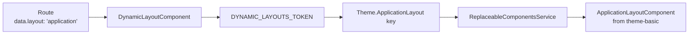
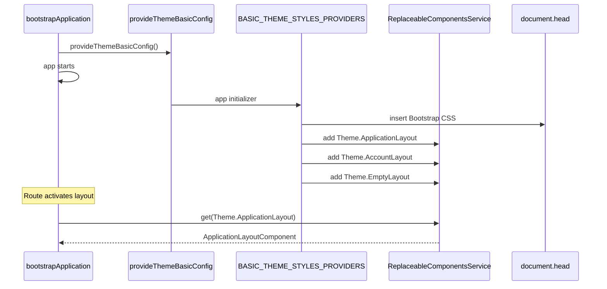

`@abp/ng.theme.basic` is the open-source reference theme for the **ABP Framework** Angular UI. It supplies three layouts — application, account, empty — wired into the runtime through `ReplaceableComponentsService`, a top navbar with language and user dropdowns, a sidebar built from `RoutesService`, lazy-loaded Bootstrap 5 styles, and a `ValidationErrorComponent` that ngx-validate renders inline. The package consists almost entirely of a small `provideThemeBasicConfig()` factory plus a handful of standalone components and a `LazyStyleHandler`. This page explains how each of those pieces participates in the `provideAbp*` chain and what hooks exist for customisation without forking.

## Package layout

```text packages/theme-basic/src/lib/
components/
  account-layout/
    account-layout.component.{ts,html}
    auth-wrapper/  tenant-box/
  application-layout/
    application-layout.component.{ts,html}
  empty-layout/
  logo/
  nav-items/
    current-user.component.ts
    languages.component.ts
    nav-items.component.ts
  page-alert-container/
  routes/
  validation-error/
constants/        # bundled Bootstrap CSS string
enums/            # eThemeBasicComponents, eUserMenuItems
handlers/         # LazyStyleHandler
models/           # internal
providers/
  nav-item.provider.ts
  styles.provider.ts
  theme-basic-config.provider.ts
  user-menu.provider.ts
services/         # LayoutService
tokens/           # additional injection tokens
theme-basic.module.ts
```

All components are Angular **standalone**; the module file is kept only for backwards compatibility.

## `provideThemeBasicConfig`

`providers/theme-basic-config.provider.ts` is the single function consumers call. It bundles the nav-item, user-menu, and style providers plus ngx-validate configuration:

```ts packages/theme-basic/src/lib/providers/theme-basic-config.provider.ts
export function provideThemeBasicConfig() {
  return makeEnvironmentProviders([
    BASIC_THEME_NAV_ITEM_PROVIDERS,
    BASIC_THEME_USER_MENU_PROVIDERS,
    BASIC_THEME_STYLES_PROVIDERS,
    { provide: VALIDATION_ERROR_TEMPLATE, useValue: ValidationErrorComponent },
    { provide: VALIDATION_TARGET_SELECTOR, useValue: '.form-group' },
    { provide: VALIDATION_INVALID_CLASSES, useValue: 'is-invalid' },
    LazyStyleHandler,
    provideAppInitializer(() => { inject(LazyStyleHandler); }),
  ]);
}
```

| Provider | Role |
|---|---|
| `BASIC_THEME_NAV_ITEM_PROVIDERS` | Registers `LanguagesComponent` and `CurrentUserComponent` with [`NavItemsService`](/angular/theme-shared) |
| `BASIC_THEME_USER_MENU_PROVIDERS` | Registers "My Account" + "Logout" entries with `UserMenuService` |
| `BASIC_THEME_STYLES_PROVIDERS` | Injects bundled CSS and registers the three layouts as replaceable components |
| `VALIDATION_ERROR_TEMPLATE` | Tells ngx-validate to render errors via `ValidationErrorComponent` |
| `VALIDATION_TARGET_SELECTOR` | Where validation messages mount (`.form-group`) |
| `VALIDATION_INVALID_CLASSES` | CSS class added to invalid controls (`is-invalid`) |
| `LazyStyleHandler` | Loads chart/datatable/etc. styles on demand |

## Layouts as replaceable components

`providers/styles.provider.ts` is the most important file in the package — it is where the theme tells the framework "I am the default application layout". Three layouts are added to `ReplaceableComponentsService` under stable keys from `eThemeBasicComponents`:

```ts packages/theme-basic/src/lib/providers/styles.provider.ts
export const BASIC_THEME_STYLES_PROVIDERS = [
  provideAppInitializer(() => {
    const initializerFn = configureStyles(
      inject(DomInsertionService),
      inject(ReplaceableComponentsService),
    );
    return initializerFn();
  }),
];

export function configureStyles(
  domInsertion: DomInsertionService,
  replaceableComponents: ReplaceableComponentsService,
) {
  return () => {
    domInsertion.insertContent(CONTENT_STRATEGY.AppendStyleToHead(styles));
    initLayouts(replaceableComponents);
  };
}

function initLayouts(replaceableComponents: ReplaceableComponentsService) {
  replaceableComponents.add({
    key: eThemeBasicComponents.ApplicationLayout,
    component: ApplicationLayoutComponent,
  });
  replaceableComponents.add({
    key: eThemeBasicComponents.AccountLayout,
    component: AccountLayoutComponent,
  });
  replaceableComponents.add({
    key: eThemeBasicComponents.EmptyLayout,
    component: EmptyLayoutComponent,
  });
}
```

`DomInsertionService` and `CONTENT_STRATEGY` come from [core](/angular/core-package). The `styles` constant (in `constants/styles.ts`) is the compiled Bootstrap CSS string injected at runtime.

### `eThemeBasicComponents`

```ts
export enum eThemeBasicComponents {
  ApplicationLayout = 'Theme.ApplicationLayout',
  AccountLayout     = 'Theme.AccountLayout',
  EmptyLayout       = 'Theme.EmptyLayout',
  Logo              = 'Theme.Logo',
  Routes            = 'Theme.Routes',
  NavItems          = 'Theme.NavItems',
  CurrentUser       = 'Theme.CurrentUser',
  Languages         = 'Theme.Languages',
}
```

Apps replace any of these by calling `replaceableComponents.add({ key: 'Theme.ApplicationLayout', component: MyLayout })` from an `provideAppInitializer` of their own — that's the official customisation path documented under [/aspnetcore/mvc](/aspnetcore/mvc) for the MVC equivalent.

### Layout selection on a route

`DEFAULT_DYNAMIC_LAYOUTS` (in [core](/angular/core-package)) maps `eLayoutType` enum values to the same replaceable keys. The `DynamicLayoutComponent` then resolves them at runtime:



## Application layout

```ts packages/theme-basic/src/lib/components/application-layout/application-layout.component.ts
@Component({
  selector: 'abp-layout-application',
  templateUrl: './application-layout.component.html',
  animations: [slideFromBottom, collapseWithMargin],
  providers: [LayoutService, SubscriptionService],
  imports: [
    NgTemplateOutlet, LogoComponent, PageAlertContainerComponent,
    RoutesComponent, NavItemsComponent, ReplaceableTemplateDirective, RouterOutlet,
  ],
})
export class ApplicationLayoutComponent implements AfterViewInit {
  public readonly service = inject(LayoutService);
  static type = eLayoutType.application;

  ngAfterViewInit() { this.service.subscribeWindowSize(); }
}
```

The layout composes:

- `LogoComponent` (replaceable via `Theme.Logo`)
- `RoutesComponent` (replaceable via `Theme.Routes`) — the left sidebar built from `RoutesService.visible$`
- `NavItemsComponent` (replaceable via `Theme.NavItems`) — top-right navbar slots
- `PageAlertContainerComponent` — renders `PageAlertService.alerts$`
- `<router-outlet>`
- `ReplaceableTemplateDirective` wraps each replaceable slot

`LayoutService` (component-scoped, not root) tracks the sidebar collapsed state and listens for navigation to auto-collapse on small screens:

```ts packages/theme-basic/src/lib/services/layout.service.ts
@Injectable()
export class LayoutService {
  private subscription = inject(SubscriptionService);
  document = inject(DOCUMENT);
  isCollapsed = true;
  smallScreen!: boolean;
  logoComponentKey = eThemeBasicComponents.Logo;
  routesComponentKey = eThemeBasicComponents.Routes;
  navItemsComponentKey = eThemeBasicComponents.NavItems;

  constructor() {
    const routerEvents = inject(RouterEvents);
    this.subscription.addOne(routerEvents.getNavigationEvents('End'), () => {
      this.isCollapsed = true;
    });
  }
}
```

## Account layout

`AccountLayoutComponent` is the login/register chrome. It uses the same `LayoutService` but with reduced chrome — only the logo, an `AuthWrapperComponent`, the page alert container, and a `RouterOutlet`:

```ts packages/theme-basic/src/lib/components/account-layout/account-layout.component.ts
@Component({
  selector: 'abp-layout-account',
  templateUrl: './account-layout.component.html',
  animations: [collapseWithMargin],
  providers: [LayoutService, SubscriptionService],
  imports: [
    NgTemplateOutlet, LogoComponent, RoutesComponent, NavItemsComponent,
    AuthWrapperComponent, PageAlertContainerComponent,
    ReplaceableTemplateDirective, RouterOutlet,
  ],
})
export class AccountLayoutComponent implements AfterViewInit { /* ... */ }
```

`AuthWrapperComponent` (`components/account-layout/auth-wrapper/auth-wrapper.component.ts`) reads from `AuthWrapperService` provided by `@abp/ng.account.core` — see [Account](/angular/account-and-account-core#authwrapperservice). `TenantBoxComponent` is shown when multi-tenancy is enabled.

## Empty layout

`EmptyLayoutComponent` is just a `<router-outlet>` inside a body wrapper. It is used for error pages and embedded scenarios.

## Nav items

`providers/nav-item.provider.ts` shows the contributor pattern: `NavItemsService.addItems([...])` runs in an app initializer:

```ts packages/theme-basic/src/lib/providers/nav-item.provider.ts
export function configureNavItems() {
  const navItems = inject(NavItemsService);
  navItems.addItems([
    { id: eThemeBasicComponents.Languages,   order: 100, component: LanguagesComponent },
    { id: eThemeBasicComponents.CurrentUser, order: 100, component: CurrentUserComponent },
  ]);
}
```

`NavItemsComponent` iterates the registered items and uses `NgComponentOutlet` to render each. Apps add their own slot (e.g. notifications) by calling `addItems` with a higher `order`.

| Built-in slot | Component |
|---|---|
| `Theme.Languages` | `LanguagesComponent` — language switcher |
| `Theme.CurrentUser` | `CurrentUserComponent` — avatar + dropdown |

## User menu

`providers/user-menu.provider.ts` registers the dropdown entries shown under the current-user avatar:

```ts packages/theme-basic/src/lib/providers/user-menu.provider.ts
export function configureUserMenu(injector: Injector) {
  const userMenu = injector.get(UserMenuService);
  const authService = injector.get(AuthService);
  const navigateToManageProfile = injector.get(NAVIGATE_TO_MANAGE_PROFILE);

  return () => {
    userMenu.addItems([
      {
        id: eUserMenuItems.MyAccount, order: 100,
        textTemplate: { text: 'AbpAccount::MyAccount', icon: 'fa fa-cog' },
        action: () => navigateToManageProfile(),
      },
      {
        id: eUserMenuItems.Logout, order: 101,
        textTemplate: { text: 'AbpUi::Logout', icon: 'fa fa-power-off' },
        action: () => { authService.logout().subscribe(); },
      },
    ]);
  };
}
```

`NAVIGATE_TO_MANAGE_PROFILE` is provided by `@abp/ng.oauth` (`NavigateToManageProfileProvider`) when using the OIDC code flow — it opens the OIDC server's `Account/Manage` page in the same window. Apps using the password flow override it to navigate inside the SPA — see [Account](/angular/account-and-account-core#manage-profile).

## Sidebar — `RoutesComponent`

`RoutesComponent` reads `RoutesService.visible$` from [core](/angular/core-package#routesservice) to render the side navigation. It honours `PermissionService.filterItemsByPolicy$` so menu items disappear when the granted policies change. `LogoComponent` and `RoutesComponent` are themselves replaceable (`Theme.Logo`, `Theme.Routes`), so apps can swap branding without touching the layout.

## Page alert container

```ts packages/theme-basic/src/lib/components/page-alert-container/page-alert-container.component.ts
@Component({
  selector: 'abp-page-alert-container',
  // ...
})
```

`PageAlertContainerComponent` subscribes to `PageAlertService.alerts$` from [theme-shared](/angular/theme-shared#page-alert) and emits Bootstrap-styled `<div class="alert alert-${type}">…</div>` markup with optional dismiss.

## Validation error

`ValidationErrorComponent` is the template that ngx-validate clones below each invalid field when `.form-group` is the target selector:

```html
<!-- abbreviated -->
<small class="text-danger" *ngFor="let error of errors">
  {{ error | abpLocalization }}
</small>
```

It is registered through `VALIDATION_ERROR_TEMPLATE` in `provideThemeBasicConfig`.

## Lazy style handler

`LazyStyleHandler` (in `handlers/`) waits for the `LazyLoadService` from [core](/angular/core-package) to fetch CSS chunks the moment a feature using them mounts — for example the ngx-datatable theme is loaded only when an `<ngx-datatable>` first renders. This avoids shipping CSS for features the app does not use.

## Theme bootstrap flow



## Module form (legacy)

`theme-basic.module.ts` still exports `ThemeBasicModule` for non-standalone apps:

```ts packages/theme-basic/src/lib/theme-basic.module.ts
export const LAYOUTS = [ApplicationLayoutComponent, AccountLayoutComponent, EmptyLayoutComponent];

export const THEME_BASIC_COMPONENTS = [
  ...LAYOUTS, ValidationErrorComponent, LogoComponent, NavItemsComponent,
  RoutesComponent, CurrentUserComponent, LanguagesComponent,
  PageAlertContainerComponent, AuthWrapperComponent, TenantBoxComponent,
];

@NgModule({ declarations: [], exports: [...THEME_BASIC_COMPONENTS], imports: [...THEME_BASIC_COMPONENTS] })
export class BaseThemeBasicModule {}

@NgModule({ exports: [BaseThemeBasicModule], imports: [BaseThemeBasicModule] })
export class ThemeBasicModule {
  /** @deprecated forRoot method is deprecated, use `provideThemeBasicConfig` */
  static forRoot(): ModuleWithProviders<ThemeBasicModule> {
    return { ngModule: ThemeBasicModule, providers: [provideThemeBasicConfig()] };
  }
}
```

## Customisation checklist

| Task | Approach |
|---|---|
| Replace the application layout | `replaceableComponents.add({ key: eThemeBasicComponents.ApplicationLayout, component: MyLayout })` |
| Replace just the logo | Same, with `eThemeBasicComponents.Logo` |
| Add a navbar widget | `NavItemsService.addItems([{ id, order, component }])` |
| Add a user menu entry | `UserMenuService.addItems([{ id, order, textTemplate, action }])` |
| Override default messages | `provideAbpThemeShared(withValidationBluePrint({ … }))` from [theme-shared](/angular/theme-shared) |
| Skip bundled CSS | Replace `BASIC_THEME_STYLES_PROVIDERS` with your own initializer |

## Cross-links

- [Theme Shared](/angular/theme-shared) — `NavItemsService`, `UserMenuService`, `PageAlertService`, `BreadcrumbComponent`.
- [Core](/angular/core-package) — `ReplaceableComponentsService`, `RoutesService`, `DomInsertionService`, `eLayoutType`, `DYNAMIC_LAYOUTS_TOKEN`.
- [OAuth](/angular/oauth) — provides `NAVIGATE_TO_MANAGE_PROFILE` for the "My Account" menu entry.
- [Account](/angular/account-and-account-core) — `AccountLayoutComponent` hosts the login/register screens.
- [ASP.NET Core MVC](/aspnetcore/mvc) — the parallel MVC theming model.
