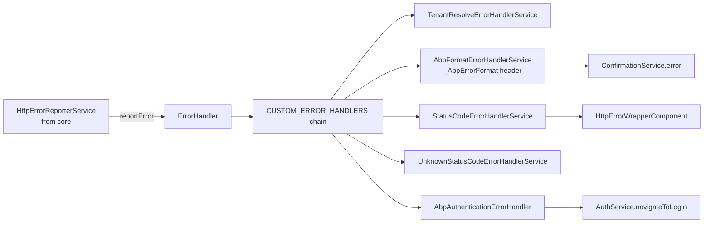

`@abp/ng.theme.shared` collects the chromatic-neutral UI primitives every ABP Framework theme needs to function — breadcrumb resolver, Bootstrap-driven modal, toast container, confirmation dialog, loader bar, validation blueprints, and the HTTP error handler chain that translates ABP error envelopes into user-friendly messages. It defines the `provideAbpThemeShared(...features)` factory used by `theme-basic` (and any third-party theme) to bootstrap these primitives. This page maps each component, service, and provider so theme authors and feature developers know what is available without forking a theme.

## Package skeleton

```text packages/theme-shared/src/lib/
adapters/                 # NG Bootstrap date parser formatter, etc.
animations/               # slideFromBottom, collapseWithMargin, fadeIn
components/               # breadcrumb, modal, toast, confirmation, ...
constants/                # DEFAULT_VALIDATION_BLUEPRINTS, default-errors
directives/               # LoadingDirective, NgxDatatable* dirs, DisabledDirective
enums/                    # eThemeSharedRouteNames, etc.
handlers/                 # ErrorHandler, DocumentDirHandlerService
models/                   # HttpErrorConfig, Confirmation, Toaster
providers/                # provideAbpThemeShared + feature factories
services/                 # Toaster, Confirmation, PageAlert, error handlers
theme-shared.module.ts    # Legacy NgModule path
tokens/                   # HTTP_ERROR_CONFIG, CUSTOM_ERROR_HANDLERS, ...
utils/                    # DateParserFormatter, error.utils
```

The public surface is just one barrel:

```ts packages/theme-shared/src/public-api.ts
export * from './lib/adapters';
export * from './lib/animations';
export * from './lib/components';
export * from './lib/directives';
export * from './lib/enums';
export * from './lib/handlers';
export * from './lib/models';
export * from './lib/providers';
export * from './lib/services';
export * from './lib/theme-shared.module';
export * from './lib/tokens';
export * from './lib/utils';
export * from './lib/constants';
```

## `provideAbpThemeShared` and its features

`providers/theme-shared-config.provider.ts` mirrors the `provideAbpCore` pattern from [core](/angular/core-package#provideabpcore--the-entry-factory). The base call registers:

- An app initializer that instantiates `ErrorHandler`, processes `THEME_SHARED_APPEND_CONTENT`, and triggers `DocumentDirHandlerService` (RTL/LTR document direction).
- `THEME_SHARED_ROUTE_PROVIDERS` — contributes "Settings" / "Administration" entries to `RoutesService`.
- `HTTP_ERROR_CONFIG` defaulted to `undefined`.
- `NgbDateParserFormatter` bound to `DateParserFormatter`.
- `NG_BOOTSTRAP_CONFIG_PROVIDERS` — defaults for `NgbModal`, `NgbDatepicker`, etc.
- `VALIDATION_BLUEPRINTS`, `VALIDATION_MAP_ERRORS_FN`, `VALIDATION_VALIDATE_ON_SUBMIT` for [`@ngx-validate/core`](https://github.com/ng-turkey/ngx-validate).
- `CONFIRMATION_ICONS` (Bootstrap Icons by default).
- `tenantNotFoundProvider`.
- `DEFAULT_HANDLERS_PROVIDERS` — five `CUSTOM_ERROR_HANDLERS` (multi-provided).

```ts packages/theme-shared/src/lib/providers/theme-shared-config.provider.ts
export function provideAbpThemeShared(...features: ThemeSharedFeature<ThemeSharedFeatureKind>[]) {
  const providers = [
    provideAppInitializer(() => {
      inject(ErrorHandler);
      inject(THEME_SHARED_APPEND_CONTENT);
      inject(DocumentDirHandlerService);
    }),
    THEME_SHARED_ROUTE_PROVIDERS,
    { provide: HTTP_ERROR_CONFIG, useValue: undefined },
    { provide: NgbDateParserFormatter, useClass: DateParserFormatter },
    NG_BOOTSTRAP_CONFIG_PROVIDERS,
    { provide: VALIDATION_BLUEPRINTS, useValue: { ...DEFAULT_VALIDATION_BLUEPRINTS } },
    { provide: VALIDATION_MAP_ERRORS_FN, useValue: defaultMapErrorsFn },
    { provide: VALIDATION_VALIDATE_ON_SUBMIT, useValue: undefined },
    DocumentDirHandlerService,
    { provide: CONFIRMATION_ICONS, useValue: { ...DEFAULT_CONFIRMATION_ICONS } },
    tenantNotFoundProvider,
    DEFAULT_HANDLERS_PROVIDERS,
  ];
  for (const feature of features) providers.push(...feature.ɵproviders);
  return makeEnvironmentProviders(providers);
}
```

### Feature factories

```ts packages/theme-shared/src/lib/providers/theme-shared-config.provider.ts
export function withHttpErrorConfig(httpErrorConfig: HttpErrorConfig)        { /* HTTP_ERROR_CONFIG */ }
export function withValidationBluePrint(bluePrints: Validation.Blueprints)   { /* VALIDATION_BLUEPRINTS */ }
export function withValidationMapErrorsFn(mapErrorsFn: Validation.MapErrorsFn)
export function withValidateOnSubmit(validateOnSubmit: boolean)              { /* VALIDATION_VALIDATE_ON_SUBMIT */ }
export function withConfirmationIcon(confirmationIcons: Partial<ConfirmationIcons>)
```

| `with*` feature | Token replaced | When to use |
|---|---|---|
| `withHttpErrorConfig` | `HTTP_ERROR_CONFIG` | Override error component / skip handle for routes |
| `withValidationBluePrint` | `VALIDATION_BLUEPRINTS` | Customize default error messages |
| `withValidationMapErrorsFn` | `VALIDATION_MAP_ERRORS_FN` | Custom validator → message mapping |
| `withValidateOnSubmit` | `VALIDATION_VALIDATE_ON_SUBMIT` | Validate only on submit |
| `withConfirmationIcon` | `CONFIRMATION_ICONS` | Replace default icon classes |

## Components

`components/index.ts` exports every shipped widget. The major ones:

| Component | Selector | File | Purpose |
|---|---|---|---|
| `BreadcrumbComponent` | `abp-breadcrumb` | `breadcrumb/breadcrumb.component.ts` | Resolves URL → `RoutesService` tree |
| `BreadcrumbItemsComponent` | `abp-breadcrumb-items` | `breadcrumb-items/...` | Renders breadcrumb segments |
| `ButtonComponent` | `abp-button` | `button/button.component.ts` | Reusable button with `loading` state |
| `ConfirmationComponent` | `abp-confirmation` | `confirmation/...` | Modal dialog body for confirms |
| `HttpErrorWrapperComponent` | `abp-http-error-wrapper` | `http-error-wrapper/...` | Full-page error component injected by error handlers |
| `LoaderBarComponent` | `abp-loader-bar` | `loader-bar/loader-bar.component.ts` | Top-of-page progress bar |
| `LoadingComponent` | `abp-loading` | `loading/loading.component.ts` | Inline spinner |
| `ModalComponent` | `abp-modal` | `modal/modal.component.ts` | Dismissable Bootstrap modal wrapper |
| `ToastComponent` | `abp-toast` | `toast/toast.component.ts` | Single toast card |
| `ToastContainerComponent` | `abp-toast-container` | `toast-container/...` | Renders the list of toasts |
| `PasswordComponent` | `abp-password` | `password/password.component.ts` | Password input with reveal toggle |
| `FormInputComponent` | `abp-form-input` | `form-input/...` | Labelled input with validation |
| `FormCheckboxComponent` | `abp-form-checkbox` | `checkbox/checkbox.component.ts` | Labelled checkbox |
| `SpinnerComponent` | `abp-spinner` | `spinner/spinner.component.ts` | Loading spinner |
| `InternetConnectionStatusComponent` | `abp-internet-connection-status` | `internet-connection-status/...` | Offline banner |
| `CardModule` | — | `card/index.ts` | Compositional card subcomponents |

### Breadcrumb

`BreadcrumbComponent` is the canonical consumer of `RoutesService` and `RouterEvents` from [core](/angular/core-package#routesservice):

```ts packages/theme-shared/src/lib/components/breadcrumb/breadcrumb.component.ts
@Component({
  selector: 'abp-breadcrumb',
  templateUrl: './breadcrumb.component.html',
  changeDetection: ChangeDetectionStrategy.OnPush,
  providers: [SubscriptionService],
  imports: [BreadcrumbItemsComponent],
})
export class BreadcrumbComponent implements OnInit {
  private routerEvents = inject(RouterEvents);
  private routes = inject(RoutesService);

  segments: Partial<ABP.Route>[] = [];

  ngOnInit(): void {
    this.subscription.addOne(
      this.routerEvents.getNavigationEvents('End').pipe(
        startWith(null),
        map(() => this.routes.search({ path: getRoutePath(this.router) })),
      ),
      route => {
        this.segments = [];
        if (route) {
          let node = { parent: route } as TreeNode<ABP.Route>;
          while (node.parent) {
            node = node.parent;
            const { parent, children, isLeaf, path, ...segment } = node;
            if (!isAdministration(segment)) this.segments.unshift(segment);
          }
          this.cdRef.detectChanges();
        }
      },
    );
  }
}
```

It excludes the top-level "Administration" group from the rendered trail.

### Modal

`ModalComponent` wraps `NgbModal`. It exposes `visible` as a two-way `model<boolean>()`, can dismiss programmatically, and warns about unsaved form changes when `SUPPRESS_UNSAVED_CHANGES_WARNING` is not set:

```ts packages/theme-shared/src/lib/components/modal/modal.component.ts
@Component({
  selector: 'abp-modal',
  templateUrl: './modal.component.html',
  styleUrls: ['./modal.component.scss'],
  providers: [SubscriptionService],
  imports: [NgTemplateOutlet],
})
export class ModalComponent implements OnInit, OnDestroy, DismissableModal {
  protected readonly confirmationService = inject(ConfirmationService);
  protected readonly modal = inject(NgbModal);
  protected readonly modalRefService = inject(ModalRefService);
  protected readonly suppressUnsavedChangesWarningToken = inject(SUPPRESS_UNSAVED_CHANGES_WARNING, { optional: true });

  visible = model<boolean>(false);
  busy = input(false, { transform: (value: boolean) => { /* ... */ } });
}
```

`ModalCloseDirective` (`modal-close.directive.ts`) is the matching directive for buttons inside the modal — it dispatches a dismiss when clicked. `ModalRefService` tracks open modal references so the global confirmation handler can react to navigation.

### Confirmation

```ts packages/theme-shared/src/lib/components/confirmation/confirmation.component.ts
@Component({
  selector: 'abp-confirmation',
  templateUrl: './confirmation.component.html',
  styleUrls: ['./confirmation.component.scss'],
  imports: [AsyncPipe, LocalizationPipe],
})
export class ConfirmationComponent {
  private icons = inject<ConfirmationIcons>(CONFIRMATION_ICONS);

  confirm = Confirmation.Status.confirm;
  reject = Confirmation.Status.reject;
  dismiss = Confirmation.Status.dismiss;

  confirmation$!: ReplaySubject<Confirmation.DialogData | null>;
  clear!: (status: Confirmation.Status) => void;
}
```

The companion `ConfirmationService` (in `services/confirmation.service.ts`) is the public API consumers use: `confirmation.warn(message, title, options)`, `confirmation.error(...)`, `confirmation.info(...)`, `confirmation.success(...)` all return `Observable<Confirmation.Status>`.

### Loader bar

`LoaderBarComponent` listens to both HTTP traffic and router navigations to grow a progress bar between 0–100 vw:

```ts packages/theme-shared/src/lib/components/loader-bar/loader-bar.component.ts
@Component({
  selector: 'abp-loader-bar',
  template: `
    <div id="abp-loader-bar" [class]="containerClass()" [class.is-loading]="isLoading()">
      <div
        class="abp-progress"
        [class.progressing]="progressLevel"
        [style.width.vw]="progressLevel"
        [style]="{ 'background-color': color(), 'box-shadow': boxShadow }"
      ></div>
    </div>
  `,
  providers: [SubscriptionService],
})
export class LoaderBarComponent implements OnDestroy, OnInit {
  private httpWaitService = inject(HttpWaitService);
  private routerWaitService = inject(RouterWaitService);
}
```

`HttpWaitService` is driven by the [`ApiInterceptor`](/angular/core-package#interceptors) in core; `RouterWaitService` is driven by `RouterEvents`.

### Toast

`ToasterService` projects a `ToastContainerComponent` into `document.body` using `ContentProjectionService.AppendComponentToBody` from [core](/angular/core-package):

```ts packages/theme-shared/src/lib/services/toaster.service.ts
@Injectable({ providedIn: 'root' })
export class ToasterService implements ToasterContract {
  private toasts$ = new ReplaySubject<Toaster.Toast[]>(1);
  private containerComponentRef!: ComponentRef<ToastContainerComponent>;

  private setContainer() {
    this.containerComponentRef = this.contentProjectionService.projectContent(
      PROJECTION_STRATEGY.AppendComponentToBody(ToastContainerComponent, {
        toasts$: this.toasts$,
        remove: this.remove,
      }),
    );
  }
}
```

`ToastComponent` itself maps severity (`success`/`info`/`warning`/`error`) to a Bootstrap Icons class. Public API methods: `success`, `info`, `warn`, `error` — each returns the new toast's id.

## Services

| Service | Responsibility |
|---|---|
| `ConfirmationService` | Bootstrap modal with localized texts; returns `Observable<Status>` |
| `ToasterService` | Body-projected toast stack |
| `PageAlertService` | Persistent in-page alerts |
| `NavItemsService` / `UserMenuService` | Right-side navbar slot registries |
| `ErrorHandler` (handler) | Iterates `CUSTOM_ERROR_HANDLERS` until one matches |
| `CreateErrorComponentService` | Mounts `HttpErrorWrapperComponent` for blocking errors |
| `AbpFormatErrorHandlerService` | Handles `_AbpErrorFormat` header — ABP standard error envelope |
| `StatusCodeErrorHandlerService` | Generic 4xx/5xx handler |
| `UnknownStatusCodeErrorHandlerService` | Catch-all (network etc.) |
| `RouterErrorHandlerService` | Navigation errors |
| `TenantResolveErrorHandlerService` | Multi-tenancy `__tenant` resolution failures |
| `AbpAuthenticationErrorHandler` | 401 redirect to login |

### Error pipeline



The chain is registered as multi-providers in `providers/error-handlers.provider.ts`:

```ts packages/theme-shared/src/lib/providers/error-handlers.provider.ts
export const DEFAULT_HANDLERS_PROVIDERS: Provider[] = [
  { provide: CUSTOM_ERROR_HANDLERS, multi: true, useExisting: TenantResolveErrorHandlerService },
  { provide: CUSTOM_ERROR_HANDLERS, multi: true, useExisting: AbpFormatErrorHandlerService },
  { provide: CUSTOM_ERROR_HANDLERS, multi: true, useExisting: StatusCodeErrorHandlerService },
  { provide: CUSTOM_ERROR_HANDLERS, multi: true, useExisting: UnknownStatusCodeErrorHandlerService },
  { provide: CUSTOM_ERROR_HANDLERS, multi: true, useExisting: AbpAuthenticationErrorHandler },
];
```

`AbpFormatErrorHandlerService` recognises the `_AbpErrorFormat` response header that ASP.NET Core sets on conventional ABP errors — see [HTTP](/http/overview) for the server pipeline:

```ts packages/theme-shared/src/lib/services/abp-format-error-handler.service.ts
@Injectable({ providedIn: 'root' })
export class AbpFormatErrorHandlerService implements CustomHttpErrorHandlerService {
  readonly priority = CUSTOM_HTTP_ERROR_HANDLER_PRIORITY.high;
  canHandle(error: unknown): boolean {
    if (error instanceof HttpErrorResponse && error.headers.get('_AbpErrorFormat')) {
      this.error = error;
      return true;
    }
    return false;
  }
  execute() {
    const { message, title } = getErrorFromRequestBody(this.error?.error?.error);
    this.confirmationService
      .error(message, title, { hideCancelBtn: true, yesText: 'AbpAccount::Close' })
      .subscribe(() => {
        if (this.error?.status === 401) this.navigateToLogin();
      });
  }
}
```

### Page alert

`PageAlertService` exposes a reactive list of dismissible Bootstrap alerts inside `<abp-page-alert-container>` (rendered by [theme-basic](/angular/theme-basic)):

```ts packages/theme-shared/src/lib/services/page-alert.service.ts
export interface PageAlert {
  type: 'primary' | 'secondary' | 'success' | 'danger' | 'warning' | 'info' | 'light' | 'dark';
  message: string;
  dismissible?: boolean;
  title?: string;
}

@Injectable({ providedIn: 'root' })
export class PageAlertService {
  private alerts = new InternalStore<PageAlert[]>([]);
  alerts$ = this.alerts.sliceState(state => state);

  show(alert: PageAlert) {
    const newAlert: PageAlert = { ...alert, dismissible: alert.dismissible ?? true };
    this.alerts.set([newAlert, ...this.alerts.state]);
  }
  remove(index: number) { /* splice */ }
}
```

## Directives

| Directive | Selector | Purpose |
|---|---|---|
| `LoadingDirective` | `[abpLoading]` | Blocks the host with an overlay while truthy |
| `DisabledDirective` | `[abpDisabled]` | Toggles `disabled` on form controls/buttons |
| `AbpVisibleDirective` | `[abpVisible]` | CSS `visibility` toggle |
| `NgxDatatableDefaultDirective` | `ngx-datatable[default]` | Applies ABP defaults to ngx-datatable |
| `NgxDatatableListDirective` | `ngx-datatable[abpDatatableList]` | Binds the table to a `ListService` |

`NgxDatatableListDirective` is how every CRUD page connects a `<ngx-datatable>` element to a `ListService` instance without manual wiring of `page`, `sort`, `filter`.

## Tokens

`tokens/index.ts` exports the configuration injection tokens:

| Token | Default |
|---|---|
| `HTTP_ERROR_CONFIG` | `undefined` (set via `withHttpErrorConfig`) |
| `CUSTOM_ERROR_HANDLERS` | multi-provided handler list |
| `CONFIRMATION_ICONS` | `DEFAULT_CONFIRMATION_ICONS` (Bootstrap Icons) |
| `THEME_SHARED_APPEND_CONTENT` | `LogoProvider` extension point |
| `SUPPRESS_UNSAVED_CHANGES_WARNING` | undefined |

## Animations

`animations/index.ts` re-exports four `trigger`s used by layout components — `slideFromBottom`, `collapseWithMargin`, `fadeIn`, `slideFromLeft`. They are consumed by `theme-basic`'s `ApplicationLayoutComponent`:

```ts packages/theme-basic/src/lib/components/application-layout/application-layout.component.ts
animations: [slideFromBottom, collapseWithMargin],
```

## Validation blueprints

`constants/default-validation-blueprints.ts` ships English defaults for every validator built into [core](/angular/core-package#validators). They become the `VALIDATION_BLUEPRINTS` token consumed by `@ngx-validate/core`. Override per-app with:

```ts
provideAbpThemeShared(
  withValidationBluePrint({
    required: 'My custom required message',
  }),
);
```

## Module path (legacy)

`theme-shared.module.ts` still exports `BaseThemeSharedModule` and `ThemeSharedModule` for non-standalone apps:

```ts packages/theme-shared/src/lib/theme-shared.module.ts
export const THEME_SHARED_EXPORTS = [
  BreadcrumbComponent, BreadcrumbItemsComponent, ButtonComponent, ConfirmationComponent,
  LoaderBarComponent, LoadingComponent, ModalComponent, ToastComponent, ToastContainerComponent,
  LoadingDirective, ModalCloseDirective, FormInputComponent, FormCheckboxComponent,
  HttpErrorWrapperComponent, NgxDatatableModule, NgxValidateCoreModule, CardModule,
  DisabledDirective, AbpVisibleDirective, NgxDatatableListDirective,
  NgxDatatableDefaultDirective, PasswordComponent,
];

@NgModule({ imports: [...THEME_SHARED_EXPORTS], exports: [...THEME_SHARED_EXPORTS] })
export class BaseThemeSharedModule {}
```

The deprecated `ThemeSharedModule.forRoot({ httpErrorConfig, validation, confirmationIcons })` is still available but new code should use `provideAbpThemeShared`.

## Cross-links

- [Core](/angular/core-package) — `HttpErrorReporterService`, `ApiInterceptor`, `RoutesService`.
- [Theme Basic](/angular/theme-basic) — concrete theme that ships `<abp-page-alert-container>`.
- [Components](/angular/components) — `PageComponent` embeds `BreadcrumbComponent`.
- [HTTP](/http/overview) — server side that emits the `_AbpErrorFormat` envelope.
- [ASP.NET Core MVC](/aspnetcore/mvc) — surfaces the HTTP errors the chain consumes.
