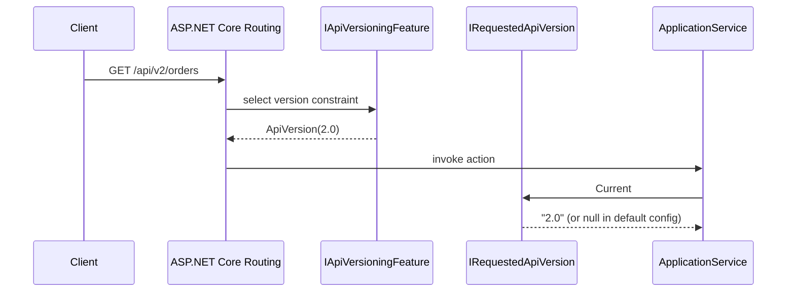
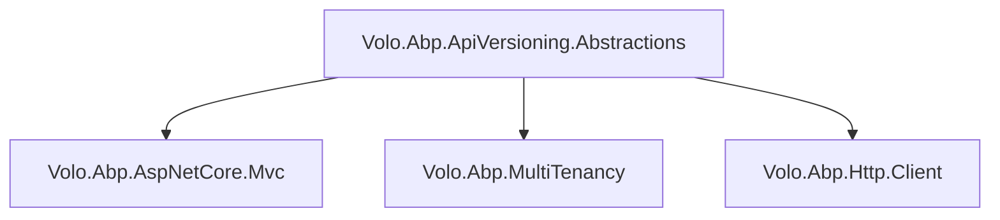

ABP Framework keeps API versioning intentionally thin in the core: the package `Volo.Abp.ApiVersioning.Abstractions` ships a single interface — `IRequestedApiVersion` — together with a null-object implementation that returns `null`, and a module that registers the null object as a singleton. Higher-level modules (auto API controllers, dynamic HTTP client proxies, multi-tenant routing) can take a dependency on `IRequestedApiVersion` without pulling `Asp.Versioning.Mvc` into the dependency graph. This page documents every file under `framework/src/Volo.Abp.ApiVersioning.Abstractions/`, explains how the null pattern is consumed elsewhere, and shows how to plug in a real version provider backed by `Asp.Versioning`.

## File inventory

| File | Purpose |
| --- | --- |
| `Volo/Abp/ApiVersioning/IRequestedApiVersion.cs` | Single-property interface returning the current request's version label. |
| `Volo/Abp/ApiVersioning/NullRequestedApiVersion.cs` | Singleton no-op implementation. |
| `Volo/Abp/ApiVersioning/AbpApiVersioningAbstractionsModule.cs` | Registers `NullRequestedApiVersion.Instance` as the default singleton. |

<Tip>The "Abstractions" naming convention is used across ABP whenever a base module needs to expose contracts that other modules can substitute. Do **not** add behaviour to this package; concrete implementations belong in modules like `Volo.Abp.AspNetCore.Mvc.Versioning` or your own integration layer.</Tip>

## `IRequestedApiVersion`

The contract is a one-property abstraction. Implementations return the version label of the in-flight HTTP request, or `null` when there is no ambient request (or no version was selected). The reason for a `string?` return type — rather than an `ApiVersion` value object — is that the abstractions package must not depend on `Asp.Versioning.Abstractions` or any specific versioning library.

```csharp framework/src/Volo.Abp.ApiVersioning.Abstractions/Volo/Abp/ApiVersioning/IRequestedApiVersion.cs
namespace Volo.Abp.ApiVersioning;

public interface IRequestedApiVersion
{
    string? Current { get; }
}
```

Consumers query the interface inside multi-tenant URL builders, dynamic HTTP client proxies, and OpenAPI document selectors. None of those callers should branch on `null`; the documented contract is that **a missing version is indistinguishable from "version not relevant"** and the call site should select its default.

## `NullRequestedApiVersion`

`NullRequestedApiVersion` is the classic Gang-of-Four null-object: a sealed singleton with a public `Instance` field and a private constructor. Its `Current` property always returns `null`:

```csharp framework/src/Volo.Abp.ApiVersioning.Abstractions/Volo/Abp/ApiVersioning/NullRequestedApiVersion.cs
namespace Volo.Abp.ApiVersioning;

public class NullRequestedApiVersion : IRequestedApiVersion
{
    public static NullRequestedApiVersion Instance = new NullRequestedApiVersion();

    public string? Current => null;

    private NullRequestedApiVersion()
    {

    }
}
```

Three traits matter for downstream code:

- It is registered as a **singleton**, so it allocates only once per process.
- It is **not** marked `sealed`; a custom implementation may inherit and override `Current` if you prefer to avoid a separate type, although `IRequestedApiVersion` is the documented extension point.
- The private constructor enforces use of `Instance` — but the field is mutable. Treat it as immutable in your own code.

## The module

`AbpApiVersioningAbstractionsModule` registers the null instance under the `IRequestedApiVersion` service:

```csharp framework/src/Volo.Abp.ApiVersioning.Abstractions/Volo/Abp/ApiVersioning/AbpApiVersioningAbstractionsModule.cs
public class AbpApiVersioningAbstractionsModule : AbpModule
{
    public override void ConfigureServices(ServiceConfigurationContext context)
    {
        context.Services.AddSingleton<IRequestedApiVersion>(NullRequestedApiVersion.Instance);
    }
}
```

The module has **no** `DependsOn` attributes — it is the floor of the dependency stack for anything version-aware. Higher-level packages like the MVC auto controller module and the multi-tenant URL provider list it as a transitive dependency, which is why your application module almost never references it directly.

## Replacement pattern

To plug in a real provider, register a different singleton **after** the abstractions module has loaded. The canonical implementation uses `Asp.Versioning`'s `IApiVersioningFeature` from the HTTP context:

```csharp
public class AspNetCoreRequestedApiVersion : IRequestedApiVersion
{
    private readonly IHttpContextAccessor _httpContextAccessor;

    public AspNetCoreRequestedApiVersion(IHttpContextAccessor httpContextAccessor)
    {
        _httpContextAccessor = httpContextAccessor;
    }

    public string? Current
    {
        get
        {
            var feature = _httpContextAccessor.HttpContext?
                .Features.Get<IApiVersioningFeature>();
            return feature?.RequestedApiVersion?.ToString();
        }
    }
}
```

```csharp
public class MyApiVersioningModule : AbpModule
{
    public override void ConfigureServices(ServiceConfigurationContext context)
    {
        // Replace the null singleton:
        context.Services.Replace(
            ServiceDescriptor.Scoped<IRequestedApiVersion, AspNetCoreRequestedApiVersion>());
    }
}
```

<Warning>Because `NullRequestedApiVersion` is registered as a **singleton** but a typical replacement that reads `HttpContext` must be **scoped**, you have to use `services.Replace(...)` rather than a second `AddSingleton`. Calling `AddScoped` on its own will leave both registrations in the container and the singleton will still win for callers that resolve once at construction time.</Warning>

## Consumers of `IRequestedApiVersion`

The abstractions package is small but the interface threads through several core scenarios:

| Caller | Reason for resolving the version |
| --- | --- |
| Auto API controller route group selection | Pick between `/api/v1/...` and `/api/v2/...` route groups (see [/aspnetcore/mvc](/aspnetcore/mvc)). |
| Dynamic HTTP client proxies | Append `api-version` to the request URL or header (see [/http/overview](/http/overview)). |
| Multi-tenant URL provider | Combine tenant placeholders with version placeholders. See [multi-tenancy](/multi-tenancy). |
| Swashbuckle integration | Choose the OpenAPI document to render when the URL embeds a version segment ([/aspnetcore/swashbuckle-swagger](/aspnetcore/swashbuckle-swagger)). |

Because each caller selects its own behaviour for `Current == null`, you can leave the null object in place during prototyping without breaking those callers — they fall back to a single, unversioned route group.

## Sequence: how the version flows through a request



When the application has not added a real versioning module, the dotted line from `Versioning` is absent and `Provider.Current` is `null` — callers that interpret `null` as "default" continue to work.

## Dependency graph



The arrows are one-way: nothing in the abstractions package references the consumers. That is what lets a test project register a stub `IRequestedApiVersion` without booting the MVC pipeline at all.

## Testing tips

The null instance is a singleton, so unit-level tests don't need to fake `HttpContext`. For tests that exercise the `Current != null` branch, register a `FixedRequestedApiVersion` directly in the service collection:

```csharp
public class FixedRequestedApiVersion : IRequestedApiVersion
{
    public FixedRequestedApiVersion(string current) => Current = current;
    public string? Current { get; }
}

services.Replace(
    ServiceDescriptor.Singleton<IRequestedApiVersion>(new FixedRequestedApiVersion("2.0")));
```

See the [test base page](/aspnetcore/test-base) for how to wire those substitutions into the integration host.

## Why the abstraction lives in its own package

The split between `Volo.Abp.ApiVersioning.Abstractions` and any concrete implementation is the standard ABP pattern for cross-cutting concerns that may pull a heavy NuGet payload. Three considerations drive the split:

1. **Dependency hygiene.** `Volo.Abp.MultiTenancy` and `Volo.Abp.Http.Client` need to know which version label is currently selected, but cannot depend on `Asp.Versioning.Mvc` because the latter requires `Microsoft.AspNetCore.Mvc`. Splitting the contract into an abstractions package breaks the cycle.
2. **Test isolation.** Unit tests that exercise a multi-tenant URL provider should not have to register the full ASP.NET Core versioning pipeline. The null object lets the test pass `null` and exercise the "no version" branch.
3. **Pluggable implementations.** A microservice tier might prefer header-based versioning while a public API uses URL segments. Both can register their own `IRequestedApiVersion` against the same abstractions package without colliding.

## When `Current` returns `null`

The null value is meaningful — it is not an error. Treat any of the following as legitimate sources of `null`:

| Caller context | Reason `Current` is `null` |
| --- | --- |
| Background job (no HTTP) | There is no in-flight request to inspect. |
| Health probe | Routing did not run a version constraint. |
| Default test base | `NullRequestedApiVersion` is still registered. |
| Endpoint without `[ApiVersion]` | The versioning feature did not assign a value. |

A typical consumer therefore uses the null-coalescing operator to fall back to a default:

```csharp
var version = _requestedApiVersion.Current ?? "v1";
return $"/api/{version}/{resource}";
```

## Stability guarantees

The two types in this package have stayed binary-stable since 4.x. Any change to `IRequestedApiVersion` would break every multi-tenant URL builder and HTTP client proxy in the framework, so additions are unlikely. If you need richer information (major/minor parts, status), wrap the `Current` string in your own service rather than asking for a breaking change here.

## Failure modes

| Symptom | Likely cause |
| --- | --- |
| `Current` is `null` even though the URL contains `/v2/...` | A real provider wasn't registered; `NullRequestedApiVersion` is still in the container. |
| `Current` keeps returning the same value across requests | The custom provider was registered as `Singleton` and captured an early `IHttpContextAccessor`. Re-register as `Scoped`. |
| Two registrations of `IRequestedApiVersion` | Use `services.Replace(...)`; `AddSingleton` followed by `AddScoped` leaves both in the container. |
| OpenAPI document not segmenting by version | Verify [/aspnetcore/swashbuckle-swagger](/aspnetcore/swashbuckle-swagger) registers one `SwaggerDoc` per version. |

## Choice of a versioning scheme

Although the abstractions package is agnostic, downstream code generally expects the `Current` string to follow the format produced by `Asp.Versioning.ApiVersion.ToString()` — `"1.0"`, `"2024-09-15"`, or similar. Stick to that shape so that route templates, dynamic proxies, and tenant URL builders interpolate cleanly:

```csharp
public class StringApiVersionProvider : IRequestedApiVersion
{
    public string? Current { get; }
    public StringApiVersionProvider(string current) => Current = current;
}
```

When you implement a header-based scheme, normalise the header value before returning it — the consumers above use string equality to choose route groups, not `ApiVersionParser`.

## Cross-references

- [/aspnetcore/overview](/aspnetcore/overview) — how `AbpApiVersioningAbstractionsModule` slots into the module dependency graph.
- [/aspnetcore/mvc](/aspnetcore/mvc) — consumers of `IRequestedApiVersion` for action selection and route prefixes.
- [/aspnetcore/swashbuckle-swagger](/aspnetcore/swashbuckle-swagger) — pair the version with a per-version `SwaggerDoc`.
- [/aspnetcore/test-base](/aspnetcore/test-base) — replacing the null version inside integration tests.
- [/http/overview](/http/overview) — dynamic proxy clients append the resolved version when calling versioned APIs.
- [/security/authorization](/security/authorization) — version selectors do not interact with policies; the interface is concerned only with route selection.
