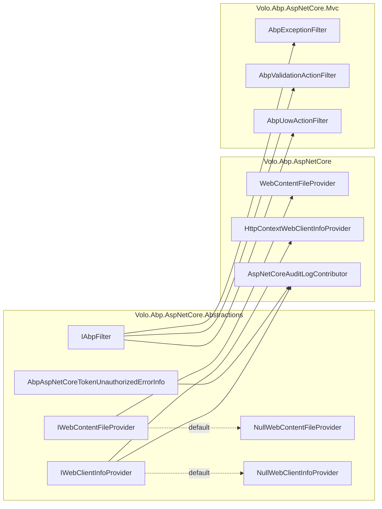

`Volo.Abp.AspNetCore.Abstractions` is the smallest package in the ABP Framework
ASP.NET Core stack. It exists to give higher layers — and your own libraries —
a stable surface they can program against without pulling in Kestrel, MVC or
any of the heavier ASP.NET Core packages. This page walks every public type in
the package, in order, and explains how the rest of the stack overrides each
seam.

The package's project file lives at
`framework/src/Volo.Abp.AspNetCore.Abstractions/`, and every file documented
below is under `Volo/Abp/AspNetCore/`. The module class is
`AbpAspNetCoreAbstractionsModule`. Everything in this package is either an
interface, a marker, a null implementation or a DI module — no concrete
business logic.

## Module entry point

`framework/src/Volo.Abp.AspNetCore.Abstractions/Volo/Abp/AspNetCore/AbpAspNetCoreAbstractionsModule.cs`
is the package's only `AbpModule`. It registers the two `Null*` placeholders
that the runtime layer (see
[`Volo.Abp.AspNetCore`](/aspnetcore/aspnetcore-core)) later replaces:

```csharp
public class AbpAspNetCoreAbstractionsModule : AbpModule
{
    public override void ConfigureServices(ServiceConfigurationContext context)
    {
        context.Services.AddSingleton<IWebContentFileProvider, NullWebContentFileProvider>();
        context.Services.AddSingleton<IWebClientInfoProvider, NullWebClientInfoProvider>();;
    }
}
```

<Note>
Because both registrations use `AddSingleton<TService, TImpl>`, ABP's
conventional registrar replaces them when a later module — for example
`AbpAspNetCoreModule` — registers a different concrete type for the same
interface. The "Null" implementations therefore act as a safe default for
unit tests and headless hosts.
</Note>

This module does **not** have a `[DependsOn]` attribute on any ASP.NET Core
runtime module, which is precisely the point: it is referenceable from any
project (a class library, a console app, a Blazor WebAssembly client) without
forcing an ASP.NET Core runtime. That makes the contracts in this package
safe to share between server and HTTP-client projects, the same way the
[`Mvc.Contracts`](/aspnetcore/mvc-contracts) package is reused from
remote callers.

## Marker interface: `IAbpFilter`

`framework/src/Volo.Abp.AspNetCore.Abstractions/Volo/Abp/AspNetCore/Filters/IAbpFilter.cs`
defines a single empty marker:

```csharp
namespace Volo.Abp.AspNetCore.Filters;

public interface IAbpFilter
{

}
```

Every ABP-authored MVC filter implements `IAbpFilter` next to the relevant
MVC interface (`IAsyncActionFilter`, `IAsyncExceptionFilter`, …). The
`Volo.Abp.AspNetCore.Mvc` package adds a `FactoryFilterProvider` ordering and
exception-filter handling that branches on whether the filter is "ours" —
that branch is just `filter is IAbpFilter`. Concrete examples
(documented on the [MVC page](/aspnetcore/mvc)) include:

| Filter | File |
| --- | --- |
| `AbpExceptionFilter` | `framework/src/Volo.Abp.AspNetCore.Mvc/Volo/Abp/AspNetCore/Mvc/ExceptionHandling/AbpExceptionFilter.cs` |
| `AbpValidationActionFilter` | `framework/src/Volo.Abp.AspNetCore.Mvc/Volo/Abp/AspNetCore/Mvc/Validation/AbpValidationActionFilter.cs` |
| `AbpUowActionFilter` | `framework/src/Volo.Abp.AspNetCore.Mvc/Volo/Abp/AspNetCore/Mvc/Uow/AbpUowActionFilter.cs` |
| `AbpAuditActionFilter` | `framework/src/Volo.Abp.AspNetCore.Mvc/Volo/Abp/AspNetCore/Mvc/Auditing/AbpAuditActionFilter.cs` |
| `AbpFeatureActionFilter` | `framework/src/Volo.Abp.AspNetCore.Mvc/Volo/Abp/AspNetCore/Mvc/Features/AbpFeatureActionFilter.cs` |

If you write your own filter and want it to participate in ABP's framework
behaviours, implement `IAbpFilter` as well.

## Web content file provider seam

ABP's virtual file system (covered in
[`/infrastructure/virtual-file-system`](/infrastructure/virtual-file-system) on
the broader docs site) is the mechanism that ships JavaScript, CSS, images and
Razor views as embedded resources inside module DLLs. To make those embedded
files available to ASP.NET Core's static-file middleware, ABP composes a
`CompositeFileProvider` over `WebRootFileProvider` and an
`IWebContentFileProvider`. This interface is defined in
`framework/src/Volo.Abp.AspNetCore.Abstractions/Volo/Abp/AspNetCore/VirtualFileSystem/IWebContentFileProvider.cs`:

```csharp
public interface IWebContentFileProvider : IFileProvider
{

}
```

Just a marker over `Microsoft.Extensions.FileProviders.IFileProvider`. The
default in this package is `NullWebContentFileProvider`, defined alongside it:

```csharp
public class NullWebContentFileProvider : IWebContentFileProvider
{
    public virtual IFileInfo GetFileInfo(string subpath)
        => new NotFoundFileInfo(subpath);

    public virtual IDirectoryContents GetDirectoryContents(string subpath)
        => new NotFoundDirectoryContents();

    public virtual IChangeToken Watch(string filter)
        => NullChangeToken.Singleton;
}
```

`Volo.Abp.AspNetCore` registers `WebContentFileProvider` (under
`framework/src/Volo.Abp.AspNetCore/Volo/Abp/AspNetCore/VirtualFileSystem/WebContentFileProvider.cs`)
which adapts an `IVirtualFileProvider` to `IWebContentFileProvider`. In
`AbpAspNetCoreModule.OnApplicationInitialization` the WebHost's
`WebRootFileProvider` is rewritten:

```csharp
environment.WebRootFileProvider =
    new CompositeFileProvider(
        context.GetEnvironment().WebRootFileProvider,
        context.ServiceProvider.GetRequiredService<IWebContentFileProvider>()
    );
```

Because the `Null*` registration happens in this package, a test harness that
*only* references `Volo.Abp.AspNetCore.Abstractions` can still resolve
`IWebContentFileProvider` — it just won't have anything to serve.

## Client info seam

`framework/src/Volo.Abp.AspNetCore.Abstractions/Volo/Abp/AspNetCore/WebClientInfo/IWebClientInfoProvider.cs`
abstracts the three pieces of information ABP's auditing, security log and
identity infrastructure use to describe the calling client:

```csharp
public interface IWebClientInfoProvider
{
    string? BrowserInfo { get; }

    string? ClientIpAddress { get; }

    string? DeviceInfo { get; }
}
```

The default `NullWebClientInfoProvider` returns `null` for all three — useful
when there is no `HttpContext` (background workers, integration tests). In the
runtime package, `HttpContextWebClientInfoProvider` (declared at
`framework/src/Volo.Abp.AspNetCore/Volo/Abp/AspNetCore/WebClientInfo/HttpContextWebClientInfoProvider.cs`)
takes over: it reads `User-Agent`, parses it with
`MyCSharp.HttpUserAgentParser` and walks `X-Forwarded-For` to get the IP.

| Consumer | What it does with the provider |
| --- | --- |
| `AspNetCoreAuditLogContributor` (in `Volo.Abp.AspNetCore`) | Stores `BrowserInfo`, `ClientIpAddress` on every `AuditLogInfo`. |
| `AspNetCoreSecurityLogManager` | Same fields go onto every `SecurityLog` entry. |
| `IdentityUserLoginInfo` and friends (Account module) | Capture browser/IP when a login event is recorded. |

Because the abstraction lives in this package, a non-ASP.NET Core consumer —
for example a hosted worker that wants to log an audit entry — can take an
`IWebClientInfoProvider` dependency, get `NullWebClientInfoProvider`, and
record a sensible "unknown" instead of failing.

## Authentication error info DTO

`framework/src/Volo.Abp.AspNetCore.Abstractions/Volo/Abp/AspNetCore/Authentication/AbpAspNetCoreTokenUnauthorizedErrorInfo.cs`
is a scoped DTO used to surface OAuth/OIDC error details from middleware into
exception filters and views:

```csharp
public class AbpAspNetCoreTokenUnauthorizedErrorInfo : IScopedDependency
{
    public string? Error { get; set; }

    public string? ErrorDescription { get; set; }

    public string? ErrorUri { get; set; }
}
```

It mirrors the three RFC 6750 fields a bearer-token rejection conveys via the
`WWW-Authenticate` response header (`error`, `error_description`, `error_uri`).
The companion middleware that *populates* this DTO lives in the
`Volo.Abp.AspNetCore.Authentication.JwtBearer` package; the seam is here in
Abstractions so that any handler downstream of the token middleware — for
example `DefaultAbpAuthorizationExceptionHandler`, see
[`/security/authorization`](/security/authorization) — can read those fields
without taking a JWT-Bearer reference.

The class is registered via `IScopedDependency`, which is the
`Volo.Abp.DependencyInjection` marker for `services.AddScoped`. Each HTTP
request gets a fresh, mutable instance.

## File-by-file walk

The package is small enough to enumerate file by file. The table below maps
every `.cs` file (excluding obvious project metadata) to its purpose.

| File | Public type(s) | Role |
| --- | --- | --- |
| `AbpAspNetCoreAbstractionsModule.cs` | `AbpAspNetCoreAbstractionsModule` | DI module; registers the two `Null*` defaults. |
| `Authentication/AbpAspNetCoreTokenUnauthorizedErrorInfo.cs` | `AbpAspNetCoreTokenUnauthorizedErrorInfo` | Scoped DTO carrying OAuth/OIDC unauthorized fields. |
| `Filters/IAbpFilter.cs` | `IAbpFilter` | Marker for ABP-authored MVC filters. |
| `VirtualFileSystem/IWebContentFileProvider.cs` | `IWebContentFileProvider` | `IFileProvider` seam composed into `WebRootFileProvider`. |
| `VirtualFileSystem/NullWebContentFileProvider.cs` | `NullWebContentFileProvider` | No-op default. |
| `WebClientInfo/IWebClientInfoProvider.cs` | `IWebClientInfoProvider` | Audit / security-log client metadata. |
| `WebClientInfo/NullWebClientInfoProvider.cs` | `NullWebClientInfoProvider` | No-op default. |

That is the entire package. The full subtree is reproduced below to make the
small surface area concrete:

```text
framework/src/Volo.Abp.AspNetCore.Abstractions/
└── Volo/Abp/AspNetCore/
    ├── AbpAspNetCoreAbstractionsModule.cs
    ├── Authentication/
    │   └── AbpAspNetCoreTokenUnauthorizedErrorInfo.cs
    ├── Filters/
    │   └── IAbpFilter.cs
    ├── VirtualFileSystem/
    │   ├── IWebContentFileProvider.cs
    │   └── NullWebContentFileProvider.cs
    └── WebClientInfo/
        ├── IWebClientInfoProvider.cs
        └── NullWebClientInfoProvider.cs
```

## How higher modules replace the defaults

The diagram below traces how each abstraction in this package is overridden
by the runtime package. The arrows are concrete `services.Add*` calls.



`AspNetCoreAuditLogContributor` consumes the same `IWebClientInfoProvider`
interface that the audit module uses elsewhere — this is what lets the
auditing module log browser and IP information without depending on
ASP.NET Core directly.

## When to depend on this package

Reference `Volo.Abp.AspNetCore.Abstractions` (and not `Volo.Abp.AspNetCore`)
when:

- You are writing a **library** that contributes filters, services or
  configuration that need to play nicely with ABP but must remain hostable
  outside an ASP.NET Core process (for example, an integration-test
  harness, a Blazor WebAssembly project, a console worker).
- You want to **share** an `IWebClientInfoProvider` registration between an
  ASP.NET Core server and a non-server process.
- You are **mocking** ABP infrastructure in a unit test and need just enough
  surface for ABP's auditing / security pipeline to run.

Reference the larger `Volo.Abp.AspNetCore` package (covered on the next
page) whenever you actually need middleware, the request pipeline or any of
the option types listed on [the core page](/aspnetcore/aspnetcore-core).

## Cross-references

The seams introduced here are picked up across the ABP codebase. The most
important neighbouring pages are:

- [ASP.NET Core core middleware](/aspnetcore/aspnetcore-core) — concrete
  overrides of `IWebContentFileProvider` and `IWebClientInfoProvider`, plus
  the `AbpExceptionHandlingMiddleware` that reads
  `AbpAspNetCoreTokenUnauthorizedErrorInfo`.
- [MVC integration](/aspnetcore/mvc) — every filter implements `IAbpFilter`;
  ordering depends on this marker.
- [Authorization](/security/authorization) — owns
  `IAbpAuthorizationExceptionHandler` which reads
  `AbpAspNetCoreTokenUnauthorizedErrorInfo` to render token errors as 401/403
  responses.
- [ASP.NET Core multi-tenancy](/multi-tenancy/aspnetcore-multitenancy) —
  ships its own middleware but reuses `IWebClientInfoProvider` for tenant
  resolver auditing.
- [App bootstrap](/core/abp-application-and-bootstrap) — the ABP module
  pipeline that instantiates this module first when an ASP.NET Core host
  starts.
- [HTTP module overview](/http/overview) — explains how DTO contracts share
  the same "abstractions-only" treatment for the same reason this package
  exists.

## Summary

`Volo.Abp.AspNetCore.Abstractions` is intentionally tiny: one module class,
one marker interface, two file-provider types, two web-client-info types,
one DTO. Together they form the bottom of the dependency graph for ABP's
ASP.NET Core integration and make the rest of the stack swappable. The next
page, [ASP.NET Core core middleware](/aspnetcore/aspnetcore-core), takes the
overrides and builds the middleware pipeline on top.
