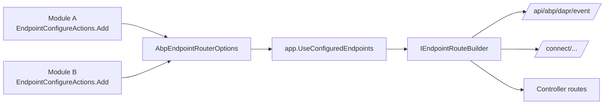
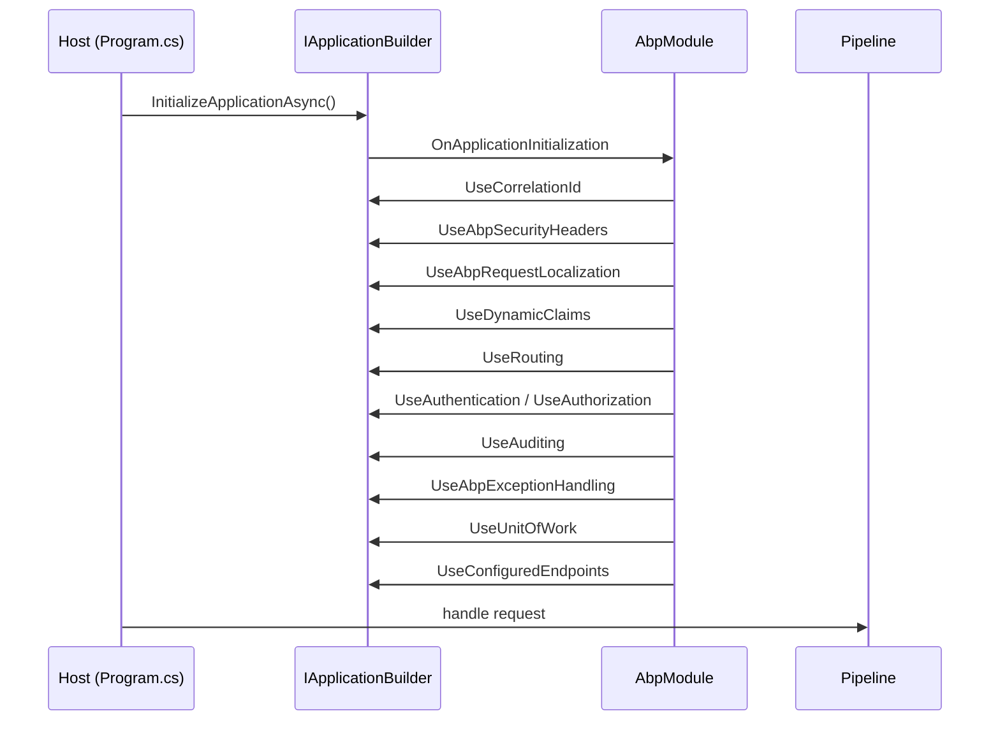

`Volo.Abp.AspNetCore` is the package that turns the abstractions documented on
[the previous page](/aspnetcore/aspnetcore-abstractions) into a working
middleware pipeline for any ASP.NET Core host built on the ABP Framework. It
contributes the module entry point, every framework-managed middleware
component, the option types that control them, and a set of
`IApplicationBuilder.Use…` extension methods. This page walks the package in
the same order you would meet it in a request: registration → options →
middleware → endpoint configuration.

The package's project root is
`framework/src/Volo.Abp.AspNetCore/`. Apart from a handful of helpers, every
type lives under one of three namespaces: `Microsoft.AspNetCore.*` (extension
methods that augment ASP.NET Core types), `Volo.Abp.AspNetCore.*` (ABP types)
and `Microsoft.Extensions.DependencyInjection` (service-collection helpers).

## Module entry point

`framework/src/Volo.Abp.AspNetCore/Volo/Abp/AspNetCore/AbpAspNetCoreModule.cs`
is the package's `AbpModule`. Its `[DependsOn]` graph is the canonical list
of "modules every ASP.NET Core ABP host inherits":

```csharp
[DependsOn(
    typeof(AbpAuditingModule),
    typeof(AbpSecurityModule),
    typeof(AbpVirtualFileSystemModule),
    typeof(AbpUnitOfWorkModule),
    typeof(AbpHttpModule),
    typeof(AbpAuthorizationModule),
    typeof(AbpValidationModule),
    typeof(AbpExceptionHandlingModule),
    typeof(AbpAspNetCoreAbstractionsModule)
    )]
public class AbpAspNetCoreModule : AbpModule
{
    public override void PreConfigureServices(ServiceConfigurationContext context)
    {
        var abpHostEnvironment = context.Services.GetSingletonInstance<IAbpHostEnvironment>();
        if (abpHostEnvironment.EnvironmentName.IsNullOrWhiteSpace())
        {
            abpHostEnvironment.EnvironmentName = context.Services.GetHostingEnvironment().EnvironmentName;
        }
    }

    public override void ConfigureServices(ServiceConfigurationContext context)
    {
        context.Services.AddAuthorization();
        Configure<AbpAuditingOptions>(options =>
        {
            options.Contributors.Add(new AspNetCoreAuditLogContributor());
        });
        Configure<StaticFileOptions>(options =>
        {
            options.ContentTypeProvider = context.Services.GetRequiredService<AbpFileExtensionContentTypeProvider>();
        });
        AddAspNetServices(context.Services);
        context.Services.AddObjectAccessor<IApplicationBuilder>();
        context.Services.AddObjectAccessor<WebApplication>();
        context.Services.AddObjectAccessor<IHost>();
        context.Services.AddObjectAccessor<IEndpointRouteBuilder>();
        context.Services.AddAbpDynamicOptions<RequestLocalizationOptions, AbpRequestLocalizationOptionsManager>();
        StaticWebAssetsLoader.UseStaticWebAssets(context.Services.GetHostingEnvironment(), context.Services.GetConfiguration());
        context.Services.AddHttpUserAgentCachedParser();
    }
}
```

Two patterns to notice:

1. **`ObjectAccessor<T>`** — ABP registers four placeholders
   (`IApplicationBuilder`, `WebApplication`, `IHost`, `IEndpointRouteBuilder`).
   They are filled later when `InitializeApplicationAsync` runs. That call
   is the bridge between ABP's module lifecycle and ASP.NET Core's startup;
   see [`/core/abp-application-and-bootstrap`](/core/abp-application-and-bootstrap)
   for the full bootstrap sequence.
2. **`AspNetCoreAuditLogContributor`** is added to `AbpAuditingOptions` so every
   audit log entry produced anywhere in the application gets the
   `HttpContext`-derived browser, IP, URL and HTTP method automatically.

`OnApplicationInitialization` then rewires the static-file pipeline:

```csharp
environment.WebRootFileProvider =
    new CompositeFileProvider(
        context.GetEnvironment().WebRootFileProvider,
        context.ServiceProvider.GetRequiredService<IWebContentFileProvider>()
    );
```

`IWebContentFileProvider` is the seam introduced in
[Abstractions](/aspnetcore/aspnetcore-abstractions).

## Middleware base type

All ABP middleware components derive from
`framework/src/Volo.Abp.AspNetCore/Volo/Abp/AspNetCore/Middleware/AbpMiddlewareBase.cs`:

```csharp
public abstract class AbpMiddlewareBase : IMiddleware
{
    protected virtual Task<bool> ShouldSkipAsync(HttpContext context, RequestDelegate next)
    {
        var endpoint = context.GetEndpoint();
        var controllerActionDescriptor = endpoint?.Metadata.GetMetadata<ControllerActionDescriptor>();
        var disableAbpFeaturesAttribute = controllerActionDescriptor?.ControllerTypeInfo.GetCustomAttribute<DisableAbpFeaturesAttribute>();
        return Task.FromResult(disableAbpFeaturesAttribute != null && disableAbpFeaturesAttribute.DisableMiddleware);
    }

    public abstract Task InvokeAsync(HttpContext context, RequestDelegate next);
}
```

Two consequences: ABP middleware is **factory-resolved** (`IMiddleware`,
scoped lifetime per request), and any controller decorated with
`[DisableAbpFeatures(DisableMiddleware = true)]` opts out of *every* ABP
middleware in one place.

## The middleware family

Each component is registered via an extension method on
`AbpApplicationBuilderExtensions`
(`framework/src/Volo.Abp.AspNetCore/Microsoft/AspNetCore/Builder/AbpApplicationBuilderExtensions.cs`).
The table maps the recommended startup ordering, the middleware class, and
the file it lives in.

| Order | `app.Use…` method | Middleware class | Source file |
| --- | --- | --- | --- |
| 1 | `UseCorrelationId` | `AbpCorrelationIdMiddleware` | `Volo/Abp/AspNetCore/Tracing/AbpCorrelationIdMiddleware.cs` |
| 2 | `UseAbpSecurityHeaders` | `AbpSecurityHeadersMiddleware` | `Volo/Abp/AspNetCore/Security/AbpSecurityHeadersMiddleware.cs` |
| 3 | `UseAbpRequestLocalization` | `AbpRequestLocalizationMiddleware` | `Microsoft/AspNetCore/RequestLocalization/AbpRequestLocalizationMiddleware.cs` |
| 4 | `UseDynamicClaims` | `AbpDynamicClaimsMiddleware` | `Volo/Abp/AspNetCore/Security/Claims/AbpDynamicClaimsMiddleware.cs` |
| 5 | `UseAbpExceptionHandling` | `AbpExceptionHandlingMiddleware` | `Volo/Abp/AspNetCore/ExceptionHandling/AbpExceptionHandlingMiddleware.cs` |
| 6 | `UseUnitOfWork` | `AbpUnitOfWorkMiddleware` (preceded by exception handling) | `Volo/Abp/AspNetCore/Uow/AbpUnitOfWorkMiddleware.cs` |
| 7 | `UseAuditing` | `AbpAuditingMiddleware` | `Volo/Abp/AspNetCore/Auditing/AbpAuditingMiddleware.cs` |

### `AbpCorrelationIdMiddleware`

Reads a configurable header (default `X-Correlation-Id`), assigns a new
`Guid.NewGuid().ToString("N")` if absent, pushes it through
`ICorrelationIdProvider.Change` and copies it back on response:

```csharp
public async override Task InvokeAsync(HttpContext context, RequestDelegate next)
{
    var correlationId = GetCorrelationIdFromRequest(context);
    using (_correlationIdProvider.Change(correlationId))
    {
        CheckAndSetCorrelationIdOnResponse(context, _options, correlationId);
        await next(context);
    }
}
```

The provider lives in the broader `Volo.Abp.Tracing` module and is reused
in distributed scenarios — see
[`/aspnetcore/mvc-dapr`](/aspnetcore/mvc-dapr) where Dapr events carry the
correlation ID through pub/sub.

### `AbpSecurityHeadersMiddleware`

Configurable through
`framework/src/Volo.Abp.AspNetCore/Volo/Abp/AspNetCore/Security/AbpSecurityHeadersOptions.cs`:

```csharp
public class AbpSecurityHeadersOptions
{
    public bool UseContentSecurityPolicyHeader { get; set; }
    public bool UseContentSecurityPolicyScriptNonce { get; set; }
    public string? ContentSecurityPolicyValue { get; set; }
    public Dictionary<string, string> Headers { get; }
    public List<Func<HttpContext, Task<bool>>> IgnoredScriptNonceSelectors { get; }
    public List<string> IgnoredScriptNoncePaths { get; }
}
```

The middleware appends `X-Content-Type-Options: nosniff`,
`X-XSS-Protection: 1; mode=block`, `X-Frame-Options: SAMEORIGIN`, and (when
enabled) a CSP header with optional nonce that Razor views can read via
`AbpSecurityHeaderNonceHelper`. The `[IgnoreAbpSecurityHeader]` attribute
opts an endpoint out.

### `AbpRequestLocalizationMiddleware`

Wraps ASP.NET Core's stock `RequestLocalizationMiddleware` but defers
`RequestLocalizationOptions` to
`IAbpRequestLocalizationOptionsProvider.GetLocalizationOptionsAsync()`:

```csharp
var middleware = new RequestLocalizationMiddleware(
    next,
    new OptionsWrapper<RequestLocalizationOptions>(
        await _requestLocalizationOptionsProvider.GetLocalizationOptionsAsync()
    ),
    _loggerFactory
);
```

The provider is itself driven by
`AbpRequestLocalizationOptions.RequestLocalizationOptionConfigurators`, a
list of `Func<IServiceProvider, RequestLocalizationOptions, Task>` callbacks
modules can append from `ConfigureServices`. The middleware also sets the
culture cookie via `AbpRequestCultureCookieHelper.SetCultureCookie` whenever
the request culture comes from the query string, so an
`?culture=tr` parameter persists on subsequent requests.

### `AbpDynamicClaimsMiddleware`

Lives at
`framework/src/Volo.Abp.AspNetCore/Volo/Abp/AspNetCore/Security/Claims/AbpDynamicClaimsMiddleware.cs`.
It refreshes claims from `IAbpClaimsPrincipalContributor` implementations on
every request, supporting "dynamic" roles, tenant, impersonation and the
`RemoteDynamicClaimsPrincipalContributor` documented on the
[Client page](/aspnetcore/mvc-client). The legacy
`AbpClaimsMapMiddleware` and its
`AbpClaimsMapOptions` (preset with the OIDC standard claim aliases — `sub →
AbpClaimTypes.UserId`, `role → AbpClaimTypes.Role`, …) are still shipped for
back-compatibility but new code should use
`services.TransformAbpClaims(...)` instead. The `[Obsolete]` attribute on
the older `UseAbpClaimsMap` extension method records this.

### `AbpExceptionHandlingMiddleware`

The flagship error-shape converter:

```csharp
public async override Task InvokeAsync(HttpContext context, RequestDelegate next)
{
    try { await next(context); }
    catch (Exception ex)
    {
        if (context.Response.HasStarted)
        {
            _logger.LogWarning("An exception occurred, but response has already started!");
            throw;
        }

        if (context.Items["_AbpActionInfo"] is AbpActionInfoInHttpContext actionInfo)
        {
            if (actionInfo.IsObjectResult)
            {
                await HandleAndWrapException(context, ex);
                return;
            }
        }
        throw;
    }
}
```

Notes:

- The middleware looks for `_AbpActionInfo` in `HttpContext.Items` — that key
  is populated by `AbpUowActionFilter` (covered on the
  [MVC page](/aspnetcore/mvc)) and carries
  `AbpActionInfoInHttpContext.IsObjectResult`. The middleware only takes over
  for `ObjectResult`-shaped actions; HTML responses are left to ASP.NET Core.
- `HandleAndWrapException` delegates `AbpAuthorizationException` to
  `IAbpAuthorizationExceptionHandler`. The default implementation,
  `DefaultAbpAuthorizationExceptionHandler`, uses
  `AbpAuthorizationExceptionHandlerOptions.AuthenticationScheme` to decide
  whether to call `HttpContext.ChallengeAsync` (interactive) or write a JSON
  error (API). For non-authorization exceptions it writes a
  `RemoteServiceErrorResponse` JSON envelope:

```csharp
await httpContext.Response.WriteAsync(
    jsonSerializer.Serialize(
        new RemoteServiceErrorResponse(
            errorInfoConverter.Convert(exception, options =>
            {
                options.SendExceptionsDetailsToClients = exceptionHandlingOptions.SendExceptionsDetailsToClients;
                options.SendStackTraceToClients = exceptionHandlingOptions.SendStackTraceToClients;
                options.SendExceptionDataToClientTypes = exceptionHandlingOptions.SendExceptionDataToClientTypes;
            })
        )
    )
);
```

The `AbpHttpConsts.AbpErrorFormat` header is set to `"true"`, which is the
signal the [HTTP client module](/http/overview) reads on the receiving side
to deserialize the error envelope into a thrown `AbpRemoteCallException`.

The `IHttpExceptionStatusCodeFinder` it consults is configurable via
`AbpExceptionHttpStatusCodeOptions`:

```csharp
public class AbpExceptionHttpStatusCodeOptions
{
    public IDictionary<string, HttpStatusCode> ErrorCodeToHttpStatusCodeMappings { get; }
    public void Map(string errorCode, HttpStatusCode httpStatusCode) =>
        ErrorCodeToHttpStatusCodeMappings[errorCode] = httpStatusCode;
}
```

So you can map a domain error code such as
`"MyShop:OrderAlreadyPlaced"` to `HttpStatusCode.Conflict` from any module.

### `AbpUnitOfWorkMiddleware`

`framework/src/Volo.Abp.AspNetCore/Volo/Abp/AspNetCore/Uow/AbpUnitOfWorkMiddleware.cs`:

```csharp
public async override Task InvokeAsync(HttpContext context, RequestDelegate next)
{
    if (await ShouldSkipAsync(context, next) || IsIgnoredUrl(context))
    {
        await next(context);
        return;
    }

    using (var uow = _unitOfWorkManager.Reserve(UnitOfWork.UnitOfWorkReservationName))
    {
        await next(context);
        await uow.CompleteAsync(_cancellationTokenProvider.Token);
    }
}
```

The middleware **reserves** a unit of work but does not begin a transaction.
The MVC action filter `AbpUowActionFilter` then *binds* that reservation
with options derived from the action's `[UnitOfWork]` attribute and the
HTTP method (`GET` defaults to non-transactional).

`AbpUnitOfWorkMiddleware.ShouldSkipAsync` also bails out for endpoints whose
metadata carries `RootComponentMetadata` — i.e. Blazor render trees. The
comment in the source explains why:

```csharp
// Blazor components will render concurrently, so we need to skip the middleware for them.
// Otherwise, We will get the following exception:
// A second operation started on this context before a previous operation completed.
```

`AbpAspNetCoreUnitOfWorkOptions.IgnoredUrls` lets you exclude URL prefixes
entirely:

```csharp
public class AbpAspNetCoreUnitOfWorkOptions
{
    public List<string> IgnoredUrls { get; } = new List<string>();
}
```

### `AbpAuditingMiddleware`

Begins an `IAuditingManager` scope around the request and only saves the
log if the action did not have its own [`AbpAuditActionFilter`](/aspnetcore/mvc)
record one. The middleware is what makes auditing work for **non-MVC**
endpoints (Razor Pages, custom endpoint routes, minimal APIs). It honours
`AbpAspNetCoreAuditingOptions.IgnoredUrls`.

## Application initialization

`AbpApplicationBuilderExtensions.InitializeApplicationAsync` is what
ASP.NET Core's `Program.cs` calls during host startup:

```csharp
public async static Task InitializeApplicationAsync([NotNull] this IApplicationBuilder app)
{
    Check.NotNull(app, nameof(app));

    app.ApplicationServices.GetRequiredService<ObjectAccessor<IApplicationBuilder>>().Value = app;
    if (app is WebApplication webApplication)
        app.ApplicationServices.GetRequiredService<ObjectAccessor<WebApplication>>().Value = webApplication;
    if (app is IHost host)
        app.ApplicationServices.GetRequiredService<ObjectAccessor<IHost>>().Value = host;
    if (app is IEndpointRouteBuilder endpointRouteBuilder)
        app.ApplicationServices.GetRequiredService<ObjectAccessor<IEndpointRouteBuilder>>().Value = endpointRouteBuilder;

    var application = app.ApplicationServices.GetRequiredService<IAbpApplicationWithExternalServiceProvider>();
    var applicationLifetime = app.ApplicationServices.GetRequiredService<IHostApplicationLifetime>();

    applicationLifetime.ApplicationStopping.Register(() => AsyncHelper.RunSync(() => application.ShutdownAsync()));
    applicationLifetime.ApplicationStopped.Register(() => application.Dispose());

    await application.InitializeAsync(app.ApplicationServices);
}
```

This is the moment ABP's module pipeline (see
[`/core/abp-application-and-bootstrap`](/core/abp-application-and-bootstrap))
calls `OnApplicationInitialization` on every module — and therefore the
moment when the `Use…` extension methods listed above actually run.

## Endpoint routing — `AbpEndpointRouterOptions`

`framework/src/Volo.Abp.AspNetCore/Microsoft/AspNetCore/Routing/AbpEndpointRouterOptions.cs`
introduces a delegate list that modules append to:

```csharp
public class AbpEndpointRouterOptions
{
    public List<Action<EndpointRouteBuilderContext>> EndpointConfigureActions { get; }

    public AbpEndpointRouterOptions()
    {
        EndpointConfigureActions = new List<Action<EndpointRouteBuilderContext>>();
    }
}
```

Each action receives an `EndpointRouteBuilderContext`:

```csharp
public class EndpointRouteBuilderContext
{
    public IEndpointRouteBuilder Endpoints { get; }
    public IServiceProvider ScopeServiceProvider { get; }
}
```

The host's `app.UseConfiguredEndpoints()` (declared elsewhere in
`AbpApplicationBuilderExtensions`) iterates that list, so modules never have
to reach for `IApplicationBuilder` directly to register a route. Two examples
from the wider ABP codebase:

- [`AbpAspNetCoreMvcDaprEventBusModule`](/aspnetcore/mvc-dapr) appends an
  action that maps `POST /api/abp/dapr/event` plus all
  `TopicAttribute`-driven subscriptions.
- The OpenIddict server module appends the well-known discovery endpoint
  in exactly the same way.



## Other option types in this package

| Option type | File | Used by |
| --- | --- | --- |
| `AbpAspNetCoreUnitOfWorkOptions` | `Volo/Abp/AspNetCore/Uow/AbpAspNetCoreUnitOfWorkOptions.cs` | `AbpUnitOfWorkMiddleware` |
| `AbpAspNetCoreAuditingOptions` | `Volo/Abp/AspNetCore/Auditing/AbpAspNetCoreAuditingOptions.cs` | `AbpAuditingMiddleware` |
| `AbpAspNetCoreAuditingUrlOptions` | `Volo/Abp/AspNetCore/Auditing/AbpAspNetCoreAuditingUrlOptions.cs` | URL-shaping for audit entries |
| `AbpSecurityHeadersOptions` | `Volo/Abp/AspNetCore/Security/AbpSecurityHeadersOptions.cs` | `AbpSecurityHeadersMiddleware` |
| `AbpClaimsMapOptions` | `Volo/Abp/AspNetCore/Security/Claims/AbpClaimsMapOptions.cs` | Legacy `AbpClaimsMapMiddleware` |
| `AbpExceptionHttpStatusCodeOptions` | `Volo/Abp/AspNetCore/ExceptionHandling/AbpExceptionHttpStatusCodeOptions.cs` | `DefaultHttpExceptionStatusCodeFinder` |
| `AbpAuthorizationExceptionHandlerOptions` | `Volo/Abp/AspNetCore/ExceptionHandling/AbpAuthorizationExceptionHandlerOptions.cs` | `DefaultAbpAuthorizationExceptionHandler` |
| `AbpAspNetCoreContentOptions` | `Volo/Abp/AspNetCore/VirtualFileSystem/AbpAspNetCoreContentOptions.cs` | `WebContentFileProvider`, MIME map for `AbpFileExtensionContentTypeProvider` |
| `AbpRequestLocalizationOptions` | `Microsoft/AspNetCore/RequestLocalization/AbpRequestLocalizationOptions.cs` | `IAbpRequestLocalizationOptionsProvider` |
| `AspNetCoreUnitOfWorkTransactionBehaviourProviderOptions` | `Volo/Abp/AspNetCore/Uow/AspNetCoreUnitOfWorkTransactionBehaviourProviderOptions.cs` | UoW transactional decision |
| `AbpEndpointRouterOptions` | `Microsoft/AspNetCore/Routing/AbpEndpointRouterOptions.cs` | `UseConfiguredEndpoints` |

The `AbpAspNetCoreContentOptions` class is interesting: it ships a 600-entry
filename-extension-to-MIME-type dictionary used by
`AbpFileExtensionContentTypeProvider`. Module authors typically just append
to `AllowedExtraWebContentFolders` to expose extra static-asset folders
through `MapAbpStaticAssets` (declared on
`AbpApplicationBuilderExtensions`).

## Other extension methods worth knowing

`AbpApplicationBuilderExtensions` exposes more than the middleware
wire-up. The most useful are:

- **`UseStaticFilesForPatterns(string[] patterns, IFileProvider? provider)`** —
  serves only files matching glob patterns from a file provider, layered over
  `AbpStaticFileProvider`. Good for exposing `appsettings*.json` to a
  diagnostics page without exposing the whole content root.
- **`UseVirtualStaticFiles()` / `UseVirtualStaticFiles(string folder)`** — the
  pipeline that serves embedded resources via
  `WebContentFileProvider`. The `IVirtualFileProvider` infrastructure is the
  same one used by Razor compilation; see
  `framework/src/Volo.Abp.AspNetCore/Volo/Abp/AspNetCore/VirtualFileSystem/WebContentFileProvider.cs`.
- **`MapAbpStaticAssets(...)`** — bridges
  `MapStaticAssets` (the .NET 9 static-assets endpoint) with ABP's virtual
  filesystem. Implementation excerpt:

```csharp
public static StaticAssetsEndpointConventionBuilder MapAbpStaticAssets(this IApplicationBuilder app, string? staticAssetsManifestPath = null)
{
    if (app is not IEndpointRouteBuilder endpoints)
        throw new AbpException("The app(IApplicationBuilder) is not an IEndpointRouteBuilder.");

    var options = app.ApplicationServices.GetRequiredService<IOptions<AbpAspNetCoreContentOptions>>().Value;
    foreach (var folder in options.AllowedExtraWebContentFolders)
        app.UseVirtualStaticFiles(folder);

    app.UseVirtualStaticFiles();

    return endpoints.MapStaticAssets(staticAssetsManifestPath);
}
```

## Putting it together: pipeline cheat-sheet



`UseAbpExceptionHandling` is intentionally inside `UseUnitOfWork` (the latter
calls the former), so that a failed UoW propagates *out* of the exception
middleware as a regular `AbpException`, but `IAuditingManager` is still able
to record the failure thanks to `UseAuditing` sitting one layer further out.

## Auxiliary infrastructure

A few smaller types in the package are worth knowing about:

- **`AbpActionInfoInHttpContext`** (`Volo/Abp/AspNetCore/AbpActionInfoInHttpContext.cs`)
  — the single-field DTO stashed under `HttpContext.Items["_AbpActionInfo"]`
  by `AbpUowActionFilter` and read by `AbpExceptionHandlingMiddleware`.
- **`ReplaceControllersAttribute`** (`Volo/Abp/AspNetCore/Controllers/ReplaceControllersAttribute.cs`)
  — module-level metadata that lets a derived controller replace a base
  one when the [MVC application part sorter](/aspnetcore/mvc) discovers
  duplicate routes.
- **`HttpContextClientScopeServiceProviderAccessor`** — bridges
  `IClientScopeServiceProviderAccessor` to `HttpContext.RequestServices`, so
  scoped services resolved via `IServiceProviderAccessor` honour the request
  scope.
- **`AbpStaticFileProvider`** — wraps a `PhysicalFileProvider` with allow-list
  filename patterns.
- **`AbpFileExtensionContentTypeProvider`** — merges
  `AbpAspNetCoreContentOptions.ContentTypeMaps` into ASP.NET Core's stock
  provider so the framework recognises ABP-specific extensions
  (`.lib` plugins, `.abpcontent` etc).
- **`HttpContextCancellationTokenProvider`** — exposes
  `HttpContext.RequestAborted` to `ICancellationTokenProvider`, which is what
  `AbpUowActionFilter` passes to `uow.CompleteAsync`.

## Cross-references

- [Abstractions package](/aspnetcore/aspnetcore-abstractions) — the interfaces
  this package overrides.
- [MVC integration](/aspnetcore/mvc) — the action filters that complement the
  middleware described here.
- [App bootstrap](/core/abp-application-and-bootstrap) — what
  `InitializeApplicationAsync` actually triggers in the module system.
- [ASP.NET Core multi-tenancy](/multi-tenancy/aspnetcore-multitenancy) —
  `MultiTenancyMiddleware` slots into the same pipeline.
- [Authorization](/security/authorization) — owner of
  `IAbpAuthorizationExceptionHandler` and `AbpAuthorizationException` consumed
  by the exception middleware.
- [HTTP overview](/http/overview) — the consumer of the
  `AbpHttpConsts.AbpErrorFormat` header set by this middleware.
- [UI MVC overview](/ui-mvc/overview) — the layer that adds Razor Pages,
  bundling and theming on top of this stack.

## Summary

`Volo.Abp.AspNetCore` is where ABP's framework concerns meet ASP.NET Core's
request pipeline. The seven middleware components — correlation, security
headers, request localization, dynamic claims, exception handling, unit of
work and auditing — combine with `AbpEndpointRouterOptions` and a small set
of option types to form a predictable, override-friendly pipeline. The
following pages — starting with [MVC](/aspnetcore/mvc) — assume this layer is
in place.
