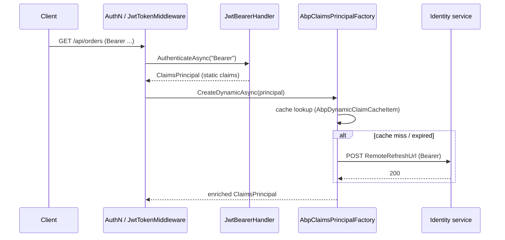

ABP Framework wraps `Microsoft.AspNetCore.Authentication.JwtBearer` with the `Volo.Abp.AspNetCore.Authentication.JwtBearer` package. The wrapper is short on lines but dense in behaviour: `AddAbpJwtBearer` extends the standard `AuthenticationBuilder.AddJwtBearer` to derive the dynamic-claims refresh URL from `JwtBearerOptions.Authority`, chains the existing `OnChallenge` event so that ABP can surface its own `Bearer error="..."` headers, and exposes a `UseJwtTokenMiddleware` that pre-authenticates the principal early in the pipeline. This page maps every file under `framework/src/Volo.Abp.AspNetCore.Authentication.JwtBearer/`, traces a request, and documents the dynamic-claims cache contributor.

## File inventory

| File | Purpose |
| --- | --- |
| `Microsoft/Extensions/DependencyInjection/AbpJwtBearerExtensions.cs` | `AddAbpJwtBearer` overloads. |
| `Microsoft/AspNetCore/Builder/ApplicationBuilderAbpJwtTokenMiddlewareExtension.cs` | `UseJwtTokenMiddleware` early-authenticator. |
| `Volo/Abp/AspNetCore/Authentication/JwtBearer/AbpAspNetCoreAuthenticationJwtBearerModule.cs` | Module. Registers HTTP client/context, conditionally registers dynamic-claims contributor. |
| `Volo/Abp/AspNetCore/Authentication/JwtBearer/DynamicClaims/WebRemoteDynamicClaimsPrincipalContributor.cs` | Wires the cache base type. |
| `Volo/Abp/AspNetCore/Authentication/JwtBearer/DynamicClaims/WebRemoteDynamicClaimsPrincipalContributorCache.cs` | Posts the access token to the configured `RemoteRefreshUrl`. |
| `Volo/Abp/AspNetCore/Authentication/JwtBearer/DynamicClaims/WebRemoteDynamicClaimsPrincipalContributorOptions.cs` | `IsEnabled` and `AuthenticationScheme` flags. |

## Module: `AbpAspNetCoreAuthenticationJwtBearerModule`

The module depends on `AbpSecurityModule`, `AbpCachingModule`, and `AbpAspNetCoreAbstractionsModule`. It registers an `HttpClient` factory and the standard `IHttpContextAccessor`, then conditionally registers the dynamic-claims contributor only if **both** option flags agree to opt in:

```csharp framework/src/Volo.Abp.AspNetCore.Authentication.JwtBearer/Volo/Abp/AspNetCore/Authentication/JwtBearer/AbpAspNetCoreAuthenticationJwtBearerModule.cs
[DependsOn(typeof(AbpSecurityModule), typeof(AbpCachingModule), typeof(AbpAspNetCoreAbstractionsModule))]
public class AbpAspNetCoreAuthenticationJwtBearerModule : AbpModule
{
    public override void ConfigureServices(ServiceConfigurationContext context)
    {
        context.Services.AddHttpClient();
        context.Services.AddHttpContextAccessor();

        if (context.Services.ExecutePreConfiguredActions<WebRemoteDynamicClaimsPrincipalContributorOptions>().IsEnabled &&
            context.Services.ExecutePreConfiguredActions<AbpClaimsPrincipalFactoryOptions>().IsRemoteRefreshEnabled)
        {
            context.Services.AddTransient<WebRemoteDynamicClaimsPrincipalContributor>();
            context.Services.AddTransient<WebRemoteDynamicClaimsPrincipalContributorCache>();
        }
    }
}
```

The double-flag pattern (`WebRemoteDynamicClaimsPrincipalContributorOptions.IsEnabled` **and** `AbpClaimsPrincipalFactoryOptions.IsRemoteRefreshEnabled`) avoids registering an HTTP client noise when an API tier doesn't need to refresh claims from a remote identity service. Both flags are set through `PreConfigureServices` in your top-level web module.

## `AddAbpJwtBearer` overloads

There are four overloads, all funnelling into the same private body. The most explicit form takes an authentication scheme, a display name, and a configuration callback. The plumbing happens in two passes:

1. Build a temporary `JwtBearerOptions` so the helper can read `Authority` without actually committing it.
2. Configure `AbpClaimsPrincipalFactoryOptions.RemoteRefreshUrl` with the authority root prepended to the existing relative path.
3. Delegate to the real `AddJwtBearer` and post-process the `OnChallenge` event.

```csharp framework/src/Volo.Abp.AspNetCore.Authentication.JwtBearer/Microsoft/Extensions/DependencyInjection/AbpJwtBearerExtensions.cs
public static AuthenticationBuilder AddAbpJwtBearer(this AuthenticationBuilder builder, string authenticationScheme, string displayName, Action<JwtBearerOptions> configureOptions)
{
    builder.Services.Configure<AbpClaimsPrincipalFactoryOptions>(options =>
    {
        var jwtBearerOption = new JwtBearerOptions();
        configureOptions?.Invoke(jwtBearerOption);
        if (!jwtBearerOption.Authority.IsNullOrEmpty())
        {
            options.RemoteRefreshUrl = jwtBearerOption.Authority.RemovePostFix("/") + options.RemoteRefreshUrl;
        }
    });

    return builder.AddJwtBearer(authenticationScheme, displayName, options =>
    {
        configureOptions?.Invoke(options);
        // ...OnChallenge bridging below...
    });
}
```

<Warning>`configureOptions` runs **twice**: once against a throwaway `JwtBearerOptions` for sniffing the `Authority` value, and once for real inside `AddJwtBearer`. Side effects (allocating singletons, mutating shared state) inside that delegate will execute twice. Keep the callback side-effect free; configure other services in a separate `PreConfigureServices` block.</Warning>

### Why prepend the authority?

`AbpClaimsPrincipalFactoryOptions.RemoteRefreshUrl` defaults to a relative path such as `/api/account/refresh-dynamic-claims`. The JWT bearer client lives in a microservice that is **not** the authority, so the contributor cache needs an absolute URL to reach the identity service. Prepending `Authority` makes the assumption that the identity service and the OpenIddict authority share a base URL — which is the standard ABP startup template layout.

## OnChallenge bridge

ABP exception handling can surface a friendly `error` / `error_description` for token failures (for example "Token expired"). The wrapper hooks the existing `OnChallenge` so it runs **first**, then copies any populated `AbpAspNetCoreTokenUnauthorizedErrorInfo` fields into the `JwtBearerChallengeContext`:

```csharp framework/src/Volo.Abp.AspNetCore.Authentication.JwtBearer/Microsoft/Extensions/DependencyInjection/AbpJwtBearerExtensions.cs
options.Events ??= new JwtBearerEvents();
var previousOnChallenge = options.Events.OnChallenge;
options.Events.OnChallenge = async eventContext =>
{
    await previousOnChallenge(eventContext);

    if (eventContext.Handled ||
        !string.IsNullOrEmpty(eventContext.Error) ||
        !string.IsNullOrEmpty(eventContext.ErrorDescription) ||
        !string.IsNullOrEmpty(eventContext.ErrorUri))
    {
        return;
    }

    var tokenUnauthorizedErrorInfo = eventContext.HttpContext.RequestServices.GetRequiredService<AbpAspNetCoreTokenUnauthorizedErrorInfo>();
    if (string.IsNullOrEmpty(tokenUnauthorizedErrorInfo.Error) &&
        string.IsNullOrEmpty(tokenUnauthorizedErrorInfo.ErrorDescription) &&
        string.IsNullOrEmpty(tokenUnauthorizedErrorInfo.ErrorUri))
    {
        return;
    }

    eventContext.Error = tokenUnauthorizedErrorInfo.Error;
    eventContext.ErrorDescription = tokenUnauthorizedErrorInfo.ErrorDescription;
    eventContext.ErrorUri = tokenUnauthorizedErrorInfo.ErrorUri;
};
```

The early-out logic is important: if the user supplied their own `OnChallenge` (or if Microsoft's default already populated an error), ABP **does not** overwrite it. Otherwise it forwards whatever `AbpAspNetCoreTokenUnauthorizedErrorInfo` carries in the request scope.

## `UseJwtTokenMiddleware`

The middleware exists for a niche scenario: the app is mostly cookie-authenticated but a JWT carried in `Authorization` should also light up the principal for cases where authorization middleware has not yet run:

```csharp framework/src/Volo.Abp.AspNetCore.Authentication.JwtBearer/Microsoft/AspNetCore/Builder/ApplicationBuilderAbpJwtTokenMiddlewareExtension.cs
public static IApplicationBuilder UseJwtTokenMiddleware(this IApplicationBuilder app, string schema = JwtBearerDefaults.AuthenticationScheme)
{
    return app.Use(async (ctx, next) =>
    {
        if (ctx.User.Identity?.IsAuthenticated != true)
        {
            var result = await ctx.AuthenticateAsync(schema);
            if (result.Succeeded && result.Principal != null)
            {
                ctx.User = result.Principal;
            }
        }

        await next();
    });
}
```

Two practical notes:

- The middleware checks `ctx.User.Identity?.IsAuthenticated != true` before calling `AuthenticateAsync`, so authenticated cookie users skip the round-trip.
- The default `schema` is `JwtBearerDefaults.AuthenticationScheme` (`"Bearer"`); pass a custom scheme name if your app calls `AddAbpJwtBearer("MyScheme", ...)`.

Place `UseJwtTokenMiddleware` after `UseAuthentication` and before `UseAuthorization` so that policy evaluation sees the populated principal.

## Dynamic-claims refresh

ABP supports server-side "dynamic claims": claims that are not present in the access token because they may change between issuance and validation (roles, permissions, tenant overrides). The JWT bearer module ships two collaborating classes that refresh those claims out-of-band.

### Options

```csharp framework/src/Volo.Abp.AspNetCore.Authentication.JwtBearer/Volo/Abp/AspNetCore/Authentication/JwtBearer/DynamicClaims/WebRemoteDynamicClaimsPrincipalContributorOptions.cs
public class WebRemoteDynamicClaimsPrincipalContributorOptions
{
    public bool IsEnabled { get; set; }

    public string AuthenticationScheme { get; set; }

    public WebRemoteDynamicClaimsPrincipalContributorOptions()
    {
        IsEnabled = false;
        AuthenticationScheme = JwtBearerDefaults.AuthenticationScheme;
    }
}
```

Defaults: disabled. The scheme defaults to `"Bearer"`, but you must override it if you renamed the JWT bearer handler.

### Contributor

The contributor itself is a thin generic shell — the cache base class lives in `Volo.Abp.Security`. The `[DisableConventionalRegistration]` attribute prevents the conventional registrar from finding it twice, since the module registers it explicitly:

```csharp framework/src/Volo.Abp.AspNetCore.Authentication.JwtBearer/Volo/Abp/AspNetCore/Authentication/JwtBearer/DynamicClaims/WebRemoteDynamicClaimsPrincipalContributor.cs
[DisableConventionalRegistration]
public class WebRemoteDynamicClaimsPrincipalContributor : RemoteDynamicClaimsPrincipalContributorBase<WebRemoteDynamicClaimsPrincipalContributor, WebRemoteDynamicClaimsPrincipalContributorCache>
{
}
```

### Cache

`WebRemoteDynamicClaimsPrincipalContributorCache` is the workhorse. It pulls the bearer access token off the request's authentication properties, POSTs it (using `IdentityModel.Client.SetBearerToken`) to the configured `RemoteRefreshUrl`, and lets the response signal that the cache has been invalidated server-side:

```csharp framework/src/Volo.Abp.AspNetCore.Authentication.JwtBearer/Volo/Abp/AspNetCore/Authentication/JwtBearer/DynamicClaims/WebRemoteDynamicClaimsPrincipalContributorCache.cs
protected async override Task RefreshAsync(Guid userId, Guid? tenantId = null)
{
    try
    {
        if (HttpContextAccessor.HttpContext == null)
        {
            throw new AbpException($"Failed to refresh remote claims for user: {userId} - HttpContext is null!");
        }

        var authenticateResult = await HttpContextAccessor.HttpContext.AuthenticateAsync(Options.Value.AuthenticationScheme);
        if (!authenticateResult.Succeeded)
        {
            throw new AbpException($"Failed to refresh remote claims for user: {userId} - authentication failed!");
        }

        var accessToken = authenticateResult.Properties?.GetTokenValue("access_token");
        if (accessToken.IsNullOrWhiteSpace())
        {
            throw new AbpException($"Failed to refresh remote claims for user: {userId} - access_token is null or empty!");
        }

        var client = HttpClientFactory.CreateClient(HttpClientName);
        var requestMessage = new HttpRequestMessage(HttpMethod.Post, AbpClaimsPrincipalFactoryOptions.Value.RemoteRefreshUrl);
        requestMessage.SetBearerToken(accessToken);
        var response = await client.SendAsync(requestMessage);
        response.EnsureSuccessStatusCode();
    }
    catch (Exception e)
    {
        Logger.LogWarning(e, $"Failed to refresh remote claims for user: {userId}");
        throw;
    }
}
```

The cache key — produced by `RemoteDynamicClaimsPrincipalContributorCacheBase.GetCacheAsync` — uses the standard `AbpDynamicClaimCacheItem.CalculateCacheKey(userId, tenantId)` so that JWT-authenticated APIs share invalidations with cookie-authenticated UIs.

The named HTTP client is `WebRemoteDynamicClaimsPrincipalContributorCache.HttpClientName` (constant `nameof(...)`) so applications can call `services.AddHttpClient(WebRemoteDynamicClaimsPrincipalContributorCache.HttpClientName, ...)` to add Polly handlers or certificate pinning.

## Wiring everything together



## Configuration recipe

```csharp
public override void PreConfigureServices(ServiceConfigurationContext context)
{
    PreConfigure<AbpClaimsPrincipalFactoryOptions>(options =>
    {
        options.IsRemoteRefreshEnabled = true;
    });

    PreConfigure<WebRemoteDynamicClaimsPrincipalContributorOptions>(options =>
    {
        options.IsEnabled = true;
        options.AuthenticationScheme = JwtBearerDefaults.AuthenticationScheme;
    });
}

public override void ConfigureServices(ServiceConfigurationContext context)
{
    var configuration = context.Services.GetConfiguration();

    context.Services.AddAuthentication(JwtBearerDefaults.AuthenticationScheme)
        .AddAbpJwtBearer(options =>
        {
            options.Authority = configuration["AuthServer:Authority"];
            options.Audience = "MyApp";
            options.RequireHttpsMetadata = configuration.GetValue<bool>("AuthServer:RequireHttpsMetadata");
        });
}

public override void OnApplicationInitialization(ApplicationInitializationContext context)
{
    var app = context.GetApplicationBuilder();
    app.UseAuthentication();
    app.UseJwtTokenMiddleware();
    app.UseAuthorization();
}
```

## Comparison to the OIDC and OAuth wrappers

| Concern | JWT Bearer | [OIDC](/aspnetcore/openidconnect-auth) | [OAuth](/aspnetcore/oauth-auth) |
| --- | --- | --- | --- |
| Default scheme | `Bearer` | `OpenIdConnect` | (none — caller-provided) |
| Sets `RemoteRefreshUrl` from `Authority` | yes | yes | no — OAuth is a primitive package |
| `OnChallenge` bridge | yes (token error info) | no — OIDC uses `OnTokenValidated` instead | no |
| Dynamic claims contributor | yes (`WebRemoteDynamicClaimsPrincipalContributor`) | shares the same contributor when running in the same host | no |
| Multi-tenancy injection | none — JWTs carry tenant claim already | tenant cookie is forwarded into `token` request | claim actions map `tenant`/`role` |

## Cross-references

- [/aspnetcore/overview](/aspnetcore/overview) — pipeline order: `UseAuthentication` → `UseJwtTokenMiddleware` → `UseAuthorization`.
- [/aspnetcore/oauth-auth](/aspnetcore/oauth-auth) — claim-type mappings reused by OIDC, which composes with the JWT bearer pipeline on API hosts.
- [/aspnetcore/openidconnect-auth](/aspnetcore/openidconnect-auth) — the browser-side cousin of this module; together they enable mixed-mode UIs.
- [/aspnetcore/swashbuckle-swagger](/aspnetcore/swashbuckle-swagger) — Swagger UI obtains the access token that this module then validates.
- [/security/authorization](/security/authorization) — `AbpClaimsPrincipalFactory` is the same component that feeds permission checks.
- [/modules/openiddict-module](/modules/openiddict-module) — the issuer typically targeted by `Authority`.
- [/modules/identityserver-module](/modules/identityserver-module) — alternative authority that exposes the same `/connect/token` shape.
- [/http/overview](/http/overview) — how outbound HTTP client proxies forward the same `Bearer` token to downstream services.
