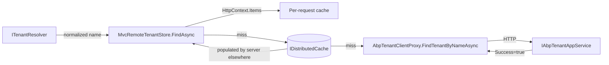
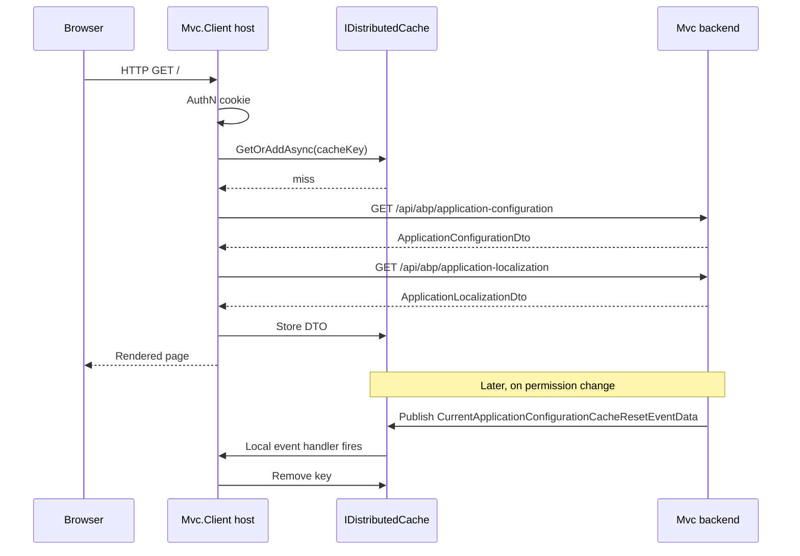

`Volo.Abp.AspNetCore.Mvc.Client` and `Volo.Abp.AspNetCore.Mvc.Client.Common`
turn an ABP Framework ASP.NET Core application into a *consumer* of a remote
ABP backend. Instead of hosting its own application services, an
`Mvc.Client` host delegates permission checks, settings, features,
localization and tenant lookups to a backend over HTTP — using the
contracts documented on
[/aspnetcore/mvc-contracts](/aspnetcore/mvc-contracts) and the generated
client proxies in `Mvc.Client.Common/ClientProxies/`. This page walks both
packages end to end.

The two packages split responsibilities cleanly:

- **`Volo.Abp.AspNetCore.Mvc.Client.Common`** holds the *cross-runtime*
  pieces: the generated `*ClientProxy` types, the
  `ICachedApplicationConfigurationClient` interface, the
  `Remote*` providers (`RemotePermissionChecker`, `RemoteSettingProvider`,
  `RemoteFeatureChecker`, `RemoteLocalizationContributor`,
  `RemoteLanguageProvider`, `RemoteExternalLocalizationStore`,
  `RemoteDynamicClaimsPrincipalContributor`).
- **`Volo.Abp.AspNetCore.Mvc.Client`** holds the *ASP.NET Core-specific*
  pieces: `MvcCachedApplicationConfigurationClient` (HttpContext-aware
  caching), `MvcRemoteTenantStore`, and the local-event handler that
  invalidates the configuration cache.

## Module entry points

### `AbpAspNetCoreMvcClientCommonModule`

`framework/src/Volo.Abp.AspNetCore.Mvc.Client.Common/Volo/Abp/AspNetCore/Mvc/Client/AbpAspNetCoreMvcClientCommonModule.cs`:

```csharp
[DependsOn(
    typeof(AbpHttpClientModule),
    typeof(AbpAspNetCoreMvcContractsModule),
    typeof(AbpCachingModule),
    typeof(AbpLocalizationModule),
    typeof(AbpAuthorizationModule),
    typeof(AbpFeaturesModule),
    typeof(AbpVirtualFileSystemModule)
)]
public class AbpAspNetCoreMvcClientCommonModule : AbpModule
{
    public const string RemoteServiceName = "AbpMvcClient";

    public override void ConfigureServices(ServiceConfigurationContext context)
    {
        context.Services.AddStaticHttpClientProxies(typeof(AbpAspNetCoreMvcContractsModule).Assembly, RemoteServiceName);

        Configure<AbpVirtualFileSystemOptions>(options =>
        {
            options.FileSets.AddEmbedded<AbpAspNetCoreMvcClientCommonModule>();
        });

        Configure<AbpLocalizationOptions>(options =>
        {
            options.GlobalContributors.Add<RemoteLocalizationContributor>();
        });

        var abpClaimsPrincipalFactoryOptions = context.Services.ExecutePreConfiguredActions<AbpClaimsPrincipalFactoryOptions>();
        if (abpClaimsPrincipalFactoryOptions.IsRemoteRefreshEnabled)
        {
            context.Services.AddTransient<RemoteDynamicClaimsPrincipalContributor>();
            context.Services.AddTransient<RemoteDynamicClaimsPrincipalContributorCache>();
        }
    }
}
```

The single most important call is
`AddStaticHttpClientProxies(typeof(AbpAspNetCoreMvcContractsModule).Assembly, RemoteServiceName)`.
That extension lives in `Volo.Abp.Http.Client` (see
[/http/overview](/http/overview)) and scans the
[Mvc.Contracts](/aspnetcore/mvc-contracts) assembly for `IApplicationService`
interfaces. For each one it finds — `IAbpApplicationConfigurationAppService`,
`IAbpApplicationLocalizationAppService`, `IAbpTenantAppService` — it
registers the matching generated `*ClientProxy.Generated.cs` class as the
DI binding for that interface.

### `AbpAspNetCoreMvcClientModule`

`framework/src/Volo.Abp.AspNetCore.Mvc.Client/Volo/Abp/AspNetCore/Mvc/Client/AbpAspNetCoreMvcClientModule.cs`:

```csharp
[DependsOn(
    typeof(AbpAspNetCoreMvcClientCommonModule),
    typeof(AbpEventBusModule)
)]
public class AbpAspNetCoreMvcClientModule : AbpModule
{
    public override void ConfigureServices(ServiceConfigurationContext context)
    {
        var abpHostEnvironment = context.Services.GetAbpHostEnvironment();
        if (abpHostEnvironment.IsDevelopment())
        {
            Configure<AbpAspNetCoreMvcClientCacheOptions>(options =>
            {
                options.ApplicationConfigurationDtoCacheAbsoluteExpiration = TimeSpan.FromSeconds(5);
            });
        }
    }
}
```

So:

- The development environment shortens the cache TTL from 300 seconds to 5
  seconds (so a `ChangeSettingAsync` round-trip is visible quickly).
- `AbpEventBusModule` is added — needed by
  `MvcCurrentApplicationConfigurationCacheResetEventHandler`.
- Everything else is inherited from `AbpAspNetCoreMvcClientCommonModule`.

## Generated client proxies

`framework/src/Volo.Abp.AspNetCore.Mvc.Client.Common/ClientProxies/` ships
three pairs of files:

| Interface | Generated proxy | User-extensible partial |
| --- | --- | --- |
| `IAbpApplicationConfigurationAppService` | `AbpApplicationConfigurationClientProxy.Generated.cs` | `AbpApplicationConfigurationClientProxy.cs` |
| `IAbpApplicationLocalizationAppService` | `AbpApplicationLocalizationClientProxy.Generated.cs` | `AbpApplicationLocalizationClientProxy.cs` |
| `IAbpTenantAppService` | `AbpTenantClientProxy.Generated.cs` | `AbpTenantClientProxy.cs` |

The generated half looks like this:

```csharp
[Dependency(ReplaceServices = true)]
[ExposeServices(typeof(IAbpApplicationConfigurationAppService), typeof(AbpApplicationConfigurationClientProxy))]
public partial class AbpApplicationConfigurationClientProxy : ClientProxyBase<IAbpApplicationConfigurationAppService>, IAbpApplicationConfigurationAppService
{
    public virtual async Task<ApplicationConfigurationDto> GetAsync(ApplicationConfigurationRequestOptions options)
    {
        return await RequestAsync<ApplicationConfigurationDto>(nameof(GetAsync), new ClientProxyRequestTypeValue
        {
            { typeof(ApplicationConfigurationRequestOptions), options }
        });
    }
}
```

The companion file is the user-overridable partial:

```csharp
[RemoteService(false)]
public partial class AbpApplicationConfigurationClientProxy
{
}
```

`[RemoteService(false)]` is critical — without it,
[`AbpServiceConvention`](/aspnetcore/mvc) would happily expose the proxy
**back** as a controller, producing a recursive call when the host runs MVC.

`ClientProxyBase<T>` is provided by `Volo.Abp.Http.Client` (see
[/http/overview](/http/overview)) and dispatches `RequestAsync<TResponse>`
through `IHttpClientProxy<T>` using the `RemoteServiceName` configured at
module level (`"AbpMvcClient"` here).

## Caching: `MvcCachedApplicationConfigurationClient`

`framework/src/Volo.Abp.AspNetCore.Mvc.Client/Volo/Abp/AspNetCore/Mvc/Client/MvcCachedApplicationConfigurationClient.cs`
is the most interesting class in the package. It implements
`ICachedApplicationConfigurationClient` (defined in the common package) and
threads the cache through three layers: `HttpContext.Items`, an
`IDistributedCache<ApplicationConfigurationDto>` and the remote proxy.

The `GetAsync` walk:

```csharp
public virtual async Task<ApplicationConfigurationDto> GetAsync()
{
    string? cacheKey = null;
    var httpContext = HttpContextAccessor?.HttpContext;
    var itemsKey = GetHttpContextItemsCacheKey();
    if (httpContext != null && httpContext.Items[itemsKey] is string key)
    {
        cacheKey = key;
    }

    if (cacheKey.IsNullOrWhiteSpace())
    {
        cacheKey = await CreateCacheKeyAsync();
        if (httpContext != null) httpContext.Items[itemsKey] = cacheKey;
    }

    if (httpContext != null && httpContext.Items[cacheKey] is ApplicationConfigurationDto configuration)
        return configuration;

    configuration = (await Cache.GetOrAddAsync(
        cacheKey,
        async () => await GetRemoteConfigurationAsync(),
        () => new DistributedCacheEntryOptions
        {
            AbsoluteExpirationRelativeToNow = Options.ApplicationConfigurationDtoCacheAbsoluteExpiration
        }
    ))!;

    if (httpContext != null) httpContext.Items[cacheKey] = configuration;
    return configuration;
}
```

The cache key includes:

- the **application version** — see `MvcCachedApplicationConfigurationClientHelper`;
- the **user ID** (or `"Anonymous"`);
- the **current UI culture name**.

So a single distributed cache instance can safely cache configurations for
many tenants, users and cultures, and a "publish a new version" operation
can invalidate every key in one move by rolling the application version.

`GetRemoteConfigurationAsync` is the part that *splits* the request — it
sends configuration and localization in parallel:

```csharp
var configTask = ApplicationConfigurationAppService.GetAsync(
    new ApplicationConfigurationRequestOptions { IncludeLocalizationResources = false });

var localizationTask = ApplicationLocalizationClientProxy.GetAsync(
    new ApplicationLocalizationRequestDto { CultureName = cultureName, OnlyDynamics = true });

await Task.WhenAll(configTask, localizationTask);

var config = configTask.Result;
var localizationDto = localizationTask.Result;

if (!CultureHelper.IsCompatibleCulture(config.Localization.CurrentCulture.Name, cultureName))
{
    localizationDto = await ApplicationLocalizationClientProxy.GetAsync(
        new ApplicationLocalizationRequestDto { CultureName = config.Localization.CurrentCulture.Name, OnlyDynamics = true });
}

config.Localization.Resources = localizationDto.Resources;
return config;
```

Note the *fallback*: if the remote backend resolved a different culture
than the client requested (for example because the client culture is
unsupported and falls back to English), the localization request is
re-issued with the resolved culture so the strings *match* the rest of the
configuration. This is the canonical example of why the localization
endpoint is split off in the [Contracts](/aspnetcore/mvc-contracts) package.

### Cache key construction

`MvcCachedApplicationConfigurationClientHelper`
(`framework/src/Volo.Abp.AspNetCore.Mvc.Client.Common/Volo/Abp/AspNetCore/Mvc/Client/MvcCachedApplicationConfigurationClientHelper.cs`):

```csharp
public virtual async Task<string> CreateCacheKeyAsync(Guid? userId)
{
    var appVersion = await ApplicationVersionCache.GetOrAddAsync(
        MvcCachedApplicationVersionCacheItem.CacheKey,
        () => Task.FromResult(new MvcCachedApplicationVersionCacheItem(Guid.NewGuid().ToString("N")))
    ) ?? new MvcCachedApplicationVersionCacheItem(Guid.NewGuid().ToString("N"));

    var userKey = userId?.ToString("N") ?? "Anonymous";
    return $"ApplicationConfiguration_{appVersion.Version}_{userKey}_{CultureInfo.CurrentUICulture.Name}";
}
```

`MvcCachedApplicationVersionCacheItem` is a `class` holding `Version`. A
client host that wants to force a refresh just removes the
`"Mvc_Application_Version"` key from the distributed cache; every
configuration key dies with it because the prefix changes.

### Cache invalidation

`MvcCurrentApplicationConfigurationCacheResetEventHandler` handles the
`CurrentApplicationConfigurationCacheResetEventData` event documented on
[Mvc.Contracts](/aspnetcore/mvc-contracts):

```csharp
public virtual async Task HandleEventAsync(CurrentApplicationConfigurationCacheResetEventData eventData)
{
    if (eventData.UserId.HasValue)
    {
        await Cache.RemoveAsync(await CacheHelper.CreateCacheKeyAsync(eventData.UserId));
    }
    else
    {
        await ApplicationVersionCache.RemoveAsync(MvcCachedApplicationVersionCacheItem.CacheKey);
    }
}
```

`UserId == null` blows the version cache (everyone refreshes on next
request). A specific `UserId` invalidates only that user. The server
publishes this event whenever a permission, setting, role or feature
relevant to the configuration changes; clients subscribe through the local
event bus on a distributed event handler (so it can come over Kafka,
RabbitMQ, Dapr — see [Mvc.Dapr](/aspnetcore/mvc-dapr)).

## Remote providers in `Mvc.Client.Common`

The remote providers all follow the same pattern: depend on
`ICachedApplicationConfigurationClient`, look up the relevant sub-DTO of
`ApplicationConfigurationDto`.

### `RemotePermissionChecker`

```csharp
public class RemotePermissionChecker : IPermissionChecker, ITransientDependency
{
    protected ICachedApplicationConfigurationClient ConfigurationClient { get; }

    public async Task<bool> IsGrantedAsync(string name)
    {
        var configuration = await ConfigurationClient.GetAsync();
        return configuration.Auth.GrantedPolicies.ContainsKey(name);
    }

    public async Task<MultiplePermissionGrantResult> IsGrantedAsync(string[] names)
    {
        var result = new MultiplePermissionGrantResult();
        var configuration = await ConfigurationClient.GetAsync();
        foreach (var name in names)
        {
            result.Result.Add(name, configuration.Auth.GrantedPolicies.ContainsKey(name)
                ? PermissionGrantResult.Granted
                : PermissionGrantResult.Undefined);
        }
        return result;
    }
}
```

The class overrides ABP's default `IPermissionChecker` (covered on
[/security/authorization](/security/authorization)) so MVC's
`[Authorize(Policy = "…")]` evaluations on the **client** ask the **server**
indirectly — through the cached DTO. The implementation comments hint at
this: *"This provider always works for the current principal."*

### `RemoteSettingProvider`

```csharp
public class RemoteSettingProvider : ISettingProvider, ITransientDependency
{
    protected ICachedApplicationConfigurationClient ConfigurationClient { get; }

    public async Task<string?> GetOrNullAsync(string name)
    {
        var configuration = await ConfigurationClient.GetAsync();
        return configuration.Setting.Values.GetOrDefault(name);
    }

    public async Task<List<SettingValue>> GetAllAsync()
    {
        var configuration = await ConfigurationClient.GetAsync();
        return configuration.Setting.Values
            .Select(s => new SettingValue(s.Key, s.Value))
            .ToList();
    }
}
```

### `RemoteFeatureChecker`

```csharp
public class RemoteFeatureChecker : FeatureCheckerBase
{
    public override async Task<string?> GetOrNullAsync(string name)
    {
        var configuration = await ConfigurationClient.GetAsync();
        return configuration.Features.Values.GetOrDefault(name);
    }
}
```

### `RemoteLanguageProvider`

```csharp
public async Task<IReadOnlyList<LanguageInfo>> GetLanguagesAsync()
{
    var configuration = await ConfigurationClient.GetAsync();
    return configuration.Localization.Languages;
}
```

### `RemoteLocalizationContributor`

`framework/src/Volo.Abp.AspNetCore.Mvc.Client.Common/Volo/Abp/AspNetCore/Mvc/Client/RemoteLocalizationContributor.cs`
is registered into `AbpLocalizationOptions.GlobalContributors` in the module
constructor. It bridges the
`ApplicationLocalizationConfigurationDto.Resources` tree into ABP's
`ILocalizationResourceContributor` interface, walking `BaseResources`
recursively so a string defined in `Volo.Abp.UI` can be picked up by a
client app that only knows about its own resource:

```csharp
public bool IsDynamic => true;

public virtual LocalizedString? GetOrNull(string cultureName, string name)
{
    /* cultureName is not used because remote localization can only
     * be done in the current culture. */
    return GetOrNullInternal(_resource.ResourceName, name);
}

protected virtual LocalizedString? GetOrNullInternal(string resourceName, string name)
{
    var resource = GetResourceOrNull(resourceName);
    if (resource == null) return null;

    var value = resource.Texts.GetOrDefault(name);
    if (value != null) return new LocalizedString(name, value);

    foreach (var baseResource in resource.BaseResources)
    {
        value = GetOrNullInternal(baseResource, name)?.ToString();
        if (value != null) return new LocalizedString(name, value);
    }
    return null;
}
```

### `RemoteExternalLocalizationStore`

`RemoteExternalLocalizationStore` plugs into ABP's "external" localization
mechanism — used when localization strings can come from outside the static
resource hierarchy (e.g. database-backed text, CMS). The remote variant
reads the same DTO.

### `RemoteDynamicClaimsPrincipalContributor`

```csharp
[DisableConventionalRegistration]
public class RemoteDynamicClaimsPrincipalContributor : RemoteDynamicClaimsPrincipalContributorBase<RemoteDynamicClaimsPrincipalContributor, RemoteDynamicClaimsPrincipalContributorCache>
{
}
```

It only gets registered if `AbpClaimsPrincipalFactoryOptions.IsRemoteRefreshEnabled`
is `true` (see the conditional registration in the module). This is the
seam that lets a client MVC app refresh user claims from the backend
without a re-login — it's invoked by the `AbpDynamicClaimsMiddleware`
documented on the [Core middleware page](/aspnetcore/aspnetcore-core).

## Tenant resolution: `MvcRemoteTenantStore`

`framework/src/Volo.Abp.AspNetCore.Mvc.Client/Volo/Abp/AspNetCore/Mvc/Client/MvcRemoteTenantStore.cs`
is an `ITenantStore` that calls the generated `AbpTenantClientProxy`:

```csharp
public async Task<TenantConfiguration?> FindAsync(string normalizedName)
{
    var cacheKey = TenantConfigurationCacheItem.CalculateCacheKey(normalizedName);
    var httpContext = HttpContextAccessor?.HttpContext;

    if (httpContext != null && httpContext.Items[cacheKey] is TenantConfigurationCacheItem tenantConfigurationInHttpContext)
        return tenantConfigurationInHttpContext?.Value;

    var tenantConfiguration = await Cache.GetAsync(cacheKey);
    if (tenantConfiguration?.Value == null)
    {
        var tenant = await TenantAppService.FindTenantByNameAsync(normalizedName);
        tenantConfiguration = await Cache.GetAsync(cacheKey);
        if (tenant.Success && tenantConfiguration?.Value == null)
        {
            Logger.LogWarning($"Tenant with name '{normalizedName}' was found, but not present in the distributed cache, " +
                              "Ensure all applications use the same distributed cache and the same cache key prefix");
        }
    }
    if (httpContext != null) httpContext.Items[cacheKey] = tenantConfiguration;
    return tenantConfiguration?.Value;
}
```

The warning is meaningful: `MvcRemoteTenantStore` assumes the backend writes
the *real* `TenantConfiguration` to the same distributed cache. The remote
HTTP call only confirms existence — it does not return secrets like the
tenant's connection string. So `Mvc.Client` hosts must share the cache
infrastructure (Redis, SQL distributed cache, …) with the server. See
[/multi-tenancy/aspnetcore-multitenancy](/multi-tenancy/aspnetcore-multitenancy)
for the full tenancy story.



## Caching options

`framework/src/Volo.Abp.AspNetCore.Mvc.Client/Volo/Abp/AspNetCore/Mvc/Client/AbpAspNetCoreMvcClientCacheOptions.cs`:

```csharp
public class AbpAspNetCoreMvcClientCacheOptions
{
    public TimeSpan ApplicationConfigurationDtoCacheAbsoluteExpiration { get; set; }

    public AbpAspNetCoreMvcClientCacheOptions()
    {
        ApplicationConfigurationDtoCacheAbsoluteExpiration = TimeSpan.FromSeconds(300);
    }
}
```

Five minutes default; five seconds in development (as set by
`AbpAspNetCoreMvcClientModule`). You can override it from your module:

```csharp
Configure<AbpAspNetCoreMvcClientCacheOptions>(options =>
{
    options.ApplicationConfigurationDtoCacheAbsoluteExpiration = TimeSpan.FromMinutes(15);
});
```

## End-to-end flow



## File inventory

| Package | File | Type | Role |
| --- | --- | --- | --- |
| Client.Common | `AbpAspNetCoreMvcClientCommonModule.cs` | `AbpAspNetCoreMvcClientCommonModule` | Module + `AddStaticHttpClientProxies` |
| Client.Common | `ICachedApplicationConfigurationClient.cs` | `ICachedApplicationConfigurationClient` | Abstraction for caching |
| Client.Common | `MvcCachedApplicationConfigurationClientHelper.cs` | `MvcCachedApplicationConfigurationClientHelper` | Builds cache keys |
| Client.Common | `MvcCachedApplicationVersionCacheItem.cs` | `MvcCachedApplicationVersionCacheItem` | App-version singleton |
| Client.Common | `RemotePermissionChecker.cs` | `RemotePermissionChecker` | `IPermissionChecker` over the DTO |
| Client.Common | `RemoteSettingProvider.cs` | `RemoteSettingProvider` | `ISettingProvider` over the DTO |
| Client.Common | `RemoteFeatureChecker.cs` | `RemoteFeatureChecker` | `FeatureCheckerBase` over the DTO |
| Client.Common | `RemoteLanguageProvider.cs` | `RemoteLanguageProvider` | `ILanguageProvider` over the DTO |
| Client.Common | `RemoteLocalizationContributor.cs` | `RemoteLocalizationContributor` | Resource walker over `ApplicationLocalizationResourceDto` |
| Client.Common | `RemoteExternalLocalizationStore.cs` | `RemoteExternalLocalizationStore` | External-store adapter |
| Client.Common | `RemoteDynamicClaimsPrincipalContributor.cs` | `RemoteDynamicClaimsPrincipalContributor` | Dynamic claims refresh |
| Client.Common | `RemoteDynamicClaimsPrincipalContributorCache.cs` | `RemoteDynamicClaimsPrincipalContributorCache` | Caches refreshed principals |
| Client.Common | `ClientProxies/AbpApplicationConfigurationClientProxy.cs` & `.Generated.cs` | `AbpApplicationConfigurationClientProxy` | Generated HTTP proxy |
| Client.Common | `ClientProxies/AbpApplicationLocalizationClientProxy.cs` & `.Generated.cs` | `AbpApplicationLocalizationClientProxy` | Generated HTTP proxy |
| Client.Common | `ClientProxies/AbpTenantClientProxy.cs` & `.Generated.cs` | `AbpTenantClientProxy` | Generated HTTP proxy |
| Client | `AbpAspNetCoreMvcClientModule.cs` | `AbpAspNetCoreMvcClientModule` | Module + dev TTL |
| Client | `AbpAspNetCoreMvcClientCacheOptions.cs` | `AbpAspNetCoreMvcClientCacheOptions` | Cache TTL |
| Client | `MvcCachedApplicationConfigurationClient.cs` | `MvcCachedApplicationConfigurationClient` | `ICachedApplicationConfigurationClient` impl |
| Client | `MvcCurrentApplicationConfigurationCacheResetEventHandler.cs` | `MvcCurrentApplicationConfigurationCacheResetEventHandler` | Cache invalidator |
| Client | `MvcRemoteTenantStore.cs` | `MvcRemoteTenantStore` | `ITenantStore` over `IAbpTenantAppService` |

## When to depend on which

| If you are building… | Reference |
| --- | --- |
| A Blazor WebAssembly application that talks to an ABP backend | `Volo.Abp.AspNetCore.Mvc.Client.Common` (no `HttpContext`) |
| An ASP.NET Core MVC / Razor host that consumes a remote ABP backend | `Volo.Abp.AspNetCore.Mvc.Client` (transitively gets `Common`) |
| The backend itself | Neither — you implement the contracts |

## Cross-references

- [Overview](/aspnetcore/overview) — where this layer sits.
- [Mvc.Contracts](/aspnetcore/mvc-contracts) — the DTOs proxied by these
  generated clients.
- [HTTP overview](/http/overview) — `ClientProxyBase<T>`,
  `AddStaticHttpClientProxies`, `RemoteServiceName`.
- [Core middleware](/aspnetcore/aspnetcore-core) —
  `AbpDynamicClaimsMiddleware` triggers
  `RemoteDynamicClaimsPrincipalContributor`.
- [Multi-tenancy](/multi-tenancy/aspnetcore-multitenancy) — the broader
  `ITenantStore` contract used by `MvcRemoteTenantStore`.
- [Authorization](/security/authorization) —
  `RemotePermissionChecker` overrides default `IPermissionChecker`.
- [App bootstrap](/core/abp-application-and-bootstrap) — how the two
  modules load before HTTP requests start.
- [UI MVC overview](/ui-mvc/overview) — the Razor / view layer typically
  sitting on top of `Mvc.Client`.

## Summary

`Mvc.Client.Common` is the cross-runtime backbone (`Remote*` providers and
generated proxies); `Mvc.Client` adds the ASP.NET Core-specific caching
client (`MvcCachedApplicationConfigurationClient`) and the tenant store
(`MvcRemoteTenantStore`). Together they let any ABP host delegate
permissions, settings, features, localization and tenants to a remote
backend with a single distributed cache hop. The cache is keyed by
application version, user and culture; invalidation rides on the
`CurrentApplicationConfigurationCacheResetEventData` local event so it works
over any distributed event bus — including [Dapr](/aspnetcore/mvc-dapr).
