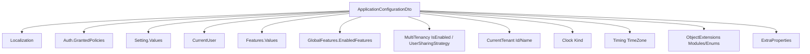
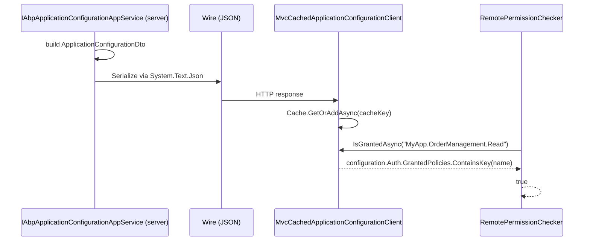

`Volo.Abp.AspNetCore.Mvc.Contracts` is a tiny but pivotal package in the ABP
Framework: it carries the data-transfer objects and application-service
interfaces that **both** sides of an ABP HTTP boundary need to know about.
Server hosts use it through `Volo.Abp.AspNetCore.Mvc` (server side); client
hosts use it through `Volo.Abp.AspNetCore.Mvc.Client.Common`
(see [/aspnetcore/mvc-client](/aspnetcore/mvc-client)); Blazor WebAssembly
clients reference it directly. This page walks every file in the package.

The package has no ASP.NET Core runtime references at all — its single
module pulls in `AbpDddApplicationContractsModule` and
`AbpMultiTenancyAbstractionsModule`. That makes the DTOs safe to share with
any .NET process, including Xamarin and trimmed WebAssembly builds.

## Module entry point

`framework/src/Volo.Abp.AspNetCore.Mvc.Contracts/Volo/Abp/AspNetCore/Mvc/AbpAspNetCoreMvcContractsModule.cs`
is empty by design:

```csharp
[DependsOn(
    typeof(AbpDddApplicationContractsModule),
    typeof(AbpMultiTenancyAbstractionsModule)
)]
public class AbpAspNetCoreMvcContractsModule : AbpModule
{

}
```

That's the whole module class. Every behaviour lives elsewhere: the DTOs
describe shape, and the consumers (`AbpApplicationConfigurationAppService`
on the server, `MvcCachedApplicationConfigurationClient` on the client)
materialize it.

## Two namespaces, two app-service interfaces

The package is split into two folders:

```text
framework/src/Volo.Abp.AspNetCore.Mvc.Contracts/Volo/Abp/AspNetCore/Mvc/
├── ApplicationConfigurations/
│   ├── IAbpApplicationConfigurationAppService.cs
│   ├── IAbpApplicationLocalizationAppService.cs
│   ├── ApplicationConfigurationDto.cs              (top-level aggregate)
│   ├── ApplicationConfigurationRequestOptions.cs
│   ├── ApplicationConfigurationContributorContext.cs
│   ├── IApplicationConfigurationContributor.cs
│   ├── ApplicationAuthConfigurationDto.cs
│   ├── ApplicationSettingConfigurationDto.cs
│   ├── ApplicationFeatureConfigurationDto.cs
│   ├── ApplicationGlobalFeatureConfigurationDto.cs
│   ├── ApplicationLocalizationConfigurationDto.cs
│   ├── ApplicationLocalizationRequestDto.cs
│   ├── ApplicationLocalizationDto.cs
│   ├── ApplicationLocalizationResourceDto.cs
│   ├── CurrentUserDto.cs
│   ├── CurrentCultureDto.cs
│   ├── DateTimeFormatDto.cs
│   ├── ClockDto.cs
│   ├── TimingDto.cs
│   ├── CurrentApplicationConfigurationCacheResetEventData.cs
│   └── ObjectExtending/                            (extension property DTOs)
└── MultiTenancy/
    ├── IAbpTenantAppService.cs
    ├── FindTenantResultDto.cs
    ├── MultiTenancyInfoDto.cs
    └── CurrentTenantDto.cs
```

This page walks the files in approximately the order a deserializer would
encounter them when parsing the wire format of
`IAbpApplicationConfigurationAppService.GetAsync`.

## Top-level DTO: `ApplicationConfigurationDto`

`framework/src/Volo.Abp.AspNetCore.Mvc.Contracts/Volo/Abp/AspNetCore/Mvc/ApplicationConfigurations/ApplicationConfigurationDto.cs`
is the aggregate every ABP UI fetches once per user/culture combination:

```csharp
[Serializable]
public class ApplicationConfigurationDto : IHasExtraProperties
{
    public ApplicationLocalizationConfigurationDto Localization { get; set; }
    public ApplicationAuthConfigurationDto Auth { get; set; }
    public ApplicationSettingConfigurationDto Setting { get; set; }
    public CurrentUserDto CurrentUser { get; set; }
    public ApplicationFeatureConfigurationDto Features { get; set; }
    public ApplicationGlobalFeatureConfigurationDto GlobalFeatures { get; set; }
    public MultiTenancyInfoDto MultiTenancy { get; set; }
    public CurrentTenantDto CurrentTenant { get; set; }
    public TimingDto Timing { get; set; }
    public ClockDto Clock { get; set; }
    public ObjectExtensionsDto ObjectExtensions { get; set; }
    public ExtraPropertyDictionary ExtraProperties { get; set; }
}
```

Every property maps to a different ABP subsystem; together they describe
"what does *this* user, in *this* tenant, with *this* culture, know about
the application?"



The class implements `IHasExtraProperties`, so application-specific
modules can attach data through `ApplicationConfigurationContributorContext`
without changing the contract.

## Auth, Setting, Feature, GlobalFeature DTOs

The four "name-value bag" DTOs are intentionally minimal:

| File | Type | Shape |
| --- | --- | --- |
| `ApplicationAuthConfigurationDto.cs` | `ApplicationAuthConfigurationDto` | `Dictionary<string, bool> GrantedPolicies` |
| `ApplicationSettingConfigurationDto.cs` | `ApplicationSettingConfigurationDto` | `Dictionary<string, string?> Values` |
| `ApplicationFeatureConfigurationDto.cs` | `ApplicationFeatureConfigurationDto` | `Dictionary<string, string?> Values` |
| `ApplicationGlobalFeatureConfigurationDto.cs` | `ApplicationGlobalFeatureConfigurationDto` | `HashSet<string> EnabledFeatures` |

These are the structures consumed by the **remote** ABP providers in
[Mvc.Client.Common](/aspnetcore/mvc-client):

```csharp
public async Task<bool> IsGrantedAsync(string name)
{
    var configuration = await ConfigurationClient.GetAsync();
    return configuration.Auth.GrantedPolicies.ContainsKey(name);
}
```

`RemoteSettingProvider`, `RemoteFeatureChecker` and `RemotePermissionChecker`
all read from the same `ApplicationConfigurationDto`.

## Localization DTOs

`ApplicationLocalizationConfigurationDto.cs` is the largest of the inner
DTOs. The interesting parts:

```csharp
public class ApplicationLocalizationConfigurationDto
{
    public Dictionary<string, Dictionary<string, string>> Values { get; set; }
    public Dictionary<string, ApplicationLocalizationResourceDto> Resources { get; set; } = new();
    public List<LanguageInfo> Languages { get; set; }
    public CurrentCultureDto CurrentCulture { get; set; }
    public string? DefaultResourceName { get; set; }
    public Dictionary<string, List<NameValue>> LanguagesMap { get; set; }
    public Dictionary<string, List<NameValue>> LanguageFilesMap { get; set; }
}
```

`Values` is the legacy `resourceName → key → text` map; `Resources` is the
newer wire shape (filled by `IAbpApplicationLocalizationAppService`
separately, as the source code comment explains). The split exists so the
configuration endpoint can stay small and the heavyweight localization
download can be cached separately. `MvcCachedApplicationConfigurationClient`
(documented on [Mvc.Client](/aspnetcore/mvc-client)) uses two `Task`s in
parallel:

```csharp
var configTask = ApplicationConfigurationAppService.GetAsync(
    new ApplicationConfigurationRequestOptions { IncludeLocalizationResources = false });
var localizationTask = ApplicationLocalizationClientProxy.GetAsync(
    new ApplicationLocalizationRequestDto { CultureName = cultureName, OnlyDynamics = true });
await Task.WhenAll(configTask, localizationTask);
```

`IAbpApplicationLocalizationAppService` (in
`IAbpApplicationLocalizationAppService.cs`) is the second interface this
package exposes:

```csharp
public interface IAbpApplicationLocalizationAppService : IApplicationService
{
    Task<ApplicationLocalizationDto> GetAsync(ApplicationLocalizationRequestDto input);
}
```

with the request DTO:

```csharp
public class ApplicationLocalizationRequestDto
{
    [Required] public string CultureName { get; set; } = default!;
    public bool OnlyDynamics { get; set; }
}
```

## Current user

`CurrentUserDto.cs` is the canonical "who am I?" envelope. It covers
identity, tenancy, impersonation and role claims in a single shape:

```csharp
public class CurrentUserDto
{
    public bool IsAuthenticated { get; set; }
    public Guid? Id { get; set; }
    public Guid? TenantId { get; set; }
    public Guid? ImpersonatorUserId { get; set; }
    public Guid? ImpersonatorTenantId { get; set; }
    public string? ImpersonatorUserName { get; set; }
    public string? ImpersonatorTenantName { get; set; }
    public string? UserName { get; set; }
    public string? Name { get; set; }
    public string? SurName { get; set; }
    public string? Email { get; set; }
    public bool EmailVerified { get; set; }
    public string? PhoneNumber { get; set; }
    public bool PhoneNumberVerified { get; set; }
    public string[] Roles { get; set; } = default!;
    public string? SessionId { get; set; }
}
```

The impersonation fields are the cross-process signal that lets ABP's UI
display "you are logged in as X impersonating Y" banners without each module
having to invent its own claims; the security context behind these fields
lives in [/security/authorization](/security/authorization).

## Culture & time DTOs

The four DTOs `CurrentCultureDto`, `DateTimeFormatDto`, `ClockDto` and
`TimingDto` describe the client-side culture, time-zone and clock policy.
The current-culture DTO is the largest because it carries everything a JS
runtime would otherwise have to compute from `Intl.DateTimeFormat`:

```csharp
public class CurrentCultureDto
{
    public string DisplayName { get; set; } = default!;
    public string EnglishName { get; set; } = default!;
    public string ThreeLetterIsoLanguageName { get; set; } = default!;
    public string TwoLetterIsoLanguageName { get; set; } = default!;
    public bool IsRightToLeft { get; set; }
    public string CultureName { get; set; } = default!;
    public string Name { get; set; } = default!;
    public string NativeName { get; set; } = default!;
    public DateTimeFormatDto DateTimeFormat { get; set; } = default!;
}
```

`ClockDto` carries `Kind` (`Utc` / `Local` / `Unspecified`), and `TimingDto`
carries the current `TimeZone`. UIs use those values to render dates and
serialize times. The server populates them from the
[`IClock`](/infrastructure/timing) abstraction documented elsewhere.

## Multi-tenancy DTOs

`MultiTenancy/MultiTenancyInfoDto.cs` describes the *site-wide* tenancy
setup:

```csharp
public class MultiTenancyInfoDto
{
    public bool IsEnabled { get; set; }
    public TenantUserSharingStrategy UserSharingStrategy { get; set; }
}
```

…and `MultiTenancy/CurrentTenantDto.cs` describes the *current* tenant:

```csharp
public class CurrentTenantDto
{
    public Guid? Id { get; set; }
    public string? Name { get; set; }
    public bool IsAvailable { get; set; }
}
```

`MultiTenancy/IAbpTenantAppService.cs` exposes two endpoints used by tenant
resolvers / login flows when a user is selecting a tenant before
authenticating:

```csharp
public interface IAbpTenantAppService : IApplicationService
{
    Task<FindTenantResultDto> FindTenantByNameAsync(string name);
    Task<FindTenantResultDto> FindTenantByIdAsync(Guid id);
}
```

with the result DTO

```csharp
public class FindTenantResultDto
{
    public bool Success { get; set; }
    public Guid? TenantId { get; set; }
    public string? Name { get; set; }
    public string? NormalizedName { get; set; }
    public bool IsActive { get; set; }
}
```

These two interfaces are exactly what `MvcRemoteTenantStore`
(see [Mvc.Client](/aspnetcore/mvc-client)) calls through its generated
`AbpTenantClientProxy`. They are also documented on the broader multi-tenancy
page: [/multi-tenancy/aspnetcore-multitenancy](/multi-tenancy/aspnetcore-multitenancy).

## Object extending DTOs

`ObjectExtending/*` describes the wire shape of ABP's "extension property"
system — the run-time mechanism that lets you add fields to entities
without changing their .NET types. The aggregate is `ObjectExtensionsDto`:

```csharp
public class ObjectExtensionsDto
{
    public Dictionary<string, ModuleExtensionDto> Modules { get; set; }
    public Dictionary<string, ExtensionEnumDto> Enums { get; set; }
}
```

The contributory DTOs in the subfolder describe entities, properties,
UI hints (table, form, lookup), policies (permission, feature, global
feature), enum members, and localized strings. They are intentionally
serializable POCOs so they survive Newtonsoft.Json *and* System.Text.Json
deserialization on every client target.

| File | Type | Role |
| --- | --- | --- |
| `EntityExtensionDto.cs` | `EntityExtensionDto` | Set of extension properties for one entity |
| `ExtensionEnumDto.cs` | `ExtensionEnumDto` | One enum referenced by extensions |
| `ExtensionEnumFieldDto.cs` | `ExtensionEnumFieldDto` | A field on the enum (`Name`, `Value`, localized text) |
| `ExtensionPropertyApiDto.cs` | `ExtensionPropertyApiDto` | Mirrors the create/update/get API surface |
| `ExtensionPropertyApiCreateDto.cs` etc. | Property fragments | Per-API fragments |
| `ExtensionPropertyAttributeDto.cs` | `ExtensionPropertyAttributeDto` | Validation attributes (`[Required]`, `[MaxLength]`) |
| `ExtensionPropertyDto.cs` | `ExtensionPropertyDto` | The property itself: name, type, default value, policies, UI |
| `ExtensionPropertyFeaturePolicyDto.cs` / `ExtensionPropertyGlobalFeaturePolicyDto.cs` / `ExtensionPropertyPermissionPolicyDto.cs` / `ExtensionPropertyPolicyDto.cs` | Policy DTOs | Drive conditional visibility |
| `ExtensionPropertyUiDto.cs`, `ExtensionPropertyUiFormDto.cs`, `ExtensionPropertyUiLookupDto.cs`, `ExtensionPropertyUiTableDto.cs` | UI hints | Tell the client how to render the property |
| `LocalizableStringDto.cs` | `LocalizableStringDto` | `(ResourceName, Name)` pair |
| `ModuleExtensionDto.cs` | `ModuleExtensionDto` | Container for many entities in one module |

These DTOs are the wire format that ABP's Angular / Blazor / MVC UI libraries
read at startup to render the extension forms for each entity.

## Configuration request and contributor

```csharp
public class ApplicationConfigurationRequestOptions
{
    public bool IncludeLocalizationResources { get; set; } = true;
}
```

The flag is set to `false` by `MvcCachedApplicationConfigurationClient` to
avoid paying the localization payload twice.

`ApplicationConfigurationContributorContext.cs` is the cooperative
extension point on the server side:

```csharp
public interface IApplicationConfigurationContributor
{
    Task ContributeAsync(ApplicationConfigurationContributorContext context);
}
```

It is a server-only seam (no `[ApplicationContract]` attribute), used by
the *consumer* of the contract to inject extra properties into the
`ExtraProperties` bucket. The interface is *in this package* — not in the
server-only one — because Blazor WebAssembly hosts that build their own
`ApplicationConfigurationDto` (for offline/test scenarios) can implement
contributors too.

## Cache-reset event

`CurrentApplicationConfigurationCacheResetEventData.cs` is the contract for
the local-event-bus message that invalidates the cache of
`MvcCachedApplicationConfigurationClient`:

```csharp
public class CurrentApplicationConfigurationCacheResetEventData
{
    public Guid? UserId { get; set; }

    public CurrentApplicationConfigurationCacheResetEventData() { }
    public CurrentApplicationConfigurationCacheResetEventData(Guid? userId)
    {
        UserId = userId;
    }
}
```

A `null` `UserId` means "invalidate the application-wide version cache". This
is consumed by `MvcCurrentApplicationConfigurationCacheResetEventHandler`
documented on [Mvc.Client](/aspnetcore/mvc-client).

## End-to-end wire path

The diagram below shows how a single piece of data
(`configuration.Auth.GrantedPolicies["MyApp.OrderManagement.Read"] = true`)
flows from server to client.



## File inventory

| Folder | File | Type | Purpose |
| --- | --- | --- | --- |
| (root) | `AbpAspNetCoreMvcContractsModule.cs` | `AbpAspNetCoreMvcContractsModule` | Module marker |
| `ApplicationConfigurations` | `IAbpApplicationConfigurationAppService.cs` | `IAbpApplicationConfigurationAppService` | Server contract |
| | `IAbpApplicationLocalizationAppService.cs` | `IAbpApplicationLocalizationAppService` | Server contract |
| | `IApplicationConfigurationContributor.cs` | `IApplicationConfigurationContributor` | Server-side seam |
| | `ApplicationConfigurationDto.cs` | `ApplicationConfigurationDto` | Aggregate |
| | `ApplicationConfigurationRequestOptions.cs` | `ApplicationConfigurationRequestOptions` | Request flag |
| | `ApplicationConfigurationContributorContext.cs` | `ApplicationConfigurationContributorContext` | Contributor input |
| | `ApplicationAuthConfigurationDto.cs` | `ApplicationAuthConfigurationDto` | `GrantedPolicies` |
| | `ApplicationSettingConfigurationDto.cs` | `ApplicationSettingConfigurationDto` | `Values` |
| | `ApplicationFeatureConfigurationDto.cs` | `ApplicationFeatureConfigurationDto` | `Values` |
| | `ApplicationGlobalFeatureConfigurationDto.cs` | `ApplicationGlobalFeatureConfigurationDto` | `EnabledFeatures` |
| | `ApplicationLocalizationConfigurationDto.cs` | `ApplicationLocalizationConfigurationDto` | Inline localization |
| | `ApplicationLocalizationRequestDto.cs` | `ApplicationLocalizationRequestDto` | Culture + only-dynamics |
| | `ApplicationLocalizationDto.cs` | `ApplicationLocalizationDto` | Resources payload |
| | `ApplicationLocalizationResourceDto.cs` | `ApplicationLocalizationResourceDto` | Per-resource map |
| | `CurrentUserDto.cs` | `CurrentUserDto` | Identity envelope |
| | `CurrentCultureDto.cs` | `CurrentCultureDto` | Culture details |
| | `DateTimeFormatDto.cs` | `DateTimeFormatDto` | Date/time format strings |
| | `ClockDto.cs` | `ClockDto` | `Kind` |
| | `TimingDto.cs` | `TimingDto` | `TimeZone` |
| | `CurrentApplicationConfigurationCacheResetEventData.cs` | `CurrentApplicationConfigurationCacheResetEventData` | Local event |
| `ApplicationConfigurations/ObjectExtending` | many `*Dto.cs` | Extension DTOs | UI extension property tree |
| `MultiTenancy` | `IAbpTenantAppService.cs` | `IAbpTenantAppService` | Server contract |
| | `FindTenantResultDto.cs` | `FindTenantResultDto` | Tenant lookup result |
| | `MultiTenancyInfoDto.cs` | `MultiTenancyInfoDto` | Multi-tenancy on/off + sharing |
| | `CurrentTenantDto.cs` | `CurrentTenantDto` | Current tenant |

That is the entire surface area of the package.

## Why contracts-first matters

<Info>
The split exists for the same reason ABP's HTTP infrastructure exists at all
(see [/http/overview](/http/overview)): you should not have to choose between
strongly-typed client/server contracts and a small enough binary surface to
host inside a browser. `Volo.Abp.AspNetCore.Mvc.Contracts` is the minimum
viable contract you can share between an ASP.NET Core server and a Blazor
WebAssembly client; once you reference it, ABP's HTTP client module can
generate `AbpApplicationConfigurationClientProxy` and `AbpTenantClientProxy`
through code generation (look for `*.Generated.cs` files in
`Volo.Abp.AspNetCore.Mvc.Client.Common/ClientProxies`).
</Info>

## Cross-references

- [Overview](/aspnetcore/overview) — packaging map this page sits in.
- [Mvc package](/aspnetcore/mvc) — the **server** that publishes these
  contracts as controllers.
- [Mvc.Client.Common](/aspnetcore/mvc-client) — the **client** that
  consumes them.
- [HTTP module overview](/http/overview) — how `IHttpClientProxy<T>`
  finds and binds the interfaces above.
- [Multi-tenancy](/multi-tenancy/aspnetcore-multitenancy) — the broader
  picture for `IAbpTenantAppService`.
- [Authorization](/security/authorization) — what `GrantedPolicies`
  ultimately drives.
- [UI MVC overview](/ui-mvc/overview) — Razor UI that renders the
  extension-property DTOs as forms.
- [App bootstrap](/core/abp-application-and-bootstrap) — where the
  `AbpAspNetCoreMvcContractsModule` registration is processed.

## Summary

`Volo.Abp.AspNetCore.Mvc.Contracts` is the wire-format home of ABP's
"application configuration" pattern. It carries one aggregate
(`ApplicationConfigurationDto`), three inner subsystem DTOs
(Auth/Setting/Feature/GlobalFeature, Localization, ObjectExtending), an
identity DTO (`CurrentUserDto`), culture/time DTOs, multi-tenancy DTOs and
two `IApplicationService` interfaces
(`IAbpApplicationConfigurationAppService`, `IAbpApplicationLocalizationAppService`,
plus `IAbpTenantAppService`). Server and client packages mirror it without
ever touching ASP.NET Core directly.
