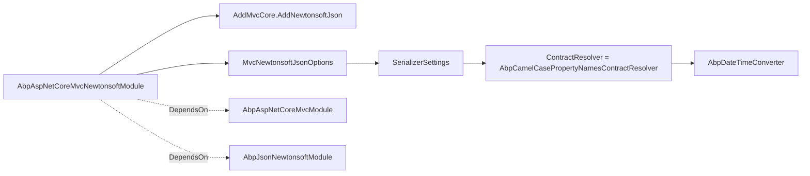

`Volo.Abp.AspNetCore.Mvc.NewtonsoftJson` is the smallest "MVC-flavoured"
package in the ABP Framework: one module class, one `[DependsOn]` graph,
one `AddAbpOptions<MvcNewtonsoftJsonOptions>` block. It exists to give
applications that need JSON.NET — for compatibility with older client
contracts, polymorphic converters, custom resolvers — a one-line on-switch
that integrates with the rest of ABP's serializer infrastructure.

This page explains why the package exists at all, what the module does,
where `AbpCamelCasePropertyNamesContractResolver` and
`AbpDateTimeConverter` come from, and how MVC's default
`System.Text.Json` path differs.

## Why an opt-in package?

`Volo.Abp.AspNetCore.Mvc` defaults to `System.Text.Json` via
`AbpJsonSystemTextJsonModule` (see the
[`[DependsOn]` graph](/aspnetcore/mvc)). The MVC module wires the
serializer through a private helper,
`framework/src/Volo.Abp.AspNetCore.Mvc/Volo/Abp/AspNetCore/Mvc/Json/MvcCoreBuilderExtensions.cs`:

```csharp
public static IMvcCoreBuilder AddAbpJson(this IMvcCoreBuilder builder)
{
    builder.Services.AddAbpOptions<JsonOptions>()
        .Configure<IServiceProvider>((options, rootServiceProvider) =>
        {
            options.JsonSerializerOptions.ReadCommentHandling = JsonCommentHandling.Skip;
            options.JsonSerializerOptions.AllowTrailingCommas = true;

            options.JsonSerializerOptions.Converters.Add(new AbpStringToEnumFactory());
            options.JsonSerializerOptions.Converters.Add(new AbpStringToBooleanConverter());
            options.JsonSerializerOptions.Converters.Add(new AbpStringToGuidConverter());
            options.JsonSerializerOptions.Converters.Add(new AbpNullableStringToGuidConverter());
            options.JsonSerializerOptions.Converters.Add(new ObjectToInferredTypesConverter());

            options.JsonSerializerOptions.TypeInfoResolver = new AbpDefaultJsonTypeInfoResolver(rootServiceProvider
                .GetRequiredService<IOptions<AbpSystemTextJsonSerializerModifiersOptions>>());

            var dateTimeConverter = rootServiceProvider.GetRequiredService<AbpDateTimeConverter>();
            var nullableDateTimeConverter = rootServiceProvider.GetRequiredService<AbpNullableDateTimeConverter>();

            options.JsonSerializerOptions.TypeInfoResolver.As<AbpDefaultJsonTypeInfoResolver>().Modifiers.Add(
                new AbpDateTimeConverterModifier(dateTimeConverter, nullableDateTimeConverter)
                    .CreateModifyAction());
        });

    return builder;
}
```

So out of the box ABP applications get System.Text.Json with ABP's string-to-X
converters, the `AbpDefaultJsonTypeInfoResolver` (which folds in
`AbpSystemTextJsonSerializerModifiersOptions`) and the
`AbpDateTimeConverterModifier` that applies `AbpDateTimeConverter` to every
`DateTime` / `DateTime?` property.

For most teams that is enough. The Newtonsoft package exists for the cases
where it isn't:

| Situation | Why you need Newtonsoft |
| --- | --- |
| Legacy clients send `{"$type": "..."}` polymorphic payloads | `System.Text.Json` polymorphism is opt-in per type and stricter; `JsonSerializerSettings.TypeNameHandling = TypeNameHandling.Auto` is still the simplest match. |
| Existing custom `JsonConverter<T>` libraries | Most pre-`net8.0` libraries target `Newtonsoft.Json`. |
| You return `JObject` / `JArray` from controllers | These types are JSON.NET specific. |
| You need `[JsonExtensionData]` semantics that differ from `System.Text.Json` | Slight behavioural differences around `IDictionary<string, object>`. |

## Module entry point

`framework/src/Volo.Abp.AspNetCore.Mvc.NewtonsoftJson/Volo/Abp/AspNetCore/Mvc/NewtonsoftJson/AbpAspNetCoreMvcNewtonsoftModule.cs`
is the entire package:

```csharp
[DependsOn(typeof(AbpJsonNewtonsoftModule), typeof(AbpAspNetCoreMvcModule))]
public class AbpAspNetCoreMvcNewtonsoftModule : AbpModule
{
    public override void ConfigureServices(ServiceConfigurationContext context)
    {
        context.Services.AddMvcCore().AddNewtonsoftJson();

        context.Services.AddAbpOptions<MvcNewtonsoftJsonOptions>()
            .Configure<IServiceProvider>((options, rootServiceProvider) =>
            {
                options.SerializerSettings.ContractResolver =
                    new AbpCamelCasePropertyNamesContractResolver(rootServiceProvider
                        .GetRequiredService<AbpDateTimeConverter>());
            });
    }
}
```

Two `[DependsOn]` arrows make the integration work:

- `AbpAspNetCoreMvcModule` — the package builds on top of the MVC stack
  documented on [/aspnetcore/mvc](/aspnetcore/mvc). Without it, there is no
  `MvcOptions` to mutate.
- `AbpJsonNewtonsoftModule` — the broader ABP package
  (`Volo.Abp.Json.Newtonsoft`) that registers `AbpDateTimeConverter`,
  `AbpCamelCasePropertyNamesContractResolver` and the
  `IJsonSerializer` Newtonsoft adapter.

## Two registrations

`AbpAspNetCoreMvcNewtonsoftModule.ConfigureServices` performs exactly two
operations:

1. `services.AddMvcCore().AddNewtonsoftJson();` — the stock ASP.NET Core call
   that swaps `SystemTextJsonInputFormatter` / `SystemTextJsonOutputFormatter`
   for the `NewtonsoftJsonInputFormatter` and `NewtonsoftJsonOutputFormatter`.
2. Configure `MvcNewtonsoftJsonOptions.SerializerSettings.ContractResolver`
   to `AbpCamelCasePropertyNamesContractResolver`, sharing the
   `AbpDateTimeConverter` instance pulled from the root service provider.

That's the full surface area of the package.



## `AbpCamelCasePropertyNamesContractResolver`

The resolver is in the broader Newtonsoft module —
`framework/src/Volo.Abp.Json.Newtonsoft/Volo/Abp/Json/Newtonsoft/AbpCamelCasePropertyNamesContractResolver.cs`
— but the MVC integration depends on it:

```csharp
public class AbpCamelCasePropertyNamesContractResolver : CamelCasePropertyNamesContractResolver
{
    private readonly AbpDateTimeConverter _dateTimeConverter;

    public AbpCamelCasePropertyNamesContractResolver(AbpDateTimeConverter dateTimeConverter)
    {
        _dateTimeConverter = dateTimeConverter;

        NamingStrategy = new CamelCaseNamingStrategy
        {
            ProcessDictionaryKeys = false
        };
    }

    protected override JsonProperty CreateProperty(MemberInfo member, MemberSerialization memberSerialization)
    {
        var property = base.CreateProperty(member, memberSerialization);

        if (AbpDateTimeConverter.ShouldNormalize(member, property))
        {
            property.Converter = _dateTimeConverter;
        }

        return property;
    }
}
```

Two ABP-specific behaviours bolted onto JSON.NET's stock resolver:

- **Naming strategy** — camelCase **but `ProcessDictionaryKeys = false`** so
  dictionaries keep their declared keys. This matters for the
  `ApplicationSettingConfigurationDto.Values` and `GrantedPolicies` payloads
  documented on the [Contracts page](/aspnetcore/mvc-contracts), whose keys
  are fully-qualified identifiers (`"MyApp.OrderManagement.Read"`) that must
  not be lower-cased.
- **DateTime converter attachment** — when the resolver builds the
  `JsonProperty` for a `DateTime` member that should be normalized
  (`AbpDateTimeConverter.ShouldNormalize` checks ABP attributes plus the
  `IClock` policy), it assigns `AbpDateTimeConverter` to
  `property.Converter` directly. This avoids having to add the converter to
  `SerializerSettings.Converters` globally, which would also apply to
  cases ABP wants to skip.

The companion `AbpDateTimeConverter`
(`framework/src/Volo.Abp.Json.Newtonsoft/Volo/Abp/Json/Newtonsoft/AbpDateTimeConverter.cs`)
keeps the same wire format as the System.Text.Json side:

```csharp
public class AbpDateTimeConverter : DateTimeConverterBase, ITransientDependency
{
    private const string DefaultDateTimeFormat = "yyyy'-'MM'-'dd'T'HH':'mm':'ss.FFFFFFFK";
    private readonly DateTimeStyles _dateTimeStyles = DateTimeStyles.RoundtripKind;
    private readonly CultureInfo _culture = CultureInfo.InvariantCulture;

    public AbpDateTimeConverter(
        IClock clock,
        IOptions<AbpJsonOptions> options,
        ICurrentTimezoneProvider currentTimezoneProvider,
        ITimezoneProvider timezoneProvider) { /* … */ }
}
```

So whether the request body was deserialized via `System.Text.Json` or
Newtonsoft, the resulting `DateTime` goes through `IClock.Normalize` and
`ICurrentTimezoneProvider` the same way. The `AbpDateTimeModelBinder` on
the [MVC page](/aspnetcore/mvc) applies the same policy at the MVC binding
layer.

## What about the rest of the Newtonsoft module?

`Volo.Abp.Json.Newtonsoft` also ships:

| File | Type | Role |
| --- | --- | --- |
| `AbpDefaultContractResolver.cs` | `AbpDefaultContractResolver` | Same idea as the camelCase resolver but with `DefaultNamingStrategy`. |
| `AbpJsonNewtonsoftModule.cs` | `AbpJsonNewtonsoftModule` | The base module pulled in by `[DependsOn]`. |
| `AbpNewtonsoftJsonSerializer.cs` | `AbpNewtonsoftJsonSerializer` | Implementation of `IJsonSerializer` (the abstraction the [Core middleware](/aspnetcore/aspnetcore-core) uses to serialize the `RemoteServiceErrorResponse`). |
| `AbpNewtonsoftJsonSerializerOptions.cs` | `AbpNewtonsoftJsonSerializerOptions` | `Converters`, `JsonSerializerSettingsAction` to mutate the singleton settings. |

Referencing `Volo.Abp.AspNetCore.Mvc.NewtonsoftJson` brings all of these in
transitively because the module's `[DependsOn]` covers
`AbpJsonNewtonsoftModule`.

## Effect on the error pipeline

`AbpExceptionHandlingMiddleware` (documented on the
[Core page](/aspnetcore/aspnetcore-core)) writes its response with
`IJsonSerializer.Serialize`:

```csharp
await httpContext.Response.WriteAsync(
    jsonSerializer.Serialize(
        new RemoteServiceErrorResponse(
            errorInfoConverter.Convert(exception, options => { /* … */ })
        )
    )
);
```

`IJsonSerializer` is provided by whichever JSON module wins last —
ABP's conventional registrar respects the last `services.AddSingleton<…>`
call. By depending on `AbpAspNetCoreMvcNewtonsoftModule`, the Newtonsoft
`AbpNewtonsoftJsonSerializer` becomes the implementation, so the error
envelope, audit log payloads and outbox messages all switch to JSON.NET in
one move. There is no risk of two serializers disagreeing on field names
or `DateTime` format.

## Side-by-side behaviour

| Concern | System.Text.Json default | Newtonsoft.Json (this package) |
| --- | --- | --- |
| Input/output formatter | `SystemTextJsonInput/OutputFormatter` | `NewtonsoftJsonInput/OutputFormatter` |
| Naming policy | camelCase via `JsonNamingPolicy.CamelCase` | camelCase via `CamelCaseNamingStrategy { ProcessDictionaryKeys = false }` |
| `DateTime` policy | `AbpDateTimeConverterModifier` on `AbpDefaultJsonTypeInfoResolver` | `AbpDateTimeConverter` attached per-property by the resolver |
| `IJsonSerializer` impl | `AbpSystemTextJsonSerializer` | `AbpNewtonsoftJsonSerializer` |
| String-to-X converters | `AbpStringToEnumFactory`, `AbpStringToBooleanConverter`, `AbpStringToGuidConverter`, `AbpNullableStringToGuidConverter` | Standard Newtonsoft string parsing |
| Trailing commas / comments in body | `AllowTrailingCommas`, `ReadCommentHandling = Skip` | Default JSON.NET behaviour |
| Polymorphic type names | Off by default | `TypeNameHandling` available |
| Dictionary key case | Preserved | Preserved |

## How to opt in

In your module:

```csharp
[DependsOn(
    typeof(AbpAspNetCoreMvcModule),
    typeof(AbpAspNetCoreMvcNewtonsoftModule)
)]
public class MyWebModule : AbpModule
{
    public override void ConfigureServices(ServiceConfigurationContext context)
    {
        Configure<MvcNewtonsoftJsonOptions>(options =>
        {
            options.SerializerSettings.Converters.Add(new MyDomainConverter());
            options.SerializerSettings.TypeNameHandling = TypeNameHandling.Auto;
        });
    }
}
```

`Configure<MvcNewtonsoftJsonOptions>` is the standard
`IOptions<MvcNewtonsoftJsonOptions>` integration; you can layer your
serializer settings without touching ABP's resolver. The
`AbpAspNetCoreMvcNewtonsoftModule.ConfigureServices` block runs first
because it uses `AddAbpOptions` (which `PostConfigure`s) so your overrides
win.

<Warning>
Once you opt in, **do not** also call `AddSystemTextJson` or layer
`Configure<JsonOptions>` callbacks — the second call overwrites the
contract resolver and you'll see camelCase + PascalCase serialization for
different DTOs in the same response. Pick one. If you mix DTOs that have
different policies, register a custom `JsonConverter<T>` instead.
</Warning>

## What this package does NOT touch

- **Model binding** — `AbpDateTimeModelBinder` and friends (documented on the
  [MVC page](/aspnetcore/mvc)) operate on query strings and form data; they
  are independent of the body serializer.
- **OpenAPI / Swagger** — the schema generation reads `MvcOptions`, not
  `MvcNewtonsoftJsonOptions`. Tools like Swashbuckle need their own
  Newtonsoft compatibility shim
  (`Swashbuckle.AspNetCore.Newtonsoft`).
- **Client proxies** — the [Mvc.Client](/aspnetcore/mvc-client) family uses
  `IJsonSerializer` (resolved via DI), so switching to Newtonsoft on the
  server does *not* require switching on the client.
- **OAuth / token serialization** — those handlers use their own
  serializers, configured in `Volo.Abp.AspNetCore.Authentication.*`.

## Cross-references

- [MVC package](/aspnetcore/mvc) — the System.Text.Json defaults this
  module overrides.
- [Core middleware](/aspnetcore/aspnetcore-core) — `AbpExceptionHandlingMiddleware`
  uses `IJsonSerializer`, which becomes Newtonsoft once this module is in
  the graph.
- [Mvc.Contracts](/aspnetcore/mvc-contracts) — DTOs whose
  dictionary keys (`GrantedPolicies`, `Setting.Values`) must keep their
  case, which is why `ProcessDictionaryKeys = false` matters.
- [HTTP overview](/http/overview) — the client-side serialization path.
- [App bootstrap](/core/abp-application-and-bootstrap) — module load order
  determining which `IJsonSerializer` wins.
- [Authorization](/security/authorization) — `AbpAuthorizationException`
  responses go through this same serializer.
- [UI MVC overview](/ui-mvc/overview) — Razor Page responses also pass
  through the formatter; pick the JSON stack you want once.

## Summary

`Volo.Abp.AspNetCore.Mvc.NewtonsoftJson` is a one-class module whose entire
job is to call `AddMvcCore().AddNewtonsoftJson()` and replace the
`MvcNewtonsoftJsonOptions.SerializerSettings.ContractResolver` with
`AbpCamelCasePropertyNamesContractResolver`. Behind that single switch,
ABP gets a camelCase resolver that preserves dictionary keys, a per-property
`AbpDateTimeConverter` that respects `IClock` and the user's timezone, and
an `IJsonSerializer` adapter that aligns every other JSON consumer in the
process (audit logs, error envelopes, distributed events) with the same
JSON.NET pipeline.
