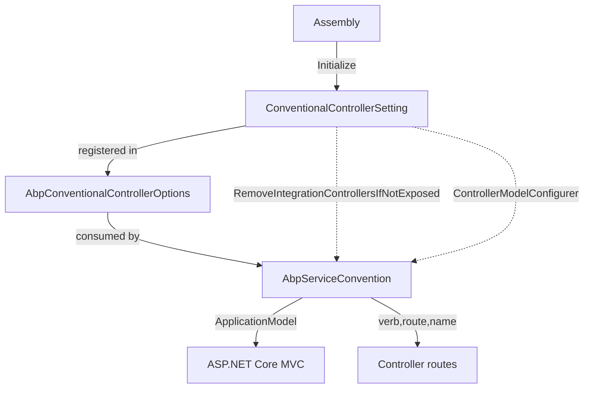
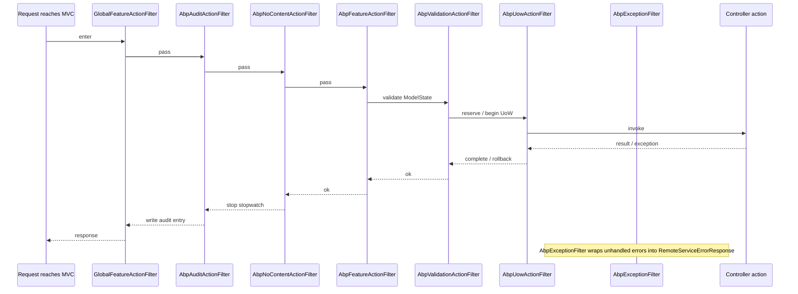
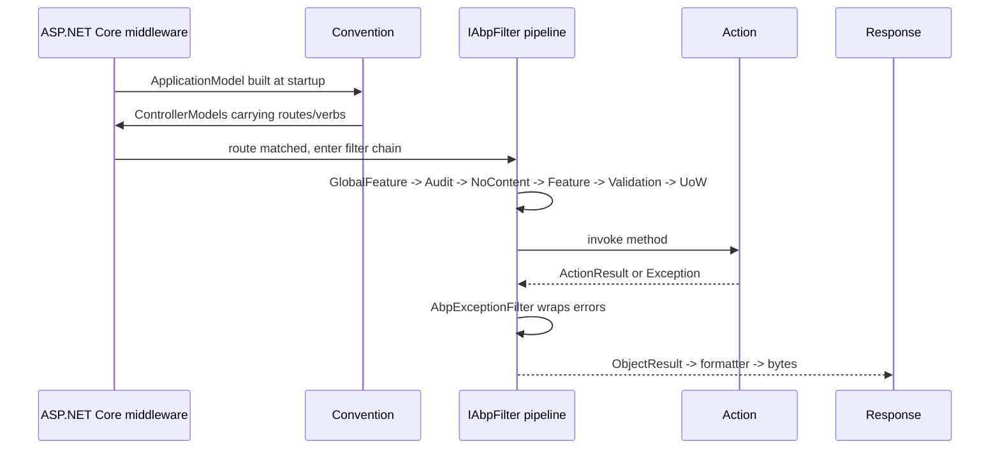

`Volo.Abp.AspNetCore.Mvc` is the package that makes an ABP module's
application services look like ASP.NET Core controllers. It contributes
`AbpAspNetCoreMvcModule`, the conventional-controller infrastructure, the
`IAbpFilter` family (exception, UoW, audit, feature, validation,
authorization), several model binders for ABP-specific types, the API
description model providers that feed OpenAPI / generated client proxies,
and the `AbpController` / `AbpControllerBase` base classes that ABP-aware
controllers inherit from.

This page goes layer by layer. The two prior pages
([Abstractions](/aspnetcore/aspnetcore-abstractions),
[Core](/aspnetcore/aspnetcore-core)) explain the middleware pipeline that
sits beneath this layer; here we focus on what happens *inside* the MVC
endpoint.

## Module entry point

`framework/src/Volo.Abp.AspNetCore.Mvc/Volo/Abp/AspNetCore/Mvc/AbpAspNetCoreMvcModule.cs`
is the entire wiring story. Its dependency list connects MVC to ABP's
broader stack:

```csharp
[DependsOn(
    typeof(AbpAspNetCoreModule),
    typeof(AbpLocalizationModule),
    typeof(AbpApiVersioningAbstractionsModule),
    typeof(AbpAspNetCoreMvcContractsModule),
    typeof(AbpUiNavigationModule),
    typeof(AbpGlobalFeaturesModule),
    typeof(AbpDddApplicationModule),
    typeof(AbpJsonSystemTextJsonModule)
)]
public class AbpAspNetCoreMvcModule : AbpModule
```

`PreConfigureServices` registers a conventional registrar
(`AbpAspNetCoreMvcConventionalRegistrar`) and tells the dynamic-proxy system
to never proxy `ControllerBase`, `PageModel` or `ViewComponent`:

```csharp
public override void PreConfigureServices(ServiceConfigurationContext context)
{
    DynamicProxyIgnoreTypes.Add<ControllerBase>();
    DynamicProxyIgnoreTypes.Add<PageModel>();
    DynamicProxyIgnoreTypes.Add<ViewComponent>();
    context.Services.AddConventionalRegistrar(new AbpAspNetCoreMvcConventionalRegistrar());
}
```

`ConfigureServices` does the heavy lifting. The highlights:

- `AddMvcCore` registers `AbpAutoValidateAntiforgeryTokenAttribute` as a
  global filter.
- `AddMvc().AddDataAnnotationsLocalization(...)` wires localization through
  `AbpMvcDataAnnotationsLocalizationOptions.AssemblyResources`.
- `AddControllersAsServices` + `AddViewComponentsAsServices` make controllers
  and view components resolvable through ABP's container.
- `Replace(ServiceDescriptor.Singleton<IPageModelActivatorProvider, ServiceBasedPageModelActivatorProvider>())`
  pushes Razor Pages through the same path.
- An `ApplicationPartManager` feature provider —
  `AbpConventionalControllerFeatureProvider` — is added so application
  service types annotated with `[RemoteService]` end up as MVC controllers.
- An MVC-options post-configure calls
  `MvcOptions.AddAbp(IServiceCollection services)` — a private extension
  declared at `Volo/Abp/AspNetCore/Mvc/AbpMvcOptionsExtensions.cs` that
  registers the convention, the filter family, the model binders, the
  metadata providers and the formatters.

```csharp
public static void AddAbp(this MvcOptions options, IServiceCollection services)
{
    AddConventions(options, services);
    AddActionFilters(options);
    AddPageFilters(options);
    AddModelBinders(options);
    AddMetadataProviders(options, services);
    AddFormatters(options);
}
```

The filter list — added via `AddService` so they participate in DI — is the
canonical ABP filter pipeline order:

```csharp
private static void AddActionFilters(MvcOptions options)
{
    options.Filters.AddService(typeof(GlobalFeatureActionFilter));
    options.Filters.AddService(typeof(AbpAuditActionFilter));
    options.Filters.AddService(typeof(AbpNoContentActionFilter));
    options.Filters.AddService(typeof(AbpFeatureActionFilter));
    options.Filters.AddService(typeof(AbpValidationActionFilter));
    options.Filters.AddService(typeof(AbpUowActionFilter));
    options.Filters.AddService(typeof(AbpExceptionFilter));
}
```

## `AbpAspNetCoreMvcOptions`

`framework/src/Volo.Abp.AspNetCore.Mvc/Volo/Abp/AspNetCore/Mvc/AbpAspNetCoreMvcOptions.cs`:

```csharp
public class AbpAspNetCoreMvcOptions
{
    public bool? MinifyGeneratedScript { get; set; }
    public AbpConventionalControllerOptions ConventionalControllers { get; }
    public HashSet<Type> IgnoredControllersOnModelExclusion { get; }
    public HashSet<Type> ControllersToRemove { get; }
    public bool ExposeIntegrationServices { get; set; } = false;
    public bool ExposeClientProxyServices { get; set; } = false;
    public bool AutoModelValidation { get; set; }
    public bool ChangeControllerModelApiExplorerGroupName { get; set; }

    public AbpAspNetCoreMvcOptions()
    {
        ConventionalControllers = new AbpConventionalControllerOptions();
        IgnoredControllersOnModelExclusion = new HashSet<Type>();
        ControllersToRemove = new HashSet<Type>();
        AutoModelValidation = true;
        ChangeControllerModelApiExplorerGroupName = true;
    }
}
```

Three switches deserve attention:

| Switch | Effect |
| --- | --- |
| `ExposeIntegrationServices` | If `false` (the default), controllers marked `[IntegrationService]` are removed from the application model by `AbpServiceConvention.RemoveIntegrationControllersIfNotExposed`. |
| `ExposeClientProxyServices` | Same idea for proxy-only services. |
| `AutoModelValidation` | When `true`, `AbpValidationActionFilter` calls `IModelStateValidator.Validate` on every controller action. |

## Conventional controllers — `ConventionalControllerSetting`

The dynamic-controller story starts at
`framework/src/Volo.Abp.AspNetCore.Mvc/Volo/Abp/AspNetCore/Mvc/Conventions/ConventionalControllerSetting.cs`:

```csharp
public class ConventionalControllerSetting
{
    [NotNull] public Assembly Assembly { get; }
    [NotNull] internal HashSet<Type> ControllerTypes { get; }
    public bool? UseV3UrlStyle { get; set; }
    [NotNull] public string RootPath { get; set; }
    [NotNull] public string RemoteServiceName { get; set; }
    public Func<Type, bool>? TypePredicate { get; set; }
    public ApplicationServiceTypes ApplicationServiceTypes { get; set; } = ApplicationServiceTypes.All;
    public Action<ControllerModel>? ControllerModelConfigurer { get; set; }
    public Func<UrlControllerNameNormalizerContext, string>? UrlControllerNameNormalizer { get; set; }
    public Func<UrlActionNameNormalizerContext, string>? UrlActionNameNormalizer { get; set; }
    public List<ApiVersion> ApiVersions { get; }
    public Action<MvcApiVersioningOptions>? MvcApiVersioningConfigurer { get; set; }
    public List<Type> GetControllerTypes() => ControllerTypes.ToImmutableList();
}
```

`Initialize()` scans the assembly:

```csharp
public void Initialize()
{
    var types = Assembly.GetTypes()
        .Where(IsRemoteService)
        .Where(IsPreferredApplicationServiceType)
        .WhereIf(TypePredicate != null, TypePredicate!);
    foreach (var type in types) ControllerTypes.Add(type);
}

private static bool IsRemoteService(Type type)
{
    if (!type.IsPublic || type.IsAbstract || type.IsGenericType) return false;
    var remoteServiceAttr = ReflectionHelper.GetSingleAttributeOrDefault<RemoteServiceAttribute>(type);
    if (remoteServiceAttr != null && !remoteServiceAttr.IsEnabledFor(type)) return false;
    if (typeof(IRemoteService).IsAssignableFrom(type)) return true;
    return false;
}
```

A type qualifies if it implements the `IRemoteService` marker (which every
`ApplicationService` does by inheritance). The
`[RemoteService(IsEnabled = false)]` attribute opts out. The list is then
filtered by `ApplicationServiceTypes` — `All`, `ApplicationServices` (skip
`[IntegrationService]`) or `IntegrationServices` (only those).

You register a setting via `AbpConventionalControllerOptions.Create`:

```csharp
public AbpConventionalControllerOptions Create(
    Assembly assembly,
    Action<ConventionalControllerSetting>? optionsAction = null)
{
    var setting = new ConventionalControllerSetting(
        assembly,
        ModuleApiDescriptionModel.DefaultRootPath,
        ModuleApiDescriptionModel.DefaultRemoteServiceName);

    optionsAction?.Invoke(setting);
    setting.Initialize();
    ConventionalControllerSettings.Add(setting);
    return this;
}
```

So in a module you write:

```csharp
Configure<AbpAspNetCoreMvcOptions>(options =>
{
    options.ConventionalControllers.Create(typeof(MyModule).Assembly, setting =>
    {
        setting.RootPath = "shop";
        setting.RemoteServiceName = "Shop";
    });
});
```

## `AbpServiceConvention`

The convention that turns settings into controllers lives at
`framework/src/Volo.Abp.AspNetCore.Mvc/Volo/Abp/AspNetCore/Mvc/Conventions/AbpServiceConvention.cs`:

```csharp
public void Apply(ApplicationModel application)
{
    ApplyForControllers(application);
}

protected virtual void ApplyForControllers(ApplicationModel application)
{
    RemoveDuplicateControllers(application);
    RemoveIntegrationControllersIfNotExposed(application);

    foreach (var controller in GetControllers(application))
    {
        var controllerType = controller.ControllerType.AsType();
        var configuration = GetControllerSettingOrNull(controllerType);

        if (ImplementsRemoteServiceInterface(controllerType))
        {
            controller.ControllerName = controller.ControllerName.RemovePostFix(ApplicationService.CommonPostfixes);
            configuration?.ControllerModelConfigurer?.Invoke(controller);
            ConfigureRemoteService(controller, configuration);
        }
        else
        {
            var remoteServiceAttr = ReflectionHelper.GetSingleAttributeOrDefault<RemoteServiceAttribute>(controllerType.GetTypeInfo());
            if (remoteServiceAttr != null && remoteServiceAttr.IsEnabledFor(controllerType))
            {
                ConfigureRemoteService(controller, configuration);
            }
        }
    }
}
```

`ConfigureRemoteService` is the function that:

- Trims `"AppService"` / `"ApplicationService"` postfixes from the URL.
- Computes a route from `RootPath`, the controller name and the action name
  using `IConventionalRouteBuilder`.
- Decides the HTTP verb from method-name prefixes (`Get*`, `Update*`,
  `Delete*`, `Create*` etc).
- Strips suffix patterns listed in
  `AbpConventionalControllerOptions.IgnoredUrlSuffixesInControllerNames`
  (default `{"Integration"}`).
- Calls `ControllerModelConfigurer` and per-setting normalizers
  (`UrlControllerNameNormalizer`, `UrlActionNameNormalizer`).



## The `[RemoteService]` attribute

The `[RemoteService]` attribute (in `Volo.Abp.Http`) signals that an
application service or controller should be exposed over HTTP. The
attribute carries an `IsEnabled` switch and module-level
`IsEnabledFor(serviceType)` logic. Convention recap:

- A type that **implements `IRemoteService`** is auto-exposed.
- A type with `[RemoteService(IsEnabled = false)]` is hidden.
- A type with `[RemoteService(IsEnabled = true)]` is exposed even if it
  does not implement `IRemoteService`.
- A type with `[IntegrationService]` is hidden unless
  `AbpAspNetCoreMvcOptions.ExposeIntegrationServices = true`.

`AbpConventionalApiControllerSpecification`
(`Volo/Abp/AspNetCore/Mvc/Conventions/AbpConventionalApiControllerSpecification.cs`)
holds the logic that decides whether a type should appear in the
`ApplicationApiDescriptionModel` produced by
`AspNetCoreApiDescriptionModelProvider`.

## Action-filter family

Every ABP filter implements `IAbpFilter` (see
[Abstractions](/aspnetcore/aspnetcore-abstractions)) and is registered as a
transient DI service.

### `AbpExceptionFilter`

`framework/src/Volo.Abp.AspNetCore.Mvc/Volo/Abp/AspNetCore/Mvc/ExceptionHandling/AbpExceptionFilter.cs`:

```csharp
protected virtual bool ShouldHandleException(ExceptionContext context)
{
    if (context.ExceptionHandled) return false;
    if (context.ActionDescriptor.IsControllerAction() &&
        context.ActionDescriptor.HasObjectResult()) return true;
    if (context.HttpContext.Request.CanAccept(MimeTypes.Application.Json)) return true;
    if (context.HttpContext.Request.IsAjax()) return true;
    return false;
}
```

When it takes over, it converts the exception with
`IExceptionToErrorInfoConverter`, logs through `IExceptionNotifier`, sets
the `AbpHttpConsts.AbpErrorFormat` response header, sets the status code via
`IHttpExceptionStatusCodeFinder`, and assigns a wrapped result:

```csharp
context.Result = new ObjectResult(new RemoteServiceErrorResponse(remoteServiceErrorInfo));
```

`RemoteServiceErrorInfo` and `RemoteServiceErrorResponse` live in
`Volo.Abp.Http`; they are the wire format every ABP HTTP client (see
[/http/overview](/http/overview)) understands.

### `AbpValidationActionFilter`

`framework/src/Volo.Abp.AspNetCore.Mvc/Volo/Abp/AspNetCore/Mvc/Validation/AbpValidationActionFilter.cs`
runs three checks before validating:

1. Action is a controller action with an `ObjectResult`.
2. `AbpAspNetCoreMvcOptions.AutoModelValidation` is `true`.
3. No `[DisableValidation]` on the action, controller or effective method.

It then calls `IModelStateValidator.Validate(context.ModelState)`. If the
controller implements `IValidationEnabled` it additionally invokes
`IMethodInvocationValidator.ValidateAsync` with the action arguments:

```csharp
await context.GetRequiredService<IMethodInvocationValidator>().ValidateAsync(
    new MethodInvocationValidationContext(context.Controller, methodInfo, parameterValues));
```

### `AbpUowActionFilter`

The MVC counterpart of `AbpUnitOfWorkMiddleware`. It pushes
`AbpActionInfoInHttpContext.IsObjectResult` into `HttpContext.Items` so
`AbpExceptionHandlingMiddleware` knows whether to wrap the eventual error:

```csharp
context.HttpContext.Items["_AbpActionInfo"] = new AbpActionInfoInHttpContext
{
    IsObjectResult = context.ActionDescriptor.HasObjectResult()
};
```

It checks `[UnitOfWork]`, falls back to `AbpUnitOfWorkDefaultOptions`
(non-`GET` is transactional by default), and either binds the reserved
middleware-side UoW:

```csharp
if (unitOfWorkManager.TryBeginReserved(UnitOfWork.UnitOfWorkReservationName, options))
{
    var result = await next();
    if (Succeed(result)) await SaveChangesAsync(...);
    else await RollbackAsync(...);
    return;
}
```

…or begins a new one:

```csharp
using (var uow = unitOfWorkManager.Begin(options))
{
    var result = await next();
    if (Succeed(result)) await uow.CompleteAsync(...);
    else await uow.RollbackAsync(...);
}
```

### `AbpAuditActionFilter`

`framework/src/Volo.Abp.AspNetCore.Mvc/Volo/Abp/AspNetCore/Mvc/Auditing/AbpAuditActionFilter.cs`
turns each controller call into a `AuditLogActionInfo` entry on the current
`IAuditingManager` scope (opened by `AbpAuditingMiddleware`):

```csharp
using (AbpCrossCuttingConcerns.Applying(context.Controller, AbpCrossCuttingConcerns.Auditing))
{
    var stopwatch = Stopwatch.StartNew();
    try
    {
        var result = await next();
        if (result.Exception != null && !auditLog!.Exceptions.Contains(result.Exception))
            auditLog!.Exceptions.Add(result.Exception);
    }
    finally
    {
        stopwatch.Stop();
        if (auditLogAction != null)
        {
            auditLogAction.ExecutionDuration = (int)stopwatch.Elapsed.TotalMilliseconds;
            auditLog!.Actions.Add(auditLogAction);
        }
    }
}
```

Integration services are skipped unless
`AbpAuditingOptions.IsEnabledForIntegrationServices = true`.

### `AbpFeatureActionFilter`

Tiny wrapper around `IMethodInvocationFeatureCheckerService.CheckAsync`,
which enforces `[RequiresFeature]` declarations on the action's method:

```csharp
using (AbpCrossCuttingConcerns.Applying(context.Controller, AbpCrossCuttingConcerns.FeatureChecking))
{
    var methodInvocationFeatureCheckerService = context.GetRequiredService<IMethodInvocationFeatureCheckerService>();
    await methodInvocationFeatureCheckerService.CheckAsync(new MethodInvocationFeatureCheckerContext(methodInfo));
    await next();
}
```

### Authorization

Authorization is handled through the standard ASP.NET Core
`[Authorize]` pipeline plus ABP's `[Authorize]`/`[AllowAnonymous]`
discovery in `AbpServiceConvention.ConfigureApiExplorer`. Authorization
exceptions are routed through `IAbpAuthorizationExceptionHandler` (see
[`/security/authorization`](/security/authorization)) which the
[core middleware](/aspnetcore/aspnetcore-core) page documents.

### Filter execution order



## Model binders

`Volo/Abp/AspNetCore/Mvc/AbpMvcOptionsExtensions.cs` inserts three model
binders at the front of `ModelBinderProviders`:

```csharp
options.ModelBinderProviders.Insert(0, new AbpDateTimeModelBinderProvider());
options.ModelBinderProviders.Insert(1, new AbpExtraPropertiesDictionaryModelBinderProvider());
options.ModelBinderProviders.Insert(2, new AbpRemoteStreamContentModelBinderProvider());
```

### `AbpDateTimeModelBinder`

`framework/src/Volo.Abp.AspNetCore.Mvc/Volo/Abp/AspNetCore/Mvc/ModelBinding/AbpDateTimeModelBinder.cs`:

```csharp
public async Task BindModelAsync(ModelBindingContext bindingContext)
{
    await _dateTimeModelBinder.BindModelAsync(bindingContext);

    if (!bindingContext.Result.IsModelSet || bindingContext.Result.Model is not DateTime dateTime) return;

    if (dateTime.Kind == DateTimeKind.Unspecified &&
        _clock.SupportsMultipleTimezone &&
        !_currentTimezoneProvider.TimeZone.IsNullOrWhiteSpace())
    {
        var timezoneInfo = _timezoneProvider.GetTimeZoneInfo(_currentTimezoneProvider.TimeZone);
        dateTime = new DateTimeOffset(dateTime, timezoneInfo.GetUtcOffset(dateTime)).UtcDateTime;
    }

    bindingContext.Result = ModelBindingResult.Success(_clock.Normalize(dateTime));
}
```

It calls `IClock.Normalize` so all binding goes through the same timezone
policy the rest of ABP uses.

### `AbpExtraPropertyModelBinder`

Reads `__extraProperties` form fields / JSON keys into an
`ExtraPropertyDictionary`, the storage `IHasExtraProperties` uses. The
companion provider, `AbpExtraPropertiesDictionaryModelBinderProvider`,
checks `MvcOptions.ValueProviderFactories` and the model type for
`ExtraPropertyDictionary`.

### `AbpRemoteStreamContentModelBinder`

Maps `IRemoteStreamContent` and `IEnumerable<IRemoteStreamContent>` action
parameters to `IFormFile` / `IFormFileCollection`. The
`RemoteStreamContentOutputFormatter` (inserted at output-formatter index 0)
streams them back.

```csharp
options.OutputFormatters.Insert(0, new RemoteStreamContentOutputFormatter());
```

## `AbpController` / `AbpControllerBase`

`framework/src/Volo.Abp.AspNetCore.Mvc/Volo/Abp/AspNetCore/Mvc/AbpController.cs`
is the base type for view-returning controllers; `AbpControllerBase` is the
API counterpart. Both inherit ABP's cross-cutting properties via
`IAvoidDuplicateCrossCuttingConcerns` so filters that already ran (because
the controller called `IObjectMapper.Map<X>(y)` which internally also runs
audit logic) don't double up.

```csharp
public abstract class AbpController : Controller, IAvoidDuplicateCrossCuttingConcerns
{
    public IAbpLazyServiceProvider LazyServiceProvider { get; set; } = default!;
    protected IUnitOfWorkManager UnitOfWorkManager => LazyServiceProvider.LazyGetRequiredService<IUnitOfWorkManager>();
    protected IObjectMapper ObjectMapper => LazyServiceProvider.LazyGetService<IObjectMapper>(...);
    protected IGuidGenerator GuidGenerator => LazyServiceProvider.LazyGetService<IGuidGenerator>(SimpleGuidGenerator.Instance);
```

The pattern — `LazyServiceProvider.LazyGetRequiredService<T>` — is the same
one used by `ApplicationService` and Razor `AbpPageModel`, so common
collaborators stay symmetrical across MVC, Razor Pages and services.

## API description providers

`AspNetCoreApiDescriptionModelProvider`
(`framework/src/Volo.Abp.AspNetCore.Mvc/Volo/Abp/AspNetCore/Mvc/AspNetCoreApiDescriptionModelProvider.cs`)
implements `IApiDescriptionModelProvider` from `Volo.Abp.Http.Modeling`. It
walks `IApiDescriptionGroupCollectionProvider`, applies
`AbpConventionalApiControllerSpecification`, and yields an
`ApplicationApiDescriptionModel`. That model is the basis for:

- **`/api/abp/api-definition`** — the meta-endpoint that ABP's TypeScript /
  C# / Angular client proxies fetch to generate stubs.
- The OpenAPI schema customizations applied through
  `AspNetCoreApiDescriptionModelProviderOptions`.

The interface itself lives in the broader Http modeling module, but this is
the implementation MVC plugs into the ASP.NET Core API explorer.

## `AbpMvcActionDescriptorProvider`

`framework/src/Volo.Abp.AspNetCore.Mvc/Volo/Abp/AspNetCore/Mvc/AbpMvcActionDescriptorProvider.cs`
runs late in the action-descriptor pipeline (Order > 100 default) and
augments descriptors with ABP metadata (parameter binding hints for
`IRemoteStreamContent`, route values for replaced controllers, etc).

`AbpServiceConventionWrapper` (registered as an MVC convention via
`options.Conventions.Add`) defers the heavy lifting to
`IAbpServiceConvention` resolved at runtime, which means subclassing
`AbpServiceConvention` and replacing the DI registration is enough to alter
the entire convention.

## `ConventionalControllerSettingList`

A typed `List<ConventionalControllerSetting>` with one helper:

```csharp
public ConventionalControllerSetting? GetSettingOrNull(Type controllerType)
{
    return this.FirstOrDefault(s => s.ControllerTypes.Contains(controllerType));
}
```

`AbpServiceConvention.GetControllerSettingOrNull` calls it to attach the
right configuration to each controller during convention processing.

## Configuring the API description response types

The module also seeds a default set of error response types so OpenAPI
output advertises the ABP error envelope on every endpoint:

```csharp
Configure<AbpRemoteServiceApiDescriptionProviderOptions>(options =>
{
    var statusCodes = new List<int>
    {
        (int)HttpStatusCode.Forbidden,
        (int)HttpStatusCode.Unauthorized,
        (int)HttpStatusCode.BadRequest,
        (int)HttpStatusCode.NotFound,
        (int)HttpStatusCode.NotImplemented,
        (int)HttpStatusCode.InternalServerError
    };

    options.SupportedResponseTypes.AddIfNotContains(statusCodes.Select(statusCode => new ApiResponseType
    {
        Type = typeof(RemoteServiceErrorResponse),
        StatusCode = statusCode
    }));
});
```

This is why every ABP-generated OpenAPI spec already references
`RemoteServiceErrorResponse` for those status codes.

## How a request flows through this layer



Inside `AbpExceptionFilter`, an `AbpAuthorizationException` is delegated to
`IAbpAuthorizationExceptionHandler` exactly as in the middleware:

```csharp
if (context.Exception is AbpAuthorizationException)
{
    await context.HttpContext.RequestServices.GetRequiredService<IAbpAuthorizationExceptionHandler>()
        .HandleAsync(context.Exception.As<AbpAuthorizationException>(), context.HttpContext);
}
```

This keeps the response shape consistent regardless of whether the error
came from an MVC action or from a non-MVC endpoint.

## Cross-references

- [Abstractions](/aspnetcore/aspnetcore-abstractions) — the `IAbpFilter`
  marker that powers ordering.
- [Core middleware](/aspnetcore/aspnetcore-core) —
  `AbpExceptionHandlingMiddleware`, `AbpUnitOfWorkMiddleware` and
  `AbpAuditingMiddleware` partner with the action filters here.
- [Mvc.Contracts](/aspnetcore/mvc-contracts) — the DTOs and interfaces the
  conventional controllers expose over the wire.
- [Mvc.NewtonsoftJson](/aspnetcore/mvc-newtonsoftjson) — swaps the JSON
  formatter that `AddAbpJson()` registers above.
- [App bootstrap](/core/abp-application-and-bootstrap) — how this module's
  registrations get loaded.
- [Multi-tenancy](/multi-tenancy/aspnetcore-multitenancy) —
  `MultiTenancyMiddleware` runs *before* MVC and supplies `ICurrentTenant`
  to the audit/UoW filters.
- [Authorization](/security/authorization) — providers of
  `IPermissionChecker` and `AbpAuthorizationException`.
- [HTTP overview](/http/overview) — the consumer side of the
  `RemoteServiceErrorResponse` produced by `AbpExceptionFilter`.
- [UI MVC overview](/ui-mvc/overview) — adds Razor Pages, themes and view
  components on top of this convention layer.

## Summary

The MVC package wires three things into ASP.NET Core: a **convention** that
turns application services into controllers
(`AbpServiceConvention` + `ConventionalControllerSetting`), an ordered
**filter pipeline** of `IAbpFilter` implementations (audit, feature,
validation, UoW, exception), and a set of **model binders / metadata
providers** that integrate ABP's `IClock`, `IRemoteStreamContent` and
`IHasExtraProperties` into MVC's model binding. Everything else — Razor
Pages helpers, antiforgery, API description providers — hangs off those
three anchors.
