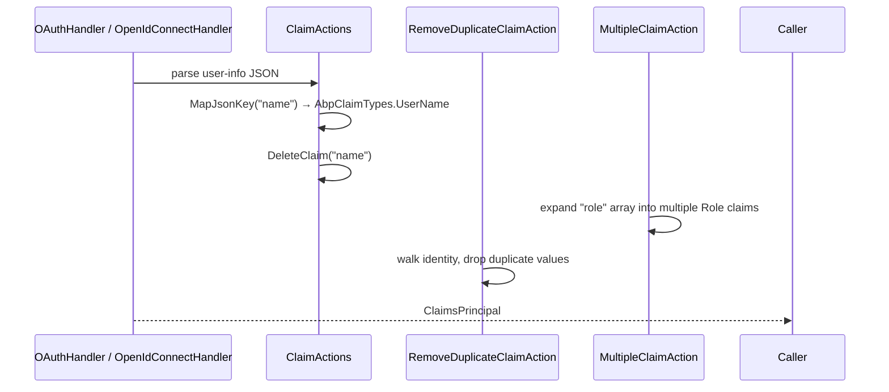

ABP Framework's `Volo.Abp.AspNetCore.Authentication.OAuth` package is a small but essential bridge between the standard `Microsoft.AspNetCore.Authentication.OAuth` claim-action pipeline and ABP's `AbpClaimTypes` constants. The package contributes a `MapAbpClaimTypes` extension that rewrites well-known OpenID Connect JSON keys (`name`, `email`, `role`, …) into the renamable claim types `AbpClaimTypes` exposes, a `MultipleClaimAction` for arrays of values (used by `role`), and a `RemoveDuplicateClaimAction` that runs after the mappers to keep the resulting identity tidy. This page covers each file in `framework/src/Volo.Abp.AspNetCore.Authentication.OAuth/`, explains why some keys are remapped only when their constants differ from the JSON defaults, and shows the interaction with the OIDC and JWT bearer wrappers.

## File inventory

| File | Purpose |
| --- | --- |
| `Volo/Abp/AspNetCore/Authentication/OAuth/AbpAspNetCoreAuthenticationOAuthModule.cs` | Module placeholder; depends on `AbpSecurityModule`. |
| `Microsoft/AspNetCore/Authentication/OAuth/Claims/AbpClaimActionCollectionExtensions.cs` | `MapAbpClaimTypes`, `MapJsonKeyMultiple`, `RemoveDuplicate`. |
| `Volo/Abp/AspNetCore/Authentication/OAuth/Claims/MultipleClaimAction.cs` | Handles JSON arrays (multi-valued claims). |
| `Volo/Abp/AspNetCore/Authentication/OAuth/Claims/RemoveDuplicateClaimAction.cs` | Removes duplicate claims after mapping. |

<Tip>The package contains no `IServiceCollection` extensions, no middleware, and no event handlers. Everything is intended to plug into the existing `OAuthOptions.ClaimActions` or `OpenIdConnectOptions.ClaimActions` collections. The [OIDC wrapper](/aspnetcore/openidconnect-auth) calls `MapAbpClaimTypes` for you.</Tip>

## Module

The module exists almost entirely to provide a `[DependsOn]` anchor for downstream modules. Its only stated dependency is `AbpSecurityModule`, which is where `AbpClaimTypes` constants live:

```csharp framework/src/Volo.Abp.AspNetCore.Authentication.OAuth/Volo/Abp/AspNetCore/Authentication/OAuth/AbpAspNetCoreAuthenticationOAuthModule.cs
[DependsOn(typeof(AbpSecurityModule))]
public class AbpAspNetCoreAuthenticationOAuthModule : AbpModule
{

}
```

Because there is no `ConfigureServices` override, the conventional registrar registers `MultipleClaimAction` and `RemoveDuplicateClaimAction` as plain types — they are instantiated by ABP only when the caller adds them to a `ClaimActionCollection`, not by the DI container.

## `MapAbpClaimTypes`

`MapAbpClaimTypes` is the entry point most applications use. For each standard OpenID Connect JSON key (`name`, `given_name`, `family_name`, `email`, `email_verified`, `phone_number`, `phone_number_verified`, `role`), it checks whether the corresponding `AbpClaimTypes` constant has been customised. If not (the constant equals the JSON key), it does **nothing**. When the constant differs, the helper does three things:

1. Calls `claimActions.MapJsonKey(AbpClaimTypes.X, "jsonKey")` so the JSON value flows into the renamed claim.
2. Calls `claimActions.DeleteClaim("jsonKey")` to suppress the original.
3. Adds a `RemoveDuplicateClaimAction` for the renamed type.

```csharp framework/src/Volo.Abp.AspNetCore.Authentication.OAuth/Microsoft/AspNetCore/Authentication/OAuth/Claims/AbpClaimActionCollectionExtensions.cs
public static void MapAbpClaimTypes(this ClaimActionCollection claimActions)
{
    if (AbpClaimTypes.UserName != "name")
    {
        claimActions.MapJsonKey(AbpClaimTypes.UserName, "name");
        claimActions.DeleteClaim("name");
        claimActions.RemoveDuplicate(AbpClaimTypes.UserName);
    }

    if (AbpClaimTypes.Name != "given_name")
    {
        claimActions.MapJsonKey(AbpClaimTypes.Name, "given_name");
        claimActions.DeleteClaim("given_name");
        claimActions.RemoveDuplicate(AbpClaimTypes.Name);
    }
    // ...
    if (AbpClaimTypes.Role != "role")
    {
        claimActions.MapJsonKeyMultiple(AbpClaimTypes.Role, "role");
    }

    claimActions.RemoveDuplicate(AbpClaimTypes.Name);
}
```

### Conditional mapping rationale

`AbpClaimTypes` is declared in `Volo.Abp.Security` with default values that match `ClaimTypes.*` URIs (for example `AbpClaimTypes.UserName` is preset to `http://schemas.xmlsoap.org/ws/2005/05/identity/claims/name`). Module authors can override those constants at process startup. The `if (AbpClaimTypes.X != "jsonKey")` guard avoids registering a no-op mapping when an application has reassigned the constant to the very same JSON key the OAuth provider already emits.

### Mapped keys

| JSON key | `AbpClaimTypes` constant | Single-value or multi-value | Default action |
| --- | --- | --- | --- |
| `name` | `UserName` | single | map + delete + dedupe |
| `given_name` | `Name` | single | map + delete + dedupe |
| `family_name` | `SurName` | single | map + delete + dedupe |
| `email` | `Email` | single | map + delete + dedupe |
| `email_verified` | `EmailVerified` | single | map only |
| `phone_number` | `PhoneNumber` | single | map only |
| `phone_number_verified` | `PhoneNumberVerified` | single | map only |
| `role` | `Role` | multi | `MapJsonKeyMultiple` |

<Warning>Only the four "identity-shaped" claims (`UserName`, `Name`, `SurName`, `Email`) trigger a `DeleteClaim`. `email_verified`, `phone_number`, and `phone_number_verified` are passed through unchanged on top of being mapped — handy when downstream consumers still expect the original key.</Warning>

The trailing `claimActions.RemoveDuplicate(AbpClaimTypes.Name)` runs regardless of the conditional branches and is intentional: it scrubs duplicates produced by other middlewares that may have already added a `Name` claim before the OAuth handler runs.

## `MapJsonKeyMultiple`

`MapJsonKeyMultiple` is the helper that registers `MultipleClaimAction`, the only way to get repeated values out of a JSON array on the user-info payload:

```csharp
public static void MapJsonKeyMultiple(this ClaimActionCollection claimActions, string claimType, string jsonKey)
{
    claimActions.Add(new MultipleClaimAction(claimType, jsonKey));
}
```

### `MultipleClaimAction`

`MultipleClaimAction` inherits from `Microsoft.AspNetCore.Authentication.OAuth.Claims.ClaimAction`. The override walks the JSON property at `ValueType` (the base class stores the JSON key there) and adds a `Claim` per array element, skipping any value already present on the identity:

```csharp framework/src/Volo.Abp.AspNetCore.Authentication.OAuth/Volo/Abp/AspNetCore/Authentication/OAuth/Claims/MultipleClaimAction.cs
public override void Run(JsonElement userData, ClaimsIdentity identity, string issuer)
{
    JsonElement prop;
    if (!userData.TryGetProperty(ValueType, out prop)) return;
    if (prop.ValueKind == JsonValueKind.Null) return;

    Claim claim;
    switch (prop.ValueKind)
    {
        case JsonValueKind.String:
            claim = new Claim(ClaimType, prop.GetString()!, ValueType, issuer);
            if (!identity.Claims.Any(c => c.Type == claim.Type && c.Value == claim.Value))
            {
                identity.AddClaim(claim);
            }
            break;
        case JsonValueKind.Array:
            foreach (var arramItem in prop.EnumerateArray())
            {
                claim = new Claim(ClaimType, arramItem.GetString()!, ValueType, issuer);
                if (!identity.Claims.Any(c => c.Type == claim.Type && c.Value == claim.Value))
                {
                    identity.AddClaim(claim);
                }
            }
            break;
        default:
            throw new AbpException("Unhandled JsonValueKind: " + prop.ValueKind);
    }
}
```

Both branches use a linear `identity.Claims.Any(...)` check before adding, which is acceptable for the small claim counts typical in JWTs. The string branch is required because most providers emit a single `role` as a bare string rather than a one-element array; without it the loop would silently fail.

## `RemoveDuplicateClaimAction`

`RemoveDuplicateClaimAction` runs **after** the JSON has been parsed and the mapping actions have fired. Its job is to walk all claims of a given type, keep the first occurrence of each distinct value, and remove the rest:

```csharp framework/src/Volo.Abp.AspNetCore.Authentication.OAuth/Volo/Abp/AspNetCore/Authentication/OAuth/Claims/RemoveDuplicateClaimAction.cs
public override void Run(JsonElement userData, ClaimsIdentity identity, string issuer)
{
    var claims = identity.Claims.Where(c => c.Type == ClaimType).ToArray();
    if (claims.Length < 2) return;

    var previousValues = new List<string>();
    foreach (var claim in claims)
    {
        if (claim.Value.IsIn(previousValues))
        {
            identity.RemoveClaim(claim);
        }
        else
        {
            previousValues.Add(claim.Value);
        }
    }
}
```

The constructor passes `ClaimValueTypes.String` as the base type because the action does not consume the JSON payload — `userData` is unused — it only inspects the materialised `ClaimsIdentity`:

```csharp framework/src/Volo.Abp.AspNetCore.Authentication.OAuth/Volo/Abp/AspNetCore/Authentication/OAuth/Claims/RemoveDuplicateClaimAction.cs
public RemoveDuplicateClaimAction(string claimType)
    : base(claimType, ClaimValueTypes.String)
{
}
```

That trick is what makes the action portable: it can be registered alongside any other `ClaimAction` for any claim type without colliding with the JSON-mapping pipeline.

## Pipeline order



The `ClaimActionCollection` runs actions in the order they were added, which is why `MapAbpClaimTypes` ends by adding a final `RemoveDuplicate` for `AbpClaimTypes.Name` — that line guarantees the deduper executes *after* every other mapper.

## Composing with OIDC

`AbpOpenIdConnectExtensions.AddAbpOpenIdConnect` calls `options.ClaimActions.MapAbpClaimTypes()` automatically — see [/aspnetcore/openidconnect-auth](/aspnetcore/openidconnect-auth). If you are writing a custom OAuth handler (for example a corporate SSO that is not OpenID Connect compliant), call it yourself:

```csharp
authenticationBuilder.AddOAuth("Internal", options =>
{
    options.AuthorizationEndpoint = "...";
    options.TokenEndpoint = "...";
    options.UserInformationEndpoint = "...";

    options.ClaimActions.MapAbpClaimTypes();
    options.ClaimActions.MapJsonKey("preferred_locale", "locale");
});
```

This way, even an exotic provider produces a `ClaimsPrincipal` whose claim types line up with everything else ABP expects — including `AbpClaimsPrincipalFactory`, `ICurrentUser`, and the permission system in [/security/authorization](/security/authorization).

## Interplay with JWT bearer hosts

API hosts that read a `Bearer` token do **not** invoke OAuth user-info — the access token is the source of identity. There the JWT bearer wrapper performs claim-type translation through `ClaimsAuthenticationManager` instead of through the claim action pipeline. See [/aspnetcore/jwt-bearer-auth](/aspnetcore/jwt-bearer-auth). The OAuth package is still loaded as a transitive dependency because the OpenIddict module depends on it.

## Multi-tenancy interaction

The OAuth package itself does not manipulate tenant identity. Tenant resolution happens during the OpenID Connect callback (`AbpOpenIdConnectExtensions` reads the tenant cookie and forwards it into the token request) and during user-info processing on the API side (the JWT bearer validator maps `tenantid` via `AbpClaimTypes.TenantId`). See [/multi-tenancy](/multi-tenancy) for the resolution chain.

## Testing claim mappings

A focused unit test can verify the mapper without booting an authentication handler. Construct a `ClaimsIdentity`, invoke each `ClaimAction.Run`, and assert. The signature `Run(JsonElement userData, ClaimsIdentity identity, string issuer)` is fully synchronous and side-effect free aside from the identity mutation:

```csharp
var json = JsonDocument.Parse("""{"role":["admin","manager"]}""").RootElement;
var identity = new ClaimsIdentity();
new MultipleClaimAction(AbpClaimTypes.Role, "role").Run(json, identity, "iss");

identity.FindAll(AbpClaimTypes.Role).Should().HaveCount(2);
```

## Cross-references

- [/aspnetcore/overview](/aspnetcore/overview) — module dependency layout that loads OAuth before OIDC.
- [/aspnetcore/openidconnect-auth](/aspnetcore/openidconnect-auth) — the wrapper that calls `MapAbpClaimTypes` automatically.
- [/aspnetcore/jwt-bearer-auth](/aspnetcore/jwt-bearer-auth) — counterpart for API hosts that consume a `Bearer` token.
- [/security/authorization](/security/authorization) — `AbpClaimTypes.Role` feeds into the role-policy provider.
- [/aspnetcore/mvc](/aspnetcore/mvc) — `ICurrentUser` reads the mapped claim types regardless of which authentication scheme produced them.
- [/modules/openiddict-module](/modules/openiddict-module) — the most common OAuth provider in ABP solutions.
- [/modules/identityserver-module](/modules/identityserver-module) — legacy provider; same claim shape, same mapper.
- [/http/overview](/http/overview) — dynamic HTTP client proxies surface the propagated tenant / user claims downstream.
