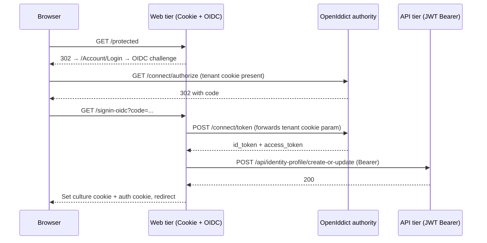

ABP Framework wraps `Microsoft.AspNetCore.Authentication.OpenIdConnect` with the `Volo.Abp.AspNetCore.Authentication.OpenIdConnect` package. The wrapper takes care of three things that every ABP web tier needs but the stock handler doesn't: it injects the ABP tenant cookie into the token endpoint request, it maps the OpenID Connect JSON claims onto `AbpClaimTypes`, and it shells out to an optional `IOpenIdLocalUserCreationClient` so that an interactive sign-in can provision a row in the API tier's local user table. This page walks the entire `framework/src/Volo.Abp.AspNetCore.Authentication.OpenIdConnect/` tree, names every event hook, and explains the relationship with the [OAuth claim mapper](/aspnetcore/oauth-auth) and the [JWT bearer wrapper](/aspnetcore/jwt-bearer-auth).

## File inventory

| File | Purpose |
| --- | --- |
| `Microsoft/Extensions/DependencyInjection/AbpOpenIdConnectExtensions.cs` | `AddAbpOpenIdConnect` overloads and event wiring. |
| `Volo/Abp/AspNetCore/Authentication/OpenIdConnect/AbpAspNetCoreAuthenticationOpenIdConnectModule.cs` | Module: depends on multi-tenancy, OAuth, remote services. |
| `Volo/Abp/AspNetCore/Authentication/OpenIdConnect/IOpenIdLocalUserCreationClient.cs` | Optional callback for local-user provisioning. |
| `Volo/Abp/AspNetCore/Authentication/OpenIdConnect/OpenIdLocalUserCreationClient.cs` | Default implementation using `IRemoteServiceConfigurationProvider`. |
| `Volo/Abp/AspNetCore/Authentication/OpenIdConnect/OpenIdLocalUserCreationClientOptions.cs` | Options: `IsEnabled`, `RemoteServiceName`, `Url`, `HttpClientName`. |

## Module

`AbpAspNetCoreAuthenticationOpenIdConnectModule` chains three modules and pre-registers an HTTP client factory so that `OpenIdLocalUserCreationClient` can resolve a typed `HttpClient` later:

```csharp framework/src/Volo.Abp.AspNetCore.Authentication.OpenIdConnect/Volo/Abp/AspNetCore/Authentication/OpenIdConnect/AbpAspNetCoreAuthenticationOpenIdConnectModule.cs
[DependsOn(
    typeof(AbpMultiTenancyModule),
    typeof(AbpAspNetCoreAuthenticationOAuthModule),
    typeof(AbpRemoteServicesModule)
    )]
public class AbpAspNetCoreAuthenticationOpenIdConnectModule : AbpModule
{
    public override void ConfigureServices(ServiceConfigurationContext context)
    {
        context.Services.AddHttpClient();

        Configure<AbpSecurityHeadersOptions>(options =>
        {
            options.IgnoredScriptNoncePaths.Add("/signout-oidc");
        });
    }
}
```

The single configured option is the addition of `/signout-oidc` to `IgnoredScriptNoncePaths`. ABP's security-headers middleware otherwise demands a CSP nonce for inline scripts, but the OpenID Connect sign-out callback returns inline JavaScript posted from the IdP that would otherwise be blocked. See the security headers section in [/aspnetcore/overview](/aspnetcore/overview) for the rest of that pipeline.

## `AddAbpOpenIdConnect` overloads

Like the JWT bearer wrapper, the OIDC wrapper offers four overloads that funnel into the same body. The cascade is `() → (Action) → (string, Action) → (string, string, Action)`:

```csharp framework/src/Volo.Abp.AspNetCore.Authentication.OpenIdConnect/Microsoft/Extensions/DependencyInjection/AbpOpenIdConnectExtensions.cs
public static AuthenticationBuilder AddAbpOpenIdConnect(this AuthenticationBuilder builder)
    => builder.AddAbpOpenIdConnect(OpenIdConnectDefaults.AuthenticationScheme, _ => { });

public static AuthenticationBuilder AddAbpOpenIdConnect(this AuthenticationBuilder builder, Action<OpenIdConnectOptions> configureOptions)
    => builder.AddAbpOpenIdConnect(OpenIdConnectDefaults.AuthenticationScheme, configureOptions);
```

### Authority → `RemoteRefreshUrl`

Just like in the JWT bearer wrapper, the helper double-invokes `configureOptions` against a throwaway `OpenIdConnectOptions` so that it can read `Authority` and use it to prepend the dynamic-claims refresh URL stored in `AbpClaimsPrincipalFactoryOptions.RemoteRefreshUrl`:

```csharp framework/src/Volo.Abp.AspNetCore.Authentication.OpenIdConnect/Microsoft/Extensions/DependencyInjection/AbpOpenIdConnectExtensions.cs
builder.Services.Configure<AbpClaimsPrincipalFactoryOptions>(options =>
{
    var openIdConnectOptions = new OpenIdConnectOptions();
    configureOptions?.Invoke(openIdConnectOptions);
    if (!openIdConnectOptions.Authority.IsNullOrEmpty())
    {
        options.RemoteRefreshUrl = openIdConnectOptions.Authority.RemovePostFix("/") + options.RemoteRefreshUrl;
    }
});
```

### Claim type mapping

Inside the real `AddOpenIdConnect` block, the very first line wires the OAuth claim-action helper:

```csharp framework/src/Volo.Abp.AspNetCore.Authentication.OpenIdConnect/Microsoft/Extensions/DependencyInjection/AbpOpenIdConnectExtensions.cs
options.ClaimActions.MapAbpClaimTypes();
```

That single call applies every mapping documented in [/aspnetcore/oauth-auth](/aspnetcore/oauth-auth) — JSON `name` becomes `AbpClaimTypes.UserName`, `role` becomes the multi-valued `AbpClaimTypes.Role`, and so on.

### Event chain

The wrapper builds an event chain that fires in this order:

1. **`OnAuthorizationCodeReceived`** — pre-existing handler runs first, then `SetAbpTenantId` forwards the tenant cookie into the token endpoint request.
2. **`OnTokenValidated`** — `IOpenIdLocalUserCreationClient.CreateOrUpdateAsync` provisions the local user; afterwards `culture`/`ui-culture` query parameters set the request culture cookie.

```csharp framework/src/Volo.Abp.AspNetCore.Authentication.OpenIdConnect/Microsoft/Extensions/DependencyInjection/AbpOpenIdConnectExtensions.cs
options.Events ??= new OpenIdConnectEvents();
var authorizationCodeReceived = options.Events.OnAuthorizationCodeReceived ?? (_ => Task.CompletedTask);

options.Events.OnAuthorizationCodeReceived = receivedContext =>
{
    SetAbpTenantId(receivedContext);
    return authorizationCodeReceived.Invoke(receivedContext);
};
```

Note the captured `authorizationCodeReceived` delegate: if you also pass an `OnAuthorizationCodeReceived` through `configureOptions`, the wrapper preserves it and runs it **after** the tenant injection.

### Tenant cookie forwarding

`SetAbpTenantId` reads the tenant cookie name from `AbpAspNetCoreMultiTenancyOptions.TenantKey` and adds the cookie value to the outgoing token request parameters:

```csharp framework/src/Volo.Abp.AspNetCore.Authentication.OpenIdConnect/Microsoft/Extensions/DependencyInjection/AbpOpenIdConnectExtensions.cs
private static void SetAbpTenantId(AuthorizationCodeReceivedContext receivedContext)
{
    var tenantKey = receivedContext.HttpContext.RequestServices
        .GetRequiredService<IOptions<AbpAspNetCoreMultiTenancyOptions>>().Value.TenantKey;

    if (receivedContext.Request.Cookies.ContainsKey(tenantKey))
    {
        receivedContext.TokenEndpointRequest?.SetParameter(tenantKey, receivedContext.Request.Cookies[tenantKey]);
    }
}
```

This is the link that lets a tenant resolve a tenant-scoped token at the OpenIddict authority. See [multi-tenancy](/multi-tenancy) for the resolution chain that puts the cookie in place.

### `OnTokenValidated`: local user + culture

The wrapper unconditionally replaces `OnTokenValidated` (it does not chain user-supplied handlers — pass your hooks through your own `OpenIdConnectEvents` if you need to add behaviour). The replacement performs three tasks:

```csharp framework/src/Volo.Abp.AspNetCore.Authentication.OpenIdConnect/Microsoft/Extensions/DependencyInjection/AbpOpenIdConnectExtensions.cs
options.Events.OnTokenValidated = async (context) =>
{
    var logger = context.HttpContext.RequestServices.GetRequiredService<ILogger<AbpAspNetCoreAuthenticationOpenIdConnectModule>>();
    var client = context.HttpContext.RequestServices.GetRequiredService<IOpenIdLocalUserCreationClient>();
    try
    {
        await client.CreateOrUpdateAsync(context);
    }
    catch (Exception ex)
    {
        logger.LogException(ex);
    }

    var culture = context.ProtocolMessage.GetParameter("culture");
    var uiCulture = context.ProtocolMessage.GetParameter("ui-culture");
    if (CultureHelper.IsValidCultureCode(culture) && CultureHelper.IsValidCultureCode(uiCulture))
    {
        context.Response.OnStarting(() =>
        {
            logger.LogInformation($"Setting culture and ui-culture to the response. culture: {culture}, ui-culture: {uiCulture}");
            AbpRequestCultureCookieHelper.SetCultureCookie(
                context.HttpContext,
                new RequestCulture(culture, uiCulture)
            );
            return Task.CompletedTask;
        });
    }
    else
    {
        logger.LogWarning($"Invalid culture or ui-culture parameter in the OpenIdConnect response. culture: {culture}, ui-culture: {uiCulture}");
    }
};
```

<Warning>Exceptions from `CreateOrUpdateAsync` are **logged and swallowed**. The user still ends up signed in. This is intentional — the OIDC handler should not block authentication because the local user table is unreachable — but it means you must monitor logs for `Failed to ...` lines in production.</Warning>

### Access denied + PAR

Two further defaults set on `OpenIdConnectOptions` deserve a callout:

```csharp framework/src/Volo.Abp.AspNetCore.Authentication.OpenIdConnect/Microsoft/Extensions/DependencyInjection/AbpOpenIdConnectExtensions.cs
options.AccessDeniedPath = "/";
// ...
// The application needs to be granted the `OpenIddictConstants.Permissions.Endpoints.PushedAuthorization` permission to use the PAR endpoint.
// You can enable it after you have granted the `PushedAuthorization` permission.
options.PushedAuthorizationBehavior = PushedAuthorizationBehavior.Disable;
```

`AccessDeniedPath` defaults to `/` so a denied user lands on the home page (override in your callback to provide a friendlier "access denied" page). `PushedAuthorizationBehavior.Disable` opts out of PAR by default; turn it on only after you have granted the OpenIddict `PushedAuthorization` endpoint permission to the client application.

## Local user creation client

The default contract is one async method:

```csharp framework/src/Volo.Abp.AspNetCore.Authentication.OpenIdConnect/Volo/Abp/AspNetCore/Authentication/OpenIdConnect/IOpenIdLocalUserCreationClient.cs
public interface IOpenIdLocalUserCreationClient
{
    Task CreateOrUpdateAsync(TokenValidatedContext tokenValidatedContext);
}
```

### Default options

```csharp framework/src/Volo.Abp.AspNetCore.Authentication.OpenIdConnect/Volo/Abp/AspNetCore/Authentication/OpenIdConnect/OpenIdLocalUserCreationClientOptions.cs
public class OpenIdLocalUserCreationClientOptions
{
    public bool IsEnabled { get; set; }
    public string RemoteServiceName { get; set; } = "AbpIdentity";
    public string Url { get; set; } = "/api/identity-profile/create-or-update";
    public string HttpClientName { get; } = Microsoft.Extensions.Options.Options.DefaultName;
}
```

| Option | Default | Notes |
| --- | --- | --- |
| `IsEnabled` | `false` | Provisioning is opt-in — host modules typically `Configure<OpenIdLocalUserCreationClientOptions>(o => o.IsEnabled = true);`. |
| `RemoteServiceName` | `"AbpIdentity"` | Looked up via `IRemoteServiceConfigurationProvider`; falls back to `"Default"`. |
| `Url` | `/api/identity-profile/create-or-update` | API endpoint that consumes the access token and upserts the local user row. |
| `HttpClientName` | `string.Empty` | Optional named client to attach Polly handlers. |

### Default implementation

```csharp framework/src/Volo.Abp.AspNetCore.Authentication.OpenIdConnect/Volo/Abp/AspNetCore/Authentication/OpenIdConnect/OpenIdLocalUserCreationClient.cs
public virtual async Task CreateOrUpdateAsync(TokenValidatedContext context)
{
    if (!Options.IsEnabled) return;

    using (var httpClient = HttpClientFactory.CreateClient(Options.HttpClientName))
    {
        if (!Options.RemoteServiceName.IsNullOrWhiteSpace())
        {
            var configuration = await RemoteServiceConfigurationProvider.GetConfigurationOrDefaultAsync(Options.RemoteServiceName);
            if (configuration.BaseUrl != null)
            {
                httpClient.BaseAddress = new Uri(configuration.BaseUrl);
            }
        }

        httpClient.DefaultRequestHeaders.Add(
            HeaderNames.Authorization,
            "Bearer " + context.SecurityToken.RawData
        );

        var response = await httpClient.PostAsync(Options.Url, new StringContent(string.Empty));
        response.EnsureSuccessStatusCode();
    }
}
```

The body is empty — the API tier reads identity from the bearer token, so the client only needs to POST and trust the authorization layer. `RawData` returns the JWT compact form; if your tokens are reference tokens the call won't work without first exchanging them.

## Request flow



## Wiring recipe

```csharp
public override void ConfigureServices(ServiceConfigurationContext context)
{
    Configure<OpenIdLocalUserCreationClientOptions>(options =>
    {
        options.IsEnabled = true;
        options.RemoteServiceName = "AbpIdentity";
        options.Url = "/api/identity-profile/create-or-update";
    });

    context.Services.AddAuthentication(options =>
    {
        options.DefaultScheme = "Cookies";
        options.DefaultChallengeScheme = "oidc";
    })
    .AddCookie("Cookies")
    .AddAbpOpenIdConnect("oidc", options =>
    {
        options.Authority = configuration["AuthServer:Authority"];
        options.ClientId = configuration["AuthServer:ClientId"];
        options.ClientSecret = configuration["AuthServer:ClientSecret"];
        options.ResponseType = OpenIdConnectResponseType.Code;
        options.Scope.Add("openid");
        options.Scope.Add("profile");
        options.Scope.Add("MyApp");
        options.SaveTokens = true;
    });
}
```

## Comparison table

| Aspect | OpenID Connect (this page) | [JWT Bearer](/aspnetcore/jwt-bearer-auth) |
| --- | --- | --- |
| Typical scheme name | `oidc` / `OpenIdConnect` | `Bearer` |
| Default sign-in artefact | Cookie + tokens | None — bearer only |
| Tenant cookie forwarding | Yes (`OnAuthorizationCodeReceived`) | N/A (no token request) |
| Claim-type mapping | `MapAbpClaimTypes` via OAuth helpers | Done by `ClaimsAuthenticationManager` |
| Local user provisioning | `IOpenIdLocalUserCreationClient` | Not applicable |
| Culture sync | Reads `culture`/`ui-culture` query | N/A |
| PAR | Disabled by default | N/A |

## Cross-references

- [/aspnetcore/overview](/aspnetcore/overview) — module dependency layout (OIDC depends on multi-tenancy and remote services).
- [/aspnetcore/oauth-auth](/aspnetcore/oauth-auth) — `MapAbpClaimTypes` and the multiple-claim action used by the OIDC wrapper.
- [/aspnetcore/jwt-bearer-auth](/aspnetcore/jwt-bearer-auth) — the API-side complement; both wrappers share `AbpClaimsPrincipalFactoryOptions`.
- [/aspnetcore/swashbuckle-swagger](/aspnetcore/swashbuckle-swagger) — Swagger UI uses the same OIDC discovery document.
- [/security/authorization](/security/authorization) — permission and policy provider reads the mapped claim types.
- [/modules/openiddict-module](/modules/openiddict-module) — default authority that issues the codes consumed here.
- [/modules/identityserver-module](/modules/identityserver-module) — alternative authority with the same endpoint shape.
- [/http/overview](/http/overview) — `IRemoteServiceConfigurationProvider` is the same component that powers HTTP client proxies.
