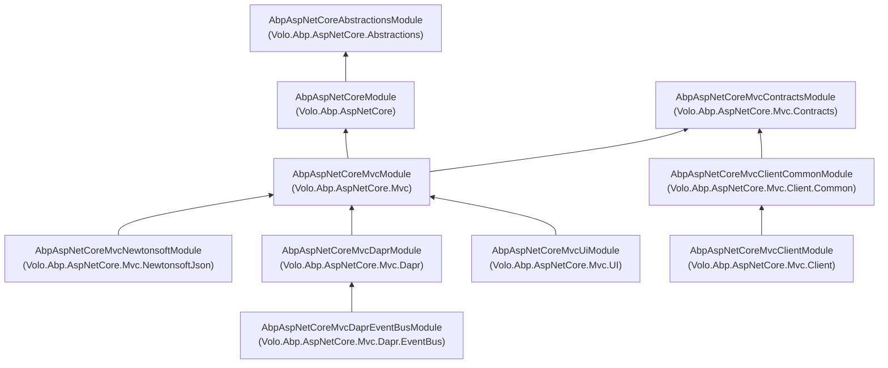
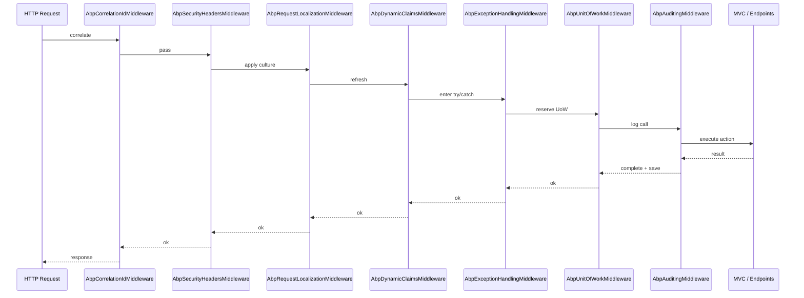

The ABP Framework ships its ASP.NET Core integration as a stack of small,
composable NuGet packages under the `Volo.Abp.AspNetCore.*` namespace. This page
gives you the map: which package depends on which, what each layer adds on top
of vanilla ASP.NET Core, and which entry-point module type you should reference
from `DependsOn` in your own [`AbpModule`](/core/abp-application-and-bootstrap).
Subsequent pages drill into the individual packages; this overview is the
single place where you can see the whole layering at a glance.

The stack is rooted at `Volo.Abp.AspNetCore.Abstractions` (no ASP.NET Core
runtime dependency beyond the abstractions package), grows upward through
`Volo.Abp.AspNetCore` (middleware, options, request pipeline glue),
`Volo.Abp.AspNetCore.Mvc.Contracts` (DTOs and remote service interfaces
shared with HTTP clients) and `Volo.Abp.AspNetCore.Mvc` (controllers,
conventions, filters), and then branches into specialised siblings:
`Mvc.NewtonsoftJson`, `Mvc.Client` / `Mvc.Client.Common`, and the Dapr
integration in `Mvc.Dapr` / `Mvc.Dapr.EventBus`.

## Why a multi-package layering?

<Info>
ABP keeps `Volo.Abp.AspNetCore.Mvc.Contracts` separate so that a remote HTTP
client (a Blazor WebAssembly app, a Xamarin app, an `Mvc.Client` host) can
reference the same interfaces — `IAbpApplicationConfigurationAppService`,
`IAbpTenantAppService` — without dragging in MVC, Razor or Kestrel. This
separation is the reason the [HTTP module](/http/overview) can produce
strongly-typed client proxies that talk to controllers exposed by the server.
</Info>

The same idea applies one level up: `Volo.Abp.AspNetCore.Mvc.NewtonsoftJson`
is opt-in because new applications default to `System.Text.Json` (configured
inside `AbpAspNetCoreMvcModule` via `AbpJsonSystemTextJsonModule`). Newtonsoft
support is only loaded when an application explicitly needs it (legacy
serialization, polymorphic JSON.NET converters, MVC `JsonResult` compatibility).

## The dependency graph

The arrows below are extracted from each module's `[DependsOn(...)]`
attribute. They tell you the order ABP's module system will run
`PreConfigureServices` / `ConfigureServices` / `OnApplicationInitialization`.



`AbpAspNetCoreAbstractionsModule` only registers two singletons —
`IWebContentFileProvider` and `IWebClientInfoProvider` — both as
`Null*` placeholders. They are the seams that higher modules override:
`Volo.Abp.AspNetCore` swaps `IWebContentFileProvider` for
`WebContentFileProvider` (composed over `IVirtualFileProvider`) and replaces
`IWebClientInfoProvider` with `HttpContextWebClientInfoProvider`.

## Package roles at a glance

The next table is the canonical reference: when you scaffold a new ABP host
module, decide which row applies and reference the matching `AbpModule` from
`[DependsOn]`. The "Adds to pipeline" column lists the `IApplicationBuilder`
extension methods that the package exposes through
`Microsoft.AspNetCore.Builder.AbpApplicationBuilderExtensions` (declared in
`framework/src/Volo.Abp.AspNetCore/Microsoft/AspNetCore/Builder/AbpApplicationBuilderExtensions.cs`).

| Package | Module type | Adds to pipeline | Why you reference it |
| --- | --- | --- | --- |
| `Volo.Abp.AspNetCore.Abstractions` | `AbpAspNetCoreAbstractionsModule` | — | Shared interfaces (`IAbpFilter`, `IWebContentFileProvider`, `IWebClientInfoProvider`) without an ASP.NET Core runtime. |
| `Volo.Abp.AspNetCore` | `AbpAspNetCoreModule` | `UseAbpExceptionHandling`, `UseUnitOfWork`, `UseCorrelationId`, `UseAuditing`, `UseAbpRequestLocalization`, `UseAbpSecurityHeaders`, `UseDynamicClaims`, `UseVirtualStaticFiles` | Middleware + options for any ASP.NET Core host (REST, MVC, Razor Pages, Blazor Server). |
| `Volo.Abp.AspNetCore.Mvc.Contracts` | `AbpAspNetCoreMvcContractsModule` | — | Server↔client DTOs and `IApplicationService` interfaces. Safe to reference from non-server projects. |
| `Volo.Abp.AspNetCore.Mvc` | `AbpAspNetCoreMvcModule` | (`AddMvc()`, model binders, filters, conventional controllers) | The full MVC integration: `[RemoteService]` controllers, exception filter, UoW filter, audit/feature/authorization filters, API description providers. |
| `Volo.Abp.AspNetCore.Mvc.NewtonsoftJson` | `AbpAspNetCoreMvcNewtonsoftModule` | — | Replaces `System.Text.Json` with Newtonsoft for MVC formatters; sets `AbpCamelCasePropertyNamesContractResolver`. |
| `Volo.Abp.AspNetCore.Mvc.Client.Common` | `AbpAspNetCoreMvcClientCommonModule` | — | Wires `RemotePermissionChecker`, `RemoteFeatureChecker`, `RemoteSettingProvider`, `RemoteLocalizationContributor` from a remote `ApplicationConfigurationDto`. |
| `Volo.Abp.AspNetCore.Mvc.Client` | `AbpAspNetCoreMvcClientModule` | — | Hosts that consume the configuration over HTTP — `MvcCachedApplicationConfigurationClient`, `MvcRemoteTenantStore`. |
| `Volo.Abp.AspNetCore.Mvc.Dapr` | `AbpAspNetCoreMvcDaprModule` | — | `IDaprAppApiTokenValidator` plus `HttpContext.ValidateDaprAppApiToken()` extensions. |
| `Volo.Abp.AspNetCore.Mvc.Dapr.EventBus` | `AbpAspNetCoreMvcDaprEventBusModule` | Registers a `POST /api/abp/dapr/event` endpoint via `AbpEndpointRouterOptions`. | Receives Dapr pub/sub callbacks and dispatches into `DaprDistributedEventBus`. |

The package set above is mirrored on disk under
`framework/src/Volo.Abp.AspNetCore*` — there is exactly one `.csproj`
per row.

## Layered request pipeline

Once you have referenced the packages, an ABP host wires the
ASP.NET Core middleware pipeline in a deliberate order. The extension methods
on `IApplicationBuilder` are defined inside
`Volo.Abp.AspNetCore` and are composable: most apps call them from
`OnApplicationInitialization` in their own module. The recommended ordering
(from the auto-generated template `Program.cs`) is:



`AbpUnitOfWorkMiddleware` reserves a unit-of-work with name
`UnitOfWork.UnitOfWorkReservationName`; the per-action
`AbpUowActionFilter` then *binds* it. That coordination is described in
detail on the [MVC page](/aspnetcore/mvc) and reflected in the actual code at
`framework/src/Volo.Abp.AspNetCore/Volo/Abp/AspNetCore/Uow/AbpUnitOfWorkMiddleware.cs`.

## What lives where (cheat-sheet)

The MVC pieces and the lower-level ASP.NET Core pieces are *physically* in
different DLLs. The split matters when you write your own libraries: if you
only need to log a security event, depend on
`Volo.Abp.AspNetCore.Abstractions`; if you need a filter, depend on
`Volo.Abp.AspNetCore.Mvc`.

| Concern | Package | Concrete type |
| --- | --- | --- |
| Marker interface for ABP-aware filters | `Volo.Abp.AspNetCore.Abstractions` | `IAbpFilter` |
| Web client info (IP, browser) abstraction | `Volo.Abp.AspNetCore.Abstractions` | `IWebClientInfoProvider` |
| Exception middleware (wraps non-MVC responses) | `Volo.Abp.AspNetCore` | `AbpExceptionHandlingMiddleware` |
| Exception **filter** (wraps MVC `ObjectResult`) | `Volo.Abp.AspNetCore.Mvc` | `AbpExceptionFilter` |
| UoW middleware (reserves) | `Volo.Abp.AspNetCore` | `AbpUnitOfWorkMiddleware` |
| UoW action filter (binds) | `Volo.Abp.AspNetCore.Mvc` | `AbpUowActionFilter` |
| Endpoint configuration hook | `Volo.Abp.AspNetCore` | `AbpEndpointRouterOptions` |
| Conventional controller discovery | `Volo.Abp.AspNetCore.Mvc` | `AbpServiceConvention`, `ConventionalControllerSetting` |
| Remote configuration DTO | `Volo.Abp.AspNetCore.Mvc.Contracts` | `ApplicationConfigurationDto` |
| Remote `IPermissionChecker` | `Volo.Abp.AspNetCore.Mvc.Client.Common` | `RemotePermissionChecker` |
| Dapr API token header check | `Volo.Abp.AspNetCore.Mvc.Dapr` | `DaprAppApiTokenValidator` |
| Dapr subscribe endpoint | `Volo.Abp.AspNetCore.Mvc.Dapr.EventBus` | `AbpAspNetCoreMvcDaprEventBusModule.HandleEventAsync` |

## Where each piece is documented

- **Foundation** — [`AspNetCore.Abstractions`](/aspnetcore/aspnetcore-abstractions)
  walks every file in the package.
- **Core middleware + options** — [`Volo.Abp.AspNetCore`](/aspnetcore/aspnetcore-core)
  documents `AbpExceptionHandlingMiddleware`, `AbpEndpointRouterOptions`,
  `AbpAspNetCoreUnitOfWorkOptions`, `AbpSecurityHeadersOptions`, request
  localization plumbing and the `Use…` extension methods.
- **MVC** — [`Volo.Abp.AspNetCore.Mvc`](/aspnetcore/mvc) covers conventional
  controllers, `AbpServiceConvention`, model binders, exception/UoW/audit/feature
  filters, the `[RemoteService]` attribute and `IApiDescriptionModelProvider`.
- **Contracts** — [`Volo.Abp.AspNetCore.Mvc.Contracts`](/aspnetcore/mvc-contracts)
  walks `ApplicationConfigurationDto`, `IAbpApplicationConfigurationAppService`,
  `IAbpTenantAppService` and friends.
- **Newtonsoft.Json** — [`Volo.Abp.AspNetCore.Mvc.NewtonsoftJson`](/aspnetcore/mvc-newtonsoftjson).
- **Client hosts** — [`Mvc.Client` & `Mvc.Client.Common`](/aspnetcore/mvc-client)
  for consuming remote services from another ASP.NET Core app.
- **Dapr** — [`Mvc.Dapr` & `Mvc.Dapr.EventBus`](/aspnetcore/mvc-dapr) for token
  validation and event bus subscribe endpoints.

## Where to go next

<CardGroup cols={2}>
  <Card title="Abstractions package" href="/aspnetcore/aspnetcore-abstractions">
    The smallest package: <code>IAbpFilter</code>,
    <code>IWebContentFileProvider</code>, <code>IWebClientInfoProvider</code> and
    <code>AbpAspNetCoreTokenUnauthorizedErrorInfo</code>.
  </Card>
  <Card title="Core middleware" href="/aspnetcore/aspnetcore-core">
    Middleware, options classes and <code>AbpEndpointRouterOptions</code> live in
    <code>Volo.Abp.AspNetCore</code>.
  </Card>
  <Card title="MVC integration" href="/aspnetcore/mvc">
    <code>[RemoteService]</code>, <code>AbpServiceConvention</code>, action
    filters, model binders, exception wrapping.
  </Card>
  <Card title="Mvc.Contracts" href="/aspnetcore/mvc-contracts">
    DTOs and remote service interfaces shared with HTTP clients.
  </Card>
  <Card title="NewtonsoftJson" href="/aspnetcore/mvc-newtonsoftjson">
    Opt-in JSON.NET formatters and contract resolver.
  </Card>
  <Card title="Mvc.Client" href="/aspnetcore/mvc-client">
    Hosts that consume application configuration over HTTP.
  </Card>
  <Card title="Dapr integration" href="/aspnetcore/mvc-dapr">
    Token validation and Dapr pub/sub endpoint registration.
  </Card>
  <Card title="MVC UI" href="/ui-mvc/overview">
    Razor Pages, Bootstrap themes and view components that sit on top of this
    stack.
  </Card>
</CardGroup>

## Related modules outside this stack

The ASP.NET Core stack collaborates with several adjacent ABP modules. They
are documented separately but referenced throughout these pages:

- [`/core/abp-application-and-bootstrap`](/core/abp-application-and-bootstrap)
  explains how `IAbpApplication` is created and how
  `InitializeApplicationAsync` (from
  `framework/src/Volo.Abp.AspNetCore/Microsoft/AspNetCore/Builder/AbpApplicationBuilderExtensions.cs`)
  hands ASP.NET Core's `IServiceProvider` to the ABP module system.
- [`/multi-tenancy/aspnetcore-multitenancy`](/multi-tenancy/aspnetcore-multitenancy)
  documents `MultiTenancyMiddleware`, which slots into the same pipeline as the
  middleware listed above.
- [`/security/authorization`](/security/authorization) is the source of
  `IPermissionChecker` and `AbpAuthorizationException`, both of which the
  exception middleware and `RemotePermissionChecker` know about.
- [`/http/overview`](/http/overview) explains the `IHttpClientProxy<T>`
  infrastructure that consumes the contracts in
  `Volo.Abp.AspNetCore.Mvc.Contracts`.
- [`/ui-mvc/overview`](/ui-mvc/overview) sits on top of `Mvc.UI` and is the
  destination most server applications reach after configuring the MVC layer
  described here.

## How a typical host wires it up

Below is the minimum a server-side ABP host has to do to opt into the entire
stack. It assumes a module that depends on `AbpAspNetCoreMvcModule` and a
`Program.cs` that calls `app.InitializeApplicationAsync()` (declared at
`AbpApplicationBuilderExtensions.InitializeApplicationAsync`):

```csharp
[DependsOn(typeof(AbpAspNetCoreMvcModule))]
public class MyWebModule : AbpModule
{
    public override void ConfigureServices(ServiceConfigurationContext context)
    {
        context.Services.AddAbpApiVersioning();
        Configure<AbpAspNetCoreMvcOptions>(options =>
        {
            options.ConventionalControllers.Create(typeof(MyAppModule).Assembly);
        });
    }

    public override void OnApplicationInitialization(ApplicationInitializationContext context)
    {
        var app = context.GetApplicationBuilder();

        app.UseCorrelationId();
        app.UseAbpRequestLocalization();
        app.UseStaticFiles();
        app.UseRouting();
        app.UseAuthentication();
        app.UseAbpClaimsMap();   // legacy; see AbpClaimsTransformation for the modern path
        app.UseAuthorization();
        app.UseAuditing();
        app.UseAbpSerilogEnrichers();
        app.UseUnitOfWork();
        app.UseConfiguredEndpoints();
    }
}
```

`UseConfiguredEndpoints` is the bridge between ASP.NET Core endpoint routing
and `AbpEndpointRouterOptions.EndpointConfigureActions`. Other modules — for
example `AbpAspNetCoreMvcDaprEventBusModule` — register their endpoints by
appending to that list rather than calling `MapPost` directly, so endpoint
registration is module-aware. The
[ASP.NET Core core page](/aspnetcore/aspnetcore-core) shows the exact
implementation.

## Summary

The ASP.NET Core stack of ABP is intentionally layered so each layer can be
swapped or extended without disturbing the others. The Abstractions package
defines seams; `Volo.Abp.AspNetCore` provides the middleware and options
that any host needs; the MVC packages add controllers, filters and the
contract-first remote service model; and Dapr / Client packages plug onto
those contracts for distributed scenarios. The rest of this section walks
each package in turn — start with
[the Abstractions page](/aspnetcore/aspnetcore-abstractions) if you want to
follow the dependency arrows from the bottom up.
