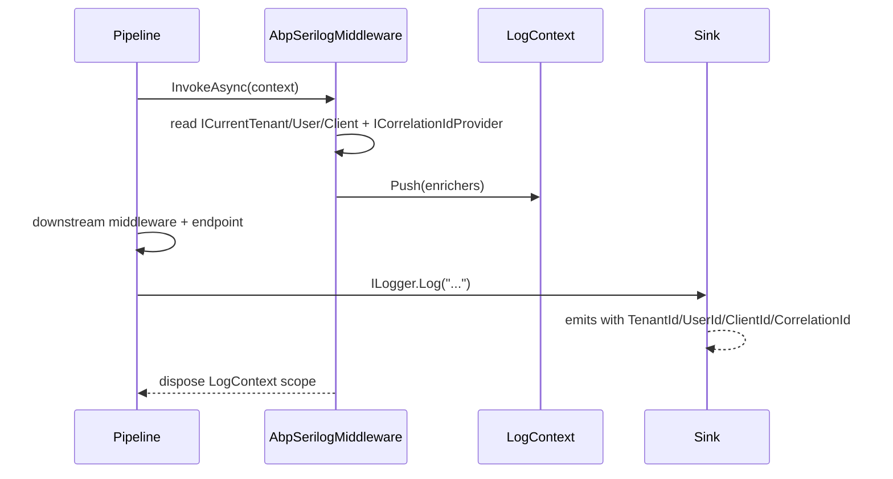

ABP Framework integrates with Serilog through the deliberately small `Volo.Abp.AspNetCore.Serilog` package. The package contains a single middleware (`AbpSerilogMiddleware`) that pushes four `PropertyEnricher` instances onto Serilog's `LogContext` for the duration of an HTTP request: `TenantId`, `UserId`, `ClientId`, and `CorrelationId`. The property names are user-renamable through `AbpAspNetCoreSerilogOptions.EnricherPropertyNames`. There is no Serilog sink, no logger factory replacement, and no `AddSerilog` call — the package assumes you have wired Serilog into the host already through `Serilog.AspNetCore`. This page covers each file in `framework/src/Volo.Abp.AspNetCore.Serilog/`, the middleware order, and how the enricher pairs with the [correlation ID provider](/core/tracing-and-correlation) and [multi-tenancy](/multi-tenancy).

## File inventory

| File | Purpose |
| --- | --- |
| `Volo/Abp/AspNetCore/Serilog/AbpAspNetCoreSerilogModule.cs` | Module: depends on multi-tenancy and `AbpAspNetCoreModule`. |
| `Volo/Abp/AspNetCore/Serilog/AbpAspNetCoreSerilogOptions.cs` | Renamable property names. |
| `Volo/Abp/AspNetCore/Serilog/AbpSerilogMiddleware.cs` | The single middleware (`AbpMiddlewareBase`). |
| `Microsoft/AspNetCore/Builder/AbpAspNetCoreSerilogApplicationBuilderExtensions.cs` | `UseAbpSerilogEnrichers` extension. |

<Tip>If you are not yet calling `host.UseSerilog(...)` from your `Program.cs`, the middleware will still run but Serilog's static `Log.Logger` will be the no-op default. Add `Serilog.AspNetCore` separately and configure sinks there; this package is only about contextual enrichment.</Tip>

## Module

The module declares two dependencies — `AbpMultiTenancyModule` (for `ICurrentTenant`) and `AbpAspNetCoreModule` (for `AbpMiddlewareBase` and the request pipeline plumbing):

```csharp framework/src/Volo.Abp.AspNetCore.Serilog/Volo/Abp/AspNetCore/Serilog/AbpAspNetCoreSerilogModule.cs
[DependsOn(
    typeof(AbpMultiTenancyModule),
    typeof(AbpAspNetCoreModule)
)]
public class AbpAspNetCoreSerilogModule : AbpModule
{
}
```

There is no `ConfigureServices` override. The middleware is registered via the conventional registrar because `AbpSerilogMiddleware` implements `ITransientDependency`.

## Options

`AbpAspNetCoreSerilogOptions` is a single nested-class container of property names:

```csharp framework/src/Volo.Abp.AspNetCore.Serilog/Volo/Abp/AspNetCore/Serilog/AbpAspNetCoreSerilogOptions.cs
public class AbpAspNetCoreSerilogOptions
{
    public AllEnricherPropertyNames EnricherPropertyNames { get; } = new AllEnricherPropertyNames();

    public class AllEnricherPropertyNames
    {
        /// <summary>Default value: "TenantId".</summary>
        public string TenantId { get; set; } = "TenantId";
        /// <summary>Default value: "UserId".</summary>
        public string UserId { get; set; } = "UserId";
        /// <summary>Default value: "ClientId".</summary>
        public string ClientId { get; set; } = "ClientId";
        /// <summary>Default value: "CorrelationId".</summary>
        public string CorrelationId { get; set; } = "CorrelationId";
    }
}
```

The class is a property bag — there is no validation. Rename when your Serilog sinks already use different conventions:

```csharp
Configure<AbpAspNetCoreSerilogOptions>(options =>
{
    options.EnricherPropertyNames.CorrelationId = "trace_id";
    options.EnricherPropertyNames.TenantId = "tenant";
});
```

## Middleware

`AbpSerilogMiddleware` inherits from `AbpMiddlewareBase`, the ABP base that simply adapts to the `InvokeAsync(HttpContext, RequestDelegate)` signature, and is marked `ITransientDependency` so the conventional registrar surfaces it:

```csharp framework/src/Volo.Abp.AspNetCore.Serilog/Volo/Abp/AspNetCore/Serilog/AbpSerilogMiddleware.cs
public class AbpSerilogMiddleware : AbpMiddlewareBase, ITransientDependency
{
    private readonly ICurrentClient _currentClient;
    private readonly ICurrentTenant _currentTenant;
    private readonly ICurrentUser _currentUser;
    private readonly ICorrelationIdProvider _correlationIdProvider;
    private readonly AbpAspNetCoreSerilogOptions _options;
    // ...
}
```

The body builds a list of enrichers only for the properties that currently have a value, then pushes them all at once with `LogContext.Push`:

```csharp framework/src/Volo.Abp.AspNetCore.Serilog/Volo/Abp/AspNetCore/Serilog/AbpSerilogMiddleware.cs
public async override Task InvokeAsync(HttpContext context, RequestDelegate next)
{
    var enrichers = new List<ILogEventEnricher>();

    if (_currentTenant?.Id != null)
        enrichers.Add(new PropertyEnricher(_options.EnricherPropertyNames.TenantId, _currentTenant.Id));

    if (_currentUser?.Id != null)
        enrichers.Add(new PropertyEnricher(_options.EnricherPropertyNames.UserId, _currentUser.Id));

    if (_currentClient?.Id != null)
        enrichers.Add(new PropertyEnricher(_options.EnricherPropertyNames.ClientId, _currentClient.Id));

    var correlationId = _correlationIdProvider.Get();
    if (!string.IsNullOrEmpty(correlationId))
        enrichers.Add(new PropertyEnricher(_options.EnricherPropertyNames.CorrelationId, correlationId));

    using (LogContext.Push(enrichers.ToArray()))
    {
        await next(context);
    }
}
```

| Source | Property | Notes |
| --- | --- | --- |
| `ICurrentTenant.Id` | `TenantId` | Pulled from the resolved tenant — see [multi-tenancy](/multi-tenancy). |
| `ICurrentUser.Id` | `UserId` | The `AbpClaimTypes.UserId` claim. |
| `ICurrentClient.Id` | `ClientId` | OAuth/OIDC `client_id` claim. |
| `ICorrelationIdProvider.Get()` | `CorrelationId` | Header or generated GUID, see [/core/tracing-and-correlation](/core/tracing-and-correlation). |

<Warning>Only properties whose value is non-null appear in the enricher list. Anonymous requests therefore contribute no `UserId`, and headless background work has no `CorrelationId` unless an outer scope set one. Plan log queries accordingly: do not rely on `UserId` always being present.</Warning>

### `LogContext.Push` semantics

`Serilog.Context.LogContext.Push` returns an `IDisposable` that pops every pushed enricher when disposed. The middleware wraps it with `using`, so every property is automatically scoped to the current request and never leaks into background tasks that outlive the response.

## Builder extension

`UseAbpSerilogEnrichers` is the single-line API surface:

```csharp framework/src/Volo.Abp.AspNetCore.Serilog/Microsoft/AspNetCore/Builder/AbpAspNetCoreSerilogApplicationBuilderExtensions.cs
public static class AbpAspNetCoreSerilogApplicationBuilderExtensions
{
    public static IApplicationBuilder UseAbpSerilogEnrichers(this IApplicationBuilder app)
    {
        return app
            .UseMiddleware<AbpSerilogMiddleware>();
    }
}
```

## Pipeline placement

The middleware needs the tenant, user, and client to be resolved before it runs, but should still be early enough that downstream middleware-level logs carry the enriched properties. The standard placement is:

```csharp
public override void OnApplicationInitialization(ApplicationInitializationContext context)
{
    var app = context.GetApplicationBuilder();

    app.UseCorrelationId();          // sets ICorrelationIdProvider
    app.UseAbpRequestLocalization(); // culture
    app.UseRouting();
    app.UseAuthentication();
    app.UseAbpClaimsMap();
    app.UseMultiTenancy();           // sets ICurrentTenant
    app.UseAuthorization();          // sets ICurrentUser principal
    app.UseAbpSerilogEnrichers();    // <- here
    app.UseConfiguredEndpoints();
}
```

Placing `UseAbpSerilogEnrichers` after `UseAuthorization` and `UseMultiTenancy` ensures the four accessors return populated values.

## Sequence



## Pairing with output templates

For Serilog console / file sinks, include the enriched properties in the output template so they appear in tail logs:

```csharp
Log.Logger = new LoggerConfiguration()
    .Enrich.FromLogContext()
    .WriteTo.Console(outputTemplate:
        "[{Timestamp:HH:mm:ss} {Level:u3}] " +
        "{CorrelationId} {TenantId}/{UserId} {Message:lj}{NewLine}{Exception}")
    .CreateLogger();
```

`Enrich.FromLogContext()` is what reads the `PropertyEnricher` stack the middleware pushed. Forgetting this line is the most common cause of "the properties are not appearing in my logs."

## Interaction with hubs

`AbpSerilogMiddleware` is a per-request middleware; it does **not** run for SignalR hub invocations because hub method calls bypass the MVC/middleware pipeline. The [SignalR module](/aspnetcore/signalr) pushes equivalent context through `IAbpHubContextAccessor` and the audit-log contributor — not through Serilog's `LogContext`. Add a custom `IHubFilter` if you want the same Serilog properties to enrich hub-emitted logs.

## Interaction with HTTP client proxies

When an HTTP client proxy makes an outbound call, the same `CorrelationId` is forwarded as a request header by the [outgoing client proxies](/http/overview). The downstream service's own `AbpSerilogMiddleware` will then re-extract the same value through `ICorrelationIdProvider`, so a single correlation ID traverses the entire request graph without each service needing to know its peers.

## Customising the enricher list

The middleware is sealed by class but the methods are virtual on `AbpMiddlewareBase`, so the easiest way to add more properties is a derived middleware registered with `[Dependency(ReplaceServices = true)]`:

```csharp
[Dependency(ReplaceServices = true)]
public class MyAbpSerilogMiddleware : AbpSerilogMiddleware
{
    private readonly IServiceProvider _services;
    public MyAbpSerilogMiddleware(/* base + */ IServiceProvider services) : base(...)
    {
        _services = services;
    }

    public override async Task InvokeAsync(HttpContext context, RequestDelegate next)
    {
        using (LogContext.PushProperty("RequestPath", context.Request.Path.ToString()))
        {
            await base.InvokeAsync(context, next);
        }
    }
}
```

The constructor needs to take and forward the base dependencies — there is no parameterless `AbpSerilogMiddleware` constructor.

## Cross-references

- [/aspnetcore/overview](/aspnetcore/overview) — pipeline ordering between authentication, multi-tenancy, and the enricher middleware.
- [/aspnetcore/mvc](/aspnetcore/mvc) — `ICurrentUser` comes from the MVC claim mapping.
- [/aspnetcore/signalr](/aspnetcore/signalr) — hub invocations bypass this middleware; use `IAbpHubContextAccessor` instead.
- [/aspnetcore/jwt-bearer-auth](/aspnetcore/jwt-bearer-auth) and [/aspnetcore/openidconnect-auth](/aspnetcore/openidconnect-auth) — produce the principals that supply `UserId`/`ClientId`.
- [/core/tracing-and-correlation](/core/tracing-and-correlation) — `ICorrelationIdProvider` lifecycle.
- [/security/authorization](/security/authorization) — authorization runs before the enricher middleware so `ICurrentUser.IsAuthenticated` reflects the policy result.
- [/http/overview](/http/overview) — outgoing client proxies propagate the correlation ID into downstream services.
- [/modules/openiddict-module](/modules/openiddict-module) — issuer of `client_id` claim that fills `ClientId`.
