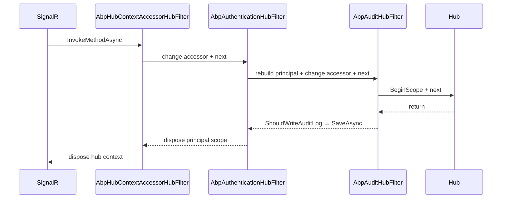

ABP Framework's `Volo.Abp.AspNetCore.SignalR` package brings SignalR into the modular pipeline. The module discovers every `Hub`-derived type registered in the DI container, mounts them under conventional `/signalr-hubs/<kebab-name>` routes (or honors a `[HubRoute]` override), installs three hub filters (`AbpHubContextAccessorHubFilter`, `AbpAuthenticationHubFilter`, `AbpAuditHubFilter`), provides an `AbpHub` base class with the same lazy-service-provider shape as `AbpController`, and supplies an `IAbpHubContextAccessor` so audit-log contributors can correlate work back to a hub invocation. This page covers every file in `framework/src/Volo.Abp.AspNetCore.SignalR/`, describes the auto-mapping pipeline, and shows how dynamic-claim refresh is throttled at the hub layer.

## File inventory

| File | Purpose |
| --- | --- |
| `AbpAspNetCoreSignalRModule.cs` | Auto-discovery, `AddSignalR`, hub filters, endpoint mapping, auditing wiring. |
| `AbpSignalROptions.cs` | `Hubs`, `CheckDynamicClaimsInterval`. |
| `AbpSignalRConventionalRegistrar.cs` | Registers `Hub` subclasses as Transient. |
| `AbpSignalRUserIdProvider.cs` | `IUserIdProvider` using `ICurrentUser`. |
| `AbpHub.cs` / `AbpHub<T>.cs` | Hub base classes with lazy services, localization, clock. |
| `HubConfig.cs`, `HubConfigList.cs`, `HubRouteAttribute.cs`, `DisableAutoHubMapAttribute.cs` | Routing model. |
| `IAbpHubContextAccessor.cs`, `DefaultAbpHubContextAccessor.cs`, `AbpHubContext.cs` | Per-invocation accessor (AsyncLocal). |
| `AbpHubContextAccessorHubFilter.cs` | Pushes `AbpHubContext` into the accessor. |
| `Authentication/AbpAuthenticationHubFilter.cs` | Dynamic claims + `ICurrentPrincipalAccessor` push. |
| `Auditing/AbpAuditHubFilter.cs` | Wraps hub method calls in an audit scope. |
| `Auditing/AspNetCoreSignalRAuditLogContributor.cs` | Adds client/browser info; sets URL = `ServiceName.MethodName`. |

## Module pipeline

`AbpAspNetCoreSignalRModule.PreConfigureServices` adds a conventional registrar so `Hub` subclasses are picked up as transient services, and scans the in-flight service collection for hub types so they can be auto-mapped later:

```csharp framework/src/Volo.Abp.AspNetCore.SignalR/Volo/Abp/AspNetCore/SignalR/AbpAspNetCoreSignalRModule.cs
public override void PreConfigureServices(ServiceConfigurationContext context)
{
    context.Services.AddConventionalRegistrar(new AbpSignalRConventionalRegistrar());

    AutoAddHubTypes(context.Services);
}
```

### Conventional registrar

```csharp framework/src/Volo.Abp.AspNetCore.SignalR/Volo/Abp/AspNetCore/SignalR/AbpSignalRConventionalRegistrar.cs
public class AbpSignalRConventionalRegistrar : DefaultConventionalRegistrar
{
    protected override bool IsConventionalRegistrationDisabled(Type type)
    {
        return !IsHub(type) || base.IsConventionalRegistrationDisabled(type);
    }

    private static bool IsHub(Type type)
    {
        return typeof(Hub).IsAssignableFrom(type);
    }

    protected override ServiceLifetime? GetDefaultLifeTimeOrNull(Type type)
    {
        return ServiceLifetime.Transient;
    }
}
```

The registrar only sees hubs (everything else is disabled) and forces them to a Transient lifetime. SignalR's own factory will dispose hub instances per invocation; the registration is just enough to make DI resolve them.

### Auto-add hub types

`AutoAddHubTypes` hooks `services.OnRegistered`, collects each hub implementation, and at the end of pre-configuration pushes them into `AbpSignalROptions.Hubs`:

```csharp framework/src/Volo.Abp.AspNetCore.SignalR/Volo/Abp/AspNetCore/SignalR/AbpAspNetCoreSignalRModule.cs
private void AutoAddHubTypes(IServiceCollection services)
{
    var hubTypes = new List<Type>();

    services.OnRegistered(context =>
    {
        if (IsHubClass(context) && !IsDisabledForAutoMap(context))
        {
            hubTypes.Add(context.ImplementationType);
        }
    });

    services.Configure<AbpSignalROptions>(options =>
    {
        foreach (var hubType in hubTypes)
        {
            options.Hubs.Add(HubConfig.Create(hubType));
        }
    });
}
```

A hub opts out of auto-mapping by carrying `[DisableAutoHubMap]`:

```csharp framework/src/Volo.Abp.AspNetCore.SignalR/Volo/Abp/AspNetCore/SignalR/DisableAutoHubMapAttribute.cs
public class DisableAutoHubMapAttribute : Attribute
{
}
```

Use it when you intend to map the hub manually with a custom dispatcher option, or when a base hub class is being scanned that should never be exposed by itself.

### Route convention

`HubRouteAttribute.GetRoutePattern(type)` returns the attribute value if present, otherwise falls back to `"/signalr-hubs/" + typeName.RemovePostFix("Hub").ToKebabCase()`:

```csharp framework/src/Volo.Abp.AspNetCore.SignalR/Volo/Abp/AspNetCore/SignalR/HubRouteAttribute.cs
public static string GetRoutePattern(Type hubType)
{
    var routeAttribute = hubType.GetSingleAttributeOrNull<HubRouteAttribute>();
    if (routeAttribute != null)
    {
        return routeAttribute.GetRoutePatternForType(hubType);
    }

    return "/signalr-hubs/" + hubType.Name.RemovePostFix("Hub").ToKebabCase();
}
```

Examples:

| Hub class | Route |
| --- | --- |
| `NotificationHub` | `/signalr-hubs/notification` |
| `ChatHub` | `/signalr-hubs/chat` |
| `MultiWordExampleHub` | `/signalr-hubs/multi-word-example` |
| `[HubRoute("/custom/path")] BarHub` | `/custom/path` |

## `ConfigureServices` and `AddSignalR`

The hub filters and the SignalR option flags are configured in a single block. The `DisableImplicitFromServicesParameters = true` flag is important: ABP's hub authoring expects services to be obtained via `LazyServiceProvider`, not as method parameters, and the implicit `[FromServices]` behaviour can confuse SignalR's argument deserialiser when DTOs and services share a constructor shape:

```csharp framework/src/Volo.Abp.AspNetCore.SignalR/Volo/Abp/AspNetCore/SignalR/AbpAspNetCoreSignalRModule.cs
var signalRServerBuilder = context.Services.AddSignalR(options =>
{
    options.DisableImplicitFromServicesParameters = true;
    options.AddFilter<AbpHubContextAccessorHubFilter>();
    options.AddFilter<AbpAuthenticationHubFilter>();
    options.AddFilter<AbpAuditHubFilter>();
});

context.Services.ExecutePreConfiguredActions(signalRServerBuilder);
```

`ExecutePreConfiguredActions` runs any callbacks queued through `PreConfigure<ISignalRServerBuilder>` — that's the extension point for `AddStackExchangeRedis`, `AddAzureSignalR`, etc.

### Endpoint mapping

The endpoint configuration runs at startup time via the `AbpEndpointRouterOptions`. It walks `AbpSignalROptions.Hubs` and reflectively calls a private generic `MapHub<THub>` per entry, collecting route patterns to feed the auditing ignore list:

```csharp framework/src/Volo.Abp.AspNetCore.SignalR/Volo/Abp/AspNetCore/SignalR/AbpAspNetCoreSignalRModule.cs
Configure<AbpEndpointRouterOptions>(options =>
{
    options.EndpointConfigureActions.Add(endpointContext =>
    {
        var signalROptions = endpointContext.ScopeServiceProvider
            .GetRequiredService<IOptions<AbpSignalROptions>>().Value;

        var hubWithRoutePatterns = new List<KeyValuePair<Type, string>>();
        foreach (var hubConfig in signalROptions.Hubs)
        {
            routePatterns.AddIfNotContains(hubConfig.RoutePattern);

            if (hubWithRoutePatterns.Any(x => x.Key == hubConfig.HubType && x.Value == hubConfig.RoutePattern))
            {
                throw new AbpException($"The hub type {hubConfig.HubType.FullName} is already registered with route pattern {hubConfig.RoutePattern}");
            }
            // ...MapHub<THub>(pattern, configureOptions)
        }
    });
});
```

A duplicate `(hubType, routePattern)` pair is treated as a fatal misconfiguration and throws — this catches the most common copy/paste mistake when adding manual mappings.

### Auditing & ignored URLs

The same configuration registers `/signalr-hubs` (and any custom route patterns) as auditing-ignored URLs so the regular MVC audit middleware does not double-log negotiate / streaming connections:

```csharp framework/src/Volo.Abp.AspNetCore.SignalR/Volo/Abp/AspNetCore/SignalR/AbpAspNetCoreSignalRModule.cs
Configure<AbpAspNetCoreAuditingOptions>(options =>
{
    foreach (var routePattern in routePatterns)
    {
        options.IgnoredUrls.AddIfNotContains(
            x => routePattern.StartsWith(x, StringComparison.OrdinalIgnoreCase),
            () => routePattern);
    }
});

Configure<AbpAuditingOptions>(options =>
{
    options.Contributors.Add(new AspNetCoreSignalRAuditLogContributor());
});
```

The contributor (next section) is what writes back hub-specific information into the audit log entry that `AbpAuditHubFilter` opens.

## `AbpHub` base class

`AbpHub` mirrors the shape of `AbpController` from [/aspnetcore/mvc](/aspnetcore/mvc) — every common service is available through `LazyServiceProvider`, the localizer is created on demand, and a `LocalizationResource` setter clears the cached localizer:

```csharp framework/src/Volo.Abp.AspNetCore.SignalR/Volo/Abp/AspNetCore/SignalR/AbpHub.cs
public abstract class AbpHub : Hub
{
    public IAbpLazyServiceProvider LazyServiceProvider { get; set; } = default!;

    [Obsolete("Use LazyServiceProvider instead.")]
    public IServiceProvider ServiceProvider { get; set; } = default!;

    protected ILogger Logger => LazyServiceProvider.LazyGetService<ILogger>(
        provider => LoggerFactory?.CreateLogger(GetType().FullName!) ?? NullLogger.Instance);

    protected ICurrentUser CurrentUser => LazyServiceProvider.LazyGetService<ICurrentUser>()!;
    protected ICurrentTenant CurrentTenant => LazyServiceProvider.LazyGetService<ICurrentTenant>()!;
    protected IAuthorizationService AuthorizationService => LazyServiceProvider.LazyGetService<IAuthorizationService>()!;
    protected IClock Clock => LazyServiceProvider.LazyGetService<IClock>()!;
    // ...IStringLocalizer L { get; } via CreateLocalizer()
}
```

`AbpHub<T>` provides the same surface for strongly-typed hubs (`Hub<TClient>`). The two classes intentionally duplicate code because C# does not allow multiple inheritance and the existing SignalR `Hub<T>` and `Hub` types are not related by a useful base.

## Per-invocation accessor

`AbpHubContext` captures the service provider, the hub instance, and the method/argument pair that triggered the current invocation:

```csharp framework/src/Volo.Abp.AspNetCore.SignalR/Volo/Abp/AspNetCore/SignalR/AbpHubContext.cs
public class AbpHubContext
{
    public IServiceProvider ServiceProvider { get; }
    public Hub Hub { get; }
    public MethodInfo HubMethod { get; }
    public IReadOnlyList<object?> HubMethodArguments { get; }
}
```

`DefaultAbpHubContextAccessor` stores it in `AsyncLocal<T>`, with a `Change` method that returns an `IDisposable` to pop back to the previous context — the same pattern used by `ICurrentPrincipalAccessor` and `ICurrentTenant`:

```csharp framework/src/Volo.Abp.AspNetCore.SignalR/Volo/Abp/AspNetCore/SignalR/DefaultAbpHubContextAccessor.cs
public AbpHubContext Context => _currentHubContext.Value!;

public virtual IDisposable Change(AbpHubContext context)
{
    var parent = Context;
    _currentHubContext.Value = context;
    return new DisposeAction(() => { _currentHubContext.Value = parent; });
}
```

`AbpHubContextAccessorHubFilter` wraps every invocation:

```csharp framework/src/Volo.Abp.AspNetCore.SignalR/Volo/Abp/AspNetCore/SignalR/AbpHubContextAccessorHubFilter.cs
using (hubContextAccessor.Change(new AbpHubContext(
           invocationContext.ServiceProvider,
           invocationContext.Hub,
           invocationContext.HubMethod,
           invocationContext.HubMethodArguments)))
{
    return await next(invocationContext);
}
```

## Authentication hub filter

`AbpAuthenticationHubFilter` is the most behavior-dense filter. It runs on both **connect** (`OnConnectedAsync`) and **every method invocation** (`InvokeMethodAsync`), and is responsible for refreshing dynamic claims with a throttling interval:

```csharp framework/src/Volo.Abp.AspNetCore.SignalR/Volo/Abp/AspNetCore/SignalR/Authentication/AbpAuthenticationHubFilter.cs
protected virtual async Task HandleDynamicClaimsPrincipalAsync(
    ClaimsPrincipal? claimsPrincipal,
    IServiceProvider serviceProvider,
    HubCallerContext hubCallerContext,
    bool skipCheckDynamicClaimsInterval)
{
    if (claimsPrincipal?.Identity != null &&
        claimsPrincipal.Identity.IsAuthenticated &&
        serviceProvider.GetRequiredService<IOptions<AbpClaimsPrincipalFactoryOptions>>().Value
            .IsDynamicClaimsEnabled)
    {
        var checkDynamicClaimsInterval = serviceProvider.GetRequiredService<IOptions<AbpSignalROptions>>().Value.CheckDynamicClaimsInterval;
        if (!skipCheckDynamicClaimsInterval &&
            checkDynamicClaimsInterval.HasValue &&
            hubCallerContext.Items.TryGetValue(nameof(HandleDynamicClaimsPrincipalAsync), out var lastCheckDynamicClaimsTime) &&
            lastCheckDynamicClaimsTime is DateTime lastCheckDynamicClaimsTimeValue)
        {
            if (DateTime.UtcNow.Subtract(lastCheckDynamicClaimsTimeValue) < checkDynamicClaimsInterval.Value)
            {
                return;
            }
        }
        // ...rebuild ClaimsPrincipal and call IAbpClaimsPrincipalFactory.CreateDynamicAsync
        if (claimsPrincipal.Identity?.IsAuthenticated == false)
        {
            hubCallerContext.Abort();
        }
    }
}
```

Three subtleties:

- The interval defaults to `5 seconds` (`AbpSignalROptions.CheckDynamicClaimsInterval`). Calls within that window short-circuit, which keeps high-frequency hub invocations from hammering the dynamic-claims cache.
- `OnConnectedAsync` passes `skipCheckDynamicClaimsInterval: true` so the first dynamic-claims check fires regardless of the timer.
- If the rebuilt principal is no longer authenticated, the filter aborts the connection — this is the mechanism that boots a user from a hub when their permission grant is revoked server-side.

## Audit hub filter

`AbpAuditHubFilter` opens an audit scope around the invocation, captures exceptions, and decides whether to persist:

```csharp framework/src/Volo.Abp.AspNetCore.SignalR/Volo/Abp/AspNetCore/SignalR/Auditing/AbpAuditHubFilter.cs
using (var saveHandle = auditingManager.BeginScope())
{
    object? result;
    try
    {
        result = await next(invocationContext);
        if (auditingManager.Current.Log.Exceptions.Any()) hasError = true;
    }
    catch (Exception ex)
    {
        hasError = true;
        if (!auditingManager.Current.Log.Exceptions.Contains(ex))
            auditingManager.Current.Log.Exceptions.Add(ex);
        throw;
    }
    finally
    {
        if (await ShouldWriteAuditLogAsync(auditingManager.Current.Log, invocationContext.ServiceProvider, hasError))
        {
            // commit UoW + saveHandle.SaveAsync
        }
    }
    return result;
}
```

`ShouldWriteAuditLogAsync` consults `AbpAuditingOptions`:

| Condition | Effect |
| --- | --- |
| `options.AlwaysLogSelectors` returns `true` | Persist regardless. |
| `options.AlwaysLogOnException && hasError` | Persist. |
| `!options.IsEnabledForAnonymousUsers && !ICurrentUser.IsAuthenticated` | Skip. |
| `Log.Actions` is empty | Skip. |

## SignalR audit-log contributor

`AspNetCoreSignalRAuditLogContributor` enriches the audit info with client IP/browser and rewrites the entry URL into a friendly "service.method" string:

```csharp framework/src/Volo.Abp.AspNetCore.SignalR/Volo/Abp/AspNetCore/SignalR/Auditing/AspNetCoreSignalRAuditLogContributor.cs
public override void PostContribute(AuditLogContributionContext context)
{
    var hubContext = context.ServiceProvider.GetRequiredService<IAbpHubContextAccessor>().Context;
    if (hubContext == null) return;

    var firstAction = context.AuditInfo.Actions.FirstOrDefault();
    context.AuditInfo.Url = firstAction?.ServiceName + "." + firstAction?.MethodName;
    context.AuditInfo.HttpStatusCode = null;
}
```

The early-return on `hubContext == null` is critical: the contributor is registered globally (via `AbpAuditingOptions.Contributors.Add`), so it runs for every HTTP request too — but should only mutate the row when the entry originated from a hub invocation.

## User ID provider

`AbpSignalRUserIdProvider` is registered as a transient `IUserIdProvider`. It uses `ICurrentPrincipalAccessor` to evaluate `ICurrentUser.Id` against the connection's `User` so that `Clients.User(userId)` works with whatever claim type ABP is configured for:

```csharp framework/src/Volo.Abp.AspNetCore.SignalR/Volo/Abp/AspNetCore/SignalR/AbpSignalRUserIdProvider.cs
public virtual string? GetUserId(HubConnectionContext connection)
{
    using (_currentPrincipalAccessor.Change(connection.User))
    {
        return _currentUser.Id?.ToString();
    }
}
```

## Filter execution order



## Hub configuration models

| Type | Notes |
| --- | --- |
| `HubConfig` | Holds `HubType`, `RoutePattern`, list of `Action<HttpConnectionDispatcherOptions>`. Static factory `HubConfig.Create<THub>()`. |
| `HubConfigList` | `List<HubConfig>` with `AddOrUpdate<THub>(Action<HubConfig>?)`. |
| `HubRouteAttribute` | Attribute-driven override of the kebab-case default. |
| `DisableAutoHubMapAttribute` | Opt-out of auto-discovery. |

A manual configuration looks like:

```csharp
Configure<AbpSignalROptions>(options =>
{
    options.Hubs.AddOrUpdate<ChatHub>(config =>
    {
        config.RoutePattern = "/realtime/chat";
        config.ConfigureActions.Add(o => o.Transports = HttpTransportType.WebSockets);
    });
});
```

## Cross-references

- [/aspnetcore/overview](/aspnetcore/overview) — `AbpEndpointRouterOptions` and the module dependency on `AbpAspNetCoreModule`.
- [/aspnetcore/mvc](/aspnetcore/mvc) — `AbpController` mirror class and shared `IAbpLazyServiceProvider` pattern.
- [/aspnetcore/jwt-bearer-auth](/aspnetcore/jwt-bearer-auth) — token validation that produces the `ClaimsPrincipal` `AbpAuthenticationHubFilter` reads.
- [/aspnetcore/openidconnect-auth](/aspnetcore/openidconnect-auth) — cookie counterpart for browsers that establish hub connections.
- [/aspnetcore/serilog](/aspnetcore/serilog) — `AbpSerilogMiddleware` does **not** run for hubs; correlate via `IAbpHubContextAccessor` instead.
- [/security/authorization](/security/authorization) — hub method `[Authorize]` policies are evaluated against the dynamically refreshed principal.
- [/modules/openiddict-module](/modules/openiddict-module) — issuer of the tokens hub clients present in the negotiate header.
- [/http/overview](/http/overview) — HTTP client proxies do not reach into hubs; use `IHubContext<THub>` from a service instead.
