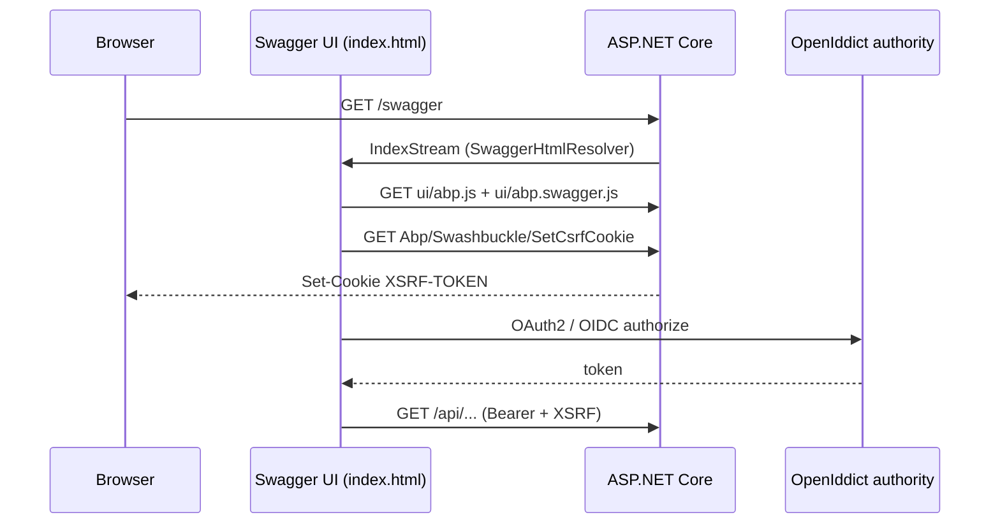

ABP Framework ships `Volo.Abp.Swashbuckle` as a thin layer over `Swashbuckle.AspNetCore` that registers ABP-friendly `SwaggerGenOptions`, exposes `AddAbpSwaggerGenWithOAuth` / `AddAbpSwaggerGenWithOidc` for OpenIddict-style flows, hides the framework's auto-generated `Volo.*` endpoints, normalises generic schema IDs, rewrites enums as string values, and patches the Swagger UI HTML so that ABP's anti-forgery cookie and dynamic discovery scripts work inside the embedded UI. This page covers the wiring, the helper extensions, the document/schema filters, the CSRF controller, the UI HTML rewrite, and the multi-tenant placeholder cleanup — everything that lives under `framework/src/Volo.Abp.Swashbuckle/`.

## File inventory

| File | Purpose |
| --- | --- |
| `Volo/Abp/Swashbuckle/AbpSwashbuckleModule.cs` | Module: depends on MVC + virtual FS, embeds UI assets. |
| `Microsoft/Extensions/DependencyInjection/AbpSwaggerGenServiceCollectionExtensions.cs` | `AddAbpSwaggerGen`, `AddAbpSwaggerGenWithOAuth`, `AddAbpSwaggerGenWithOidc`. |
| `Microsoft/Extensions/DependencyInjection/AbpSwaggerGenOptionsExtensions.cs` | `HideAbpEndpoints`, `UserFriendlyEnums`, `CustomAbpSchemaIds`. |
| `Microsoft/Extensions/DependencyInjection/AbpSwaggerUIOptionsExtensions.cs` | `AbpAppPath` head-script injection. |
| `Microsoft/AspNetCore/Builder/AbpSwaggerUIBuilderExtensions.cs` | `UseAbpSwaggerUI` middleware wiring. |
| `Volo/Abp/Swashbuckle/AbpSwashbuckleDocumentFilter.cs` | Strips non-ABP routes from the generated document. |
| `Volo/Abp/Swashbuckle/AbpSwashbuckleEnumSchemaFilter.cs` | Converts numeric enums to string enum schemas. |
| `Volo/Abp/Swashbuckle/AbpSwaggerOidcFlows.cs` | Constants: `authorization_code`, `implicit`, `password`, `client_credentials`. |
| `Volo/Abp/Swashbuckle/SwaggerHtmlResolver.cs` / `ISwaggerHtmlResolver.cs` | Injects `ui/abp.swagger.js` into Swashbuckle's `index.html`. |
| `Volo/Abp/Swashbuckle/AbpSwashbuckleController.cs` | `Abp/Swashbuckle/SetCsrfCookie` endpoint used by `abp.js`. |

<Tip>The module is `AbpSwashbuckleModule`, **not** `AbpAspNetCoreSwashbuckleModule`. It depends on `AbpVirtualFileSystemModule` and `AbpAspNetCoreMvcModule` so that the JavaScript shims shipped in the assembly (`ui/abp.js`, `ui/abp.swagger.js`) can be served from the embedded file set.</Tip>

## Module bootstrap

`AbpSwashbuckleModule.ConfigureServices` registers nothing more than an embedded virtual file set — every Swagger-related service is added through the explicit `AddAbpSwaggerGen*` extension methods, never by automatic discovery. Mirror this in any wiki diagram that suggests the module touches `IServiceCollection`:

```csharp framework/src/Volo.Abp.Swashbuckle/Volo/Abp/Swashbuckle/AbpSwashbuckleModule.cs
[DependsOn(
    typeof(AbpVirtualFileSystemModule),
    typeof(AbpAspNetCoreMvcModule))]
public class AbpSwashbuckleModule : AbpModule
{
    public override void ConfigureServices(ServiceConfigurationContext context)
    {
        Configure<AbpVirtualFileSystemOptions>(options =>
        {
            options.FileSets.AddEmbedded<AbpSwashbuckleModule>();
        });
    }
}
```

This is also why the [virtual file system](/aspnetcore/overview) is a hard prerequisite: the `ui/abp.swagger.js` resource that `SwaggerHtmlResolver` injects ships embedded in the same assembly and is served through `UseStaticFiles` over the ABP file set.

## `AddAbpSwaggerGen` — the base entry point

`AbpSwaggerGenServiceCollectionExtensions.AddAbpSwaggerGen` calls Swashbuckle's `AddSwaggerGen` and maps ABP's streaming content types to a binary string schema so that `IRemoteStreamContent`/`RemoteStreamContent` parameters surface as file upload fields:

```csharp framework/src/Volo.Abp.Swashbuckle/Microsoft/Extensions/DependencyInjection/AbpSwaggerGenServiceCollectionExtensions.cs
public static IServiceCollection AddAbpSwaggerGen(
    this IServiceCollection services,
    Action<SwaggerGenOptions>? setupAction = null)
{
    return services.AddSwaggerGen(options =>
    {
        Func<OpenApiSchema> remoteStreamContentSchemaFactory = () => new OpenApiSchema()
        {
            Type = JsonSchemaType.String,
            Format = "binary"
        };

        options.MapType<RemoteStreamContent>(remoteStreamContentSchemaFactory);
        options.MapType<IRemoteStreamContent>(remoteStreamContentSchemaFactory);

        setupAction?.Invoke(options);
    });
}
```

Any caller who pipes `setupAction` can still call `c.SwaggerDoc(...)`, add filters, or tweak naming — the helper guarantees the binary mapping is in place but never overrides user choices.

## OAuth flow registration

`AddAbpSwaggerGenWithOAuth` is the helper most ABP templates wire up against an OpenIddict or IdentityServer authority. It builds the `authorize`/`token` URLs from the authority root, adds a single `oauth2` security definition with the **authorization code** flow, and applies a global security requirement so every operation shows a padlock:

```csharp framework/src/Volo.Abp.Swashbuckle/Microsoft/Extensions/DependencyInjection/AbpSwaggerGenServiceCollectionExtensions.cs
public static IServiceCollection AddAbpSwaggerGenWithOAuth(
    this IServiceCollection services,
    [NotNull] string authority,
    [NotNull] Dictionary<string, string> scopes,
    Action<SwaggerGenOptions>? setupAction = null,
    string authorizationEndpoint = "/connect/authorize",
    string tokenEndpoint = "/connect/token")
{
    var authorizationUrl = new Uri($"{authority.TrimEnd('/')}{authorizationEndpoint.EnsureStartsWith('/')}");
    var tokenUrl = new Uri($"{authority.TrimEnd('/')}{tokenEndpoint.EnsureStartsWith('/')}");

    return services
        .AddAbpSwaggerGen()
        .AddSwaggerGen(options =>
        {
            options.AddSecurityDefinition("oauth2", new OpenApiSecurityScheme
            {
                Type = SecuritySchemeType.OAuth2,
                Flows = new OpenApiOAuthFlows
                {
                    AuthorizationCode = new OpenApiOAuthFlow
                    {
                        AuthorizationUrl = authorizationUrl,
                        Scopes = scopes,
                        TokenUrl = tokenUrl
                    }
                }
            });

            options.AddSecurityRequirement(document => new OpenApiSecurityRequirement()
            {
                [new OpenApiSecuritySchemeReference("oauth2", document)] = []
            });

            setupAction?.Invoke(options);
        });
}
```

The default endpoints (`/connect/authorize`, `/connect/token`) are the standard paths exposed by the [OpenIddict module](/modules/openiddict-module); if you target the [IdentityServer module](/modules/identityserver-module) the same defaults still apply. Pass custom endpoint strings only when you have a non-standard reverse proxy.

## OIDC flow registration with discovery

`AddAbpSwaggerGenWithOidc` differs in three important ways:

1. It registers a `SecuritySchemeType.OpenIdConnect` security definition pointing at the authority's `.well-known/openid-configuration` document, letting Swagger UI auto-discover endpoints and scopes.
2. It pushes the configured flow names, scopes and discovery URL into `SwaggerUIOptions.ConfigObject.AdditionalItems` under the keys `oidcSupportedFlows`, `oidcSupportedScopes`, `oidcDiscoveryEndpoint` — the embedded `ui/abp.swagger.js` reads them at runtime to drive its login dialog.
3. It strips any `{0}`-style tenant placeholders from the discovery URL before storing it on the security definition.

```csharp framework/src/Volo.Abp.Swashbuckle/Microsoft/Extensions/DependencyInjection/AbpSwaggerGenServiceCollectionExtensions.cs
flows ??= new [] { AbpSwaggerOidcFlows.AuthorizationCode };

services.Configure<SwaggerUIOptions>(swaggerUiOptions =>
{
    swaggerUiOptions.ConfigObject.AdditionalItems["oidcSupportedFlows"] = flows;
    swaggerUiOptions.ConfigObject.AdditionalItems["oidcSupportedScopes"] = scopes;
    swaggerUiOptions.ConfigObject.AdditionalItems["oidcDiscoveryEndpoint"] = discoveryUrl;
});
```

The legal flow names live in `AbpSwaggerOidcFlows`:

| Constant | Value |
| --- | --- |
| `AuthorizationCode` | `"authorization_code"` |
| `Implicit` | `"implicit"` |
| `Password` | `"password"` |
| `ClientCredentials` | `"client_credentials"` |

### Tenant placeholder scrubbing

ABP's multi-tenant URL provider can interpolate tenant info into authority URLs. Swagger UI cannot resolve those placeholders, so `RemoveTenantPlaceholders` strips them before passing the URL to the OIDC discovery client:

```csharp framework/src/Volo.Abp.Swashbuckle/Microsoft/Extensions/DependencyInjection/AbpSwaggerGenServiceCollectionExtensions.cs
private static string RemoveTenantPlaceholders(string url)
{
    return url
        .Replace(MultiTenantUrlProvider.TenantPlaceHolder + ".", string.Empty)
        .Replace(MultiTenantUrlProvider.TenantIdPlaceHolder + ".", string.Empty)
        .Replace(MultiTenantUrlProvider.TenantNamePlaceHolder + ".", string.Empty);
}
```

See [multi-tenancy URL resolution](/multi-tenancy) for the meaning of those placeholder tokens.

## Schema and document filters

### `CustomAbpSchemaIds`

The default Swashbuckle schema-id selector (`type.Name`) produces collisions whenever two DTOs share a class name across modules (e.g. `Volo.Abp.Identity.UserDto` vs `MyApp.Users.UserDto`). `CustomAbpSchemaIds` replaces it with the full type name and walks generic arguments recursively:

```csharp framework/src/Volo.Abp.Swashbuckle/Microsoft/Extensions/DependencyInjection/AbpSwaggerGenOptionsExtensions.cs
public static void CustomAbpSchemaIds(this SwaggerGenOptions options)
{
    string SchemaIdSelector(Type modelType)
    {
        if (!modelType.IsConstructedGenericType)
        {
            return modelType.FullName!.Replace("[]", "Array");
        }

        var prefix = modelType.GetGenericArguments()
            .Select(SchemaIdSelector)
            .Aggregate((previous, current) => previous + current);
        return modelType.FullName!.Split('`').First() + "Of" + prefix;
    }

    options.CustomSchemaIds(SchemaIdSelector);
}
```

A `PagedResultDto<UserDto>` therefore becomes `Volo.Abp.Application.Dtos.PagedResultDtoOfVolo.Abp.Identity.UserDto`. Arrays collapse `[]` to `Array` so the identifier stays valid inside `$ref` paths.

### `UserFriendlyEnums`

`UserFriendlyEnums` registers `AbpSwashbuckleEnumSchemaFilter` which replaces integer enum schemas with the string member names. Clients then accept names like `"Active"` instead of `0`:

```csharp framework/src/Volo.Abp.Swashbuckle/Volo/Abp/Swashbuckle/AbpSwashbuckleEnumSchemaFilter.cs
public void Apply(IOpenApiSchema schema, SchemaFilterContext context)
{
    if (schema is OpenApiSchema openApiScheme && context.Type.IsEnum)
    {
        openApiScheme.Enum?.Clear();
        openApiScheme.Type = JsonSchemaType.String;
        openApiScheme.Format = null;
        foreach (var name in Enum.GetNames(context.Type))
        {
            openApiScheme.Enum?.Add(JsonNode.Parse($"\"{name}\"")!);
        }
    }
}
```

### `HideAbpEndpoints`

`HideAbpEndpoints` installs `AbpSwashbuckleDocumentFilter`, which post-processes the document and removes every path whose action descriptor `DisplayName` does **not** contain one of the configured prefixes (default: `"Volo."`). It also trims dangling `tags` and removes route-parameter constraints (`{id:guid}` → `{id}`):

```csharp framework/src/Volo.Abp.Swashbuckle/Volo/Abp/Swashbuckle/AbpSwashbuckleDocumentFilter.cs
public class AbpSwashbuckleDocumentFilter : IDocumentFilter
{
    protected virtual string[] ActionUrlPrefixes { get; set; } = new[] { "Volo." };

    protected virtual string RegexConstraintPattern => @":regex\(([^()]*)\)";

    public virtual void Apply(OpenApiDocument swaggerDoc, DocumentFilterContext context)
    {
        var actionUrls = context.ApiDescriptions
            .Select(apiDescription => apiDescription.ActionDescriptor)
            .Where(actionDescriptor => !string.IsNullOrEmpty(actionDescriptor.DisplayName) &&
                                       ActionUrlPrefixes.Any(actionUrlPrefix => !actionDescriptor.DisplayName.Contains(actionUrlPrefix)))
            .DistinctBy(actionDescriptor => actionDescriptor.AttributeRouteInfo?.Template)
            .Select(RemoveRouteParameterConstraints)
            .Where(actionUrl => !string.IsNullOrEmpty(actionUrl))
            .ToList();

        swaggerDoc.Paths
            .RemoveAll(path => !actionUrls.Contains(path.Key));
        // ...remove orphan tags...
    }
}
```

<Warning>Despite the name, the filter does **not** delete only ABP endpoints — derive from it and override `ActionUrlPrefixes` if you need different inclusion rules. The shipped behaviour is "hide framework endpoints that you didn't intend to expose to integrators."</Warning>

### Combined recipe

A typical `ConfigureServices` looks like:

```csharp
context.Services.AddAbpSwaggerGenWithOidc(
    authority: configuration["AuthServer:Authority"]!,
    scopes: new[] { "MyApp" },
    flows: new[] { AbpSwaggerOidcFlows.AuthorizationCode },
    discoveryEndpoint: configuration["AuthServer:MetadataAddress"],
    options =>
    {
        options.SwaggerDoc("v1", new OpenApiInfo { Title = "MyApp API", Version = "v1" });
        options.HideAbpEndpoints();
        options.UserFriendlyEnums();
        options.CustomAbpSchemaIds();
    });
```

## The UI middleware

`UseAbpSwaggerUI` is a small wrapper over `UseSwaggerUI`:

```csharp framework/src/Volo.Abp.Swashbuckle/Microsoft/AspNetCore/Builder/AbpSwaggerUIBuilderExtensions.cs
public static IApplicationBuilder UseAbpSwaggerUI(
    this IApplicationBuilder app,
    Action<SwaggerUIOptions>? setupAction = null)
{
    var resolver = app.ApplicationServices.GetService<ISwaggerHtmlResolver>();

    return app.UseSwaggerUI(options =>
    {
        options.InjectJavascript("ui/abp.js");
        options.IndexStream = () => resolver?.Resolver();

        setupAction?.Invoke(options);
    });
}
```

Two side effects deserve attention:

- `InjectJavascript("ui/abp.js")` pulls a script from the embedded file set; that file calls `Abp/Swashbuckle/SetCsrfCookie` so the OAuth callback works with [anti-forgery protection](/aspnetcore/mvc).
- `IndexStream` is replaced by the `ISwaggerHtmlResolver`, which rewrites the SwashbuckleAspNetCore.SwaggerUI's bundled `index.html` to add a second script tag for `ui/abp.swagger.js`.

### `SwaggerHtmlResolver`

```csharp framework/src/Volo.Abp.Swashbuckle/Volo/Abp/Swashbuckle/SwaggerHtmlResolver.cs
public virtual Stream Resolver()
{
    var scriptBundleScript = "<script src=\"%(ScriptBundlePath)\" charset=\"utf-8\"></script>";
    var abpSwaggerScript = "<script src=\"ui/abp.swagger.js\" charset=\"utf-8\"></script>";
    var stream = typeof(SwaggerUIOptions).GetTypeInfo().Assembly
        .GetManifestResourceStream("Swashbuckle.AspNetCore.SwaggerUI.index.html");

    var html = new StreamReader(stream!)
        .ReadToEnd()
        .Replace(scriptBundleScript, $"{scriptBundleScript}\n{abpSwaggerScript}");

    return new MemoryStream(Encoding.UTF8.GetBytes(html));
}
```

The implementation is decorated `ITransientDependency`. Replace it with your own service if you need a different HTML transformation — register your class with `[Dependency(ReplaceServices = true)]` and let conventional registration take over.

### `AbpAppPath`

`AbpSwaggerUIOptionsExtensions.AbpAppPath` injects an inline `<script>` into `HeadContent` that exposes the configured base path to `abp.swagger.js` as `abp.appPath`:

```csharp framework/src/Volo.Abp.Swashbuckle/Microsoft/Extensions/DependencyInjection/AbpSwaggerUIOptionsExtensions.cs
private static string BuildAppPathScript(string normalizedAppPath, string headContent)
{
    var builder = new StringBuilder(headContent);
    if (builder.Length > 0) builder.AppendLine();

    builder.AppendLine("<script>");
    builder.AppendLine("    var abp = abp || {};");
    builder.AppendLine($"    abp.appPath = {JsonSerializer.Serialize(normalizedAppPath)};");
    builder.AppendLine("</script>");
    return builder.ToString();
}
```

Call `options.AbpAppPath("/swagger-host")` from inside `UseAbpSwaggerUI` when your Swagger UI lives behind a non-root path prefix.

## Anti-forgery cookie endpoint

`AbpSwashbuckleController` exposes a single CSRF cookie endpoint at `Abp/Swashbuckle/SetCsrfCookie`. Swagger UI's "Try it out" button POSTs across origins, so ABP's anti-forgery filter requires that cookie before any state-changing request:

```csharp framework/src/Volo.Abp.Swashbuckle/Volo/Abp/Swashbuckle/AbpSwashbuckleController.cs
[Area("Abp")]
[Route("Abp/Swashbuckle/[action]")]
[DisableAuditing]
[RemoteService(false)]
[ApiExplorerSettings(IgnoreApi = true)]
public class AbpSwashbuckleController : AbpController
{
    protected readonly IAbpAntiForgeryManager AntiForgeryManager;
    // ...
    [HttpGet]
    public virtual void SetCsrfCookie()
    {
        AntiForgeryManager.SetCookie();
    }
}
```

`[RemoteService(false)]` plus `[ApiExplorerSettings(IgnoreApi = true)]` keep the endpoint out of the generated OpenAPI document — even before `HideAbpEndpoints` runs.

## Request pipeline overview



## Cross-references

- [/aspnetcore/overview](/aspnetcore/overview) — how the ABP virtual file system serves the embedded `ui/abp.js` and `ui/abp.swagger.js` assets.
- [/aspnetcore/mvc](/aspnetcore/mvc) — `AbpController`, `IAbpAntiForgeryManager`, and the conventional auto API controller machinery whose routes the document filter is designed to expose.
- [/aspnetcore/api-versioning](/aspnetcore/api-versioning) — pair `AddAbpSwaggerGen` with a `SwaggerDoc` per API version for versioned OpenAPI docs.
- [/aspnetcore/oauth-auth](/aspnetcore/oauth-auth) and [/aspnetcore/openidconnect-auth](/aspnetcore/openidconnect-auth) — server-side counterparts that issue the tokens Swagger UI requests.
- [/modules/openiddict-module](/modules/openiddict-module) — default authority for `AddAbpSwaggerGenWithOAuth`/`WithOidc`.
- [/modules/identityserver-module](/modules/identityserver-module) — legacy authority option supported by the same helpers.
- [/http/overview](/http/overview) — `IRemoteStreamContent` / `RemoteStreamContent` semantics that the binary schema mapping is built around.
- [/security/authorization](/security/authorization) — the security requirement attached by `WithOAuth`/`WithOidc` is what propagates the padlock onto each endpoint after `[Authorize]` is applied.
