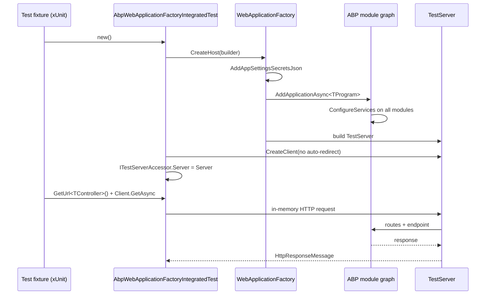

ABP Framework's `Volo.Abp.AspNetCore.TestBase` package provides the integration testing host that every ABP HTTP-layer test fixture inherits from. The package contains three generations of base classes — `AbpAspNetCoreIntegratedTestBase<TStartupModule>` (legacy, `IHostBuilder`-based), `AbpAspNetCoreAsyncIntegratedTestBase<TModule>` (legacy, async initialiser), and the current `AbpWebApplicationFactoryIntegratedTest<TProgram>` (built on `WebApplicationFactory`) — plus the supporting `ITestServerAccessor`/`TestServerAccessor`, an `AspNetCoreTestProxyHttpClientFactory` that routes ABP dynamic proxy HTTP calls back through the in-memory `TestServer`, and the no-op `IHostLifetime` implementations that keep the test host from waiting on Ctrl-C. This page documents every file under `framework/src/Volo.Abp.AspNetCore.TestBase/`.

## File inventory

| File | Purpose |
| --- | --- |
| `AbpAspNetCoreTestBaseModule.cs` | Module: depends on `AbpHttpClientModule`, `AbpAspNetCoreModule`, `AbpTestBaseModule`, `AbpAutofacModule`. |
| `AbpWebApplicationFactoryIntegratedTest.cs` | Current base class (built on `WebApplicationFactory<TProgram>`). |
| `AbpAspNetCoreIntegratedTestBase.cs` | Legacy base built on `Host.CreateDefaultBuilder`. Marked `[Obsolete]`. |
| `AbpAspNetCoreAsyncIntegratedTestBase.cs` | Legacy async-init base using `WebApplication`. Marked `[Obsolete]`. |
| `ITestServerAccessor.cs`, `TestServerAccessor.cs` | Singleton accessor for the active `TestServer`. |
| `TestStartup.cs` | Bridges module startup for legacy hosts. |
| `WebHostBuilderExtensions.cs` | `UseAbpTestServer` — registers `IServer` as `TestServer`. |
| `WebApplicationBuilderExtensions.cs` | `RunAbpModuleAsync<TModule>` — boots an ABP module from a `WebApplicationBuilder`. |
| `AbpNoopHostLifetime.cs`, `TestNoopHostLifetime.cs` | `IHostLifetime` no-ops. |
| `DynamicProxying/AspNetCoreTestProxyHttpClientFactory.cs` | Routes `IProxyHttpClientFactory` calls through `TestServer.CreateClient()`. |
| `WebProjectPatchHelper.cs` | Helper that locates a web project's directory by walking up from the current test directory. |

## Module

The module declares four dependencies and exposes no `ConfigureServices`:

```csharp framework/src/Volo.Abp.AspNetCore.TestBase/Volo/Abp/AspNetCore/TestBase/AbpAspNetCoreTestBaseModule.cs
[DependsOn(typeof(AbpHttpClientModule))]
[DependsOn(typeof(AbpAspNetCoreModule))]
[DependsOn(typeof(AbpTestBaseModule))]
[DependsOn(typeof(AbpAutofacModule))]
public class AbpAspNetCoreTestBaseModule : AbpModule
{
}
```

Every dependency matters:

| Dependency | Why it's pulled in |
| --- | --- |
| `AbpHttpClientModule` | The dynamic HTTP client proxies under test need `IProxyHttpClientFactory`. |
| `AbpAspNetCoreModule` | Brings the pipeline middleware that the test will exercise. |
| `AbpTestBaseModule` | Shares the underlying `AbpTestBaseWithServiceProvider` lifecycle with the non-HTTP test base. |
| `AbpAutofacModule` | Tests run on Autofac, matching production hosts. |

## `AbpWebApplicationFactoryIntegratedTest<TProgram>` — the current API

The recommended base class wraps `WebApplicationFactory<TProgram>`:

```csharp framework/src/Volo.Abp.AspNetCore.TestBase/Volo/Abp/AspNetCore/TestBase/AbpWebApplicationFactoryIntegratedTest.cs
public abstract class AbpWebApplicationFactoryIntegratedTest<TProgram> : WebApplicationFactory<TProgram>
    where TProgram : class
{
    protected HttpClient Client { get; set; }
    protected IServiceProvider ServiceProvider => Services;

    protected AbpWebApplicationFactoryIntegratedTest()
    {
        Client = CreateClient(new WebApplicationFactoryClientOptions
        {
            AllowAutoRedirect = false
        });
        ServiceProvider.GetRequiredService<ITestServerAccessor>().Server = Server;
    }
```

The constructor calls `CreateClient` with `AllowAutoRedirect = false` so test code can assert on `Location` headers (essential for cookie + OIDC redirects). The `ITestServerAccessor` is populated immediately so that the dynamic proxy factory (next section) can reach the in-memory server.

### Host overrides

The class customises both host builders:

```csharp framework/src/Volo.Abp.AspNetCore.TestBase/Volo/Abp/AspNetCore/TestBase/AbpWebApplicationFactoryIntegratedTest.cs
protected override IHost CreateHost(IHostBuilder builder)
{
    builder
        .AddAppSettingsSecretsJson()
        .ConfigureServices(ConfigureServices);
    return base.CreateHost(builder);
}

protected override void ConfigureWebHost(IWebHostBuilder builder)
{
    builder.ConfigureAppConfiguration((hostingContext, config) =>
    {
        hostingContext.HostingEnvironment.EnvironmentName = "Production";
    });
    base.ConfigureWebHost(builder);
}
```

`AddAppSettingsSecretsJson` is ABP's extension that loads `appsettings.secrets.json` so secrets can be injected without environment variables. Forcing `EnvironmentName = "Production"` makes the test bypass developer-only code paths (DB seeders that wipe state, verbose logging) — override in your subclass if your test needs the development host.

### Service helpers

The base exposes a familiar trio of resolution helpers:

```csharp framework/src/Volo.Abp.AspNetCore.TestBase/Volo/Abp/AspNetCore/TestBase/AbpWebApplicationFactoryIntegratedTest.cs
protected virtual T? GetService<T>() => Services.GetService<T>();
protected virtual T GetRequiredService<T>() where T : notnull => Services.GetRequiredService<T>();
protected virtual T? GetKeyedServices<T>(object? serviceKey) => ServiceProvider.GetKeyedService<T>(serviceKey);
protected virtual T GetRequiredKeyedService<T>(object? serviceKey) where T : notnull => ServiceProvider.GetRequiredKeyedService<T>(serviceKey);
```

### URL helpers

A `GetUrl<TController>` family computes default routes by removing the conventional suffixes — `Controller`, `AppService`, `ApplicationService`, `IntService`, `IntegrationService`, `Service`:

```csharp framework/src/Volo.Abp.AspNetCore.TestBase/Volo/Abp/AspNetCore/TestBase/AbpWebApplicationFactoryIntegratedTest.cs
protected virtual string GetUrl<TController>()
{
    return "/" + typeof(TController).Name.RemovePostFix("Controller", "AppService", "ApplicationService", "IntService", "IntegrationService", "Service");
}

protected virtual string GetUrl<TController>(string actionName, object queryStringParamsAsAnonymousObject)
{
    var url = GetUrl<TController>(actionName);
    var dictionary = new RouteValueDictionary(queryStringParamsAsAnonymousObject);
    if (dictionary.Any())
    {
        url += "?" + dictionary.Select(d => $"{d.Key}={d.Value}").JoinAsString("&");
    }
    return url;
}
```

These match the conventional routes that [auto API controllers](/aspnetcore/mvc) mint from application service interfaces. Use them to keep tests robust against route refactors.

## Legacy base classes (obsolete)

`AbpAspNetCoreIntegratedTestBase<TStartupModule>` was the first iteration. It inherits from `AbpTestBaseWithServiceProvider`, builds a host through `Host.CreateDefaultBuilder()`, and uses Microsoft's `TestServer` directly:

```csharp framework/src/Volo.Abp.AspNetCore.TestBase/Volo/Abp/AspNetCore/TestBase/AbpAspNetCoreIntegratedTestBase.cs
[Obsolete("Use AbpWebApplicationFactoryIntegratedTest instead.")]
public abstract class AbpAspNetCoreIntegratedTestBase<TStartupModule> : AbpTestBaseWithServiceProvider, IDisposable
    where TStartupModule : class
{
    protected TestServer Server { get; }
    protected HttpClient Client { get; }
    // ...

    protected virtual IHostBuilder CreateHostBuilder()
    {
        return Host.CreateDefaultBuilder()
            .AddAppSettingsSecretsJson()
            .ConfigureWebHostDefaults(webBuilder =>
            {
                if (typeof(TStartupModule).IsAssignableTo<IAbpModule>())
                {
                    webBuilder.UseStartup<TestStartup<TStartupModule>>();
                }
                else
                {
                    webBuilder.UseStartup<TStartupModule>();
                }

                webBuilder.UseAbpTestServer();
            })
            .UseAutofac()
            .ConfigureServices(ConfigureServices);
    }
```

`AbpAspNetCoreAsyncIntegratedTestBase<TModule>` is the parallel async variant that uses the newer `WebApplication.CreateBuilder()` API and exposes `InitializeAsync` / `DisposeAsync`. Both are `[Obsolete]` — new code should use `AbpWebApplicationFactoryIntegratedTest`.

### `TestStartup`

`TestStartup<TStartupModule>` bridges the gap when the legacy host receives a module type instead of an old-style Startup class:

```csharp framework/src/Volo.Abp.AspNetCore.TestBase/Volo/Abp/AspNetCore/TestBase/TestStartup.cs
internal class TestStartup<TStartupModule>
{
    public void ConfigureServices(IServiceCollection services)
    {
        AsyncHelper.RunSync(() => services.AddApplicationAsync(typeof(TStartupModule)));
    }

    public void Configure(IApplicationBuilder app)
    {
        AsyncHelper.RunSync(app.InitializeApplicationAsync);
    }
}
```

<Warning>`AsyncHelper.RunSync` is required because the legacy `IStartup.ConfigureServices` signature is synchronous. New `WebApplication` hosts use `await builder.Services.AddApplicationAsync<TModule>(...)` from `WebApplicationBuilderExtensions.RunAbpModuleAsync` instead.</Warning>

## `UseAbpTestServer`

`AbpWebHostBuilderExtensions.UseAbpTestServer` swaps the production `IServer` for `Microsoft.AspNetCore.TestHost.TestServer` and replaces the host lifetime with the no-op:

```csharp framework/src/Volo.Abp.AspNetCore.TestBase/Volo/Abp/AspNetCore/TestBase/WebHostBuilderExtensions.cs
public static IWebHostBuilder UseAbpTestServer(this IWebHostBuilder builder)
{
    return builder.ConfigureServices(services =>
    {
        services.AddScoped<IHostLifetime, AbpNoopHostLifetime>();
        services.AddScoped<IServer, TestServer>();
    });
}
```

The scoped `IServer` is unusual — the production registration is singleton — but it matches the legacy lifecycle of `TestServer` instances and is harmless because the host resolves it exactly once at startup.

## `RunAbpModuleAsync`

The new-style boot is a one-liner:

```csharp framework/src/Volo.Abp.AspNetCore.TestBase/Volo/Abp/AspNetCore/TestBase/WebApplicationBuilderExtensions.cs
public async static Task RunAbpModuleAsync<TModule>(this WebApplicationBuilder builder, Action<AbpApplicationCreationOptions>? optionsAction = null, string? applicationName = null)
    where TModule : IAbpModule
{
    applicationName = applicationName ?? typeof(TModule).Assembly.GetName()?.Name;
    if (!applicationName.IsNullOrWhiteSpace())
    {
        // Set the application name as the assembly name of the module will automatically add assembly to the ApplicationParts of MVC application.
        builder.Environment.ApplicationName = applicationName;
    }

    builder.Host.UseAutofac();
    await builder.AddApplicationAsync<TModule>(optionsAction);
    var app = builder.Build();
    await app.InitializeApplicationAsync();
    await app.RunAsync();
}
```

Setting `Environment.ApplicationName` is what lets MVC discover controllers inside the module assembly — without it, `WebApplication.CreateBuilder` would default to the test runner's assembly name and miss the controllers under test.

## No-op host lifetimes

Both classes do the same thing — return immediately from both lifecycle hooks — so the host does not wait on Ctrl-C in a test context:

```csharp framework/src/Volo.Abp.AspNetCore.TestBase/Volo/Abp/AspNetCore/TestBase/AbpNoopHostLifetime.cs
public class AbpNoopHostLifetime : IHostLifetime
{
    public Task StopAsync(CancellationToken cancellationToken) => Task.CompletedTask;
    public Task WaitForStartAsync(CancellationToken cancellationToken) => Task.CompletedTask;
}
```

Two duplicates exist (`AbpNoopHostLifetime`, `TestNoopHostLifetime`) because the legacy and current bases register them with different lifetimes; consider them interchangeable.

## `ITestServerAccessor`

A simple accessor used to surface the active `TestServer` to deeply-nested services:

```csharp framework/src/Volo.Abp.AspNetCore.TestBase/Volo/Abp/AspNetCore/TestBase/ITestServerAccessor.cs
public interface ITestServerAccessor
{
    TestServer Server { get; set; }
}
```

```csharp framework/src/Volo.Abp.AspNetCore.TestBase/Volo/Abp/AspNetCore/TestBase/TestServerAccessor.cs
public class TestServerAccessor : ITestServerAccessor, ISingletonDependency
{
    public TestServer Server { get; set; } = default!;
}
```

The base classes set `Server` from the constructor; nothing else touches the property at runtime.

## Dynamic proxy: in-memory `HttpClient`

`AspNetCoreTestProxyHttpClientFactory` replaces the production `IProxyHttpClientFactory` so that any dynamic HTTP client proxy created in a test scenario calls back into the in-memory `TestServer` instead of dialing out:

```csharp framework/src/Volo.Abp.AspNetCore.TestBase/Volo/Abp/AspNetCore/TestBase/DynamicProxying/AspNetCoreTestProxyHttpClientFactory.cs
[Dependency(ReplaceServices = true)]
public class AspNetCoreTestProxyHttpClientFactory : IProxyHttpClientFactory, ITransientDependency
{
    private readonly ITestServerAccessor _testServerAccessor;

    public AspNetCoreTestProxyHttpClientFactory(ITestServerAccessor testServerAccessor)
    {
        _testServerAccessor = testServerAccessor;
    }

    public HttpClient Create() => _testServerAccessor.Server.CreateClient();
    public HttpClient Create(string name) => Create();
}
```

This is the single most important reason ABP integration tests just work: when the proxied client calls `https://my-service/api/...`, the substituted factory invokes the in-memory `TestServer` rather than the network. See [/http/overview](/http/overview) for the production-side proxy.

## `WebProjectPatchHelper`

The helper finds a web project's content root by walking up from the current working directory and searching every parent recursively for a project file:

```csharp framework/src/Volo.Abp.AspNetCore.TestBase/Volo/Abp/AspNetCore/TestBase/WebProjectPatchHelper.cs
public static class GetWebProjectContentRootPathHelper
{
    public static string Get(string webProjectName)
    {
        var currentDirectory = new DirectoryInfo(Directory.GetCurrentDirectory());
        while (currentDirectory != null && Directory.GetParent(currentDirectory.FullName) != null)
        {
            currentDirectory = Directory.GetParent(currentDirectory.FullName);
            if (currentDirectory == null) continue;
            var files = currentDirectory.GetFiles(webProjectName, SearchOption.AllDirectories);
            if (files.Length > 0) return files[0].DirectoryName!;
        }
        throw new AbpException($"Web project({webProjectName}) not found!");
    }
}
```

Use it when the runtime view engine needs to load Razor views from the source project layout (typical in solution layouts where the test runs from `test/My.Tests/bin/...` and the views live under `src/My.Web/Views`). Pass the `.csproj` file name as `webProjectName`.

## Test lifecycle diagram



## Choosing a base class

| Scenario | Use |
| --- | --- |
| New project using `WebApplication.CreateBuilder` and `Program.cs` | `AbpWebApplicationFactoryIntegratedTest<TProgram>` |
| Legacy project with `Startup.cs` and `Host.CreateDefaultBuilder` | `AbpAspNetCoreIntegratedTestBase<TStartup>` (now obsolete) |
| Legacy project but you need async fixture initialization | `AbpAspNetCoreAsyncIntegratedTestBase<TModule>` (now obsolete) |

## Cross-references

- [/aspnetcore/overview](/aspnetcore/overview) — module bootstrapping that `RunAbpModuleAsync` orchestrates.
- [/aspnetcore/mvc](/aspnetcore/mvc) — auto-controller route conventions that `GetUrl<TController>` mirrors.
- [/aspnetcore/api-versioning](/aspnetcore/api-versioning) — register a `Fixed` version provider before booting the test host.
- [/aspnetcore/jwt-bearer-auth](/aspnetcore/jwt-bearer-auth) — tests can swap `AddAbpJwtBearer` for a stub scheme inside `ConfigureServices`.
- [/aspnetcore/openidconnect-auth](/aspnetcore/openidconnect-auth) — the no-redirect client is what lets you assert on the OIDC challenge `Location`.
- [/security/authorization](/security/authorization) — tests run inside a fully composed authorization pipeline.
- [/http/overview](/http/overview) — production `IProxyHttpClientFactory` is the contract `AspNetCoreTestProxyHttpClientFactory` overrides.
- [/modules/openiddict-module](/modules/openiddict-module) — pair the test host with an in-memory OpenIddict server for end-to-end auth scenarios.
- [/modules/identityserver-module](/modules/identityserver-module) — alternative in-memory issuer.
