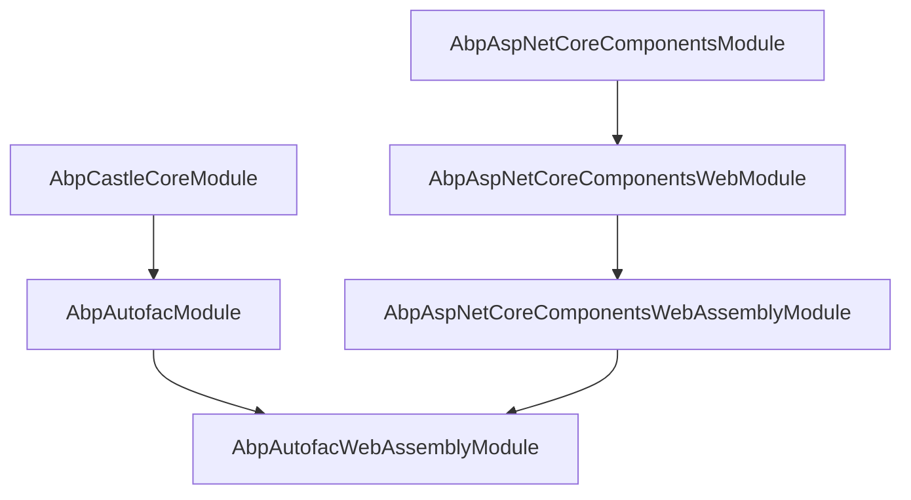
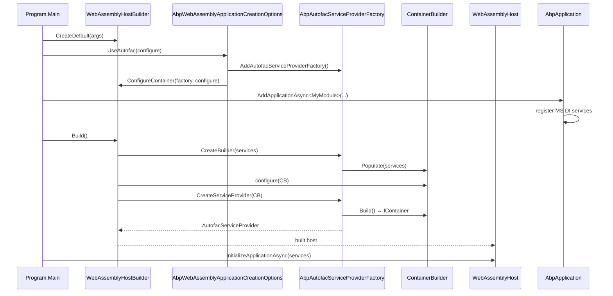

The `Volo.Abp.Autofac.WebAssembly` package wires the
[Autofac](https://autofac.org) container into an ABP Blazor WebAssembly
host. This page covers the two-class package — `AbpAutofacWebAssemblyModule`
and the `AbpWebAssemblyApplicationCreationOptionsAutofacExtensions.UseAutofac()`
extension method — and explains why ABP swaps the default
`Microsoft.Extensions.DependencyInjection` container for Autofac in WASM:
to unlock property injection, type interception, and the
`Volo.Abp.DynamicProxy` integration that ABP modules expect.

The package directory is `framework/src/Volo.Abp.Autofac.WebAssembly/`. It
is the WASM counterpart to the server-side `Volo.Abp.Autofac`, sharing the
same `AbpAutofacServiceProviderFactory` but adapting registration to the
`WebAssemblyHostBuilder` builder pattern.

## Why Autofac in WASM?

The Microsoft DI container that ships with `Microsoft.Extensions.DependencyInjection`
deliberately ships a *minimal* feature set: no property injection, no
named registrations, no auto-discovery, no decorators. ABP relies on
several capabilities Autofac provides:

| Capability | MS DI | Autofac | Used by |
|------------|-------|---------|---------|
| Property injection | ❌ | ✅ | `AbpComponentBase.Logger`, `Localizer` |
| Type interception (DynamicProxy) | ❌ | ✅ | UoW / Authorization / Auditing aspects |
| Open-generic with multiple matching constraints | Partial | ✅ | `IObjectMapper<TContext>` resolution |
| Module composition | ❌ | ✅ | `Autofac.Module` registrations |

On Blazor Server you almost always opt into Autofac via `UseAutofac()` on
the ASP.NET Core host. On Blazor WebAssembly the host builder type is
different (`WebAssemblyHostBuilder` rather than `WebApplicationBuilder`),
so the integration ships as a separate package: this one.

## Module

`framework/src/Volo.Abp.Autofac.WebAssembly/Volo/Abp/Autofac/WebAssembly/AbpAutofacWebAssemblyModule.cs`
is intentionally empty — its `[DependsOn]` is the whole contract:

```csharp
[DependsOn(
    typeof(AbpAutofacModule),
    typeof(AbpAspNetCoreComponentsWebAssemblyModule)
    )]
public class AbpAutofacWebAssemblyModule : AbpModule
{

}
```

Two dependencies, no body. The reason: every Autofac-specific service
(`AbpAutofacServiceProviderFactory`, `AbpPropertySelector`,
`AbpRegistrationBuilderExtensions`) is brought in via `AbpAutofacModule`
from the regular `Volo.Abp.Autofac` package; the WebAssembly module exists
purely as a typed `[DependsOn]` target for end-user modules to express
"I want Autofac and I want WebAssembly".

## The UseAutofac extension

`framework/src/Volo.Abp.Autofac.WebAssembly/Microsoft/AspNetCore/Components/WebAssembly/Hosting/AbpWebAssemblyApplicationCreationOptionsAutofacExtensions.cs`
declares a single method:

```csharp
public static class AbpWebAssemblyApplicationCreationOptionsAutofacExtensions
{
    public static void UseAutofac(
        [NotNull] this AbpWebAssemblyApplicationCreationOptions options,
        Action<ContainerBuilder>? configure = null)
    {
        options.HostBuilder.Services.AddAutofacServiceProviderFactory();
        options.HostBuilder.ConfigureContainer(
            options.HostBuilder.Services.GetSingletonInstance<IServiceProviderFactory<ContainerBuilder>>(),
            configure
        );
    }
}
```

Two distinct things happen in those two lines:

1. **`AddAutofacServiceProviderFactory()`** is the same call used by every
   Autofac-enabled ABP host. It is declared in `Volo.Abp.Autofac` and
   registers an `AbpAutofacServiceProviderFactory` instance as a singleton
   `IServiceProviderFactory<ContainerBuilder>` *and* exposes the
   `ContainerBuilder` itself as an `ObjectAccessor<ContainerBuilder>`.
2. **`HostBuilder.ConfigureContainer(factory, configure)`** plugs the
   factory into `WebAssemblyHostBuilder` — Microsoft's WASM equivalent of
   the `HostBuilder.UseServiceProviderFactory` pattern. The optional
   `configure` action is invoked with the factory's `ContainerBuilder`
   when the host is built, letting your `Program.cs` register additional
   Autofac modules without subclassing anything.

The reason `UseAutofac` lives as an extension on
`AbpWebAssemblyApplicationCreationOptions` (and not on
`WebAssemblyHostBuilder` directly) is composition: the WASM module
registers `WebAssemblyHostBuilder` as a singleton during
`AddApplicationAsync<TStartupModule>`, and the options object is the only
place where end-user `Program.cs` code can reach it before the
`AbpApplication` is constructed.

## Typical Program.cs

```csharp
public class Program
{
    public static async Task Main(string[] args)
    {
        var builder = WebAssemblyHostBuilder.CreateDefault(args);
        builder.RootComponents.Add<App>("#app");

        await builder.Services.AddApplicationAsync<MyBlazorClientModule>(options =>
        {
            options.UseAutofac(containerBuilder =>
            {
                // optional: register your own Autofac modules / decorators
                containerBuilder.RegisterModule<MyAutofacModule>();
            });
        });

        var host = builder.Build();
        await host.Services
            .GetRequiredService<IAbpApplicationWithExternalServiceProvider>()
            .InitializeApplicationAsync(host.Services);
        await host.RunAsync();
    }
}
```

The `MyBlazorClientModule` then `[DependsOn(typeof(AbpAutofacWebAssemblyModule), ...)]`
to wire the rest of the ABP graph.

## Plumbing under the hood

`AddAutofacServiceProviderFactory()` is defined in
`framework/src/Volo.Abp.Autofac/Volo/Abp/AbpAutofacAbpApplicationCreationOptionsExtensions.cs`:

```csharp
public static AbpAutofacServiceProviderFactory AddAutofacServiceProviderFactory(
    this IServiceCollection services)
{
    return services.AddAutofacServiceProviderFactory(new ContainerBuilder());
}

public static AbpAutofacServiceProviderFactory AddAutofacServiceProviderFactory(
    this IServiceCollection services,
    ContainerBuilder containerBuilder)
{
    var factory = new AbpAutofacServiceProviderFactory(containerBuilder);

    services.AddObjectAccessor(containerBuilder);
    services.AddSingleton((IServiceProviderFactory<ContainerBuilder>)factory);

    return factory;
}
```

…and the factory itself, defined in
`framework/src/Volo.Abp.Autofac/Volo/Abp/Autofac/AbpAutofacServiceProviderFactory.cs`:

```csharp
public class AbpAutofacServiceProviderFactory : IServiceProviderFactory<ContainerBuilder>
{
    private readonly ContainerBuilder _builder;
    private IServiceCollection _services = default!;

    public ContainerBuilder CreateBuilder(IServiceCollection services)
    {
        _services = services;
        _builder.Populate(services);
        return _builder;
    }

    public IServiceProvider CreateServiceProvider(ContainerBuilder containerBuilder)
    {
        return new AutofacServiceProvider(containerBuilder.Build());
    }
}
```

The flow: `WebAssemblyHostBuilder.Build()` calls
`CreateBuilder(services)`, which populates the Autofac `ContainerBuilder`
from the MS DI `IServiceCollection`. Anything registered via
`ContainerBuilder` extension methods (such as the user-supplied `configure`
delegate above) is *added on top of* the populated MS DI registrations.
Finally `CreateServiceProvider` calls `containerBuilder.Build()` and wraps
the resulting `IContainer` in an `AutofacServiceProvider`.

## Module dependency map



The dependency on `AbpCastleCoreModule` (through `AbpAutofacModule`) is
what brings Castle.Core's DynamicProxy into the WASM payload. This is the
runtime that makes ABP's `[UnitOfWork]`, `[Authorize]`, and `[Audited]`
attributes actually intercept method calls.

## Boot sequence



The user-supplied `configure` delegate runs *after* `Populate` — meaning
any registration you add via `ContainerBuilder.RegisterType<>()` can
decorate, intercept, or replace anything ABP registered. This is the
intended extension seam for advanced scenarios like custom interceptors
or named registrations that MS DI cannot express.

## Where Autofac shows up in component code

Most ABP Blazor components do not reference Autofac directly: they
inherit `AbpComponentBase`, declare services via `[Inject]` or
constructor parameters, and the activator wires everything up. The
Autofac integration becomes visible only when:

| Scenario | Why Autofac matters |
|----------|---------------------|
| `[UnitOfWork]` attribute on a component method | Aspect woven by Castle DynamicProxy through Autofac interception |
| `IRepository<T>` injected into a component | Open-generic registration with multiple constraints |
| Property `Logger` populated on `AbpComponentBase` | `AbpPropertySelector` from `Volo.Abp.Autofac` performs property injection |
| Custom `Autofac.Module` registered via `UseAutofac(b => ...)` | Direct user extension point |

Without Autofac, MS DI silently no-ops on property injection: the
`Logger` property would remain `null` and the lazy fallback inside
`AbpComponentBase` (`_lazyLogger`) would compensate, but the
DynamicProxy-driven aspects would simply not fire.

## A tiny worked example

Suppose you want to add a Polly retry policy that wraps every HTTP call
made from your WASM client. With Autofac, you can register a decorator
once and have it cover every typed proxy:

```csharp
await builder.Services.AddApplicationAsync<MyBlazorClientModule>(options =>
{
    options.UseAutofac(b =>
    {
        b.RegisterType<RetryingHttpMessageHandler>()
            .As<DelegatingHandler>()
            .InstancePerDependency();

        b.RegisterDecorator<IFooAppService>(
            (ctx, _, inner) => new TimingDecorator<IFooAppService>(inner),
            fromKey: null);
    });
});
```

The same registration would not be expressible in MS DI without writing
your own factory because MS DI does not support `RegisterDecorator`
out of the box.

## Comparison: with vs without Autofac

| Aspect | Default (MS DI only) | With `UseAutofac()` |
|--------|----------------------|---------------------|
| Container | `ServiceProviderEngine` | `AutofacServiceProvider` |
| Property injection on `AbpComponentBase` | Skipped (lazy fallback only) | Performed by `AbpPropertySelector` |
| ABP DynamicProxy aspects (`[UnitOfWork]`, ...) | No interception | Interception via Castle |
| `IObjectMapper<TContext>` resolution | Works | Works |
| `RegisterDecorator` | Not available | Available |
| Cold start cost | Marginally lower | Slightly higher (Container.Build) |
| Payload size | Smaller | +Autofac + Castle.Core in `.wasm` bundle |

The cost is real but small (a few hundred KB), and the gain is the entire
ABP aspect ecosystem.

## Pitfalls and tips

<Warning>
The `WebAssemblyHostBuilder` exposes the host builder *synchronously*, but
`AddApplicationAsync` returns a `Task<IAbpApplicationWithExternalServiceProvider>`.
You must `await` `AddApplicationAsync` *before* calling `builder.Build()`
— if you await it after `Build()`, the factory has already produced an
`IServiceProvider` without the ABP service descriptors and Autofac's
`Populate` will see an incomplete service list. The shape shown in the
*Typical Program.cs* section above is the only correct one.
</Warning>

<Tip>
You don't need the `Volo.Abp.Autofac.WebAssembly` package at all if your
client module deliberately avoids ABP aspects (no `[UnitOfWork]`, no
`[Audited]`, no property-injected `Logger`) and you are comfortable with
MS DI's limitations. For most ABP apps, however, calling `UseAutofac()`
in `Program.cs` is the standard pattern.
</Tip>

## Where Autofac is *not* the right tool

| Host | Recommended container |
|------|------------------------|
| Blazor Server | Autofac via `UseAutofac()` on `WebApplicationBuilder` (regular `Volo.Abp.Autofac`) |
| Blazor WebAssembly | Autofac via `Volo.Abp.Autofac.WebAssembly` |
| MAUI Blazor | Autofac via `Volo.Abp.Autofac` (MAUI uses `IServiceCollection` from `MauiAppBuilder`) |
| Native MAUI | Autofac via `Volo.Abp.Autofac` |
| Tiny WASM (no aspects) | MS DI is enough |

The `Volo.Abp.Autofac.WebAssembly` package exists **only** because
`WebAssemblyHostBuilder` has a different surface than the regular
`Microsoft.Extensions.Hosting.HostBuilder` — every other ABP host can use
the regular `Volo.Abp.Autofac` package directly.

## Cross-stack pointers

- For how the WASM host module bootstraps and finds the
  `WebAssemblyHostBuilder` it hands to Autofac, see
  [/blazor/components-webassembly](/blazor/components-webassembly).
- For the regular Autofac integration (Server, MAUI, console hosts), see
  [/aspnetcore/overview](/aspnetcore/overview).
- For the shared component-base property-injection mechanics, see
  [/blazor/components-web](/blazor/components-web).
- For where Castle DynamicProxy aspects show up (e.g., authorization
  decorators inside `BlazoriseUiMessageService`), see
  [/blazor/blazorise-ui](/blazor/blazorise-ui).
- For SignalR over WASM, which composes through the same DI graph, see
  [/aspnetcore/signalr](/aspnetcore/signalr).
- For the OIDC token flow used by HTTP proxies registered in the same
  Autofac container, see
  [/http/http-client-identitymodel](/http/http-client-identitymodel).
- For the package matrix and the rest of the ABP Blazor stack, see
  [/blazor/overview](/blazor/overview).
- For server-side Blazor circuit hosting, see
  [/blazor/components-server](/blazor/components-server).
- For the MVC-side authorization aspects that Autofac interception drives,
  see [/ui-mvc/overview](/ui-mvc/overview).
- For the Identity module that backs `ICurrentUser` injected through the
  Autofac container, see [/modules/identity](/modules/identity).
