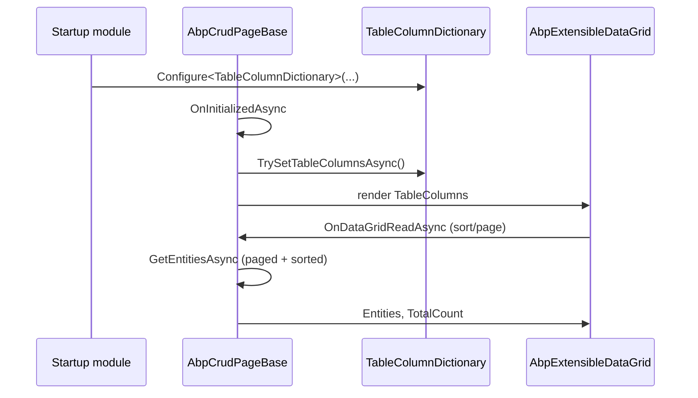
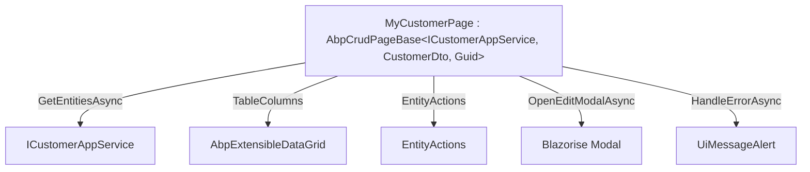
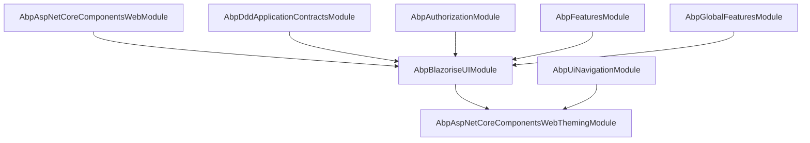

The `Volo.Abp.BlazoriseUI` package is the **concrete UI implementation
layer** for ABP's Blazor stack. It is the package that takes every shared
contract declared in `Volo.Abp.AspNetCore.Components` — `IUiMessageService`,
`IUiNotificationService`, `IUiPageProgressService`, `IAlertManager` — and
ships a [Blazorise](https://blazorise.com/)-backed implementation that
renders modals, toasts, snackbars, page-progress bars, alerts, and an
extensible CRUD grid. This page documents the module wiring, the service
substitutions performed via `[Dependency(ReplaceServices = true)]`, the
generic `AbpCrudPageBase<...>` family, and the supporting components for
modals, breadcrumbs, page alerts, and toolbar buttons.

The package directory is
`framework/src/Volo.Abp.BlazoriseUI/`. It is automatically pulled in by
`AbpAspNetCoreComponentsWebThemingModule` (see
[/blazor/theming-and-bundling](/blazor/theming-and-bundling)), so any host
that depends on a theming module already has Blazorise in scope.

## Module wiring

`AbpBlazoriseUIModule.cs` configures Blazorise with debounce defaults,
swaps Blazorise's component activator for ABP's DI-based one, and adds the
generic `AbpBlazorMessageLocalizerHelper<>` as a singleton:

```csharp
[DependsOn(
    typeof(AbpAspNetCoreComponentsWebModule),
    typeof(AbpDddApplicationContractsModule),
    typeof(AbpAuthorizationModule),
    typeof(AbpGlobalFeaturesModule),
    typeof(AbpFeaturesModule)
)]
public class AbpBlazoriseUIModule : AbpModule
{
    public override void ConfigureServices(ServiceConfigurationContext context)
    {
        ConfigureBlazorise(context);
    }

    private void ConfigureBlazorise(ServiceConfigurationContext context)
    {
        context.Services.AddBlazorise(options =>
        {
            options.Debounce = true;
            options.DebounceInterval = 800;
        });

        context.Services.Replace(ServiceDescriptor.Scoped<IComponentActivator, ComponentActivator>());
        context.Services.AddSingleton(typeof(AbpBlazorMessageLocalizerHelper<>));
    }
}
```

Note the `[DependsOn]` on `AbpDddApplicationContractsModule` — this gives
the package access to `IApplicationService`, `ICrudAppService`, and the
`*Dto` base types that `AbpCrudPageBase` requires. The dependency on
`AbpAuthorizationModule` is what lets `AbpComponentBase.AuthorizationService`
resolve. `AbpGlobalFeaturesModule` and `AbpFeaturesModule` are needed
because the extension-property components (`ExtensionPropertyComponentBase`
and friends) consult feature gates.

## Service substitutions

The package replaces three default ABP UI services with Blazorise-backed
implementations using `[Dependency(ReplaceServices = true)]`:

| Interface | Default in Web | Blazorise replacement |
|-----------|----------------|------------------------|
| `IUiMessageService` | `SimpleUiMessageService` (JS `alert()` / `confirm()`) | `BlazoriseUiMessageService` (renders a Blazorise `<Modal>`) |
| `IUiNotificationService` | `NullUiNotificationService` (no-op) | `BlazoriseUiNotificationService` (Blazorise `<Snackbar>`) |
| `IUiPageProgressService` | `NullUiPageProgressService` (no-op) | `BlazoriseUiPageProgressService` (Blazorise `<PageProgress>`) |

All three replacements are **scoped** event-source classes: they raise an
event when called and rely on a singleton renderer component
(`UiMessageAlert.razor`, `UiNotificationAlert.razor`,
`UiPageProgress.razor`) to subscribe and display the message.

### BlazoriseUiMessageService

`framework/src/Volo.Abp.BlazoriseUI/BlazoriseUiMessageService.cs`:

```csharp
[Dependency(ReplaceServices = true)]
public class BlazoriseUiMessageService : IUiMessageService, IScopedDependency
{
    public event EventHandler<UiMessageEventArgs>? MessageReceived;

    public Task<bool> Confirm(string message, string? title = null, Action<UiMessageOptions>? options = null)
    {
        var uiMessageOptions = CreateDefaultOptions();
        options?.Invoke(uiMessageOptions);

        var callback = new TaskCompletionSource<bool>();

        MessageReceived?.Invoke(this, new UiMessageEventArgs(
            UiMessageType.Confirmation, message, title, uiMessageOptions, callback));

        return callback.Task;
    }

    protected virtual UiMessageOptions CreateDefaultOptions()
    {
        return new UiMessageOptions
        {
            CenterMessage = true,
            ShowMessageIcon = true,
            OkButtonText = localizer["Ok"],
            CancelButtonText = localizer["Cancel"],
            ConfirmButtonText = localizer["Yes"],
        };
    }
}
```

The `Confirm` flow returns a `Task<bool>` that completes when the user
clicks the modal's OK/Cancel button — the dispatch goes through the
`TaskCompletionSource<bool>` plumbed into `UiMessageEventArgs`. Default
button labels are localised via the `AbpUiResource` resource declared in
`AbpUiModule`.

### BlazoriseUiNotificationService

`BlazoriseUiNotificationService.cs` is structurally identical but
returns plain `Task` (notifications are fire-and-forget). The default
options object is empty — the snackbar visual styling comes from the
shared `blazorise.snackbar.css` stylesheet.

### BlazoriseUiPageProgressService

`BlazoriseUiPageProgressService.cs` raises a `ProgressChanged` event with
the requested percentage. The `UiPageProgress.razor` renderer subscribes
and forwards to a Blazorise `<PageProgress>` element — see
[/blazor/components-web](/blazor/components-web) for the consumer flow
where the HTTP message handlers drive this for every API call.

## The renderer components

Three Razor components in `Components/` consume the event sources above:

| Component | File | Subscribes to | Renders |
|-----------|------|----------------|---------|
| `UiMessageAlert` | `Components/UiMessageAlert.razor.cs` | `BlazoriseUiMessageService.MessageReceived` | A Blazorise `<Modal>` with type-driven icon and colour |
| `UiNotificationAlert` | `Components/UiNotificationAlert.razor.cs` | `BlazoriseUiNotificationService.NotificationReceived` | Blazorise `<Snackbar>` with auto-dismiss |
| `UiPageProgress` | `Components/UiPageProgress.razor.cs` | `BlazoriseUiPageProgressService.ProgressChanged` | Top-of-page Blazorise `<PageProgress>` |

`UiMessageAlert` deserves attention — it derives its icon and colour from
the `UiMessageType` enum:

```csharp
protected virtual object? MessageIcon => Options?.MessageIcon ?? MessageType switch
{
    UiMessageType.Info => IconName.Info,
    UiMessageType.Success => IconName.Check,
    UiMessageType.Warning => IconName.Exclamation,
    UiMessageType.Error => IconName.Times,
    UiMessageType.Confirmation => IconName.QuestionCircle,
    _ => null,
};

protected virtual string? MessageIconColor => MessageType switch
{
    UiMessageType.Info => "var(--b-theme-info, var(--info, #17a2b8))",
    UiMessageType.Success => "var(--b-theme-success, var(--success, #28a745))",
    UiMessageType.Warning => "var(--b-theme-warning, var(--warning, #ffc107))",
    UiMessageType.Error => "var(--b-theme-danger, var(--danger, #dc3545))",
    UiMessageType.Confirmation => "var(--b-theme-secondary, var(--secondary, #6c757d))",
    _ => null,
};
```

The CSS-variable fallback chain (Blazorise variable → Bootstrap variable →
hex literal) gives a sensible default when neither the Blazorise theme
nor Bootstrap is loaded.

`UiPageProgress.razor.cs` is short and worth seeing in full:

```csharp
public partial class UiPageProgress : ComponentBase, IDisposable
{
    protected PageProgress? PageProgressRef { get; set; }
    protected int? Percentage { get; set; }
    protected bool Visible { get; set; }
    protected Color Color { get; set; } = default!;

    [Inject] protected IUiPageProgressService? UiPageProgressService { get; set; }

    protected override void OnInitialized()
    {
        base.OnInitialized();
        if (UiPageProgressService != null)
            UiPageProgressService.ProgressChanged += OnProgressChanged;
    }

    private async void OnProgressChanged(object? sender, UiPageProgressEventArgs e)
    {
        Percentage = e.Percentage;
        Visible = e.Percentage == null || (e.Percentage >= 0 && e.Percentage <= 100);
        Color = GetColor(e.Options.Type);

        if (PageProgressRef != null)
            await PageProgressRef.SetValueAsync(e.Percentage);

        await InvokeAsync(StateHasChanged);
    }

    public virtual void Dispose()
    {
        if (UiPageProgressService != null)
            UiPageProgressService.ProgressChanged -= OnProgressChanged;
    }
}
```

The `Visible` calculation treats `null` as "indeterminate progress" (the
HTTP handler convention) and `-1` (or any out-of-range value) as "done".

## BreadcrumbItem

`framework/src/Volo.Abp.BlazoriseUI/BreadcrumbItem.cs`:

```csharp
public class BreadcrumbItem
{
    public string Text { get; set; }
    public object? Icon { get; set; }
    public string? Url { get; set; }

    public BreadcrumbItem(string text, string? url = null, object? icon = null)
    {
        Text = text;
        Url = url;
        Icon = icon;
    }
}
```

The `Icon` is `object?` because Blazorise accepts both `IconName` enum
values and `string` literal icons (Font Awesome class names). The page
shell consumes a `List<BreadcrumbItem>` exposed on the page itself
(`AbpCrudPageBase.BreadcrumbItems`) or on `PageLayout.BreadcrumbItems`
declared in the theming layer — see
[/blazor/theming-and-bundling](/blazor/theming-and-bundling).

## Modal extension method

`AbpBlazoriseUiModalExtensions.cs` ships one helper that codifies a
common pattern — "cancel modal close on outside-click":

```csharp
public static class AbpBlazoriseUiModalExtensions
{
    public static Task CancelClosingModalWhenFocusLost(this Modal modal, ModalClosingEventArgs eventArgs)
    {
        eventArgs.Cancel = eventArgs.CloseReason == CloseReason.FocusLostClosing;
        return Task.CompletedTask;
    }
}
```

`AbpCrudPageBase.ClosingCreateModal` and `ClosingEditModal` use the same
pattern inline (see code below), and end-user pages can attach this helper
to any Blazorise `<Modal>` to avoid losing a partially-filled form when
the user clicks outside.

## AbpCrudPageBase

The header of the file in
`framework/src/Volo.Abp.BlazoriseUI/AbpCrudPageBase.cs` declares a
**cascading family** of generic base classes. The simplest signature
(three generic parameters) is the most common entry point, with each
overload adding more flexibility:

```csharp
public abstract class AbpCrudPageBase<TAppService, TEntityDto, TKey>
    : AbpCrudPageBase<TAppService, TEntityDto, TKey, PagedAndSortedResultRequestDto>
    where TAppService : ICrudAppService<TEntityDto, TKey>
    where TEntityDto : class, IEntityDto<TKey>, new() { }

public abstract class AbpCrudPageBase<TAppService, TEntityDto, TKey, TGetListInput> : ... { }
public abstract class AbpCrudPageBase<TAppService, TEntityDto, TKey, TGetListInput, TCreateInput> : ... { }
public abstract class AbpCrudPageBase<TAppService, TEntityDto, TKey, TGetListInput, TCreateInput, TUpdateInput> : ... { }
public abstract class AbpCrudPageBase<TAppService, TGetOutputDto, TGetListOutputDto, TKey, TGetListInput, TCreateInput, TUpdateInput> : ... { }
```

…and the ten-parameter "ultimate" base where every type is separately
configurable:

```csharp
public abstract class AbpCrudPageBase<
        TAppService,
        TGetOutputDto,
        TGetListOutputDto,
        TKey,
        TGetListInput,
        TCreateInput,
        TUpdateInput,
        TListViewModel,
        TCreateViewModel,
        TUpdateViewModel>
    : AbpComponentBase
    where TAppService : ICrudAppService<TGetOutputDto, TGetListOutputDto, TKey, TGetListInput, TCreateInput, TUpdateInput>
    where TGetOutputDto : IEntityDto<TKey>
    where TGetListOutputDto : IEntityDto<TKey>
    where TCreateInput : class
    where TUpdateInput : class
    where TGetListInput : new()
    where TListViewModel : IEntityDto<TKey>
    where TCreateViewModel : class, new()
    where TUpdateViewModel : class, new()
{
    [Inject] protected TAppService AppService { get; set; } = default!;
    [Inject] protected IStringLocalizer<AbpUiResource> UiLocalizer { get; set; } = default!;
    [Inject] public IAbpEnumLocalizer AbpEnumLocalizer { get; set; } = default!;
    [Inject] protected ExtensionPropertyPolicyChecker ExtensionPropertyPolicyChecker { get; set; } = default!;

    protected virtual int PageSize { get; } = LimitedResultRequestDto.DefaultMaxResultCount;

    protected int CurrentPage = 1;
    protected string CurrentSorting = default!;
    protected int? TotalCount;
    protected TGetListInput GetListInput = new TGetListInput();
    protected IReadOnlyList<TListViewModel> Entities = Array.Empty<TListViewModel>();
    protected TCreateViewModel NewEntity;
    protected TKey EditingEntityId = default!;
    protected TUpdateViewModel EditingEntity;
    protected Modal? CreateModal;
    protected Modal? EditModal;
    protected Validations? CreateValidationsRef;
    protected Validations? EditValidationsRef;
    protected List<BreadcrumbItem> BreadcrumbItems = new List<BreadcrumbItem>(2);
    protected DataGridEntityActionsColumn<TListViewModel> EntityActionsColumn = default!;
    protected EntityActionDictionary EntityActions { get; set; }
    protected TableColumnDictionary TableColumns { get; set; }

    protected string? CreatePolicyName { get; set; }
    protected string? UpdatePolicyName { get; set; }
    protected string? DeletePolicyName { get; set; }

    public bool HasCreatePermission { get; set; }
    public bool HasUpdatePermission { get; set; }
    public bool HasDeletePermission { get; set; }
}
```

The fields cluster into four groups:

| Group | Members | Purpose |
|-------|---------|---------|
| Listing state | `CurrentPage`, `CurrentSorting`, `TotalCount`, `GetListInput`, `Entities` | Backs the Blazorise `DataGrid` |
| Editing state | `NewEntity`, `EditingEntity`, `EditingEntityId`, `CreateModal`, `EditModal`, `CreateValidationsRef`, `EditValidationsRef` | Drives the create/edit modals |
| UI metadata | `BreadcrumbItems`, `EntityActionsColumn`, `EntityActions`, `TableColumns` | Page chrome and extensibility tables |
| Authorization | `CreatePolicyName`, `UpdatePolicyName`, `DeletePolicyName`, `Has*Permission` | Maps ABP permissions to UI toggles |

### Lifecycle methods

The base class wires permission checks and extensibility table population
into the Blazor lifecycle:

```csharp
protected async override Task OnInitializedAsync()
{
    await TrySetPermissionsAsync();
    await TrySetEntityActionsAsync();
    await TrySetTableColumnsAsync();
    await InvokeAsync(StateHasChanged);
}

protected async override Task OnAfterRenderAsync(bool firstRender)
{
    if (firstRender)
    {
        await SetToolbarItemsAsync();
        await SetBreadcrumbItemsAsync();
    }
    await base.OnAfterRenderAsync(firstRender);
}

protected virtual async Task SetPermissionsAsync()
{
    if (CreatePolicyName != null)
        HasCreatePermission = await AuthorizationService.IsGrantedAsync(CreatePolicyName);
    if (UpdatePolicyName != null)
        HasUpdatePermission = await AuthorizationService.IsGrantedAsync(UpdatePolicyName);
    if (DeletePolicyName != null)
        HasDeletePermission = await AuthorizationService.IsGrantedAsync(DeletePolicyName);
}
```

The toolbar and breadcrumb hooks fire only on the first render — i.e.,
they are idempotent across re-renders for the same component instance.

### List retrieval

`GetEntitiesAsync` is the read-side workhorse:

```csharp
protected virtual async Task GetEntitiesAsync()
{
    try
    {
        await UpdateGetListInputAsync();
        var result = await AppService.GetListAsync(GetListInput);
        Entities = MapToListViewModel(result.Items);
        TotalCount = (int?)result.TotalCount;
    }
    catch (Exception ex)
    {
        await HandleErrorAsync(ex);
    }
}

protected virtual Task UpdateGetListInputAsync()
{
    if (GetListInput is ISortedResultRequest sortedResultRequestInput)
        sortedResultRequestInput.Sorting = CurrentSorting;
    if (GetListInput is IPagedResultRequest pagedResultRequestInput)
        pagedResultRequestInput.SkipCount = (CurrentPage - 1) * PageSize;
    if (GetListInput is ILimitedResultRequest limitedResultRequestInput)
        limitedResultRequestInput.MaxResultCount = PageSize;
    return Task.CompletedTask;
}
```

It pattern-matches `TGetListInput` against the standard request interfaces
(`ISortedResultRequest`, `IPagedResultRequest`, `ILimitedResultRequest`)
to populate sort and paging fields generically.

`OnDataGridReadAsync` is the callback the Blazorise `DataGrid` invokes:

```csharp
protected virtual async Task OnDataGridReadAsync(DataGridReadDataEventArgs<TListViewModel> e)
{
    CurrentSorting = e.Columns
        .Where(c => c.SortDirection != SortDirection.Default)
        .OrderBy(c => c.SortIndex)
        .Select(c => c.SortField + (c.SortDirection == SortDirection.Descending ? " DESC" : ""))
        .JoinAsString(",");
    CurrentPage = e.Page;
    await GetEntitiesAsync();
    await InvokeAsync(StateHasChanged);
}
```

The sort string is in ABP's standard "Field DESC, Field2" syntax — the
same one accepted by `IRepository.GetListAsync(..., sorting)`.

### Modal flows

`OpenCreateModalAsync`, `CloseCreateModalAsync`, `ClosingCreateModal`,
`OpenEditModalAsync`, and their edit counterparts wrap permission checks
plus modal show/hide:

```csharp
protected virtual async Task OpenCreateModalAsync()
{
    try
    {
        if (CreateValidationsRef != null)
            await CreateValidationsRef.ClearAll();

        await CheckCreatePolicyAsync();

        NewEntity = new TCreateViewModel();

        await InvokeAsync(async () =>
        {
            StateHasChanged();
            if (CreateModal != null)
                await CreateModal.Show();
        });
    }
    catch (Exception ex)
    {
        await HandleErrorAsync(ex);
    }
}

protected virtual Task ClosingCreateModal(ModalClosingEventArgs eventArgs)
{
    eventArgs.Cancel = eventArgs.CloseReason == CloseReason.FocusLostClosing;
    return Task.CompletedTask;
}
```

The `ClearAll()` on `Validations` is what keeps a previously-submitted
form's validation messages from bleeding into a fresh open. The
`HandleErrorAsync` from `AbpComponentBase` routes any exception through
`IUserExceptionInformer` → `IUiMessageService.Error`.

## Extensibility table flow



The `EntityAction` and `TableColumn` types declared in
`Volo.Abp.AspNetCore.Components.Web` (see
[/blazor/components-web](/blazor/components-web)) feed the same
extensibility dictionaries `EntityActions` and `TableColumns` exposed on
`AbpCrudPageBase`. The Blazorise-side renderers
`AbpExtensibleDataGrid.razor` and `DataGridEntityActionsColumn.razor`
consume them.

## Object-extension property components

The `Components/ObjectExtending/` folder ships per-type editors for
extension properties: `CheckExtensionProperty`,
`DateTimeExtensionProperty`, `DateTimeOffsetExtensionProperty`,
`LookupExtensionProperty`, `SelectExtensionProperty`,
`TextExtensionProperty`, `TextAreaExtensionProperty`,
`TimeExtensionProperty`, and the top-level `ExtensionProperties.razor`
that dispatches over them.

`ExtensionPropertyComponentBase.cs` is the shared base class for all of
them. It consults the `ExtensionPropertyPolicyChecker` (registered by
`AbpBlazoriseUIModule` and injected into `AbpCrudPageBase`) before
rendering: if the current user lacks the read or write policy attached to
the extension property's `Policy`, the component renders nothing.

## Component inventory

The Blazorise-UI package ships a sizeable component catalogue under
`Components/`. The most commonly used:

| Component | Purpose |
|-----------|---------|
| `AbpExtensibleDataGrid<T>` | Renders an `EntityActionDictionary` + `TableColumnDictionary` over a Blazorise `<DataGrid>` |
| `DataGridEntityActionsColumn<T>` | Per-row action menu (edit, delete, custom) |
| `EntityAction` / `EntityActions` | Render an individual or the full action list |
| `SubmitButton` | Form-submit button with debounce + spinner during long-running posts |
| `ToolbarButton` | Page-toolbar action with icon + tooltip + policy gating |
| `PageAlert` | Renders the `AlertList` from `IAlertManager` as Blazorise `<Alert>` chips |
| `UiMessageAlert` | The modal dialog driven by `BlazoriseUiMessageService` |
| `UiNotificationAlert` | Snackbar driven by `BlazoriseUiNotificationService` |
| `UiPageProgress` | Top-of-page progress bar |

## How a page composes the stack



## Module dependency map



## Pitfalls and tips

<Tip>
Use the **smallest-arity** `AbpCrudPageBase` overload that fits your
service. The three-parameter version
(`AbpCrudPageBase<TAppService, TEntityDto, TKey>`) covers the
`PagedAndSortedResultRequestDto` case — the most common one — and
inherits *everything* from the 10-parameter base.
</Tip>

<Warning>
`BlazoriseUiMessageService.Confirm` returns a `Task<bool>` that completes
only when the user clicks **inside** the modal. If your page is torn down
before the user answers (a navigation, a circuit reset), the task will
never complete and you may leak a continuation. Always pair `await Confirm`
with a `using` scope tied to the component lifetime or check `IsDisposed`
on resume.
</Warning>

## Cross-stack pointers

- For the contracts these services implement, see
  [/blazor/components-web](/blazor/components-web).
- For where `IUiMessageService` is invoked from HTTP failures, see
  [/blazor/components-webassembly](/blazor/components-webassembly) and
  [/blazor/components-mauiblazor](/blazor/components-mauiblazor).
- For the bundled CSS that styles all Blazorise components, see
  [/blazor/theming-and-bundling](/blazor/theming-and-bundling).
- For the matching MVC tag-helper UI library, see [/ui-mvc/overview](/ui-mvc/overview).
- For the AppService contracts that `AbpCrudPageBase` calls into, see
  [/aspnetcore/overview](/aspnetcore/overview).
- For permission-gated rendering, see [/modules/identity](/modules/identity).
- For OIDC token issuance the HTTP layer needs before any CRUD call, see
  [/http/http-client-identitymodel](/http/http-client-identitymodel).
- For real-time UI updates that complement the snackbar service, see
  [/aspnetcore/signalr](/aspnetcore/signalr).
- For the host-package map, see [/blazor/overview](/blazor/overview).
- For the server-side Blazor module, see
  [/blazor/components-server](/blazor/components-server).
