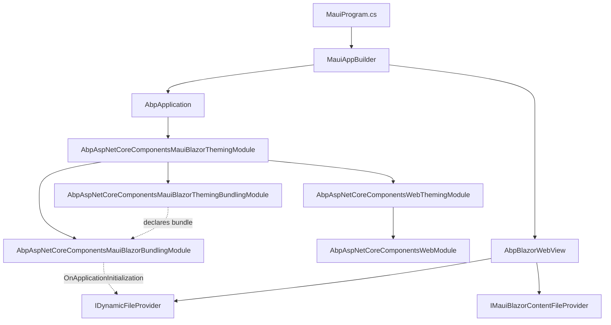
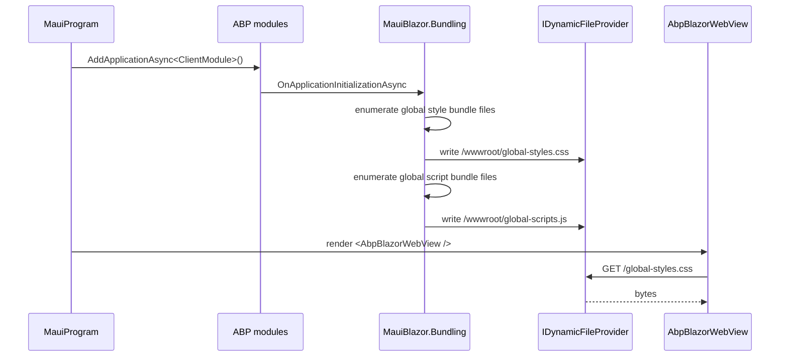

The `Volo.Abp.AspNetCore.Components.MauiBlazor` package family hosts Blazor
**inside a .NET MAUI shell** via `BlazorWebView`. This page covers the
runtime module, the `AbpMauiBlazorClientHttpMessageHandler`, the MAUI
overrides for `ICurrentTenantAccessor` / `ICurrentTimezoneProvider`, and the
two-tier bundling story: a build-time module that declares which CSS/JS go
into the global bundle, and a runtime `BundleManager` that physically copies
the bundle files into the MAUI app's `wwwroot/` so the embedded `BlazorWebView`
can serve them.

There are four packages in this family, each living under
`framework/src/Volo.Abp.AspNetCore.Components.MauiBlazor*/`:

| Package | Role |
|---------|------|
| `MauiBlazor` | Runtime host: HTTP handler, tenant/timezone accessors, language provider, cached config client |
| `MauiBlazor.Bundling` | Build-time + runtime: `BundleManager`, `IMauiBlazorContentFileProvider`, `AbpBlazorWebView` |
| `MauiBlazor.Theming` | Aggregation module pulling theming + bundling together |
| `MauiBlazor.Theming.Bundling` | Build-time only: declares the global bundle and its file lists |

## Runtime module

The host module is at
`framework/src/Volo.Abp.AspNetCore.Components.MauiBlazor/Volo/Abp/AspNetCore/Components/MauiBlazor/AbpAspNetCoreComponentsMauiBlazorModule.cs`
and mirrors the WASM module's shape:

```csharp
[DependsOn(
    typeof(AbpAspNetCoreMvcClientCommonModule),
    typeof(AbpUiModule),
    typeof(AbpAspNetCoreComponentsWebModule)
)]
public class AbpAspNetCoreComponentsMauiBlazorModule : AbpModule
{
    public override void PreConfigureServices(ServiceConfigurationContext context)
    {
        PreConfigure<AbpHttpClientBuilderOptions>(options =>
        {
            options.ProxyClientBuildActions.Add((_, builder) =>
            {
                builder.AddHttpMessageHandler<AbpMauiBlazorClientHttpMessageHandler>();
            });
        });
    }

    public async override Task OnApplicationInitializationAsync(ApplicationInitializationContext context)
    {
        await context.ServiceProvider.GetRequiredService<IClientScopeServiceProviderAccessor>().ServiceProvider
            .GetRequiredService<MauiBlazorCachedApplicationConfigurationClient>().InitializeAsync();
        await context.ServiceProvider.GetRequiredService<IClientScopeServiceProviderAccessor>().ServiceProvider
            .GetRequiredService<AbpComponentsClaimsCache>().InitializeAsync();
        await SetCurrentLanguageAsync(context.ServiceProvider);
    }
    // ...
}
```

`SetCurrentLanguageAsync` is structurally identical to the WASM version:
read `ApplicationConfigurationDto.Localization.CurrentCulture`, set
`DefaultThreadCurrent(UI)Culture`, and toggle the `rtl` class via the JS
interop helper. What differs is the language *source*:
`AbpMauiBlazorClientHttpMessageHandler` reads from an
`IMauiBlazorSelectedLanguageProvider` (`Preferences`/`SecureStorage`) rather
than from browser `localStorage`.

## HTTP message handler

`AbpMauiBlazorClientHttpMessageHandler.cs` is registered as a transient
`DelegatingHandler` on every proxy `HttpClient`:

```csharp
public class AbpMauiBlazorClientHttpMessageHandler : DelegatingHandler, ITransientDependency
{
    private readonly IUiPageProgressService _uiPageProgressService;
    private readonly IMauiBlazorSelectedLanguageProvider _mauiBlazorSelectedLanguageProvider;
    private readonly ICurrentTimezoneProvider _currentTimezoneProvider;

    protected async override Task<HttpResponseMessage> SendAsync(HttpRequestMessage request, CancellationToken cancellationToken)
    {
        try
        {
            await _uiPageProgressService.Go(null, options =>
            {
                options.Type = UiPageProgressType.Info;
            });

            await SetLanguageAsync(request);
            await SetTimeZoneAsync(request);

            return await base.SendAsync(request, cancellationToken);
        }
        finally
        {
            await _uiPageProgressService.Go(-1);
        }
    }

    private async Task SetLanguageAsync(HttpRequestMessage request)
    {
        var selectedLanguage = await _mauiBlazorSelectedLanguageProvider.GetSelectedLanguageAsync();
        if (!selectedLanguage.IsNullOrWhiteSpace())
        {
            request.Headers.AcceptLanguage.Clear();
            request.Headers.AcceptLanguage.Add(new StringWithQualityHeaderValue(selectedLanguage!));
        }
    }
}
```

Compare with the WASM handler (in
[/blazor/components-webassembly](/blazor/components-webassembly)) — the
MAUI version drops the **anti-forgery token step** and the streaming-enable
call. Anti-forgery is dropped because MAUI never has a same-origin cookie
context with the API host; the typical pattern is bearer-token auth
configured by [/http/http-client-identitymodel](/http/http-client-identitymodel).

The progress-bar `Go(null)` / `Go(-1)` envelope and the timezone header are
identical to the WASM path.

## MAUI tenant accessor and timezone provider

The MAUI host needs **singleton** accessors for tenant and timezone (because
in MAUI the whole shell is one "user") rather than per-circuit scoped ones.

`MauiBlazorCurrentTenantAccessor.cs`:

```csharp
[Dependency(ReplaceServices = true)]
public class MauiBlazorCurrentTenantAccessor : ICurrentTenantAccessor, ISingletonDependency
{
    public BasicTenantInfo? Current { get; set; }
}
```

`MauiBlazorCurrentTimezoneProvider` and `MauiBlazorCurrentTimezoneService`
behave similarly, persisting the choice across MAUI process restarts via
`Preferences`. The `MauiBlazorRemoteTenantStore` consults the cached
`ApplicationConfigurationDto` to resolve tenant info without a separate
round-trip.

## Language provider

`IMauiBlazorSelectedLanguageProvider.cs` is a single-method abstraction:

```csharp
public interface IMauiBlazorSelectedLanguageProvider
{
    Task<string?> GetSelectedLanguageAsync();
}
```

A default `NullMauiBlazorSelectedLanguageProvider` returns `null`, so by
default the handler does not override `Accept-Language` and the API
host's culture middleware decides. Real-world MAUI apps register a custom
provider that reads `Preferences.Get("AbpSelectedLanguage", null)`.

## Cached configuration client

`MauiBlazorCachedApplicationConfigurationClient.cs` (in the
`MauiBlazor` package) implements `ICachedApplicationConfigurationClient`
and shares the `ApplicationConfigurationCache` singleton with the rest of
the MAUI process. Because there is exactly one user in a MAUI app, the
cache is unconditionally hydrated at startup and only refreshed when a
permission change is observed.

## The `Bundling` package: hybrid bundling pipeline

`Volo.Abp.AspNetCore.Components.MauiBlazor.Bundling` is unusual: it runs
**both** at build time (declaring contributors) and at runtime (physically
materialising bundle files into MAUI's writable app-data directory). Its
module class
`framework/src/Volo.Abp.AspNetCore.Components.MauiBlazor.Bundling/Volo/Abp/AspNetCore/Components/MauiBlazor/Bundling/AbpAspNetCoreComponentsMauiBlazorBundlingModule.cs`:

```csharp
[DependsOn(
    typeof(AbpAspNetCoreComponentsMauiBlazorModule),
    typeof(AbpAspNetCoreBundlingModule)
)]
public class AbpAspNetCoreComponentsMauiBlazorBundlingModule : AbpModule
{
    public async override Task OnApplicationInitializationAsync(ApplicationInitializationContext context)
    {
        await InitialGlobalAssetsAsync(context);
    }

    protected virtual async Task InitialGlobalAssetsAsync(ApplicationInitializationContext context)
    {
        var bundlingOptions = context.ServiceProvider.GetRequiredService<IOptions<AbpBundlingOptions>>().Value;
        // ...
        if (!bundlingOptions.GlobalAssets.GlobalStyleBundleName.IsNullOrWhiteSpace())
        {
            var styleFiles = await bundleManager.GetStyleBundleFilesAsync(
                bundlingOptions.GlobalAssets.GlobalStyleBundleName);
            var styles = string.Empty;
            foreach (var file in styleFiles)
            {
                var fileInfo = mauiBlazorContentFileProvider.GetFileInfo(file.FileName);
                if (!fileInfo.Exists) { logger.LogError(...); continue; }

                var fileContent = await fileInfo.ReadAsStringAsync();
                if (!bundleManager.IsBundlingEnabled())
                {
                    fileContent = CssRelativePath.Adjust(fileContent, file.FileName,
                        Path.Combine(Directory.GetCurrentDirectory(), "wwwroot"));
                    styles += $"/*{file.FileName}*/{Environment.NewLine}{fileContent}{Environment.NewLine}{Environment.NewLine}";
                }
                else
                {
                    styles += $"{fileContent}{Environment.NewLine}{Environment.NewLine}";
                }
            }

            dynamicFileProvider.AddOrUpdate(
                new InMemoryFileInfo("/wwwroot/" + bundlingOptions.GlobalAssets.CssFileName,
                    Encoding.UTF8.GetBytes(styles),
                    bundlingOptions.GlobalAssets.CssFileName));
        }
        // ... and analogous loop for scripts
    }
}
```

What this does at runtime, every time the MAUI app starts:

1. Resolves the configured `GlobalStyleBundleName` / `GlobalScriptBundleName`
   (set by `MauiBlazor.Theming.Bundling` to `MauiBlazor.Global`).
2. Enumerates the file list via `BundleManager.GetStyleBundleFilesAsync`.
3. For each file, reads the bytes from the
   `IMauiBlazorContentFileProvider`.
4. When bundling is **disabled** (debug mode), it adjusts CSS relative
   paths so `url(...)` references continue to resolve relative to the
   final output location.
5. Concatenates everything into a single string and writes it into the
   `IDynamicFileProvider` at `/wwwroot/<configured-css-filename>`.

Because `BlazorWebView` serves files from a composite file provider that
includes `IDynamicFileProvider`, the next render finds `global-styles.css`
at the URL your `wwwroot/index.html` references and the page styles itself.

### `BundleManager` runtime behavior

`BundleManager.cs` extends ABP's `BundleManagerBase` and overrides
`IsBundlingEnabled` and `GetBundleFilesAsync`:

```csharp
public class BundleManager : BundleManagerBase, ITransientDependency
{
    public override bool IsBundlingEnabled()
    {
        switch (Options.Mode)
        {
            case BundlingMode.None: return false;
            case BundlingMode.Bundle:
            case BundlingMode.BundleAndMinify: return true;
            case BundlingMode.Auto: return !IsDebug();
            default: throw new AbpException($"Unhandled {nameof(BundlingMode)}: {Options.Mode}");
        }
    }

    protected async override Task<List<BundleFile>> GetBundleFilesAsync(List<IBundleContributor> contributors)
    {
        var files = await base.GetBundleFilesAsync(contributors);
        foreach (var file in files)
        {
            await CopyFileToAppDataDirectoryAsync(file);
        }
        return files;
    }
}
```

The post-hook **copies every contributed file from the embedded resource
provider into MAUI's writable `AppDataDirectory`** under `wwwroot/`. This
is the trick: `BlazorWebView` cannot serve files from a virtual file system
on all platforms (iOS Safari is the strict one), so the bundle manager
materialises them onto disk first.

### `IMauiBlazorContentFileProvider`

`MauiBlazorContentFileProvider.cs` composes a `PhysicalFileProvider` over
MAUI's `FileSystem.Current.AppDataDirectory + /wwwroot` with the
`IVirtualFileProvider` containing static web assets from referenced NuGet
packages:

```csharp
public class MauiBlazorContentFileProvider : IMauiBlazorContentFileProvider, ISingletonDependency
{
    public string ContentRootPath => FileSystem.Current.AppDataDirectory;

    public IFileInfo GetFileInfo(string subpath)
    {
        if (string.IsNullOrEmpty(subpath)) return new NotFoundFileInfo(subpath);
        var fileInfo = _fileProvider.GetFileInfo(subpath);
        return fileInfo.Exists ? fileInfo : _fileProvider.GetFileInfo(_rootPath + subpath.EnsureStartsWith('/'));
    }

    protected virtual IFileProvider CreateFileProvider()
    {
        var assetsDirectory = Path.Combine(ContentRootPath, _rootPath.TrimStart('/'));
        if (!Path.Exists(assetsDirectory)) Directory.CreateDirectory(assetsDirectory);
        return new CompositeFileProvider(new PhysicalFileProvider(assetsDirectory), _virtualFileProvider);
    }
}
```

### `AbpBlazorWebView`

`AbpBlazorWebView.cs` is a tiny `BlazorWebView` subclass that overrides
`CreateFileProvider` to inject the MAUI content file provider:

```csharp
public class AbpBlazorWebView : BlazorWebView
{
    public override IFileProvider CreateFileProvider(string contentRootDir)
    {
        return new CompositeFileProvider(
            Handler!.GetRequiredService<IMauiBlazorContentFileProvider>(),
            base.CreateFileProvider(contentRootDir));
    }
}
```

A MAUI app uses `<AbpBlazorWebView ... />` in place of the stock
`<BlazorWebView ... />` so the runtime bundle assets and any virtual
files are discoverable by the embedded browser.

### Bundlers

`MauiBlazorBundlerBase.cs` is the abstract base of the actual file
concatenator/minifier, with concrete `ScriptBundler` and `StyleBundler`
under `Bundling/Scripts/` and `Bundling/Styles/`:

```csharp
public abstract class MauiBlazorBundlerBase : BundlerBase
{
    protected override IFileInfo FindFileInfo(string file)
        => MauiBlazorContentFileProvider.GetFileInfo(file);
}

public class ScriptBundler : MauiBlazorBundlerBase, IScriptBundler
{
    public override string FileExtension => "js";

    protected override string ProcessBeforeAddingToTheBundle(IBundlerContext context, string filePath, string fileContent)
        => fileContent.EnsureEndsWith(';') + Environment.NewLine;
}

public class StyleBundler : MauiBlazorBundlerBase, IStyleBundler
{
    public override string FileExtension => "css";

    protected override string ProcessBeforeAddingToTheBundle(IBundlerContext context, string filePath, string fileContent)
        => CssRelativePath.Adjust(fileContent, GetAbsolutePath(filePath), GetAbsolutePath(context.BundleRelativePath));
}
```

`StyleBundler.GetAbsolutePath` is what rewrites `url(...)` paths inside CSS
to remain valid after copying to `AppDataDirectory`.

## Theming.Bundling: declaring the global bundle

`MauiBlazor.Theming.Bundling/AbpAspNetCoreComponentsMauiBlazorThemingBundlingModule.cs`
mirrors the WASM version but uses MAUI-specific bundle names:

```csharp
[DependsOn(typeof(AbpAspNetCoreMvcUiBundlingAbstractionsModule))]
public class AbpAspNetCoreComponentsMauiBlazorThemingBundlingModule : AbpModule
{
    public override void ConfigureServices(ServiceConfigurationContext context)
    {
        Configure<AbpBundlingOptions>(options =>
        {
            options.GlobalAssets.Enabled = true;
            options.GlobalAssets.GlobalStyleBundleName = MauiBlazorStandardBundles.Styles.Global;
            options.GlobalAssets.GlobalScriptBundleName = MauiBlazorStandardBundles.Scripts.Global;

            options.StyleBundles.Add(MauiBlazorStandardBundles.Styles.Global, bundle =>
                bundle.AddContributors(typeof(MauiStyleContributor)));

            options.ScriptBundles.Add(MauiBlazorStandardBundles.Scripts.Global, bundle =>
                bundle.AddContributors(typeof(MauiScriptContributor)));
        });
    }
}
```

`MauiBlazorStandardBundles.Styles.Global` resolves to `"MauiBlazor.Global"`.
The script contributor is intentionally smaller than the WASM one — MAUI
does not host Microsoft's `AuthenticationService.js`:

```csharp
public class MauiScriptContributor : BundleContributor
{
    public override void ConfigureBundle(BundleConfigurationContext context)
    {
        context.Files.AddIfNotContains("_content/Volo.Abp.AspNetCore.Components.Web/libs/abp/js/abp.js");
        context.Files.AddIfNotContains("_content/Volo.Abp.AspNetCore.Components.Web/libs/abp/js/lang-utils.js");
    }
}
```

The style contributor is essentially the WASM one with the path prefix
swapped to `Volo.Abp.AspNetCore.Components.MauiBlazor.Theming`:

```csharp
public class MauiStyleContributor : BundleContributor
{
    public override void ConfigureBundle(BundleConfigurationContext context)
    {
        context.Files.AddIfNotContains("_content/Volo.Abp.AspNetCore.Components.MauiBlazor.Theming/libs/bootstrap/css/bootstrap.min.css");
        context.Files.AddIfNotContains("_content/Volo.Abp.AspNetCore.Components.MauiBlazor.Theming/libs/fontawesome/css/all.css");
        context.Files.AddIfNotContains("_content/Volo.Abp.AspNetCore.Components.Web/libs/abp/css/abp.css");
        context.Files.AddIfNotContains("_content/Volo.Abp.AspNetCore.Components.MauiBlazor.Theming/libs/flag-icon/css/flag-icon.css");
        context.Files.AddIfNotContains("_content/Blazorise/blazorise.css");
        context.Files.AddIfNotContains("_content/Blazorise.Bootstrap5/blazorise.bootstrap5.css");
        context.Files.AddIfNotContains("_content/Blazorise.Snackbar/blazorise.snackbar.css");
        context.Files.AddIfNotContains("_content/Volo.Abp.BlazoriseUI/volo.abp.blazoriseui.css");
    }
}
```

## Theming: the aggregator

`AbpAspNetCoreComponentsMauiBlazorThemingModule.cs` is a one-line
aggregation module:

```csharp
[DependsOn(
    typeof(AbpAspNetCoreComponentsMauiBlazorThemingBundlingModule),
    typeof(AbpAspNetCoreComponentsWebThemingModule),
    typeof(AbpAspNetCoreComponentsMauiBlazorModule)
)]
public class AbpAspNetCoreComponentsMauiBlazorThemingModule : AbpModule {}
```

Depending on it is the simplest way to wire a MAUI Blazor host that wants
the full ABP UI stack (Blazorise, theming, bundling).

## How it all fits together



## MAUI startup sequence



## Pitfalls and tips

<Warning>
Forgetting to add `Volo.Abp.AspNetCore.Components.MauiBlazor.Theming.Bundling`
to your startup module's `[DependsOn]` while keeping the
`MauiBlazor.Bundling` module results in an empty `global-styles.css` — the
runtime build step has nothing to enumerate. Always reference the
**`Theming`** aggregation module unless you really want manual control.
</Warning>

<Tip>
The MAUI handler does not attach a CSRF header. If your MAUI app talks to
an ABP API that requires `RequestVerificationToken` (a tiered Blazor-Server
backend repurposed as the API), add your own `DelegatingHandler` that reads
the token from `Preferences` or a server-side endpoint.
</Tip>

## Cross-stack pointers

- For the shared HTTP message handler pattern used by WASM, see
  [/blazor/components-webassembly](/blazor/components-webassembly).
- For the `MauiBlazorCachedApplicationConfigurationClient` flow and the
  parallel **non-Blazor** native client, see
  [/blazor/maui-client](/blazor/maui-client).
- For the shared component base class, message services and JS interop,
  see [/blazor/components-web](/blazor/components-web).
- For the runtime / build-time theming abstractions and bundle managers,
  see [/blazor/theming-and-bundling](/blazor/theming-and-bundling).
- For the underlying bundling primitives (`AbpBundlingOptions`,
  `BundleConfigurationContext`), see [/ui-mvc/bundling](/ui-mvc/bundling).
- For OIDC/bearer-token auth between the MAUI app and the API, see
  [/http/http-client-identitymodel](/http/http-client-identitymodel).
- For SignalR real-time push to MAUI clients, see
  [/aspnetcore/signalr](/aspnetcore/signalr).
- For ASP.NET Core core abstractions used by `Volo.Abp.Http.Client`, see
  [/aspnetcore/overview](/aspnetcore/overview).
- For the user store and permissions surface, see
  [/modules/identity](/modules/identity).
