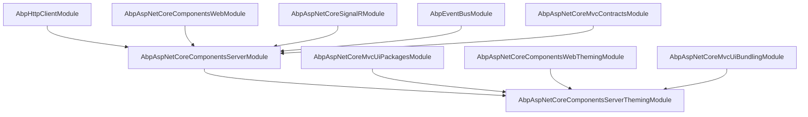
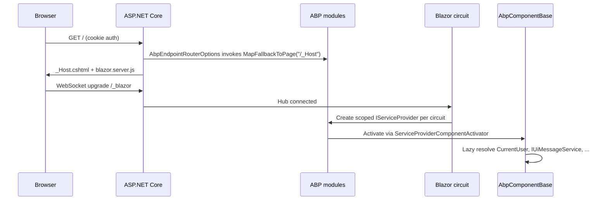

The `Volo.Abp.AspNetCore.Components.Server` package contains the
**server-side Blazor host** integration for the ABP Framework. It builds on
top of the shared `Volo.Abp.AspNetCore.Components.Web` layer and adds the
SignalR circuit registration (`MapBlazorHub`), the `_Host` fallback, a
Blazor-aware unit-of-work / auditing carve-out for `/_blazor`, and the
server-side lookup API request service. The companion theming package wires
the runtime `IComponentBundleManager` against the MVC `IBundleManager` so
your circuits can render the same global Blazor bundle that the
[ASP.NET Core bundling pipeline](/ui-mvc/bundling) produces.

The directory is `framework/src/Volo.Abp.AspNetCore.Components.Server/`. The
sibling
`framework/src/Volo.Abp.AspNetCore.Components.Server.Theming/` adds the
runtime bundle adapter and global script/style contributors. Together they
give an ABP Blazor Server app a single `[DependsOn]` to wire end-to-end.

## Module wiring

`Volo/Abp/AspNetCore/Components/Server/AbpAspNetCoreComponentsServerModule.cs`
performs three things: it adds the server-side Blazor stack via
`AddServerSideBlazor`, it tells ABP's UoW and auditing middleware to skip
the SignalR `/_blazor` traffic, and (when *not* in Blazor Web App mode) it
registers the route table.

```csharp
[DependsOn(
    typeof(AbpHttpClientModule),
    typeof(AbpAspNetCoreComponentsWebModule),
    typeof(AbpAspNetCoreSignalRModule),
    typeof(AbpEventBusModule),
    typeof(AbpAspNetCoreMvcContractsModule)
    )]
public class AbpAspNetCoreComponentsServerModule : AbpModule
{
    public override void ConfigureServices(ServiceConfigurationContext context)
    {
        context.Services.AddHttpClient(nameof(BlazorServerLookupApiRequestService))
            .ConfigurePrimaryHttpMessageHandler(() => new HttpClientHandler
            {
                AutomaticDecompression = DecompressionMethods.All
            });
        var serverSideBlazorBuilder = context.Services.AddServerSideBlazor(options =>
        {
            if (context.Services.GetHostingEnvironment().IsDevelopment())
            {
                options.DetailedErrors = true;
            }
        });
        context.Services.ExecutePreConfiguredActions(serverSideBlazorBuilder);

        Configure<AbpAspNetCoreUnitOfWorkOptions>(options =>
        {
            options.IgnoredUrls.AddIfNotContains("/_blazor");
        });

        Configure<AbpAspNetCoreAuditingOptions>(options =>
        {
            options.IgnoredUrls.AddIfNotContains("/_blazor");
        });

        if (!context.Services.ExecutePreConfiguredActions<AbpAspNetCoreComponentsWebOptions>().IsBlazorWebApp)
        {
            var preConfigureActions = context.Services.GetPreConfigureActions<HttpConnectionDispatcherOptions>();
            Configure<AbpEndpointRouterOptions>(options =>
            {
                options.EndpointConfigureActions.Add(endpointContext =>
                {
                    endpointContext.Endpoints.MapBlazorHub(httpConnectionDispatcherOptions =>
                    {
                        preConfigureActions.Configure(httpConnectionDispatcherOptions);
                    });
                    endpointContext.Endpoints.MapFallbackToPage("/_Host");
                });
            });
        }
    }
}
```

Three details deserve attention:

1. **DetailedErrors only in Development** — `AddServerSideBlazor` opts you
   into Blazor's detailed circuit error reporting only when
   `IHostEnvironment.IsDevelopment()` is true.
2. **`/_blazor` carve-out** — the SignalR circuit is a long-lived WebSocket
   connection, not a per-request transaction, so it cannot live inside an
   `IUnitOfWork`. The two `AddIfNotContains` calls tell ABP's
   `AbpUnitOfWorkMiddleware` and `AbpAuditingMiddleware` to skip the
   `/_blazor` path. Without this carve-out you would either deadlock the
   circuit (UoW waiting on a transaction that the client never completes)
   or balloon your audit log with one row per signalR message.
3. **Conditional route mapping** — when the host is a Blazor Web App
   (`IsBlazorWebApp == true`), the unified Web App pipeline owns routing and
   ABP must not double-map `MapBlazorHub`. The pre-configured action
   `HttpConnectionDispatcherOptions` lets a higher-level module customise
   the SignalR transport options without subclassing the module.

## Module dependency map



The dependency on
[`AbpAspNetCoreSignalRModule`](/aspnetcore/signalr) is what gives
the Blazor circuit its transport plumbing. Even though Blazor Server already
calls `MapBlazorHub` for you, the ABP SignalR module guarantees you can
*also* register your own application hubs in the same pipeline with
consistent options.

## Lookup API: making typed clients work in a circuit

ABP's lookup mechanism (used by `LookupExtensionProperty` and the dynamic
form engine) needs to issue HTTP requests *from within* a Blazor Server
component. The server-side implementation lives at
`Volo/Abp/AspNetCore/Components/Server/Extensibility/BlazorServerLookupApiRequestService.cs`.
It is registered against the named `HttpClient` defined in the module:

```csharp
context.Services.AddHttpClient(nameof(BlazorServerLookupApiRequestService))
    .ConfigurePrimaryHttpMessageHandler(() => new HttpClientHandler
    {
        AutomaticDecompression = DecompressionMethods.All
    });
```

`AutomaticDecompression = DecompressionMethods.All` makes the lookup respect
gzip / brotli responses, which matters because many typed lookups return
large lists.

## Cache reset on the server

`Volo/Abp/AspNetCore/Components/Server/Configuration/BlazorServerCurrentApplicationConfigurationCacheResetService.cs`
implements the `ICurrentApplicationConfigurationCacheResetService`
abstraction from the Web layer. On the server, the cache is per-circuit, so
calling `ResetAsync` requires invalidating the cached
`ApplicationConfigurationDto` for the **current** user's circuit only. This
is what makes "permission changed, refresh menus" propagate to a server-side
Blazor circuit without a full reload.

## Cookie authentication helper

`Microsoft/AspNetCore/Authentication/Cookies/CookieAuthenticationOptionsExtensions.cs`
contributes a small extension-method surface for cookie-authenticated Blazor
Server apps. Typical use is in your `Program.cs`:

```csharp
builder.Services.ConfigureApplicationCookie(options =>
{
    options.Events.AddAbpEvents();
});
```

The implementation hooks into `CookieAuthenticationEvents.SigningOut` and
`OnValidatePrincipal` so the ABP claims cache and the per-user
configuration cache are invalidated on every sign-out and on every changed
principal. This is the bridge between ASP.NET Core cookie auth and the ABP
permission system; without it, a user whose roles changed mid-session
would continue to see stale menus.

## Server theming and bundling

The `Volo.Abp.AspNetCore.Components.Server.Theming` package wires the runtime
bundle adapter:

```csharp
[DependsOn(
    typeof(AbpAspNetCoreComponentsServerModule),
    typeof(AbpAspNetCoreMvcUiPackagesModule),
    typeof(AbpAspNetCoreComponentsWebThemingModule),
    typeof(AbpAspNetCoreMvcUiBundlingModule)
    )]
public class AbpAspNetCoreComponentsServerThemingModule : AbpModule
{
    public override void ConfigureServices(ServiceConfigurationContext context)
    {
        Configure<AbpBundlingOptions>(options =>
        {
            options.StyleBundles.Add(BlazorStandardBundles.Styles.Global, bundle =>
            {
                bundle.AddContributors(typeof(BlazorGlobalStyleContributor));
            });

            options.ScriptBundles.Add(BlazorStandardBundles.Scripts.Global, bundle =>
            {
                bundle.AddContributors(typeof(BlazorGlobalScriptContributor));
            });
        });
    }
}
```

The bundle name comes from `BlazorStandardBundles.Styles.Global` =
`"Blazor.Global"` and `BlazorStandardBundles.Scripts.Global` =
`"Blazor.Global"` (defined in
`Bundling/BlazorGlobalBundles.cs`). These are the bundles your `_Host.cshtml`
references via the
[ABP bundling tag helpers](/ui-mvc/bundling).

### Server bundle adapter

`Bundling/BlazorServerComponentBundleManager.cs` implements the
`IComponentBundleManager` abstraction from the Web theming package by
delegating to the MVC `IBundleManager`:

```csharp
public class BlazorServerComponentBundleManager : IComponentBundleManager, ITransientDependency
{
    protected IBundleManager BundleManager { get; }

    public BlazorServerComponentBundleManager(IBundleManager bundleManager)
    {
        BundleManager = bundleManager;
    }

    public virtual async Task<IReadOnlyList<string>> GetStyleBundleFilesAsync(string bundleName)
    {
        return (await BundleManager.GetStyleBundleFilesAsync(bundleName)).Select(f => f.FileName).ToList();
    }

    public virtual async Task<IReadOnlyList<string>> GetScriptBundleFilesAsync(string bundleName)
    {
        return (await BundleManager.GetScriptBundleFilesAsync(bundleName)).Select(f => f.FileName).ToList();
    }
}
```

The point is that **the same bundle, declared in
`AbpBundlingOptions`, drives both the MVC tag helper output and the Blazor
runtime file enumeration**. A Blazor Server component that needs the list of
global stylesheets (for example, to inject them into an iframe) injects
`IComponentBundleManager` and never has to know about MVC.

### The two global contributors

`Bundling/BlazorGlobalScriptContributor.cs` decides — at bundle build time
— whether to include `/_framework/blazor.server.js`:

```csharp
public class BlazorGlobalScriptContributor : BundleContributor
{
    public override void ConfigureBundle(BundleConfigurationContext context)
    {
        var options = context.ServiceProvider.GetRequiredService<IOptions<AbpAspNetCoreComponentsWebOptions>>().Value;
        if (!options.IsBlazorWebApp)
        {
            context.Files.AddIfNotContains("/_framework/blazor.server.js");
        }
        context.Files.AddIfNotContains("/_content/Volo.Abp.AspNetCore.Components.Web/libs/abp/js/abp.js");
        context.Files.AddIfNotContains("/_content/Volo.Abp.AspNetCore.Components.Web/libs/abp/js/authentication-state-listener.js");
    }
}
```

Notice `blazor.server.js` is skipped in Blazor Web App mode: that mode
emits its own loader (`blazor.web.js`) which the Web App pipeline injects.
`BlazorGlobalStyleContributor` carries the canonical Blazor-Server CSS:
Bootstrap + Font Awesome (inherited via `[DependsOn]` on the corresponding
package contributors), the ABP base stylesheet, three Blazorise CSS files,
and the `Volo.Abp.BlazoriseUI` overrides.

## How a circuit boots



The scoped service provider is per-circuit on the server (one provider per
connected user/tab). On WASM, by contrast, it is a single provider for the
entire WASM process — which is why some services need
`IClientScopeServiceProviderAccessor` to be reached from outside any
component's lifetime.

## Composing with the rest of ABP

| Concern | Module pulled in |
|---------|------------------|
| Real-time push | `AbpAspNetCoreSignalRModule` — see [/aspnetcore/signalr](/aspnetcore/signalr) |
| Outgoing HTTP (e.g., to a separate API host) | `AbpHttpClientModule` |
| Domain events from server-side components | `AbpEventBusModule` |
| Shared DTO/contract assemblies | `AbpAspNetCoreMvcContractsModule` — see [/aspnetcore/overview](/aspnetcore/overview) |
| Runtime bundle production | `AbpAspNetCoreMvcUiBundlingModule` — see [/ui-mvc/bundling](/ui-mvc/bundling) |

The fact that `AbpAspNetCoreMvcContractsModule` is a dependency is critical:
your Blazor Server components can directly inject the application service
*interfaces* declared by your microservices, because the contract assemblies
register `IRemoteAppService` proxies in the same DI graph.

## Tieredness considerations

A Blazor Server host can be either **monolithic** (the same process serves
the API) or **tiered** (the Blazor host is a thin shell that calls a
separate API host over HTTP). The framework supports both:

| Topology | HTTP module used | Auth carry |
|----------|------------------|------------|
| Monolithic | `AbpHttpClientModule` registered but unused for in-proc services | N/A |
| Tiered | `AbpHttpClientModule` proxies remote services via `Volo.Abp.Http.Client.IdentityModel` | Cookie ⇒ token via `OpenIdConnect` on first request |

For the tiered case, the [/http/http-client-identitymodel](/http/http-client-identitymodel)
page documents how the cookie-issued access token is forwarded to the API
host on every server-side proxy call.

## Pitfalls and tips

<Warning>
Do **not** consume an `IRepository<T>` directly inside a Blazor Server
component without an explicit unit of work. The `/_blazor` carve-out means
the SignalR pipeline does not open one for you. If you need transactional
work, wrap the operation in `IUnitOfWorkManager.Begin()` or call an
application service that has `[UnitOfWork]` on it.
</Warning>

<Tip>
The `_Host.cshtml` fallback is mapped only when `IsBlazorWebApp` is
`false`. If you migrate to a Blazor Web App, set the flag *before*
`AbpAspNetCoreComponentsServerModule.ConfigureServices` runs (use a
`PreConfigureServices` override in your startup module) and add your
`App.razor` route registration to the Web App pipeline yourself.
</Tip>

## Cross-stack pointers

- The Web App / WASM render-mode hybrid is documented at
  [/blazor/components-webassembly](/blazor/components-webassembly).
- Bundles flow through the [/ui-mvc/bundling](/ui-mvc/bundling) pipeline.
- The lookup HTTP client follows the
  [`Volo.Abp.Http.Client`](/aspnetcore/overview) conventions.
- For authentication on tiered Blazor Server, see
  [/http/http-client-identitymodel](/http/http-client-identitymodel).
- For SignalR hub registration that coexists with the Blazor circuit, see
  [/aspnetcore/signalr](/aspnetcore/signalr).
- For the Identity store backing `CurrentUser`, see
  [/modules/identity](/modules/identity).
- For shared Razor base classes, see
  [/blazor/components-web](/blazor/components-web).
- For the Blazorise services that render `IUiMessageService` modally, see
  [/blazor/blazorise-ui](/blazor/blazorise-ui).
