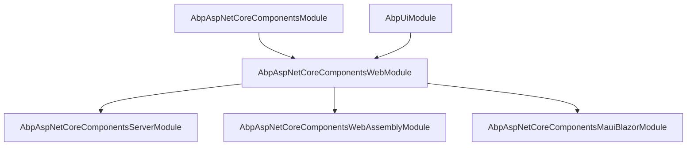

The `Volo.Abp.AspNetCore.Components.Web` package is the **shared Blazor layer**
of the ABP Framework — the place where every host (Server, WebAssembly,
MauiBlazor, Blazor Web App) meets. This page covers the contracts and
default implementations that make ABP-flavoured Blazor components portable
across hosts: `AbpComponentBase`, the message/notification/progression
service trio, JS-interop helpers (`IAbpUtilsService`, `ICookieService`,
`ILocalStorageService`), the `AbpAuthenticationState` cross-tab sync
component, and the `IClientScopeServiceProviderAccessor` used to bridge ABP's
root provider with Blazor's per-circuit scope.

The package directory is
`framework/src/Volo.Abp.AspNetCore.Components.Web/` and its entry module is
`AbpAspNetCoreComponentsWebModule`. Everything in here works because the
**deeper** package `Volo.Abp.AspNetCore.Components` has already registered
the `AbpWebAssemblyConventionalRegistrar` and the
`ServiceProviderComponentActivator`; this Web package is what *replaces*
Blazor's default activator and what *adds* the cross-cutting UI services.

## Module wiring

The module class
`framework/src/Volo.Abp.AspNetCore.Components.Web/Volo/Abp/AspNetCore/Components/Web/AbpAspNetCoreComponentsWebModule.cs`
is intentionally tiny:

```csharp
[DependsOn(
    typeof(AbpUiModule),
    typeof(AbpAspNetCoreComponentsModule)
    )]
public class AbpAspNetCoreComponentsWebModule : AbpModule
{
    public override void ConfigureServices(ServiceConfigurationContext context)
    {
        context.Services.Replace(
            ServiceDescriptor.Transient<IComponentActivator, ServiceProviderComponentActivator>());

        var preActions = context.Services.GetPreConfigureActions<AbpAspNetCoreComponentsWebOptions>();
        Configure<AbpAspNetCoreComponentsWebOptions>(options =>
        {
            preActions.Configure(options);
        });
    }
}
```

Two effects are worth noting. First, the `Replace` call swaps Blazor's
built-in component activator for ABP's
`ServiceProviderComponentActivator`, which resolves `ComponentBase`
subclasses from the ABP DI graph — letting them receive constructor and
property injection of ABP services. Second, the deferred-PreConfigure dance
on `AbpAspNetCoreComponentsWebOptions` (declared next door) lets earlier
modules (the Server module, the WebAssembly module) set
`IsBlazorWebApp = true` *before* their own `ConfigureServices` runs.

## AbpAspNetCoreComponentsWebOptions

This single-property options class — declared at
`framework/src/Volo.Abp.AspNetCore.Components.Web/Volo/Abp/AspNetCore/Components/Web/AbpAspNetCoreComponentsWebOptions.cs`
— governs the Blazor Web App branch of the framework:

```csharp
public class AbpAspNetCoreComponentsWebOptions
{
    public bool IsBlazorWebApp { get; set; }

    public AbpAspNetCoreComponentsWebOptions()
    {
        IsBlazorWebApp = false;
    }
}
```

When `true`, both `AbpAspNetCoreComponentsServerModule` and
`AbpAspNetCoreComponentsWebAssemblyModule` skip their default route mapping
and authentication URL configuration, deferring to the unified Web-App
pipeline. The flag is read through `ExecutePreConfiguredActions<>()` so the
two host modules can each set it independently without ordering surprises.

## AbpComponentBase

The base type for every ABP-flavoured Razor component lives at
`framework/src/Volo.Abp.AspNetCore.Components/Volo/Abp/AspNetCore/Components/AbpComponentBase.cs`
and inherits Blazor's `OwningComponentBase`. Inheriting
`OwningComponentBase` means each component instance owns a child DI scope
disposed when the component is disposed — useful for one-off `IObjectMapper`
or `IRepository` instantiations.

Every service exposed by `AbpComponentBase` is **lazily resolved** on first
access. The pattern uses two helpers, `LazyGetRequiredService` and
`LazyGetNonScopedRequiredService`, that cache the resolved instance in a
private field:

```csharp
protected TRef LazyGetRequiredService<TRef>(Type serviceType, ref TRef reference)
{
    if (reference == null)
    {
        reference = (TRef)ScopedServices.GetRequiredService(serviceType);
    }
    return reference;
}

protected TRef LazyGetNonScopedRequiredService<TRef>(Type serviceType, ref TRef reference)
{
    if (reference == null)
    {
        reference = (TRef)NonScopedServices.GetRequiredService(serviceType);
    }
    return reference;
}
```

`NonScopedServices` is `[Inject]`-ed from the root provider — for
singleton-by-design services like `IUiMessageService` or `IAlertManager` that
must not be torn down with the component scope. The lazy fields together
turn the base class into a near-zero-cost "service catalog" that a derived
page can use without redeclaring `[Inject]` attributes.

### What the base class exposes

| Property | Resolution | Source service |
|----------|------------|----------------|
| `L` | Lazy via `IStringLocalizerFactory` | `StringLocalizer` for `LocalizationResource` |
| `Logger` | `Lazy<ILogger>` over `LoggerFactory.CreateLogger(GetType().FullName)` | `ILoggerFactory` |
| `AuthorizationService` | Scoped | `IAuthorizationService` |
| `CurrentUser` | Scoped | `ICurrentUser` |
| `CurrentTenant` | Scoped | `ICurrentTenant` |
| `Message` | Non-scoped | `IUiMessageService` |
| `Notify` | Non-scoped | `IUiNotificationService` |
| `UserExceptionInformer` | Non-scoped | `IUserExceptionInformer` |
| `AlertManager` / `Alerts` | Non-scoped | `IAlertManager` (and its `AlertList`) |
| `Clock` | Non-scoped | `IClock` |
| `ObjectMapper` | Non-scoped, generic via `ObjectMapperContext` | `IObjectMapper` or `IObjectMapper<TContext>` |

The localization mechanism deserves a closer look. The base class defaults to
`DefaultResource` but you can swap it via the `LocalizationResource`
property:

```csharp
protected Type? LocalizationResource {
    get => _localizationResource;
    set {
        _localizationResource = value;
        _localizer = null;
    }
}
private Type? _localizationResource = typeof(DefaultResource);
```

Setting it invalidates the cached `IStringLocalizer` so the next `L["Key"]`
access creates a localizer for the new resource. The actual creation goes
through `CreateLocalizer()`, which falls back to
`StringLocalizerFactory.CreateDefaultOrNull()` and throws an `AbpException`
if neither a resource nor a configured default exists.

### Centralised exception handling

`AbpComponentBase.HandleErrorAsync` is the wrapper every action handler
should call. It guards against the component already being disposed (a
common race in WASM where async callbacks outlive the component) and uses
`InvokeAsync` to dispatch the message back to the renderer thread:

```csharp
protected virtual async Task HandleErrorAsync(Exception exception)
{
    if (IsDisposed)
    {
        return;
    }

    await InvokeAsync(async () =>
    {
        await UserExceptionInformer.InformAsync(new UserExceptionInformerContext(exception));
        StateHasChanged();
    });
}
```

`IUserExceptionInformer` is the seam: in Blazor it is implemented by
`UserExceptionInformer` (in `Volo.Abp.AspNetCore.Components.Web`) which
delegates to `IUiMessageService.Error` with a localised, user-safe message
derived from `AbpExceptionHandlingOptions`. The default at the abstractions
level is `NullUserExceptionInformer`, so non-UI hosts can register the
abstraction without pulling in JS interop.

## The UI service trio

The three "talk-back-to-the-user" interfaces declared in
`framework/src/Volo.Abp.AspNetCore.Components/Volo/Abp/AspNetCore/Components/`
all follow the same shape. `IUiMessageService` returns `Task<bool>` for
`Confirm` (so callers can `await`); the others return non-generic `Task`:

```csharp
public interface IUiMessageService
{
    Task Info(string message, string? title = null, Action<UiMessageOptions>? options = null);
    Task Success(string message, string? title = null, Action<UiMessageOptions>? options = null);
    Task Warn(string message, string? title = null, Action<UiMessageOptions>? options = null);
    Task Error(string message, string? title = null, Action<UiMessageOptions>? options = null);
    Task<bool> Confirm(string message, string? title = null, Action<UiMessageOptions>? options = null);
}

public interface IUiNotificationService
{
    Task Info(string message, string? title = null, Action<UiNotificationOptions>? options = null);
    Task Success(string message, string? title = null, Action<UiNotificationOptions>? options = null);
    Task Warn(string message, string? title = null, Action<UiNotificationOptions>? options = null);
    Task Error(string message, string? title = null, Action<UiNotificationOptions>? options = null);
}
```

The "Web" package supplies `SimpleUiMessageService` (a JS-interop-only
fallback that calls `alert()` / `confirm()`) and `NullUiNotificationService`
(no-op). These are *replaced* by the Blazorise implementations — see
[/blazor/blazorise-ui](/blazor/blazorise-ui) — when the
`Volo.Abp.BlazoriseUI` module is present.

## Alerts

`IAlertManager.Alerts` is an `ObservableCollection<AlertMessage>`
(`framework/src/Volo.Abp.AspNetCore.Components/Volo/Abp/AspNetCore/Components/Alerts/AlertList.cs`)
with typed helpers:

```csharp
public class AlertList : ObservableCollection<AlertMessage>
{
    public void Info(string text, string? title = null, bool dismissible = true)
        => Add(new AlertMessage(AlertType.Info, text, title, dismissible));

    public void Warning(string text, string? title = null, bool dismissible = true)
        => Add(new AlertMessage(AlertType.Warning, text, title, dismissible));

    public void Danger(string text, string? title = null, bool dismissible = true)
        => Add(new AlertMessage(AlertType.Danger, text, title, dismissible));

    public void Success(string text, string? title = null, bool dismissible = true)
        => Add(new AlertMessage(AlertType.Success, text, title, dismissible));
}
```

`AlertMessage` itself
(`framework/src/Volo.Abp.AspNetCore.Components/Volo/Abp/AspNetCore/Components/Alerts/AlertMessage.cs`)
validates `Text` against null/whitespace via `Check.NotNullOrWhiteSpace`. The
`Volo.Abp.BlazoriseUI` package supplies the renderer
(`PageAlert.razor` / `UiMessageAlert.razor`) that subscribes to the collection
and produces `<Alert>` markup. Because the collection is observable, mutating
it from outside the renderer thread (e.g., an HTTP callback in WASM) requires
`InvokeAsync` — `AbpComponentBase` does that for you in `HandleErrorAsync`.

## Page progress

`IUiPageProgressService` is an event-source service:

```csharp
public interface IUiPageProgressService
{
    public event EventHandler<UiPageProgressEventArgs> ProgressChanged;
    Task Go(int? percentage, Action<UiPageProgressOptions>? options = null);
}
```

The HTTP message handler in `AbpBlazorClientHttpMessageHandler` (WASM) and
`AbpMauiBlazorClientHttpMessageHandler` (MAUI) both call `Go(null, ...)`
before sending and `Go(-1)` after — so every HTTP request automatically
triggers a top-of-page progress bar without any per-page code. The
Blazorise-side renderer is `UiPageProgress.razor` whose code-behind
(`framework/src/Volo.Abp.BlazoriseUI/Components/UiPageProgress.razor.cs`)
subscribes to `ProgressChanged` and updates a Blazorise `<PageProgress>`.

## IAbpUtilsService and the JS interop layer

JS interop is centralised in
`framework/src/Volo.Abp.AspNetCore.Components.Web/Volo/Abp/AspNetCore/Components/Web/AbpUtilsService.cs`:

```csharp
public class AbpUtilsService : IAbpUtilsService, ITransientDependency
{
    protected IJSRuntime JsRuntime { get; }

    public ValueTask AddClassToTagAsync(string tagName, string className)
        => JsRuntime.InvokeVoidAsync("abp.utils.addClassToTag", tagName, className);

    public ValueTask RemoveClassFromTagAsync(string tagName, string className)
        => JsRuntime.InvokeVoidAsync("abp.utils.removeClassFromTag", tagName, className);

    public ValueTask<bool> HasClassOnTagAsync(string tagName, string className)
        => JsRuntime.InvokeAsync<bool>("abp.utils.hasClassOnTag", tagName, className);

    public ValueTask ReplaceLinkHrefByIdAsync(string linkId, string hrefValue)
        => JsRuntime.InvokeVoidAsync("abp.utils.replaceLinkHrefById", linkId, hrefValue);

    public ValueTask ToggleFullscreenAsync()
        => JsRuntime.InvokeVoidAsync("abp.utils.toggleFullscreen");

    public ValueTask RequestFullscreenAsync()
        => JsRuntime.InvokeVoidAsync("abp.utils.requestFullscreen");

    public ValueTask ExitFullscreenAsync()
        => JsRuntime.InvokeVoidAsync("abp.utils.exitFullscreen");
}
```

These methods all resolve in the browser-side `abp.js` shipped at
`framework/src/Volo.Abp.AspNetCore.Components.Web/wwwroot/libs/abp/js/abp.js`.
Most callers reach `IAbpUtilsService` through `AbpComponentBase` or — in the
WASM initialization path — directly from `OnApplicationInitializationAsync`
to set the `rtl` class on `<body>` when the current culture is right-to-left.

## CookieService and LocalStorageService

The `ICookieService` (`Volo/Abp/AspNetCore/Components/Web/ICookieService.cs`)
and `ILocalStorageService` (`Volo/Abp/AspNetCore/Components/Web/ILocalStorageService.cs`)
are abstracted as `ValueTask`-returning methods over JS interop. Their
concrete implementations live in `CookieService.cs` and
`LocalStorageService.cs`:

```csharp
public interface ICookieService
{
    public ValueTask SetAsync(string key, string value, CookieOptions? options = null);
    public ValueTask<string> GetAsync(string key);
    public ValueTask DeleteAsync(string key, string? path = null);
}

public interface ILocalStorageService
{
    public ValueTask SetItemAsync(string key, string value);
    public ValueTask<string> GetItemAsync(string key);
    public ValueTask RemoveItemAsync(string key);
}
```

`AbpBlazorClientHttpMessageHandler` uses `ICookieService` to read the
`XSRF-TOKEN` cookie and attach a `RequestVerificationToken` header for
non-GET requests. `AbpAuthenticationState` uses `ILocalStorageService` to
persist a per-user state id keyed `authentication-state-id`, which the
companion `authentication-state-listener.js` script can poll for cross-tab
sign-out propagation.

## AbpAuthenticationState

`framework/src/Volo.Abp.AspNetCore.Components.Web/Volo/Abp/AspNetCore/Components/Web/Security/AbpAuthenticationState.cs`
is a renderless component that ties the browser's localStorage into the
ABP login flow:

```csharp
public class AbpAuthenticationState : ComponentBase
{
    private const string StateKey = "authentication-state-id";

    [Inject] protected ILocalStorageService LocalStorage { get; set; } = default!;
    [Inject] protected ICurrentUser CurrentUser { get; set; } = default!;
    [Inject] protected NavigationManager NavigationManager { get; set; } = default!;
    [Inject] protected IOptions<AbpAuthenticationOptions> AuthenticationOptions { get; set; } = default!;

    protected async override Task OnAfterRenderAsync(bool firstRender)
    {
        if (firstRender)
        {
            NavigationManager.RegisterLocationChangingHandler(OnLocationChangingAsync);
            if (CurrentUser.IsAuthenticated)
                await SetAuthenticationStateAsync();
            else
                await ClearAuthenticationStateAsync();
        }
    }
    // ...
}
```

It is added to every standard layout by
`AbpAspNetCoreComponentsWebThemingModule.ConfigureServices` via
`AbpDynamicLayoutComponentOptions.Components.Add(typeof(AbpAuthenticationState), null)`.
The companion JS file `authentication-state-listener.js` listens for
storage events and reloads the page when another tab changes the state key —
giving you cross-tab sign-out without any per-page wiring.

## Extensibility tables: EntityAction and TableColumn

The Web package exposes a generic extensibility model for grid-style pages.
`framework/src/Volo.Abp.AspNetCore.Components.Web/Volo/Abp/AspNetCore/Components/Web/Extensibility/EntityActions/EntityAction.cs`
declares an `EntityAction`:

```csharp
public class EntityAction : IEquatable<EntityAction>
{
    public string Text { get; set; } = default!;
    public Func<object, Task> Clicked { get; set; } = default!;
    public Func<object, string>? ConfirmationMessage { get; set; }
    public bool Primary { get; set; }
    public object? Color { get; set; }
    public string? Icon { get; set; }
    public Func<object, bool>? Visible { get; set; }
    public bool Disabled { get; set; }
}
```

…and `TableColumn` is its column counterpart with `Sortable`, `Visible`,
`Width`, `DisplayFormat`, `ValueConverter`, and an optional `Component`
type so a column can render via any `ComponentBase`. Both are stored in
keyed `EntityActionDictionary` / `TableColumnDictionary` containers, which
`AbpCrudPageBase` consumes — see [/blazor/blazorise-ui](/blazor/blazorise-ui).

## IServerUrlProvider

`framework/src/Volo.Abp.AspNetCore.Components.Web/Volo/Abp/AspNetCore/Components/Web/IServerUrlProvider.cs`
abstracts "where is my remote service":

```csharp
public interface IServerUrlProvider
{
    Task<string> GetBaseUrlAsync(string? remoteServiceName = null);
}
```

The default `DefaultServerUrlProvider` reads `AbpRemoteServiceOptions`; the
WASM-specific `WebAssemblyServerUrlProvider` falls back to
`NavigationManager.BaseUri` if no remote URL is configured, which makes the
"WASM hosted by the same ASP.NET Core app" scenario work without any
configuration.

## IClientScopeServiceProviderAccessor

`framework/src/Volo.Abp.AspNetCore.Components.Web/Volo/Abp/AspNetCore/Components/Web/DependencyInjection/ComponentsClientScopeServiceProviderAccessor.cs`
is a singleton sidecar that holds the **client-scope** `IServiceProvider`
for code running outside of any scope (an `OnApplicationInitializationAsync`
hook in the WASM module, for example):

```csharp
public class ComponentsClientScopeServiceProviderAccessor :
    IClientScopeServiceProviderAccessor,
    ISingletonDependency
{
    public IServiceProvider ServiceProvider { get; set; } = default!;
}
```

Both `AbpAspNetCoreComponentsWebAssemblyModule` and the MAUI module use this
to reach scoped services (`WebAssemblyCachedApplicationConfigurationClient`,
`AbpComponentsClaimsCache`) from the initialization callback.

## Configuration cache reset

The Web package declares `ICurrentApplicationConfigurationCacheResetService`
at `Configuration/ICurrentApplicationConfigurationCacheResetService.cs`:

```csharp
public interface ICurrentApplicationConfigurationCacheResetService
{
    Task ResetAsync(Guid? userId = null);
}
```

Server-side and WASM-side implementations both invalidate the cached
`ApplicationConfigurationDto` returned by
`ICachedApplicationConfigurationClient`. The `Null*` default is registered
when neither host module is loaded, so library code can safely depend on
the abstraction.

## Module diamond at the Web layer



`AbpUiModule` is what brings in the localizable resources (`AbpUiResource`)
referenced by `BlazoriseUiMessageService` for default button labels.

## When to depend on this package

<Tip>
If you are writing a reusable component **library** that may be hosted by
either Server or WebAssembly, depend on
`Volo.Abp.AspNetCore.Components.Web` and *not* on either host package. Your
library inherits `AbpComponentBase`, uses the shared service contracts, and
remains host-agnostic.
</Tip>

<Warning>
The `Volo.Abp.AspNetCore.Components.Web.Theming` package — covered in
[/blazor/theming-and-bundling](/blazor/theming-and-bundling) — depends on
`AbpBlazoriseUIModule`, so referencing it transitively pulls Blazorise into
your dependency closure. If you ship a host-agnostic library that should not
depend on Blazorise, stop at the Web package.
</Warning>

## Cross-stack pointers

- The HTTP message handler that wraps every WASM/MAUI call uses this
  package's `ICookieService` and `IUiPageProgressService` — see
  [/blazor/components-webassembly](/blazor/components-webassembly).
- The localization machinery follows the same pattern as the MVC stack —
  see [`Volo.Abp.AspNetCore.Mvc`](/ui-mvc/overview).
- The MAUI host swaps in its own `IMauiBlazorSelectedLanguageProvider` to
  drive language selection — see
  [/blazor/components-mauiblazor](/blazor/components-mauiblazor).
- For the Blazorise concrete implementations of `IUiMessageService` and
  friends, see [/blazor/blazorise-ui](/blazor/blazorise-ui).
- For Identity-backed `ICurrentUser`, see
  [`Volo.Abp.Identity`](/modules/identity).
- For HTTP-client identity flow used by `AbpBlazorClientHttpMessageHandler`,
  see [/http/http-client-identitymodel](/http/http-client-identitymodel).
- For real-time push that complements progress notifications, see
  [/aspnetcore/signalr](/aspnetcore/signalr).
