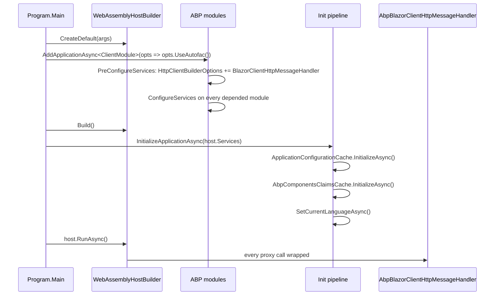

The `Volo.Abp.AspNetCore.Components.WebAssembly` package is the
**Blazor WebAssembly host** for the ABP Framework. This page covers the
`AbpWebAssemblyHostBuilder.AddApplicationAsync<TStartupModule>(...)`
extension that bootstraps the ABP module graph inside the WASM process,
the `AbpBlazorClientHttpMessageHandler` that decorates every HTTP request
the proxies issue, the `WebAssemblyAuthenticationStateProvider<,,>` that
wraps Microsoft's `RemoteAuthenticationService`, and the two sibling
packages `.WebAssembly.Theming` and `.WebAssembly.Theming.Bundling` that
manage the global CSS/JS payload shipped with the WASM bundle.

The directory is `framework/src/Volo.Abp.AspNetCore.Components.WebAssembly/`.
Because WASM has no separate "build-time" pipeline — the static files are
served as-is from the published `wwwroot` — the bundling responsibility is
split: the **theming.bundling** package declares which files go into the
global bundle (consumed by the abp-cli at build time), while the **theming**
package's `WebAssemblyComponentBundleManager` returns empty lists at
runtime since the bundle is already linked into `index.html`.

## Booting the host

The integration entry point lives at
`Microsoft/AspNetCore/Components/WebAssembly/Hosting/AbpWebAssemblyHostBuilderExtensions.cs`
and exposes both sync and async variants of `AddApplication<TStartupModule>`:

```csharp
public static class AbpWebAssemblyHostBuilderExtensions
{
    public async static Task<IAbpApplicationWithExternalServiceProvider> AddApplicationAsync<TStartupModule>(
        [NotNull] this WebAssemblyHostBuilder builder,
        Action<AbpWebAssemblyApplicationCreationOptions> options)
        where TStartupModule : IAbpModule
    {
        Check.NotNull(builder, nameof(builder));

        // System.Runtime.CompilerServices.AsyncStateMachineAttribute
        Castle.DynamicProxy.Generators.AttributesToAvoidReplicating.Add<AsyncStateMachineAttribute>();

        builder.Services.AddSingleton<IConfiguration>(builder.Configuration);
        builder.Services.AddSingleton(builder);

        var application = await builder.Services.AddApplicationAsync<TStartupModule>(opts =>
        {
            options?.Invoke(new AbpWebAssemblyApplicationCreationOptions(builder, opts));
            if (opts.Environment.IsNullOrWhiteSpace())
            {
                opts.Environment = builder.HostEnvironment.Environment;
            }
        });

        return application;
    }

    public async static Task InitializeApplicationAsync(
        [NotNull] this IAbpApplicationWithExternalServiceProvider application,
        [NotNull] IServiceProvider serviceProvider)
    {
        ((ComponentsClientScopeServiceProviderAccessor)serviceProvider
            .GetRequiredService<IClientScopeServiceProviderAccessor>()).ServiceProvider = serviceProvider;

        await application.InitializeAsync(serviceProvider);
    }
}
```

The crucial side-effects are:

1. **`AttributesToAvoidReplicating.Add<AsyncStateMachineAttribute>()`** —
   compensates for a quirk where Microsoft removed the
   `Microsoft.AspNetCore.Blazor.BuildTools` attribute stripper in net 5.0.
   Without this, Castle's `DynamicProxy` will choke on async methods
   because it attempts to copy the state-machine attribute onto the proxy.
2. **`AddSingleton(builder)`** — the `WebAssemblyHostBuilder` itself is
   registered, so other modules (notably
   `AbpAutofacWebAssemblyModule.UseAutofac()` — see
   [/blazor/autofac-webassembly](/blazor/autofac-webassembly)) can grab it
   from DI rather than passing it around.
3. **Environment defaulting** — if the application options didn't set an
   environment, the WASM `HostEnvironment.Environment` is propagated to the
   ABP application creation options so feature flags can key off it.

A typical `Program.cs` then looks like:

```csharp
var builder = WebAssemblyHostBuilder.CreateDefault(args);
builder.RootComponents.Add<App>("#app");

await builder.Services.AddApplicationAsync<MyClientModule>(options =>
{
    options.UseAutofac();
});

var host = builder.Build();
await host.Services.GetRequiredService<IAbpApplicationWithExternalServiceProvider>()
    .InitializeApplicationAsync(host.Services);
await host.RunAsync();
```

## The startup module

`Volo/Abp/AspNetCore/Components/WebAssembly/AbpAspNetCoreComponentsWebAssemblyModule.cs`
is the module loaded transitively by any WASM client module:

```csharp
[DependsOn(
    typeof(AbpAspNetCoreMvcClientCommonModule),
    typeof(AbpUiModule),
    typeof(AbpAspNetCoreComponentsWebModule)
)]
public class AbpAspNetCoreComponentsWebAssemblyModule : AbpModule
{
    public override void PreConfigureServices(ServiceConfigurationContext context)
    {
        var abpHostEnvironment = context.Services.GetSingletonInstance<IAbpHostEnvironment>();
        if (abpHostEnvironment.EnvironmentName.IsNullOrWhiteSpace())
        {
            abpHostEnvironment.EnvironmentName = context.Services.GetWebAssemblyHostEnvironment().Environment;
        }

        PreConfigure<AbpHttpClientBuilderOptions>(options =>
        {
            options.ProxyClientBuildActions.Add((_, builder) =>
            {
                builder.AddHttpMessageHandler<AbpBlazorClientHttpMessageHandler>();
            });
        });
    }

    public override void ConfigureServices(ServiceConfigurationContext context)
    {
        context.Services.AddHttpClient();
        context.Services
            .GetHostBuilder().Logging
            .AddProvider(new AbpExceptionHandlingLoggerProvider(context.Services));

        if (!context.Services.ExecutePreConfiguredActions<AbpAspNetCoreComponentsWebOptions>().IsBlazorWebApp)
        {
            Configure<AbpAuthenticationOptions>(options =>
            {
                options.LoginUrl = "authentication/login";
                options.LogoutUrl = "authentication/logout";
            });
        }
    }
    // ...
}
```

The `PreConfigure<AbpHttpClientBuilderOptions>` block adds
`AbpBlazorClientHttpMessageHandler` to **every** HTTP client built for an
ABP remote proxy. That is how every API call automatically gets the
progress-bar wiring, anti-forgery header, language header, and timezone
header — see the next section.

`PostConfigureServices` performs a more subtle replacement: it looks for
the Microsoft `RemoteAuthenticationService<,,>` registration and wraps it
in `WebAssemblyAuthenticationStateProvider<,,>`. This is what gives ABP
multi-tenant claims handling on top of Microsoft's OIDC plumbing.

## Initialization callback

```csharp
public async override Task OnApplicationInitializationAsync(ApplicationInitializationContext context)
{
    await context.ServiceProvider.GetRequiredService<IClientScopeServiceProviderAccessor>().ServiceProvider
        .GetRequiredService<WebAssemblyCachedApplicationConfigurationClient>().InitializeAsync();
    await context.ServiceProvider.GetRequiredService<IClientScopeServiceProviderAccessor>().ServiceProvider
        .GetRequiredService<AbpComponentsClaimsCache>().InitializeAsync();
    await SetCurrentLanguageAsync(context.ServiceProvider);
}

private async static Task SetCurrentLanguageAsync(IServiceProvider serviceProvider)
{
    var configurationClient = serviceProvider.GetRequiredService<ICachedApplicationConfigurationClient>();
    var utilsService = serviceProvider.GetRequiredService<IAbpUtilsService>();
    var configuration = await configurationClient.GetAsync();
    var cultureName = configuration.Localization?.CurrentCulture?.CultureName;
    if (!cultureName.IsNullOrEmpty())
    {
        var culture = new CultureInfo(cultureName!);
        CultureInfo.DefaultThreadCurrentCulture = culture;
        CultureInfo.DefaultThreadCurrentUICulture = culture;
    }

    if (CultureInfo.CurrentUICulture.TextInfo.IsRightToLeft)
    {
        await utilsService.AddClassToTagAsync("body", "rtl");
    }
}
```

The order matters:

1. Hydrate the application configuration (permissions, settings,
   localization resources, current tenant).
2. Hydrate the claims cache so `[Authorize]`-decorated components see the
   current user.
3. Apply the culture and, if RTL, toggle the `rtl` class on `<body>` via
   the JS interop helper — see [/blazor/components-web](/blazor/components-web).

## AbpBlazorClientHttpMessageHandler

`Volo/Abp/AspNetCore/Components/WebAssembly/AbpBlazorClientHttpMessageHandler.cs`
is the single most important class in the WASM host. It is registered as a
`DelegatingHandler` on every proxy `HttpClient`:

```csharp
public class AbpBlazorClientHttpMessageHandler : DelegatingHandler, ITransientDependency
{
    private const string AntiForgeryCookieName = "XSRF-TOKEN";
    private const string AntiForgeryHeaderName = "RequestVerificationToken";

    protected override async Task<HttpResponseMessage> SendAsync(HttpRequestMessage request, CancellationToken cancellationToken)
    {
        try
        {
            await _uiPageProgressService.Go(null, options =>
            {
                options.Type = UiPageProgressType.Info;
            });

            if (request.RequestUri?.Scheme == Uri.UriSchemeHttps)
            {
                request.SetBrowserRequestStreamingEnabled(true);
            }
            await SetLanguageAsync(request, cancellationToken);
            await SetAntiForgeryTokenAsync(request);
            await SetTimeZoneAsync(request);

            return await base.SendAsync(request, cancellationToken);
        }
        finally
        {
            await _uiPageProgressService.Go(-1);
        }
    }
    // ...
}
```

The four pre-send steps run on **every** API call:

| Step | Purpose | Source |
|------|---------|--------|
| `SetBrowserRequestStreamingEnabled(true)` | Enables HTTPS response streaming for large payloads | Microsoft WebAssembly Http API |
| `SetLanguageAsync` | Reads `Abp.SelectedLanguage` from `localStorage` and sets the `Accept-Language` header | `IJSRuntime.InvokeAsync<string>("localStorage.getItem", ...)` |
| `SetAntiForgeryTokenAsync` | Reads the `XSRF-TOKEN` cookie for non-GET requests and adds `RequestVerificationToken` header | `ICookieService.GetAsync` |
| `SetTimeZoneAsync` | Adds the `TimeZoneConsts.DefaultTimeZoneKey` header from `ICurrentTimezoneProvider` | `IServiceProvider.GetRequiredService<ICurrentTimezoneProvider>()` |

And the progress-bar `Go(null)` / `Go(-1)` envelopes mean every HTTP call
automatically drives the top-of-page progress widget rendered by
`UiPageProgress.razor`. There is no per-page wiring required.

The CSRF token logic only fires for same-origin POST/PUT/DELETE/PATCH:

```csharp
private async Task SetAntiForgeryTokenAsync(HttpRequestMessage request)
{
    if (request.Method == HttpMethod.Get || request.Method == HttpMethod.Head ||
        request.Method == HttpMethod.Trace || request.Method == HttpMethod.Options)
    {
        return;
    }

    var selfUri = new Uri(_navigationManager.Uri);

    if (request.RequestUri!.Host != selfUri.Host || request.RequestUri.Port != selfUri.Port)
    {
        return;
    }

    var token = await _cookieService.GetAsync(AntiForgeryCookieName);

    if (!token.IsNullOrWhiteSpace())
    {
        request.Headers.Add(AntiForgeryHeaderName, token);
    }
}
```

The cross-origin guard avoids leaking the CSRF token when the proxy targets
a separate API host. In that scenario the API host should accept a bearer
token instead — see [/http/http-client-identitymodel](/http/http-client-identitymodel).

## Authentication state

`WebAssemblyAuthenticationStateProvider<TRemoteAuthenticationState, TAccount, TProviderOptions>`
extends Microsoft's `RemoteAuthenticationService` and overrides
`GetAuthenticationStateAsync` so the principal carries ABP claims (tenant,
language, etc.) rather than only OIDC scopes. The
`PostConfigureServices` snippet shown above wires this only when the host
actually registered a `RemoteAuthenticationService<,,>` — meaning a WASM
client that uses a different auth scheme keeps its choice.

For Blazor Web App scenarios, two additional providers live in
`Volo/Abp/AspNetCore/Components/WebAssembly/WebApp/`:

- `RemoteAuthenticationStateProvider` is the WASM-side proxy that asks the
  server for the persisted authentication state. It is registered via
  `AddBlazorWebAppServices()`.
- `CookieBasedWebAssemblyAbpAccessTokenProvider` provides the access token
  by reading a cookie set by the server.
- `PersistentComponentStateAbpAccessTokenProvider` (used by the legacy
  `AddBlazorWebAppTieredServices`, now obsolete) reads from
  `PersistentComponentState`.

```csharp
public static IServiceCollection AddBlazorWebAppServices([NotNull] this IServiceCollection services)
{
    services.AddSingleton<AuthenticationStateProvider, RemoteAuthenticationStateProvider>();
    services.Replace(ServiceDescriptor.Transient<IAbpAccessTokenProvider, CookieBasedWebAssemblyAbpAccessTokenProvider>());
    return services;
}
```

## Cached application configuration

`WebAssemblyCachedApplicationConfigurationClient` (in the WASM package)
implements `ICachedApplicationConfigurationClient`. It cooperates with
`ApplicationConfigurationCache` (singleton) and the
`BlazorWebAssemblyCurrentApplicationConfigurationCacheResetService` so that
permission and setting changes propagate to all running components after a
single round-trip to the API host.

## Multi-tenancy URL provider

The `WebAssemblyMultiTenantUrlProvider` and `WebAssemblyMultiTenantUrlOptions`
in `MultiTenant/` adapt subdomain-based tenant resolution to the WASM URL
schema. The provider reads `NavigationManager.BaseUri` and rewrites the
target API URL with the tenant subdomain, so the same proxy class hits
`tenant1.api.example.com` when running for tenant1.

## Theming module

`Volo.Abp.AspNetCore.Components.WebAssembly.Theming` is an aggregation
module:

```csharp
[DependsOn(
    typeof(AbpAspNetCoreComponentsWebAssemblyThemingBundlingModule),
    typeof(AbpAspNetCoreComponentsWebThemingModule),
    typeof(AbpAspNetCoreComponentsWebAssemblyModule)
)]
public class AbpAspNetCoreComponentsWebAssemblyThemingModule : AbpModule {}
```

It glues together the shared Web theming module, the WASM host module,
and the WASM-specific bundling module. The interesting class is
`WebAssemblyComponentBundleManager.cs`:

```csharp
public class WebAssemblyComponentBundleManager : IComponentBundleManager, ITransientDependency
{
    public virtual Task<IReadOnlyList<string>> GetStyleBundleFilesAsync(string bundleName)
        => Task.FromResult<IReadOnlyList<string>>(new List<string>());

    public virtual Task<IReadOnlyList<string>> GetScriptBundleFilesAsync(string bundleName)
        => Task.FromResult<IReadOnlyList<string>>(new List<string>());
}
```

The intentional emptiness is the design point: in WASM, the global bundle is
already linked into `index.html` at build time by the abp-cli, so the
runtime has nothing to enumerate. A component that injects
`IComponentBundleManager` in a WASM host therefore should not rely on the
file list to actually contain anything — it is a no-op shim.

## Theming.Bundling: build-time contributions

`Volo.Abp.AspNetCore.Components.WebAssembly.Theming.Bundling` is what the
abp-cli reads during `dotnet build` / `abp bundle`:

```csharp
[DependsOn(typeof(AbpAspNetCoreMvcUiBundlingAbstractionsModule))]
public class AbpAspNetCoreComponentsWebAssemblyThemingBundlingModule : AbpModule
{
    public override void ConfigureServices(ServiceConfigurationContext context)
    {
        Configure<AbpBundlingOptions>(options =>
        {
            options.GlobalAssets.Enabled = true;
            options.GlobalAssets.GlobalStyleBundleName = BlazorWebAssemblyStandardBundles.Styles.Global;
            options.GlobalAssets.GlobalScriptBundleName = BlazorWebAssemblyStandardBundles.Scripts.Global;

            options.StyleBundles.Add(BlazorWebAssemblyStandardBundles.Styles.Global, bundle =>
            {
                bundle.AddContributors(typeof(BlazorWebAssemblyStyleContributor));
            });

            options.ScriptBundles.Add(BlazorWebAssemblyStandardBundles.Scripts.Global, bundle =>
            {
                bundle.AddContributors(typeof(BlazorWebAssemblyScriptContributor));
            });

            options.MinificationIgnoredFiles.Add(
                "_content/Microsoft.AspNetCore.Components.WebAssembly.Authentication/AuthenticationService.js");
        });
    }
}
```

`GlobalAssets.Enabled = true` tells the bundler to emit a single
`global-styles.css` and `global-scripts.js` into `wwwroot/global-styles/`
that the published `index.html` references. The
`MinificationIgnoredFiles` line is critical: Microsoft's authentication
script is already minified and contains comment-preserving syntax that the
ABP minifier mis-handles, so it ships verbatim.

### The contributors

`BlazorWebAssemblyScriptContributor`:

```csharp
public override void ConfigureBundle(BundleConfigurationContext context)
{
    context.Files.AddIfNotContains("_content/Microsoft.AspNetCore.Components.WebAssembly.Authentication/AuthenticationService.js");
    context.Files.AddIfNotContains("_content/Volo.Abp.AspNetCore.Components.Web/libs/abp/js/abp.js");
    context.Files.AddIfNotContains("_content/Volo.Abp.AspNetCore.Components.Web/libs/abp/js/lang-utils.js");
    context.Files.AddIfNotContains("_content/Volo.Abp.AspNetCore.Components.Web/libs/abp/js/authentication-state-listener.js");
}
```

`BlazorWebAssemblyStyleContributor`:

```csharp
public override void ConfigureBundle(BundleConfigurationContext context)
{
    context.Files.AddIfNotContains("_content/Volo.Abp.AspNetCore.Components.WebAssembly.Theming/libs/bootstrap/css/bootstrap.min.css");
    context.Files.AddIfNotContains("_content/Volo.Abp.AspNetCore.Components.WebAssembly.Theming/libs/fontawesome/css/all.css");
    context.Files.AddIfNotContains("_content/Volo.Abp.AspNetCore.Components.Web/libs/abp/css/abp.css");
    context.Files.AddIfNotContains("_content/Volo.Abp.AspNetCore.Components.WebAssembly.Theming/libs/flag-icon/css/flag-icon.css");
    context.Files.AddIfNotContains("_content/Blazorise/blazorise.css");
    context.Files.AddIfNotContains("_content/Blazorise.Bootstrap5/blazorise.bootstrap5.css");
    context.Files.AddIfNotContains("_content/Blazorise.Snackbar/blazorise.snackbar.css");
    context.Files.AddIfNotContains("_content/Volo.Abp.BlazoriseUI/volo.abp.blazoriseui.css");
}
```

## WASM startup sequence



## Pitfalls and tips

<Warning>
The `await application.InitializeAsync(serviceProvider)` step must run
**before** any component is rendered. If you skip the
`InitializeApplicationAsync` call (or invoke `host.RunAsync()` first), the
first render will observe an uninitialised `IClientScopeServiceProviderAccessor`
and every component constructor that touches a non-scoped service will
throw.
</Warning>

<Tip>
For Blazor Web App scenarios — server-side rendering with WASM islands —
call `services.AddBlazorWebAppServices()` *in addition to* loading the WASM
module. That swaps `IAbpAccessTokenProvider` to the cookie-based provider
and registers `RemoteAuthenticationStateProvider`, so the WASM island can
reuse the server's cookie auth without a second login round-trip.
</Tip>

## Cross-stack pointers

- For the Autofac container variant of WASM, see
  [/blazor/autofac-webassembly](/blazor/autofac-webassembly).
- For the shared `AbpComponentBase` and JS interop layer, see
  [/blazor/components-web](/blazor/components-web).
- For the runtime CSS/JS bundle abstractions consumed at WASM startup, see
  [/blazor/theming-and-bundling](/blazor/theming-and-bundling).
- For the OIDC token flow the WASM client uses against tiered APIs, see
  [/http/http-client-identitymodel](/http/http-client-identitymodel).
- For the parallel server-side bundle pipeline, see
  [/ui-mvc/bundling](/ui-mvc/bundling).
- For the SignalR client that complements the HTTP message handler, see
  [/aspnetcore/signalr](/aspnetcore/signalr).
- For the Identity user store that backs `CurrentUser`, see
  [/modules/identity](/modules/identity).
- For Blazor Server, see [/blazor/components-server](/blazor/components-server).
