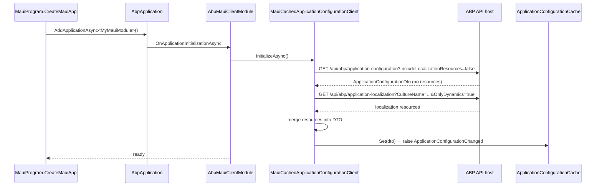
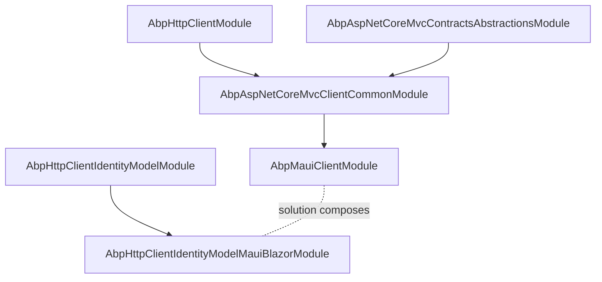

The `Volo.Abp.Maui.Client` package is the **non-Blazor MAUI** integration
for the ABP Framework. It is the package a native MAUI app (XAML-only or
mixed XAML/Blazor) references to consume ABP application services via
typed HTTP proxies. This page documents the module wiring, the
`MauiCachedApplicationConfigurationClient` that initialises permissions and
localization at startup, and the `ApplicationConfigurationCache` singleton
that fronts the API host's configuration endpoint.

The package directory is `framework/src/Volo.Abp.Maui.Client/`. It is a
deliberately small package — three classes plus a `csproj` — because most
of the heavy lifting is shared with the rest of ABP's HTTP client stack.
The complementary `Volo.Abp.AspNetCore.Components.MauiBlazor` package
covers the hybrid (Blazor-in-MAUI) scenario — see
[/blazor/components-mauiblazor](/blazor/components-mauiblazor).

## Why a separate package?

The ABP framework distinguishes two MAUI flavours:

| Flavour | NuGet package | Composition |
|---------|---------------|-------------|
| **Native MAUI** (XAML or `Microsoft.Maui.Controls`) | `Volo.Abp.Maui.Client` | App talks to API via `Volo.Abp.AspNetCore.Mvc.Client.Common` proxies |
| **Hybrid MAUI Blazor** (`BlazorWebView`-hosted) | `Volo.Abp.AspNetCore.Components.MauiBlazor` | Adds Blazor host module on top |

Both packages depend on `Volo.Abp.AspNetCore.Mvc.Client.Common`, which is
ABP's "host-agnostic typed HTTP client" abstraction. The Native flavour
omits the entire Blazor stack — there is no `BlazorWebView`, no
`IUiMessageService`, no JS interop. A native MAUI app uses MAUI's native
`Alert`, `DisplayActionSheet`, and `Toast` instead.

## Module

`framework/src/Volo.Abp.Maui.Client/Volo/Abp/Maui/Client/AbpMauiClientModule.cs`
is the tiniest possible startup module:

```csharp
[DependsOn(
    typeof(AbpAspNetCoreMvcClientCommonModule)
)]
public class AbpMauiClientModule : AbpModule
{
    public async Task OnApplicationInitializationAsync(ApplicationInitializationContext context)
    {
        await context.ServiceProvider
            .GetRequiredService<IClientScopeServiceProviderAccessor>().ServiceProvider
            .GetRequiredService<MauiCachedApplicationConfigurationClient>()
            .InitializeAsync();
    }
}
```

Two things to notice:

1. **Single dependency** on `AbpAspNetCoreMvcClientCommonModule`. That
   module is what brings in `Volo.Abp.Http.Client`, the typed remote
   service proxy generators, and `ICachedApplicationConfigurationClient`
   — see [/aspnetcore/overview](/aspnetcore/overview).
2. **Initialisation through the client scope.** The accessor pattern is
   the same one the WASM and MauiBlazor host modules use — see
   [/blazor/components-web](/blazor/components-web). The reason: at
   startup we are outside any per-request scope, but the cached
   configuration client lives in a known root scope.

## The csproj

```xml
<Project Sdk="Microsoft.NET.Sdk">
    <PropertyGroup>
        <TargetFramework>net10.0</TargetFramework>
        <Nullable>enable</Nullable>
        <AssemblyName>Volo.Abp.Maui.Client</AssemblyName>
        <PackageId>Volo.Abp.Maui.Client</PackageId>
        <AssetTargetFallback>$(AssetTargetFallback);portable-net45+win8+wp8+wpa81;</AssetTargetFallback>
    </PropertyGroup>

    <ItemGroup>
        <ProjectReference Include="..\Volo.Abp.AspNetCore.Mvc.Client.Common\Volo.Abp.AspNetCore.Mvc.Client.Common.csproj" />
    </ItemGroup>
</Project>
```

The `AssetTargetFallback` line preserves compatibility with the older
PCL profile that some MAUI dependencies still ship for. Targeting `net10.0`
(plain — no `-android`, `-ios` workload suffix) keeps the package usable
from a *library* shared by every MAUI head project.

## MauiCachedApplicationConfigurationClient

`framework/src/Volo.Abp.Maui.Client/Volo/Abp/Maui/Client/MauiCachedApplicationConfigurationClient.cs`
implements `ICachedApplicationConfigurationClient` for the native MAUI
process. The class is registered as `ISingletonDependency`, meaning one
instance lives for the lifetime of the MAUI app:

```csharp
public class MauiCachedApplicationConfigurationClient :
    ICachedApplicationConfigurationClient,
    ISingletonDependency
{
    protected AbpApplicationConfigurationClientProxy ApplicationConfigurationClientProxy { get; }
    protected AbpApplicationLocalizationClientProxy ApplicationLocalizationClientProxy { get; }
    protected ApplicationConfigurationCache Cache { get; }
    protected ICurrentTenantAccessor CurrentTenantAccessor { get; }

    public virtual async Task<ApplicationConfigurationDto> InitializeAsync()
    {
        var configurationDto = await ApplicationConfigurationClientProxy.GetAsync(
            new ApplicationConfigurationRequestOptions
            {
                IncludeLocalizationResources = false,
            });

        var localizationDto = await ApplicationLocalizationClientProxy.GetAsync(
            new ApplicationLocalizationRequestDto
            {
                CultureName = configurationDto.Localization.CurrentCulture.Name,
                OnlyDynamics = true
            }
        );

        configurationDto.Localization.Resources = localizationDto.Resources;

        CurrentTenantAccessor.Current = new BasicTenantInfo(
            configurationDto.CurrentTenant.Id,
            configurationDto.CurrentTenant.Name);

        Cache.Set(configurationDto);

        return configurationDto;
    }

    public virtual async Task<ApplicationConfigurationDto> GetAsync()
    {
        var configurationDto = Cache.Get();
        if (configurationDto is null)
        {
            return await InitializeAsync();
        }
        return configurationDto;
    }

    public virtual ApplicationConfigurationDto Get()
    {
        return AsyncHelper.RunSync(GetAsync);
    }
}
```

The `InitializeAsync` flow is deliberately optimised for cold start on a
mobile device:

| Step | What it does | Why |
|------|--------------|-----|
| `ApplicationConfigurationClientProxy.GetAsync(...)` with `IncludeLocalizationResources = false` | Fetches permissions, settings, current user/tenant, but **not** the full localization payload | Localization JSON is the largest part of the configuration; sending it inline doubles the response size |
| `ApplicationLocalizationClientProxy.GetAsync(... OnlyDynamics = true)` | Fetches *only* the dynamically-translated resources, not the framework defaults | Defaults are already shipped inside the MAUI app's resource files |
| `configurationDto.Localization.Resources = localizationDto.Resources` | Splices the two responses into a single DTO | API consumers see the same shape as a server-side request |
| `CurrentTenantAccessor.Current = ...` | Updates the singleton tenant accessor | All subsequent HTTP requests will carry the tenant header automatically |
| `Cache.Set(configurationDto)` | Stores the result and raises `ApplicationConfigurationChanged` | Subscribers (settings menus, language pickers) can re-render |

The `Get()` synchronous variant uses `AsyncHelper.RunSync` and is
necessary because some MAUI lifecycle hooks (e.g., XAML value converters)
cannot be made async.

## ApplicationConfigurationCache

`framework/src/Volo.Abp.Maui.Client/Volo/Abp/Maui/Client/ApplicationConfigurationCache.cs`
is the singleton that holds the `ApplicationConfigurationDto`:

```csharp
public class ApplicationConfigurationCache : ISingletonDependency
{
    protected ApplicationConfigurationDto? Configuration { get; set; }
    public event Action? ApplicationConfigurationChanged;

    public virtual ApplicationConfigurationDto? Get()
    {
        return Configuration;
    }

    public void Set(ApplicationConfigurationDto configuration)
    {
        Configuration = configuration;
        ApplicationConfigurationChanged?.Invoke();
    }
}
```

`ApplicationConfigurationChanged` is the cross-cutting hook that lets MAUI
view-models refresh after a permission change. Typical use in a XAML
page's code-behind:

```csharp
public partial class MainPage : ContentPage
{
    private readonly ApplicationConfigurationCache _cache;

    public MainPage(ApplicationConfigurationCache cache)
    {
        InitializeComponent();
        _cache = cache;
        _cache.ApplicationConfigurationChanged += OnConfigurationChanged;
    }

    private void OnConfigurationChanged()
    {
        Dispatcher.Dispatch(() =>
        {
            // re-evaluate IsVisible/IsEnabled bindings against the new permissions
            BindingContext = new MainViewModel(_cache.Get());
        });
    }
}
```

## Startup flow



## Composing with HTTP client identity

A real MAUI app needs to authenticate before issuing any
`ApplicationConfigurationClientProxy.GetAsync` call. ABP provides the
sibling package `Volo.Abp.Http.Client.IdentityModel.MauiBlazor` (under
`framework/src/Volo.Abp.Http.Client.IdentityModel.MauiBlazor/`) that
brings in:

- `MauiBlazorAbpAccessTokenProvider` — persists the OIDC tokens in
  `SecureStorage` / `Preferences`.
- `MauiIBlazorIdentityModelRemoteServiceHttpClientAuthenticator` — attaches
  the `Authorization: Bearer ...` header to every proxy call.
- `AbpHttpClientIdentityModelMauiBlazorModule` — wires both into the
  HTTP client builder pipeline.

A native (non-Blazor) MAUI app reuses the same provider/authenticator,
because the MAUI-specific token storage is the same in both cases — see
[/http/http-client-identitymodel](/http/http-client-identitymodel) for
the broader story.

## Typical MauiProgram

```csharp
public static class MauiProgram
{
    public static MauiApp CreateMauiApp()
    {
        var builder = MauiApp.CreateBuilder();
        builder
            .UseMauiApp<App>()
            .ConfigureFonts(fonts =>
            {
                fonts.AddFont("OpenSans-Regular.ttf", "OpenSansRegular");
            });

        builder.Services.AddApplication<MyMauiClientModule>(options =>
        {
            options.UseAutofac();  // optional, just like WASM
        });

        var app = builder.Build();

        app.Services.GetRequiredService<IAbpApplicationWithExternalServiceProvider>()
            .InitializeAsync(app.Services).GetAwaiter().GetResult();

        return app;
    }
}
```

`MyMauiClientModule` then `[DependsOn(typeof(AbpMauiClientModule), typeof(AbpHttpClientIdentityModelMauiBlazorModule))]`
and registers your app-specific app-service proxies via
`PreConfigure<AbpHttpClientOptions>(...)`.

## Module dependency map



## What this package does NOT do

| Concern | Where it lives instead |
|---------|------------------------|
| JS interop / browser APIs | `Volo.Abp.AspNetCore.Components.Web` (Blazor-only) |
| MAUI's `Application.Current.MainPage.DisplayAlert(...)` | Your own app code — no ABP equivalent for native MAUI |
| BlazorWebView hosting | `Volo.Abp.AspNetCore.Components.MauiBlazor` |
| Bundle pipeline | `Volo.Abp.AspNetCore.Components.MauiBlazor.Bundling` |
| OIDC token issuance | `Volo.Abp.Http.Client.IdentityModel.MauiBlazor` |
| Real-time push | `Volo.Abp.AspNetCore.SignalR.Client` over the same HTTP plumbing |

## Refreshing the configuration on demand

The default `InitializeAsync` is called once at startup. For a long-lived
MAUI app that wants to refresh after a sign-out / sign-in cycle, call
`InitializeAsync` again explicitly:

```csharp
public class AuthService
{
    private readonly MauiCachedApplicationConfigurationClient _config;

    public AuthService(MauiCachedApplicationConfigurationClient config)
    {
        _config = config;
    }

    public async Task OnSignInAsync()
    {
        // tokens already in SecureStorage; just refetch config under new identity
        await _config.InitializeAsync();
    }
}
```

The `Set(...)` call inside `InitializeAsync` raises
`ApplicationConfigurationChanged`, which lets all bound view-models
re-evaluate permissions in one pass.

## Pitfalls and tips

<Warning>
The constructor of `MauiCachedApplicationConfigurationClient` resolves
`AbpApplicationConfigurationClientProxy` directly — which means the typed
proxy generator pipeline must already have run by the time you call
`InitializeAsync`. The proxy generators run during
`ConfigureServices` of `AbpAspNetCoreMvcClientCommonModule`. If you skip
the `AddApplicationAsync<TStartupModule>(...)` call (or invoke
`InitializeAsync` from a static constructor), the proxy will be missing.
</Warning>

<Tip>
For tenant-aware MAUI apps, set
`MauiBlazorCurrentTenantAccessor.Current = new BasicTenantInfo(tenantId, tenantName)`
**before** the first call to `InitializeAsync`. The proxy pipeline reads
`ICurrentTenant` to compute the `__tenant` HTTP header, so the
configuration request will return the correct tenant-scoped permissions.
The MauiBlazor sibling provides a singleton accessor that survives the
process lifetime — see [/blazor/components-mauiblazor](/blazor/components-mauiblazor).
</Tip>

## Comparison: Maui.Client vs MauiBlazor host

| Aspect | `Volo.Abp.Maui.Client` | `Volo.Abp.AspNetCore.Components.MauiBlazor` |
|--------|------------------------|----------------------------------------------|
| MAUI UI | XAML / Controls | Razor components in `BlazorWebView` |
| Module depends on | `MvcClientCommon` only | `MvcClientCommon` + `ComponentsWeb` |
| Classes shipped | 3 (Module, cache, cached client) | ~13 (handler, tenant accessor, timezone, language, ...) |
| HTTP message handler | None — uses default `HttpClient` | `AbpMauiBlazorClientHttpMessageHandler` adds language + timezone headers |
| Init callback | `AbpMauiClientModule.OnApplicationInitializationAsync` | Same shape; additionally hydrates `AbpComponentsClaimsCache` |
| File providers | None | `IMauiBlazorContentFileProvider` for `wwwroot` serving |
| `IUiMessageService` etc. | Not registered (no Blazor) | `BlazoriseUiMessageService` via `AbpBlazoriseUIModule` |

In practice, projects pick **one** of the two: either a pure XAML MAUI app
referencing only `Volo.Abp.Maui.Client`, or a Blazor-Hybrid app
referencing only `Volo.Abp.AspNetCore.Components.MauiBlazor.Theming`
(which transitively brings everything else).

## Cross-stack pointers

- For the Blazor-hybrid version of this story, including `BundleManager`
  and `AbpBlazorWebView`, see
  [/blazor/components-mauiblazor](/blazor/components-mauiblazor).
- For the underlying `AbpAspNetCoreMvcClientCommonModule` and the
  proxy-generation pipeline, see [/aspnetcore/overview](/aspnetcore/overview).
- For OIDC tokens persisted in `SecureStorage`, see
  [/http/http-client-identitymodel](/http/http-client-identitymodel).
- For the SignalR client that complements the typed HTTP proxies, see
  [/aspnetcore/signalr](/aspnetcore/signalr).
- For the host-package matrix and `[DependsOn]` map, see
  [/blazor/overview](/blazor/overview).
- For the shared `IClientScopeServiceProviderAccessor`, see
  [/blazor/components-web](/blazor/components-web).
- For the Blazorise component library used by MAUI Blazor (not native), see
  [/blazor/blazorise-ui](/blazor/blazorise-ui).
- For the user store backing `ApplicationConfigurationDto.CurrentUser`,
  see [/modules/identity](/modules/identity).
- For the matching MVC UI for backoffice/server-side rendering, see
  [/ui-mvc/overview](/ui-mvc/overview).
