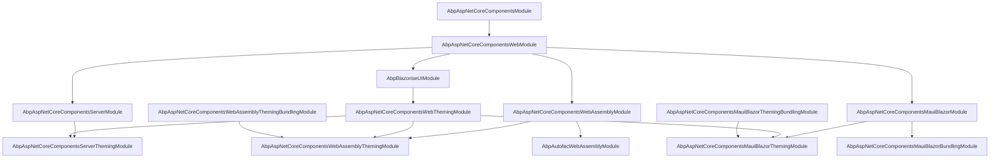
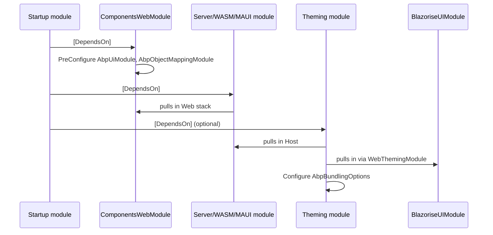

The ABP Framework integrates Blazor through a layered family of NuGet packages
rooted in `Volo.Abp.AspNetCore.Components`. This overview page covers the
**hosting matrix** (Server, WebAssembly, MauiBlazor, and the unified Blazor Web
App model) and shows which package you add to a module's `[DependsOn]` for each
combination. Subsequent pages drill into individual layers; this page is the
single place where the dependency graph, module wiring, and theming-vs-bundling
split are mapped end-to-end.

Every Blazor host in ABP — whether it runs server-side over SignalR, downloads
a `.wasm` payload to the browser, or is embedded in a `BlazorWebView` inside a
.NET MAUI shell — shares the same root abstractions defined in
`framework/src/Volo.Abp.AspNetCore.Components/`. That root package contributes
`AbpComponentBase`, `IUiMessageService`, `IUiNotificationService`,
`IUiPageProgressService`, `IUserExceptionInformer`, `IAlertManager`, and
`IBlockUiService`. The four hosting models then each layer on a thin
host-specific assembly plus an optional theming/bundling pair.

## The package matrix

The table below maps every package under `framework/src/Volo.Abp.AspNetCore.Components.*`
to the host it targets and the role it plays.

| Package | Host | Role | Module type |
|---------|------|------|-------------|
| `Volo.Abp.AspNetCore.Components` | All | Shared abstractions: `AbpComponentBase`, `IUiMessageService`, `IAlertManager` | `AbpAspNetCoreComponentsModule` |
| `Volo.Abp.AspNetCore.Components.Web` | All (Blazor) | Shared services: `IAbpUtilsService`, `ICookieService`, `ILocalStorageService`, `AbpAuthenticationState` | `AbpAspNetCoreComponentsWebModule` |
| `Volo.Abp.AspNetCore.Components.Web.Theming` | All (Blazor) | `IThemeManager`, `IComponentBundleManager`, `PageLayout`, `PageToolbar` | `AbpAspNetCoreComponentsWebThemingModule` |
| `Volo.Abp.AspNetCore.Components.Server` | Server | Server-side Blazor wiring: `MapBlazorHub`, lookup proxies | `AbpAspNetCoreComponentsServerModule` |
| `Volo.Abp.AspNetCore.Components.Server.Theming` | Server | `BlazorServerComponentBundleManager`, `BlazorGlobalScriptContributor` | `AbpAspNetCoreComponentsServerThemingModule` |
| `Volo.Abp.AspNetCore.Components.WebAssembly` | WASM | `WebAssemblyHostBuilder` extensions, `AbpBlazorClientHttpMessageHandler` | `AbpAspNetCoreComponentsWebAssemblyModule` |
| `Volo.Abp.AspNetCore.Components.WebAssembly.Theming` | WASM | `WebAssemblyComponentBundleManager` (returns empty lists — assets ship in the WASM payload) | `AbpAspNetCoreComponentsWebAssemblyThemingModule` |
| `Volo.Abp.AspNetCore.Components.WebAssembly.Theming.Bundling` | WASM (build-time) | `BlazorWebAssemblyScriptContributor`, `BlazorWebAssemblyStyleContributor` | `AbpAspNetCoreComponentsWebAssemblyThemingBundlingModule` |
| `Volo.Abp.AspNetCore.Components.MauiBlazor` | MAUI | `AbpMauiBlazorClientHttpMessageHandler`, MAUI tenant/timezone providers | `AbpAspNetCoreComponentsMauiBlazorModule` |
| `Volo.Abp.AspNetCore.Components.MauiBlazor.Bundling` | MAUI | `BundleManager`, `AbpBlazorWebView`, `IMauiBlazorContentFileProvider` | `AbpAspNetCoreComponentsMauiBlazorBundlingModule` |
| `Volo.Abp.AspNetCore.Components.MauiBlazor.Theming` | MAUI | Aggregation module pulling theming + bundling together | `AbpAspNetCoreComponentsMauiBlazorThemingModule` |
| `Volo.Abp.AspNetCore.Components.MauiBlazor.Theming.Bundling` | MAUI (build-time) | `MauiScriptContributor`, `MauiStyleContributor` | `AbpAspNetCoreComponentsMauiBlazorThemingBundlingModule` |
| `Volo.Abp.BlazoriseUI` | All (Blazor) | Blazorise-based concrete UI services: `BlazoriseUiMessageService`, `AbpCrudPageBase`, `BreadcrumbItem` | `AbpBlazoriseUIModule` |
| `Volo.Abp.Maui.Client` | MAUI (non-Blazor) | `MauiCachedApplicationConfigurationClient` for MAUI native | `AbpMauiClientModule` |
| `Volo.Abp.Autofac.WebAssembly` | WASM | Autofac container factory for the WASM host | `AbpAutofacWebAssemblyModule` |

## Dependency graph

The graph below was derived directly from the `[DependsOn(...)]` attributes
declared on each module class. It shows the diamond at
`AbpAspNetCoreComponentsWebModule` — the meeting point for every Blazor host
— and the parallel theming/bundling siblings.



The diamond at `AbpAspNetCoreComponentsWebModule` means **every Blazor host
shares the same `IUiMessageService` / `IUiNotificationService` contracts and
the same `IAbpUtilsService` JS-interop bridge**. Only the concrete
implementations (e.g., `BlazoriseUiMessageService`) and the bundle-source
providers differ between hosts. The bundling theming modules
(`*.Theming.Bundling`) sit *outside* the runtime branch because they are also
consumed by the build-time bundler invoked by the abp-cli.

## Hosting models compared

The four hosting models map to four distinct execution environments. The
following table contrasts them along the dimensions that matter when picking
a stack:

| Dimension | Blazor Server | Blazor WebAssembly | Blazor MAUI | Blazor Web App |
|-----------|---------------|--------------------|-------------|----------------|
| Process | ASP.NET Core server | Browser (WASM VM) | Native MAUI shell (Win/Mac/iOS/Android) | Mixed Server + WASM render modes |
| Entry module | `AbpAspNetCoreComponentsServerModule` | `AbpAspNetCoreComponentsWebAssemblyModule` | `AbpAspNetCoreComponentsMauiBlazorModule` | Both Server + WASM modules, flag-gated |
| Host builder | `WebApplicationBuilder` | `WebAssemblyHostBuilder` | `MauiAppBuilder` | `WebApplicationBuilder` |
| HTTP handler | In-process app services | `AbpBlazorClientHttpMessageHandler` | `AbpMauiBlazorClientHttpMessageHandler` | Either, depending on render mode |
| Auth state | Cookies (ASP.NET Core auth) | OIDC via `RemoteAuthenticationService` | Persistent token storage | `RemoteAuthenticationStateProvider` bridge |
| Bundling | Runtime `IBundleManager` (`BlazorServerComponentBundleManager`) | Build-time global asset, `WebAssemblyComponentBundleManager` returns `[]` | Build-time + runtime `BundleManager` writes `wwwroot/` files | Mixed |
| DI container | Built-in MS DI | MS DI + optional Autofac via `UseAutofac()` | MS DI | MS DI |
| Real-time | Native (Blazor circuit over SignalR) | Optional `Volo.Abp.AspNetCore.SignalR` client | Optional SignalR over HTTP | Native + WASM SignalR |

The Blazor Web App flag is exposed on
`AbpAspNetCoreComponentsWebOptions.IsBlazorWebApp` in
`framework/src/Volo.Abp.AspNetCore.Components.Web/Volo/Abp/AspNetCore/Components/Web/AbpAspNetCoreComponentsWebOptions.cs`:

```csharp
public class AbpAspNetCoreComponentsWebOptions
{
    public bool IsBlazorWebApp { get; set; }

    public AbpAspNetCoreComponentsWebOptions()
    {
        IsBlazorWebApp = false;
    }
}
```

`AbpAspNetCoreComponentsServerModule` checks this flag to decide whether to
auto-call `endpoints.MapBlazorHub()` and `MapFallbackToPage("/_Host")`, or to
defer routing to the Web App pipeline. The same flag is read by
`AbpAspNetCoreComponentsWebAssemblyModule.ConfigureServices` to skip the
default OIDC login/logout URL configuration when the WASM module is loaded as
part of a Blazor Web App.

## The shared abstraction core

The `Volo.Abp.AspNetCore.Components` package — see
`framework/src/Volo.Abp.AspNetCore.Components/Volo/Abp/AspNetCore/Components/AbpAspNetCoreComponentsModule.cs`
— performs two surprisingly important pre-configuration steps:

```csharp
[DependsOn(
    typeof(AbpObjectMappingModule),
    typeof(AbpSecurityModule),
    typeof(AbpTimingModule),
    typeof(AbpMultiTenancyAbstractionsModule)
    )]
public class AbpAspNetCoreComponentsModule : AbpModule
{
    public override void PreConfigureServices(ServiceConfigurationContext context)
    {
        DynamicProxyIgnoreTypes.Add<ComponentBase>();
        context.Services.AddConventionalRegistrar(new AbpWebAssemblyConventionalRegistrar());
    }
}
```

First, `DynamicProxyIgnoreTypes.Add<ComponentBase>()` tells Castle DynamicProxy
to never attempt to proxy a Razor component — Blazor's component lifecycle
cannot survive interception. Second,
`AbpWebAssemblyConventionalRegistrar` registers every `ComponentBase` subclass
as a **transient** service, which is what makes constructor injection and
`[Inject]` properties resolvable through ABP's DI rather than Blazor's
built-in activator.

The `AbpWebAssemblyConventionalRegistrar`
(`framework/src/Volo.Abp.AspNetCore.Components/Volo/Abp/AspNetCore/Components/DependencyInjection/AbpWebAssemblyConventionalRegistrar.cs`)
overrides only two methods:

```csharp
public class AbpWebAssemblyConventionalRegistrar : DefaultConventionalRegistrar
{
    protected override bool IsConventionalRegistrationDisabled(Type type)
    {
        return !IsComponent(type) || base.IsConventionalRegistrationDisabled(type);
    }

    private static bool IsComponent(Type type)
    {
        return typeof(ComponentBase).IsAssignableFrom(type);
    }

    protected override ServiceLifetime? GetDefaultLifeTimeOrNull(Type type)
    {
        return ServiceLifetime.Transient;
    }
}
```

Pair this with the `ServiceProviderComponentActivator`
(`framework/src/Volo.Abp.AspNetCore.Components/Volo/Abp/AspNetCore/Components/DependencyInjection/ServiceProviderComponentActivator.cs`)
that the Web module registers as a replacement for Blazor's default
`IComponentActivator`, and you get full ABP DI for every component:

```csharp
public class ServiceProviderComponentActivator : IComponentActivator
{
    public IServiceProvider ServiceProvider { get; }

    public IComponent CreateInstance(Type componentType)
    {
        var instance = ServiceProvider.GetService(componentType);
        if (instance == null)
            instance = Activator.CreateInstance(componentType);
        // ...
    }
}
```

## UI service contracts shared across hosts

The set of interfaces declared in `Volo.Abp.AspNetCore.Components` is what
every host package eventually needs a concrete for. The defaults live in
`Volo.Abp.AspNetCore.Components.Web` (or are `Null*` placeholders) and are
typically replaced by `Volo.Abp.BlazoriseUI` when the Blazorise UI library is
in use.

| Interface | Default implementation | Purpose |
|-----------|------------------------|---------|
| `IUiMessageService` | `SimpleUiMessageService` → `BlazoriseUiMessageService` | Modal info/success/warn/error/confirm dialogs |
| `IUiNotificationService` | `NullUiNotificationService` → `BlazoriseUiNotificationService` | Toast/snackbar notifications |
| `IUiPageProgressService` | `NullUiPageProgressService` → `BlazoriseUiPageProgressService` | Top-of-page progress bar |
| `IAlertManager` | `AlertManager` | In-page dismissible alerts collection |
| `IBlockUiService` | `NullBlockUiService` → `AbpBlockUiService` (JS interop) | Overlay block on long operations |
| `IUserExceptionInformer` | `NullUserExceptionInformer` → `UserExceptionInformer` | Converts `Exception` into a user-visible message |

These interfaces are declared in the
`framework/src/Volo.Abp.AspNetCore.Components/Volo/Abp/AspNetCore/Components/`
subfolders `Messages/`, `Notifications/`, `Progression/`, `Alerts/`,
`BlockUi/`, and `ExceptionHandling/`. `AbpComponentBase` exposes each as a
lazy property (`Message`, `Notify`, `AlertManager`, `UserExceptionInformer`,
`Alerts`) so that pages and components never inject them by hand.

## When does each module load?

A typical ABP-Blazor solution composes its modules in a specific order. The
diagram below traces the load flow for the three runtime hosting models.



The crucial insight is that `AbpAspNetCoreComponentsWebThemingModule` itself
depends on `AbpBlazoriseUIModule`, so referencing **any** theming package
transitively brings in Blazorise. This is why an ABP-style Blazor app that
does not want Blazorise must skip the theming module entirely and define its
own `IThemeManager`.

## Picking the right entry point

<Tip>
Most ABP solutions target a single host but share contract assemblies. If you
expect to move to a Blazor Web App later, write components against
`AbpComponentBase` (shared) and avoid casting to host-specific singletons such
as `WebAssemblyCachedApplicationConfigurationClient` directly — go through
`ICachedApplicationConfigurationClient` instead, which has implementations in
all three runtime hosts.
</Tip>

<Warning>
The `Volo.Abp.AspNetCore.Components.MauiBlazor.Bundling` module runs a
build-time copy step inside
`AbpAspNetCoreComponentsMauiBlazorBundlingModule.OnApplicationInitializationAsync`,
materialising the global CSS/JS bundle into the in-memory
`IDynamicFileProvider` exposed under `/wwwroot/`. If you reference this module
without referencing the
`Volo.Abp.AspNetCore.Components.MauiBlazor.Theming.Bundling` module that
populates `AbpBundlingOptions.GlobalAssets`, the dynamic files will be empty.
</Warning>

## Where to go next

- For the shared root layer that lives in *every* host, see
  [/blazor/components-web](/blazor/components-web).
- For server-side Blazor specifics (the `MapBlazorHub` wiring, the
  `_blazor` audit/UoW carve-out), see
  [/blazor/components-server](/blazor/components-server).
- For Blazor WebAssembly + the Microsoft `WebAssemblyHostBuilder` extension
  pattern, see [/blazor/components-webassembly](/blazor/components-webassembly).
- For `BlazorWebView` hosting inside .NET MAUI, see
  [/blazor/components-mauiblazor](/blazor/components-mauiblazor).
- For the cross-cutting bundling story (build-time vs runtime,
  `IComponentBundleManager`), see
  [/blazor/theming-and-bundling](/blazor/theming-and-bundling).
- For the Blazorise concrete UI library that ships the default services, see
  [/blazor/blazorise-ui](/blazor/blazorise-ui).
- For the native MAUI client (non-Blazor), see
  [/blazor/maui-client](/blazor/maui-client).
- For Autofac in WASM, see [/blazor/autofac-webassembly](/blazor/autofac-webassembly).

## Cross-stack pointers

The Blazor stack does not live in isolation. It composes with the rest of the
ABP framework:

- All host modules transitively reference
  [`Volo.Abp.AspNetCore`](/aspnetcore/overview) through either
  `AbpAspNetCoreComponentsServerModule` (server) or via `Volo.Abp.Http.Client`
  (WASM/MAUI).
- `AbpAspNetCoreComponentsServerModule` depends on
  [`Volo.Abp.AspNetCore.SignalR`](/aspnetcore/signalr) — Blazor Server *is*
  a SignalR circuit.
- The bundling layer is the same one that powers
  [`Volo.Abp.AspNetCore.Mvc.UI.Bundling`](/ui-mvc/bundling); only the
  consumer side differs (Blazor `IComponentBundleManager` vs MVC
  `IBundleTagHelperService`).
- For login flows in WASM, see how
  [`Volo.Abp.Http.Client.IdentityModel`](/http/http-client-identitymodel) is
  layered to obtain tokens for the HTTP client proxies that
  `AbpAspNetCoreComponentsWebAssemblyModule` injects into every API call.
- For the user store backing `ICurrentUser` exposed by `AbpComponentBase`,
  see [`Volo.Abp.Identity`](/modules/identity).
