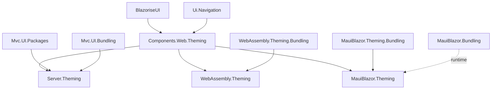
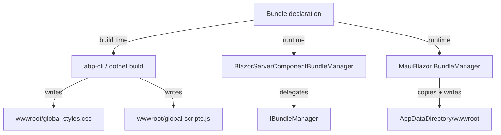

The ABP Framework's **Blazor theming and bundling** stack is a layered set
of abstractions that lets the same Razor component library render under
multiple visual themes and pull its CSS/JS from a host-appropriate bundle
source. This page covers the contracts declared in
`Volo.Abp.AspNetCore.Components.Web.Theming` and shows how each Blazor host
provides a concrete `IComponentBundleManager` and how the `PageLayout`,
`PageToolbar`, and `LayoutHook` machinery plug into the standard
`Application` / `Account` / `Public` / `Empty` layouts.

The starting point is
`framework/src/Volo.Abp.AspNetCore.Components.Web.Theming/`. The
sibling host-specific theming packages
(`*.Server.Theming`, `*.WebAssembly.Theming`, `*.MauiBlazor.Theming`)
contribute the concrete bundle managers and the bundle file lists.

## Module wiring

`AbpAspNetCoreComponentsWebThemingModule.cs` does only one explicit
configuration step:

```csharp
[DependsOn(
    typeof(AbpBlazoriseUIModule),
    typeof(AbpUiNavigationModule)
    )]
public class AbpAspNetCoreComponentsWebThemingModule : AbpModule
{
    public override void ConfigureServices(ServiceConfigurationContext context)
    {
        Configure<AbpDynamicLayoutComponentOptions>(options =>
        {
            options.Components.Add(typeof(AbpAuthenticationState), null);
        });
    }
}
```

`AbpDynamicLayoutComponentOptions.Components` is a `Dictionary<Type,
IDictionary<string,object>?>` whose contents the `DynamicLayoutComponent`
renders in *every* layout. Adding `AbpAuthenticationState` here is what
gives every page the cross-tab sign-out behavior covered in
[/blazor/components-web](/blazor/components-web). The `[DependsOn]` on
`AbpBlazoriseUIModule` is the choke point that makes Blazorise a hard
dependency of the entire theming layer.

## Themes

The theme abstraction is intentionally minimal — see
`framework/src/Volo.Abp.AspNetCore.Components.Web.Theming/Theming/ITheme.cs`:

```csharp
public interface ITheme
{
    Type GetLayout(string name, bool fallbackToDefault = true);
}
```

A theme is a class that maps a **layout name** (one of the constants in
`StandardLayouts`) to a concrete Razor layout component `Type`. The
selector and manager are equally compact:

```csharp
public interface IThemeManager
{
    ITheme CurrentTheme { get; }
}

public interface IThemeSelector
{
    ThemeInfo GetCurrentThemeInfo();
}
```

The default implementations live in the same folder:

```csharp
public class DefaultThemeSelector : IThemeSelector, ITransientDependency
{
    public virtual ThemeInfo GetCurrentThemeInfo()
    {
        if (!Options.Themes.Any())
            throw new AbpException($"No theme registered! Use {nameof(AbpThemingOptions)} to register themes.");

        if (Options.DefaultThemeName == null)
            return Options.Themes.Values.First();

        var themeInfo = Options.Themes.Values.FirstOrDefault(t => t.Name == Options.DefaultThemeName);
        if (themeInfo == null)
            throw new AbpException("Default theme is configured but it's not found in the registered themes: " + Options.DefaultThemeName);

        return themeInfo;
    }
}
```

```csharp
public class DefaultThemeManager : IThemeManager, IScopedDependency, IServiceProviderAccessor
{
    public ITheme CurrentTheme => GetCurrentTheme();

    protected virtual ITheme GetCurrentTheme()
    {
        if (_currentTheme != null) return _currentTheme;
        _currentTheme = (ITheme)ServiceProvider.GetRequiredService(ThemeSelector.GetCurrentThemeInfo().ThemeType);
        return _currentTheme;
    }
}
```

The fact that `DefaultThemeManager` implements `IScopedDependency` means a
new theme instance is resolved per Blazor scope — per circuit on the
server, once for the entire WASM process, and once per MAUI shell. The
cached `_currentTheme` field makes subsequent reads zero-cost.

## Theme registration

A theme class is registered via `AbpThemingOptions.Themes.Add<TTheme>()`:

```csharp
public class AbpThemingOptions
{
    public ThemeDictionary Themes { get; }
    public string? DefaultThemeName { get; set; }
}

public class ThemeDictionary : Dictionary<Type, ThemeInfo>
{
    public ThemeInfo Add<TTheme>() where TTheme : ITheme
        => Add(typeof(TTheme));

    public ThemeInfo Add(Type themeType)
    {
        if (ContainsKey(themeType))
            throw new AbpException("This theme is already added before: " + themeType.AssemblyQualifiedName);
        return this[themeType] = new ThemeInfo(themeType);
    }
}
```

The friendly `Name` for a theme comes from the `ThemeNameAttribute`
applied to the theme class — see
`Theming/ThemeNameAttribute.cs`:

```csharp
[AttributeUsage(AttributeTargets.Class)]
public class ThemeNameAttribute : Attribute
{
    public string Name { get; set; }

    public static string GetName(Type themeType)
    {
        return themeType
                   .GetCustomAttributes(true)
                   .OfType<ThemeNameAttribute>()
                   .FirstOrDefault()?.Name ?? themeType.Name;
    }
}
```

## Standard layout names

`StandardLayouts.cs` declares the four canonical layout names that any
theme must support:

```csharp
public static class StandardLayouts
{
    public const string Application = "Application";
    public const string Account = "Account";
    public const string Public = "Public";
    public const string Empty = "Empty";
}
```

A theme that does not provide one of these throws an `AbpException` (the
fallback logic is controlled by the `fallbackToDefault` parameter on
`GetLayout`).

| Layout | Used for | Typical contents |
|--------|----------|------------------|
| `Application` | Authenticated admin/dashboard pages | Sidebar, top toolbar, breadcrumb |
| `Account` | Login, register, forgot-password | Centered card layout |
| `Public` | Marketing pages | Public navigation, footer |
| `Empty` | Pop-up / printable pages | No chrome at all |

## DynamicLayoutComponent

`Components/DynamicLayoutComponent.razor.cs` is the renderless component
that walks `AbpDynamicLayoutComponentOptions.Components` and emits each
entry as a child component:

```csharp
public partial class DynamicLayoutComponent : ComponentBase
{
    [Inject]
    protected IOptions<AbpDynamicLayoutComponentOptions> AbpDynamicLayoutComponentOptions { get; set; } = default!;
}
```

The `.razor` companion iterates over the dictionary, instantiates each
component type via `<DynamicComponent Type="..." Parameters="..." />`, and
plants them at a known location in every layout. Modules add cross-cutting
UI (sign-out listeners, theme switchers, language flags) by simply calling:

```csharp
Configure<AbpDynamicLayoutComponentOptions>(options =>
{
    options.Components.Add(typeof(MyLayoutWidget), null);
});
```

## LayoutHook

For per-named-slot insertion (rather than the dictionary above), the
package ships `Components/LayoutHooks/LayoutHook.razor.cs`:

```csharp
public partial class LayoutHook : ComponentBase
{
    [Parameter] public string Name { get; set; } = default!;
    [Parameter] public string? Layout { get; set; }

    [Inject] protected IOptions<AbpLayoutHookOptions> LayoutHookOptions { get; set; } = default!;

    protected LayoutHookViewModel LayoutHookViewModel { get; private set; } = default!;

    protected override Task OnInitializedAsync()
    {
        if (LayoutHookOptions.Value.Hooks.TryGetValue(Name, out var layoutHooks))
        {
            layoutHooks = layoutHooks
                .Where(x => IsComponentBase(x) && (string.IsNullOrWhiteSpace(x.Layout) || x.Layout == Layout))
                .ToList();
        }

        layoutHooks ??= new List<LayoutHookInfo>();
        LayoutHookViewModel = new LayoutHookViewModel(layoutHooks.ToArray(), Layout);
        return Task.CompletedTask;
    }
}
```

`LayoutHook` reuses the cross-UI `AbpLayoutHookOptions` shared with the
MVC stack — meaning a hook registered as
`options.Hooks.Add(LayoutHooks.NavbarItemEnd, typeof(MyWidget))` lights up
in **both** the MVC and Blazor renderers without code duplication.

## PageLayout

`Layout/PageLayout.cs` is a scoped notification source for page-level
chrome (title, breadcrumb, toolbar). It implements `INotifyPropertyChanged`
so the layout can re-render on title changes:

```csharp
public class PageLayout : IScopedDependency, INotifyPropertyChanged
{
    public virtual string? Title {
        get => title;
        set { title = value; OnPropertyChanged(); }
    }

    public string? MenuItemName {
        get => menuItemName;
        set { menuItemName = value; OnPropertyChanged(); }
    }

    public bool ShowToolbar { get; set; } = true;

    public virtual ObservableCollection<BreadcrumbItem> BreadcrumbItems { get; } = new();
    public virtual ObservableCollection<PageToolbarItem> ToolbarItems { get; } = new();

    public void Reset()
    {
        Title = string.Empty;
        MenuItemName = string.Empty;
        BreadcrumbItems.Clear();
        ToolbarItems.Clear();
    }
}
```

A page sets `PageLayout.Title = L["Users"]` in its `OnInitialized` and
appends `BreadcrumbItem` entries; the layout's `PageHeader.razor` observes
the changes and re-renders without the page caring about layout structure.

## PageHeader and its options

`Layout/PageHeader.razor.cs` (a partial class) renders title, breadcrumb,
and toolbar in concert with `PageHeaderOptions`:

```csharp
public class PageHeaderOptions
{
    public bool RenderPageTitle { get; set; } = true;
    public bool RenderBreadcrumbs { get; set; } = true;
    public bool RenderToolbar { get; set; } = true;
}
```

Toggling these via `Configure<PageHeaderOptions>()` is the cheap way to
disable a piece of chrome globally without touching the theme's `.razor`.

## PageToolbar pipeline

The page toolbar is a contribution pipeline rather than a fixed render
target. Three abstractions cooperate:

```csharp
public interface IPageToolbarManager
{
    Task<PageToolbarItem[]> GetItemsAsync(PageToolbar toolbar);
}

public class PageToolbar
{
    public PageToolbarContributorList Contributors { get; set; }
}

public class PageToolbarItem
{
    public Type ComponentType { get; }
    public Dictionary<string, object?>? Arguments { get; set; }
    public int Order { get; set; }
}
```

The default manager opens a child scope, calls every contributor in
sequence, and orders the resulting items:

```csharp
public class PageToolbarManager : IPageToolbarManager, ITransientDependency
{
    public virtual async Task<PageToolbarItem[]> GetItemsAsync(PageToolbar toolbar)
    {
        if (toolbar == null || !toolbar.Contributors.Any())
            return Array.Empty<PageToolbarItem>();

        using (var scope = ServiceScopeFactory.CreateScope())
        {
            var context = new PageToolbarContributionContext(scope.ServiceProvider);
            foreach (var contributor in toolbar.Contributors)
                await contributor.ContributeAsync(context);
            return context.Items.OrderBy(i => i.Order).ToArray();
        }
    }
}
```

A contributor implements `IPageToolbarContributor.ContributeAsync(...)`
and either calls `context.Items.Add(new PageToolbarItem(...))` directly or
uses the helper `SimplePageToolbarContributor`.

## Routing

`Routing/AbpRouterOptions.cs` makes Blazor's `<Router>` modular:

```csharp
public class AbpRouterOptions
{
    public Assembly AppAssembly { get; set; } = default!;
    public RouterAssemblyList AdditionalAssemblies { get; }
}
```

Other modules (the Account UI module, the Tenant Management Blazor UI,
etc.) add their hosting assembly to `AdditionalAssemblies` via
`Configure<AbpRouterOptions>()`, and the standard `<Router>` template
includes them all without `Program.cs` knowing every module.

## Bundles: the runtime contract

`Bundling/IComponentBundleManager.cs` is the bundle abstraction Blazor
runtime code consumes:

```csharp
public interface IComponentBundleManager
{
    Task<IReadOnlyList<string>> GetStyleBundleFilesAsync(string bundleName);
    Task<IReadOnlyList<string>> GetScriptBundleFilesAsync(string bundleName);
}
```

A component asks for the list of files in a named bundle and then iterates
over them — usually to render `<link>` and `<script>` tags into an iframe
or print preview.

Each host has its own concrete:

| Host | Implementation | Behavior |
|------|----------------|----------|
| Server | `BlazorServerComponentBundleManager` (`Volo.Abp.AspNetCore.Components.Server.Theming`) | Delegates to `IBundleManager` from the MVC bundling pipeline |
| WebAssembly | `WebAssemblyComponentBundleManager` (`Volo.Abp.AspNetCore.Components.WebAssembly.Theming`) | Returns empty lists — the bundle is already linked into `index.html` |
| MauiBlazor | (Resolved via `BundleManager` in the bundling sibling package) | Returns the files written to `wwwroot/` at startup |

### Server side

`BlazorServerComponentBundleManager.cs` simply translates
`IReadOnlyList<BundleFile>` into `IReadOnlyList<string>`:

```csharp
public class BlazorServerComponentBundleManager : IComponentBundleManager, ITransientDependency
{
    public virtual async Task<IReadOnlyList<string>> GetStyleBundleFilesAsync(string bundleName)
        => (await BundleManager.GetStyleBundleFilesAsync(bundleName)).Select(f => f.FileName).ToList();

    public virtual async Task<IReadOnlyList<string>> GetScriptBundleFilesAsync(string bundleName)
        => (await BundleManager.GetScriptBundleFilesAsync(bundleName)).Select(f => f.FileName).ToList();
}
```

### WASM side

`WebAssemblyComponentBundleManager.cs` is intentionally a no-op:

```csharp
public class WebAssemblyComponentBundleManager : IComponentBundleManager, ITransientDependency
{
    public virtual Task<IReadOnlyList<string>> GetStyleBundleFilesAsync(string bundleName)
        => Task.FromResult<IReadOnlyList<string>>(new List<string>());

    public virtual Task<IReadOnlyList<string>> GetScriptBundleFilesAsync(string bundleName)
        => Task.FromResult<IReadOnlyList<string>>(new List<string>());
}
```

This is correct for WASM: the build-time bundler in
`*.WebAssembly.Theming.Bundling` has already concatenated everything into
`global-styles.css` and linked it from the published `index.html`, so the
runtime has nothing to enumerate.

## Standard bundle names

Each host declares a single canonical bundle name pair.

| Host | Style bundle | Script bundle |
|------|--------------|---------------|
| Server | `BlazorStandardBundles.Styles.Global` = `"Blazor.Global"` | `BlazorStandardBundles.Scripts.Global` = `"Blazor.Global"` |
| WebAssembly | `BlazorWebAssemblyStandardBundles.Styles.Global` = `"BlazorWebAssembly.Global"` | `BlazorWebAssemblyStandardBundles.Scripts.Global` = `"BlazorWebAssembly.Global"` |
| MauiBlazor | `MauiBlazorStandardBundles.Styles.Global` = `"MauiBlazor.Global"` | `MauiBlazorStandardBundles.Scripts.Global` = `"MauiBlazor.Global"` |

The constants live next to the contributors:
- `framework/src/Volo.Abp.AspNetCore.Components.Server.Theming/Bundling/BlazorGlobalBundles.cs`
- `framework/src/Volo.Abp.AspNetCore.Components.WebAssembly.Theming.Bundling/BlazorWebAssemblyStandardBundles.cs`
- `framework/src/Volo.Abp.AspNetCore.Components.MauiBlazor.Theming.Bundling/MauiBlazorStandardBundles.cs`

## Bundle file lists

Each host's bundle contributor enumerates a slightly different set of
files. Side-by-side:

| File | Server | WASM | MAUI |
|------|--------|------|------|
| `/_framework/blazor.server.js` | ✅ (when not Blazor Web App) | — | — |
| `Microsoft.AspNetCore.Components.WebAssembly.Authentication/AuthenticationService.js` | — | ✅ | — |
| `abp.js` | ✅ | ✅ | ✅ |
| `lang-utils.js` | — | ✅ | ✅ |
| `authentication-state-listener.js` | ✅ | ✅ | — |
| `bootstrap.min.css` | ✅ (via contributor [DependsOn]) | ✅ | ✅ |
| `fontawesome/all.css` | ✅ (via contributor [DependsOn]) | ✅ | ✅ |
| `abp.css` | ✅ | ✅ | ✅ |
| `flag-icon.css` | — | ✅ | ✅ |
| `blazorise.css` | ✅ | ✅ | ✅ |
| `blazorise.bootstrap5.css` | ✅ | ✅ | ✅ |
| `blazorise.snackbar.css` | ✅ | ✅ | ✅ |
| `volo.abp.blazoriseui.css` | ✅ | ✅ | ✅ |

The differences encode the host's constraints: Server inherits Bootstrap
via the MVC `BootstrapStyleContributor` `[DependsOn]` because it lives in
the same process; WASM and MAUI link Bootstrap directly because they have
their own static-web-asset trees.

## Cross-host dependency graph



## Runtime vs build-time bundling



- **Server**: bundles are computed every request through the MVC
  `IBundleManager`. The pipeline writes them to in-memory dynamic files
  served by `BundleMiddleware`.
- **WASM**: bundles are computed at build time. The runtime has nothing to
  do, hence the empty-list shim.
- **MAUI**: bundles are computed at startup (per-launch), then physically
  copied to `AppDataDirectory/wwwroot` so iOS WebView can serve them.

## Pitfalls and tips

<Tip>
A reusable component library that depends on
`Volo.Abp.AspNetCore.Components.Web.Theming` automatically pulls in
Blazorise. If you want to ship a host- *and* UI-library-agnostic library,
stop at `Volo.Abp.AspNetCore.Components.Web` and let consumers wire their
own `IThemeManager`.
</Tip>

<Warning>
Calling `IComponentBundleManager.GetStyleBundleFilesAsync` from a WASM
page returns an empty list — this is by design, not a bug. If you need to
enumerate the actual files at runtime in WASM, parse the published
`index.html` `<link>` tags via a static asset.
</Warning>

## Cross-stack pointers

- For the MVC-side `IBundleManager` used by the Server theming adapter,
  see [/ui-mvc/bundling](/ui-mvc/bundling).
- For the runtime page chrome consumers (`AbpCrudPageBase`,
  `BreadcrumbItem`), see [/blazor/blazorise-ui](/blazor/blazorise-ui).
- For host-specific bundle file lists (build-time):
  [Server bundle in Components Server](/blazor/components-server),
  [WASM bundle in Components WASM](/blazor/components-webassembly),
  [MAUI bundle in Components MAUI](/blazor/components-mauiblazor).
- For the shared root layer where `AbpAuthenticationState` lives, see
  [/blazor/components-web](/blazor/components-web).
- For SignalR-driven hot updates of the configuration cache that this
  layer reads, see [/aspnetcore/signalr](/aspnetcore/signalr).
- For the higher-level `Volo.Abp.AspNetCore` integration, see
  [/aspnetcore/overview](/aspnetcore/overview).
- For OIDC tokens used by Blazor's HTTP proxies, see
  [/http/http-client-identitymodel](/http/http-client-identitymodel).
- For the Identity module backing `CurrentUser`, see
  [/modules/identity](/modules/identity).
