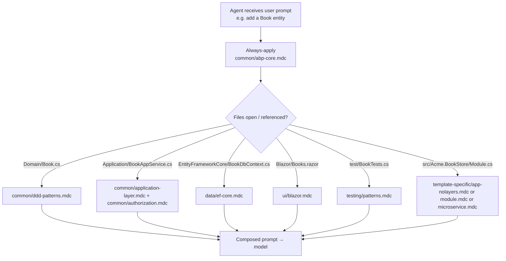
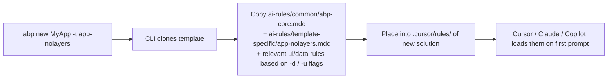

The ABP Framework ships a folder of Cursor-format `.mdc` rule files that are bundled into every new solution created from a template. They give an AI coding assistant (Cursor, Claude Code, Copilot Workspace, etc.) durable, ABP-specific context — module system, DDD layering, multi-tenancy, repository patterns — so generated code follows ABP conventions out of the box. This page walks every `.mdc` under `ai-rules/`, what each rule covers, the `globs` that activate it, and which kind of agent typically consumes it. For the framework concepts the rules teach see [/overview/architecture](/overview/architecture) and [/overview/modularity-model](/overview/modularity-model).

## Why these files exist

`ai-rules/README.md` opens with the design intent:

> Large language models don't retain memory between completions. Rules provide persistent, reusable context at the prompt level. When applied, rule contents are included at the start of the model context. This gives the AI consistent guidance for generating code, interpreting edits, or helping with workflows.

> **Important**: These rules are ABP-specific. They don't cover general .NET or ASP.NET Core patterns — AI assistants already know those. Instead, they focus on ABP's unique architecture, module system, and conventions.

There are five sub-folders plus the root README:

```
ai-rules/
├── README.md
├── common/                       # Rules for all ABP projects
│   ├── abp-core.mdc              # alwaysApply: true
│   ├── ddd-patterns.mdc
│   ├── application-layer.mdc
│   ├── authorization.mdc
│   ├── multi-tenancy.mdc
│   ├── infrastructure.mdc
│   ├── dependency-rules.mdc
│   ├── development-flow.mdc
│   └── cli-commands.mdc
├── ui/
│   ├── blazor.mdc
│   ├── angular.mdc
│   └── mvc.mdc
├── data/
│   ├── ef-core.mdc
│   └── mongodb.mdc
├── testing/
│   └── patterns.mdc
└── template-specific/
    ├── app-nolayers.mdc
    ├── module.mdc
    └── microservice.mdc
```

## Anatomy of an `.mdc` file

Every rule begins with a YAML frontmatter and is plain Markdown beneath it. From `ai-rules/README.md`:

```markdown
---
description: "Describes when this rule should apply - used by AI to decide relevance"
globs: "src/**/*.cs"
alwaysApply: false
---

# Rule Title

Your rule content here...
```

| Property      | What it means                                                        |
| ------------- | -------------------------------------------------------------------- |
| `description` | One-line summary the AI reads when deciding whether to load the rule |
| `globs`       | Single string or array of file patterns that auto-trigger the rule    |
| `alwaysApply` | If `true`, rule is included on every chat (only `abp-core.mdc` sets this) |

ABP follows four trigger conventions, also documented in the README:

| Type                       | When loaded                                          |
| -------------------------- | ---------------------------------------------------- |
| **Always Apply**           | Every chat session (`alwaysApply: true`)             |
| **Apply Intelligently**    | When the AI decides it's relevant from `description` |
| **Apply to Specific Files**| When an edited file matches a `globs` pattern        |
| **Apply Manually**         | When @-mentioned (e.g. `@ddd-patterns`)              |

## Full rule inventory

The 18 `.mdc` files in `ai-rules/`:

| File                                       | Lines | `alwaysApply` | Primary `globs` (abridged)                              |
| ------------------------------------------ | ----- | ------------- | -------------------------------------------------------- |
| `common/abp-core.mdc`                      | 182   | **`true`**    | n/a — loaded every session                               |
| `common/ddd-patterns.mdc`                  | 244   | false         | `**/*.Domain/**/*.cs`, `**/Domain/**/*.cs`, `**/Entities/**/*.cs` |
| `common/application-layer.mdc`             | 236   | false         | `**/*.Application/**/*.cs`, `**/*AppService*.cs`, `**/*Dto*.cs` |
| `common/authorization.mdc`                 | 186   | false         | `**/*Permission*.cs`, `**/*AppService*.cs`, `**/*Controller*.cs` |
| `common/multi-tenancy.mdc`                 | 165   | false         | `**/*Tenant*.cs`, `**/*MultiTenant*.cs`, `**/Entities/**/*.cs` |
| `common/infrastructure.mdc`                | 249   | false         | `**/*Setting*.cs`, `**/*Feature*.cs`, `**/*Cache*.cs`, `**/*Event*.cs`, `**/*Job*.cs` |
| `common/dependency-rules.mdc`              | 153   | false         | `**/*.csproj`, `**/*Module*.cs`                          |
| `common/development-flow.mdc`              | 299   | false         | `**/*AppService*.cs`, `**/*Dto*.cs`, `**/*DbContext*.cs`, `**/*Permission*.cs` |
| `common/cli-commands.mdc`                  |  92   | false         | `**/*.csproj`, `**/appsettings*.json`                    |
| `ui/blazor.mdc`                            | 210   | false         | `**/*.razor`, `**/Blazor/**/*.cs`, `**/*.Blazor*/**/*.cs` |
| `ui/angular.mdc`                           | 224   | false         | `**/angular/**/*.ts`, `**/angular/**/*.html`, `**/*.component.ts` |
| `ui/mvc.mdc`                               | 262   | false         | `**/*.cshtml`, `**/Pages/**/*.cs`, `**/Views/**/*.cs`, `**/Controllers/**/*.cs` |
| `data/ef-core.mdc`                         | 257   | false         | `**/*.EntityFrameworkCore/**/*.cs`, `**/*DbContext*.cs`   |
| `data/mongodb.mdc`                         | 206   | false         | `**/*.MongoDB/**/*.cs`, `**/*MongoDb*.cs`                |
| `testing/patterns.mdc`                     | 274   | false         | `test/**/*.cs`, `tests/**/*.cs`, `**/*Tests*/**/*.cs`     |
| `template-specific/app-nolayers.mdc`       |  83   | false         | `**/src/*/*Module.cs`, `**/src/*/Entities/**/*.cs`        |
| `template-specific/module.mdc`             | 234   | false         | none — description-driven                                |
| `template-specific/microservice.mdc`       | 209   | false         | none — description-driven                                |

<Note>
  Only `common/abp-core.mdc` has `alwaysApply: true`. Every other rule loads
  on file-match or AI judgment — keeping the model's context window focused
  and avoiding "rule soup."
</Note>

## How a request flows through the rules



## Common rules — `ai-rules/common/`

### `abp-core.mdc` — always-applied baseline

`description: "Core ABP Framework conventions - module system, dependency injection, and base classes"` with `alwaysApply: true`. This is the only rule guaranteed to load on every prompt. It teaches the agent the `AbpModule` lifecycle, `[DependsOn(typeof(...))]`, conventional service registration, base classes (`AbpServiceBase`, `AbpAppServiceBase`, `AbpController`, `AbpController<T>`), and the standard project layering.

A representative excerpt:

```markdown
# ABP Core Conventions

> **Documentation**: https://abp.io/docs/latest
> **API Reference**: https://abp.io/docs/api/

## Module System
Every ABP application/module has a module class that configures services:

\`\`\`csharp
[DependsOn(
    typeof(AbpDddDomainModule),
    typeof(AbpEntityFrameworkCoreModule)
)]
public class MyAppModule : AbpModule
{
    public override void ConfigureServices(ServiceConfigurationContext context)
    {
        // Service registration and configuration
    }
}
\`\`\`
```

### `ddd-patterns.mdc` — entities, aggregates, repositories

`description: "ABP DDD patterns - Entities, Aggregate Roots, Repositories, Domain Services"`. Activates on `**/*.Domain/**/*.cs`, `**/Domain/**/*.cs`, `**/Entities/**/*.cs`. Covers the Rich vs Anemic decision, private setters, factory methods, `AggregateRoot<TKey>`, `IRepository<TEntity, TKey>` discovery, custom repos, domain services.

The very first table in the rule:

```markdown
| Anemic (Anti-pattern) | Rich (Recommended) |
|----------------------|-------------------|
| Entity = data only | Entity = data + behavior |
| Logic in services | Logic in entity methods |
| Public setters | Private setters with methods |
| No validation in entity | Entity enforces invariants |
```

### `application-layer.mdc` — app services, DTOs, validation

`description: "ABP Application Services, DTOs, validation, and error handling patterns"`. Activates on `**/*.Application/**/*.cs`, `**/*AppService*.cs`, `**/*Dto*.cs`. Covers `IApplicationService`, `CrudAppService<>`, `ObjectMapping`, `FluentValidation` integration, business exceptions vs `Volo.Abp.Domain.Entities.BusinessException`, `IRemoteServiceErrorInfoConverter`, and DTO naming conventions (`CreateUpdateBookDto` shared by create + update).

### `authorization.mdc` — permissions

`description: "ABP permission system and authorization patterns"`. Activates on `**/*Permission*.cs`, `**/*AppService*.cs`, `**/*Controller*.cs`. Walks `PermissionDefinitionProvider`, `[Authorize(MyPermissions.Books)]`, `IPermissionChecker`, and the multi-tenant permission scoping.

### `multi-tenancy.mdc` — tenant-aware entities

`description: "ABP Multi-Tenancy patterns - tenant-aware entities, data isolation, and tenant switching"`. Activates on `**/*Tenant*.cs`, `**/*MultiTenant*.cs`, `**/Entities/**/*.cs`. Teaches `IMultiTenant`, `[MultiTenantSide(MultiTenancySides.Host)]`, `ICurrentTenant.Change()`, data filter `IsActive` / `MayHaveTenant` patterns.

### `infrastructure.mdc` — settings, features, caching, events, jobs

`description: "ABP infrastructure services - Settings, Features, Caching, Events, Background Jobs"`. Activates on `**/*Setting*.cs`, `**/*Feature*.cs`, `**/*Cache*.cs`, `**/*Event*.cs`, `**/*Job*.cs`. The largest of the infrastructure rules — covers `SettingDefinitionProvider`, `IFeatureChecker`, `IDistributedCache<>` typed wrappers, `IDistributedEventBus.PublishAsync`, `IBackgroundJobManager.EnqueueAsync`.

### `dependency-rules.mdc` — layer guardrails

`description: "ABP layer dependency rules and project structure guardrails"`. Activates on `**/*.csproj` and `**/*Module*.cs`. Tells the agent what `ProjectReference`s are legal — e.g. `*.Application` may reference `*.Application.Contracts` and `*.Domain` but not `*.EntityFrameworkCore`. Critical for `dotnet add reference` operations.

### `development-flow.mdc` — adding features end-to-end

`description: "ABP development workflow - adding features, entities, and migrations"`. The longest common rule (299 lines). Activates on a broad glob list (`**/*AppService*.cs`, `**/*Application*/**/*.cs`, `**/*Application.Contracts*/**/*.cs`, `**/*Dto*.cs`, `**/*DbContext*.cs`, `**/*.EntityFrameworkCore/**/*.cs`, `**/*.MongoDB/**/*.cs`, `**/*Permission*.cs`). Walks the entire "add a new entity" recipe: Domain → Domain.Shared → Application.Contracts → Application → EFCore/Mongo → migration → permissions → UI.

### `cli-commands.mdc` — ABP CLI cheat sheet

`description: "ABP CLI commands: generate-proxy, install-libs, add-package-ref, new-module, install-module, update, clean, suite generate (CRUD pages)"`. Activates on `**/*.csproj`, `**/appsettings*.json`. The shortest rule (92 lines) — a flat list of the most-used `abp` commands so the agent knows to suggest `abp generate-proxy` instead of hand-writing Angular service classes. For deep CLI documentation see [/cli/overview](/cli/overview).

## UI rules — `ai-rules/ui/`

### `blazor.mdc`

`description: "ABP Blazor UI patterns and components"`. Activates on `**/*.razor`, `**/Blazor/**/*.cs`, `**/*.Blazor*/**/*.cs`. Covers `AbpComponentBase`, `AbpCrudPageBase`, the LeptonX form-validation idiom, `Blazorise.DataGrid` ABP wrapper. A representative excerpt:

```razor
@inherits AbpComponentBase

<h1>@L["Books"]</h1>
```

### `angular.mdc`

`description: "ABP Angular UI patterns and best practices"`. Activates on `**/angular/**/*.ts`, `**/angular/**/*.html`, `**/*.component.ts`. Covers `@abp/ng.core` modules, `ConfigStateService`, `RestService`, the proxy-add schematic. See [/angular/overview](/angular/overview) for the runtime model these rules describe.

### `mvc.mdc`

`description: "ABP MVC and Razor Pages UI patterns"`. Activates on `**/*.cshtml`, `**/Pages/**/*.cs`, `**/Views/**/*.cs`, `**/Controllers/**/*.cs`. Walks `AbpPageModel`, ABP tag helpers (`<abp-card>`, `<abp-button>`), MVC ViewComponent registration, `IBundleManager`.

## Data rules — `ai-rules/data/`

### `ef-core.mdc`

`description: "ABP Entity Framework Core patterns - DbContext, migrations, repositories"`. Activates on `**/*.EntityFrameworkCore/**/*.cs`, `**/EntityFrameworkCore/**/*.cs`, `**/*DbContext*.cs`. Covers `AbpDbContext<T>`, `IAbpEntityFrameworkCoreDbContextModelCreatingExtensions`, the `Configure*` extension-method pattern, and migration generation in the right project.

```csharp
[ConnectionStringName("Default")]
public class MyProjectDbContext : AbpDbContext<MyProjectDbContext>
{
    public DbSet<Book> Books { get; set; }
    public DbSet<Author> Authors { get; set; }

    public MyProjectDbContext(DbContextOptions<MyProjectDbContext> options)
        : base(options) { }
}
```

### `mongodb.mdc`

`description: "ABP MongoDB patterns - MongoDbContext and repositories"`. Activates on `**/*.MongoDB/**/*.cs`, `**/MongoDB/**/*.cs`, `**/*MongoDb*.cs`. Covers `AbpMongoDbContext`, `IMongoCollection<>` exposure, `BsonClassMap` registration, and the parallel split with EF Core that lets one solution target both providers from one Domain layer.

## Testing rules — `ai-rules/testing/`

### `patterns.mdc`

`description: "ABP testing patterns - unit tests and integration tests"`. Activates on `test/**/*.cs`, `tests/**/*.cs`, `**/*Tests*/**/*.cs`, `**/*Test*.cs`. The single biggest testing rule in the set — covers `AbpIntegrationTest<TStartupModule>`, `WithUnitOfWorkAsync`, the test-data seed contributors pattern, `Volo.Abp.TestBase`, in-memory database providers, and the Shouldly idioms used across `framework/test/`.

## Template-specific rules — `ai-rules/template-specific/`

These three rules have no `globs` — they are description-driven. Cursor decides whether to load them based on whether the user's solution matches the template the rule describes.

| File                                  | When the AI loads it                                          |
| ------------------------------------- | ------------------------------------------------------------- |
| `app-nolayers.mdc`                    | When the solution is a single-csproj ABP web app (`app-nolayers` template) |
| `module.mdc`                          | When the solution is a reusable ABP module (`module` template) |
| `microservice.mdc`                    | When the solution is the microservice solution template       |

`app-nolayers.mdc` is the only template rule with `globs` (`**/src/*/*Module.cs`, `**/src/*/Entities/**/*.cs`, `**/src/*/Services/**/*.cs`, `**/src/*/Data/**/*.cs`) because the single-csproj layout is structurally distinct enough to be glob-detectable.

`module.mdc` opens with a single design tenet:

> This template is for developing reusable ABP modules. Key requirement: **extensibility** — consumers must be able to override and customize module behavior.

`microservice.mdc` walks the gateway / api-host / identity-service / administration-service split that ABP's commercial microservice template uses.

## Which agent consumes which rule

The `.mdc` format originated in Cursor, but other agents read the same files. The matrix below is based on how the README describes "Rule Types" and on agent tooling that recognizes `.cursor/rules/*.mdc` or `.cursorrules`:

| Agent type                                | Reads `alwaysApply: true` | Reads `globs`        | Reads via @-mention | Reads `description`-only rules |
| ----------------------------------------- | ------------------------- | -------------------- | ------------------- | ------------------------------ |
| Cursor (the original)                     | ✅                        | ✅                   | ✅                  | ✅ (intelligent)               |
| Claude Code                               | ✅ (via `CLAUDE.md` glue)  | partial (path-aware) | ✅                  | partial                         |
| GitHub Copilot / Copilot Workspace        | partial (`copilot-instructions.md`) | partial   | ✗                   | partial                         |
| Windsurf / Cody / Continue.dev            | ✅                        | ✅                   | varies              | ✅                              |
| Aider                                     | manual                    | manual               | manual              | manual                         |

In practice, when an ABP CLI command creates a new solution, it copies `ai-rules/` into the generated project's `.cursor/rules/` (or equivalent) so a Cursor user gets the rules without any extra setup. Other agents need a one-time "import these as your context" step.

## Rule format checklist (from the README)

The README's "Best Practices" section is the contributor contract for any new rule:

- **Keep rules under 500 lines.** Split when larger.
- **Provide concrete examples.** Reference real files or include code snippets.
- **Be specific, not vague.** Write like internal documentation.
- **Reference files instead of copying.** Stale duplication is the #1 risk.
- **Start simple.** Add rules only when the AI repeatedly makes the same mistake.

And "What to Avoid":

- **Don't copy entire style guides** — use a linter.
- **Don't document every command** — the AI knows `dotnet` and `npm`.
- **Don't add edge-case instructions** that rarely apply.
- **Don't duplicate codebase content** — point at canonical examples.
- **Don't include non-ABP patterns** — they're already in the model.

## How the rules ship to a new solution



The CLI decides which rules to copy from the `-d` (database provider) and `-u` (UI framework) flags:

| CLI flag combination                  | Rules copied (in addition to `common/`)                             |
| ------------------------------------- | -------------------------------------------------------------------- |
| `-d ef -u mvc`                        | `data/ef-core.mdc`, `ui/mvc.mdc`                                     |
| `-d ef -u angular`                    | `data/ef-core.mdc`, `ui/angular.mdc`                                 |
| `-d ef -u blazor` / `blazor-server`   | `data/ef-core.mdc`, `ui/blazor.mdc`                                  |
| `-d mongodb -u mvc`                   | `data/mongodb.mdc`, `ui/mvc.mdc`                                     |
| `-t app-nolayers …`                   | + `template-specific/app-nolayers.mdc`                               |
| `-t module …`                         | + `template-specific/module.mdc`                                     |
| `-t microservice`                     | + `template-specific/microservice.mdc`                               |

The `testing/patterns.mdc` is always copied because every template has a `test/` folder.

## Editing rules in this repo

<Steps>
  <Step title="Pick the right folder">
    Rule for every project? `common/`. UI-specific? `ui/`. Data provider? `data/`. Otherwise `template-specific/`.
  </Step>
  <Step title="Write the frontmatter">
    `description` is mandatory (used for rule selection). Add `globs` if file-trigger fits; set `alwaysApply: true` only if the rule is universal.
  </Step>
  <Step title="Cap at 500 lines">
    If you can't, split into siblings (`infrastructure-events.mdc`, `infrastructure-settings.mdc`).
  </Step>
  <Step title="Use code references not copies">
    Link to `framework/src/Volo.Abp.X/Foo.cs` instead of inlining the implementation.
  </Step>
  <Step title="Test in a real project">
    `abp new` a temporary app, copy the new rule into `.cursor/rules/`, ask Cursor / Claude to solve a representative task, see if behavior changes.
  </Step>
</Steps>

## Cross-links

<CardGroup cols={2}>
  <Card title="CLI Overview" icon="terminal" href="/cli/overview">
    The ABP CLI is what bundles these rules into a freshly created solution.
  </Card>
  <Card title="Architecture" icon="diagram-project" href="/overview/architecture">
    The DDD layering these rules teach.
  </Card>
  <Card title="Modularity Model" icon="cubes" href="/overview/modularity-model">
    `abp-core.mdc`'s `AbpModule` content matches this overview page.
  </Card>
  <Card title="Build & Deploy Overview" icon="rocket" href="/build-deploy/overview">
    Where AI rules sit in the broader pipeline (they ship in templates, not packs).
  </Card>
</CardGroup>
