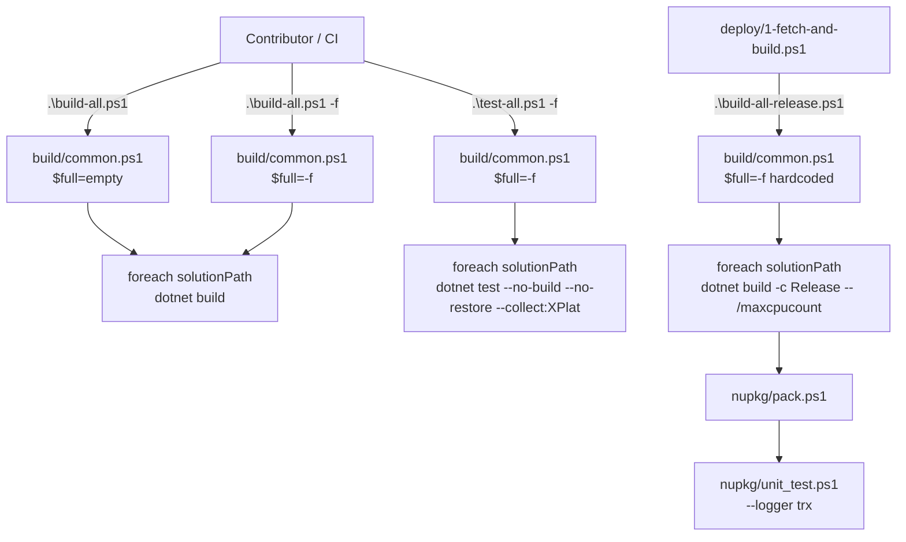

The ABP Framework does not have a single root `.slnx` — it has a fan of per-area solutions under `framework/`, `modules/*`, `templates/*` and `source-code/`. The four PowerShell scripts under `build/` are how every contributor and the release pipeline iterate those solutions one at a time. This page walks `build/common.ps1`, `build/build-all.ps1`, `build/build-all-release.ps1` and `build/test-all.ps1`. For the `.slnx` model itself see [/overview/solution-and-build](/overview/solution-and-build); for the packaging step that follows a successful build see [/build-deploy/nuget-packaging](/build-deploy/nuget-packaging).

## The solution list — `build/common.ps1`

`build/common.ps1` is the only place in the build folder that knows where the solutions live. It is dot-sourced by both `build-all.ps1` and `test-all.ps1` with one argument: a string that is either `-f` (full) or empty (development).

```powershell
$full = $args[0]

# COMMON PATHS

$rootFolder = (Get-Item -Path "./" -Verbose).FullName

# List of solutions used only in development mode
$solutionPaths = @(
        "../framework",
        "../modules/basic-theme",
        "../modules/users",
        "../modules/permission-management",
        "../modules/setting-management",
        "../modules/feature-management",
        "../modules/identity",
        "../modules/identityserver",
        "../modules/openiddict",
        "../modules/tenant-management",
        "../modules/audit-logging",
        "../modules/background-jobs",
        "../modules/account",
        "../modules/cms-kit",
        "../modules/blob-storing-database"
    )

if ($full -eq "-f")
{
    # List of additional solutions required for full build
    $solutionPaths += (
        "../modules/client-simulation",
        "../modules/virtual-file-explorer",
        "../modules/docs",
        "../modules/blogging",
        "../templates/module/aspnet-core",
        "../templates/app/aspnet-core",
        "../templates/console",
        "../templates/app-nolayers/aspnet-core",
        "../abp_io/AbpIoLocalization",
        "../source-code"
    )
    if ($env:OS -eq "Windows_NT") {
        $solutionPaths += "../templates/wpf"
    }
}else{
    Write-host ""
    Write-host ":::::::::::::: !!! You are in development mode !!! ::::::::::::::" -ForegroundColor red -BackgroundColor  yellow
    Write-host ""
}
```

Three patterns to note:

1. **`$rootFolder` is `build/`**, not the repo root. Every later `Join-Path $rootFolder $solutionPath` walks one level up via the `../` prefix.
2. **Development mode (no flag)** builds 15 solutions — `framework` plus the modules a typical contributor touches. The bright red/yellow `:::: development mode ::::` banner exists so nobody accidentally ships a release out of an incomplete tree.
3. **Full mode (`-f`)** adds another 10 solutions, then conditionally appends `templates/wpf` on Windows because WPF targets only build on `Windows_NT`.

### Solutions covered by each mode

| Mode             | Count | Includes                                          | Used by                       |
| ---------------- | ----- | ------------------------------------------------- | ----------------------------- |
| development      | 15    | `framework`, 14 most-used `modules/*`             | local PRs                     |
| `-f` (Linux/mac) | 24    | dev + extra modules, templates, source-code       | nightly, release              |
| `-f` (Windows)   | 25    | full + `templates/wpf`                            | release on Windows agents     |

## Debug fan-out — `build/build-all.ps1`

`build/build-all.ps1` is the script a contributor runs after `git pull`. It always runs in `Debug` and walks both lists:

```powershell
$full = $args[0]

. ".\common.ps1" $full

# Build all solutions

Write-Host $solutionPaths

foreach ($solutionPath in $solutionPaths) {
    $solutionAbsPath = (Join-Path $rootFolder $solutionPath)
    Set-Location $solutionAbsPath
    dotnet build
    if (-Not $?) {
        Write-Host ("Build failed for the solution: " + $solutionPath)
        Set-Location $rootFolder
        exit $LASTEXITCODE
    }
}

Set-Location $rootFolder
```

A few details that matter at scale:

- The script `cd`s into each solution folder so `dotnet build` finds the `*.slnx` (or `*.sln`) by directory probing. There is no explicit `-s` argument; this keeps the script working even when Volo Studio renames `.abpsln` ↔ `.slnx`.
- `if (-Not $?)` is PowerShell's "did the last native command succeed". With `dotnet build` returning non-zero on any project failure, this is the single fail-fast gate per solution.
- `exit $LASTEXITCODE` propagates the failing exit code up to CI so logs show which solution broke.
- The final `Set-Location $rootFolder` guarantees subsequent dot-sourced scripts still resolve `./common.ps1` correctly.

Typical local invocations:

```powershell
# Dev mode — fast (~15 solutions, debug)
cd build; .\build-all.ps1

# Full mode — everything (24+ solutions, debug)
cd build; .\build-all.ps1 -f
```

## Release fan-out — `build/build-all-release.ps1`

`build/build-all-release.ps1` is what `deploy/1-fetch-and-build.ps1` ultimately invokes. It is hard-wired to `-f` mode (the second `. .\common.ps1 -f` re-sources the same file with the full flag) and adds `--configuration Release -- /maxcpucount`:

```powershell
. ".\common.ps1" -f

# Build all solutions

foreach ($solutionPath in $solutionPaths) {
    $solutionAbsPath = (Join-Path $rootFolder $solutionPath)
    Set-Location $solutionAbsPath
    dotnet build --configuration Release -- /maxcpucount
    if (-Not $?) {
        Write-Host ("Build failed for the solution: " + $solutionPath)
        Set-Location $rootFolder
        exit $LASTEXITCODE
    }
}

Set-Location $rootFolder
```

Why the trailing `-- /maxcpucount`:

- `dotnet build` forwards everything after the `--` to MSBuild verbatim.
- `/maxcpucount` (no number) lets MSBuild use all available cores, which is the single biggest wall-clock win on a fan-out build of ~500 projects.

This is also why `configureawait.props` triggers: the Fody weaver is conditioned on `$(Configuration) == 'Release'`, so `build-all-release.ps1` is the script that produces IL-rewritten assemblies suitable for nuget.org.

### Build matrix

| Script                     | `$full`        | Configuration | MSBuild flags     | Typical wall time on a release agent |
| -------------------------- | -------------- | ------------- | ----------------- | ------------------------------------ |
| `build-all.ps1`            | empty          | Debug         | (defaults)        | ~5 min                               |
| `build-all.ps1 -f`         | `-f`           | Debug         | (defaults)        | ~12 min                              |
| `build-all-release.ps1`    | hard-coded `-f`| Release       | `/maxcpucount`    | ~20 min                              |

## Test fan-out — `build/test-all.ps1`

`build/test-all.ps1` mirrors `build-all.ps1` but swaps `build` for `test` and adds two crucial flags:

```powershell
$full = $args[0]

. ".\common.ps1" $full

# Test all solutions

foreach ($solutionPath in $solutionPaths) {
    $solutionAbsPath = (Join-Path $rootFolder $solutionPath)
    Set-Location $solutionAbsPath
    dotnet test --no-build --no-restore --collect:"XPlat Code Coverage"
    if (-Not $?) {
        Write-Host ("Test failed for the solution: " + $solutionPath)
        Set-Location $rootFolder
        exit $LASTEXITCODE
    }
}

Set-Location $rootFolder
```

The three flags are deliberately stacked:

- `--no-build` — assumes `build-all.ps1` already ran. Re-building every solution would double the wall time.
- `--no-restore` — assumes `dotnet restore` already ran via the build step. With Central Package Management (see [/build-deploy/directory-build-and-packages](/build-deploy/directory-build-and-packages)), restore is the slow phase.
- `--collect:"XPlat Code Coverage"` — produces `coverage.cobertura.xml` per test project. These are the files [Codecov](https://codecov.io) (see `codecov.yml`) ingests on the `dev` branch.

`codecov.yml` configures the threshold tolerated:

```yaml
codecov:
  branch: dev
  require_ci_to_pass: yes
  allow_coverage_offsets: true
  status:
    project:
      default:
        threshold: 1%
```

The `1%` project threshold means a PR may drop overall coverage by up to a percentage point without failing the Codecov status check.

### `nupkg/unit_test.ps1` — release-time tests

There is a second test runner under `nupkg/unit_test.ps1` that the release pipeline uses *after* packing. It reuses the project list from `nupkg/common.ps1` rather than the solution list from `build/common.ps1`:

```powershell
. ".\common.ps1"

# Unit test for all solutions
foreach($solution in $solutions) {
    $solutionFolder = Join-Path $rootFolder $solution
    Set-Location $solutionFolder
    dotnet test --no-build --logger trx
}
```

The `--logger trx` produces a `.trx` file per solution, which Jenkins on Natro (see `deploy/8-download-release-zip.ps1`) attaches to the release artifact bundle for archival.

## Call graph



## Why per-solution `dotnet build` and not one root solution?

Contributors often ask why ABP doesn't have a `Abp.slnx` at the root that lists every project, so one `dotnet build` would do everything. The answer is constraint-locality:

| Concern                              | Per-solution win                                          |
| ------------------------------------ | --------------------------------------------------------- |
| WPF targets only build on Windows    | Skip `templates/wpf` on Linux by leaving it out of `$solutionPaths` |
| Source-code packages need extra inputs | `source-code` is appended only in `-f` mode              |
| Volo Studio per-module open          | Each `modules/*/Volo.Abp.X.slnx` opens independently in Rider/VS |
| Failure isolation                    | One broken solution halts the loop without polluting later restore caches |
| Parallel CI                          | Multiple agents can take a slice of `$solutionPaths`      |

The trade-off is the script writes "Set-Location" and `dotnet build` 25 times instead of once — but each invocation still does its own `/maxcpucount` parallelism internally.

## Failure surface

If `build-all.ps1` reports `Build failed for the solution: ../modules/identity`, the contributor knows:

1. The first 9 solutions in the list (`framework` through `modules/openiddict` based on common ordering) **did** build, and their `bin/`/`obj/` are populated.
2. The 10th solution (`modules/identity`) failed; `$LASTEXITCODE` carries the MSBuild exit code.
3. Solutions after `modules/identity` were skipped — the loop `exit`s.

This is intentional: when a release pipeline fails, the artifacts already produced (NuGet packs for the first 9 solutions) are not pushed because `deploy/_run_all.ps1` exits on the first non-zero step, so nothing partial reaches nuget.org.

## When to run which script

| Situation                                  | Command                                | Why                                                |
| ------------------------------------------ | -------------------------------------- | -------------------------------------------------- |
| First clone, want everything compiling     | `cd build; .\build-all.ps1 -f`         | Full debug build with friendly error per solution  |
| Tight inner loop on `Volo.Abp.Identity`    | `cd modules/identity; dotnet build`    | Single solution, skip the wrapper                  |
| About to push a PR that touches `framework`| `cd build; .\build-all.ps1 -f; .\test-all.ps1 -f` | Mirror what CI runs                       |
| Reproducing a release locally              | `cd build; .\build-all-release.ps1`    | Triggers `configureawait.props`, mirrors deploy    |
| CI lane on a small module change           | `cd build; .\build-all.ps1`            | 15 solutions instead of 25                         |
| You suspect stale outputs                  | `cd ..; .\delete-bin-obj.ps1`          | Walks the tree removing `bin`/`obj` (skips `node_modules`) |

`delete-bin-obj.ps1` lives at the repo root (not under `build/`) and is the only stateful cleanup helper:

```powershell
Get-ChildItem -Path . -Include bin,obj -Recurse -Directory | ForEach-Object {
    if ($_.FullName -notmatch "\\node_modules\\") {
        Write-Host "Deleting:" $_.FullName -ForegroundColor Yellow
        Remove-Item $_.FullName -Recurse -Force
    } else {
        Write-Host "Skipping:" $_.FullName -ForegroundColor Magenta
    }
}
```

The `node_modules` guard is essential because the npm packs under `npm/` and `npm/ng-packs/` have `bin/` and `obj/` directories *inside* `node_modules` (some tooling caches), and wiping them would force a full `yarn install`.

## Cross-links

<CardGroup cols={2}>
  <Card title="Props & Packages" icon="folder-tree" href="/build-deploy/directory-build-and-packages">
    The MSBuild props every `dotnet build` here imports.
  </Card>
  <Card title="NuGet packaging" icon="cube" href="/build-deploy/nuget-packaging">
    What `dotnet pack` does after `build-all-release.ps1` finishes.
  </Card>
  <Card title="Deploy scripts" icon="rocket" href="/build-deploy/deploy-scripts">
    `deploy/1-fetch-and-build.ps1` is the only public caller of
    `build-all-release.ps1`.
  </Card>
  <Card title="Solution & Build" icon="diagram-project" href="/overview/solution-and-build">
    The `.slnx`/`.abpsln` files this loop targets.
  </Card>
</CardGroup>
