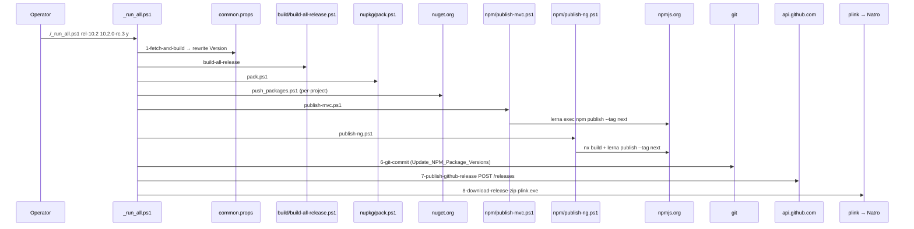

The ABP Framework release lives in `deploy/`. Eight numbered PowerShell scripts plus `_run_all.ps1` are the only callers of the building blocks under `build/`, `nupkg/` and `npm/`. This page walks each script in order, the credential files they read, the GitHub REST call, the SSH-driven Natro download and the `new-github-release-function.psm1` helper module. For the underlying steps each script delegates to, see [/build-deploy/build-scripts](/build-deploy/build-scripts), [/build-deploy/nuget-packaging](/build-deploy/nuget-packaging), and [/build-deploy/npm-publishing](/build-deploy/npm-publishing).

## Folder snapshot

| File                                | Purpose                                                                                      |
| ----------------------------------- | -------------------------------------------------------------------------------------------- |
| `1-fetch-and-build.ps1`             | `git switch` + `git pull` + `build/build-all-release.ps1`                                    |
| `2-nuget-pack.ps1`                  | `nupkg/pack.ps1`                                                                             |
| `3-nuget-push.ps1`                  | `nupkg/push_packages.ps1` with API key from `nuget-api-key.txt`                              |
| `4-npm-publish-mvc.ps1`             | `npm/publish-mvc.ps1` with token from `npm-auth-token.txt`                                   |
| `5-npm-publish-angular.ps1`         | `npm/publish-ng.ps1` with same token                                                         |
| `6-git-commit.ps1`                  | Commit and push the version bumps left behind by steps 1, 4, 5                               |
| `7-publish-github-release.ps1`      | `POST /repos/abpframework/abp/releases` with `prerelease` flag                               |
| `8-download-release-zip.ps1`        | `plink.exe` SSH into Natro CI to mirror the GitHub zip                                       |
| `_run_all.ps1`                      | Top-level orchestration that calls 1..8 with `Start-Transcript`                              |
| `new-github-release-function.psm1`  | Reusable `New-GitHubRelease` cmdlet adapted from `deadlydog/New-GitHubRelease`               |
| `plink.exe`                         | PuTTY's CLI SSH client — used by step 8                                                      |
| `readme.md`                         | Pre-release checklist for credential files                                                   |

The numbered scripts all dot-source `..\nupkg\common.ps1` so they share the same `Write-Info`, `Get-Current-Version`, `Get-Current-Branch`, `Read-File` helpers (see [/build-deploy/nuget-packaging](/build-deploy/nuget-packaging)).

## Credentials — `deploy/readme.md`

`deploy/readme.md` documents the three plaintext files the operator creates before the first release (`.gitignore` keeps them out of git):

> * create `npm-auth-token.txt` file in this folder and write the npmjs.org auth token. it's a GUID type.
> * create `nuget-api-key.txt` file this folder and write your nuget.org API key.
> * create `ssh-password.txt` file and write `jenkins` user SSH password.

The fourth credential (`github-api-key.txt`) is implicit: `7-publish-github-release.ps1` reads it with `Read-File "github-api-key.txt"` from `nupkg/common.ps1`.

| File                    | Reader                                  | Format               |
| ----------------------- | --------------------------------------- | -------------------- |
| `nuget-api-key.txt`     | `3-nuget-push.ps1`                      | nuget.org API key    |
| `npm-auth-token.txt`    | `4-npm-publish-mvc.ps1`, `5-npm-publish-angular.ps1` | npmjs.org auth-token GUID |
| `github-api-key.txt`    | `7-publish-github-release.ps1`          | PAT with `repo` / `public_repo` |
| `ssh-password.txt`      | `8-download-release-zip.ps1`            | SSH password for `jenkins@94.73.164.234` |
| `_run_all_log.txt`      | `_run_all.ps1` (`Start-Transcript`)     | Transcript of the run |

## 1 — Fetch and build

`deploy/1-fetch-and-build.ps1` is the only script that interacts with `common.props` directly. It accepts `-branch` and `-newVersion`; both are prompted if missing:

```powershell
param(
  [string]$branch,
  [string]$newVersion
)

. ..\nupkg\common.ps1

if (!$branch)     { $branch = Read-Host "Enter the branch name" }

#----------- Read the current version from common.props -----------
$commonPropsFilePath = resolve-path "../common.props"
$commonPropsXmlCurrent = [xml](Get-Content $commonPropsFilePath )
$currentVersion = $commonPropsXmlCurrent.Project.PropertyGroup.Version.Trim()

if (!$newVersion) {
    $newVersion = Read-Host "Current version is '$currentVersion'. Enter the new version (empty for no change) "
    if($newVersion -eq "") { $newVersion = $currentVersion }
}

if ($newVersion -ne $currentVersion){
    $commonPropsXmlCurrent.Project.PropertyGroup.Version = $newVersion
    $commonPropsXmlCurrent.Save( $commonPropsFilePath )
    $commonPropsXmlNew = [xml](Get-Content $commonPropsFilePath )
    $newVersionAfterUpdate = $commonPropsXmlNew.Project.PropertyGroup.Version
    echo "`n`nNew version updated as '$newVersionAfterUpdate' in $commonPropsFilePath`n"
}

Write-Info "Pulling ABP $branch branch from GitHub"
cd ..
git switch $branch
git pull origin

Write-Info "Building ABP repository"
cd build
.\build-all-release.ps1

Write-Info "Completed: Building ABP repository"
cd ..\deploy
```

Sequence:

1. Read `<Version>` from `common.props` via `[xml]` cast.
2. Prompt for a new version; if blank, keep current.
3. Rewrite `common.props` if changed, then re-read it to verify.
4. `git switch` to the target branch (e.g. `rel-10.2`) and pull.
5. `cd ..\build; .\build-all-release.ps1` — the full release build (see [/build-deploy/build-scripts](/build-deploy/build-scripts)).
6. **Always** `cd ..\deploy` at the end so the next numbered script starts from the right CWD.

The `cd ..\deploy #always return to the deploy directory` convention is repeated in every script — it is what allows `_run_all.ps1` to just call `./2-nuget-pack.ps1` next without specifying a path.

## 2 — Pack

`2-nuget-pack.ps1` is a four-line wrapper:

```powershell
. ..\nupkg\common.ps1
Write-Info "Creating NuGet packages"

echo "`n-----=====[ CREATING NUGET PACKAGES ]=====-----`n"
cd ..\nupkg
powershell -File pack.ps1
echo "`n-----=====[ CREATING NUGET PACKAGES COMPLETED ]=====-----`n"

Write-Info "Completed: Creating NuGet packages"
cd ..\deploy
```

Note the explicit `powershell -File pack.ps1` — this spawns a child PowerShell rather than dot-sourcing. The child gets a fresh `Set-Location` state, which is critical because `pack.ps1` itself `Set-Location`s into every project folder; if it were dot-sourced, the child's `Set-Location` would leak back into the parent.

## 3 — Push to nuget.org

`3-nuget-push.ps1` reads the API key from `nuget-api-key.txt` if present, otherwise prompts:

```powershell
param(
  [string]$nugetApiKey
)

. ..\nupkg\common.ps1

if (!$nugetApiKey) {
    $passwordFileName = "nuget-api-key.txt"
    $pathExists = Test-Path -Path $passwordFileName -PathType Leaf
    if ($pathExists) {
        $nugetApiKey = Get-Content $passwordFileName
        echo "Using NuGet API Key from $passwordFileName ..."
    }
}

if (!$nugetApiKey) {
    $nugetApiKey = Read-Host "Enter the NuGet API KEY"
}

Write-Info "Pushing packages to NuGet"
echo "`n-----=====[ PUSHING PACKAGES TO NUGET ]=====-----`n"
cd ..\nupkg
powershell -File push_packages.ps1 $nugetApiKey
echo "`n-----=====[ PUSHING PACKAGES TO NUGET COMPLETED ]=====-----`n"
Write-Info "Completed: Pushing packages to NuGet"

cd ..\deploy
```

The `Read-Host` fall-through is the manual-recovery hatch: if the credential file is missing in CI, the operator can paste a key. Note the API key flows in as `$args[0]` to `push_packages.ps1` (see [/build-deploy/nuget-packaging](/build-deploy/nuget-packaging)).

## 4 & 5 — npm publish

`4-npm-publish-mvc.ps1` and `5-npm-publish-angular.ps1` are near-clones — both read `npm-auth-token.txt`, set it via `npm set //registry.npmjs.org/:_authToken`, then shell into the right publish script:

```powershell
param(
  [string]$npmAuthToken
)

. ..\nupkg\common.ps1

if (!$npmAuthToken) {
    $passwordFileName = "npm-auth-token.txt"
    $pathExists = Test-Path -Path $passwordFileName -PathType Leaf
    if ($pathExists) {
        $npmAuthToken = Get-Content $passwordFileName
        echo "Using NPM Auth Token from $passwordFileName ..."
    }
}

if (!$npmAuthToken) { $npmAuthToken = Read-Host "Enter the NPM Auth Token" }

cd ..\npm

echo "`nSetting npmjs.org auth-token token`n"
npm set //registry.npmjs.org/:_authToken $npmAuthToken

Write-Info "Pushing MVC packages to NPM"
echo "`n-----=====[ PUSHING MVC PACKS TO NPM ]=====-----`n"
powershell -File publish-mvc.ps1
echo "`n-----=====[ PUSHING MVC PACKS TO NPM COMPLETED ]=====-----`n"
Write-Info "Completed: Pushing MVC packages to NPM"

cd ..\deploy
```

`5-npm-publish-angular.ps1` is identical except the final `powershell -File publish-mvc.ps1` becomes `powershell -File publish-ng.ps1`. The duplication is on purpose — `_run_all.ps1` calls them as separate steps so an MVC-only or Angular-only retry is trivial.

| Step | Source script invoked         | Reads which token file    | Sets npm registry token? |
| ---- | ----------------------------- | ------------------------- | ------------------------ |
| 4    | `npm/publish-mvc.ps1`         | `npm-auth-token.txt`      | yes                      |
| 5    | `npm/publish-ng.ps1`          | `npm-auth-token.txt`      | yes (again, idempotent)  |

## 6 — Git commit the bumps

After steps 1, 4 and 5 finish, the working tree has three categories of dirty files:

- `common.props` (Version bumped)
- Every Lerna-managed `package.json` (version bumped)
- Possibly regenerated `wwwroot/libs` artefacts from `update-gulp.js`

`6-git-commit.ps1` commits all of them with a single fixed message:

```powershell
. ..\nupkg\common.ps1

cd ..

Write-Info "Committing changes to GitHub"
echo "`n-----=====[ COMMITTING CHANGES ]=====-----`n"
git add .
git commit -m Update_NPM_Package_Versions
git push

echo "`n-----=====[ COMMITTING CHANGES COMPLETED ]=====-----`n"
Write-Info "Completed: Committing changes to GitHub"

cd deploy
```

The commit message `Update_NPM_Package_Versions` is what lets the public commit history show "version bump" entries that map 1-to-1 to releases.

## 7 — GitHub release

`7-publish-github-release.ps1` POSTs directly to the GitHub REST API. It accepts `-branchName`, `-version`, `-isRcVersion`, `-isDraft`, `-gitHubApiKey`, all defaulted from `common.props` / current git branch / `github-api-key.txt`:

```powershell
param(
  [string]$branchName,
  [string]$version,
  [string]$isRcVersion,
  [string]$isDraft,
  [string]$gitHubApiKey
)

. ..\nupkg\common.ps1

Write-Info "Publishing GitHub Release..."

if ($isRcVersion -eq "")      { $isRcVersion = Read-Host "Is this a RC/Preview version? (y/n)" }
if ($gitHubApiKey -eq "")     {
    $gitHubApiKey = Read-File "github-api-key.txt"
    echo "GitHub API Key assigned from github-api-key.txt"
}
if(!$gitHubApiKey)            { $gitHubApiKey = Read-Host "Enter the GitHub API Key" }
if ($version -eq "")          { $version = Get-Current-Version }
if ($branchName -eq "")       { $branchName = Get-Current-Branch }
if ($isDraft -eq "")          { $draft = $FALSE } else { $draft = [boolean]::Parse($isDraft) }

$preRelease = ( ($isRcVersion -eq "true") -or ($isRcVersion -eq "y") -or ($isRcVersion -eq "rc") )
$gitHubUsername = 'abpframework'
$gitHubRepository = 'abp'
$releaseNotes = ''

echo "Current version: $version"
echo "Current branch: $branchName"
echo "Preview version: $preRelease"
echo "Draft: $draft"

$releaseData = @{
   tag_name = $version;
   target_commitish = $branchName;
   name = $version;
   body = $releaseNotes;
   draft = $draft;
   prerelease = $preRelease;
 }

$releaseParams = @{
   Uri = "https://api.github.com/repos/$gitHubUsername/$gitHubRepository/releases";
   Method = 'POST';
   Headers = @{
     Authorization = 'Basic ' + [Convert]::ToBase64String(
       [Text.Encoding]::ASCII.GetBytes($gitHubApiKey + ":x-oauth-basic"));
   }
   ContentType = 'application/json';
   Body = (ConvertTo-Json $releaseData -Compress)
 }

$response = Invoke-RestMethod @releaseParams

echo  "---------------------------------------------"
echo "$version has been successfully released."
```

What lands on github.com/abpframework/abp/releases:

| GitHub field           | Source                                                |
| ---------------------- | ----------------------------------------------------- |
| Tag name               | `Get-Current-Version` → `common.props` `<Version>`    |
| Target commitish (sha) | `Get-Current-Branch` → `git branch --show-current`    |
| Release name           | Same as tag name                                      |
| Pre-release flag       | `($isRcVersion -in 'true','y','rc')`                  |
| Draft flag             | `[boolean]::Parse($isDraft)` (default `false`)         |
| Body                   | Empty (filled in manually after auto-generated notes) |

`Invoke-RestMethod` is used instead of `curl.exe` so the response is auto-deserialized. The Basic auth header uses the legacy `:x-oauth-basic` form which still works on github.com for PATs.

## The reusable function — `new-github-release-function.psm1`

`deploy/new-github-release-function.psm1` is a much fuller `New-GitHubRelease` cmdlet — adapted from `deadlydog/New-GitHubRelease`. The numbered scripts do **not** import this module today; `7-publish-github-release.ps1` does the REST call inline. The module is kept as a more capable alternative for when the release pipeline needs to upload release assets too:

```powershell
function New-GitHubRelease {
<#
    .SYNOPSIS
    Creates a new Release for the given GitHub repository.

    .PARAMETER GitHubUsername       The username that the GitHub repository exists under.
    .PARAMETER GitHubRepositoryName The name of the repository to create the Release for.
    .PARAMETER GitHubAccessToken    The Access Token to use as credentials for GitHub.
    .PARAMETER TagName              The name of the tag to create at the Commitish.
    .PARAMETER ReleaseName          The name to use for the new release.
    .PARAMETER ReleaseNotes         The text describing the contents of the release.
    .PARAMETER AssetFilePaths       The full paths of the files to include in the release.
    .PARAMETER Commitish            Specifies the commitish value that determines where the Git tag is created from.
    .PARAMETER IsDraft              True to create a draft (unpublished) release, false to create a published one.
    .PARAMETER IsPreRelease         True to identify the release as a prerelease.

    .OUTPUTS
    A hash table with the following properties is returned:
    Succeeded = $true if the Release was created successfully and all assets were uploaded.
    ReleaseCreationSucceeded = $true if the Release was created successfully (does not include asset uploads).
    AllAssetUploadsSucceeded = $true if all assets were uploaded.
    ReleaseUrl = The URL of the new Release that was created.
    ErrorMessage = A message describing what went wrong in the case that Succeeded is $false.
#>
    [CmdletBinding()]
    param (
        [Parameter(Mandatory=$true)] [string] $GitHubUsername,
        [Parameter(Mandatory=$true)] [string] $GitHubRepositoryName,
        [Parameter(Mandatory=$true)] [string] $GitHubAccessToken,
        [Parameter(Mandatory=$true)] [string] $TagName,
        [Parameter(Mandatory=$false)][string] $ReleaseName,
        [Parameter(Mandatory=$false)][string] $ReleaseNotes,
        [Parameter(Mandatory=$false)][string[]] $AssetFilePaths,
        [Parameter(Mandatory=$false)][string] $Commitish,
        [Parameter(Mandatory=$false)][bool]  $IsDraft = $false,
        [Parameter(Mandatory=$false)][bool]  $IsPreRelease = $false
    )
    BEGIN {
        Set-StrictMode -Version Latest
        Set-SecurityProtocolForThread
        [string] $NewLine = [Environment]::NewLine
        # … function body continues …
    }
}
```

To use it in place of the inline REST call, the operator would replace step 7 with:

```powershell
Import-Module .\new-github-release-function.psm1
$result = New-GitHubRelease @{
    GitHubUsername       = 'abpframework'
    GitHubRepositoryName = 'abp'
    GitHubAccessToken    = (Get-Content github-api-key.txt)
    TagName              = (Get-Current-Version)
    Commitish            = (Get-Current-Branch)
    IsPreRelease         = $true
    AssetFilePaths       = @(".\release.zip")
}
```

## 8 — Download release zip via plink

`8-download-release-zip.ps1` SSHes into Natro's Jenkins box and runs a PowerShell script there that downloads the freshly published GitHub release ZIP and mirrors it onto the Natro-hosted CDN. This is the only step that touches an external server.

```powershell
param(
  [string]$password
)

. ..\nupkg\common.ps1

if (!$password) {
    $sshPasswordFileName = "ssh-password.txt"
    $password = Get-Content $sshPasswordFileName
    echo "Using SSH password from $sshPasswordFileName ..."
}

if (!$password) { $password = Read-Host "Enter the Natro jenkins user password" }

# Get the current version
[xml]$commonPropsXml = Get-Content "../common.props"
$version = $commonPropsXml.Project.PropertyGroup.Version
echo "`n---===[ Current version: $version ]===---"

Write-Info "Downloading release zip into Natro"
echo "`n---===[ Running SSH commands on NATRO ]===---"
echo "`nDownloading release file into Natro..."

plink.exe -ssh jenkins@94.73.164.234 -pw $password -P 22 -batch "powershell -File c:\ci\scripts\download-latest-abp-release.ps1 ${version}"

Write-Info "Completed: Downloading release zip into Natro completed"
```

Two things to know:

- **`plink.exe`** is bundled in `deploy/` so the script runs on a fresh Windows box without needing PuTTY installed.
- **`c:\ci\scripts\download-latest-abp-release.ps1`** is a script that lives on the Natro Jenkins host, not in this repo. It's the script that actually `Invoke-WebRequest`s the release ZIP from github.com and stores it in the Natro static-asset folder for the abp.io download page.

## The orchestrator — `_run_all.ps1`

`_run_all.ps1` is the single entry point a release engineer types. It is short and deliberately linear:

```powershell
param(
  [string]$branch,
  [string]$newVersion,
  [string]$isRcVersion
)

. ..\nupkg\common.ps1

Start-Transcript -Append _run_all_log.txt

if (!$branch) { $branch = Read-Host "Enter the branch name" }

if (!$newVersion) {
    $currentVersion = Get-Current-Version
    $newVersion = Read-Host "Current version is '$currentVersion'. Enter the new version (empty for no change) "
    if($newVersion -eq "") { $newVersion = $currentVersion }
}

if ($isRcVersion -eq "") { $isRcVersion = Read-Host "Is this a RC/Preview version? (y/n)" }

$publishGithubReleaseParams = @{
    branchName=$branch
    isRcVersion=$isRcVersion
}

./1-fetch-and-build.ps1 $branch $newVersion
./2-nuget-pack.ps1
./3-nuget-push.ps1
./4-npm-publish-mvc.ps1
./5-npm-publish-angular.ps1
./6-git-commit.ps1
./7-publish-github-release.ps1 @publishGithubReleaseParams
./8-download-release-zip.ps1

Stop-Transcript
```

`Start-Transcript -Append _run_all_log.txt` is the safety net — even if a step fails halfway, the full PowerShell session log is captured in `deploy/_run_all_log.txt` (also gitignored).

## End-to-end diagram



## Failure recovery

| Step that failed                | Safe to rerun?                       | Notes                                                  |
| ------------------------------- | ------------------------------------ | ------------------------------------------------------ |
| `1-fetch-and-build.ps1`         | Yes                                  | `git pull` is idempotent; build is too                 |
| `2-nuget-pack.ps1`              | Yes                                  | `pack.ps1` starts with `del *.nupkg`                   |
| `3-nuget-push.ps1`              | Yes — `--skip-duplicate` swallows 409 | Re-pushes only the packs that failed                   |
| `4-npm-publish-mvc.ps1`         | Partial — npm has no `--skip-duplicate` for `publish` | Will fail with 403 on packs already shipped at that version |
| `5-npm-publish-angular.ps1`     | Partial — same                       | Use `--skipVersionValidation` if bumping the suffix    |
| `6-git-commit.ps1`              | No — already pushed                  | Use `git commit --amend; git push --force-with-lease`  |
| `7-publish-github-release.ps1`  | No — release already created         | Use `gh release edit` or delete the release first      |
| `8-download-release-zip.ps1`    | Yes                                  | Natro script is idempotent                             |

## Cross-links

<CardGroup cols={2}>
  <Card title="Build Scripts" icon="terminal" href="/build-deploy/build-scripts">
    `build-all-release.ps1` is step 1's payload.
  </Card>
  <Card title="NuGet Packaging" icon="cube" href="/build-deploy/nuget-packaging">
    `pack.ps1` and `push_packages.ps1` are steps 2 and 3's payload.
  </Card>
  <Card title="npm Publishing" icon="square-js" href="/build-deploy/npm-publishing">
    `publish-mvc.ps1` and `publish-ng.ps1` are steps 4 and 5's payload.
  </Card>
  <Card title="Solution & Build" icon="diagram-project" href="/overview/solution-and-build">
    The `.slnx` topology these scripts iterate over.
  </Card>
</CardGroup>
