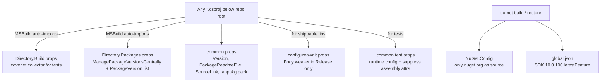

The ABP Framework relies on six tiny MSBuild files at the repository root to keep ~500 csproj files coherent. This page reads each one — `Directory.Build.props`, `Directory.Packages.props`, `common.props`, `common.test.props`, `configureawait.props`, plus `NuGet.Config` and `global.json` — line by line, and shows how Central Package Management makes every `PackageReference` in the tree version-less. For the `.slnx` topology these props sit underneath, see [/overview/solution-and-build](/overview/solution-and-build); for the full dependency catalog they govern, see [/overview/tech-stack-and-dependencies](/overview/tech-stack-and-dependencies).

## SDK pin — `global.json`

`global.json` lives next to the root `Directory.Build.props` and is the first file every `dotnet` invocation reads:

```json
{
  "sdk": {
    "version": "10.0.100",
    "rollForward": "latestFeature"
  }
}
```

`rollForward: latestFeature` means a `10.0.105` or `10.0.200` SDK is accepted, but `10.1.0` is not. This guarantees every contributor and every CI agent pulls the same C# language version and analyzers, even though the `<TargetFramework>` itself is declared per-csproj (typically `net10.0`). The pinned SDK is intentionally aligned with `<Version>10.2.0-rc.3</Version>` from `common.props`.

## Implicit project imports — `Directory.Build.props`

`Directory.Build.props` is auto-imported by every `.csproj` below the repo root. ABP keeps it minimal — only test-project wiring lives there:

```xml
<Project>
  <PropertyGroup>
    <IsTestProject Condition="$(MSBuildProjectFullPath.Contains('test')) and ($(MSBuildProjectName.EndsWith('.Tests')) or $(MSBuildProjectName.EndsWith('.TestBase')))">true</IsTestProject>
  </PropertyGroup>

  <ItemGroup>
    <PackageReference Condition="'$(IsTestProject)' == 'true'" Include="coverlet.collector">
      <Version Condition="$(MSBuildProjectFullPath.Contains('templates'))">6.0.4</Version>
      <PrivateAssets>all</PrivateAssets>
      <IncludeAssets>runtime; build; native; contentfiles; analyzers</IncludeAssets>
    </PackageReference>
  </ItemGroup>
</Project>
```

Two things to notice:

1. `IsTestProject` is computed from the path (`test` segment present) *and* the assembly name (`.Tests` or `.TestBase`). That dual check is why a `Volo.Abp.TestBase` produced by the framework is treated as a test project, but a `MyApp.Application` is not.
2. `coverlet.collector` is the only universally-injected `PackageReference`. The nested `Version` condition for `templates` paths exists because the generated solution templates do **not** use Central Package Management, so they need an inline version.

## Central Package Management — `Directory.Packages.props`

Central Package Management (CPM) is opted in at the very top of `Directory.Packages.props`:

```xml
<Project>
  <PropertyGroup>
    <ManagePackageVersionsCentrally>true</ManagePackageVersionsCentrally>
    <CentralPackageFloatingVersionsEnabled>true</CentralPackageFloatingVersionsEnabled>
  </PropertyGroup>
  <ItemGroup>
    <PackageVersion Include="Autofac" Version="8.4.0" />
    <PackageVersion Include="Autofac.Extensions.DependencyInjection" Version="10.0.0" />
    <PackageVersion Include="AutoMapper" Version="14.0.0" />
    ...
  </ItemGroup>
</Project>
```

With CPM enabled, every `.csproj` in the tree writes `<PackageReference Include="Autofac" />` *without* a `Version` attribute — the version is sourced from this single file. `CentralPackageFloatingVersionsEnabled` permits floating wildcards like `[8.0.*]`, though ABP only uses fixed versions in practice.

### Family snapshot

The catalog groups around the ecosystems ABP integrates with. The exact versions here are a moving target — read `Directory.Packages.props` directly — but the *shape* is stable:

| Family                        | Example packages                                              | Anchored to                              |
| ----------------------------- | ------------------------------------------------------------- | ---------------------------------------- |
| ASP.NET Core 10               | `Microsoft.AspNetCore.Authentication.JwtBearer` `10.0.2`      | matches `global.json` SDK band            |
| EF Core 10                    | `Microsoft.EntityFrameworkCore` `10.0.2`                      | `Volo.Abp.EntityFrameworkCore`           |
| Autofac                       | `Autofac` `8.4.0`, `Autofac.Extras.DynamicProxy` `7.1.0`      | `Volo.Abp.Autofac`                       |
| OpenIddict / Identity         | `OpenIddict.Server.AspNetCore` `7.2.0`, `IdentityServer4` `4.1.2` | `modules/openiddict`, `modules/identityserver` |
| MongoDB                       | `MongoDB.Driver` `3.7.0`                                      | `Volo.Abp.MongoDB`                       |
| Cloud storage                 | `AWSSDK.S3`, `Azure.Storage.Blobs`, `Aliyun.OSS.SDK.NetCore`  | `Volo.Abp.BlobStoring.*`                 |
| Test stack                    | `xunit` `2.9.3`, `Shouldly` `4.3.0`, `NSubstitute` `5.3.0`    | `Volo.Abp.TestBase`                      |
| Source generators / weaving   | `Fody` `6.9.3`, `ConfigureAwait.Fody` `3.3.2`, `Nullable` `1.3.1`, `Microsoft.SourceLink.GitHub` `8.0.0` | `configureawait.props`, `common.props`   |
| Mobile                        | `Microsoft.Maui.Controls` `10.0.20`                           | `Volo.Abp.Maui.Client`                   |

<Note>
  The single file is hundreds of `PackageVersion` lines long. Treat it as the
  source of truth. The [/overview/tech-stack-and-dependencies](/overview/tech-stack-and-dependencies)
  page narrates *why* each family is included; this page only explains *how*
  `Directory.Packages.props` enforces a single version across the tree.
</Note>

## Per-package metadata — `common.props`

Where `Directory.Packages.props` pins versions, `common.props` carries shared NuGet metadata. It is **not** auto-imported; each shippable csproj imports it explicitly. The file:

```xml
<Project>
  <PropertyGroup>
    <LangVersion>latest</LangVersion>
    <Version>10.2.0-rc.3</Version>
    <LeptonXVersion>5.2.0-rc.3</LeptonXVersion>
    <NoWarn>$(NoWarn);CS1591;CS0436</NoWarn>
    <PackageIconUrl>https://abp.io/assets/abp_nupkg.png</PackageIconUrl>
    <PackageProjectUrl>https://abp.io/</PackageProjectUrl>
    <PackageLicenseExpression>LGPL-3.0-only</PackageLicenseExpression>
    <RepositoryType>git</RepositoryType>
    <RepositoryUrl>https://github.com/abpframework/abp/</RepositoryUrl>
    <PackageReadmeFile>NuGet.md</PackageReadmeFile>
    <PackageTags>aspnetcore boilerplate framework web best-practices angular maui blazor mvc csharp webapp</PackageTags>
    <GenerateDocumentationFile>true</GenerateDocumentationFile>
    <AllowedOutputExtensionsInPackageBuildOutputFolder>$(AllowedOutputExtensionsInPackageBuildOutputFolder);.pdb</AllowedOutputExtensionsInPackageBuildOutputFolder>
  </PropertyGroup>
  <ItemGroup>
    <None Include="..\..\NuGet.md" Pack="true" PackagePath="\"/>
  </ItemGroup>
  <ItemGroup>
    <PackageReference Include="Microsoft.SourceLink.GitHub">
      <PrivateAssets>all</PrivateAssets>
      <IncludeAssets>runtime; build; native; contentfiles; analyzers</IncludeAssets>
    </PackageReference>
  </ItemGroup>
  <ItemGroup Condition="'$(UsingMicrosoftNETSdkWeb)' != 'true' AND '$(UsingMicrosoftNETSdkRazor)' != 'true'">
    <None Remove="*.abppkg.analyze.json" />
    <Content Include="*.abppkg.analyze.json">
      <Pack>true</Pack>
      <PackagePath>content\</PackagePath>
    </Content>
  </ItemGroup>
  <ItemGroup>
    <None Remove="*.abppkg" />
    <Content Include="*.abppkg">
      <Pack>true</Pack>
      <PackagePath>content\</PackagePath>
    </Content>
  </ItemGroup>
  <ItemGroup Condition="$(AssemblyName.EndsWith('HttpApi.Client'))">
    <EmbeddedResource Include="**\*generate-proxy.json" />
    <Content Remove="**\*generate-proxy.json" />
  </ItemGroup>
</Project>
```

Key observations:

- `<Version>10.2.0-rc.3</Version>` is the single source of truth read by every PowerShell script via `nupkg/common.ps1::Get-Current-Version`.
- `<LeptonXVersion>5.2.0-rc.3</LeptonXVersion>` is an ABP-specific MSBuild property — solution templates reference it as `Version="$(LeptonXVersion)"` when pinning the LeptonX theme.
- `NoWarn=$(NoWarn);CS1591;CS0436` silences the "missing XML doc" and "type conflict" warnings that are unavoidable in a 500-project monorepo.
- `<None Include="..\..\NuGet.md" Pack="true" />` packs the root `NuGet.md` into every `.nupkg` as the package README so every package on nuget.org shows the ABP overview text.
- `<AllowedOutputExtensionsInPackageBuildOutputFolder>` adds `.pdb` so SourceLink debugging works against published packages.
- `<Microsoft.SourceLink.GitHub>` with `PrivateAssets="all"` embeds GitHub commit links into `.pdb` without leaking the SourceLink dependency to consumers.
- `*.abppkg` and `*.abppkg.analyze.json` are ABP's own module-metadata files. They are packed into `content/` so the `Volo.Abp.Cli` package-analyzer can detect ABP modules and their dependencies — this is how `abp install-libs` and the Studio module browser know what to pull.
- The final conditional `EmbeddedResource Include="**\*generate-proxy.json"` is a one-off for `*.HttpApi.Client` projects: it embeds the generated proxy descriptor inside the assembly instead of shipping it loose.

## Test-project metadata — `common.test.props`

Test projects import a sibling file that disables documentation and assembly-info generation:

```xml
<Project>
  <PropertyGroup>
    <LangVersion>latest</LangVersion>
    <NoWarn>$(NoWarn);CS1591;CS0436</NoWarn>
    <GenerateRuntimeConfigurationFiles>true</GenerateRuntimeConfigurationFiles>
    <GenerateAssemblyConfigurationAttribute>false</GenerateAssemblyConfigurationAttribute>
    <GenerateAssemblyCompanyAttribute>false</GenerateAssemblyCompanyAttribute>
    <GenerateAssemblyProductAttribute>false</GenerateAssemblyProductAttribute>
  </PropertyGroup>
</Project>
```

`GenerateRuntimeConfigurationFiles=true` is the important one — `dotnet test` needs the `.runtimeconfig.json` next to the test assembly to pick the right runtime. Disabling the three `Assembly*Attribute` generators stops `<AssemblyInfo.cs>` from claiming "Debug build" or "Volo, LLC", which would otherwise leak into test output.

## Release-only weaving — `configureawait.props`

`configureawait.props` is opted in **only in `Release`** and only by projects that want their public async methods to be exception-safe in any synchronization context:

```xml
<Project>
  <ItemGroup Condition="'$(Configuration)' == 'Release'">
      <PackageReference Include="ConfigureAwait.Fody" PrivateAssets="All" />
      <PackageReference Include="Fody">
        <PrivateAssets>All</PrivateAssets>
        <IncludeAssets>runtime; build; native; contentfiles; analyzers</IncludeAssets>
      </PackageReference>
  </ItemGroup>
</Project>
```

[`ConfigureAwait.Fody`](https://github.com/Fody/ConfigureAwait) rewrites every `await` in the assembly to use `.ConfigureAwait(false)` at IL-level. Doing this with a Fody weaver means contributors never have to type `.ConfigureAwait(false)` by hand and the source stays readable; the weaver runs only in `Release` so debugging in `Debug` still shows the original call shape.

## Restore feeds — `NuGet.Config`

The root `NuGet.Config` deliberately overrides all machine-wide feeds and trims to a single source:

```xml
<?xml version="1.0" encoding="utf-8"?>
<configuration>
    <packageSources>
        <add key="nuget.org" value="https://api.nuget.org/v3/index.json" />
    </packageSources>
</configuration>
```

There is no `<clear />` element because NuGet, when it finds a `NuGet.Config` at the solution root, scopes only this file for the build. This stops a contributor's personal `~/.nuget/NuGet.Config` (which might have a stale dev feed) from changing the restore graph in CI.

## How a single csproj uses all of these

A representative csproj — say `framework/src/Volo.Abp.Autofac/Volo.Abp.Autofac.csproj` — imports `common.props` and `configureawait.props` explicitly:

```xml
<Project Sdk="Microsoft.NET.Sdk">
  <Import Project="..\..\..\common.props" />
  <Import Project="..\..\..\configureawait.props" />
  <PropertyGroup>
    <TargetFramework>net10.0</TargetFramework>
    <AssemblyName>Volo.Abp.Autofac</AssemblyName>
    <PackageId>Volo.Abp.Autofac</PackageId>
    <GeneratePackageOnBuild>false</GeneratePackageOnBuild>
  </PropertyGroup>
  <ItemGroup>
    <ProjectReference Include="..\Volo.Abp\Volo.Abp.csproj" />
    <PackageReference Include="Autofac" />
    <PackageReference Include="Autofac.Extensions.DependencyInjection" />
    <PackageReference Include="Autofac.Extras.DynamicProxy" />
  </ItemGroup>
</Project>
```

Note that:

- `Directory.Build.props` was auto-imported — nothing in this csproj references it.
- The three `<PackageReference>` entries have **no** `Version` attribute; CPM (from `Directory.Packages.props`) supplies them.
- `<Import>` for `common.props` gives the project `<Version>` and `Microsoft.SourceLink.GitHub`.
- `<Import>` for `configureawait.props` adds the Fody weaver, but only when `dotnet build -c Release` runs.

## The import hierarchy



## Conventions you can rely on

| Convention                                 | Enforced by                                              | Override?                                    |
| ------------------------------------------ | -------------------------------------------------------- | -------------------------------------------- |
| Single SDK band across the repo            | `global.json`                                            | Not without `--no-validate` (don't)          |
| One version per package across all csprojs | `Directory.Packages.props` + `ManagePackageVersionsCentrally` | Per-project `<PackageVersion>` override     |
| `coverlet.collector` in every test project | `Directory.Build.props`                                  | Set `IsTestProject=false`                    |
| `Volo.*` packages share `<Version>`        | `common.props`                                           | Re-declare `<Version>` after the `<Import>`  |
| Fody runs only in Release                  | `configureawait.props`                                   | Don't `<Import>` the file                    |
| Only nuget.org is consulted on restore     | `NuGet.Config`                                           | Add a feed beneath the `<add>` line          |
| `*.abppkg` is shipped as content           | `common.props` `<Content Include="*.abppkg">`            | Set `<Pack>false</Pack>` per item            |

## Editing checklist

When a contributor needs to bump a single dependency they almost always touch one file:

<Steps>
  <Step title="Bump a transitive">
    Edit `Directory.Packages.props`, locate `<PackageVersion Include="…">`, change `Version`. No csproj edits required.
  </Step>
  <Step title="Bump the framework">
    Edit `common.props` `<Version>`. `deploy/1-fetch-and-build.ps1` accepts the same string interactively for the next release.
  </Step>
  <Step title="Add a new top-level package">
    Add a `<PackageVersion>` line to `Directory.Packages.props`; in the consuming csproj add a `<PackageReference Include="X" />` with **no** `Version`.
  </Step>
  <Step title="Add a new test project">
    Name it `*.Tests` and place it under a path containing `test`; `Directory.Build.props` will auto-add `coverlet.collector`.
  </Step>
  <Step title="Add a new shippable library">
    `<Import Project="…\common.props" />` and `<Import Project="…\configureawait.props" />` in the csproj. The `<Version>`, README, license expression and SourceLink come for free.
  </Step>
</Steps>

## Cross-links

<CardGroup cols={2}>
  <Card title="Build scripts" icon="terminal" href="/build-deploy/build-scripts">
    How `build/build-all.ps1` and `build-all-release.ps1` iterate over the
    solutions that consume these props.
  </Card>
  <Card title="NuGet packaging" icon="cube" href="/build-deploy/nuget-packaging">
    How `nupkg/pack.ps1` reads `<Version>` from `common.props` and produces
    versioned `.nupkg` files.
  </Card>
  <Card title="Tech stack" icon="diagram-project" href="/overview/tech-stack-and-dependencies">
    Narrative view of every dependency listed in `Directory.Packages.props`.
  </Card>
  <Card title="Solution & build" icon="folder-tree" href="/overview/solution-and-build">
    The `.slnx` topology these props apply to.
  </Card>
</CardGroup>
