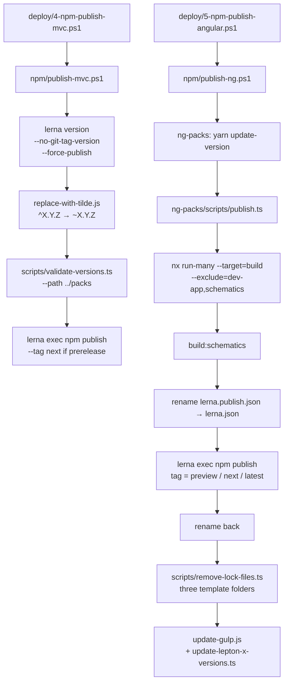

The ABP Framework ships two big npm package families to npmjs.org from this monorepo: the MVC packs (`@abp/aspnetcore.mvc.ui.theme.*`, `@abp/jquery`, etc.) and the Angular packs (`@abp/ng.core`, `@abp/ng.theme.shared`, `@abp/ng.theme.lepton-x`, schematics, …). This page reads the two PowerShell drivers, both Lerna roots, the helper TypeScript scripts under `npm/scripts/` and `npm/ng-packs/scripts/`, and the Verdaccio compose under `npm/verdaccio-containers/`. For how Angular consumers wire these packs into a real app see [/angular/overview](/angular/overview).

## Two roots, two Lerna configs

| Root                | Lerna version (file)                       | `packages` glob          | npm client | Notes                            |
| ------------------- | ------------------------------------------ | ------------------------ | ---------- | -------------------------------- |
| `npm/`              | `lerna.json` → `"version": "10.2.0-rc.3"`  | `packs/*`                | `yarn`     | MVC + Razor packs                |
| `npm/ng-packs/`     | `lerna.publish.json` → `"version": "1.0.0"`, `"packages": ["dist/packages/*"]` | `dist/packages/*` (built) | `yarn` | Renamed in/out of `lerna.json` at publish time |
| `npm/ng-packs/`     | `lerna.version.json` → `"version": "7.2.3"`, `"packages": ["packages/*"]` | `packages/*` (source) | `yarn` | Source-side version log          |

The two-file split inside `ng-packs/` is the key trick. `lerna.publish.json` describes the **built** artifact (`dist/packages/*`) and is what `npm publish` actually walks. `lerna.version.json` describes the **source** tree (`packages/*`) and is what `lerna version` bumps. The publish script renames them in place:

```ts
await fse.rename('../lerna.publish.json', '../lerna.json');
// … lerna exec npm publish …
await fse.rename('../lerna.json', '../lerna.publish.json');
```

## Top-level package.json — `npm/package.json`

The top-level package is a thin coordinator with three custom scripts and Lerna 3 pinned:

```json
{
  "version": "2.3.0",
  "scripts": {
    "lerna": "lerna",
    "ncu": "ncu",
    "update-gulp": "node update-gulp.js",
    "replace-with-tilde": "node replace-with-tilde.js",
    "update": "node package-update-script.js"
  },
  "devDependencies": {
    "@types/fs-extra": "^8.0.1",
    "glob": "^7.1.5",
    "lerna": "^3.18.4",
    "npm-check-updates": "^11.3.0"
  },
  "dependencies": {
    "commander": "^6.0.0",
    "execa": "^3.4.0",
    "fast-glob": "^3.2.7",
    "fs-extra": "^8.1.0",
    "semver": "^7.3.5"
  }
}
```

`package-update-script.js`, `update-gulp.js` and `replace-with-tilde.js` are released-related helpers explained below.

## MVC publish — `npm/publish-mvc.ps1`

`publish-mvc.ps1` is the simpler of the two drivers because the MVC packs are pre-built static JS/CSS — no compilation step is required, only a Lerna version bump, a tilde rewrite, validation and `lerna exec npm publish`:

```powershell
param(
  [string]$Version,
  [string]$Registry
)

yarn install

$NextVersion = $(node publish-utils.js --nextVersion)
$RootFolder = (Get-Item -Path "./" -Verbose).FullName

if (-Not $Version) { $Version = $NextVersion; }
if (-Not $Registry) { $Registry = "https://registry.npmjs.org"; }

$PacksPublishCommand = "npm run lerna -- exec 'npm publish --registry $Registry'"

$IsPrerelease = $(node publish-utils.js --prerelease --customVersion $Version) -eq "true";

if ($IsPrerelease) {
  $PacksPublishCommand = $PacksPublishCommand.Substring(0, $PacksPublishCommand.Length - 1) + " --tag next'"
}

$commands = (
  "npm run lerna -- version $Version --yes --no-commit-hooks --no-git-tag-version --no-push --force-publish",
  "yarn replace-with-tilde",
  "cd scripts",
  "yarn install",
  "yarn validate-versions --compareVersion $Version --path ../packs",
  "cd ..",
  $PacksPublishCommand
)
```

The interesting flags on the Lerna `version` call:

| Flag                  | Why                                                   |
| --------------------- | ----------------------------------------------------- |
| `--yes`               | Non-interactive (CI)                                  |
| `--no-commit-hooks`   | Skip Husky                                            |
| `--no-git-tag-version`| Don't tag — `deploy/7-publish-github-release.ps1` does the GitHub tag separately |
| `--no-push`           | Don't push commits — `deploy/6-git-commit.ps1` does the version bump commit |
| `--force-publish`     | Bump every package even if Lerna detects no diff (the version is the artifact change) |

For a prerelease (`X.Y.Z-rc.N`), the command is rewritten to append `--tag next` so `npm install @abp/jquery` keeps installing the last stable, while `npm install @abp/jquery@next` resolves to the RC.

## Tilde rewrite — `npm/replace-with-tilde.js`

Between version bump and publish, every `@abp/*` dependency reference inside each pack's `package.json` is rewritten from `^X.Y.Z` to `~X.Y.Z`:

```js
const glob = require("glob");
const fse = require("fs-extra");

function replace(filePath) {
  const pkg = fse.readJsonSync(filePath);
  const { dependencies } = pkg;
  if (!dependencies) return;
  Object.keys(dependencies).forEach((key) => {
    if (key.includes("@abp/")) {
      dependencies[key] = dependencies[key].replace("^", "~");
    }
  });
  fse.writeJsonSync(filePath, { ...pkg, dependencies }, { spaces: 2 });
}

glob("./packs/**/package.json", {}, (er, files) => {
  files.forEach((path) => {
    if (path.includes("node_modules")) { return; }
    replace(path);
  });
});
```

Why tilde for intra-ABP deps:

- `^10.2.0` allows resolution to `10.3.0` (any future minor).
- `~10.2.0` allows only `10.2.x` (patches).

Since ABP releases every `@abp/*` pack together at the same version, allowing a consumer to pick up `@abp/jquery@10.3.0` while still on `@abp/aspnetcore.mvc.ui.theme.basic@10.2.0` is a foot-gun. The tilde rule forces all `@abp/*` packs to stay on the same minor.

## Version validation — `npm/scripts/validate-versions.ts`

`validate-versions.ts` reads every `package.json` under a given `--path` and fails CI if any pack version or any `@abp|@volo` dependency doesn't equal the target version:

```ts
async function compare() {
  let { compareVersion, path: packagesPath } = program.opts();
  packagesPath = path.resolve(packagesPath);

  const packageFolders = await fse.readdir(packagesPath);

  for (let i = 0; i < packageFolders.length; i++) {
    const folder = packageFolders[i];
    const pkgJsonPath = `${packagesPath}/${folder}/package.json`;
    if (!(await fse.pathExists(pkgJsonPath))) { continue; }
    let pkgJson = await fse.readJSON(pkgJsonPath);

    if (!excludedPackages.includes(pkgJson.name) &&
        pkgJson.version !== compareVersion) {
      throwError(pkgJsonPath, pkgJson.name, pkgJson.version);
    }

    const { dependencies } = pkgJson;
    if (dependencies) { await compareDependencies(dependencies, pkgJsonPath); }
  }
}

async function compareDependencies(dependencies, filePath) {
  for (const [packageName, raw] of Object.entries(dependencies)) {
    const version = (raw as string).replace(/^[\^~]+/, "");
    const cleanCompareVersion = compareVersion.replace(/^[\^~]+/, "");
    if (packageName.match(/@(abp|volo)/) && version !== cleanCompareVersion) {
      throwError(filePath, packageName, cleanCompareVersion);
    }
  }
}
```

This is what stops a stray `"@abp/utils": "10.1.0"` shipping inside the new `@abp/ng.core@10.2.0-rc.3` package.

## Helper TS scripts — `npm/scripts/`

| File                              | Run via                          | Purpose                                                              |
| --------------------------------- | -------------------------------- | -------------------------------------------------------------------- |
| `validate-versions.ts`            | `yarn validate-versions`         | Above — fail if any `@abp|@volo` package or dep is off-version       |
| `change-package-version.ts`       | `yarn change-package-version`    | Walk `../../**/package.json`, replace `<packageName>` version everywhere |
| `update-lepton-x-versions.ts`     | `yarn update-lepton-x-versions`  | Bump `@abp/ng.theme.lepton-x`, `@abp/aspnetcore.mvc.ui.theme.leptonxlite`, `@abp/aspnetcore.components.server.leptonxlitetheme` to a new LeptonX version |
| `remove-lock-files.ts`            | `yarn remove-lock-files`         | Delete `yarn.lock`/`package-lock.json` in the three Angular/RN/Module template folders so contributors regenerate locks against the new packs |

`update-lepton-x-versions.ts` is the bridge between `common.props`' `<LeptonXVersion>` MSBuild property and the npm world — it ensures the three open-source LeptonX-lite packs ship at the same version as their NuGet siblings.

```ts
const LEPTON_X_PACKAGE_NAMES = [
  "@abp/ng.theme.lepton-x",
  "@abp/aspnetcore.mvc.ui.theme.leptonxlite",
  "@abp/aspnetcore.components.server.leptonxlitetheme",
];
```

## Angular publish — `npm/publish-ng.ps1`

`publish-ng.ps1` is significantly heavier because Angular packs need to be built with Nx + ng-packagr before they can ship. The script orchestrates four phases:

```powershell
param(
  [string]$Version,
  [string]$Registry,
  [string]$LeptonXVersion
)

yarn install

$NextVersion = $(node publish-utils.js --nextVersion)
$RootFolder = (Get-Item -Path "./" -Verbose).FullName

if (-Not $Version) { $Version = $NextVersion; }
if (-Not $Registry) { $Registry = "https://registry.npmjs.org"; }

$UpdateNgPacksCommand = "yarn update-version $Version"
$NgPacksPublishCommand = "npm run publish-packages -- --nextVersion $Version --skipGit --registry $Registry --skipVersionValidation"
$UpdateGulpCommand = "yarn update-gulp --registry $Registry"
$UpdateLeptonXCommand = "yarn update-lepton-x-versions -v $LeptonXVersion";

$IsPrerelease = $(node publish-utils.js --prerelease --customVersion $Version) -eq "true";

if ($IsPrerelease) {
  $UpdateGulpCommand += " --prerelease"
  $UpdateNgPacksCommand += " --prerelease"
}

$commands = (
  "cd ng-packs",
  "yarn install",
  $UpdateNgPacksCommand,
  "cd scripts",
  "yarn install",
  $NgPacksPublishCommand,
  "cd ../../",
  "cd scripts",
  "yarn remove-lock-files",
  "cd ..",
  $UpdateGulpCommand,
  "cd scripts",
  $UpdateLeptonXCommand
)
```

Phases:

1. **`yarn update-version $Version`** — runs the `@abp/nx.generators:update-version` Nx generator inside `ng-packs/` which writes `lerna.version.json` and every pack's `package.json`.
2. **`npm run publish-packages`** — invokes `ng-packs/scripts/publish.ts` (see below).
3. **`yarn remove-lock-files`** — purges template lock files so the next `yarn install` in a template fetches the freshly published packs.
4. **`yarn update-gulp` + `yarn update-lepton-x-versions`** — re-resolves MVC packs in every Razor template's `package.json` and re-runs `gulp` to refresh `wwwroot/libs`.

## The publish driver — `npm/ng-packs/scripts/publish.ts`

`publish.ts` is the real workhorse for the Angular side:

```ts
program
  .option('-v, --nextVersion <version>', '…')
  .option('-r, --registry <registry>', '…')
  .option('-p, --preview', 'publishes with preview tag')
  .option('-sg, --skipGit', 'skips git push')
  .option('-sv, --skipVersionValidation', 'skips version validation');

(async () => {
  const oldVersion = fse.readJSONSync('../lerna.version.json').version;

  await fse.remove('../dist/packages');

  if (!program.skipVersionValidation) {
    await execa('yarn', ['validate-versions',
      '--compareVersion', program.nextVersion,
      '--path', '../ng-packs/packages'],
      { stdout: 'inherit', cwd: '../../scripts' });
  }

  const parallel = process.env.NX_PARALLEL || '2';
  await execa('yarn', [
    'nx', 'run-many', '--target=build', '--all',
    '--exclude=dev-app,schematics', '--prod',
    '--parallel', String(parallel),
  ], { stdout: 'inherit', cwd: '../' });

  await execa('yarn', ['build:schematics'], { stdout: 'inherit' });

  await fse.rename('../lerna.publish.json', '../lerna.json');

  let tag: string;
  if (program.preview) tag = 'preview';
  else if (semverParse(program.nextVersion).prerelease?.length) tag = 'next';

  await execa('yarn', ['lerna', 'exec', '--',
    `"npm publish --registry ${registry}${tag ? ` --tag ${tag}` : ''}"`,
  ], { stdout: 'inherit', cwd: '../' });

  await fse.rename('../lerna.json', '../lerna.publish.json');
})();
```

Key bits:

- The build runs Nx `run-many --target=build` across every package except `dev-app` (the playground) and `schematics` (built separately because it uses TypeScript directly, not ng-packagr).
- `--parallel 2` is the default but can be overridden by `NX_PARALLEL` — CI sets `4`/`8`.
- `lerna.publish.json` describes `dist/packages/*`, not `packages/*`, so Lerna walks the built output. The rename dance ensures `lerna` finds a file named exactly `lerna.json`.
- Distribution tag: `preview` → `--preview` flag, anything semver-prerelease → `next`, otherwise `latest`.

## Nx config — `npm/ng-packs/nx.json`

The Angular root is an Nx workspace. The relevant bits for publishing are `targetDefaults.build`, which is what `nx run-many --target=build` walks:

```json
{
  "workspaceLayout": { "libsDir": "packages", "appsDir": "" },
  "targetDefaults": {
    "build": {
      "dependsOn": ["^build"],
      "inputs": ["production", "^production"],
      "cache": true
    }
  },
  "namedInputs": {
    "default": ["{projectRoot}/**/*", "sharedGlobals"],
    "production": [
      "default",
      "!{projectRoot}/**/?(*.)+(spec|test).[jt]s?(x)?(.snap)",
      "!{projectRoot}/tsconfig.spec.json",
      "!{projectRoot}/jest.config.[jt]s",
      "!{projectRoot}/.eslintrc.json"
    ]
  },
  "parallel": 3
}
```

`dependsOn: ["^build"]` means Nx will build every consumed lib before the consumer. With ABP's 30+ packs, this is what catches `@abp/ng.theme.shared` building before `@abp/ng.theme.basic` consumes it.

## ng-packs script roster — `npm/ng-packs/scripts/`

| Script                              | Purpose                                                     |
| ----------------------------------- | ----------------------------------------------------------- |
| `publish.ts`                        | Full publish flow (above)                                   |
| `build.ts` / `prod-build.ts`        | Local build wrappers (`build:all`, `build:prod` in root)    |
| `build-schematics.ts`               | `tsc` compile of `packages/schematics` (no ng-packagr)       |
| `replace-with-tilde.ts`             | Equivalent of the MVC tilde rewrite for built `dist/packages/*` |
| `remove-tilde-or-caret.ts`          | Inverse — strip the `~`/`^` before validation               |
| `replace-with-preview.ts`           | Inserts a `preview` semver suffix for nightly preview builds |
| `copy-packages-to-templates.ts`     | Copy locally-built packs into a template for testing without a registry |
| `mock-schematic/`                   | Self-contained Angular project used to verify schematics    |

## NPM check-updates helpers — `npm/update-gulp.js` and `npm/package-update-script.js`

These two scripts let a release update every consuming `package.json` in the repo:

```js
// npm/update-gulp.js (excerpt)
const updatePackages = (pkgJsonPath) => {
  childProcess.execSync(
    `ncu "/^@abp.*$/" --packageFile ${pkgJsonPath} -u${
      program.prerelease ? ' --target newest' : ''
    } --registry ${program.registry}`
  );
};

(async () => {
  let files = await glob('../**/package.json');
  files = files.filter(f => f && !f.includes('node_modules') && !f.includes('wwwroot') && !f.includes('bin') && !f.includes('obj'));
  files.forEach((file) => {
    updatePackages(file);
    const folderPath = file.replace('package.json', '');
    gulp(folderPath);   // re-runs `yarn install && yarn gulp` if a gulpfile exists
  });
})();
```

`gulp()` is what regenerates `wwwroot/libs/abp/*` inside every Razor-Pages-flavored project — that bundled copy is what end users see in the rendered HTML.

`package-update-script.js` is the same idea but driven by a CLI argument:

```bash
node package-update-script.js .            # bump @abp/* to patch
node package-update-script.js . --prerelease  # bump to greatest including pre-release
node package-update-script.js . --registry http://verdaccio:4873
```

## Verdaccio dry-run — `npm/verdaccio-containers/`

Before publishing to npmjs.org for real, the release runs everything against [Verdaccio](https://verdaccio.org/) — a self-hosted npm proxy — using `docker-compose.yml`:

```yaml
version: '3.9'
services:
  verdaccio:
    image: verdaccio/verdaccio:4.0
    container_name: 'verdaccio'
    networks: [docker_network]
    environment: [VERDACCIO_PORT=4873]
    ports: ['4873:4873']
  publish:
    build:
      context: ./publish-packages
      dockerfile: Dockerfile
      args: { next_version: '' }
    container_name: 'verdaccio_publish'
    depends_on: [verdaccio]
  app:
    build: ./serve-app
    container_name: 'verdaccio_app'
    depends_on: [publish]
    ports: ['4200:4200']
networks:
  docker_network: { driver: bridge }
```

Three containers:

1. **`verdaccio`** — npm registry on `:4873`.
2. **`publish`** — Node 14 image; runs `entrypoint.sh` which `npm whoami`s as the `volo` user, then runs the *same* `npm run publish-packages` script with `--registry http://verdaccio:4873`. This rehearses the entire publish flow against a throwaway registry.
3. **`app`** — Node 14 image that copies the Angular pro template, rewrites `.npmrc` to point `@abp` and `@volo` scopes at the Verdaccio container, runs `yarn` + `ng build --prod`, and serves the SPA on `:4200`.

The relevant publish lines from `publish-packages/entrypoint.sh`:

```bash
curl -XPUT -H "Content-type: application/json" \
  -d '{ "name": "volo", "password": "123456", "email": "verdaccio@volo.com" }' \
  'verdaccio:4873/-/user/org.couchdb.user:your_username'

npx npm-cli-login -u volo -p 123456 -e "verdaccio@volo.com" -r "http://verdaccio:4873"

cd /publish/abp/npm/ng-packs/scripts
npm install
npm run publish-packages -- --nextVersion $next_version --skipGit --registry "http://verdaccio:4873"

cd /publish/abp/npm/ng-packs
echo '@abp:registry=http://verdaccio:4873' >> .npmrc
npx npm-check-updates --filter '/^@(abp)\/.*$/' --registry http://verdaccio:4873 --target greatest --packageFile package.json -u
```

If the rehearsal succeeds (the Angular app renders the login screen at `http://localhost:4200`), the same scripts can be re-run against `https://registry.npmjs.org` with confidence.

## Publish flow as one diagram



## What ships where

| Pack family                                | Lerna root         | Dist tag for RC | Consumer of record                       |
| ------------------------------------------ | ------------------ | --------------- | ---------------------------------------- |
| `@abp/jquery`, `@abp/bootstrap`, …          | `npm/`             | `next`          | Razor Pages / MVC `wwwroot/libs/abp/`    |
| `@abp/aspnetcore.mvc.ui.theme.basic`       | `npm/`             | `next`          | Basic theme Razor pages                  |
| `@abp/aspnetcore.mvc.ui.theme.leptonxlite` | `npm/`             | `next`          | LeptonX-Lite (open-source) theme         |
| `@abp/ng.core`                             | `npm/ng-packs/`    | `next`          | Angular app shell                        |
| `@abp/ng.theme.shared`                     | `npm/ng-packs/`    | `next`          | Angular common UI                        |
| `@abp/ng.theme.lepton-x`                   | `npm/ng-packs/`    | `next`          | LeptonX-Lite Angular theme               |
| `@abp/ng.schematics`                       | `npm/ng-packs/`    | `next`          | `nx generate @abp/ng.schematics:proxy-add` |

## Operational gotchas

<Warning>
  `publish.ts` deletes `dist/packages` before building. Don't keep custom
  artifacts there. The rename of `lerna.publish.json` ↔ `lerna.json` is also
  fragile — if the build crashes mid-publish, the file may be left as
  `lerna.json`; the script's `catch` block always renames it back.
</Warning>

<Note>
  The MVC `lerna.json` version (`10.2.0-rc.3`) must match `common.props`'
  `<Version>`. `deploy/1-fetch-and-build.ps1` edits the latter, then
  `deploy/4-npm-publish-mvc.ps1` invokes `publish-mvc.ps1` *with no version
  argument*, so the script's `$(node publish-utils.js --nextVersion)` is what
  reads back from `lerna.json` to decide the bump.
</Note>

## Cross-links

<CardGroup cols={2}>
  <Card title="Angular Overview" icon="angular" href="/angular/overview">
    The consumer side of `@abp/ng.*` packs.
  </Card>
  <Card title="Deploy Scripts" icon="rocket" href="/build-deploy/deploy-scripts">
    `deploy/4-npm-publish-mvc.ps1` and `deploy/5-npm-publish-angular.ps1` are the
    only callers of these scripts in CI.
  </Card>
  <Card title="NuGet Packaging" icon="cube" href="/build-deploy/nuget-packaging">
    The .NET counterpart that ships at the same version.
  </Card>
  <Card title="Props & Packages" icon="folder-tree" href="/build-deploy/directory-build-and-packages">
    `<LeptonXVersion>` from `common.props` drives the LeptonX npm bump.
  </Card>
</CardGroup>
