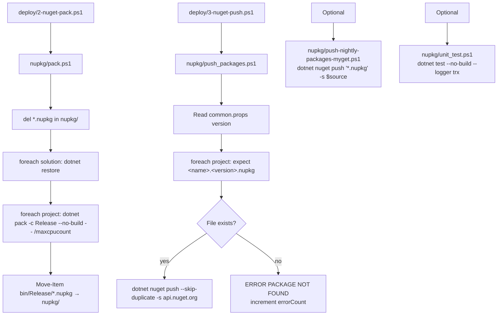

The ABP Framework ships hundreds of NuGet packages from this repository, all at the same `<Version>`. The five scripts under `nupkg/` are the bridge between a successful `dotnet build -c Release` and the `dotnet nuget push` that publishes each `.nupkg` to nuget.org. This page reads the project catalog in `nupkg/common.ps1`, the `pack.ps1` and `push_packages.ps1` workhorses, the alternate nightly destination, and the post-pack `unit_test.ps1`. The MSBuild side of how each package gets versioned is on [/build-deploy/directory-build-and-packages](/build-deploy/directory-build-and-packages); the `.slnx` solutions these packs come from are described in [/overview/solution-and-build](/overview/solution-and-build).

## What lives under `nupkg/`

| File                                  | Lines | Role                                                                  |
| ------------------------------------- | ----- | --------------------------------------------------------------------- |
| `nupkg/common.ps1`                    | ~500  | Defines `$packFolder`, `$rootFolder`, `Write-Info`, `Get-Current-Version`, and the `$solutions` + `$projects` arrays |
| `nupkg/common.ps1.bak`                | —     | Backup of an older version of `common.ps1`; not used                  |
| `nupkg/pack.ps1`                      | ~50   | `dotnet restore` per solution, then `dotnet pack -c Release` per project, then move `.nupkg`s up |
| `nupkg/push_packages.ps1`             | ~50   | `dotnet nuget push` each `.nupkg` to `api.nuget.org/v3/index.json`     |
| `nupkg/push-nightly-packages-myget.ps1` | ~15  | Generic push to any feed (used for MyGet nightlies / Verdaccio dry-runs) |
| `nupkg/unit_test.ps1`                 | ~10   | Re-run `dotnet test --no-build --logger trx` after pack                |
| `nupkg/0/`                            | dir   | Scratch folder; older releases left a marker file `0` to indicate "no packages packed yet" |

## The single source of truth — `nupkg/common.ps1`

`nupkg/common.ps1` opens by computing the absolute paths the rest of the scripts use:

```powershell
# Paths
$packFolder = (Get-Item -Path "./" -Verbose).FullName
$rootFolder = Join-Path $packFolder "../"
```

`$packFolder` is `nupkg/`; `$rootFolder` is the repo root. Every later `Join-Path $rootFolder $project` walks from `nupkg/..` into `framework/src/...` or `modules/.../src/...`.

The file then defines a handful of utilities that the `deploy/` scripts also dot-source:

```powershell
function Write-Info {
    param([Parameter(Mandatory=$true)][string]$text)
    Write-Host $text -ForegroundColor Black -BackgroundColor Green
    try   { $host.UI.RawUI.WindowTitle = $text } catch { }
}

function Get-Current-Version {
    $commonPropsFilePath = resolve-path "../common.props"
    $commonPropsXmlCurrent = [xml](Get-Content $commonPropsFilePath )
    $currentVersion = $commonPropsXmlCurrent.Project.PropertyGroup.Version.Trim()
    return $currentVersion
}

function Get-Current-Branch { return git branch --show-current }

function Read-File {
    param([Parameter(Mandatory=$true)][string]$filePath)
    $pathExists = Test-Path -Path $filePath -PathType Leaf
    if ($pathExists) { return Get-Content $filePath }
    else { Write-Error "$filePath path does not exist!" }
}
```

`Get-Current-Version` reads `common.props` as XML, so changing `<Version>10.2.0-rc.3</Version>` automatically retargets every later script (pack output names, push file matching, GitHub release tag).

### Two catalogs: `$solutions` and `$projects`

After the utility block, `common.ps1` declares two arrays. The first one is the same kind of list `build/common.ps1` carries, but flat (no dev-vs-full split) and used only for `dotnet restore` before packing and `dotnet test` after:

```powershell
$solutions = (
    "framework",
    "modules/account",
    "modules/audit-logging",
    "modules/background-jobs",
    "modules/basic-theme",
    "modules/blogging",
    "modules/client-simulation",
    "modules/docs",
    "modules/feature-management",
    "modules/identity",
    "modules/identityserver",
    "modules/openiddict",
    "modules/permission-management",
    "modules/setting-management",
    "modules/tenant-management",
    "modules/users",
    "modules/virtual-file-explorer",
    "modules/blob-storing-database",
    "modules/cms-kit"
)
```

The second array is the **shippable project list** — every csproj that will produce a `.nupkg`. It is ~385 entries long. A representative slice:

```powershell
$projects = (
    # framework
    "framework/src/Volo.Abp.AI.Abstractions",
    "framework/src/Volo.Abp.AI",
    "framework/src/Volo.Abp.AspNetCore",
    "framework/src/Volo.Abp.AspNetCore.Mvc",
    "framework/src/Volo.Abp.AspNetCore.Mvc.UI.Theme.Shared",
    "framework/src/Volo.Abp.Autofac",
    "framework/src/Volo.Abp.BlobStoring",
    "framework/src/Volo.Abp.BlobStoring.Aws",
    "framework/src/Volo.Abp.BlobStoring.Azure",
    "framework/src/Volo.Abp.Caching",
    "framework/src/Volo.Abp.Castle.Core",
    "framework/src/Volo.Abp.Cli",
    "framework/src/Volo.Abp.Core",
    "framework/src/Volo.Abp",
    "framework/src/Volo.Abp.EntityFrameworkCore",
    "framework/src/Volo.Abp.EventBus.RabbitMQ",
    "framework/src/Volo.Abp.Http.Client",
    "framework/src/Volo.Abp.IdentityModel",
    "framework/src/Volo.Abp.MongoDB",
    "framework/src/Volo.Abp.OpenIddict",
    # …

    # modules/account
    "modules/account/src/Volo.Abp.Account.Application.Contracts",
    "modules/account/src/Volo.Abp.Account.Application",
    "modules/account/src/Volo.Abp.Account.HttpApi.Client",
    "modules/account/src/Volo.Abp.Account.HttpApi",
    "modules/account/src/Volo.Abp.Account.Web",
    "modules/account/src/Volo.Abp.Account.Web.IdentityServer",
    "modules/account/src/Volo.Abp.Account.Web.OpenIddict",
    "modules/account/src/Volo.Abp.Account.Blazor",
    "modules/account/src/Volo.Abp.Account.Installer",
    "source-code/Volo.Abp.Account.SourceCode",
    # … 18 more module sections, then templates and tools
)
```

Three patterns to know:

1. **`framework/src/...`** — core packages. Every name starts with `Volo.Abp.` and matches both the folder and the `<PackageId>`.
2. **`modules/<area>/src/Volo.Abp.<Area>.<Layer>`** — DDD layers per module (`Domain.Shared`, `Domain`, `Application.Contracts`, `Application`, `HttpApi`, `HttpApi.Client`, `Web`, `Blazor`, `MongoDB`, `EntityFrameworkCore`, `Installer`).
3. **`source-code/Volo.Abp.<Area>.SourceCode`** — the "ABP source-code" packs, which are pre-compiled artefacts published so commercial users can extract a module's sources via `abp install-source-code`.

<Note>
  Order matters. `nupkg/pack.ps1` and `push_packages.ps1` iterate the list in
  order, so a project must appear **after** every project it depends on. This
  is why `Volo.Abp.Core` appears before `Volo.Abp.AspNetCore.Mvc` and module
  `Application.Contracts` always precedes `Application` in each block.
</Note>

## Packing — `nupkg/pack.ps1`

`pack.ps1` is short and explicit:

```powershell
. ".\common.ps1"
# Delete existing nupkg files
del *.nupkg

# Rebuild all solutions
foreach($solution in $solutions) {
    $solutionFolder = Join-Path $rootFolder $solution
    Set-Location $solutionFolder
    dotnet restore
}

# Create all packages
$i = 0
$projectsCount = $projects.length
Write-Info "Running dotnet pack on $projectsCount projects..."

foreach($project in $projects) {
    $i += 1
    $projectFolder = Join-Path $rootFolder $project
    $projectName = ($project -split '/')[-1]

    # Create nuget pack
    Write-Info "[$i / $projectsCount] - Packing project: $projectName"
    Set-Location $projectFolder

    #dotnet clean
   dotnet pack -c Release --no-build -- /maxcpucount

    if (-Not $?) {
        Write-Error "Packaging failed for the project: $projectName"
        exit $LASTEXITCODE
    }

    # Move nuget package
    $projectName = $project.Substring($project.LastIndexOf("/") + 1)
    $projectPackPath = Join-Path $projectFolder ("/bin/Release/" + $projectName + ".*.nupkg")
    Move-Item -Force $projectPackPath $packFolder

    Seperator
}
```

Step-by-step:

1. **`del *.nupkg`** — purge the `nupkg/` folder so a partial previous run doesn't pollute the push. This is one of the few destructive lines in the pipeline.
2. **`foreach($solution in $solutions) { dotnet restore }`** — restore once per solution, not once per project. Because Central Package Management is on (see [/build-deploy/directory-build-and-packages](/build-deploy/directory-build-and-packages)), restore is the slowest phase; per-solution amortizes the cost.
3. **`dotnet pack -c Release --no-build -- /maxcpucount`** per project — `--no-build` is critical: `deploy/1-fetch-and-build.ps1` already ran `build-all-release.ps1`, and re-building under `dotnet pack` would invalidate the Fody-rewritten Release assemblies. `/maxcpucount` is forwarded straight to MSBuild.
4. **`Move-Item -Force ... $packFolder`** — every produced `.nupkg` is moved into the central `nupkg/` folder so a single `*.nupkg` glob picks them all up in the next step.

`$projectName + ".*.nupkg"` matches both the regular package and the `.snupkg` symbol package if SourceLink emits one — although ABP embeds debug symbols via `<AllowedOutputExtensionsInPackageBuildOutputFolder>$(AllowedOutputExtensionsInPackageBuildOutputFolder);.pdb</AllowedOutputExtensionsInPackageBuildOutputFolder>` (see `common.props`) instead of producing a separate `.snupkg`.

### Version of each `.nupkg`

There is no explicit version flag on `dotnet pack`. The version comes from the `<Version>` MSBuild property — sourced from `common.props` via `<Import Project="..\..\..\common.props" />` in each csproj. So a release that bumps `common.props` to `10.2.0-rc.4` automatically produces `Volo.Abp.Core.10.2.0-rc.4.nupkg`, `Volo.Abp.AspNetCore.Mvc.10.2.0-rc.4.nupkg`, etc., with no PowerShell change required.

## Pushing — `nupkg/push_packages.ps1`

The push script is invoked by `deploy/3-nuget-push.ps1` with the API key as a positional arg. It re-reads `common.props` for the version and walks the same `$projects` list to construct the expected filename:

```powershell
. ".\common.ps1"

$apiKey = $args[0]

# Get the version
[xml]$commonPropsXml = Get-Content (Join-Path $rootFolder "common.props")
$version = $commonPropsXml.Project.PropertyGroup.Version

# Publish all packages
$i = 0
$errorCount = 0
$totalProjectsCount = $projects.length
$nugetUrl = "https://api.nuget.org/v3/index.json"
Set-Location $packFolder

foreach($project in $projects) {
    $i += 1
    $projectFolder = Join-Path $rootFolder $project
    $projectName = ($project -split '/')[-1]
    $nugetPackageName = $projectName + "." + $version + ".nupkg"
    $nugetPackageExists = Test-Path $nugetPackageName -PathType leaf

    Write-Info "[$i / $totalProjectsCount] - Pushing: $nugetPackageName"

    if ($nugetPackageExists) {
        dotnet nuget push $nugetPackageName --skip-duplicate -s $nugetUrl --api-key "$apiKey"
        #Write-Host ("Deleting package from local: " + $nugetPackageName)
        #Remove-Item $nugetPackageName -Force
    }
    else {
        Write-Host ("********** ERROR PACKAGE NOT FOUND: " + $nugetPackageName) -ForegroundColor red
        $errorCount += 1
    }

    Write-Host "--------------------------------------------------------------`r`n"
}

if ($errorCount > 0) {
    Write-Host ("******* $errorCount error(s) occured *******") -ForegroundColor red
}
```

Things to notice:

- **`--skip-duplicate`** — if a package at this version already exists on nuget.org, the push returns 409 but the script continues. This makes the push idempotent: a rerun after a network hiccup will not error out on the packs that already landed.
- **`-s https://api.nuget.org/v3/index.json`** — hard-coded; for a non-default feed you use `push-nightly-packages-myget.ps1` (below).
- **`Test-Path $nugetPackageName -PathType leaf`** — if `pack.ps1` failed silently for a project, the missing-file branch increments `$errorCount` so the summary still surfaces it.
- The `Remove-Item` line is commented out so a contributor can inspect the local `nupkg/` folder after a release.

The script does **not** call `exit $errorCount` — it returns 0 even if files were missing. This is intentional: `deploy/3-nuget-push.ps1` checks the printed summary rather than the exit code, so partial pushes still continue to step 4 (npm).

## Nightly / non-default destination — `nupkg/push-nightly-packages-myget.ps1`

For nightly builds, internal MyGet feeds, or the Verdaccio dry-run, the bare push script takes any source and any key:

```powershell
param(
  [string]$source,
  [string]$apikey
)

if (!$source)  { $source = "https://nuget.org/" }
if (!$apikey)  { $apikey = "dummy" }

dotnet nuget push '*.nupkg' -s $source --skip-duplicate --api-key $apikey
```

It is one line of real work — and the glob `'*.nupkg'` means it pushes whatever is in the current folder. Run from `nupkg/` after `pack.ps1`:

```powershell
cd nupkg
.\push-nightly-packages-myget.ps1 https://www.myget.org/F/abp-nightly/api/v3/index.json $myGetKey
```

## Post-pack verification — `nupkg/unit_test.ps1`

After pack, the release runs the same tests one more time without re-building:

```powershell
. ".\common.ps1"

# Unit test for all solutions
foreach($solution in $solutions) {
    $solutionFolder = Join-Path $rootFolder $solution
    Set-Location $solutionFolder
    dotnet test --no-build --logger trx
}
```

`--no-build` reuses the Release output already produced by `build-all-release.ps1` so the timing is dominated by xUnit discovery, not compilation. `--logger trx` writes a `TestResults/*.trx` file per solution which the Natro CI collects (see `deploy/8-download-release-zip.ps1`) and attaches to the GitHub release ZIP.

## Versioning rules in one place

| What                            | Where it comes from                                        | Result                                              |
| ------------------------------- | ---------------------------------------------------------- | --------------------------------------------------- |
| `.nupkg` semantic version       | `common.props` `<Version>`                                 | `Volo.Abp.Core.10.2.0-rc.3.nupkg`                   |
| Per-package version override    | `<Version>` after `<Import>` of `common.props` (rare)      | One-off out-of-band hotfix                           |
| Float wildcard (CPM)            | `<CentralPackageFloatingVersionsEnabled>true</…>` in `Directory.Packages.props` | Allowed but unused                                   |
| Lepton X version                | `<LeptonXVersion>` in `common.props`                       | Read by templates that pin LeptonX                  |
| Symbol embedding                | `AllowedOutputExtensionsInPackageBuildOutputFolder;.pdb`   | `.pdb` lives inside the `.nupkg`                    |
| Source link                     | `Microsoft.SourceLink.GitHub` via `common.props`           | Go-to-source from a debugger lands in this repo     |
| README                          | `PackageReadmeFile = NuGet.md`                             | The "About" tab on nuget.org is `NuGet.md`          |

## The pack + push diagram



## Operator checklist

<Steps>
  <Step title="Bump version">
    Edit `common.props` `<Version>`. Optionally let `deploy/1-fetch-and-build.ps1` prompt for it.
  </Step>
  <Step title="Run a release build">
    `cd build; .\build-all-release.ps1` (this triggers `configureawait.props` Fody weaving).
  </Step>
  <Step title="Pack">
    `cd ..\nupkg; .\pack.ps1`. Expect ~385 lines of `[i / 385] - Packing project: …`.
  </Step>
  <Step title="Verify outputs">
    `Get-ChildItem nupkg/*.nupkg | Measure-Object`. The count should equal the
    `$projects.length` reported by `pack.ps1`. Any shortfall surfaces as
    `ERROR PACKAGE NOT FOUND` in step 5.
  </Step>
  <Step title="Push">
    `.\push_packages.ps1 <nuget-api-key>` (or run `deploy/3-nuget-push.ps1`
    which reads `nuget-api-key.txt` automatically).
  </Step>
  <Step title="Re-test">
    `.\unit_test.ps1` to produce TRX files for the GitHub release zip.
  </Step>
</Steps>

## Common failure modes

| Symptom                                         | Likely cause                                                |
| ----------------------------------------------- | ----------------------------------------------------------- |
| `ERROR PACKAGE NOT FOUND: Volo.Abp.X.10.2.0-rc.3.nupkg` | `pack.ps1` failed silently for one project; check earlier log for the per-project banner |
| `409 Conflict` on push                          | Version already on nuget.org — `--skip-duplicate` swallows this |
| `Package XYZ has no <PackageId>`                | csproj missing `<PackageId>` (rare) — usually means the project was added to `$projects` without `<Import Project=common.props>` |
| Different `<Version>` in `.nupkg` filename      | A csproj declared `<Version>X.Y.Z</Version>` after `<Import>` and overrode the central version |
| `bin/Release/*.nupkg` missing                   | `--no-build` ran against a `Debug` build; rerun `build-all-release.ps1` |

## Cross-links

<CardGroup cols={2}>
  <Card title="Props & Packages" icon="folder-tree" href="/build-deploy/directory-build-and-packages">
    Central Package Management and `common.props` `<Version>`.
  </Card>
  <Card title="Build Scripts" icon="terminal" href="/build-deploy/build-scripts">
    `build/build-all-release.ps1` is the prerequisite for `pack.ps1`.
  </Card>
  <Card title="Deploy Scripts" icon="rocket" href="/build-deploy/deploy-scripts">
    `2-nuget-pack.ps1` and `3-nuget-push.ps1` wrap the scripts on this page.
  </Card>
  <Card title="CLI" icon="terminal" href="/cli/overview">
    `abp install-libs` and `abp install-source-code` consume these packs.
  </Card>
</CardGroup>
