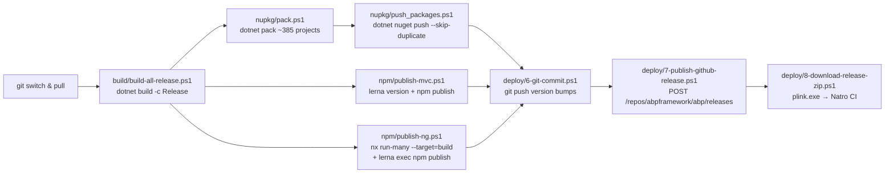

The ABP Framework monorepo ships hundreds of NuGet packages and dozens of `@abp/*` npm packages from a single release. This page is the map for the `build-deploy/` section: it stitches `Directory.Build.props`, `common.props`, the `build/`, `nupkg/`, `npm/`, `deploy/` and `tools/` folders into one end-to-end picture so the deeper pages can focus on a single moving part each. Before drilling in, contributors should read [/overview/solution-and-build](/overview/solution-and-build) for the `.slnx` topology and [/overview/tech-stack-and-dependencies](/overview/tech-stack-and-dependencies) for the dependency catalog those props control.

## Where everything lives

The release pipeline is intentionally spread across the repository root — there is no top-level `ci/` folder. Each concern owns its own directory, and `deploy/_run_all.ps1` is the only script that calls them in sequence.

| Folder / file                       | Purpose                                                      | Deep-dive page                                              |
| ----------------------------------- | ------------------------------------------------------------ | ----------------------------------------------------------- |
| `Directory.Build.props`             | Per-project test harness wiring (`coverlet.collector`)       | [/build-deploy/directory-build-and-packages](/build-deploy/directory-build-and-packages) |
| `Directory.Packages.props`          | Central Package Management — every `PackageVersion`          | [/build-deploy/directory-build-and-packages](/build-deploy/directory-build-and-packages) |
| `common.props`, `common.test.props` | Shared `<Version>`, NuGet metadata, test defaults            | [/build-deploy/directory-build-and-packages](/build-deploy/directory-build-and-packages) |
| `configureawait.props`              | `Fody` + `ConfigureAwait.Fody` opt-in in `Release`           | [/build-deploy/directory-build-and-packages](/build-deploy/directory-build-and-packages) |
| `NuGet.Config`, `global.json`       | Restore feed + SDK pin                                       | [/build-deploy/directory-build-and-packages](/build-deploy/directory-build-and-packages) |
| `build/*.ps1`                       | Loop `dotnet build` / `dotnet test` over every `.slnx`       | [/build-deploy/build-scripts](/build-deploy/build-scripts)  |
| `nupkg/`                            | `dotnet pack` + `dotnet nuget push` for ~385 projects        | [/build-deploy/nuget-packaging](/build-deploy/nuget-packaging) |
| `npm/`, `npm/ng-packs/`             | Lerna + Nx publish of MVC and Angular packs                  | [/build-deploy/npm-publishing](/build-deploy/npm-publishing) |
| `deploy/1..8-*.ps1`                 | Numbered release orchestration (fetch → push → release zip)  | [/build-deploy/deploy-scripts](/build-deploy/deploy-scripts) |
| `tools/`                            | `github-changelog-generator`, `localization-key-synchronizer`, `nuget.exe` | [/build-deploy/tools](/build-deploy/tools)                  |
| `ai-rules/`                         | Cursor-format `.mdc` rules shipped into solution templates   | [/build-deploy/ai-rules](/build-deploy/ai-rules)            |

## End-to-end pipeline

The orchestrator is `deploy/_run_all.ps1`, which calls the numbered scripts `1-fetch-and-build.ps1` through `8-download-release-zip.ps1`. Each numbered script is a thin wrapper that re-uses the building blocks in `build/`, `nupkg/`, and `npm/`.



Every arrow corresponds to a real script call inside `deploy/_run_all.ps1`:

```powershell
./1-fetch-and-build.ps1 $branch $newVersion
./2-nuget-pack.ps1
./3-nuget-push.ps1
./4-npm-publish-mvc.ps1
./5-npm-publish-angular.ps1
./6-git-commit.ps1
./7-publish-github-release.ps1 @publishGithubReleaseParams
./8-download-release-zip.ps1
```

## How the version flows

A release starts with a single edit to `common.props`. Every downstream script reads that file rather than taking the version as a parameter — `deploy/1-fetch-and-build.ps1` either rewrites or confirms `Project.PropertyGroup.Version`, then every later script calls `Get-Current-Version` (defined in `nupkg/common.ps1`) which re-parses the XML:

```powershell
function Get-Current-Version {
    $commonPropsFilePath = resolve-path "../common.props"
    $commonPropsXmlCurrent = [xml](Get-Content $commonPropsFilePath )
    $currentVersion = $commonPropsXmlCurrent.Project.PropertyGroup.Version.Trim()
    return $currentVersion
}
```

The same string also drives the Lerna roots. `npm/lerna.json` carries the MVC packs version, and `npm/ng-packs/lerna.version.json` carries the Angular packs version — both are bumped to match `common.props` before publish.

| File                              | Field             | Sample value      |
| --------------------------------- | ----------------- | ----------------- |
| `common.props`                    | `<Version>`       | `10.2.0-rc.3`     |
| `common.props`                    | `<LeptonXVersion>`| `5.2.0-rc.3`      |
| `npm/lerna.json`                  | `version`         | `10.2.0-rc.3`     |
| `npm/ng-packs/lerna.version.json` | `version`         | `7.2.3`           |
| `npm/package.json`                | `version`         | `2.3.0`           |
| `latest-versions.json`            | `[0].version`     | `10.1.0` (last stable) |

<Note>
  `npm/ng-packs/lerna.version.json` keeps its own SemVer track because the
  Angular packs were extracted later and have an independent breaking-change
  cadence. `npm/ng-packs/lerna.publish.json` (`dist/packages/*`) is the file Lerna actually
  uses at publish time — it is renamed in and out of place by
  `npm/ng-packs/scripts/publish.ts`.
</Note>

## Three artifact buckets

A successful release writes into three independent artifact stores. Each has its own credential file checked into `.gitignore` (see `deploy/readme.md`).

| Artifact bucket          | Producer                       | Pusher                         | Credential file              |
| ------------------------ | ------------------------------ | ------------------------------ | ---------------------------- |
| `.nupkg` on nuget.org    | `nupkg/pack.ps1`               | `nupkg/push_packages.ps1`      | `deploy/nuget-api-key.txt`   |
| `@abp/*` on npmjs.org    | `npm/publish-mvc.ps1`, `publish-ng.ps1` | `lerna publish` / `npm publish` | `deploy/npm-auth-token.txt`  |
| GitHub Release + zip CDN | `deploy/7-publish-github-release.ps1` | `Invoke-RestMethod` to `api.github.com` | `deploy/github-api-key.txt`  |
| Mirror zip on Natro      | `deploy/8-download-release-zip.ps1` | `plink.exe -ssh jenkins@94.73.164.234` | `deploy/ssh-password.txt`    |

## Where each page goes deeper

<CardGroup cols={2}>
  <Card title="Directory.Build + Central Package Management" icon="folder-tree" href="/build-deploy/directory-build-and-packages">
    `Directory.Build.props`, `Directory.Packages.props`, `common.props`,
    `common.test.props`, `configureawait.props`, `NuGet.Config`, `global.json`.
  </Card>
  <Card title="PowerShell Build Scripts" icon="terminal" href="/build-deploy/build-scripts">
    `build/common.ps1` solution list, `build-all.ps1`, `build-all-release.ps1`,
    `test-all.ps1` and the dev-vs-full `-f` switch.
  </Card>
  <Card title="NuGet Packaging" icon="cube" href="/build-deploy/nuget-packaging">
    `nupkg/common.ps1` project catalog, `pack.ps1`, `push_packages.ps1`,
    `push-nightly-packages-myget.ps1`, `unit_test.ps1`.
  </Card>
  <Card title="npm Publishing" icon="square-js" href="/build-deploy/npm-publishing">
    Lerna + Nx, MVC vs Angular packs, `validate-versions`,
    `replace-with-tilde`, Verdaccio dry-run environment.
  </Card>
  <Card title="Deploy Scripts" icon="rocket" href="/build-deploy/deploy-scripts">
    The numbered `1..8` orchestration, `_run_all.ps1`, GitHub Release REST call,
    and the SSH-driven Natro download.
  </Card>
  <Card title="Tools & Utilities" icon="screwdriver-wrench" href="/build-deploy/tools">
    `github-changelog-generator`, `localization-key-synchronizer`,
    `tools/nuget/nuget.exe`, `delete-bin-obj.ps1`, `smtp-prober-email-sender.exe`.
  </Card>
  <Card title="AI Rules (Cursor `.mdc`)" icon="robot" href="/build-deploy/ai-rules">
    Every file under `ai-rules/` — `common/`, `ui/`, `data/`, `testing/`,
    `template-specific/` — and which agent consumes which rule.
  </Card>
  <Card title="Solution & Build (root)" icon="diagram-project" href="/overview/solution-and-build">
    The `.slnx`/`.abpsln`/`.abpmdl` solution model these scripts iterate over.
  </Card>
</CardGroup>

## Build modes — development vs full release

`build/common.ps1` (sourced by both `build-all.ps1` and `test-all.ps1`) flips between a "fast" developer build and a full release build using a single `-f` flag. In the default mode it builds the 15 most-touched solutions; with `-f` it adds templates, docs, blogging, source-code projects and (on Windows only) the WPF template.

```powershell
$solutionPaths = @(
    "../framework",
    "../modules/basic-theme",
    "../modules/users",
    # … 12 more module solutions
)
if ($full -eq "-f") {
    $solutionPaths += (
        "../modules/client-simulation",
        "../modules/docs",
        "../templates/module/aspnet-core",
        "../templates/app/aspnet-core",
        "../templates/console",
        "../abp_io/AbpIoLocalization",
        "../source-code"
    )
    if ($env:OS -eq "Windows_NT") {
        $solutionPaths += "../templates/wpf"
    }
}
```

This is why `deploy/1-fetch-and-build.ps1` always shells into `.\build-all-release.ps1` (which calls `common.ps1 -f` internally) — only the full set passes through `nupkg/pack.ps1` to nuget.org.

## Build verification matrix

| Script                              | Mode                       | Time-to-fail | Used by                       |
| ----------------------------------- | -------------------------- | ------------ | ----------------------------- |
| `build/build-all.ps1`               | `dotnet build` (Debug)     | per-solution | local dev                     |
| `build/build-all.ps1 -f`            | `dotnet build` (Debug, full) | per-solution | PR validation                 |
| `build/build-all-release.ps1`       | `dotnet build -c Release`  | per-solution | `deploy/1-fetch-and-build.ps1` |
| `build/test-all.ps1`                | `dotnet test --no-build`   | per-solution | nightly                       |
| `nupkg/unit_test.ps1`               | `dotnet test --logger trx` | per-solution | release verification          |
| `delete-bin-obj.ps1`                | clean-slate                | n/a          | troubleshooting               |

## Verifying a release locally

Before pushing, the same numbered scripts can be aimed at a Verdaccio container (`npm/verdaccio-containers/`) and a fake NuGet feed. `nupkg/push-nightly-packages-myget.ps1` accepts an arbitrary `-source`/`-apikey` pair:

```powershell
param(
  [string]$source,
  [string]$apikey
)
if (!$source) { $source = "https://nuget.org/" }
if (!$apikey) { $apikey = "dummy" }
dotnet nuget push '*.nupkg' -s $source --skip-duplicate --api-key $apikey
```

…and the Verdaccio compose under `npm/verdaccio-containers/docker-compose.yml` provides a local `verdaccio:4873` registry plus a "serve-app" container that consumes the freshly published `@abp/*` packs. See [/build-deploy/npm-publishing#verdaccio-dry-run](/build-deploy/npm-publishing) for the full dance.

## Related reading

<Note>
  After the artifacts are live, the consumer-side counterparts are the
  [/cli/overview](/cli/overview) (which calls `dotnet add package` and
  `dotnet new abp` under the hood) and [/angular/overview](/angular/overview)
  (which consumes the same `@abp/ng.*` packs that `publish-ng.ps1` ships).
</Note>
