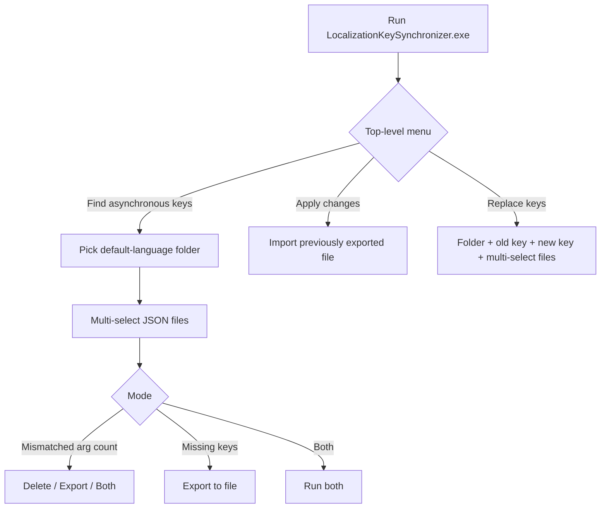
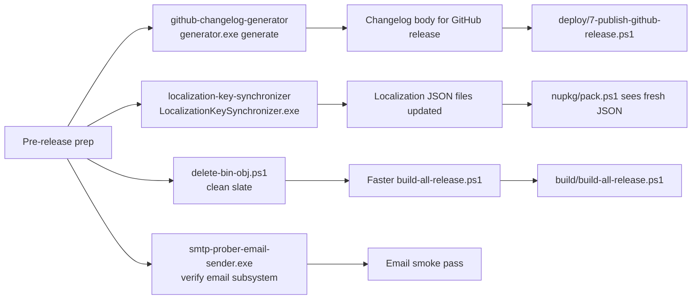

The ABP Framework repository ships a small toolbox of one-off utilities that don't fit neatly into `build/`, `nupkg/` or `deploy/`. Most are pre-compiled executables checked in next to their source so a release engineer can run them on a fresh box without recompiling. This page walks every entry under `tools/`, plus the two root-level helpers `delete-bin-obj.ps1` and `smtp-prober-email-sender.exe`. For the high-level pipeline these tools support, see [/build-deploy/overview](/build-deploy/overview).

## Toolbox summary

| Path                                                    | Kind                  | Owner      | When used                                          |
| ------------------------------------------------------- | --------------------- | ---------- | -------------------------------------------------- |
| `tools/github-changelog-generator/generator.exe`        | Go CLI                | Release    | Before a release — produces `changelog.md`         |
| `tools/github-changelog-generator/config.yaml`          | YAML                  | Release    | Defaults for repo, milestone, group labels         |
| `tools/github-changelog-generator/src/`                 | Go source             | Maintainer | `GithubChangelogGenerator` Go module               |
| `tools/localization-key-synchronizer/LocalizationKeySynchronizer.exe` | .NET console | i18n team | Before each release — finds missing/orphan localization keys |
| `tools/localization-key-synchronizer/LocalizationKeySynchronizer.slnx` | Solution    | Maintainer | Visual Studio entry point                          |
| `tools/localization-key-synchronizer/src/`              | C# source             | Maintainer | Spectre.Console-driven menu                        |
| `tools/nuget/nuget.exe`                                 | NuGet client          | Build      | Used by older bench scripts; modern flow uses `dotnet nuget` |
| `delete-bin-obj.ps1` (repo root)                        | PowerShell            | Anyone     | Wipe `bin/` and `obj/` everywhere                  |
| `tools/smtp-prober-email-sender.exe`                    | .NET console          | Anyone     | Smoke-test email module without spinning a real SMTP server |

## github-changelog-generator

`tools/github-changelog-generator/` is a single-binary Go utility plus its config. It is invoked once per release to produce the markdown changelog that the operator pastes into the GitHub release notes.

### `README.md` — invocation

```text
.\generator.exe generate [flags] > changelog.md
```

The flags accepted (from the README):

| Flag             | Purpose                                                |
| ---------------- | ------------------------------------------------------ |
| `-h, --help`     | Help                                                   |
| `-m, --milestone`| Milestone title to group issues and pull requests       |
| `-r, --repo`     | Repository (e.g. `abpframework/abp`)                   |
| `--since-tag`    | Issues and PRs since this tag                          |
| `-s, --state`    | `open`, `closed` or `all`                              |
| `-t, --token`    | Personal access token                                  |
| `--until-tag`    | Issues and PRs until this tag                          |

Example release-time call:

```text
.\generator.exe generate -r abpframework/abp -m "0.19" > changelog.md
```

### `config.yaml` — defaults

`config.yaml` ships pre-populated with the ABP defaults so most flags can be omitted:

```yaml
repo: abpframework/abp
# token:
milestone: 0.18.1
# since-tag: 0.18.0
# until-tag: 0.17.0
state: closed
groups:
  - labels:
      - breaking change
    title: "Breaking Changes"

  - labels:
      - feature
    title: "Features"

  - labels:
      - enhancement
    title: "Enhancements"

  - labels:
      - bug
    title: "Bug Fixes"

  - labels:
    title: "Others"

#template: |-
#  {{if .Milestone}}## {{.Milestone.GetTitle}} ({{.Milestone.GetClosedAt.Format "2006-01-02"}}){{end -}}
#  {{if .IssuesByMilestone}}
#  {{range .IssuesByMilestone}}
#  ### {{.Title}}
#  {{range .Issues}}
#  {{if .IsPullRequest -}}
#  - PR [\#{{.GetNumber}}]({{.GetHTMLURL}}): {{.GetTitle}} (by [{{.GetUser.GetLogin}}]({{.GetUser.GetHTMLURL}}))
#  {{- else -}}
#  - ISSUE [\#{{.GetNumber}}]({{.GetHTMLURL}}): {{.GetTitle}}
#  {{- end -}}
#  {{end}}
#  {{end}}
#  {{end -}}
```

The four label groups (`breaking change`, `feature`, `enhancement`, `bug`, plus `Others`) match the GitHub labels the ABP team applies during triage. Anything without a matching label falls into the `Others` bucket. The commented `template:` block lets a release operator override the markdown layout without recompiling the Go binary.

### `src/` — Go module

`tools/github-changelog-generator/src/GithubChangelogGenerator/` is the Go module the binary is built from. The folder is mostly the standard Cobra + go-github layout. Building it locally is the only way to extend the grouping or template logic. Because the binary is committed, day-to-day use does not require a Go toolchain.

### Where the output goes

| Hand-off                                            | Step                                            |
| --------------------------------------------------- | ----------------------------------------------- |
| `changelog.md` for a release                        | Pasted as the body when editing the GitHub release created by `deploy/7-publish-github-release.ps1` |
| Blog post                                           | Same content, lightly edited for prose          |
| `docs/release-info/` pages                          | Quarterly aggregation of all changelogs         |

## localization-key-synchronizer

`tools/localization-key-synchronizer/` is a Spectre.Console-styled .NET console app that compares localization JSON files across the repo and ABP-based projects, finds mismatches, and offers to fix them. It is the i18n team's release-prep checklist tool.

### Three menu actions — `tools/localization-key-synchronizer/README.md`

The README documents three top-level actions presented on the Spectre menu:

1. **Find asynchronous keys** — keys that exist in one locale but not another, or whose `{0} {1}` placeholder count differs across locales. Produces an export file or deletes the offending keys inline.
2. **Apply changes in the exported file** — re-imports a previously exported file (after manual review in a text editor).
3. **Replace keys** — bulk rename a key across all JSON files in a folder.

### `src/` layout

| File                                    | Role                                                            |
| --------------------------------------- | --------------------------------------------------------------- |
| `Program.cs`                            | Spectre.Console entry point and menu loop                       |
| `Questions.cs`                          | Prompts (`AskAsync`, `SelectAsync`)                             |
| `AbpAsyncLocalization.cs`               | Walks a folder, returns `AbpAsyncLocalizationViewModel`         |
| `AbpAsyncLocalizationViewModel.cs`      | Per-file aggregate of keys and placeholders                     |
| `AbpAsyncKey.cs`                        | Single key tuple (`Key`, `Value`, `ArgumentCount`)              |
| `AbpLocalization.cs`                    | Top-level locale model                                          |
| `AbpLocalizationInfo.cs`                | Filename + culture metadata                                     |
| `ArgumentCountMismatch.cs`              | Result type when placeholder counts disagree                    |
| `MissingKey.cs`                         | Result type when a key is missing in one locale                 |
| `JsonHelper.cs`                         | `System.Text.Json` read/write helpers                           |
| `LocalizationHelper.cs`                 | Folder walk + JSON deserialization                              |
| `LocalizationKeySynchronizer.csproj`    | The csproj                                                      |

The README has a screenshot-driven walk-through; here is the boiled-down decision flow:



The tool is used right before `deploy/2-nuget-pack.ps1` so any missing translations get added before the localization JSON ships in the `Volo.Abp.Localization` package's embedded resources.

## tools/nuget/nuget.exe

`tools/nuget/nuget.exe` is a copy of the legacy `nuget.exe` CLI. The modern release pipeline does *not* use it — `nupkg/push_packages.ps1` calls `dotnet nuget push` instead. The binary is retained for two reasons:

1. Older internal scripts and Jenkins steps that haven't been migrated still invoke `nuget.exe restore` / `nuget.exe push`.
2. Some Volo Studio templates emit `nuget.config` snippets that assume `nuget.exe` is reachable on `PATH`.

It is fully self-contained — no `.dll`s next to it because `nuget.exe` is a single-file ILMerge'd executable.

## delete-bin-obj.ps1

`delete-bin-obj.ps1` lives at the repo root, not under `tools/`. It is a recursive wipe of every `bin/` and `obj/` folder, except those under `node_modules/`:

```powershell
Clear-Host
Write-Host "Deleting all BIN and OBJ folders..." -ForegroundColor Cyan
Get-ChildItem -Path . -Include bin,obj -Recurse -Directory | ForEach-Object {
    if ($_.FullName -notmatch "\\node_modules\\") {
        Write-Host "Deleting:" $_.FullName -ForegroundColor Yellow
        Remove-Item $_.FullName -Recurse -Force
    } else {
        Write-Host "Skipping:" $_.FullName -ForegroundColor Magenta
    }
}

Write-Host "BIN and OBJ folders have been successfully deleted." -ForegroundColor Green
```

The `\\node_modules\\` guard exists because several npm packages cache build artefacts in `bin/` and `obj/` paths nested inside `node_modules/` — wiping them would force a full `yarn install` (`npm/ng-packs/node_modules/` alone is ~2 GiB).

| Behavior                                            | Result                                                      |
| --------------------------------------------------- | ----------------------------------------------------------- |
| Walks from `.` downward (so run it at repo root)    | Skips nothing under `framework/`, `modules/`, `templates/`  |
| `\\node_modules\\` regex check                      | Skips every `bin/`/`obj/` inside any `node_modules`         |
| `Remove-Item -Recurse -Force`                       | No prompt; takes locked files down with a warning           |

Typical use is before a release rebuild, when contributors want to be certain `dotnet build` is not reusing a stale `obj/project.assets.json` from a since-deleted package reference.

## tools/smtp-prober-email-sender.exe

`tools/smtp-prober-email-sender.exe` is a small standalone .NET console that ABP keeps under `tools/` to verify the `Volo.Abp.MailKit` integration without spinning a real SMTP server. The maintainers built it as a smoke probe — point it at an `appsettings.json` containing SMTP host/port/credentials and it sends one test message:

| Use case                                              | Why                                                          |
| ----------------------------------------------------- | ------------------------------------------------------------ |
| Verify outbound email from a dev box                  | Catch firewall issues without running the full app           |
| Test a new SMTP integration                           | Faster than booting an HostWithIds + Identity migrations      |
| Reproduce a bug in `IEmailSender`                     | The console pulls the same `Volo.Abp.Emailing` configuration  |

The binary is a single-file publish; the source is not in this repository (it lives in the maintainers' email-sender repo). If a contributor needs to extend it they can write a one-off ABP module and reference `Volo.Abp.MailKit` directly.

## A combined picture



None of these are in the critical path of `deploy/_run_all.ps1` — they are operator helpers that fire **before** the orchestrator. That separation lets the numbered scripts stay minimal and credential-driven.

## When to run each tool

<Steps>
  <Step title="Two days before a release">
    Run `LocalizationKeySynchronizer.exe`. Fix flagged keys, commit, push.
    Re-run to confirm zero mismatches.
  </Step>
  <Step title="One day before">
    Run `generator.exe generate -m <milestone>` against the closing milestone.
    Hand-edit `changelog.md` for grammar and section ordering.
  </Step>
  <Step title="On the release box, before _run_all.ps1">
    Optionally `cd ~/abp; .\delete-bin-obj.ps1` to be sure no stale `obj/` lingers
    from a previous branch.
  </Step>
  <Step title="After the release">
    Paste `changelog.md` into the GitHub release body. The release was created
    in `7-publish-github-release.ps1` with an empty body intentionally.
  </Step>
  <Step title="Anytime SMTP changes">
    `smtp-prober-email-sender.exe` against the new staging credentials before
    cutting an Identity module hotfix.
  </Step>
</Steps>

## Why pre-built binaries instead of source-built helpers?

| Reason                                                | Concretely                                                       |
| ----------------------------------------------------- | ---------------------------------------------------------------- |
| Release ops machines don't have Go installed          | `generator.exe` runs as a single file                            |
| Operator may not have the same .NET version           | `LocalizationKeySynchronizer.exe` is self-contained               |
| Audit trail                                           | Binary in git matches the source in `src/`                       |
| Some helpers are deliberately closed-source           | `smtp-prober-email-sender.exe` is published but not source-checked-in |

<Note>
  `tools/github-changelog-generator/src/GithubChangelogGenerator/` and
  `tools/localization-key-synchronizer/src/` are the only two `src/` folders
  inside `tools/` — the other entries are bare `.exe`s. If you need to extend
  one of those, rebuild from the `src/` directory and replace the binary in
  the same commit.
</Note>

## Cross-links

<CardGroup cols={2}>
  <Card title="Deploy Scripts" icon="rocket" href="/build-deploy/deploy-scripts">
    `7-publish-github-release.ps1` consumes the changelog the generator produced.
  </Card>
  <Card title="Build Scripts" icon="terminal" href="/build-deploy/build-scripts">
    `delete-bin-obj.ps1` clears state for `build-all-release.ps1`.
  </Card>
  <Card title="NuGet Packaging" icon="cube" href="/build-deploy/nuget-packaging">
    Localization JSON updates ship via `Volo.Abp.Localization` packs.
  </Card>
  <Card title="CLI" icon="terminal" href="/cli/overview">
    Where `Volo.Abp.Cli` (built and packed via this pipeline) is documented.
  </Card>
</CardGroup>
