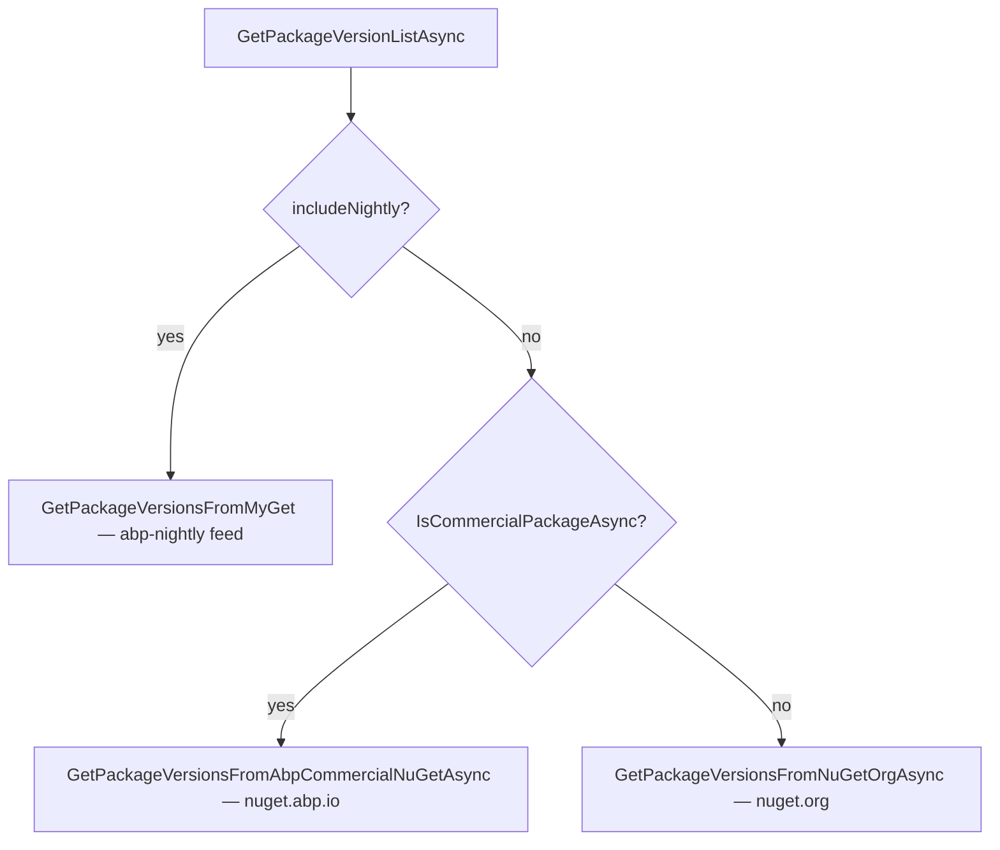
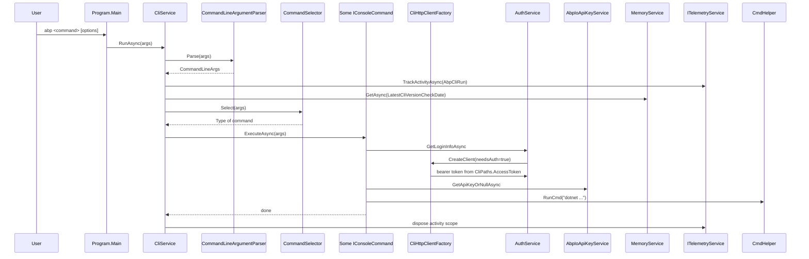

The ABP Framework CLI keeps its command implementations small by leaning on a layer of cross-cutting services that every command uses. Those services live under `framework/src/Volo.Abp.Cli.Core/Volo/Abp/Cli/` in single-responsibility folders: `Args/` for argument parsing, `Configuration/` for `appsettings.json` ingestion, `Http/` for the shared `HttpClient`, `Memory/` for a key-value cache, `Utils/` for OS-touching helpers, `Version/` for NuGet probes, `Build/` for the `dotnet build` orchestrator, `Auth/` for OIDC login state, `Licensing/` for the developer-API-key, and `Telemetry/` for the null-pattern stand-in. This page walks every one of those folders so a contributor can find the right type without grepping.

## Argument parsing — `Args/`

`Args/CommandLineArgs.cs` is the immutable record passed into every `IConsoleCommand.ExecuteAsync`. It holds three pieces:

```csharp
public class CommandLineArgs
{
    [CanBeNull] public string Command { get; }
    [CanBeNull] public string Target { get; }
    [NotNull] public AbpCommandLineOptions Options { get; }
    // ...
    public bool IsCommand(string command)
    {
        return string.Equals(Command, command, StringComparison.OrdinalIgnoreCase);
    }
}
```

`Args/AbpCommandLineOptions.cs` is just a `Dictionary<string,string>` with a single helper that takes alternative names — that is how short (`-c`) and long (`--culture`) forms resolve to the same value:

```csharp
public class AbpCommandLineOptions : Dictionary<string, string>
{
    [CanBeNull]
    public string GetOrNull([NotNull] string name, params string[] alternativeNames)
    {
        Check.NotNullOrWhiteSpace(name, nameof(name));

        var value = this.GetOrDefault(name);
        if (!value.IsNullOrWhiteSpace())
        {
            return value;
        }
        // try alternatives ...
        return null;
    }
}
```

`Args/CommandLineArgumentParser.cs` is the implementation of `ICommandLineArgumentParser`. The shape it produces is `[command] [target] [-o val | --opt val]*`. The parser walks the tokens once, treating the first token as `Command`, the second non-dash token (if any) as `Target`, and every remaining token as either an option name (when prefixed with `-`/`--`) or an option value. The option-name extraction is symmetric:

```csharp
private static string ParseOptionName(string argument)
{
    if (argument.StartsWith("--"))
    {
        if (argument.Length <= 2)
        {
            throw new ArgumentException("Should specify an option name after '--' prefix!");
        }

        return argument.RemovePreFix("--");
    }

    if (argument.StartsWith("-"))
    {
        if (argument.Length <= 1)
        {
            throw new ArgumentException("Should specify an option name after '-' prefix!");
        }

        return argument.RemovePreFix("-");
    }

    throw new ArgumentException("Option names should start with '-' or '--'.");
}
```

There is also a `Parse(string lineText)` overload that handles double-quoted segments. The `GetArgsArrayFromLine` helper toggles an `isInQuotes` flag whenever it sees a `"`, so `abp new "Acme.Books With Spaces"` is one token, not three. That is the parser that the REPL (`abp prompt`) and the batch runner (`abp batch`) rely on.

`Args/CommandLineArgsExtensions.cs` contributes the convenience `IsMcpCommand(this CommandLineArgs)` predicate used by `CliService.RunAsync` to skip the banner when stdout is the JSON-RPC stream.

## Configuration ingestion — `Configuration/`

`Configuration/ConfigReader.cs` reads the `AbpCli` section of `appsettings.json` from any directory. It uses `System.Text.Json` with `CommentHandling = JsonCommentHandling.Skip` so commented JSON survives the trip, and it falls back to a default `AbpCliConfig` when the section is missing:

```csharp
using (var document = JsonDocument.Parse(settingsFileContent, documentOptions))
{
    if (document.RootElement.TryGetProperty("AbpCli", out var element))
    {
        var configJson = element.GetRawText();
        var options = new JsonSerializerOptions
        {
            Converters = { new JsonStringEnumConverter() },
            ReadCommentHandling = JsonCommentHandling.Skip
        };

        return JsonSerializer.Deserialize<AbpCliConfig>(configJson, options);
    }
    else
    {
        return new AbpCliConfig();
    }
}
```

The model `Configuration/AbpCliConfig.cs` carries just one property — the bundle configuration:

```csharp
public class AbpCliConfig
{
    public BundleConfig Bundle { get; set; } = new();
}
```

That is the same `BundleConfig` consumed by [`/ui-mvc/bundling`](/ui-mvc/bundling). The reason the reader is general (rather than `IBundleConfigReader`) is so other features could be added later without breaking the API.

## HTTP — `Http/`

`Http/CliHttpClientFactory.cs` is the only place in the CLI that constructs `HttpClient` instances. It wraps Microsoft's `IHttpClientFactory` to ensure connection pooling works correctly, but layers ABP-specific behaviour on top:

```csharp
public class CliHttpClientFactory : ISingletonDependency
{
    public static readonly TimeSpan DefaultTimeout = TimeSpan.FromMinutes(2);

    public HttpClient CreateClient(bool needsAuthentication = true, TimeSpan? timeout = null, string clientName = null)
    {
        var httpClient = _clientFactory.CreateClient(clientName ?? CliConsts.HttpClientName);
        httpClient.Timeout = timeout ?? DefaultTimeout;

        if (needsAuthentication)
        {
            httpClient.AddAbpAuthenticationToken();
        }

        return httpClient;
    }
```

The named client `CliConsts.HttpClientName = "AbpHttpClient"` and the sibling `GithubHttpClientName = "GithubHttpClient"` are the two registrations the module wires up in `AbpCliCoreModule.ConfigureServices`. The Github-named client uses `Http/CliHttpClientHandler.cs`, which is intentionally tiny:

```csharp
public class CliHttpClientHandler : HttpClientHandler
{
    public CliHttpClientHandler()
    {
        Proxy = WebRequest.GetSystemWebProxy();
        DefaultProxyCredentials = CredentialCache.DefaultCredentials;
    }
}
```

That handler exists for one reason: corporate developers behind authenticated proxies. Without those two lines, `raw.githubusercontent.com` requests blow up with 407 errors on Windows domains.

`GetCancellationToken(TimeSpan? timeout)` is the second helper. When no timeout is supplied it returns the framework's `ICancellationTokenProvider.Token`; otherwise it spins a per-call `CancellationTokenSource`. Every call in `AbpIoSourceCodeStore` (see [`/cli/github-integration`](/cli/github-integration)) passes `TimeSpan.FromMinutes(10)` to that helper for the long template downloads.

`Http/CliHttpClientExtensions.cs` adds `AddAbpAuthenticationToken` and the Polly-backed `GetHttpResponseMessageWithRetryAsync<T>` extension. The bearer source is the access token saved by the login command:

```csharp
public static void AddAbpAuthenticationToken(this HttpClient httpClient)
{
    if (!AuthService.IsLoggedIn())
    {
        return;
    }

    var accessToken = File.ReadAllText(CliPaths.AccessToken, Encoding.UTF8);
    if (!accessToken.IsNullOrEmpty())
    {
        httpClient.SetBearerToken(accessToken);
    }
}
```

The retry helper applies a `HandleTransientHttpError` policy with sleep durations `[2s, 4s, 7s]` by default, which is the same backoff `AuthService` and `AbpIoApiKeyService` rely on for `account.abp.io/api/license/*` endpoints.

## Memory — `Memory/`

`Memory/MemoryService.cs` is the CLI's flat-file key-value store. It lives next to the executing assembly:

```csharp
public static string Memory => Path.Combine(
    Path.GetDirectoryName(System.Reflection.Assembly.GetExecutingAssembly().Location)!,
    "memory.bin");
```

That deliberately puts the file beside the dotnet-tool DLL — wiping `~/.abp/` does not affect it — which makes the cache survive across re-logins. The format is a plain text file with one line per key:

```
LatestCliVersionCheckDate ||| 2024-12-09T13:55:22
McpToolsLastFetchDate ||| 2024-12-10T08:01:11
```

The implementation is dictionary-like but file-backed:

```csharp
public async Task SetAsync(string key, string value)
{
    if (!File.Exists(CliPaths.Memory))
    {
        File.WriteAllText(CliPaths.Memory, $"{key} {KeyValueSeparator} {value}");
        return;
    }

    var memoryContentLines = (await FileHelper.ReadAllTextAsync(CliPaths.Memory))
        .Split(new[] { Environment.NewLine, "\n" }, StringSplitOptions.None)
        .ToList();

    memoryContentLines.RemoveAll(x => x.StartsWith(key));
    memoryContentLines.Add($"{key} {KeyValueSeparator} {value}");

    File.WriteAllText(CliPaths.Memory, memoryContentLines.JoinAsString(Environment.NewLine));
}
```

The two known keys are constants:

| Key | Constant | Used by |
| --- | --- | --- |
| `LatestCliVersionCheckDate` | `CliConsts.MemoryKeys.LatestCliVersionCheckDate` | `CliService.CheckCliVersionAsync` rate-limiting |
| `McpToolsLastFetchDate` | `CliConsts.MemoryKeys.McpToolsLastFetchDate` | `McpToolsCacheService.IsCacheValidAsync` |

## Utils — `Utils/`

The `Utils/` folder is a grab-bag of OS- and process-touching helpers. The table below summarises each file before drilling into the interesting ones.

| File | Public API | Purpose |
| --- | --- | --- |
| `CmdHelper.cs` | `ICmdHelper` implementation | Run external processes, capture stdout |
| `ICmdHelper.cs` | Interface | Contract for shelling out |
| `NpmHelper.cs` | `RunYarn`, `YarnAddPackage`, `IsNpmInstalled` | NPM/Yarn wrappers via `npx` |
| `PathHelper.cs` | `NormalizePath` | Resolve relative paths against the cwd |
| `PlatformHelper.cs` | `GetPlatform`, `GetOperatingSystem` | Two-bucket OS detection |
| `ProjectNameValidator.cs` | `Validate(string)` | Block illegal solution names |
| `StreamHelper.cs` | `GenerateStreamFromString` | Misc utility used by minifier |
| `NamespaceHelper.cs` | `NormalizeNamespace` | Sanitise C# namespace strings |
| `GlobalToolHelper.cs` | `IsGlobalToolInstalled(name)` | Check `~/.dotnet/tools` presence |
| `ExceptionMessageHelper.cs` | `GetInvalidOptionExceptionMessage` | Compose option errors |
| `ConsoleHelper.cs` | `ReadSecret()` | Mask password input |

### `CmdHelper`

`Utils/CmdHelper.cs` is the one type every command shells through. It implements `ICmdHelper` and is `[ITransientDependency]`. There are six overloads of `RunCmd*` but they all funnel into a `ProcessStartInfo` over either `cmd /c` (Windows) or `/bin/bash -c` (Linux/macOS). The OS choice comes from `GetFileName`/`GetArguments`. There is also an `Open(pathOrUrl)` that launches the system browser/file-explorer using `xdg-open`, `open`, or `cmd /c start` depending on platform:

```csharp
public void Open(string pathOrUrl)
{
    pathOrUrl = pathOrUrl.EnsureStartsWith('"');
    pathOrUrl = pathOrUrl.EnsureEndsWith('"');

    if (RuntimeInformation.IsOSPlatform(OSPlatform.Windows))
    {
        pathOrUrl = pathOrUrl.Replace("&", "^&");
        Process.Start(new ProcessStartInfo("cmd", $"/c start \"\" {pathOrUrl}") { CreateNoWindow = true });
    }
    else if (RuntimeInformation.IsOSPlatform(OSPlatform.Linux))
    {
        Process.Start("xdg-open", pathOrUrl);
    }
    else if (RuntimeInformation.IsOSPlatform(OSPlatform.OSX))
    {
        Process.Start("open", pathOrUrl);
    }
}
```

The class respects `AbpCliOptions.AlwaysHideExternalCommandOutput`. When `true`, every spawned process is launched with `CreateNoWindow` and redirected streams so CI logs are not flooded.

### `NpmHelper`

Already discussed in [`/cli/install-libs`](/cli/install-libs); the key insight is that every NPM-related call routes through `npx yarn`, never `yarn` directly. The helper also exposes `IsYarnAvailable` for the bundling command to check whether the user has a sufficiently new global Yarn (≥ 1.20):

```csharp
return version > SemanticVersion.Parse("1.20.0");
```

### `PlatformHelper`

The OS is collapsed into a binary enum because most CLI logic only cares about "Windows" vs "everything else":

```csharp
public enum RuntimePlatform
{
    Windows = 1,
    LinuxOrMacOs = 2
}
```

`GlobalToolHelper.IsGlobalToolInstalled` uses that distinction to construct the correct probe path:

```csharp
if (PlatformHelper.GetPlatform() == RuntimePlatform.LinuxOrMacOs)
{
    suitePath = Environment.ExpandEnvironmentVariables(
        Path.Combine("%HOME%", ".dotnet", "tools", toolCommandName));
}
else
{
    suitePath = Environment.ExpandEnvironmentVariables(
        Path.Combine(@"%USERPROFILE%", ".dotnet", "tools", toolCommandName + ".exe"));
}
```

### `ProjectNameValidator`

The validator rejects four classes of bad names: any literal containing `..`, any name with surrogate or control characters, the placeholder names `MyCompanyName.MyProjectName` and `MyProjectName`, Windows-reserved device names (`CON`, `AUX`, `PRN`, ...), and any name whose dot-split parts contain reserved framework keywords like `MauiBlazor` or `Blazor`:

```csharp
private static readonly string[] IllegalProjectNames = new[]
{
        "MyCompanyName.MyProjectName",
        "MyProjectName",
        "CON", "AUX", "PRN", "COM1", "LPT2"
};

private static readonly string[] IllegalKeywords = new[] { "MauiBlazor", "Blazor" };
```

The keyword check matters because the framework's text replacement tokens collide with those names — a solution called `MyApp.Blazor` would get its assemblies renamed unexpectedly.

### `NamespaceHelper`

A single regex replaces every C# illegal character (anything that is not a letter, digit, dot, or underscore) with `_`, then prevents leading digits after dots:

```csharp
value = Regex.Replace(value, @"(((?<=\.)|^)((?=\d)|\.)|[^\w\.])|(\.$)", "_");
```

That turns `1Acme.2BookStore` into `_Acme._BookStore` — the canonical safe-namespace transformation used by the project generators.

## Version — `Version/`

`Version/CliVersionService.cs` answers "what version of the CLI am I?" The answer is derived from `dotnet tool list -g`, falling back to assembly metadata when the tool is not globally installed:

```csharp
var consoleOutput = new StringReader(CmdHelper.RunCmdAndGetOutput($"dotnet tool list -g", out int exitCode));
string line;
while ((line = await consoleOutput.ReadLineAsync()) != null)
{
    if (line.StartsWith("volo.abp.cli", StringComparison.InvariantCultureIgnoreCase))
    {
        var version = line.Split(new char[0], StringSplitOptions.RemoveEmptyEntries)[1];
        SemanticVersion.TryParse(version, out currentCliVersion);
        break;
    }
    if (line.StartsWith("volo.abp.studio.cli", StringComparison.InvariantCultureIgnoreCase))
    {
        var assemblyVersion = string.Join(".", Assembly.GetExecutingAssembly().GetFileVersion().Split('.').Take(3));
        return SemanticVersion.Parse(assemblyVersion + "-studio");
    }
}

if (currentCliVersion == null)
{
    var assemblyVersion = string.Join(".", Assembly.GetExecutingAssembly().GetFileVersion().Split('.').Take(3));
    return SemanticVersion.Parse(assemblyVersion + "-dev");
}
```

The three buckets are:

| State | Result format |
| --- | --- |
| `volo.abp.cli` installed globally | `9.0.0` |
| `volo.abp.studio.cli` installed globally | `9.0.0-studio` |
| Neither (dev build) | `9.0.0-dev` |

`Version/CommercialPackages.cs` declares the small hash-set of package IDs that are commercial and therefore must be fetched from `nuget.abp.io` instead of `nuget.org`. The list is intentionally minimal because the function `IsCommercial` additionally treats every package whose ID contains `LeptonX` (but not `LeptonXLite`) as commercial:

```csharp
private readonly static HashSet<string> Packages = new()
{
    "volo.abp.suite"
};

public static bool IsCommercial(string packageId)
{
    return Packages.Contains(packageId.ToLowerInvariant()) || IsLeptonXPackage(packageId);
}
```

`Version/LatestVersionInfo.cs` is the wrapper `PackageVersionCheckerService` returns:

```csharp
public class LatestVersionInfo
{
    public SemanticVersion Version { get; }
    public string Message { get; }
    // ...
}
```

`Version/PackageVersionCheckerService.cs` is the service every update flow uses. The big shape is `GetLatestVersionOrNullAsync(packageId, includeNightly, includeReleaseCandidates)`. Without nightly/RC, the framework's `Volo.Abp.Studio.*` and LeptonX packages skip a NuGet round-trip and read `latest-versions.json` from GitHub instead:

```csharp
if (!includeNightly && !includeReleaseCandidates && !packageId.Contains("LeptonX") && !packageId.StartsWith("Volo.Abp.Studio."))
{
    return await GetLatestStableVersionFromGithubAsync();
}
```

The decision tree for the version list itself:



The commercial path requires a bearer token (`IApiKeyService.GetApiKeyOrNullAsync` is dereferenced inside this service) — if the user is not logged in, the service throws so the caller can prompt for login.

## Build — `Build/`

The `Build/` folder is a self-contained `dotnet build` orchestrator. It does dependency analysis between projects so the CLI can build only changed projects in CI scenarios. The folder has eight interfaces and their default implementations.

| Type | File | Role |
| --- | --- | --- |
| `IDotNetProjectBuilder` | `DefaultDotNetProjectBuilder.cs` | Runs `dotnet build` per project / solution |
| `IBuildProjectListSorter` | `DefaultBuildProjectListSorter.cs` | Topological sort by `ProjectReference` |
| `IBuildStatusGenerator` | `DefaultBuildStatusGenerator.cs` | Computes per-project status (Built/Changed/Failed) |
| `IChangedProjectFinder` | `DefaultChangedProjectFinder.cs` | Diff against last successful build |
| `IDotNetProjectBuildConfigReader` | `FileSystemDotNetProjectBuildConfigReader.cs` | Reads `abp-build-config.json` from disk |
| `IDotNetProjectDependencyFiller` | `DotNetProjectDependencyFiller.cs` | Resolves transitive `ProjectReference`s |
| `IGitRepositoryHelper` | `GitRepositoryHelper.cs` | Detects `.git` folders + branches |
| `IRepositoryBuildStatusStore` | `FileSystemRepositoryBuildStatusStore.cs` | Persists `GitRepositoryBuildStatus` JSON |

`Build/DefaultDotNetProjectBuilder.cs` is the simplest of them — for each `DotNetProjectInfo` in the input list, run `dotnet build` and tee the output, then keep a `ConcurrentBag<string>` of already-built csproj paths to avoid duplicates:

```csharp
foreach (var project in projects)
{
    if (builtProjects.Contains(project.CsProjPath)) continue;

    buildingProjectIndex++;
    Console.WriteLine("Building....: " + " (" + buildingProjectIndex + "/" + totalProjectCountToBuild + ")" + project.CsProjPath);
    BuildInternal(project, arguments, builtProjects);
}
```

`Build/GitRepository.cs` represents a single repo, recording its name, branch, root path, and any depending repositories — that nesting is what makes multi-repo builds (Studio + LeptonX + a customer module) possible:

```csharp
public class GitRepository
{
    public string Name { get; set; }
    public string BranchName { get; set; }
    public string RootPath { get; set; }
    public List<GitRepository> DependingRepositories { get; set; }
    public List<string> IgnoredDirectories { get; set; }
    // ...
}
```

`Build/GitRepositoryBuildStatus.cs` and `Build/FileSystemRepositoryBuildStatusStore.cs` are what let `abp build` skip projects on subsequent runs — the store serialises the last-build hash list to `CliPaths.Build` (`~/.abp/build`) so a re-run only rebuilds projects whose file hashes changed.

## Auth — `Auth/`

`Auth/AuthService.cs` is `IAuthService`'s concrete implementation. It does three things:

1. **Login** — uses `IIdentityModelAuthenticationService` (from `Volo.Abp.IdentityModel`) to do an OIDC password grant against `account.abp.io`, then writes the access token to `CliPaths.AccessToken`.
2. **Get login info** — calls `GET account.abp.io/api/license/login-info` and deserialises the response into a `LoginInfo`.
3. **Logout** — calls `POST account.abp.io/api/license/logout` and deletes `CliPaths.AccessToken`.

The OIDC client configuration is fixed:

```csharp
var configuration = new IdentityClientConfiguration(
    CliUrls.AccountAbpIo,
    "abpio offline_access",
    "abp-cli",
    null,
    OidcConstants.GrantTypes.Password,
    userName,
    password
);
```

`Auth/LoginInfo.cs` is the response model:

```csharp
public class LoginInfo
{
    public Guid? Id { get; set; }
    public string Name { get; set; }
    public string Surname { get; set; }
    public string Username { get; set; }
    public string EmailAddress { get; set; }
    public string Organization { get; set; }
    public bool HasSourceCodeAccess { get; set; }
}
```

`HasSourceCodeAccess` is the single boolean that decides whether `abp get-source` can pull commercial module source (see [`/cli/github-integration`](/cli/github-integration)). `Organization` being non-empty is the gate the `mcp` command checks before serving any tools.

`Auth/IAuthService.cs` is the interface other commands depend on:

```csharp
public interface IAuthService
{
    Task<LoginInfo> GetLoginInfoAsync();
    Task LoginAsync(string userName, string password, string organizationName = null);
    Task LogoutAsync();
    Task<bool> CheckMultipleOrganizationsAsync(string username);
}
```

## Licensing — `Licensing/`

`Licensing/AbpIoApiKeyService.cs` is the producer of `DeveloperApiKeyResult`, the contract every NuGet/MCP/source-code-download flow checks. It calls `GET account.abp.io/api/license/api-key` and caches the response field-wise — once per process:

```csharp
public async Task<DeveloperApiKeyResult> GetApiKeyOrNullAsync(bool invalidateCache = false)
{
    if (!AuthService.IsLoggedIn())
    {
        return null;
    }

    if (invalidateCache)
    {
        _apiKeyResult = null;
    }

    if (_apiKeyResult != null)
    {
        return _apiKeyResult;
    }
    // ... HTTP call ...
}
```

`Licensing/DeveloperApiKeyResult.cs` is the structured response:

```csharp
public class DeveloperApiKeyResult
{
    public bool HasActiveLicense { get; set; }
    public string OrganizationName { get; set; }
    public string ApiKey { get; set; }
    public DateTime? LicenseEndTime { get; set; }
    public DateTime? LicenseStartTime { get; set; }
    public bool CanDownloadSourceCode { get; set; }
    public string LicenseCode { get; set; }
    public string ErrorMessage { get; set; }
    public LicenseErrorType? ErrorType { get; set; }
    public LicenseType LicenseType { get; set; }
    public bool IsTrialLicense { get; set; }

    public enum LicenseErrorType
    {
        NotAuthenticated = 1,
        NotMemberOfAnOrganization = 2,
        NoActiveLicense = 3,
        NotDeveloperOfTheOrganization = 4
    }
}
```

The four `LicenseErrorType` values are exactly the four reasons the server might say "no" to a download. Code paths in `AbpIoApiKeyService` re-surface those into `CliUsageException` messages so the user sees the precise reason.

`Licensing/LicenseType.cs` enumerates the commercial tiers:

```csharp
public enum LicenseType : byte
{
    Personal = 1,
    Team = 2,
    Business = 3,
    Enterprise = 4,
    Personal_Discounted = 5,
    Team_Discounted = 6,
    Business_Discounted = 7,
    Enterprise_Discounted = 8,
}
```

The order matters — code that wants to know "is this at least a Business tier?" can `>= LicenseType.Business`.

`Licensing/IApiKeyService.cs` is the single-method interface:

```csharp
public interface IApiKeyService
{
    Task<DeveloperApiKeyResult> GetApiKeyOrNullAsync(bool invalidateCache = false);
}
```

The `ApiKey` field becomes part of the URL when calling `nuget.abp.io/{apiKey}/v3/index.json` — that is how `CliUrls.GetNuGetServiceIndexUrl(apiKey)` is structured.

## Telemetry — `Telemetry/`

`Telemetry/NullTelemetryService.cs` is the no-op implementation registered by default. It is wired into every command via `ITelemetryService` and returns `NullAsyncDisposable.Instance` for every tracking call:

```csharp
public class NullTelemetryService : ITelemetryService
{
    public IAsyncDisposable TrackActivity(ActivityEvent activityData)
    {
        return NullAsyncDisposable.Instance;
    }
    public IAsyncDisposable TrackActivityAsync(string activityName, Action<Dictionary<string, object>>? additionalProperties = null)
    {
        return NullAsyncDisposable.Instance;
    }

    public Task AddActivityAsync(string activityName, Action<Dictionary<string, object>>? additionalProperties = null)
    {
        return Task.CompletedTask;
    }

    public Task AddErrorActivityAsync(Action<Dictionary<string, object>> additionalProperties)
    {
        return Task.CompletedTask;
    }

    public Task AddErrorActivityAsync(string errorMessage)
    {
        return Task.CompletedTask;
    }

    public Task AddErrorForActivityAsync(string failingActivity, string errorMessage)
    {
        return Task.CompletedTask;
    }
}
```

The real implementation ships in `Volo.Abp.Cli` (the host) and is registered after the core module — it sends anonymous events to `analytics.abp.io`. The null pattern means that any caller (including the third-party `Volo.Abp.Studio.Cli`) can wrap a command body in `using var _ = telemetry.TrackActivityAsync(...)` without worrying about whether telemetry is on.

## How the abstractions compose

A representative command lifecycle that exercises every folder above:



## Largest file per folder

| Folder | Largest file | Lines |
| --- | --- | --- |
| `Args/` | `CommandLineArgumentParser.cs` | 150 |
| `Configuration/` | `ConfigReader.cs` | 50 |
| `Http/` | `CliHttpClientExtensions.cs` | 83 |
| `Memory/` | `MemoryService.cs` | 49 |
| `Utils/` | `CmdHelper.cs` | 221 |
| `Version/` | `PackageVersionCheckerService.cs` | 305 |
| `Build/` | `DefaultChangedProjectFinder.cs` | 283 |
| `Auth/` | `AuthService.cs` | 181 |
| `Licensing/` | `AbpIoApiKeyService.cs` | 71 |
| `Telemetry/` | `NullTelemetryService.cs` | 38 |

## Cross-references

<CardGroup cols={2}>
  <Card title="CLI Overview" icon="map" href="/cli/overview">
    The host loop that uses every abstraction described here.
  </Card>
  <Card title="Command Selector" icon="route" href="/cli/command-selector">
    How `CommandLineArgs.Command` becomes an `IConsoleCommand` type.
  </Card>
  <Card title="GitHub Integration" icon="github" href="/cli/github-integration">
    Consumer of `CliHttpClientFactory`, `CliPaths`, and `CliVersionService`.
  </Card>
  <Card title="MVC Bundling" icon="boxes-packing" href="/ui-mvc/bundling">
    Consumer of `ConfigReader.BundleConfig` and `CmdHelper`.
  </Card>
</CardGroup>
