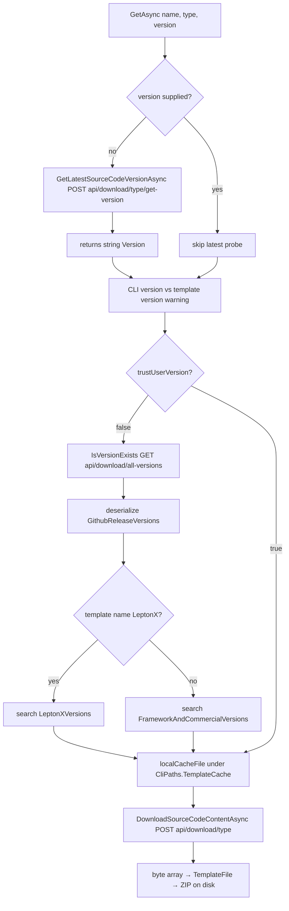
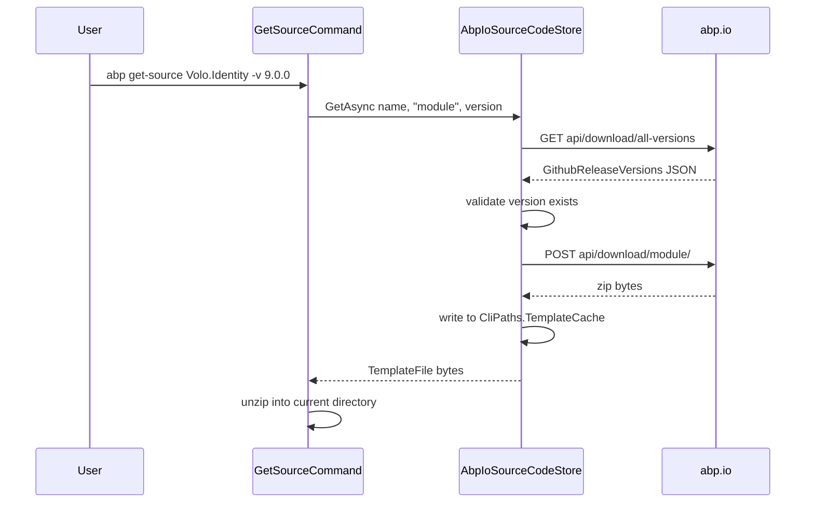
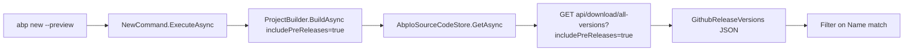

The ABP Framework CLI never clones a repository to scaffold a project. Instead it goes through `abp.io` HTTP endpoints that front the `abpframework/abp` GitHub releases — that indirection lets the CLI authenticate paid customers, gate prereleases, and serve commercial templates. This page walks every type that participates in that flow: the `GithubRelease` model under `framework/src/Volo.Abp.Cli.Core/Volo/Abp/Cli/GitHub/`, the consumers in `AbpIoSourceCodeStore`, the version-validation rules, the local zip cache at `CliPaths.TemplateCache`, and the URL constants in `CliUrls`.

## The `GithubRelease` POCO

`framework/src/Volo.Abp.Cli.Core/Volo/Abp/Cli/GitHub/GithubRelease.cs` is the only type in the `Volo.Abp.Cli.GitHub` namespace and exists purely as a JSON contract — it mirrors the four fields the CLI cares about from a GitHub `releases` payload, decorated with `Newtonsoft.Json`'s `[JsonProperty]` so snake_case wire names survive round-tripping:

```csharp
[JsonObject]
[Serializable]
public class GithubRelease
{
    [JsonProperty("id")]
    public int Id { get; set; }

    [JsonProperty("name")]
    public string Name { get; set; }

    [JsonProperty("prerelease")]
    public bool IsPrerelease { get; set; }

    [JsonProperty("published_at")]
    public DateTime PublishTime { get; set; }
}
```

The type is intentionally minimal. The CLI never asks GitHub directly for release tarballs or commit metadata; it only needs to ask "does the version the user typed actually exist?" That single question is answered by enumerating these objects.

## Where the JSON comes from

The CLI does not hit `api.github.com`. Instead it calls `https://abp.io/api/download/all-versions?includePreReleases=true`, and that endpoint serves a `GithubReleaseVersions` envelope that holds two parallel `List<GithubRelease>` collections — one for framework/commercial packages, one for LeptonX. The envelope is declared as a private nested DTO inside `framework/src/Volo.Abp.Cli.Core/Volo/Abp/Cli/ProjectBuilding/AbpIoSourceCodeStore.cs`:

```csharp
public class GithubReleaseVersions
{
    public List<GithubRelease> FrameworkAndCommercialVersions { get; set; }

    public List<GithubRelease> LeptonXVersions { get; set; }
}
```

That split matters because LeptonX is versioned independently from the framework. When `AbpIoSourceCodeStore.IsVersionExists` is asked whether `"4.0.5"` is a real LeptonX release, it switches lists based on substring matching on the template name:

```csharp
return (templateName.Contains("LeptonX") || templateName.Contains("lepton-x")) ?
    versions.LeptonXVersions.Any(v => v.Name == version) :
    versions.FrameworkAndCommercialVersions.Any(v => v.Name == version);
```

## URL constants in `CliUrls`

Every GitHub-touching call routes through `framework/src/Volo.Abp.Cli.Core/Volo/Abp/Cli/CliUrls.cs`. Two of its fields directly target GitHub content:

| Field | Value | Purpose |
| --- | --- | --- |
| `LatestVersionCheckFullPath` | `https://raw.githubusercontent.com/abpframework/abp/dev/latest-versions.json` | Bypasses `abp.io` for the CLI-self-update check |
| `WwwAbpIo` | `https://abp.io/` | Base for `api/download/{type}/...` template endpoints |
| `AccountAbpIo` | `https://account.abp.io/` | OIDC + licensing — gates commercial template downloads |

The `latest-versions.json` URL is the one place the CLI talks to `raw.githubusercontent.com`. It is read by `PackageVersionCheckerService` (covered in [`/cli/cli-core-abstractions`](/cli/cli-core-abstractions)) to discover the newest framework release without paying the cost of a NuGet `index.json` round-trip.

## The download pipeline

The full GitHub-mediated download lives in `AbpIoSourceCodeStore.GetAsync`. It is a state machine over `version`, `templateSource`, and the local cache; the GitHub-related branches are the **latest-version probe** and the **existence check**.



Each box is a real method in the same file:

| Step | Method | HTTP verb / URL |
| --- | --- | --- |
| Probe latest | `GetLatestSourceCodeVersionAsync` | `POST {WwwAbpIo}api/download/{type}/get-version/` |
| Validate version exists | `IsVersionExists` | `GET {WwwAbpIo}api/download/all-versions?includePreReleases=true` |
| Map NuGet version | `GetTemplateNugetVersionAsync` | `POST {WwwAbpIo}api/download/{type}/get-nuget-version/` |
| Download bytes | `DownloadSourceCodeContentAsync` | `POST {WwwAbpIo}api/download/{type}/` |

The CLI uses `CliHttpClientFactory.CreateClient(timeout: TimeSpan.FromMinutes(5))` for the download so a slow connection on a 30 MB Pro template does not time out, but uses the default 2-minute client for the metadata calls.

## Version-mismatch warning

When the user does not pass `--trust-user-version`, the `GetAsync` method compares the requested template version against `CliVersionService.GetCurrentCliVersionAsync()` and shouts if they drift apart. Three rules trigger the warning:

1. Major or minor differs.
2. Major and minor are equal but the patch in the template is greater than in the CLI.
3. Major, minor, and patch are equal, both are prereleases, and the template's `-rcN` is higher than the CLI's `-rcN`.

The relevant excerpt:

```csharp
if (currentCliVersion.Major != templateVersion.Major || currentCliVersion.Minor != templateVersion.Minor)
{
    outputWarning = true;
}
else if (currentCliVersion.Major == templateVersion.Major &&
         currentCliVersion.Minor == templateVersion.Minor &&
         currentCliVersion.Patch < templateVersion.Patch)
{
    outputWarning = true;
}
```

If the local CLI happens to be the Studio CLI (its semantic version ends with `-studio`), the suggested fix is the bespoke `abp install-old-cli --version ...` command; otherwise the user is told to `dotnet tool uninstall -g volo.abp.cli` and reinstall. Either way the data driving the message comes from the GitHub release list deserialised through `GithubRelease`.

## SourceCodeDownloadInputDto

The request body that hits the `api/download/{type}/` endpoint is a five-field POCO declared as a nested public class inside `AbpIoSourceCodeStore`:

```csharp
public class SourceCodeDownloadInputDto
{
    public string Name { get; set; }
    public string Version { get; set; }
    public string Type { get; set; }
    public string TemplateSource { get; set; }
    public bool IncludePreReleases { get; set; }
}
```

`Type` is one of the `SourceCodeTypes` constants — `Template`, `Module`, or `Solution` — and decides which subdirectory the abp.io endpoint serves from. `TemplateSource` is null for normal downloads and is set when the user passes `--template-source` to `abp new`, in which case the URL or local path supplied is used verbatim and the abp.io endpoint is bypassed entirely. That is also why the `IsNetworkSource(string)` helper exists:

```csharp
private static bool IsNetworkSource(string source)
{
    return source.ToLower().StartsWith("http");
}
```

A non-HTTP `TemplateSource` is treated as a directory and combined with `"{name}-{version}.zip"` to read bytes from disk. That branch is the one CI systems exercise when they want every CLI call to be deterministic — for example by pre-staging templates on a build agent.

## Cache layout

Downloaded ZIPs land in `CliPaths.TemplateCache`, which is the `templates` subdirectory under the user's `~/.abp` root:

```csharp
public static string TemplateCache => Path.Combine(AbpRootPath, "templates");
public static readonly string AbpRootPath = Path.Combine(
    Environment.GetFolderPath(Environment.SpecialFolder.UserProfile),
    ".abp");
```

`AbpIoSourceCodeStore.GetAsync` computes the cache file name as `name.Replace("/", ".") + "-" + version + ".zip"`. The slash replacement matters because some template names — for example `Acme.BookStore/microservice` — contain path separators that would otherwise blow up `Path.Combine` on Windows. When `AbpCliOptions.CacheTemplates` is `true` (the default), every successful download is delete-then-write to that path so the next `abp new` for the same `(name, version)` short-circuits the GitHub round-trip.

The `#if DEBUG` block above the cache check is worth knowing about: when the CLI is built in `Debug`, an existing cache file is returned even when the developer passes a non-empty `templateSource`. That is what lets the framework team test changes against a local zip without re-publishing it to `abp.io`.

## Listing local templates

When the abp.io endpoint is unreachable and the user did not specify a version, the CLI falls back to whatever ZIPs are already cached. `AbpIoSourceCodeStore.GetLocalTemplates` walks `CliPaths.TemplateCache` and runs a regex that enumerates every known template name:

```csharp
var matches = Regex.Matches(stringBuilder.ToString(),
    $"({AppTemplate.TemplateName}|{AppNoLayersProTemplate.TemplateName}|{AppNoLayersTemplate.TemplateName}|{AppProTemplate.TemplateName}|{ModuleTemplate.TemplateName}|{ModuleProTemplate.TemplateName}|{ConsoleTemplate.TemplateName}|{WpfTemplate.TemplateName}|{MauiTemplate.TemplateName})-(.+).zip");
```

Each match becomes a `(TemplateName, Version)` tuple that gets logged to the user with a warning before the `CliUsageException("Use command: abp new Acme.BookStore -v version")` is thrown. This is the only place where the CLI's behaviour is materially different when GitHub is unreachable: every other code path either throws or relies on the user having pinned a version explicitly.

## TemplateFile result

The return type of `GetAsync` is a `TemplateFile` record (declared in `Volo.Abp.Cli.ProjectBuilding`) that bundles four things together: the raw zip bytes, the requested version, the latest available version, and the matching NuGet package version. The latest version is reported back to the caller so `NewCommand` can print the "you are not on the latest version" hint without a second HTTP round-trip:

```csharp
return new TemplateFile(fileContent, version, latestVersion, nugetVersion);
```

The NuGet version is asked for through a separate `POST` to `api/download/{type}/get-nuget-version/`. The two values differ when a template ships ahead of the framework — for instance when the framework is at `9.0.0` but `Acme.BookStore` is pinned at `9.0.2-acme`. The CLI uses the NuGet version when writing `<PackageReference>` entries during scaffolding so the new project's restore matches what the template was tested against.

## Authentication and the licensing handshake

The download endpoints are open for free templates but gated for commercial ones. `CliHttpClientFactory.CreateClient(needsAuthentication: true)` (the default) calls `httpClient.AddAbpAuthenticationToken()` which reads the OIDC access token from `CliPaths.AccessToken` (`~/.abp/cli/access-token.bin`) and sets it as the bearer header. From the server's perspective a download request is therefore:

```
POST https://abp.io/api/download/template/
Authorization: Bearer <opaque token from access-token.bin>
{
  "Name": "Acme.BookStore",
  "Type": "template",
  "Version": "9.0.0",
  "TemplateSource": null,
  "IncludePreReleases": false
}
```

The `LoginInfo.HasSourceCodeAccess` flag in `framework/src/Volo.Abp.Cli.Core/Volo/Abp/Cli/Auth/LoginInfo.cs` is the property that ultimately decides whether the server will respond with a `200 OK` containing the zip bytes or with a `403` that surfaces as a `UserFriendlyException`. That exception is caught and re-thrown inside `DownloadSourceCodeContentAsync`:

```csharp
catch (Exception ex)
{
    if(ex is UserFriendlyException)
    {
        Logger.LogWarning(ex.Message);
        throw;
    }
    // ...
}
```

## Downloading source code with `abp get-source`

`framework/src/Volo.Abp.Cli.Core/Volo/Abp/Cli/Commands/GetSourceCommand.cs` reuses the same `AbpIoSourceCodeStore` to grab the full source of a published ABP module. From a GitHub-integration perspective the command is interesting because it takes the `--source-code` switch on `abp new` to its logical conclusion: rather than producing a scaffolded solution, it asks `api/download/module/` for the `SourceCodeTypes.Module` payload that contains the unmodified module tree. The same `GithubRelease` list is consulted for version validation; the same cache directory holds the result.



## Failure-handling matrix

`AbpIoSourceCodeStore` exposes four distinct error pathways that the GitHub-mediated flow can trigger. Each one maps to a specific user message:

| Condition | Method | Thrown from |
| --- | --- | --- |
| `GetLatestSourceCodeVersionAsync` cannot reach abp.io | Caught and logged, `null` returned | `GetAsync` falls into the "find local templates" branch |
| `IsVersionExists` cannot reach abp.io | Caught, `true` returned | Optimistic — let download try anyway |
| `DownloadSourceCodeContentAsync` returns `UserFriendlyException` | Re-thrown after warning | License or version-not-found message |
| `DownloadSourceCodeContentAsync` throws anything else | Logged with URL, re-thrown | Verbatim stack to console |

The decision to return `true` from `IsVersionExists` on failure is deliberate. The CLI prefers to attempt the download and surface a clean `404` message from the abp.io side than to refuse to try at all when the version-list endpoint is briefly unavailable.

## CLI-self-update probe

`raw.githubusercontent.com/abpframework/abp/dev/latest-versions.json` is the only GitHub URL the CLI hits directly without going through `abp.io`. `CliService.CheckCliVersionAsync` calls it once per day (the rate limit lives in `MemoryService` under `CliConsts.MemoryKeys.LatestCliVersionCheckDate`) and prints a warning if the running CLI is older than the listed `volo.abp.cli` version. The check is deliberately decoupled from the template download path because the framework team needs to push the warning even when `abp.io` is unreachable.

The JSON has this approximate shape:

```json
{
  "Volo.Abp.Cli": "9.1.2",
  "Volo.Abp.Studio.Cli": "9.1.2",
  "LeptonX": "4.0.5"
}
```

`PackageVersionCheckerService.GetLatestStableVersionFromGithubAsync` deserialises the file and converts the version string into a `SemanticVersion`. The same response is reused for the general "what's the latest framework version?" question, which is why an `abp update` invocation does **not** itself shell out to `nuget.org` for the framework version unless `--check-all` is passed.

## Pre-release handling

`includePreReleases` is a boolean that the `abp new` command can flip via `--preview` or `-p`. When `true`, both `GetLatestSourceCodeVersionAsync` and `IsVersionExists` toggle the `?includePreReleases=true` query string, and the response now includes `GithubRelease` entries with `IsPrerelease == true`. The `Name` field of those entries follows NuGet's convention — `9.1.0-rc.1`, `9.1.0-preview-2024-12-05` — and is fed directly into `SemanticVersion.Parse`, which is why the framework's release-engineering team is careful never to publish a tag that is not a valid semver string.



## What this page does **not** cover

The NuGet feed indirection through `nuget.abp.io`, the MyGet-backed nightly feed, and the per-package version probes belong to `PackageVersionCheckerService` and are described in [`/cli/cli-core-abstractions`](/cli/cli-core-abstractions). The selection of which command to invoke after a successful download is covered in [`/cli/command-selector`](/cli/command-selector), and the post-download `install-libs` step that pulls in the JS dependencies is the subject of [`/cli/install-libs`](/cli/install-libs). For the Blazor bundling step that runs after a new project is scaffolded see [`/ui-mvc/bundling`](/ui-mvc/bundling).

## Cross-references

<CardGroup cols={2}>
  <Card title="CLI Overview" icon="map" href="/cli/overview">
    Where `AbpIoSourceCodeStore` sits in the host pipeline.
  </Card>
  <Card title="Command Selector" icon="route" href="/cli/command-selector">
    How `abp new` ends up calling `AbpIoSourceCodeStore.GetAsync` at all.
  </Card>
  <Card title="CLI Core Abstractions" icon="layer-group" href="/cli/cli-core-abstractions">
    `CliHttpClientFactory`, `CliPaths`, and `CliVersionService` underpinnings.
  </Card>
  <Card title="MVC Bundling" icon="boxes-packing" href="/ui-mvc/bundling">
    What runs after a downloaded template is unpacked.
  </Card>
</CardGroup>
