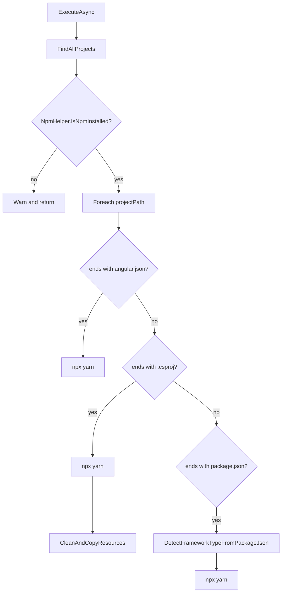
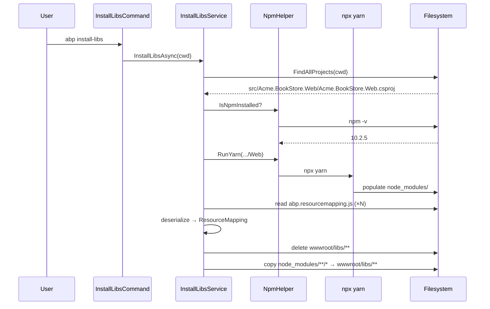

The ABP Framework ships dozens of UI assets — Bootstrap, jQuery validation, FontAwesome, and pieces of the DevExtreme/LeptonX themes — through NPM packages, but the resulting JavaScript and CSS files have to live under `wwwroot/libs` on disk so ASP.NET Core's static-file middleware can serve them. The `abp install-libs` command bridges that gap. It walks a directory, finds every project that looks like a web project, runs Yarn to populate `node_modules`, parses `abp.resourcemapping.js` files written by the templates, and finally copies the right subset of `node_modules` into `wwwroot/libs`. This page walks the implementation across `framework/src/Volo.Abp.Cli.Core/Volo/Abp/Cli/Commands/InstallLibsCommand.cs`, `framework/src/Volo.Abp.Cli.Core/Volo/Abp/Cli/LIbs/`, and the supporting `NpmHelper` shell-out under `framework/src/Volo.Abp.Cli.Core/Volo/Abp/Cli/Utils/NpmHelper.cs`.

## Command shape

`InstallLibsCommand` is a thin shell over `IInstallLibsService`. It has one option, `-wd | --working-directory`, and defaults to `Directory.GetCurrentDirectory()` if nothing is passed:

```csharp
public const string Name = "install-libs";

public async Task ExecuteAsync(CommandLineArgs commandLineArgs)
{
    var workingDirectoryArg = commandLineArgs.Options.GetOrNull(
        Options.WorkingDirectory.Short,
        Options.WorkingDirectory.Long
    );

    var workingDirectory = workingDirectoryArg ?? Directory.GetCurrentDirectory();

    if (!Directory.Exists(workingDirectory))
    {
        throw new CliUsageException(
            "Specified directory does not exist." +
            Environment.NewLine + Environment.NewLine +
            GetUsageInfo()
        );
    }

    await InstallLibsService.InstallLibsAsync(workingDirectory);
}
```

The short description is the user-facing line that the `help` command prints: `"Install NPM Packages for MVC / Razor Pages and Blazor Server UI types."` That description is slightly out of date — as of recent releases the service also handles React, React Native, Vue, and Next.js projects, which the next section makes explicit.

## The interface contract

`framework/src/Volo.Abp.Cli.Core/Volo/Abp/Cli/LIbs/IInstallLibsService.cs` is a single-method interface:

```csharp
public interface IInstallLibsService
{
    Task InstallLibsAsync(string directory);
}
```

The concrete `InstallLibsService` is `[ITransientDependency]` and is the entry point for the actual work. Note the directory casing: `LIbs` (capital I, lowercase b, lowercase s) — that typo is the real folder name on disk and the `Volo.Abp.Cli.LIbs` namespace reflects it.

## Project discovery

`InstallLibsService.FindAllProjects` is responsible for the "what counts as a project I should install libs into?" question. It performs three searches and merges the results, while honouring a directory-exclusion list:

```csharp
private readonly static List<string> ExcludeDirectory = new List<string>()
{
    "node_modules",
    ".git",
    ".idea",
    "_templates",
    Path.Combine("bin", "debug"),
    Path.Combine("obj", "debug")
};
```

The three searches look for `*.csproj`, `angular.json`, and `package.json` files. The `.csproj` filter is the most discriminating — a project file only qualifies if it sits next to a `package.json` and its file content contains one of three SDK strings:

```csharp
return fileTexts.Contains("Microsoft.NET.Sdk.Web") ||
       fileTexts.Contains("Microsoft.NET.Sdk.Razor") ||
       fileTexts.Contains("Microsoft.NET.Sdk.BlazorWebAssembly");
```

The `package.json` filter excludes any directory that is already covered by the Angular or `.csproj` filter, then runs `DetectFrameworkTypeFromPackageJson` to confirm it is one of the supported JavaScript frameworks. The merged list is sorted by path so output is deterministic.

| Marker file | Treated as | Yarn run? | Copy from node_modules? |
| --- | --- | --- | --- |
| `angular.json` | Angular workspace | Yes | No (Angular owns its own bundler) |
| `*.csproj` next to `package.json` | MVC / Razor Pages / Blazor Server / Blazor WASM | Yes | Yes — via `abp.resourcemapping.js` |
| `package.json` with `react-native` | React Native | Yes | No |
| `package.json` with `next` | Next.js | Yes | No |
| `package.json` with `vue` | Vue | Yes | No |
| `package.json` with `react` | React | Yes | No |

## Detecting the JavaScript framework

`DetectFrameworkTypeFromPackageJson` reads `dependencies` and `devDependencies` into a single `HashSet<string>` and short-circuits in the order React Native → Next.js → Vue → React. React Native must win against React because every React Native project also lists `react`:

```csharp
if (dependencies.Contains("react-native"))
{
    return JavaScriptFrameworkType.ReactNative;
}
if (dependencies.Contains("next"))
{
    return JavaScriptFrameworkType.NextJs;
}
if (dependencies.Contains("vue"))
{
    return JavaScriptFrameworkType.Vue;
}
if (dependencies.Contains("react"))
{
    return JavaScriptFrameworkType.React;
}
return JavaScriptFrameworkType.None;
```

The enum lives at the top of the same file:

```csharp
public enum JavaScriptFrameworkType
{
    None,
    ReactNative,
    React,
    Vue,
    NextJs
}
```

## Running Yarn

Every framework-detected project (and every `.csproj`-style web project) is handed to `NpmHelper.RunYarn`. The helper sits at `framework/src/Volo.Abp.Cli.Core/Volo/Abp/Cli/Utils/NpmHelper.cs` and is interesting for one reason: it shells out via `npx`, so the user does not have to globally install Yarn first.

```csharp
public void RunYarn(string directory)
{
    Logger.LogInformation($"Running Yarn on {directory}");
    CmdHelper.RunCmd($"npx yarn", directory);
}
```

Before doing anything else, `InstallLibsAsync` checks `NpmHelper.IsNpmInstalled` — which calls `npm -v` through `ICmdHelper.RunCmdAndGetOutput` and parses the result as a `SemanticVersion` — and bails out early with `"NPM is not installed, visit https://nodejs.org/en/download/ and install NPM"` when it cannot find a parseable version line.



## `abp.resourcemapping.js` and `ResourceMapping`

Once Yarn has populated `node_modules`, the `.csproj` branch calls `CleanAndCopyResources`. That method is where the file copy from `node_modules` to `wwwroot/libs` actually happens, and the rules for what to copy live in one or more `abp.resourcemapping.js` files that the templates ship in `src/<Project>.Web/`.

The file is a CommonJS module that exports an object literal, e.g.

```js
module.exports = {
    aliases: {
        "@bootstrap": "@node_modules/bootstrap"
    },
    clean: ["@libs"],
    mappings: {
        "@node_modules/bootstrap/dist/**/*": "@libs/bootstrap/"
    }
};
```

`CleanAndCopyResources` strips the `module.exports =` prefix and trims the trailing semicolon before letting `Newtonsoft.Json` deserialise it into a `ResourceMapping`:

```csharp
var mapping = Newtonsoft.Json.JsonConvert.DeserializeObject<ResourceMapping>(mappingFileContent
    .Replace("module.exports", string.Empty)
    .Replace("=", string.Empty).Trim().TrimEnd(';'));
```

Newtonsoft is required because System.Text.Json refuses unquoted property names; the JS source is valid JavaScript but not valid JSON, and Newtonsoft is permissive enough to read it anyway.

The `ResourceMapping` model in `framework/src/Volo.Abp.Cli.Core/Volo/Abp/Cli/LIbs/ResourceMapping.cs` carries three fields and seeds two well-known aliases:

```csharp
public ResourceMapping()
{
    Aliases = new Dictionary<string, string>
        {
            {"@node_modules", "./node_modules"},
            {"@libs", "./wwwroot/libs"},
        };
    Clean = new List<string>();
    Mappings = new Dictionary<string, string>();
}
```

`ReplaceAliases` walks `Mappings` and `Clean` and rewrites every `@node_modules` / `@libs` token to the real relative path. That is how a template author writes `"@libs/bootstrap/"` and it ends up resolving to `./wwwroot/libs/bootstrap/` on disk.

| Field | Type | Default | Used by |
| --- | --- | --- | --- |
| `Aliases` | `Dictionary<string,string>` | `@node_modules`, `@libs` | `ReplaceAliases` and merged from each mapping file |
| `Clean` | `List<string>` | `["./wwwroot/libs"]` (added by `InstallLibsService`) | `CleanDirsAndFiles` deletes matching files before copy |
| `Mappings` | `Dictionary<string,string>` | empty | `CopyResourcesToLibs` source → destination glob pairs |

## Aggregating multiple mapping files

A solution can have several `abp.resourcemapping.js` files — typically one in the host project and one in each MVC module that ships frontend assets. `CleanAndCopyResources` merges them all into a single `ResourceMapping` and uses `AddIfNotContains` to deduplicate keys:

```csharp
mapping.Clean.ForEach(c => resourceMapping.Clean.AddIfNotContains(c));
mapping.Aliases.ToList().ForEach(x =>
{
    resourceMapping.Aliases.AddIfNotContains(new KeyValuePair<string, string>(x.Key, x.Value));
});
mapping.Mappings.ToList().ForEach(x =>
{
    resourceMapping.Mappings.AddIfNotContains(new KeyValuePair<string, string>(x.Key, x.Value));
});
```

The merge order is alphabetical (the file scan uses `Directory.GetFiles` without an explicit sort), so authors should not rely on per-module overrides; the first key wins.

## Globbing with `Microsoft.Extensions.FileSystemGlobbing`

The actual file matching uses the same `Matcher` that ASP.NET Core uses for `appsettings.json` inclusion. `InstallLibsService.FindFiles` builds a `Matcher`, applies the include / exclude patterns, and returns the `FileMatchResult` records that `CopyResourcesToLibs` and `CleanDirsAndFiles` iterate:

```csharp
private List<FileMatchResult> FindFiles(string directory, params string[] patterns)
{
    var matcher = new Matcher();

    foreach (var pattern in patterns)
    {
        if (pattern.StartsWith("!"))
        {
            matcher.AddExclude(NormalizeGlob(pattern).TrimStart('!'));
        }
        else
        {
            matcher.AddInclude(NormalizeGlob(pattern));
        }
    }

    var result = matcher.Execute(new DirectoryInfoWrapper(new DirectoryInfo(directory)));

    return result.Files.Select(x => new FileMatchResult(Path.Combine(directory, x.Path), x.Stem)).ToList();
}
```

`NormalizeGlob` adds a trailing `/**` to anything that does not look like a file pattern, so `"@libs/bootstrap"` and `"@libs/bootstrap/"` both end up matching every file underneath. The `Stem` returned by the matcher is the path **relative to the matched prefix**, which is exactly what `CopyResourcesToLibs` needs to recreate the directory layout under the destination:

```csharp
foreach (var file in files)
{
    var destFilePath = Path.Combine(destPath, file.Stem);
    if (File.Exists(destFilePath))
    {
        continue;
    }

    Directory.CreateDirectory(Path.GetDirectoryName(destFilePath));
    File.Copy(file.Path, destFilePath);
}
```

Note the `File.Exists` short-circuit. The command is idempotent: re-running `abp install-libs` after a manual edit to a `libs/...` file will not overwrite it. That is a feature, not a bug — developers who patch a vendor file in place are not punished by the next install.

## `FileMatchResult`

The tuple-like record returned by `FindFiles` is the minimal `framework/src/Volo.Abp.Cli.Core/Volo/Abp/Cli/LIbs/FileMatchResult.cs`:

```csharp
public class FileMatchResult
{
    public string Path { get; }
    public string Stem { get; }

    public FileMatchResult(string path, string stem)
    {
        Path = path;
        Stem = stem;
    }
}
```

`Path` is the absolute source location inside `node_modules`; `Stem` is the relative path under the include pattern. Having both lets the copy step preserve directory structure without re-parsing globs.

## Clean before copy

`CleanDirsAndFiles` runs before the copy and deletes everything matching `resourceMapping.Clean` — typically the entire `./wwwroot/libs` tree. After deleting files, it walks the resulting directory list in reverse and removes any empty leftovers so stale empty folders do not survive across CLI versions:

```csharp
var directoryInfos = Directory.GetDirectories(Path.Combine(directory, resourceMapping.Clean.First()), "*", SearchOption.AllDirectories);
directoryInfos.Reverse();
foreach (var directoryInfo in directoryInfos)
{
    if (!Directory.EnumerateFileSystemEntries(directoryInfo).Any())
    {
        Directory.Delete(directoryInfo);
    }
}
```

The order matters: deleting `wwwroot/libs/bootstrap/css/` before `wwwroot/libs/bootstrap/` lets the parent directory become empty and qualify for deletion in the same pass.

## End-to-end example

The following diagram shows the full sequence when a developer runs `abp install-libs` in the root of a layered MVC template:



## What `package.json` and `yarn.lock` look like

The MVC web project's `package.json` is tiny and lists only the runtime UI dependencies. Yarn writes `yarn.lock` next to it during `npx yarn`. `bower.json` is not used by recent templates — the project moved off Bower years ago — but the directory exclusion list still keeps Bower-style trees out of the search by virtue of skipping `node_modules` directly. The CLI does not touch the lock files itself; whatever Yarn decides is persisted there and respected on subsequent runs.

## When `abp install-libs` runs automatically

The command is dispatched from two other places:

1. **At the end of `abp new`** — after `AbpIoSourceCodeStore` unzips the template and the `ProjectBuilder` writes files to disk, the new-project pipeline calls into the same `InstallLibsService.InstallLibsAsync(targetFolder)` so the developer's first `dotnet run` succeeds without a manual second step.
2. **At the end of `abp bundle`** — covered in [`/ui-mvc/bundling`](/ui-mvc/bundling), the bundler needs `wwwroot/libs` to be populated before it can scan for resources to roll up.

Each entry point ultimately calls the same `IInstallLibsService.InstallLibsAsync` method, which is why understanding this page covers all three.

## Exit conditions

`InstallLibsService.InstallLibsAsync` does not throw on "no project found"; it just logs an error and returns. That is a deliberate choice so a `dotnet new` script that always calls `abp install-libs --working-directory $TEMP` cannot fail a CI build merely because the temp directory was empty:

```csharp
if (!projectPaths.Any())
{
    Logger.LogError("No project found in the directory.");
    return;
}
```

The only CLI usage exceptions surfaced from the command come from `InstallLibsCommand` itself, and only when the `--working-directory` path is non-existent.

## Cross-references

<CardGroup cols={2}>
  <Card title="CLI Overview" icon="map" href="/cli/overview">
    How `install-libs` fits into the host loop.
  </Card>
  <Card title="Command Selector" icon="route" href="/cli/command-selector">
    Registration of `InstallLibsCommand` under the name `install-libs`.
  </Card>
  <Card title="CLI Core Abstractions" icon="layer-group" href="/cli/cli-core-abstractions">
    `ICmdHelper`, `NpmHelper`, and `CommandLineArgs` underpinnings.
  </Card>
  <Card title="MVC Bundling" icon="boxes-packing" href="/ui-mvc/bundling">
    The downstream step that consumes `wwwroot/libs`.
  </Card>
</CardGroup>
