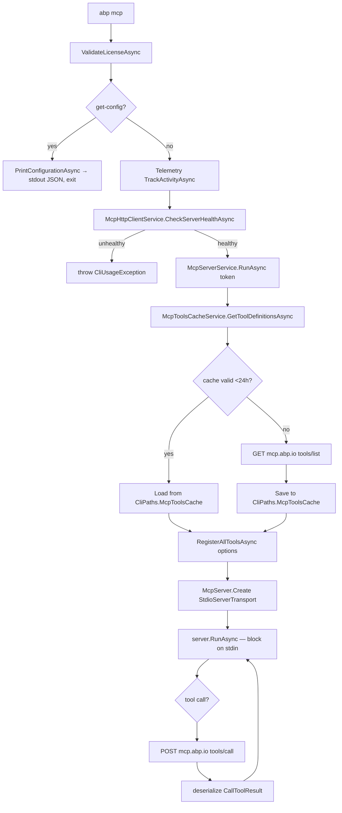
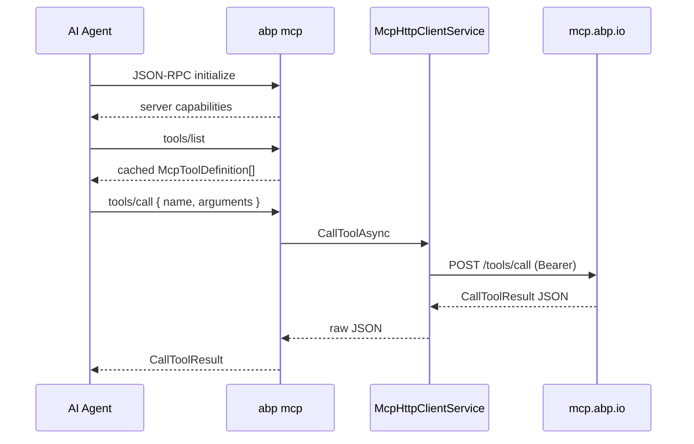

`abp mcp` turns the ABP Framework CLI into a Model Context Protocol (MCP) server that AI coding agents — Claude Code, Cursor, VS Code Copilot Agent — can call over JSON-RPC on stdio. The command does not ship the tool implementations inside the CLI binary; instead it pulls a list of tool definitions from `https://mcp.abp.io`, registers each one with the MCP runtime, and forwards every tool invocation back to the same HTTP endpoint while passing through the user's bearer token. This page explains the implementation: `framework/src/Volo.Abp.Cli.Core/Volo/Abp/Cli/Commands/McpCommand.cs`, the `McpServerService` / `McpHttpClientService` / `McpToolsCacheService` triad under `framework/src/Volo.Abp.Cli.Core/Volo/Abp/Cli/Commands/Services/`, and the licensing and logging side channels that keep stdout clean for the protocol.

## Command surface

`McpCommand` is named `mcp` and supports two operations:

| Sub-command | Behaviour |
| --- | --- |
| `abp mcp` | Starts the local stdio MCP server. Requires login and an active license. |
| `abp mcp get-config` | Prints the JSON snippet that an MCP client (e.g. Claude Desktop) needs in its config file. |

The `GetShortDescription` reads `"Runs the local MCP server and outputs client configuration for AI tool integration."` and the usage info confirms there are no other flags.

`McpCommand` is wired into the dependency-injection container with six services that together implement the protocol:

```csharp
public McpCommand(
    IApiKeyService apiKeyService,
    AuthService authService,
    McpServerService mcpServerService,
    McpHttpClientService mcpHttpClient,
    IMcpLogger mcpLogger,
    ITelemetryService telemetryService)
```

## License gate

Before a single byte of JSON-RPC traffic leaves the process, `ValidateLicenseAsync` is called. It enforces three preconditions:

```csharp
private async Task ValidateLicenseAsync()
{
    var loginInfo = await _authService.GetLoginInfoAsync();

    if (string.IsNullOrEmpty(loginInfo?.Organization))
    {
        throw new CliUsageException("Please log in with your account!");
    }

    var licenseResult = await _apiKeyService.GetApiKeyOrNullAsync();

    if (licenseResult == null || !licenseResult.HasActiveLicense)
    {
        var errorMessage = licenseResult?.ErrorMessage ?? "No active license found.";
        throw new CliUsageException(errorMessage);
    }

    if (licenseResult.LicenseEndTime.HasValue && licenseResult.LicenseEndTime.Value < DateTime.UtcNow)
    {
        throw new CliUsageException("Your license has expired. Please renew your license to use the MCP server.");
    }
}
```

The three checks correspond to three failure paths surfaced to the caller as `CliUsageException`. The first reads `~/.abp/cli/access-token.bin` through `AuthService`; the second hits `https://account.abp.io/api/license/api-key` through `AbpIoApiKeyService`; the third is a defence-in-depth date comparison against `DeveloperApiKeyResult.LicenseEndTime`.

## Why stdout matters

MCP servers and clients communicate over stdin/stdout with framed JSON-RPC. Anything else written to stdout corrupts the protocol stream. The CLI takes three precautions:

1. `CliService.RunAsync` skips the banner print when the command is `mcp`, by calling `CommandLineArgsExtensions.IsMcpCommand(args)`:

   ```csharp
   public static bool IsMcpCommand(this CommandLineArgs args)
   {
       return args.IsCommand(McpCommand.Name);
   }
   ```

2. The MCP runtime itself is constructed with `NullLoggerFactory.Instance`, so the `ModelContextProtocol` library cannot log to console:

   ```csharp
   var server = McpServer.Create(
       new StdioServerTransport("abp-mcp-server", NullLoggerFactory.Instance),
       options
   );
   ```

3. The CLI's own diagnostic output goes through `IMcpLogger`, which is implemented by `McpLogger` and writes to `CliPaths.McpLog` (a file under `~/.abp/cli/logs/mcp.log`) and stderr — never stdout.

## End-to-end flow



Each box is a method in the files listed above. The remaining sections trace the boxes left to right.

## `get-config` output

The `get-config` mode does not need a network or a login — it just prints a static snippet. The model lives in `framework/src/Volo.Abp.Cli.Core/Volo/Abp/Cli/Commands/Models/McpClientConfiguration.cs`:

```csharp
public class McpClientConfiguration
{
    [JsonPropertyName("mcpServers")]
    public Dictionary<string, McpServerConfig> McpServers { get; set; } = new();
}

public class McpServerConfig
{
    [JsonPropertyName("command")]
    public string Command { get; set; }

    [JsonPropertyName("args")]
    public List<string> Args { get; set; } = new();

    [JsonPropertyName("env")]
    public Dictionary<string, string> Env { get; set; }
}
```

`PrintConfigurationAsync` produces the canonical entry that drops into a client config:

```json
{
  "mcpServers": {
    "abp": {
      "command": "abp",
      "args": ["mcp"],
      "env": {}
    }
  }
}
```

The serializer uses `JsonNamingPolicy.CamelCase` and `WriteIndented = true`, so the output is copy-paste-ready for `claude_desktop_config.json` or VS Code's `mcp.json`.

## Health probe

Before booting the server, `McpHttpClientService.CheckServerHealthAsync()` performs a single GET against `https://mcp.abp.io`. If the probe fails, the user gets a `CliUsageException` instead of a half-initialised MCP server:

```csharp
if (!isHealthy)
{
    throw new CliUsageException(
        "Could not connect to ABP.IO MCP Server. " +
        "The MCP server requires a connection to fetch tool definitions. " +
        "Please check your internet connection and try again.");
}
```

The base URL is decided by `McpHttpClientService.GetMcpServerUrlInternalAsync`, which first looks at `CliPaths.McpConfig` (a JSON override under `~/.abp/cli/mcp-config.json`) and otherwise falls back to `CliConsts.DefaultMcpServerUrl = "https://mcp.abp.io"`.

## Tool registration

`McpServerService.RunAsync` is the body of the server. It builds `McpServerOptions`, asks the cache for the tool list, registers each tool, and finally creates the stdio server:

```csharp
public async Task RunAsync(CancellationToken cancellationToken = default)
{
    _mcpLogger.Info(LogSource, "Starting ABP MCP Server (stdio)");

    var options = new McpServerOptions();

    await RegisterAllToolsAsync(options);

    var server = McpServer.Create(
        new StdioServerTransport("abp-mcp-server", NullLoggerFactory.Instance),
        options
    );

    await server.RunAsync(cancellationToken);

    _mcpLogger.Info(LogSource, "ABP MCP Server stopped");
}
```

`RegisterAllToolsAsync` iterates the cached list and adds each one as an `AbpMcpServerTool`. The tool descriptor is just the metadata `(name, description, inputSchema)` — the actual implementation is a delegate that forwards the call back to the server.

```csharp
var tool = new AbpMcpServerTool(
    name,
    description,
    JsonSerializer.SerializeToElement(inputSchema, JsonCamelCaseOptions),
    outputSchema,
    (context, cancellationToken) => HandleToolInvocationAsync(name, context, cancellationToken)
);

options.ToolCollection.Add(tool);
```

`HandleToolInvocationAsync` is what makes the CLI a stateless proxy:

```csharp
var argumentsJson = JsonSerializer.SerializeToElement(context.Params.Arguments);
var resultJson = await _mcpHttpClient.CallToolAsync(toolName, argumentsJson);

var callToolResult = TryDeserializeResult(resultJson, toolName);
if (callToolResult != null)
{
    LogToolResult(toolName, callToolResult);
    return callToolResult;
}

return CreateErrorResult(ToolErrorMessages.InvalidResponseFormat);
```

The CLI never executes a tool itself. Everything is a `POST {baseUrl}/tools/call` body that contains `{ "name": toolName, "arguments": <JsonElement> }`. The returned JSON is deserialised into MCP's `CallToolResult`, and a `null` from deserialisation is replaced with a generic "invalid response format" error so the client always sees protocol-valid output.

## Tool definition cache

Tool definitions change infrequently — they are essentially the contract the AI agent will speak. `McpToolsCacheService` caches them on disk for 24 hours under `CliPaths.McpToolsCache` (`~/.abp/cli/mcp-tools.json`):

```csharp
public async Task<List<McpToolDefinition>> GetToolDefinitionsAsync()
{
    if (await IsCacheValidAsync())
    {
        var cachedTools = await LoadFromCacheAsync();
        if (cachedTools != null)
        {
            _mcpLogger.Debug(LogSource, "Using cached tool definitions");
            _mcpHttpClient.InitializeToolNames(cachedTools);
            return cachedTools;
        }
    }

    _mcpLogger.Info(LogSource, "Fetching tool definitions from server...");
    var tools = await _mcpHttpClient.GetToolDefinitionsAsync();
    // ...
    await SaveToCacheAsync(tools);
    await _memoryService.SetAsync(CliConsts.MemoryKeys.McpToolsLastFetchDate, DateTime.Now.ToString(CultureInfo.InvariantCulture));
    return tools;
}
```

The cache validity check is two-pronged: the file under `CliPaths.McpToolsCache` must exist, and the `MemoryService` must hold a recent `McpToolsLastFetchDate` (within `CacheValidityHours = 24`). When the cache is hit, the in-memory whitelist of valid tool names is rebuilt by calling `_mcpHttpClient.InitializeToolNames(cachedTools)`.

| Constant | Value | File |
| --- | --- | --- |
| `CliConsts.DefaultMcpServerUrl` | `"https://mcp.abp.io"` | `CliConsts.cs` |
| `CliConsts.McpLogLevelEnvironmentVariable` | `"ABP_MCP_LOG_LEVEL"` | `CliConsts.cs` |
| `CliConsts.MemoryKeys.McpToolsLastFetchDate` | `"McpToolsLastFetchDate"` | `CliConsts.cs` |
| `CliPaths.McpToolsCache` | `~/.abp/cli/mcp-tools.json` | `CliPaths.cs` |
| `CliPaths.McpLog` | `~/.abp/cli/logs/mcp.log` | `CliPaths.cs` |
| `CliPaths.McpConfig` | `~/.abp/cli/mcp-config.json` | `CliPaths.cs` |
| `CacheValidityHours` | `24` | `McpToolsCacheService.cs` |

## Whitelist validation on tool calls

`McpHttpClientService.CallToolAsync` refuses tool names that are not in the loaded whitelist. This is deliberate hardening against a misbehaving client that tries to invoke a tool the server never advertised:

```csharp
public async Task<string> CallToolAsync(string toolName, JsonElement arguments)
{
    if (!_toolDefinitionsLoaded)
    {
        throw new CliUsageException("Tool definitions have not been loaded yet. This is an internal error.");
    }

    if (_validToolNames != null && !_validToolNames.Contains(toolName))
    {
        _mcpLogger.Warning(LogSource, $"Attempted to call unknown tool: {toolName}");
        return CreateErrorResponse($"Unknown tool: {toolName}");
    }
    // ...
}
```

Errors returned from the upstream server are passed through a `GetSanitizedHttpErrorMessage` translator so internal stack traces never reach the AI agent.

## Tool definition model

`framework/src/Volo.Abp.Cli.Core/Volo/Abp/Cli/Commands/Models/McpToolDefinition.cs` mirrors the MCP `tools/list` schema:

```csharp
public class McpToolDefinition
{
    public string Name { get; set; }
    public string Description { get; set; }
    public McpToolInputSchema InputSchema { get; set; }
    public JsonElement? OutputSchema { get; set; }
}

public class McpToolInputSchema
{
    public string Type { get; set; } = "object";
    public Dictionary<string, McpToolProperty> Properties { get; set; }
    public List<string> Required { get; set; }
}

public class McpToolProperty
{
    public string Type { get; set; }
    public string Description { get; set; }
}
```

`InputSchema` is what gets surfaced to the AI agent as the JSON-schema for argument validation; `OutputSchema` is optional and used when the upstream server wants the agent to validate responses too. `Name` is the wire identifier that the whitelist guards against.

## Bearer token plumbing

Every HTTP call out of `McpHttpClientService` passes `needsAuthentication: true` to `CliHttpClientFactory.CreateClient`, which in turn calls `httpClient.AddAbpAuthenticationToken()`. That extension reads `CliPaths.AccessToken` and adds it as a bearer header. The upstream MCP server therefore receives both the user identity and the licence claim — which is how it knows whether the caller is allowed to call any given tool.



## Cancellation

The stdio server is hosted under a `CancellationTokenSource` so a `Ctrl+C` cleanly tears the process down without leaving the client in a stuck state. `McpCommand.ExecuteAsync` wires both `Console.CancelKeyPress` and the resulting cancellation token into `_mcpServerService.RunAsync`:

```csharp
ConsoleCancelEventHandler cancelHandler = (sender, e) =>
{
    e.Cancel = true;
    _mcpLogger.Info(LogSource, "Shutting down ABP MCP Server...");

    try
    {
        cts.Cancel();
    }
    catch (ObjectDisposedException)
    {
        // CTS already disposed
    }
};

Console.CancelKeyPress += cancelHandler;

try
{
    await _mcpServerService.RunAsync(cts.Token);
}
catch (OperationCanceledException)
{
    // Expected when Ctrl+C is pressed
}
```

The `OperationCanceledException` swallow is necessary: under normal shutdown the protocol server raises `OperationCanceledException` from `server.RunAsync(cancellationToken)`, and propagating it to `Program.Main` would mark the exit code as a failure.

## Logging knobs

The `IMcpLogger` log level is read from `ABP_MCP_LOG_LEVEL` (see `CliConsts.McpLogLevelEnvironmentVariable`). The log file path is fixed at `CliPaths.McpLog` and rotates implicitly with whatever ABP's general logging settings are configured to do. Setting `ABP_MCP_LOG_LEVEL=Debug` is the recommended troubleshooting step when an agent reports "tool execution failed" — every tool call is recorded with arguments and (truncated) responses there.

## Why this command exists

The MCP server is the official channel through which ABP-aware AI agents can ask things like "scaffold a new module called Books" or "list all entities in the current solution". Hosting that logic in the CLI rather than as a separate process means:

- The MCP server inherits the user's already-saved login state from `CliPaths.AccessToken`.
- License enforcement is identical to every other CLI command — there is exactly one `IApiKeyService.GetApiKeyOrNullAsync` implementation, and it lives in [`/cli/cli-core-abstractions`](/cli/cli-core-abstractions).
- The user does not need to install another `dotnet tool`. `abp mcp` is shipped with every `Volo.Abp.Cli` release.

## Cross-references

<CardGroup cols={2}>
  <Card title="CLI Overview" icon="map" href="/cli/overview">
    Where the `mcp` command short-circuits the banner.
  </Card>
  <Card title="Command Selector" icon="route" href="/cli/command-selector">
    Selector behaviour for `IsMcpCommand`.
  </Card>
  <Card title="CLI Core Abstractions" icon="layer-group" href="/cli/cli-core-abstractions">
    `IApiKeyService`, `AuthService`, `MemoryService`, and `CliHttpClientFactory` underpinnings.
  </Card>
  <Card title="MVC Bundling" icon="boxes-packing" href="/ui-mvc/bundling">
    Companion command frequently invoked by the same agents.
  </Card>
</CardGroup>
